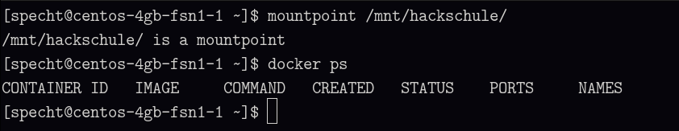

# Schnellstart: Workspace bei Hetzner Cloud hosten

Wenn du deinen eigenen Workspace bei Hetzner hosten möchtest, ist diese Anleitung die Richtige für dich.

## Voraussetzungen

Du benötigst:

- einen Hetzner-Account
- einen Public Key
- eine Domain oder Subdomain, die du auf deinen Server zeigen lassen kannst
- SMTP-Zugangsdaten für einen E-Mail-Account, von dem aus die Anmeldecodes versendet werden

## Schritt 0: Server und Volume anlegen

Erstelle einen Server:

- Cent OS Stream 10
- Shared vCPU (x86), zum Ausprobieren z. B. CPX21
- Gib gleich deinen SSH-Key an
- Servername: z. B. workspace-server

Erstelle ein Volume:

- 10 GB reichen zum ausprobieren (in meinem Workspace verwende ich 100 GB und es reicht momentan für 350 Nutzer:innen)
- Mount-Option: manuell (da wir nicht direkt XFS verwenden, sondern darunter noch VDO aufsetzen)

## Schritt 1: Server vorbereiten

Füge einen Eintrag in deine `~/.ssh/config` hinzu (oasse die Werte entsprechend an &ndash; trage unter `user` den Login ein, den du auf dem Server verwenden möchtest, in diesem Beispiel `max`):

```
host workspace-server
hostname 188.34.187.108
user max
port 22
identityFile /home/michael/.ssh/id_ed25519_hetzner
```

**Tipp:** Jetzt ist ein guter Zeitpunkt, um den A-Record deiner Domain(oder Subdomain) zu setzen, damit nachher alles bereit ist.

Verbinde dich als `root` mit deinem Server:

```
ssh root@workspace-server
```

Führe dann das 1. Setup-Skript aus:

```
curl --proto '=https' --tlsv1.2 -sSf https://raw.githubusercontent.com/specht/workspace/refs/heads/master/bootstrap/01-prepare-server.sh | sh
```

Das Skript installiert Ruby und lädt das nächste Skript herunter.

## Schritt 2: Server aufsetzen

Öffne die Datei `config.yaml` und trage deinen gewünschten Login sowie deinen public key ein. Um das »storage device« kümmern wir uns später.

```
login: max
public_key: ssh-ed25519 ...
storage_device:
```

Führe das 2. Setup-Skript aus (das dauert ungefähr 2 bis 3 Minuten):

```
./02-setup-server.sh
```

Wenn alles geklappt hat, kannst du den Server neu starten:

```
reboot
```

## Schritt 3: Storage konfigurieren

Da der Root-Login nun nicht mehr erlaubt ist, musst du dich nun ganz normal als mit dem Server verbinden:

```
ssh workspace-server
```

Werde zu root und gehe in das root-Home-Verzeichnis:

```
sudo su
cd
```

Bevor wir das 3. Skript ausführen können, müssen wir nachschauen, unter welchem Pfad sich das eingehängte Volume befindet:

```
fdisk -l
```

Das sieht z. B. so aus:

```
Disk /dev/sdb: 76.3 GiB, 81923145728 bytes, 160006144 sectors
Disk model: QEMU HARDDISK
Units: sectors of 1 * 512 = 512 bytes
Sector size (logical/physical): 512 bytes / 512 bytes
I/O size (minimum/optimal): 512 bytes / 512 bytes
Disklabel type: gpt
Disk identifier: F58BC630-D045-4C73-B3C9-274BCAC85655

Device      Start       End   Sectors  Size Type
/dev/sdb1    2048    133119    131072   64M EFI System
/dev/sdb2  133120    135167      2048    1M BIOS boot
/dev/sdb3  135168 160006110 159870943 76.2G Linux filesystem


Disk /dev/sda: 10 GiB, 10737418240 bytes, 20971520 sectors
Disk model: Volume
Units: sectors of 1 * 512 = 512 bytes
Sector size (logical/physical): 512 bytes / 512 bytes
I/O size (minimum/optimal): 512 bytes / 512 bytes
```

In diesem Beispiel liegt das eingerichtete 10 GB-Volume unter `/dev/sda`.

**Achtung:** Der Pfad zum eingehängten Volume kann sich nach dem Reboot geändert haben, falls du den Pfad also vorhin schon bestimmt hast, musst du jetzt unbedingt noch einmal schauen.

Trage diesen Pfad in die `config.yaml` ein:

```
login: max
public_key: ssh-ed25519 ...
storage_device: /dev/sda
```

Führe das 3. Setup-Skript aus (das dauert nicht lange):

```
./03-setup-storage.sh
```

Die besondere Situation im Workspace ist, dass wir viele Schüler:innen haben, die oft dieselben Dateien herunterladen. Deshalb verwenden wir VDO (Virtual Disk Optimizer), damit Daten dedupliziert gespeichert werden.

Melde dich vom Server ab und verbinde dich erneut, du solltest jetzt ein Banner sehen:


Oben siehst du in drei Zeilen die Festplattenbelegung:

- `/` wird sich mit Docker-Images füllen
- `/mnt/hackschule` ist eine logische Partition, die 3× so groß wie die physische Partition ist
- `(physical vdo)` ist die physische Partition – so viel Platz ist tatsächlich belegt (4 GB sind von Anfang an belegt, aber der Effekt wird später sichtbar)

Außerdem die Erinnerung für jeden Reboot:

- du musst `/mnt/hackschule` selbst mounten
- du musst den Docker-Service selbst starten

Probiere einmal, den Server neu zu starten und diese Schritte durchzuführen. Du solltest anschließend mit `mountpoint /mnt/hackschule` und `docker ps` sehen, dass beide Schritte erfolgreich waren:



## Schritt 4: Workspace vorbereiten

Klone das Repository in dein Home-Verzeichnis:

```
cd
git clone https://github.com/specht/workspace.git
cd workspace
```

Jetzt müssen wir ein paar Einstellungen für den Workspace vornehmen:

```
cp src/ruby/credentials.template.rb src/ruby/credentials.rb
```

Nimm folgende Änderungen vor:

- `DEVELOPMENT = false`
- `PATH_TO_HOST_DATA = "/mnt/hackschule/workspace"`
- trage deine Domain bei `WEBSITE_HOST` ein
- trage lange, zufällig generierte Passwörter ein bei:
  - `LOGIN_CODE_SALT`
  - `MYSQL_ROOT_PASSWORD`
  - `MYSQL_PASSWORD_SALT`
  - `POSTGRES_ROOT_PASSWORD`
  - `POSTGRES_PASSWORD_SALT`
  - `PGADMIN_PASSWORD`
  - `NEO4J_ROOT_PASSWORD`
  - `NEO4J_PASSWORD_SALT`
- trage deine E-Mail-Adresse als Admin-User ein:
  - `ADMIN_USERS = ['max@example.com']`
- passe die SMTP-Einstellungen für das E-Mail-Postfach an, von dem aus die Anmeldecodes versendet werden sollen

### 4.1 Workspace-Image bauen

Jetzt können wir das Docker-Image für den Workspace bauen (das geht relativ schnell und dauert nur ca. eine Minute):

```
./config.rb build
```

### 4.2 TIC-80 bauen

Als nächstes bauen wir unsere eigen Pro-Version von TIC-80 (das dauert ca. 3 bis 4 Minuten):

```
./build-tic80.sh
```

### 4.3 VS Code-Image bauen

Jetzt kommt ein Schritt, der etwas länger dauert – wir bauen das Image, das die Schülerinnen und Schüler nutzen, wenn sie ihren Workspace starten. Hier wird also alle mögliche Software installiert, die man im Workspace vielleicht einmal gebrauchen kann.

Achtung: dieser Vorgang dauert lange – ca.

```
./build-image.sh
```