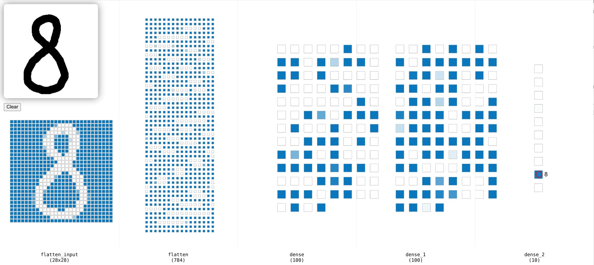

section: programming
image: digits.webp

# Trainiere ein neuronales Netzwerk

Trainiere ein einfaches neuronales Netzwerk, das handgeschriebene Ziffern oder Symbole erkennen kann.

In diesem Artikel bekommst du eine Schritt-für-Schritt-Anleitung. Lies sie genau und befolge einen Schritt nach dem anderen.

## Schritt 0: Vorbereitung

Stelle zuerst sicher, dass du keinen Ordner geöffnet hast. Um sicherzugehen, drücke einfach den Shortcut für »Ordner schließen«: StrgK und dann F. Drücke StrgShiftE, um die Seitenleiste mit dem Explorer-Tab zu öffnen. Dein Workspace sollte jetzt ungefähr so aussehen:

1. Für diese Anleitung brauchst du ein Repository, das du klonen kannst, indem du auf »Clone Repository« klickst. Gib die URL <a href='https://github.com/specht/digits-experiment.git' target='_blank'>https://github.com/specht/digits-experiment.git</a> ein und bestätige mit Enter.
  - Bestätige den Pfad `/workspace/` mit Enter.
  - Beantworte die Frage »Would you like to open the cloned repository?« mit »Open«.
2. Öffne die Datei `00-install-packages.ipynb`, klicke in den Code-Block und dann auf das Play-Symbol links neben dem Codeblock, um ihn auszuführen. Das klappt aber noch nicht, weil wir erst noch ein paar Pakete installieren müssen.
  - Bestätige die Meldung »Install / Enable suggested extensions« mit Enter.
  - Warte kurz, während Python und Jupyter installiert werden.
  - Bestätige die Meldung »Python Environments« und »★ Python 3.10.12«
  - Warte kurz, während weitere Pakete installiert werden, bis du die Meldung »✅ Pakete installiert« ganz unten unter dem Codeblock siehst.

## Schritt 1a: Trainingsmaterial herstellen

Du hast nun zwei Möglichkeiten: entweder verwendest du fertige Scans mit handgeschriebenen Ziffern, oder du schreibst selbst Ziffern &ndash; das ist natürlich viel spannender, weil du in diesem Fall dein neuronales Netzwerk mit deinen eigenen Daten trainieren wirst. In jedem Fall brauchst du mindestens zwei Seiten mit handgeschriebenen Ziffern als Trainingsmaterial.

<b>Variante 1: Fertige Scans verwenden</b>

Du kannst diese Seiten hier herunterladen und per Drag & Drop in deinem Workspace in das Verzeichnis `01-pages` ziehen:

<b>Variante 2: Ziffern selbst schreiben</b>

Drucke <a href='/docs/grid-digits.pdf'>diese PDF-Vorlage</a> zweimal aus und trage in jedes Feld die entsprechenden Ziffern ein. Scanne die Blätter anschließend mit einer Auflösung von 300 dpi, speichere sie im PNG-Format und ziehe sie per Drag & Drop in deinen Workspace in das Verzeichnis `01-pages`.

Tipp: Wenn du deinen eigenen Blätter beschreibst, kannst du statt Ziffern auch Symbole verwenden. Dadurch ist dein neuronales Netzwerk später in der Lage, diese Symbole zu erkennen.

## Schritt 1b: Trainingsmaterial vorbereiten

Öffne die Datei `01-prepare-training-data.ipynb`, lies die Abschnitte genau und führe die einzelnen Schritte aus. Achte darauf, dass deine Zwischenergebnisse korrekt sind. Nur so kannst du am Ende sicher sein, dass du ein gutes neuronales Netzwerk trainierst.

Wenn am Ende alle Schritte erfolgreich durchgelaufen sind, schau dir die Bilder im Verzeichnis `04-sheets` an – hier siehst du das rohe Trainingsmaterial, sortiert nach Ziffer, mit dem wir im nächsten Schritt das Training beginnen.

## Schritt 2: Modell trainieren

Öffne die Datei `02-train-model.ipynb`, lies die Abschnitte genau und führe die einzelnen Schritte aus.

Am Ende kannst du dein Modell testen, indem du rechts unten auf »Go Live« drückst. Es öffnet sich eine Seite, auf der du Ziffern schreiben kannst und währenddessen siehst, wie dein Modell die Ziffern erkennt (klicke mit links, um zu zeichnen und mit rechts, um zu löschen). Rechts siehst du die Vorhersage des Modells.

Da dieses Modell eine sehr einfache Architektur hat, kann es zu falschen Vorhersagen kommen. Das ist normal und zeigt, dass das Modell noch nicht perfekt ist. Im nächsten Schritt wirst du lernen, wie du das Modell verbessern kannst.

## Schritt 3: Modell verbessern

Um unser Modell zu verbessern, können wir ein [Convolutional Neural Network](https://de.wikipedia.org/wiki/Convolutional_Neural_Network) (CNN) verwenden. Dabei werden die Pixel nicht mehr unabhängig voneinander betrachtet, sondern unter Berücksichtigung ihrer Lage zueinander.

Um ein CNN zu verwenden, scrolle nach oben zum Abschnitt »Architektur des Modells« und setze die Variable `use_model` auf den Wert 2. Führe dann diesen und alle folgenden Codeblöcke erneut aus.

Wenn du jetzt dein Modell trainierst, wirst du sehen, dass es besser ist als das vorherige Modell. Noch besser wird es, wenn du mehr Trainingsmaterial hinzufügst. Dazu kannst du entweder neue Blätter verwenden oder dich hier bedienen:

Um die neuen Blätter zu verwenden, ziehe sie per Drag & Drop in das Verzeichnis `01-pages` und führe dann alle Schritte erneut aus.