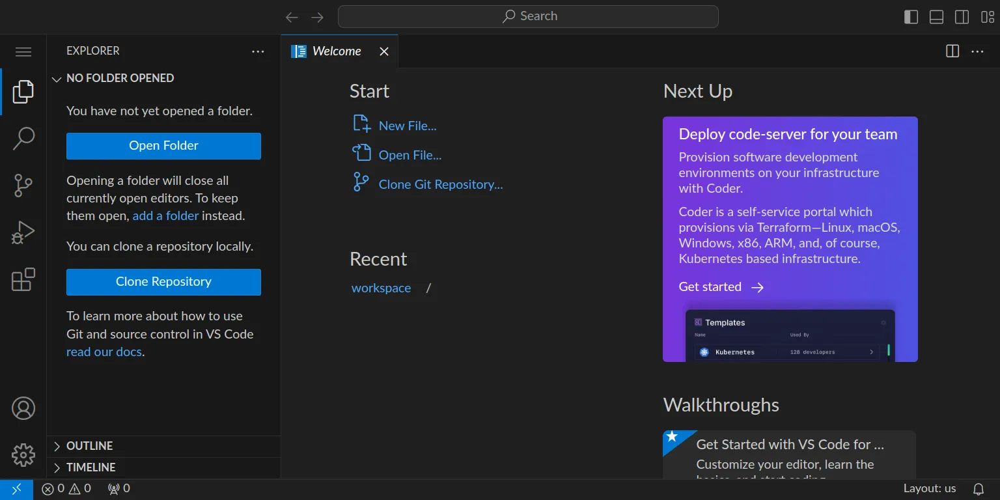

section: programming
image: digits.webp

# Trainiere ein neuronales Netzwerk

Trainiere ein einfaches neuronales Netzwerk, das handgeschriebene Ziffern oder Symbole erkennen kann.

In diesem Artikel bekommst du eine Schritt-für-Schritt-Anleitung. Lies sie genau und befolge einen Schritt nach dem anderen.

## Schritt 0: Vorbereitung

Stelle zuerst sicher, dass du keinen Ordner geöffnet hast. Um sicherzugehen, drücke einfach den Shortcut für »Ordner schließen«: StrgK und dann F. Dein Workspace sollte jetzt ungefähr so aussehen:

1. Für diese Anleitung brauchst du ein Repository, das du klonen kannst, indem du auf »Clone Repository« klickst. Gib die URL `https://github.com/specht/digits-experiment.git` ein und bestätige mit Enter.
2. Bestätige den Pfad `/workspace/` mit Enter.
3. Beantworte die Frage »Would you like to open the cloned repository?« mit »Open«.
4. Öffne die Datei `00-install-packages.ipynb`, klicke in den Code-Block und dann auf das Play-Symbol links neben dem Codeblock, um ihn auszuführen. Das klappt aber noch nicht, weil wir erst noch ein paar Pakete installieren müssen. Bestätige die Meldung »Install / Enable suggested extensions« mit Enter.
5. Warte kurz, während Python und Jupyter installiert werden.
6. Bestätige die Meldung »Python Environments« und »★ Python 3.10.12«
7. Warte kurz, während weitere Pakete installiert werden, bis du die Meldung »✅ Pakete installiert« ganz unten unter dem Codeblock siehst.
7. Herzlichen Glückwunsch! Du hast die Vorbereitung abgeschlossen.

## Schritt 1a: Trainingsmaterial herstellen

Du hast nun zwei Möglichkeiten: entweder verwendest du fertige Scans mit handgeschriebenen Ziffern, oder du schreibst selbst Ziffern &ndash; das ist natürlich viel spannender, weil du dein neuronales Netzwerk mit deinen eigenen Daten trainieren wirst. In jedem Fall brauchst du mindestens zwei Seiten mit handgeschriebenen Ziffern als Trainingsmaterial.

<b>Variante 1: Fertige Scans verwenden</b>

Du kannst diese Seiten hier herunterladen und per Drag & Drop in deinem Workspace in das Verzeichnis `01-pages` ziehen:

<b>Variante 2: Ziffern selbst schreiben</b>

Drucke <a href='/docs/grid-digits.pdf'>diese PDF-Vorlage</a> zweimal aus und trage in jedes Feld die entsprechenden Ziffern ein. Scanne die Blätter anschließend mit einer Auflösung von 300 dpi, speichere sie im PNG-Format und ziehe sie per Drag & Drop in deinen Workspace in das Verzeichnis `01-pages`.

Tipp: Wenn du deinen eigenen Blätter beschreibst, kannst du statt Ziffern auch Symbole verwenden. Dadurch ist dein neuronales Netzwerk später in der Lage, diese Symbole zu erkennen.

## Schritt 1b: Trainingsmaterial vorbereiten

Öffne die Datei `01-prepare-training-data.ipynb`, lies die Abschnitte genau und führe die einzelnen Schritte aus. Achte darauf, dass deine Zwischenergebnisse korrekt sind. Nur so kannst du am Ende sicher sein, dass du ein gutes neuronales Netzwerk trainierst.

Wenn am Ende alle Schritte erfolgreich durchgelaufen sind, schau dir die Bilder im Verzeichnis `04-sheets` an – hier siehst du das rohe Trainingsmaterial, sortiert nach Ziffer, mit dem wir im nächsten Schritt das Training beginnen.

## Schritt 2: Modell trainieren

Öffne die Datei `02-train-model.ipynb`, lies die Abschnitte genau und führe die einzelnen Schritte aus.