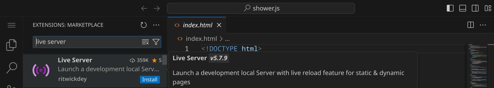

<div class='meta'>
image: title.webp
</div>

# 3D-Grafik mit Anaglyphen

<p class='abstract'>
Anaglyphen sind Bilder, bei denen zwei Bilder in verschiedenen Farben übereinandergelegt werden, um einen 3D-Effekt zu erzeugen. Farbfilter in der 3D-Brille trennen die beiden Bilder, sodass jedes Auge nur eines der Bilder sieht. Dadurch entsteht der Eindruck von Tiefe und räumlicher Wahrnehmung. In diesem Tutorial lernst du, wie du verschiedene Körper in 3D mit Anaglyphen darstellen kannst.
</p>

Stelle zuerst sicher, dass du keinen Ordner geöffnet hast. Um sicherzugehen, drücke einfach den Shortcut für »Ordner schließen«: <span class='key'>Strg</span><span class='key'>K</span> und dann <span class='key'>F</span>. Dein Workspace sollte jetzt ungefähr so aussehen:


## Repository klonen

Für diese Anleitung brauchst du ein Repository, das du klonen kannst, indem du auf den blauen Button »Clone Repository« klickst. Gib die folgende URL ein und bestätige mit <span class='key'>Enter</span>:

```bash
https://github.com/specht/anaglyph.git
```


Als nächstes musst du angeben, in welches Verzeichnis du das Repository klonen möchtest. Bestätige den Standardpfad `/workspace/` mit <span class='key'>Enter</span>.


Beantworte die Frage »Would you like to open the cloned repository?« mit »Open«.


Wenn du auf der linken Seite im Explorer nun die Datei `scene.ini` siehst, hast du alles richtig gemacht. Diese Datei enthält die Anweisungen für die 3D-Szene, die du erstellen wirst.


## Erweiterung installieren

Bevor du loslegen kannst, musst du noch eine Erweiterung installieren.
Öffne dazu links die Extensions, suche die Erweiterung »Live Server« und klicke auf »Install«, um die Erweiterung zu installieren:




Wenn alles geklappt hat, solltest du unten rechts den Eintrag »Go Live« sehen. Wenn du darauf klickst, öffnet sich ein neues Tab in deinem Browser mit deiner 3D-Szene, die anfangs nur aus einem einzigen Würfel besteht.

<div style='clear: both;'></div>

<div class='hint'>
Tipp: Ziehe deinen Workspace und die Vorschau nebeneinander, damit du deine Änderungen live sehen kannst.
</div>

## Geometrische Objekte

Du solltest einen Würfel sehen, der in der Mitte des Bildschirms schwebt. Benutze die Maus, um die Szene zu drehen und zu zoomen.

<div style='text-align: center; margin: 1em 0;'>

</div>


Öffne die Datei `scene.ini`, indem du drauf klickst. Du solltest nun den Inhalt der Datei sehen, der ungefähr so aussieht:

```ini
shape = box
```

Ändere den Wert `box` in `sphere`, um den Würfel durch eine Kugel zu ersetzen:

```ini
shape = sphere
```

Speichere die Datei mit <span class='key'>Strg</span><span class='key'>S</span> und schaue dir die Vorschau an. Du solltest nun eine Kugel sehen:

<div style='text-align: center; margin: 1em 0;'>

</div>

<div class='hint'>
Falls sich die Vorschau nicht automatisch aktualisiert, klicke auf den »Refresh«-Button in deinem Browser oder drücke <span class='key'>F5</span>.
</div>

Probiere auch andere Formen aus, indem du den Wert für `shape` änderst. Hier sind die Formen, die du verwenden kannst:

- `box` für einen Würfel
- `sphere` für eine Kugel
- `cylinder` für einen Zylinder
- `cone` für einen Kegel
- `torus` für einen Torus (Ring)
- `plane` für ein Quadrat

Zusätzlich zu den geometrischen Körpern kannst auch ein Gitter anzeigen, indem du `shape = grid` einfügst:

```ini
shape = grid
shape = sphere
```

<div style='text-align: center; margin: 1em 0;'>

</div>


Du kannst auch mehrere Formen kombinieren, indem du sie untereinander schreibst. Zum Beispiel:

```ini
shape = torus
shape = sphere
```

<div style='text-align: center; margin: 1em 0;'>

</div>

## Objekte verschieben

Um Objekte zu verschieben, kannst du den Befehl `move` verwenden:

```ini
shape = grid

shape = box
move = 100, 0, 0
```

<div style='text-align: center; margin: 1em 0;'>

</div>

Dabei gibt `move = 100, 0, 0` an, dass das Objekt um 100 Einheiten nach rechts verschoben wird. Die drei Werte stehen für die Verschiebung in den X-, Y- und Z-Richtungen.

Die Richtungen sind wie folgt:

- die X-Achse verläuft von links nach rechts
- die Y-Achse verläuft von unten nach oben
- die Z-Achse verläuft von hinten nach vorn

Ein positiver Wert verschiebt das Objekt also nach rechts (X), nach oben (Y) oder nach vorne (Z), während ein negativer Wert es nach links, nach unten oder nach hinten verschiebt.

**Aufgabe:** Versuche, die folgende Szene zu erstellen, indem du vier Würfel erstellst:

- ein Würfel in der Mitte
- ein Würfel rechts daneben
- ein Würfel darüber
- ein Würfel davor

<div class='hint'>
Tipp: Du musst die Szene mit der Maus ein bisschen drehen, um alle Würfel gut zu sehen.
</div>

<div style='text-align: center; margin: 1em 0;'>

</div>

<div style='display: none;'>

```ini
shape = grid

shape = box

shape = box
move = 100, 0, 0

shape = box
move = 0, 100, 0

shape = box
move = 0, 0, 100
```

</div>

## Objekte rotieren

Um Objekte zu drehen, kannst du den Befehl `rotate` verwenden:

```ini
shape = grid

shape = box
rotate = 0, 30, 0
move = -100, 0, 0

shape = box

shape = box
rotate = 30, 0, 0
move = 100, 0, 0
```

<div style='text-align: center; margin: 1em 0;'>

</div>

Du siehst hier ein Gitter und drei Würfel:

- der erste Würfel ist um 30 Grad um die Y-Achse gedreht und nach links verschoben
- der zweite Würfel ist ganz normal in der Mitte
- der dritte Würfel ist um 30 Grad um die X-Achse gedreht und nach rechts verschoben

**Aufgabe:** Versuche, die folgende Szene zu erstellen, indem du drei Würfel erstellst und rotierst:

<div style='text-align: center; margin: 1em 0;'>

</div>

<div style='display: none;'>

```ini
shape = box
rotate = 0, 0, -30

shape = box
rotate = 0, 0, 0

shape = box
rotate = 0, 0, 30
```
</div>

## Objekte skalieren

Um die Größe von Objekten mit einem Faktor zu multiplizieren, kannst du den Befehl `scale` verwenden:

```ini
shape = grid

shape = sphere
scale = 0.5
move = -100, 0, 0

shape = sphere
move = 0, 0, 0

shape = sphere
scale = 1.8
move = 100, 0, 0
```

In diesem Beispiel siehst du ein Gitter und drei Kugeln:

- die erste Kugel ist halb so groß wie die normale Kugel und nach links verschoben
- die zweite Kugel ist normal groß und in der Mitte
- die dritte Kugel ist 1,8-mal so groß wie die normale Kugel und nach rechts verschoben

<div class='hint books'>
Achtung: Beim Programmieren musst du meistens Kommazahlen mit einem Punkt schreiben, also <code>1.8</code> und nicht <code>1,8</code>. Wenn du ein Komma eingibst, werden die Nachkommastellen ignoriert und die Zahl wird als ganze Zahl interpretiert.
</div>

<div style='text-align: center; margin: 1em 0;'>

</div>

Du kannst ein Objekt auch in alle drei Richtungen unterschiedlich skalieren, indem du drei Werte angibst:

```ini
shape = grid

shape = sphere
scale = 1, 0.2, 1
```

Hier wurde eine Kugel nur in der Y-Richtung verkleinert (auf 20%), sodass sie wie eine Scheibe aussieht:

<div style='text-align: center; margin: 1em 0;'>

</div>

**Aufgabe:** Versuche, die folgende Szene zu erstellen, indem du eine Box erstellst und sie auf die zehnfache Breite skalierst. Verschiebe die Box anschließend um 25 Einheiten nach oben, so dass sie auf dem Gitter aufliegt:

<div style='text-align: center; margin: 1em 0;'>

</div>

## Transformationen kombinieren

Verschiebungen, Drehungen und Skalierungen nennt man auch Transformationen. Du kannst mehrere Transformationen kombinieren, indem du sie hintereinander schreibst. Zum Beispiel:

```ini
shape = grid

shape = box
rotate = 0, 0, 45
move = 100, 0, 0
```

Hier wurde ein Würfel zuerst um 45 Grad um die Z-Achse gedreht und dann um 100 Einheiten nach rechts verschoben. Das Ergebnis sieht so aus:

<div style='text-align: center; margin: 1em 0;'>

</div>

Dabei ist es wichtig, in welcher Reihenfolge du die Transformationen angibst. Wenn du zuerst verschiebst und dann drehst, sieht das Ergebnis anders aus:

```ini
shape = grid

shape = box
move = 100, 0, 0
rotate = 0, 0, 45
```
<div style='text-align: center; margin: 1em 0;'>

</div>

Dieser Würfel schwebt jetzt über dem Gitter, weil er zuerst nach rechts verschoben wurde und danach erst um 45 Grad um die Z-Achse gedreht wurde, denn: jede Drehung findet immer um den Ursprung statt (und jede Skalierung auch).

## Farben und Schattierung

Du kannst die Farben der Objekte kontrollieren, um verschiedene Effekte zu erzielen:

<div style='text-align: center; margin: 1em 0; width: 100%;'>


</div>
<div style='text-align: center; margin: 1em 0; width: 100%; background-color: #000;'>


</div>

Dafür stehen dir vier Befehle zur Verfügung:

- `background` für die Hintergrundfarbe: `0.0` bis `1.0` für schwarz bis weiß
- `stroke` für die Strichfarbe:  `0.0` bis `1.0` für schwarz bis weiß / `off` für kein Strich
- `fill` für die Füllfarbe: `0.0` bis `1.0` für schwarz bis weiß / `off` für keine Füllung
- `shade` für 3D-Schattierung: `on` für 3D-Schattierung / `off` für keine 3D-Schattierung

Im folgenden Beispiel schalten wir die Strichfarbe aus und die 3D-Schattierung ein:

```ini
shape= grid

shape = torus
shade = on
stroke = off
```

<div style='text-align: center; margin: 1em 0;'>

</div>

### Anaglyph-Effekt ausschalten

Falls du gar keine 3D-Brille hast oder die 3D-Effekte nicht sehen möchtest, kannst du den Anaglyph-Effekt ausschalten, indem du die Zeile `anaglyph = off` hinzufügst:

<div style='text-align: center; margin: 1em 0;'>

</div>

## Code auskommentieren

Manchmal möchte man Teile eines Programms vorübergehend deaktivieren, ohne sie zu löschen. Dafür kannst du Zeilen auskommentieren, indem du ein Semikolon `;` am Anfang der Zeile setzt. Zum Beispiel:

```ini
;shape = grid
shape = box
```

<div class='hint'>
Tipp: Statt eines Semikolons (<code>;</code>) kannst du auch ein Hashtag (<code>#</code>) verwenden, um eine Zeile auszukommentieren.
</div>

Um schnell ganze Blöcke auszukommentieren, kannst du mehrere Zeilen markieren und dann <span class='key'>Strg</span><span class='key'>K</span> und <span class='key'>Strg</span><span class='key'>C</span> (für »comment«) drücken. Um die Kommentare wieder zu entfernen, markiere die Zeilen und drücke <span class='key'>Strg</span><span class='key'>K</span> und <span class='key'>Strg</span><span class='key'>U</span> (für »uncomment«). Es gibt auch weitere Shortcuts dafür, die du im Menü finden kannst.

## Animationen

Während deine Szene angezeigt wird, läuft im Hintergrund eine Uhr mit. Die Anzahl der Sekunden seit dem Start der Szene wird in der Variablen `t` gespeichert. Du kannst diese Variable verwenden, um Animationen zu erstellen:

```ini
shade = on
shape = torus
rotate = 0, t * 30, 0
```

In diesem Beispiel wird der Torus um 30 Grad pro Sekunde um die Y-Achse gedreht. Das bedeutet, dass er nach 3 Sekunden 90 Grad geschafft hat und nach 12 Sekunden eine volle Umdrehung gemacht hat.

<div style='text-align: center; margin: 1em 0;'>
<video src='animation1.mp4' autoplay loop muted></video>
</div>

**Profitipp:** Mit Hilfe der Sinus- und Cosinusfunktionen kannst du auch sanfte Bewegungen erzeugen:

```ini
shade = on
shape = box
rotate = cos(t * 2) * 10, 0, sin(t * 3) * 10
```

<div style='text-align: center; margin: 1em 0;'>
<video src='animation2.mp4' autoplay loop muted></video>
</div>


**Aufgabe:** Erstelle eine Animation, bei der die Sonne in der Mitte steht und die Erde um die Sonne kreist. Der Mond soll dabei um die Erde kreisen:

<div style='text-align: center; margin: 1em 0;'>
<video src='animation3.mp4' autoplay loop muted style='max-width: 100%;'></video>
</div>

## 3D-Modelle

Du kannst auch 3D-Modelle in deine Szene einfügen. Auf der Website [kenney.nl](https://kenney.nl/assets) gibt es eine große Sammlung von kostenlosen 3D-Modellen, die du verwenden kannst. Du kannst sie direkt in dein Projekt herunterladen und in der `scene.ini` einfügen. Klicke dazu auf ein Kit, um die verfügbaren 3D-Modelle zu sehen:

<div class='kenney-overview row'>
    <div class='col-sm-6'>
        <a href='/city-kit-commercial'></a>
        <div>City Kit (Commercial)</div>
    </div>
    <div class='col-sm-6'>
        <a href='/city-kit-industrial'></a>
        <div>City Kit (Industrial)</div>
    </div>
    <div class='col-sm-6'>
        <a href='/city-kit-suburban'></a>
        <div>City Kit (Suburban)</div>
    </div>
    <div class='col-sm-6'>
        <a href='/city-kit-roads'></a>
        <div>City Kit (Roads)</div>
    </div>
    <div class='col-sm-6'>
        <a href='/castle-kit'></a>
        <div>Castle Kit</div>
    </div>
    <div class='col-sm-6'>
        <a href='/graveyard-kit'></a>
        <div>Graveyard Kit</div>
    </div>
    <div class='col-sm-6'>
        <a href='/holiday-kit'></a>
        <div>Holiday Kit</div>
    </div>
    <div class='col-sm-6'>
        <a href='/pirate-kit'></a>
        <div>Pirate Kit</div>
    </div>
    <div class='col-sm-6'>
        <a href='/survival-kit'></a>
        <div>Survival Kit</div>
    </div>
    <div class='col-sm-6'>
        <a href='/mini-characters'></a>
        <div>Mini Characters</div>
    </div>
    <div class='col-sm-6'>
        <a href='/mini-arcade'></a>
        <div>Mini Arcade</div>
    </div>
    <div class='col-sm-6'>
        <a href='/mini-market'></a>
        <div>Mini Market</div>
    </div>
    <div class='col-sm-6'>
        <a href='/food-kit'></a>
        <div>Food Kit</div>
    </div>
    <div class='col-sm-6'>
        <a href='/blaster-kit'></a>
        <div>Blaster Kit</div>
    </div>
</div>

## Schleifen

Wenn du viele Objekte platzieren möchtest, wirst du merken, dass du dafür viele Zeilen schreiben musst. Hier werden z. B. drei Würfel nebeneinander platziert:

<div style='text-align: center; margin: 1em 0;'>

</div>

Für jeden Würfel werden zwei Zeilen geschrieben:

```ini
shape = grid

shape = box
move = -100, 0, 0

shape = box
move = 0, 0, 0

shape = box
move = 100, 0, 0
```

Du kannst ähnliche Zeilen zu einer Schleife zusammenfassen. Wenn du z. B. schreibst:

<pre>shape = <span class='s'>grid</span>

loop x <span class='s'>from</span> -100 <span class='s'>to</span> 100 <span class='s'>step</span> 100
    shape = <span class='s'>box</span>
    move = <span class='s'>x, 0, 0</span>
end
</pre>

…erhältst du genau dasselbe Bild. Dabei lassen wir eine Variable `x` in 100er-Schritten von -100 bis 100 laufen, wodurch drei Würfel an den gewünschten Positionen gezeichnet werden.

<div class='hint'>
Tipp: Rücke das Innere einer Schleife ein (wie oben z. B. mit Tab oder ein 4 Leerzeichen), um den Überblick zu behalten.
</div>

Um eine Schleife zu verwenden, musst du dich genau an die Syntax halten. Dabei gelten folgende Regeln:

- Eine Schleife beginnt mit `loop` und endet mit `end`.
- Du musst eine Variable benennen, z. B. `x`.
- Du musst mit `from` angeben, mit welchem Wert du beginnen möchtest.
- Du musst mit `end` angeben, bis zu welchem Wert die Schleife laufen soll.
- Du _kannst_ mit `step` angeben, in welchen Schritten die Variable weiterlaufen soll. Wenn du `step` nicht angibst, wird eine Schrittgröße von 1 angenommen.

Du kannst die oben abgebildete Schleife auch so formulieren:

<pre>shape = <span class='s'>grid</span>

loop x <span class='s'>from</span> 1 <span class='s'>to</span> 3
    shape = <span class='s'>box</span>
    move = <span class='s'>(x - 2) * 100, 0, 0</span>
end
</pre>

<div class='hint'>
Warum funktioniert das? Wenn du die Werte 1 bis 3 in den Ausdruck (x - 2) * 100 einsetzt, siehst du, dass genau dieselben Werte (-100, 0 und 100) herauskommen. Du kannst aber grnauso auch die erste Schleife verwenden, falls du das leichter findest. Für den Computer macht es keinen Unterschied.
</div>

### Verschachtelte Schleifen

Schleifen können auch verschachtelt werden. Das heisst: du schreibst erst eine äußere Schleife mit einer Variablen, und darin eine innere Schleife mit einer anderen Variablen, z. B.:

<pre>shape = <span class='s'>grid</span>

loop z <span class='s'>from</span> -100 <span class='s'>to</span> 100 <span class='s'>step</span> 100
    loop x <span class='s'>from</span> -100 <span class='s'>to</span> 100 <span class='s'>step</span> 100
        shape = <span class='s'>box</span>
        move = <span class='s'>x, 0, z</span>
    end
end
</pre>

In der äußeren Schleife nimmt `z` drei verschiedene Werte an und für jeden Durchlauf der äußeren Schleife nimmt `x` unabhängig von `z` ebenso drei Werte an. Diese beiden Werte können wir jetzt verwenden, um den Würfel in x- und z-Richtung zu verschieben. Das Ergebnis sieht dann so aus:

<div style='text-align: center; margin: 1em 0;'>

</div>

<div class='hint'>
Achtung: Achte darauf, bei verschachtelten Schleifen verschiedene Variablen für jede Schleife zu verwenden!
</div>

**Aufgabe:** Versuche, mit Hilfe von verschachtelten Schleifen ein Gitter aus 3x3x3 Würfeln zu bauen:

<div style='text-align: center; margin: 1em 0;'>

</div>