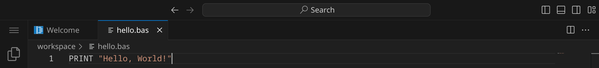
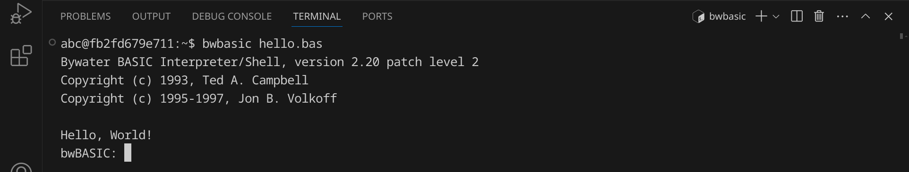
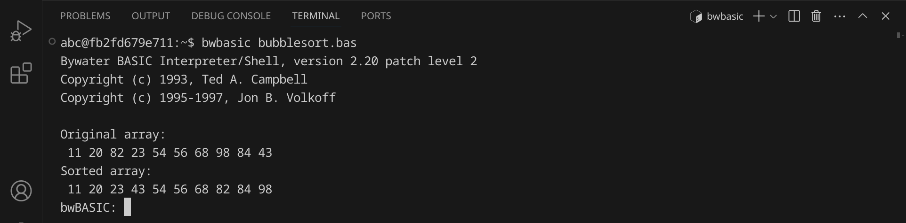

<div class='meta'>
image: basic-logo.png
</div>

# BASIC <span style='font-size: 80%;'>(1964)</span>

<div class='floatright' style='width: 24em;'>
    
    <p>John G. Kemeny &amp; Thomas E. Kurtz</p>
</div>

<p class='abstract'>
BASIC ist eine Programmiersprache, die in den 1960er Jahren von John G. Kemeny und Thomas E. Kurtz am Dartmouth College entwickelt wurde. Sie wurde ursprünglich für Anfänger entwickelt, um das Programmieren zu erlernen. Der Name BASIC steht für "Beginner's All-purpose Symbolic Instruction Code". BASIC wurde in den 1970er und 1980er Jahren auf vielen Heimcomputern eingesetzt. Es gibt viele verschiedene Versionen von BASIC, darunter Microsoft BASIC, Commodore BASIC und Sinclair BASIC.
</p>

Heutzutage ist BASIC weniger relevant als moderne Programmiersprachen, wird aber immer noch in Bildungskontexten und von Enthusiasten verwendet, um die Grundlagen des Programmierens zu lehren und historische Computersysteme zu emulieren.

<!-- ## Eigenschaften

- **Einfachheit**: BASIC wurde entwickelt, um einfach zu erlernen und zu verwenden zu sein. Es verwendet eine klare und verständliche Syntax, die es Anfängern erleichtert, das Programmieren zu erlernen.
- **Interpretiert**: BASIC ist eine interpretierte Sprache, was bedeutet, dass der Code zur Laufzeit ausgeführt wird.
- **Strukturiert**: Moderne Versionen von BASIC unterstützen strukturierte Programmierung, die es ermöglicht, den Code in logische Blöcke zu unterteilen.
- **Portabilität**: BASIC-Code ist in der Regel portabel und kann auf verschiedenen Plattformen und Betriebssystemen ausgeführt werden.
- **Grafik und Sound**: BASIC bietet Funktionen zur Erstellung von Grafiken und Soundeffekten, die es ermöglichen, interaktive Programme zu erstellen.
- **Einfache Mathematik**: BASIC bietet eine Vielzahl von mathematischen Funktionen und Operatoren, die es ermöglichen, mathematische Berechnungen durchzuführen. -->

## Hello, World!

BASIC ist eine Skriptsprache, was bedeutet, dass der Code zur Laufzeit interpretiert wird.

Früher wurde BASIC auf vielen Heimcomputern eingesetzt, darunter der Commodore 64, der Apple II und der Sinclair ZX Spectrum. Im Workspace kannst du BASIC-Programme z. B. mit Bywater BASIC (bwBASIC) ausführen.

Du hast zwei Möglichkeiten, BASIC-Code auszuführen:

1. Du kannst BASIC-Code direkt in der BASIC-Shell ausführen.
2. Du kannst BASIC-Code in einer Textdatei speichern und dann ausführen.

**Möglichkeit 1:** BASIC-Code in der BASIC-Shell ausführen

Öffne dazu ein Terminal, indem du entweder <span class='key'>Strg</span><span class='key'>J</span> drückst oder das Panel-Symbol  rechts oben drückst. Dein Fenster sollte jetzt ungefähr so aussehen:


Starte nun die BASIC-Shell, indem du `bwbasic` eingibst und dann <span class='key'>Enter</span> drückst. Du solltest eine Ausgabe wie diese sehen:


Jetzt kannst du BASIC-Code direkt in der Shell eingeben und ausführen. Schreibe einfach `PRINT "Hello, world!"` und drücke <span class='key'>Enter</span>. Du solltest die Ausgabe `Hello, world!` sehen.

Du kannst die BASIC-Shell wieder beenden, indem du `SYSTEM` eingibst und <span class='key'>Enter</span> drückst oder einfach <span class='key'>Strg</span><span class='key'>D</span> drückst.

**Möglichkeit 2:** BASIC-Code in einer Textdatei speichern und ausführen

BASIC-Programme werden in Textdateien mit der Endung `.bas` geschrieben. Ein BASIC-Interpreter liest anschließend den Quelltext und führt ihn aus.

Stelle zuerst sicher, dass du keinen Ordner geöffnet hast. Um sicherzugehen, drücke einfach den Shortcut für »Ordner schließen«: <span class='key'>Strg</span><span class='key'>K</span> und dann <span class='key'>F</span>. Dein Workspace sollte jetzt ungefähr so aussehen:


### Quelltext schreiben

Klicke auf »New File« und wähle als Dateityp »Text File« (oder bestätige einfach mit <span class='key'>Enter</span>).


Schreibe nun den folgenden Code in die Datei:

_include_file(hello.bas, basic)

Da Visual Studio Code noch nicht weiß, dass es sich um BASIC-Quelltext handelt, ist dein Programm momentan noch einfarbig, aber das wird sich gleich ändern. An dem weißen Punkt erkennst du, dass deine Änderungen noch nicht gespeichert sind.


Drücke nun <span class='key'>Strg</span><span class='key'>S</span>, um die Datei zu speichern. Gib `hello.bas` ein – der vollständige Pfad zu deiner Datei lautet dann `/workspace/hello.bas`.


Sobald du die Datei gespeichert hast, wird sie automatisch als BASIC-Datei erkannt und die Syntax wird hervorgehoben.



### Skript ausführen

Um unser Programm auszuführen, müssen wir den BASIC-Interpreter aufrufen und ihm den Dateinamen unseres Programms übergeben.

Öffne dazu ein Terminal, indem du <span class='key'>Strg</span><span class='key'>J</span> drückst und gib folgenden Befehl ein:

```bash
bwbasic hello.bas
```

<div class='hint'>
Du musst nicht den vollständigen Dateinamen schreiben. Schreib einfach <code>bwbasic he</code> und drücke <span class='key'>Tab</span>, um den Dateinamen automatisch zu <code>hello.bas</code> vervollständigen zu lassen. Du kannst danach ganz normal weiterschreiben.
</div>

Das Programm sollte die Nachricht `Hello, World!` im Terminal ausgeben:



Um BASIC zu beenden, gib `SYSTEM` ein und drücke <span class='key'>Enter</span> oder drücke einfach <span class='key'>Strg</span><span class='key'>D</span>.

### Fehler finden und beheben

Wenn du einen Fehler im Code machst, wird Python eine Fehlermeldung ausgeben. Versuche zum Beispiel, statt `PRINT` das Wort `PRIN` zu schreiben:

```basic
PRIN "Hello, World!"
```

Speichere die Datei und führe das Skript erneut aus:

```bash
bwbasic hello.bas
```

<div class='hint'>
Nutze die Pfeiltaste hoch <span class='key'>↑</span>, um den letzten Befehl erneut einzugeben. So kannst du schnell dein Programm testen, nachdem du es verändert hast.
</div>

BASIC sollte eine Fehlermeldung ausgeben, die dir hilft, den Fehler zu finden:


Es lohnt sich, die Fehlermeldungen genau zu lesen, um den Fehler zu finden und zu beheben. Achte auf die Zeilennummer (in diesem Beispiel 1) und den Text, der dir sagt, was falsch ist. Denke daran, den Fehler wieder zu beheben, bevor du das nächste Beispiel ausprobierst.

## Primfaktorenzerlegung

Im zweiten Beispiel wollen wir eine Zahl in ihre Primfaktoren zerlegen.
An diesem Beispiel kannst du sehen, wie man in BASIC Benutzereingaben verarbeitet und Schleifen verwendet.
Erstelle eine neue Datei mit <span class='key'>Strg</span><span class='key'>Alt</span><span class='key'>N</span> und schreibe den folgenden Code hinein:

_include_file(factor.bas, basic)

Speichere die Datei unter dem Namen `factor.bas` und führe sie aus:


Das Programm hat die Zahl 123 in ihre Primfaktoren zerlegt und ausgegeben. Probiere aus, was passiert, wenn du die Zahl 3000000000 eingibst. Was könnte der Grund dafür sein?

## Bubblesort

Im dritten Beispiel wollen wir eine Liste von 10 Zufallszahlen sortieren. Dafür verwenden wir den [Bubblesort-Algorithmus](https://de.wikipedia.org/wiki/Bubblesort), der zwar nicht besonders effizient ist, aber sehr einfach zu verstehen und zu implementieren. Der Bubblesort-Algorithmus funktioniert, indem er die Liste mehrmals durchläuft und benachbarte Elemente vertauscht, wenn sie in der falschen Reihenfolge sind.

An diesem Beispiel kannst du sehen, wie man in BASIC Arrays verwendet, Funktionen verwendet und Schleifen verschachtelt.

Erstelle eine neue Datei und schreibe den folgenden Code hinein:

_include_file(bubblesort.bas, basic)

Speichere das Skript unter dem Namen `bubblesort.bas` und führe es aus:



Das Programm hat eine Liste von 10 Zufallszahlen sortiert. Versuche, den Quelltext so zu verändern, dass statt 10 Zahlen 100 oder mehr Zahlen sortiert werden.

## Zusammenfassung

In diesem Kapitel hast du an drei Beispielen gesehen, wie man ein einfaches BASIC-Skript schreiben und ausführen kann. Das ist natürlich nur ein erster Eindruck. Um BASIC wirklich zu beherrschen, musst du noch viel mehr lernen – am besten, indem du eigene Skripte schreibst und ausprobierst. Die Buchhandlungen, Bibliotheken und Youtube sind voll von Material für dich. Viel Spaß beim Programmieren!
