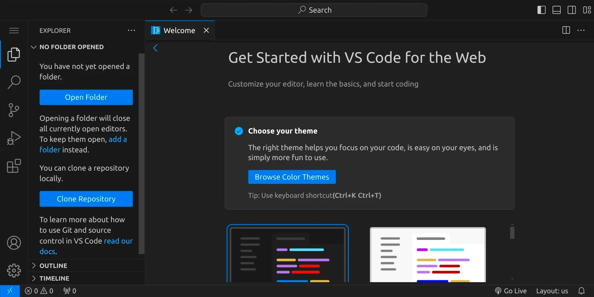
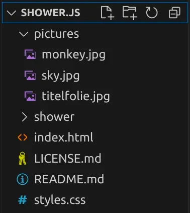

section: programming

# Die Basics

Mach dich mit Visual Studio Code vertraut und lerne die wichtigsten Funktionen kennen.

Wenn du den Workspace öffnest, siehst du die Entwicklungsumgebung Visual Studio Code:

## Die Benutzeroberfläche

Am linken Rand sieht du einige Icons, die wichtig sind:

<table class='table'>
<tr>
<td style='width: 1em;'></td>
<td>Das Menü</td>
</tr>
<tr>
<td></td>
<td>Explorer (StrgShiftE) &ndash; hier siehst du alle Dateien und Unterordner des aktuell geöffneten Projekts</td>
</tr>
<tr>
<td></td>
<td>Search (StrgShiftF) &ndash; hier kannst du in allen Dateien innerhalb deines Projektes suchen</td>
</tr>
<tr>
<td></td>
<td>Source Control (StrgShiftG) &ndash; hier geht es um Versionsverwaltung mit Git</td>
</tr>
<tr>
<td></td>
<td>Run and Debug (StrgShiftD) &ndash; hier können selbst geschriebene Programme ausgeführt werden</td>
</tr>
<tr>
<td></td>
<td>Extensions (StrgShiftX) &ndash; hier findest du viele nützliche Erweiterungen</td>
</tr>
</table>

Es gibt an mehreren Rändern Bereiche, die du ein- und ausblenden kannst. Nutze dafür die Buttons rechts oben:

<table class='table'>
<tr>
<td style='width: 1em;'></td>
<td>Primary Side Bar (StrgB)</td>
</tr>
<tr>
<td></td>
<td>Panel (StrgJ) &ndash; hier ist für uns vor allem das Terminal interessant</td>
</tr>
<tr>
<td></td>
<td>Secondary Side bar (StrgAltB)</td>
</tr>
</table>

## Pfade, Dateien, Verzeichnisse

Wenn du am Computer arbeitest, speicherst du deine Arbeit in Dateien. Jede Datei hat einen Dateinamen (der normalerweise auch eine Erweiterung enthält) und befindet sich in einem Verzeichnis, das sich wiederum in einem anderen Verzeichnis befinden kann. So entsteht ein Verzeichnisbaum.

Der vollständige Pfad zu einer Datei setzt sich dann aus allen Verzeichnissen und dem Dateinamen zusammen, z. B:

`/home/abc/shower.js/pictures/monkey.jpg`

Unter Linux ist das oberste Verzeichnis immer `/`, unter Windows beginnt es immer mit einem Laufwerksbuchstaben wie z. B. `C:\`. Ein weiterer Unterschied zu Linux ist, dass unter Windows `\` statt `/` verwendet wird, um Verzeichnisse im Pfad voneinander abzutrennen.

Im Hackschule Workspace ist es so, dass du deine Projekte und Dateien im Verzeichnis `/workspace` ablegen kannst. Du kannst dir in diesem Verzeichnis eine beliebige Verzeichnisstruktur anlegen.

## Shortcuts

Zum Schluss noch ein paar Tipps zur Tastatur: es gibt einige praktische Funktionen, die es quasi überall gibt:

<table class='table'>
<tr>
<td style='width: 1em;'>StrgC</td>
<td>Kopieren (copy)</td>
</tr>
<tr>
<td>StrgV</td>
<td>Einfügen (paste)</td>
</tr>
<tr>
<td>StrgX</td>
<td>Ausschneiden (cut)</td>
</tr>
<tr>
<td>StrgZ</td>
<td>Rückgängig (undo)</td>
</tr>
</table>

Dazu noch ein wichtiger Hinweis: In den unteren Ecken deiner Tastatur findest du ein paar sogenannte _Hilfstasten_, z. B.
Strg,
Shift,
Alt,
Win und
AltGr. Diese Tasten haben meistens keinen Effekt, wenn man sie alleine drückt, sondern sie werden für Tastenkombinationen verwendet, die meistens aus einer oder mehreren Hilfstasten und einer »richtigen« Taste bestehen. Um einen ausgewählten Text mit StrgC zu kopieren, musst du also erst Strg gedrückt halten und dann einmal C tippen.

Du kannst Hilfstasten auch verwenden, um Sonderzeichen einzugeben, genauso wie du Großbuchstaben mit Shift (auch: Umschalttaste) eingeben kannst.
