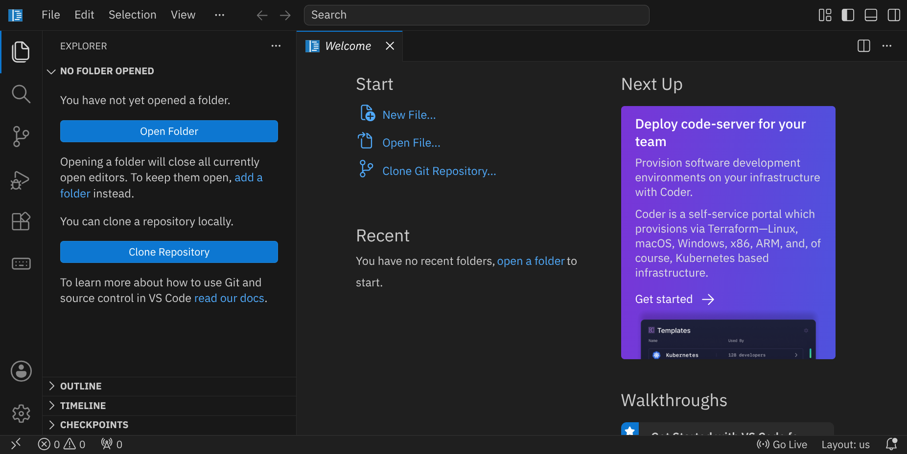
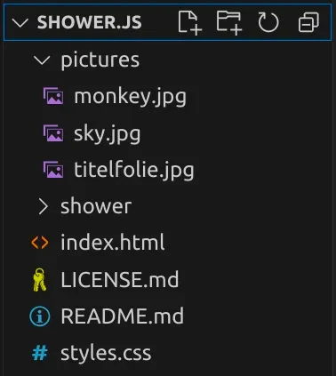
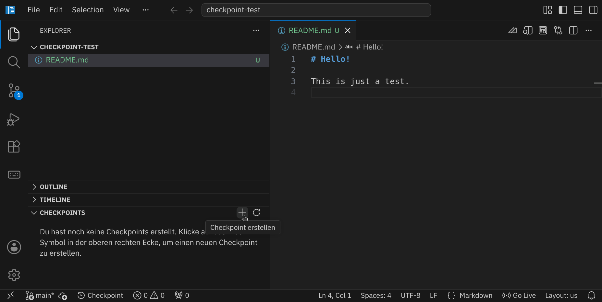
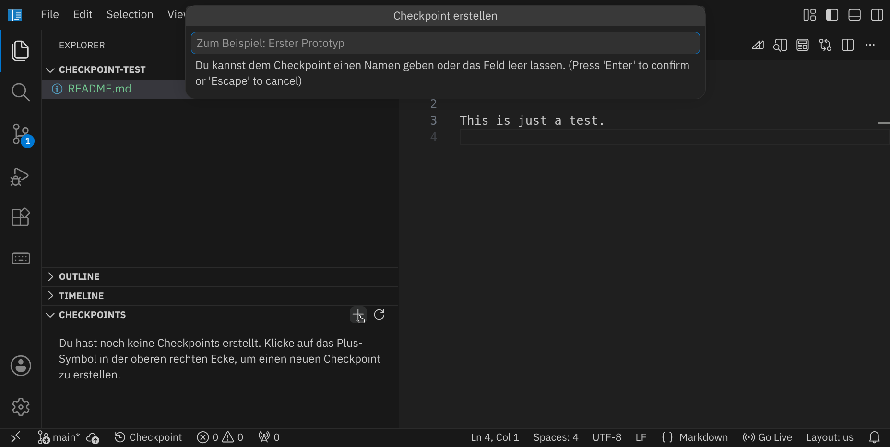
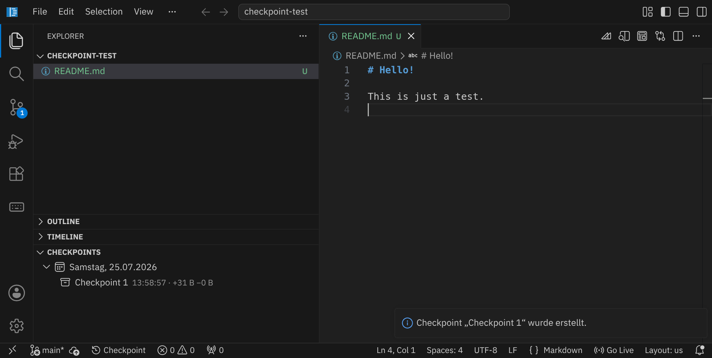
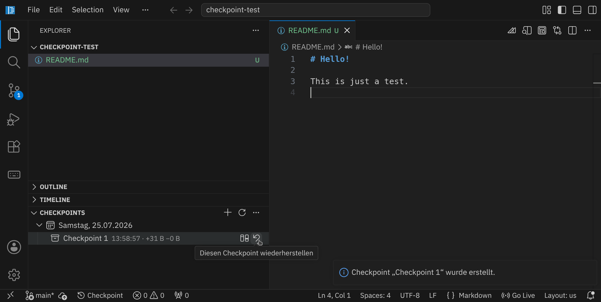
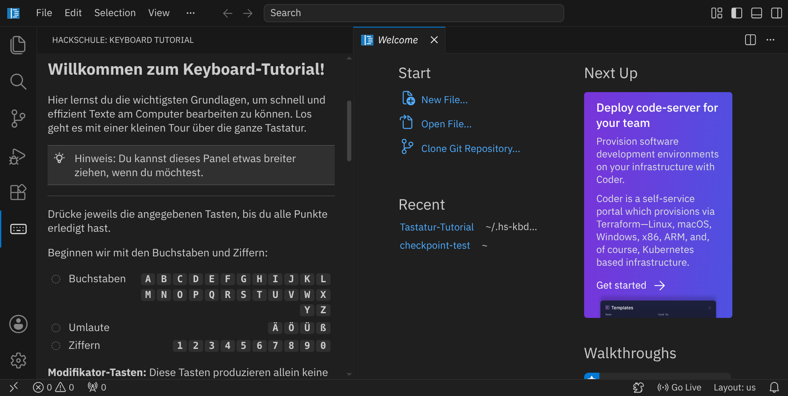

<div class='meta'>
image: vs-code-welcome.webp:0:50
</div>

# Die Basics

<p class='abstract'>
Eine kleine Tour durch die Benutzeroberfläche von Visual Studio Code, gefolgt von grundlegenden Hinweisen zur Arbeit mit Dateien, Ordnern und Projekten. Lerne wichtige Shortcuts und Funktionen zum Bearbeiten von Text kennen und erfahre, wie du mit Checkpoints sichere Zwischenstände deiner Arbeit anlegst.
</p>

Wenn du den Workspace öffnest, siehst du die Entwicklungsumgebung Visual Studio Code:



## Die Benutzeroberfläche

Am linken Rand siehst du einige Icons, die wichtig sind:

<table class='table'>
<tr>
<td></td>
<td>Explorer (<kbd>Strg</kbd><kbd>Shift</kbd><kbd>E</kbd>) &ndash; hier siehst du alle Dateien und Unterordner des aktuell geöffneten Projekts</td>
</tr>
<tr>
<td></td>
<td>Search (<kbd>Strg</kbd><kbd>Shift</kbd><kbd>F</kbd>) &ndash; hier kannst du in allen Dateien innerhalb deines Projektes suchen</td>
</tr>
<tr>
<td></td>
<td>Source Control (<kbd>Strg</kbd><kbd>Shift</kbd><kbd>G</kbd>) &ndash; hier geht es um Versionsverwaltung mit Git</td>
</tr>
<tr>
<td></td>
<td>Run and Debug (<kbd>Strg</kbd><kbd>Shift</kbd><kbd>D</kbd>) &ndash; hier können selbst geschriebene Programme ausgeführt werden</td>
</tr>
<tr>
<td></td>
<td>Extensions (<kbd>Strg</kbd><kbd>Shift</kbd><kbd>X</kbd>) &ndash; hier findest du viele nützliche Erweiterungen</td>
</tr>
<tr>
<td></td>
<td>Hackschule Keyboard-Tutorial &ndash; hier lernst du die wichtigsten Funktionen der Tastatur kennen</td>
</tr>
</table>

Rechts oben siehst du mehrere Buttons, mit denen du das Layout anpassen oder verschiedene Bereiche ein- und ausblenden kannst:

<table class='table'>
<tr>
<td></td>
<td>Layout anpassen</td>
</tr>
<tr>
<td style='width: 1em;'></td>
<td>Linke Seitenleiste (<kbd>Strg</kbd><kbd>B</kbd>)</td>
</tr>
<tr>
<td></td>
<td>Panel (<kbd>Strg</kbd><kbd>J</kbd>) &ndash; hier ist für uns vor allem das Terminal interessant</td>
</tr>
<tr>
<td></td>
<td>Rechte Seitenleiste (<kbd>Strg</kbd><kbd>Alt</kbd><kbd>B</kbd>)</td>
</tr>
</table>

## Dateien, Projekte, Verzeichnisse und Pfade



Wenn du am Computer arbeitest, speicherst du deine Arbeit in Dateien. Jede Datei hat einen Dateinamen, der normalerweise auch eine Erweiterung wie `.jpg`, `.html`, `.py` oder `.rb` enthält. Die Dateiendung ist ein Teil des Namens und zeigt oft, um welche Art von Datei es sich handelt.

Ein Projekt besteht normalerweise aus einem Ordner und den darin enthaltenen Dateien und Unterordnern. Im Explorer wird diese Struktur als Verzeichnisbaum dargestellt. Die Abbildung rechts zeigt ein Beispiel mit mehreren Dateien und Unterordnern.

Der Pfad `pictures/monkey.jpg` beschreibt, wo sich die Datei `monkey.jpg` innerhalb eines Projektordners befindet. Der vollständige Pfad zu einer Datei setzt sich aus allen übergeordneten Verzeichnissen und dem Dateinamen zusammen, zum Beispiel:

`/workspace/shower.js/pictures/monkey.jpg`

Unter Linux ist das oberste Verzeichnis immer `/`, unter Windows beginnt ein Pfad meistens mit einem Laufwerksbuchstaben wie `C:\`. Außerdem verwendet Windows normalerweise `\` statt `/`, um Verzeichnisse voneinander zu trennen.

Im Hackschule Workspace legst du deine Projekte und Dateien im Verzeichnis `/workspace` ab. Dort kannst du dir eine beliebige Ordnerstruktur anlegen. Deine Dateien bleiben gespeichert, wenn du den Browser schließt, und du kannst später von zu Hause oder von einem anderen Gerät aus weiterarbeiten.

## Checkpoints: Zwischenstände sichern

Mit der vorinstallierten Erweiterung **Checkpoints** kannst du einen Zwischenstand deines Projekts festhalten. Das ist besonders nützlich, bevor du eine größere Änderung ausprobierst.

Ein guter Zeitpunkt für einen Checkpoint ist zum Beispiel:

- bevor du funktionierenden Code grundlegend umbaust,
- bevor du mehrere Dateien gleichzeitig änderst,
- nachdem du eine wichtige Teilaufgabe abgeschlossen hast,
- oder bevor du eine neue Idee ausprobierst, bei der du noch nicht weißt, ob sie funktioniert.

Gib einem Checkpoint einen kurzen, verständlichen Namen, zum Beispiel:

```text
Navigation funktioniert
```

oder:

```text
Vor dem Umbau des Menüs
```

Wenn später etwas schiefgeht, kannst du zu einem früheren Zwischenstand zurückkehren.

Um einen Checkpoint zu erstellen, wechsle links in den Explorer und klappe den Bereich **Checkpoints** auf. Klicke auf das Plus-Symbol, um einen neuen Checkpoint zu erstellen.



Du kannst einen Namen für den Checkpoint eingeben und mit <kbd>Enter</kbd> bestätigen.



Der Checkpoint wird dann gespeichert:



Falls du später zu einem Checkpoint zurückkehren möchtest, klicke auf den entsprechenden Eintrag in der Liste:




<div class='hint'>
<p>
Intern verwendet die Checkpoints-Erweiterung Git, um die Zwischenstände zu speichern, ohne dass du dich um die Details kümmern musst. Du kannst Checkpoints jederzeit wieder löschen, wenn du sie nicht mehr brauchst. Die gespeicherten Checkpoints werden separat von eventuell vorhandenen Commits in einem Git-Repository verwaltet.
</p>
</div>

Wenn du sicher im Umgang mit Git bist, kannst du auch direkt Git verwenden, um deine Arbeit zu sichern.

## Tastatur und Textbearbeitung

Gerade am Anfang kann es sein, dass du beim Tippen, Markieren und Navigieren in einer Datei noch relativ langsam bist. Das ist völlig normal: Mit der Zeit kommt die Übung. 🤠 Wenn du etwas Erfahrung gesammelt hast, bist du mit der Tastatur oft schneller, als wenn du für jeden Arbeitsschritt erst zur Maus greifen musst.

### Das Keyboard-Tutorial starten

Im Hackschule Workspace ist das **Hackschule Keyboard-Tutorial** bereits installiert. Dort kannst du die wichtigsten Funktionen der Tastatur direkt in Visual Studio Code ausprobieren. Das Tutorial führt dich Schritt für Schritt durch Themen wie:

- Navigation in einem Dokument,
- Markieren und Bearbeiten von Text,
- Suchen und Ersetzen,
- Arbeiten mit mehreren Cursorpositionen,
- Bearbeiten von Code,
- sowie den Umgang mit Dateien, Ordnern und Tabs.

Klicke dazu links in der Aktivitätsleiste auf das Tastatur-Symbol. Anschließend öffnet sich der Bereich mit dem Keyboard-Tutorial:



Beginne mit dem ersten Kapitel und arbeite die Übungen der Reihe nach durch. Das Tutorial erkennt viele deiner Arbeitsschritte automatisch und markiert erledigte Aufgaben mit einem grünen Haken. Deinen Fortschritt speichert es, sodass du später an derselben Stelle weitermachen kannst.

Wenn du die Übungen im Keyboard-Tutorial abgeschlossen hast, kannst du außerdem Webseiten wie [keybr.com](https://www.keybr.com/) nutzen, um deine Tippgeschwindigkeit zu trainieren.
