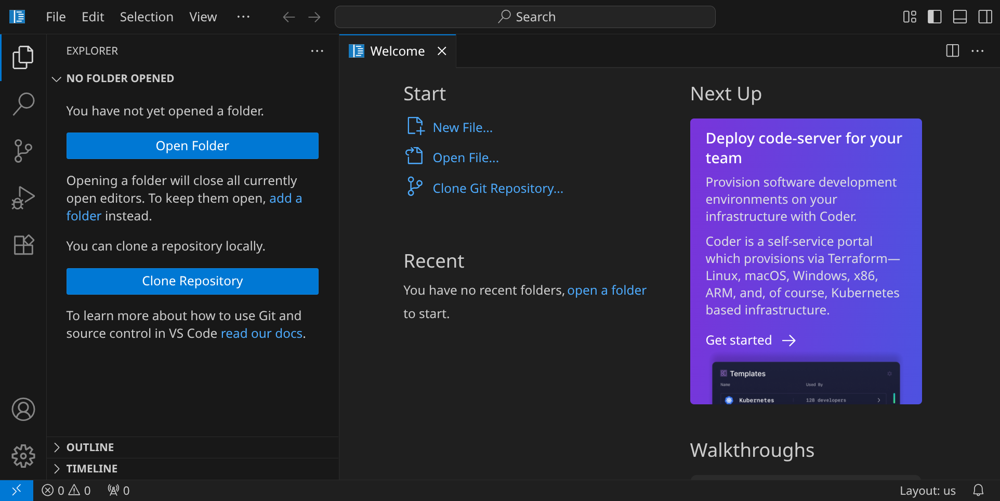
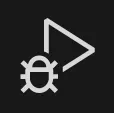

# Die Basics

Mach dich mit Visual Studio Code vertraut und lerne die wichtigsten Funktionen und Shortcuts auf der Tastatur kennen.

Wenn du den Workspace öffnest, siehst du die Entwicklungsumgebung Visual Studio Code:

## Die Benutzeroberfläche

Am linken Rand sieht du einige Icons, die wichtig sind:

<table class='table'>
<tr>
<td style='width: 1em;'></td>
<td>Das Menü</td>
</tr>
<tr>
<td></td>
<td>Explorer (StrgShiftE) &ndash; hier siehst du alle Dateien und Unterordner des aktuell geöffneten Projekts</td>
</tr>
<tr>
<td></td>
<td>Search (StrgShiftF) &ndash; hier kannst du in allen Dateien innerhalb deines Projektes suchen</td>
</tr>
<tr>
<td></td>
<td>Source Control (StrgShiftG) &ndash; hier geht es um Versionsverwaltung mit Git</td>
</tr>
<tr>
<td></td>
<td>Run and Debug (StrgShiftD) &ndash; hier können selbst geschriebene Programme ausgeführt werden</td>
</tr>
<tr>
<td></td>
<td>Extensions (StrgShiftX) &ndash; hier findest du viele nützliche Erweiterungen</td>
</tr>
</table>

Es gibt an mehreren Rändern Bereiche, die du ein- und ausblenden kannst. Nutze dafür die Buttons rechts oben:

<table class='table'>
<tr>
<td style='width: 1em;'></td>
<td>Linke Seitenleiste (StrgB)</td>
</tr>
<tr>
<td></td>
<td>Panel (StrgJ) &ndash; hier ist für uns vor allem das Terminal interessant</td>
</tr>
<tr>
<td></td>
<td>Rechte Seitenleiste (StrgAltB)</td>
</tr>
</table>

## Pfade, Dateien, Verzeichnisse

Wenn du am Computer arbeitest, speicherst du deine Arbeit in Dateien. Jede Datei hat einen Dateinamen (der normalerweise auch eine Erweiterung enthält) und befindet sich in einem Verzeichnis, das sich wiederum in einem anderen Verzeichnis befinden kann. So entsteht ein Verzeichnisbaum.

Der vollständige Pfad zu einer Datei setzt sich dann aus allen Verzeichnissen und dem Dateinamen zusammen, z. B:

`/home/abc/shower.js/pictures/monkey.jpg`

Unter Linux ist das oberste Verzeichnis immer `/`, unter Windows beginnt es immer mit einem Laufwerksbuchstaben wie z. B. `C:\`. Ein weiterer Unterschied zu Linux ist, dass unter Windows `\` statt `/` verwendet wird, um Verzeichnisse im Pfad voneinander abzutrennen.

Im Hackschule Workspace ist es so, dass du deine Projekte und Dateien im Verzeichnis `/workspace` ablegen kannst. Du kannst dir in diesem Verzeichnis eine beliebige Verzeichnisstruktur anlegen.

## Shortcuts

Zum Schluss noch ein paar Tipps zur Tastatur: es gibt einige praktische Funktionen, die es quasi überall gibt:

<table class='table'>
<tr>
<td style='width: 1em;'>StrgC</td>
<td>Kopieren (copy)</td>
</tr>
<tr>
<td>StrgV</td>
<td>Einfügen (paste)</td>
</tr>
<tr>
<td>StrgX</td>
<td>Ausschneiden (cut)</td>
</tr>
<tr>
<td>StrgZ</td>
<td>Rückgängig (undo)</td>
</tr>
</table>

Dazu noch ein wichtiger Hinweis: In den unteren Ecken deiner Tastatur findest du ein paar sogenannte _Hilfstasten_, z. B.
Strg,
Shift,
Alt,
Win und
AltGr. Diese Tasten haben meistens keinen Effekt, wenn man sie alleine drückt, sondern sie werden für Tastenkombinationen verwendet, die meistens aus einer oder mehreren Hilfstasten und einer »richtigen« Taste bestehen. Um einen ausgewählten Text mit StrgC zu kopieren, musst du also erst Strg gedrückt halten und dann einmal C tippen.

Du kannst Hilfstasten auch verwenden, um Sonderzeichen einzugeben, genauso wie du Großbuchstaben mit Shift (auch: Umschalttaste) eingeben kannst.

## Bearbeiten von Text

Gerade am Anfang kann es sein, dass du beim Tippen und Navigieren in einer Datei relativ langsam bist. Es ist aber wie mit so vielen Dingen: mit der Zeit kommt die Übung. 🤠 Wenn du eine gewissen Übung hast, bist du mit der Tastatur oft schneller, als wenn du erst zur Maus greifen musst, um an eine bestimmte Stelle zu klicken.

Du kannst Webseiten wie [keybr.com](https://www.keybr.com/) nutzen, um deine Tippgeschwindigkeit zu trainieren. Darüberhinaus wirst du schneller, wenn du ein paar wesentliche Tasten deiner Tastatur kennenlernst:

### Navigation

Die folgenden Shortcuts funktionieren nicht in Visual Studio Code, sondern in fast allen anderen Programmen:

<table class='table'>
<tr>
<td style='width: 14em;'>↠/ ↑ / → / ↓</td>
<td>bewegt den Cursor</td>
</tr>
<tr>
<td>Pos1 / Ende</td>
<td>springt an den Anfang / das Ende einer Zeile</td>
</tr>
<tr>
<td>Bild↑ / Bild↓</td>
<td>springt eine Seite hoch / runter</td>
</tr>
<tr>
<td>Strg↠/ Strg→</td>
<td>springt zum vorherigen / nächsten Wort</td>
</tr>
<tr>
<td>StrgPos1 / StrgEnde</td>
<td>springt an den Anfang / das Ende des Dokuments</td>
</tr>
<tr>
</table>

### Text auswählen und löschen

Halte Shift gedrückt, während du durch einen Text navigierst, um Text zu markieren.

Zum Löschen von einzelnen Zeichen gibt es zwei verschiedene Tasten, deren Unterschied man kennen sollte: ⟵ (Backspace) löscht das Zeichen links vom Cursor, während Entf das Zeichen rechts neben dem Cursor löscht. Oft gibt es Shortcuts, um ganze Zeilen zu löschen – in Visual Studio Code mit StrgShiftK.

