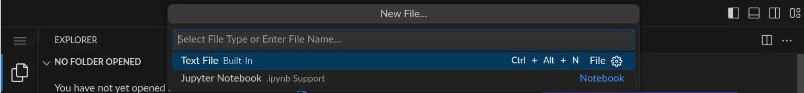
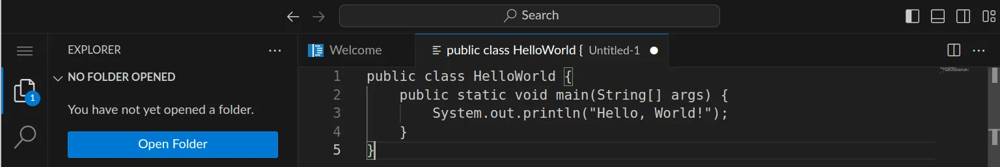

<div class='meta'>
section: programming
</div>

# Programmieren in Java

<p class='abstract'>
Java ist eine der meistverwendeten Programmiersprachen weltweit,
die zum Beispiel in der Anwendungsentwicklung und
Datenbankprogrammierung eingesetzt wird. In diesem Kapitel lernst du,
wie du ein einfaches Programm in Java schreibst und ausführst.
</p>

## Hello, world!

Java-Programme werden in Textdateien mit der Endung `.java` geschrieben. Diese Dateien werden dann mit dem Java-Compiler `javac` kompiliert, um ausführbare Dateien zu erzeugen. Diese ausführbaren Dateien haben die Endung `.class` und können mit dem Java-Interpreter `java` ausgeführt werden.

Stelle zuerst sicher, dass du keinen Ordner geöffnet hast. Um sicherzugehen, drücke einfach den Shortcut für »Ordner schließen«: <span class='key'>Strg</span><span class='key'>K</span> und dann <span class='key'>F</span>. Dein Workspace sollte jetzt ungefähr so aussehen:


Klicke nun auf »New File« und wähle als Dateityp »Text File«.



Schreibe nun den folgenden Code in die Datei:

```java
public class HelloWorld {
    public static void main(String[] args) {
        System.out.println("Hello, World!");
    }
}
```



Deine Datei sieht noch nicht besonders spektakulär aus, aber das ist in Ordnung und wird sich gleich ändern. An dem weißen Punkt erkennst du, dass deine Änderungen noch nicht gespeichert sind.

Drücke nun <span class='key'>Strg</span><span class='key'>S</span>, um die Datei zu speichern.

Speichere die Datei als `HelloWorld.java` und öffne ein Terminal. Navigiere zum Verzeichnis, in dem du die Datei gespeichert hast, und führe folgenden Befehl aus:

```bash
javac HelloWorld.java
```

Dieser Befehl kompiliert den Java-Code und erzeugt eine ausführbare Datei namens `HelloWorld.class`. Um das Programm auszuführen, gib folgenden Befehl ein:

```bash
java HelloWorld
```

Das Programm sollte die Nachricht `Hello, World!` auf der Konsole ausgeben.