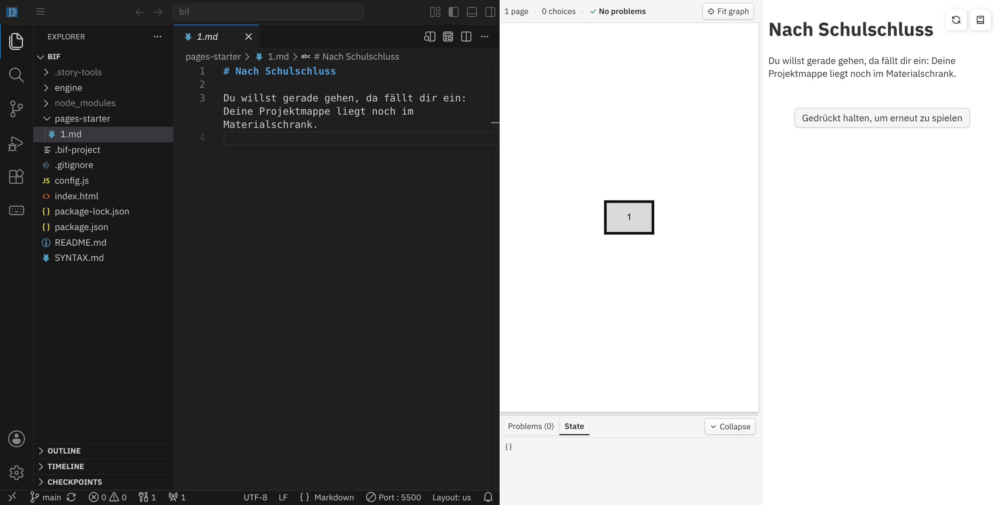

<div class='meta'>
image: bif.webp
</div>

<div
    class="autotoc-secondary-trigger"
    data-title="Auf dieser Seite"
    data-levels="h2">
</div>

# Interaktive Geschichten schreiben

<p class='abstract'>
Mit BIF kannst du interaktive Geschichten schreiben, bei denen die Leserinnen und Leser selbst entscheiden, wie es weitergeht. Die einzelnen Abschnitte deiner Geschichte schreibst du als einfache Markdown-Dateien und verbindest sie miteinander. In diesem Tutorial entwickelst du Schritt für Schritt eine kleine Geschichte und lernst dabei die wichtigsten Bausteine von BIF kennen: Seiten, Entscheidungen, Verzweigungen, lokale Aktionen, Variablen und Bedingungen.
</p>

## Repository klonen

Stelle zuerst sicher, dass du keinen Ordner geöffnet hast. Um sicherzugehen, drücke den Shortcut für »Ordner schließen«: <span class='key'>Strg</span><span class='key'>K</span> und dann <span class='key'>F</span>.

<!-- Screenshot: Workspace ohne geöffneten Ordner -->


Für diese Anleitung brauchst du das BIF-Repository. Klicke auf den blauen Button »Clone Repository« und gib die folgende URL ein:

```text
https://github.com/specht/bif.git
```

Bestätige anschließend mit <span class='key'>Enter</span>.

<!-- Screenshot: Clone Repository mit eingetragener BIF-URL -->


Als nächstes musst du angeben, in welches Verzeichnis das Repository geklont werden soll. Bestätige den Standardpfad

```text
/workspace/
```

mit <span class='key'>Enter</span>.

<!-- Screenshot: Auswahl von /workspace/ -->


Beantworte anschließend die Frage »Would you like to open the cloned repository?« mit »Open«.

<!-- Screenshot: Dialog zum Öffnen des geklonten Repositorys -->


<!-- Screenshot: geöffnetes BIF-Projekt im Explorer -->


Wenn alles geklappt hat, siehst du links im Explorer unter anderem den Ordner `pages-starter` sowie die Dateien `config.js` und `index.html`.

## Geschichte starten

Öffne im Explorer den Ordner `pages-starter` und darin die Datei `1.md`.

<!-- Screenshot: 1.md geöffnet -->


Dort steht bereits der Anfang unserer kleinen Geschichte:

```markdown_wrap
# Nach Schulschluss

Du willst gerade gehen, da fällt dir ein: Deine Projektmappe liegt noch im Materialschrank.
```

Die Endung `.md` steht für [Markdown](https://de.wikipedia.org/wiki/Markdown). Markdown ist eine einfache Schreibweise für Texte und eignet sich gut für interaktive Geschichten.
Die Zeile

```markdown_wrap
# Nach Schulschluss
```

ist der **Titel der Geschichte**. Ein einzelnes `#` steht in Markdown für die größte Überschrift. In einer BIF-Geschichte verwenden wir diese Überschrift für den Titel der gesamten Geschichte. Sie steht deshalb nur am Anfang von `1.md`. Die weiteren Seiten brauchen normalerweise keine eigene Überschrift.

Falls du innerhalb einer Seite doch einmal eine Zwischenüberschrift brauchst, verwendest du dafür `##`.

<div class='hint'>
Die Datei <code>1.md</code> hat bei BIF eine besondere Bedeutung: Jede Geschichte beginnt bei Seite 1.
</div>

## Vorschau starten


Damit du deine Geschichte im Browser ausprobieren kannst, ist im Workspace bereits die Erweiterung **Live Server** installiert.
Klicke rechts unten auf »Go Live«. Es öffnet sich ein neuer Tab mit deiner Geschichte:

<div style='clear: both;'></div>


BIF startet standardmäßig in der Entwicklungsansicht. Rechts siehst du die Geschichte, die momentan noch sehr kurz ist und noch keine Entscheidungsmöglichkeiten bietet. Mit dem Button rechts oben kannst du zwischen der Entwicklungsansicht und der Leseansicht hin- und herwechseln. Wenn du deine Geschichte später veröffentlichst, bekommen deine Leser:innen nur die Leseansicht zu sehen.

<div class='hint'>
Tipp: Ziehe den Workspace und die Vorschau nebeneinander. Dann kannst du links schreiben und rechts direkt ausprobieren, was sich verändert hat.
</div>



## Zweite Seite


Unsere Geschichte soll nicht auf der ersten Seite stehen bleiben. Erstelle im Ordner `pages-starter` eine neue Datei, indem du auf das entsprechende Icon klickst. Nenne die Datei `2.md`.

Schreibe hinein:

```markdown_wrap
Du stehst in einem leeren Flur. Links ist ein kleines Büro. Daneben führt eine Tür ins Treppenhaus. Am Ende steht ein verschlossener Materialschrank.
```

Speichere die Datei, indem du <span class='key'>Strg</span><span class='key'>S</span> drückst. Die Vorschau sollte nun so aussehen:

<div style='clear: both;'></div>


Damit besteht die Geschichte bereits aus zwei Seiten, allerdings gibt es noch keine Verbindung von der ersten zur zweiten Seite – dafür brauchen wir eine Entscheidung.

## Entscheidungen

Öffne wieder `1.md` und ergänze am Ende:

```markdown_wrap
- [Gehe in den Flur.](2)
```

Die vollständige Datei sieht jetzt so aus:

```markdown_wrap
# Nach Schulschluss

Du willst gerade gehen, da fällt dir ein: Deine Projektmappe liegt noch im Materialschrank.

- [Gehe in den Flur.](2)
```

Speichere die Datei und probiere die Geschichte im Browser aus:


Die Geschichte endet jetzt mit einer Entscheidungsmöglichkeit: wenn du in den Flur gehst, geht die Geschichte bei Seite 2 weiter. Links im Graphen siehst du immer, wo du dich gerade innerhalb der Geschichte befindest.

Die Zeile

```markdown_wrap
- [Gehe in den Flur.](2)
```

besteht aus zwei wichtigen Teilen: in eckigen Klammern steht der Text, der angezeigt wird und in runden Klammern steht die Seitenzahl, mit der es bei dieser Entscheidung weitergehen soll.

## Verzweigungen

Eine interaktive Geschichte wird interessanter, wenn nicht immer nur ein einziger Weg möglich ist.
Erstelle die Datei `3.md`:

```markdown_wrap
Im Büro sitzt Frau Neumann an einem Schreibtisch. Neben der Tür hängt ein kleiner Schlüssel an einem Haken.

- [Gehe zurück in den Flur.](2)
```

Erstelle außerdem die Datei `4.md`:

```markdown_wrap
Im Treppenhaus ist es still. Auf dem Absatz liegt nur ein vergessener Turnbeutel.

- [Gehe zurück in den Flur.](2)
```

Öffne jetzt `2.md` und ergänze zwei Entscheidungen:

```markdown_wrap
Du stehst in einem leeren Flur. Links ist ein kleines Büro. Daneben führt eine Tür ins Treppenhaus. Am Ende steht ein verschlossener Materialschrank.

- [Sieh im Büro nach.](3)
- [Gehe ins Treppenhaus.](4)
```

Speichere die Dateien und probiere beide Wege aus.

<!-- Screenshot: zwei Entscheidungen im Flur -->


Die Geschichte verzweigt sich jetzt auf Seite 2. Beide Wege führen anschließend wieder zurück in den Flur.

Jetzt, nachdem unsere Geschichte mehrere Seiten und Verzweigungen hat, lohnt sich ein genauerer Blick auf den Graphen auf der linken Seite: Jede Seite wird als Knoten dargestellt. Die Pfeile zeigen, welche Entscheidungen von einer Seite zu einer anderen führen. Bei unserer Geschichte sieht man jetzt zum Beispiel:

- Seite 1 führt zu Seite 2.
- Seite 2 führt zu Seite 3 oder Seite 4.
- Seite 3 und Seite 4 führen zurück zu Seite 2.

So wird auch sichtbar, dass `1.md` nur der Einstieg ist. Später kehren wir nicht mehr auf diese Seite zurück. Du siehst auch, auf welcher Seite du dich gerade in der Geschichte befindest und welchen Pfad du bisher zurückgelegt hast.

<div class='hint'>
Je größer deine Geschichte wird, desto nützlicher wird der Graph. Du kannst damit schnell erkennen, welche Wege möglich sind und ob Teile deiner Geschichte gar nicht erreicht werden können.
</div>

## Lokale Entscheidungen

Nicht jede Entscheidung soll zu einer anderen Seite führen.

Vielleicht möchtest du mit einer Person sprechen, einen Gegenstand untersuchen oder eine Schublade öffnen. Dafür gibt es in BIF **lokale Entscheidungen**.

Öffne `3.md` und ändere den Inhalt zu:

```markdown_wrap
Im Büro sitzt Frau Neumann an einem Schreibtisch. Neben der Tür hängt ein kleiner Schlüssel an einem Haken.

- [Frage nach dem Materialschrank.](.)

    > "Der ist abgeschlossen. Der kleine Schlüssel hängt hier neben der Tür."

- [Gehe zurück in den Flur.](2)
```

Der wichtige Unterschied ist der Punkt: `(.)` – er bedeutet, dass die Geschichte auf dieser Seite bleiben soll. Der eingerückte Text darunter erscheint erst, nachdem die Entscheidung ausgewählt wurde.

<!-- Screenshot: lokale Entscheidung -->


Die vier Leerzeichen vor der Antwort sind wichtig. Durch die Einrückung erkennt BIF, dass der eingerückte Text zur Entscheidung direkt darüber gehört. Alles, was nach dieser lokalen Entscheidung passieren soll, wird deshalb entsprechend eingerückt.

Probiere die neue Entscheidung aus. Nachdem du Frau Neumann gefragt hast, gehört die Frage zusammen mit ihrer Antwort zum bisherigen Verlauf. Sie steht nicht mehr bei den noch offenen Entscheidungsmöglichkeiten und kann während dieses Besuchs nicht noch einmal ausgewählt werden. Die Entscheidung »Gehe zurück in den Flur« bleibt dagegen weiterhin verfügbar.

Lokale Entscheidungen eignen sich zum Beispiel für:

- Gespräche
- das Untersuchen eines Gegenstands
- das Lesen eines Briefs
- das Öffnen einer Schublade
- das Betätigen eines Schalters
- kleine Aktionen, die keinen neuen Ort benötigen

## Variablen

Bisher hängt der Verlauf nur davon ab, welche Seite gerade geöffnet wird. Eine Geschichte kann sich aber auch etwas **merken**. In unserem Beispiel soll gespeichert werden, ob du den Schlüssel aus dem Büro genommen hast.

Öffne `1.md` und füge direkt unter dem Titel ein:

```html
<script>
has_key = false;
</script>
```

Die Datei sieht jetzt so aus:

```markdown_wrap
# Nach Schulschluss

<script>
has_key = false;
</script>

Du willst gerade gehen, da fällt dir ein: Deine Projektmappe liegt noch im Materialschrank.

- [Gehe in den Flur.](2)
```

`has_key` ist eine Variable. Der Wert `false` bedeutet hier: Du hast den Schlüssel noch nicht. Wir setzen diesen Anfangswert in `1.md`, weil diese Seite nur einmal am Anfang besucht wird.

Öffne anschließend `3.md` und ergänze eine weitere lokale Entscheidung:

```markdown_wrap
- [Nimm den Schlüssel.](.)

    <script>
    has_key = true;
    </script>

    Du nimmst den kleinen Schlüssel vom Haken.
```

Die vollständige Datei sieht jetzt so aus:

```markdown_wrap
Im Büro sitzt Frau Neumann an einem Schreibtisch. Neben der Tür hängt ein kleiner Schlüssel an einem Haken.

- [Frage nach dem Materialschrank.](.)

    > "Der ist abgeschlossen. Der kleine Schlüssel hängt hier neben der Tür."

- [Nimm den Schlüssel.](.)

    <script>
    has_key = true;
    </script>

    Du nimmst den kleinen Schlüssel vom Haken.

- [Gehe zurück in den Flur.](2)
```

Wenn du »Nimm den Schlüssel« auswählst, wird das Skript ausgeführt und `has_key` ändert sich von `false` zu `true`.

Öffne in der Entwicklungsansicht den Bereich **State** und beobachte den Wert beim Spielen.

<!-- Screenshot: Schlüssel genommen / State mit has_key: true -->


Die Geschichte hat sich damit zum ersten Mal etwas gemerkt. Solange du im Büro bleibst, sieht auch alles richtig aus: »Nimm den Schlüssel« ist bereits erledigt und kann nicht noch einmal ausgewählt werden.

Jetzt lohnt sich aber ein kleiner Test:

1. Nimm den Schlüssel.
2. Gehe zurück in den Flur.
3. Betritt das Büro erneut.

Nun stimmt plötzlich einiges nicht mehr. Der Schlüssel hängt laut Beschreibung wieder neben der Tür, du kannst ihn noch einmal nehmen und Frau Neumann behauptet weiterhin, dass er dort hängt. Gleichzeitig zeigt **State** immer noch:

```text
has_key: true
```

<!-- Screenshot: Büro nach erneutem Betreten, obwohl has_key true ist -->

Das ist kein Fehler in der Variable. `has_key` hat sich korrekt gemerkt, dass du den Schlüssel besitzt.

Der Grund liegt bei den lokalen Entscheidungen: BIF merkt sich innerhalb eines Besuchs, welche lokalen Entscheidungen bereits ausgeführt wurden. Wenn du eine Seite verlässt und später erneut betrittst, wird die Seite neu aufgebaut. Die lokalen Entscheidungen stehen dann zunächst wieder zur Verfügung.

Ob etwas **dauerhaft für den weiteren Verlauf der Geschichte** passiert ist, speichern wir deshalb in Variablen. Jetzt müssen wir dafür sorgen, dass die Seite diesen gespeicherten Zustand auch berücksichtigt.

## Bedingungen

Dafür gibt es **Bedingungen**. Mit einer Bedingung können wir festlegen, dass Text oder eine Entscheidung nur in einem bestimmten Zustand der Geschichte erscheint.

Wir beheben zuerst das offensichtlichste Problem: Wenn du den Schlüssel schon besitzt, darf »Nimm den Schlüssel« bei einem späteren Besuch nicht noch einmal angeboten werden.

Ergänze die Entscheidung in `3.md`:

```markdown_wrap
- [Nimm den Schlüssel.](.){condition="!has_key"}
```

Das Besondere steht hinter der Entscheidung:

```text
{condition="!has_key"}
```

`condition` bedeutet **Bedingung**. Das Ausrufezeichen vor `has_key` bedeutet **nicht**. Die Entscheidung erscheint also nur, wenn `has_key` nicht `true` ist – solange du den Schlüssel noch nicht hast.

Speichere die Datei und probiere den Weg noch einmal aus: Schlüssel nehmen, in den Flur gehen und anschließend wieder ins Büro. Diesmal wird »Nimm den Schlüssel« nicht erneut angeboten.

Damit ist aber erst ein Teil des Problems gelöst. Auch die Beschreibung des Büros behauptet noch, dass der Schlüssel am Haken hängt.

Ändere den Anfang von `3.md`:

```html_wrap
Im Büro sitzt Frau Neumann an einem Schreibtisch.

<p condition="!has_key">
Neben der Tür hängt ein kleiner Schlüssel an einem Haken.
</p>

<p condition="has_key">
Der Haken neben der Tür ist leer.
</p>
```

BIF zeigt nun abhängig vom Wert von `has_key` genau einen der beiden Absätze an.

Bedingungen können also nicht nur Entscheidungen, sondern auch normalen Text steuern. Dadurch kann sich derselbe Ort verändern, ohne dass wir dafür eine neue Seite anlegen müssen.

Es gibt noch einen Widerspruch: Wenn du das Büro mit dem Schlüssel erneut betrittst, sollte Frau Neumann nicht wieder sagen, dass er neben der Tür hängt. Auch das können wir mit Bedingungen lösen.

Die bisherige Frage soll nur erscheinen, solange du den Schlüssel noch nicht hast:

```markdown_wrap
- [Frage nach dem Materialschrank.](.){condition="!has_key"}

    > "Der ist abgeschlossen. Der kleine Schlüssel hängt hier neben der Tür."
```

Sobald du den Schlüssel besitzt, bieten wir stattdessen eine passende Frage an:

```markdown_wrap
- [Frage, ob der Schlüssel zum Materialschrank passt.](.){condition="has_key"}

    > "Ja, genau der ist für den Materialschrank."
```

`3.md` sieht damit vollständig so aus:

```markdown_wrap
Im Büro sitzt Frau Neumann an einem Schreibtisch.

<p condition="!has_key">
Neben der Tür hängt ein kleiner Schlüssel an einem Haken.
</p>

<p condition="has_key">
Der Haken neben der Tür ist leer.
</p>

- [Frage nach dem Materialschrank.](.){condition="!has_key"}

    > "Der ist abgeschlossen. Der kleine Schlüssel hängt hier neben der Tür."

- [Nimm den Schlüssel.](.){condition="!has_key"}

    <script>
    has_key = true;
    </script>

    Du nimmst den kleinen Schlüssel vom Haken.

- [Frage, ob der Schlüssel zum Materialschrank passt.](.){condition="has_key"}

    > "Ja, genau der ist für den Materialschrank."

- [Gehe zurück in den Flur.](2)
```

Probiere das Büro jetzt noch einmal von Anfang an aus. Wenn du den Schlüssel nimmst, verändert sich die Seite sofort: Der Haken ist leer und die passenden Entscheidungen ändern sich. Wenn du das Büro verlässt und erneut betrittst, bleibt die Geschichte trotzdem logisch, weil `has_key` weiterhin `true` ist.

<!-- Screenshot: Büro nach dem Nehmen des Schlüssels -->

Jetzt soll der Schlüssel auch außerhalb des Büros eine Folge haben.

Erstelle die Datei `5.md`:

```markdown_wrap
Der Schlüssel passt.

Im Materialschrank liegt deine Projektmappe zwischen zwei Kartons. Du steckst sie ein. Jetzt kannst du endlich nach Hause.

**Ende.**
```

Öffne anschließend `2.md`. Auch der Flur kann auf den gespeicherten Zustand reagieren. Ersetze den Inhalt durch:

```markdown_wrap
Du stehst in einem leeren Flur. Links ist ein kleines Büro. Daneben führt eine Tür ins Treppenhaus.

<p condition="!has_key">
Am Ende steht ein verschlossener Materialschrank.
</p>

<p condition="has_key">
Am Ende steht der Materialschrank. Du hast den passenden Schlüssel dabei.
</p>

- [Sieh im Büro nach.](3)
- [Gehe ins Treppenhaus.](4)
- [Öffne den Materialschrank.](5){condition="has_key"}
```

Die Entscheidung zum Öffnen des Materialschranks wird nur angezeigt, wenn `has_key` den Wert `true` hat.

Starte die Geschichte neu und probiere es aus:

1. Gehe in den Flur.
2. Die Entscheidung zum Öffnen des Materialschranks ist noch nicht sichtbar.
3. Gehe ins Büro.
4. Nimm den Schlüssel.
5. Gehe zurück in den Flur.

Jetzt verändert sich die Beschreibung des Flurs und die neue Entscheidung erscheint.

<!-- Screenshot: Flur ohne Schlüssel -->


<!-- Screenshot: Flur mit Schlüssel und zusätzlicher Entscheidung -->


Damit haben Variablen und Bedingungen unterschiedliche Aufgaben:

- Eine **Variable** merkt sich einen Zustand der Geschichte, auch wenn du eine Seite verlässt.
- Eine **Bedingung** entscheidet anhand dieses Zustands, welcher Text und welche Entscheidungen gerade sinnvoll sind.
- Eine bereits ausgeführte **lokale Entscheidung** ist nur für den aktuellen Besuch abgeschlossen. Bei einem späteren Besuch sorgt der gespeicherte Zustand zusammen mit Bedingungen dafür, dass die Seite trotzdem konsistent bleibt.

<div class='hint'>
Gerade beim Testen einer interaktiven Geschichte lohnt es sich, Orte mehrmals zu besuchen und Entscheidungen in unterschiedlicher Reihenfolge auszuprobieren. So fallen Widersprüche auf, die beim ersten Durchspielen leicht unbemerkt bleiben.
</div>

## Ende

Öffne jetzt den Materialschrank.

Die Datei `5.md` enthält keine weitere Entscheidung. Deshalb erkennt BIF diese Seite automatisch als mögliches Ende der Geschichte.

<!-- Screenshot: Ende mit Neustart-Button -->

Am Ende erscheint der Button

```text
Gedrückt halten, um erneut zu spielen
```

Er muss kurz gedrückt gehalten werden. So wird verhindert, dass der gesamte Spielstand versehentlich durch einen einfachen Klick gelöscht wird.

Beim Neustart beginnt die Geschichte wieder bei `1.md`. Dadurch wird auch

```js
has_key = false;
```

erneut ausgeführt und der Anfangszustand ist wieder hergestellt.

## Fehler finden

Beim Schreiben von Skripten kann leicht ein Tippfehler passieren. BIF überprüft deine Geschichte deshalb während des Schreibens und zeigt gefundene Probleme unten im Bereich **Problems** an.

Probiere das absichtlich aus. Öffne `3.md` und ändere vorübergehend

```html_wrap
<script>
has_key = true;
</script>
```

zu:

```html_wrap
<script>
has_key = ;
</script>
```

Speichere die Datei.

BIF erkennt, dass das JavaScript nicht gültig ist. Im Bereich **Problems** siehst du, in welcher Datei und in welcher Zeile der Fehler gefunden wurde. Auch im Graphen wird die betroffene Seite als fehlerhaft markiert.

<!-- Screenshot: Problems mit JavaScript-Syntaxfehler -->


Korrigiere die Zeile anschließend wieder:

```js
has_key = true;
```

Nach dem Speichern sollte der Fehler aus der Problems-Liste verschwinden.

BIF kann unter anderem auf folgende Probleme hinweisen:

- Fehler in Skripten
- ungültige Bedingungen
- fehlende Seiten
- Seiten, die von nirgendwo erreicht werden können
- fehlende Bilder oder andere Dateien

<div class='hint'>
Schau beim Schreiben regelmäßig auf den Graphen und die Problems-Ansicht. Gerade bei größeren Geschichten findest du damit viele Fehler, bevor du die Geschichte komplett durchspielen musst.
</div>

## Weitere Möglichkeiten

Mit den Bausteinen aus der kleinen Geschichte kannst du bereits viele interaktive Geschichten schreiben. BIF kann darüber hinaus noch einiges mehr.

### Markdown

Für die normalen Texte kannst du die üblichen Markdown-Schreibweisen verwenden.

Fetter Text:

```markdown_wrap
Auf dem Tisch liegt ein **kleiner Schlüssel**.
```

Kursiver Text:

```markdown_wrap
Aus dem Nebenraum hörst du ein *leises Klopfen*.
```

Eine Zwischenüberschrift innerhalb einer Seite:

```markdown_wrap
## Ein Hinweis
```

Denke daran: `#` verwenden wir für den Titel der gesamten Geschichte. Für Unterüberschriften innerhalb einer Seite beginnt die Hierarchie bei `##`.

### Bilder

Bilder speicherst du am besten innerhalb deines Geschichtenordners, zum Beispiel:

```text
pages-meine-geschichte/
├── 1.md
├── 2.md
└── images/
    └── door.jpg
```

In Markdown kannst du das Bild so einfügen:

```markdown_wrap

```

Der Text in den eckigen Klammern beschreibt das Bild und hilft zum Beispiel Menschen, die einen Screenreader verwenden.

<!-- Screenshot: BIF-Seite mit Bild -->


### Audio und Video

Auch Audio- und Videodateien können Teil einer Geschichte sein:

```html
<audio controls src="audio/door.mp3"></audio>
```

oder:

```html
<video controls>
    <source src="video/train.webm" type="video/webm">
</video>
```

### Werte im Text

Variablen können nicht nur `true` und `false`, sondern auch Zahlen oder Texte enthalten.

Zum Beispiel:

```html
<script>
points = 3;
</script>
```

Mit doppelten eckigen Klammern kannst du einen Wert in den Text einsetzen:

```markdown
Du hast [[ points ]] Punkte.
```

Wenn eine Variable auf einer Seite einen Anfangswert bekommen soll, die mehrfach besucht werden kann, ist `??=` praktisch:

```js
points ??= 0;
```

Der Wert wird damit nur gesetzt, wenn `points` noch nicht existiert. Werte wie `0`, `false` oder ein bereits vorhandener Text bleiben unverändert.

### Zufall

Für manche Geschichten kann Zufall interessant sein.

```js
Math.w6()
```

würfelt mit einem sechsseitigen Würfel.

```js
Math.chance(50)
```

liefert mit einer Wahrscheinlichkeit von 50 Prozent `true`.

Zufall eignet sich gut für kleine Überraschungen. Wichtige Folgen sind oft interessanter, wenn sie von vorherigen Entscheidungen abhängen.

### Graph-Gruppen

Bei größeren Geschichten kannst du Seiten im Graphen zu Bereichen zusammenfassen.

Ganz oben in einer Seite kann zum Beispiel stehen:

```markdown_wrap
<!-- Schule -- Büro -->
```

Eine andere Seite könnte beginnen mit:

```markdown_wrap
<!-- Schule -- Flur -->
```

Diese Kommentare sind für die Leserinnen und Leser unsichtbar. Sie helfen nur dabei, den Graphen übersichtlich zu halten.

<!-- Screenshot: Graph mit gruppierten Seiten -->


### JavaScript

Für normale Entscheidungen reichen die Markdown-Links fast immer aus:

```markdown_wrap
- [Gehe nach links.](5)
- [Gehe nach rechts.](6)
```

Für besondere Fälle kann BIF Entscheidungen auch aus JavaScript erzeugen. Das ist eher eine fortgeschrittene Möglichkeit und normalerweise nicht nötig.

<div class='hint'>
Benutze zusätzliche Technik nur dann, wenn sie deiner Geschichte etwas bringt. Mehr Variablen, Skripte oder Verzweigungen machen eine Geschichte nicht automatisch besser.
</div>

### Geschichte prüfen

Während du arbeitest, prüft BIF die Geschichte automatisch. Am Ende kannst du zusätzlich im Terminal eine vollständige Überprüfung starten:

```bash
npm run check
```

<!-- Screenshot: npm run check ohne Fehler -->


Wenn keine Fehler gemeldet werden, ist die technische Struktur der Geschichte in Ordnung.

Das bedeutet noch nicht, dass jede Entscheidung sinnvoll oder jeder Text fertig ist. Spiele die Geschichte deshalb selbst noch einmal durch und lasse sie am besten auch von jemand anderem ausprobieren.

## Eigene Geschichte

Die kleine Geschichte **Nach Schulschluss** war nur dazu da, die Technik kennenzulernen.

Für deine eigene Geschichte kannst du einen neuen Ordner anlegen, zum Beispiel:

```text
pages-meine-geschichte
```

Lege darin wieder eine `1.md` an.

Anschließend wählst du den neuen Geschichtenordner in `config.js` aus:

```js
export const path = "pages-meine-geschichte";
```

Damit beginnt dein eigenes Projekt wieder ganz klein.

### Eine Idee entwickeln

Bevor du viele Seiten anlegst, überlege dir zunächst, worum deine Geschichte geht.

**Ausgangssituation**  
Wo beginnt die Geschichte? Was ist gerade passiert?

**Figur**  
Wer handelt in der Geschichte? Was will diese Person?

**Ziel**  
Was soll gefunden, erreicht, verhindert oder herausgefunden werden?

**Setting**  
Wo und wann spielt die Geschichte? Was macht diesen Ort interessant?

**Konflikt oder Hindernis**  
Warum lässt sich das Ziel nicht einfach sofort erreichen?

**Entscheidungen**  
Was kann die Leserin oder der Leser wirklich entscheiden?

**Folgen**  
Welche Entscheidungen sollen später noch eine Rolle spielen?

**Ende**  
Woran merkt man, dass die Geschichte abgeschlossen ist? Kann es verschiedene Enden geben?

Eine gute Entscheidung ist meistens interessanter als nur:

```text
Gehe nach links.
Gehe nach rechts.
```

Beide Möglichkeiten sollten einen Grund haben. Eine Entscheidung kann etwas über die Figur zeigen, eine Information preisgeben, einen Gegenstand kosten, Vertrauen verändern oder erst später Folgen haben.

### Ideen

Falls dir noch eine Ausgangssituation fehlt, kannst du zum Beispiel mit einer dieser Ideen beginnen:

- Etwas Wichtiges ist verschwunden.
- Du bekommst eine Nachricht, die nicht für dich bestimmt war.
- Du musst rechtzeitig einen bestimmten Ort erreichen.
- Du kommst an einen Ort, an dem etwas nicht stimmt.
- Eine Person erzählt dir etwas, aber du weißt nicht, ob sie die Wahrheit sagt.
- Du musst dich zwischen zwei Menschen oder zwei Zielen entscheiden.
- Du erzählst eine Sage oder ein Märchen aus der Sicht einer Nebenfigur.
- Du lässt die Leserinnen und Leser eine historische Situation aus einer bestimmten Perspektive erleben.

Beginne nicht sofort mit zwanzig oder dreißig Seiten. Ein paar Seiten reichen für den Anfang. Spiele sie durch, schau auf den Graphen und erweitere die Geschichte Schritt für Schritt.

Du musst auch nicht jede Funktion von BIF verwenden. Eine kleine Geschichte mit guten Entscheidungen ist besser als eine komplizierte Geschichte voller Technik, die eigentlich nichts bewirkt.