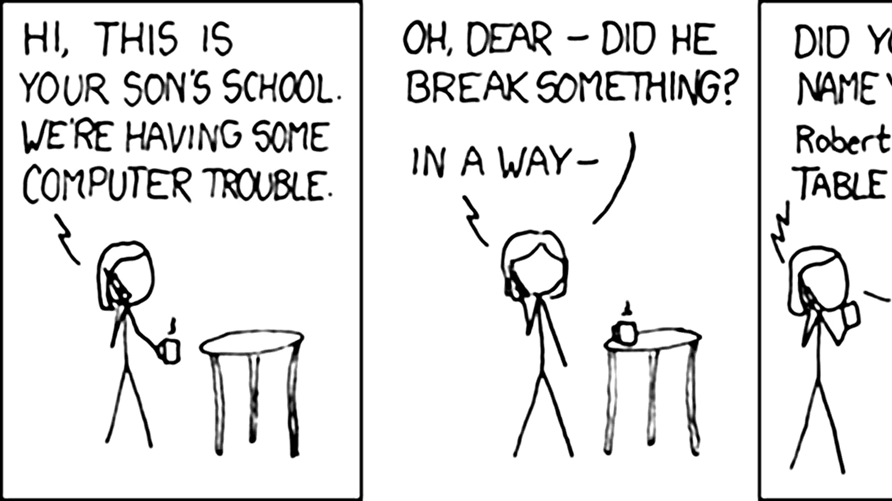

<div class='meta'>
image: xkcd-327.webp:0:50
</div>

# SQL Injection

<p class='abstract'>
In diesem Kapitel lernst du, wie Angreifer durch geschickte Manipulation
von Nutzereingaben in Webformularen Zugriff auf Datenbanken erlangen können.
Dies funktioniert, wenn die Software, die die Eingaben verarbeitet, nicht
sorgfältig genug programmiert wurde.
Dazu werden wir uns zuerst eine neue Datenbank für unser Experiment anlegen,
die wir dann mit einigen Testdaten füllen.</p>

## Test-Datenbank anlegen

Erstelle eine neue Datenbank in deinem [Workspace-Profil](/profil) und kopiere den Namen der Datenbank in die Zwischenablage, da wir ihn später benötigen werden. In diesem Tutorial werden wir die Datenbank `db_1234` nennen – ersetze diese Bezeichnung
also immer durch den Namen deiner Datenbank.

Öffne ein Terminal im Workspace und gib den folgenden Befehl ein, um die Testdaten
herunterzuladen:

```bash
wget https://github.com/specht/workspace-files/raw/main/users.sql
```

Importiere die Testdaten in deine Datenbank (achte darauf, dass du den Namen deiner
neuen Datenbank angibst):

```bash
mycli db_1234 < users.sql
```

Starte anschließend `mycli` und überprüfe mit Hilfe von `SHOW TABLES` und einem  `SELECT`-Statement, ob die Daten korrekt importiert wurden:

<div style="max-width: 100%; overflow-x: auto;">
<table class='table table-sm'>
<thead>
<tr>
<th>login</th>
<th>password</th>
<th>address</th>
</tr>
</thead>
<tbody>
<tr>
<td>admin</td>
<td>YLrelnmPDPB-ZhQ1GzRxiEf</td>
<td>2683 John Calvin Drive, Chicago IL 60603</td>
</tr>
<tr>
<td>alice</td>
<td>asdf</td>
<td>578 Gordon Street, Claremont CA 91711</td>
</tr>
<tr>
<td>bob</td>
<td>1234</td>
<td>525 Cambridge Drive, Phoenix AZ 85039</td>
</tr>
<tr>
<td>mallory</td>
<td>hunter2</td>
<td>3747 Haven Lane, Lansing MI 48933</td>
</tr>
</tbody>
</table>
</div>

## Test-Programm schreiben

Erstelle eine neue Datei `login.rb` und füge den folgenden Ruby-Code ein:

_include_file(login.rb, ruby)

Hinweise:

- Mit Hilfe von <code>#&#8288;{ ... }</code> können Variablen in Strings eingebettet werden (Z. 16 und 17) &ndash; genauso wie z. B. in Python mit f-Strings. Man nennt diese Technik auch [String Interpolation](https://en.wikipedia.org/wiki/String_interpolation).
- Das Backslash am Ende einer Zeile (Z. 15 und 16) wird verwendet, um einen String über mehrere Zeilen zu schreiben. Es handelt sich also um einen String ohne Zeilenumbruch,
der auf mehrere Zeilen verteilt ist, um die Lesbarkeit zu verbessern.

## Experimentieren

Notiere dir die SQL-Statements, die aus den folgenden Aufgaben hervorgehen, weil du sie später benötigen wirst.

<div class='hint books'>
<strong>Aufgabe 1:</strong> Teste das Programm und beschreibe kurz die Funktionsweise. Welchen Zweck erfüllt es?
</div>

<div class='hint books'>
<strong>Aufgabe 2:</strong> Erläutere die SQL-Abfrage, die dabei zum Einsatz kommt.
</div>

<div class='hint books'>
<div class='mb-1'>
<strong>Aufgabe 3:</strong> Wie in vielen anderen Sprachen auch, können in SQL Kommentare
mit <code>#</code> oder <code>--</code> eingefügt werden, die bis zum Ende der Zeile gelten und nicht ausgeführt werden.
</div>
<div class='mb-1'>
Im vorliegenden Programm wird die Eingabe des Nutzers unverändert in die SQL-Abfrage eingebettet, womit einem möglichen Angreifer die Möglichkeit gegeben wird, die Abfrage zu manipulieren. Finde eine Eingabe, die es dir ermöglicht, dich als Administrator anzumelden, ohne das Passwort zu kennen.
</div>
</div>

<div class='hint books'>
<div class='mb-1'>
<strong>Aufgabe 4:</strong> Versuche, dich mit dem folgenden Login und einem leeren Passwort anzumelden:
</div>
<div class='mb-1'>
<code>mallory' UNION SELECT address FROM users WHERE LOGIN='mallory' ORDER BY login ASC #</code>
</div>
<div class='mb-1'>
Was kannst du beobachten?
</div>
</div>

<div class='hint books'>
<strong>Aufgabe 5:</strong> Formuliere die Abfrage so um, dass du das Passwort des Administrators auslesen kannst.
</div>

## Behebung der Sicherheitslücke

Wie du siehst, kann es gefährlich werden, wenn man Nutzereingaben blind vertraut. Es ist daher bei sicherheitskritischen Systemen notwendig, alle Eingaben mit einer gesunden Portion Misstrauen zu betrachten. Das Problem liegt hier auf der Seite der Software, die solche Angriffe zulässt.

Der Angriffsmechanismus, den wir hier verwendet haben, heisst »SQL Injection«, weil ein Angreifer eigenen SQL-Code in eine SQL-Abfrage einschleust und somit das Programm dazu zwingen kann, andere Dinge zu tun, als ursprünglich vorhergesehen waren. Wir können die Sicherheitslücke leicht schließen, indem wir verhindern, dass Nutzereingaben direkt in die SQL-Abfrage eingefügt werden. Anstatt die Eingabe über String Interpolation direkt einzubinden, können wir ein »Prepared Statement« verwenden. Hierbei wird eine SQL-Abfrage mit Platzhaltern vorbereitet, die dann mit den Nutzereingaben ausgeführt wird. Der SQL-Code wird also nicht direkt mit den Nutzereingaben vermischt, sondern getrennt behandelt.

Kommentiere die Zeilen 15 bis 17 aus und füge dahinter die folgenden Zeilen ein:

```ruby
query = CLIENT.prepare("SELECT login FROM users WHERE login = ? AND password = ? LIMIT 1;")
rows = query.execute(login, password).to_a
```

<div class='hint'>
Du kannst Zeilen in Ruby auskommentieren, indem du sie mit einem <code>#</code> beginnen lässt. Schneller geht es, wenn du die Zeilen markierst und dann <span class='key'>Strg</span><span class='key'>#</span> drückst (bzw. <span class='key'>Ctrl</span><span class='key'>/</span>, falls du ein US-Tastaturlayout verwendest).
</div>

<div class='hint books'>
<strong>Aufgabe 6:</strong> Überprüfe, ob das Problem behoben wurde, indem du die vorherigen Angriffe erneut ausführst:
<ol>
<li>Versuche, dich als Administrator anzumelden, ohne das Passwort zu kennen.</li>
<li>Versuche, die Adresse von Mallory auszulesen.</li>
<li>Versuche, das Passwort des Administrators auszulesen.</li>
</ol>
</div>

## Wichtiger Hinweis

Das Eindringen in fremde Computersysteme bzw. das Auspähen von Daten ist illegal und wird bestraft. Die hier gezeigten Beispiele dienen ausschließlich der Demonstration von Sicherheitslücken und sollen dazu beitragen, dein Bewusstsein für die Gefahren bei der Programmierung von Software und der Verarbeitung von Nutzereingaben zu schärfen.
Es ist wichtig, dass du dein Wissen verantwortungsbewusst einsetzt und nur auf Systemen experimentierst, für die du die ausdrückliche Erlaubnis hast oder die du selbst betreibst.



<em>Cartoon von Randall Munroe, [xkcd.com](https://xkcd.com/327/).</em>
