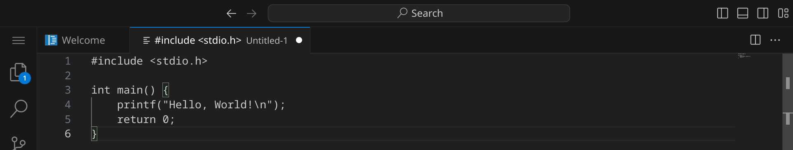
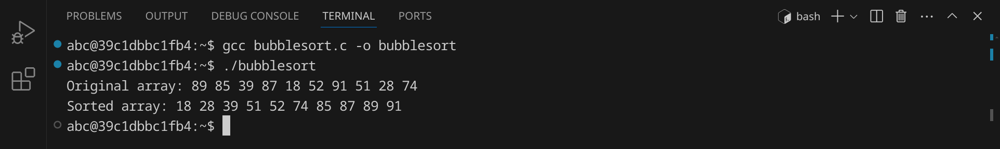

<div class='meta'>
image: c-logo.png
</div>

<div class='floatright mt-5' style='width: 12em;'>
    
    <p>Dennis Ritchie</p>
</div>

# C <span style='font-size: 80%;'>(1972)</span>

<p class='abstract'>
C ist eine imperative Programmiersprache, die 1972 von Dennis Ritchie bei Bell Labs entwickelt wurde. Sie ist eine der ältesten und einflussreichsten Programmiersprachen und dient als Grundlage für viele andere Programmiersprachen. C ist eine kompilierte Sprache, die eine hohe Leistung und eine enge Kontrolle über die Hardware bietet. Sie wird häufig für die Entwicklung von Betriebssystemen, Treibern, eingebetteten Systemen und Anwendungen mit hoher Leistung verwendet.
</p>

<!-- ## Eigenschaften

- **Imperative Programmiersprache**: C ist eine imperative Programmiersprache, die auf der sequentiellen Ausführung von Anweisungen basiert.
- **Kompilierte Sprache**: C ist eine kompilierte Sprache, was bedeutet, dass der Code in Maschinencode übersetzt wird, bevor er ausgeführt wird.
- **Hohe Leistung**: C ist eine der schnellsten Programmiersprachen und wird häufig für rechenintensive Anwendungen eingesetzt.
- **Hardware-Nähe**: C bietet eine enge Kontrolle über die Hardware und ermöglicht es, direkt mit Speicheradressen und Registern zu arbeiten.
- **Portabilität**: C-Code ist in der Regel portabel und kann auf verschiedenen Plattformen und Betriebssystemen ausgeführt werden.
- **Modularität**: C unterstützt die modulare Programmierung, was es ermöglicht, den Code in separate Module oder Dateien aufzuteilen.
- **Standardbibliothek**: C verfügt über eine umfangreiche Standardbibliothek, die eine Vielzahl von Funktionen und Datentypen bereitstellt. -->

## Hello, world!

C-Programme werden in Textdateien mit der Endung `.c` geschrieben. Diese Dateien werden anschließend von einem Compiler in ausführbare Dateien übersetzt, die auf deinem Computer direkt ausgeführt werden können. Es gibt eine Vielzahl von Compilern, die du verwenden kannst, aber wir werden hier den freien »GNU C Compiler« `gcc` verwenden, der auf den meisten Systemen verfügbar ist.

Stelle zuerst sicher, dass du keinen Ordner geöffnet hast. Um sicherzugehen, drücke einfach den Shortcut für »Ordner schließen«: <span class='key'>Strg</span><span class='key'>K</span> und dann <span class='key'>F</span>. Dein Workspace sollte jetzt ungefähr so aussehen:


### Quelltext schreiben

Klicke auf »New File« und wähle als Dateityp »Text File«.


Schreibe nun den folgenden Code in die Datei:

_include_file(hello.c, c)

Da Visual Studio Code noch nicht weiß, dass es sich um C-Quelltext handelt, ist dein Programm momentan noch einfarbig, aber das wird sich gleich ändern. An dem weißen Punkt erkennst du, dass deine Änderungen noch nicht gespeichert sind.



Drücke nun <span class='key'>Strg</span><span class='key'>S</span>, um die Datei zu speichern. Gib `hello.c` ein – der vollständige Pfad zu deiner Datei lautet dann `/workspace/hello.c`.


Sobald du die Datei gespeichert hast, wird sie automatisch als C-Datei erkannt und die Syntax wird hervorgehoben.


### Kompilieren und ausführen

Bevor wir das Programm ausführen können, müssen wir es kompilieren. Dadurch wird der Quelltext in Maschinencode übersetzt, den dein Computer ausführen kann.

Öffne dazu ein Terminal, indem du entweder <span class='key'>Strg</span><span class='key'>J</span> drückst oder das Panel-Symbol  rechts oben drückst. Dein Fenster sollte jetzt ungefähr so aussehen:


Um das Programm zu kompilieren, gib folgenden Befehl ein:

```bash
gcc hello.c -o hello
```

<div class='hint'>
Du musst nicht den vollständigen Dateinamen schreiben. Schreib einfach <code>gcc he</code> und drücke <span class='key'>Tab</span>, um den Dateinamen automatisch zu <code>hello.c</code> vervollständigen zu lassen. Du kannst danach ganz normal weiterschreiben.
</div>

Wenn du keinen Fehler gemacht hast, wird das Programm erfolgreich kompiliert und die ausführbare Datei `hello` wird im selben Verzeichnis erstellt. Du kannst dies überprüfen, indem du dir die Dateien im aktuellen Verzeichnis mit `ls` oder `ls -l` anzeigen lässt:


Die grüne Datei `hello` ist die ausführbare Datei – im Unterschied zu Windows, wo ausführbare Dateien die Endung `.exe` haben, haben ausführbare Dateien unter Linux keine Endung. Um das Programm auszuführen, gib folgenden Befehl ein:

```bash
./hello
```

Das Programm sollte die Nachricht `Hello, World!` im Terminal ausgeben. Du kannst beide Schritte auch in einem Befehl kombinieren:

```bash
gcc hello.c -o hello && ./hello
```

<div class='hint'>
Die Zeichenkombination <code>&amp;&amp;</code> sorgt dafür, dass der zweite Befehl nur ausgeführt wird, wenn der erste erfolgreich war.
</div>

### Fehler finden und beheben

Wenn du einen Fehler im Code machst, wird der Compiler eine Fehlermeldung ausgeben. Versuche zum Beispiel, statt `printf` das Wort `prinft` zu schreiben:

```c
prinft("Hello, World!\n");
```

Speichere die Datei und führe den Compiler erneut aus:

```bash
gcc hello.cpp -o hello
```

<div class='hint'>
Nutze die Pfeiltaste hoch <span class='key'>↑</span>, um den letzten Befehl erneut einzugeben. So kannst du schnell dein Programm testen, nachdem du es verändert hast.
</div>

Der Compiler sollte eine Fehlermeldung ausgeben, die dir hilft, den Fehler zu finden:


Es lohnt sich, die Fehlermeldungen genau zu lesen, um den Fehler zu finden und zu beheben. Achte auf die Zeilennummer (in diesem Beispiel 4) und den Text, der dir sagt, was falsch ist. Denke daran, den Fehler wieder zu beheben, bevor du das nächste Beispiel ausprobierst.

## Primfaktorenzerlegung

Im zweiten Beispiel wollen wir eine Zahl in ihre Primfaktoren zerlegen. An diesem Beispiel kannst du sehen, wie man in C Benutzereingaben verarbeitet und Schleifen verwendet.
Erstelle eine neue Datei mit <span class='key'>Strg</span><span class='key'>Shift</span><span class='key'>N</span> und schreibe den folgenden Code hinein:

_include_file(factor.c, c)

Speichere die Datei unter dem Namen `factor.c`. Kompiliere das Programm:

```bash
gcc factor.c -o factor
```

Falls du keine Fehlermeldung erhältst, kannst du das Programm ausführen und testen:


Das Programm hat die Zahl 123 in ihre Primfaktoren zerlegt und ausgegeben. Probiere aus, was passiert, wenn du die Zahl 3000000000 eingibst. Was könnte der Grund dafür sein?

## Bubblesort

Im dritten Beispiel wollen wir eine Liste von 10 Zufallszahlen sortieren. Dafür verwenden wir den [Bubblesort-Algorithmus](https://de.wikipedia.org/wiki/Bubblesort), der zwar nicht besonders effizient ist, aber sehr einfach zu verstehen und zu implementieren. Der Bubblesort-Algorithmus funktioniert, indem er die Liste mehrmals durchläuft und benachbarte Elemente vertauscht, wenn sie in der falschen Reihenfolge sind.

An diesem Beispiel kannst du sehen, wie man in C Arrays verwendet, Funktionen verwendet und Schleifen verschachtelt.

Erstelle eine neue Datei und schreibe den folgenden Code hinein:

_include_file(bubblesort.c, c)

Speichere die Datei unter dem Namen `bubblesort.c`. Kompiliere das Programm:

```bash
gcc bubblesort.c -o bubblesort
```
Falls du keine Fehlermeldung erhältst, kannst du das Programm ausführen und testen:



Das Programm hat eine Liste von 10 Zufallszahlen sortiert. Versuche, den Quelltext so zu verändern, dass statt 10 Zahlen 100 oder mehr Zahlen sortiert werden.

## Zusammenfassung

In diesem Kapitel hast du an drei Beispielen gesehen, wie man ein einfaches C-Programm schreiben, kompilieren und ausführen kann. Das ist natürlich nur ein erster Eindruck. Um C wirklich zu beherrschen, musst du noch viel mehr lernen – am besten, indem du eigene Programme schreibst und ausprobierst. Die Buchhandlungen, Bibliotheken und Youtube sind voll von Material für dich. Viel Spaß beim Programmieren!

