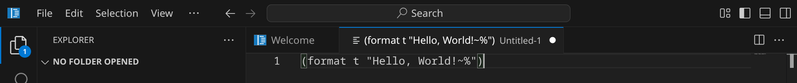
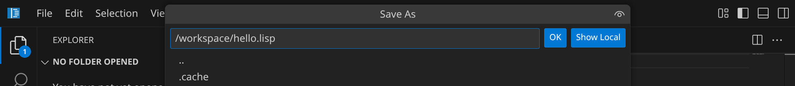
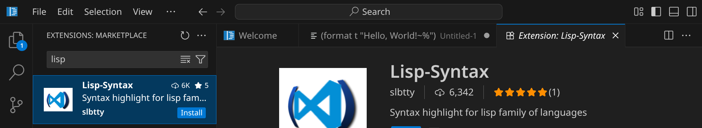
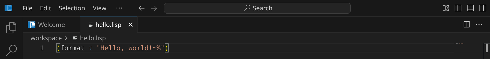
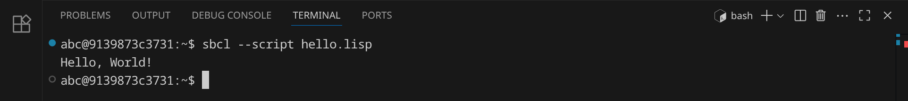
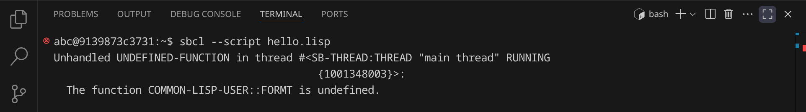
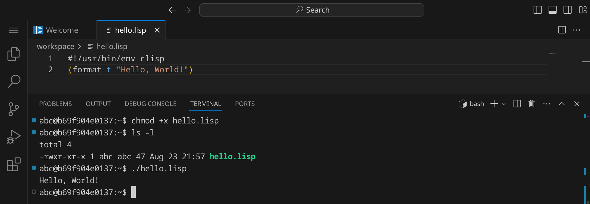
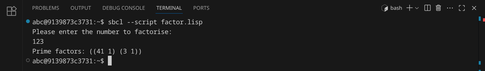
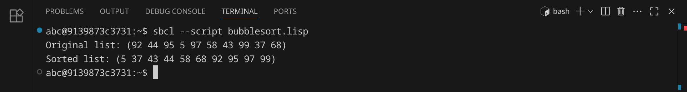

<div class='meta'>
image: clisp-logo.png
</div>

# Lisp <span style='font-size: 80%;'>(1958)</span>

<div class='floatright' style='width: 12em;'>
    
    <p>John McCarthy</p>
</div>

<p class='abstract'>
Die Programmiersprache Lisp wurde 1958 von John McCarthy am MIT entwickelt und ist eine Sprache, die auf der rekursiven Funktionstheorie basiert.
Nachdem sich zunächst eine Vielzahl an Dialkten entwickelt hatte, wurde 1984 Common Lisp als Vereinheitlichung der Sprache veröffentlicht.
Der Hauptaspekt dieser Sprache sind Listen, die als Datenstruktur und Programmiersprache dienen. Common Lisp wird in der KI-Forschung und in der Softwareentwicklung eingesetzt.
</p>

<!-- ## Eigenschaften

- **Funktional**: Common Lisp ist eine funktionale Programmiersprache, die auf der rekursiven Funktionstheorie basiert.
- **Dynamisch**: Common Lisp ist eine dynamisch typisierte Sprache, was bedeutet, dass Variablen ihren Datentyp zur Laufzeit ändern können.
- **Objektorientierung**: Common Lisp unterstützt die objektorientierte Programmierung, die auf der Verwendung von Objekten und Klassen basiert.
- **Makros**: Common Lisp bietet Makros, die es ermöglichen, den Code zur Kompilierzeit zu transformieren.
- **Hohe Performance**: Common Lisp ist eine der schnellsten Programmiersprachen und wird häufig für rechenintensive Anwendungen eingesetzt.
- **Community**: Common Lisp hat eine aktive und engagierte Community, die eine Vielzahl von Bibliotheken und Frameworks entwickelt hat. -->

## Hello, world!

Lisp ist eine Skriptsprache, was bedeutet, dass der Code zur Laufzeit interpretiert wird. Du hast zwei Möglichkeiten, Lisp-Code auszuführen:

1. Du kannst Lisp-Code direkt in der CLISP-Shell ausführen.
2. Du kannst Lisp-Code in einer Textdatei speichern und dann ausführen.

**Möglichkeit 1:** Lisp-Code in der CLISP-Shell ausführen

Öffne dazu ein Terminal, indem du entweder <span class='key'>Strg</span><span class='key'>J</span> drückst oder das Panel-Symbol  rechts oben drückst. Dein Fenster sollte jetzt ungefähr so aussehen:


Starte nun die CLISP-Shell, indem du `clisp` eingibst und dann <span class='key'>Enter</span> drückst. Du solltest eine Ausgabe wie diese sehen:


Jetzt kannst du Lisp-Code direkt in der Shell eingeben und ausführen. Schreibe einfach `(format t "Hello, world!")` und drücke <span class='key'>Enter</span>. Du solltest die Ausgabe `Hello, world!` sehen.

Du kannst die CLISP-Shell wieder beenden, indem du `(exit)` eingibst und <span class='key'>Enter</span> drückst oder einfach <span class='key'>Strg</span><span class='key'>D</span> drückst.

**Möglichkeit 2:** Lisp-Code in einer Textdatei speichern und ausführen

Lisp-Programme werden in Textdateien mit der Endung `.lisp` geschrieben. Ein Lisp-Interpreter liest anschließend den Quelltext und führt ihn aus.

Stelle zuerst sicher, dass du keinen Ordner geöffnet hast. Um sicherzugehen, drücke einfach den Shortcut für »Ordner schließen«: <span class='key'>Strg</span><span class='key'>K</span> und dann <span class='key'>F</span>. Dein Workspace sollte jetzt ungefähr so aussehen:


### Quelltext schreiben

Klicke auf »New File« und wähle als Dateityp »Text File« (oder bestätige einfach mit <span class='key'>Enter</span>).


Schreibe nun den folgenden Code in die Datei:

_include_file(hello.lisp, clisp)

Da Visual Studio Code noch nicht weiß, dass es sich um Lisp-Quelltext handelt, ist dein Programm momentan noch einfarbig, aber das wird sich gleich ändern. An dem weißen Punkt erkennst du, dass deine Änderungen noch nicht gespeichert sind.



Drücke nun <span class='key'>Strg</span><span class='key'>S</span>, um die Datei zu speichern. Gib `hello.rb` ein – der vollständige Pfad zu deiner Datei lautet dann `/workspace/hello.rb`.



Da Lisp standardmäßig nicht von Visual Studio Code unterstützt wird, müssen wir noch eine passende Erweiterung installieren. Klicke dazu auf das Erweiterungs-Symbol  in der Seitenleiste oder drücke <span class='key'>Strg</span><span class='key'>Shift</span><span class='key'>X</span>. Suche nach der Erweiterung »Lisp-Syntax« und installiere sie.



Anschließend solltest du dein Lisp-Programm farbig sehen:



### Skript ausführen

Um unser Programm auszuführen, müssen wir den Lisp-Interpreter aufrufen (in unserem Fall `clisp`) und ihm den Dateinamen unseres Programms übergeben.

Öffne dazu ein Terminal, indem du <span class='key'>Strg</span><span class='key'>J</span> drückst und gib folgenden Befehl ein:

```bash
clisp hello.lisp
```

<div class='hint'>
Du musst nicht den vollständigen Dateinamen schreiben. Schreib einfach <code>clisp he</code> und drücke <span class='key'>Tab</span>, um den Dateinamen automatisch zu <code>hello.lisp</code> vervollständigen zu lassen. Du kannst danach ganz normal weiterschreiben.
</div>

Das Programm sollte die Nachricht `Hello, World!` im Terminal ausgeben:



### Fehler finden und beheben

Wenn du einen Fehler im Code machst, wird Ruby eine Fehlermeldung ausgeben. Versuche zum Beispiel, statt `format` das Wort `formt` zu schreiben:

```clisp
    (formt t "Hello, World!"))
```

Speichere die Datei und führe das Skript erneut aus:

```bash
clisp hello.lisp
```

<div class='hint'>
Nutze die Pfeiltaste hoch <span class='key'>↑</span>, um den letzten Befehl erneut einzugeben. So kannst du schnell dein Programm testen, nachdem du es verändert hast.
</div>

CLISP sollte eine Fehlermeldung ausgeben, die dir hilft, den Fehler zu finden:



Es lohnt sich, die Fehlermeldungen genau zu lesen, um den Fehler zu finden und zu beheben. Leider gibt CLISP im Gegensatz zu vielen anderen Interpretern keine Zeilennummer an, aber die Meldung sollte dir trotzdem helfen, den Fehler zu finden. Denke daran, den Fehler wieder zu beheben, bevor du das nächste Beispiel ausprobierst.

### Shebang `#!`

Bisher musst du, um dein Skript auszuführen, immer den CLISP-Interpreter explizit aufrufen. Wenn du dein Skript wie ein normales Programm ausführen möchtest, kannst du ein sogenanntes Shebang am Anfang deiner Datei hinzufügen. Das Shebang besteht aus einer Raute `#` gefolgt von einem Ausrufezeichen `!` und dem Pfad zum CLISP-Interpreter. In unserem Fall sieht das so aus:

```clisp
#!/usr/bin/env clisp
```

Füge diese Zeile ganz oben in deinem Skript ein und speichere die Datei. Bevor wir das Skript ausführen können, müssen wir es noch ausführbar machen. Das machen wir mit dem Befehl `chmod`:

```bash
chmod +x hello.lisp
```
Jetzt können wir das Skript direkt ausführen:

```bash
./hello.lisp
```



## Primfaktorenzerlegung

Im zweiten Beispiel wollen wir eine Zahl in ihre Primfaktoren zerlegen.
An diesem Beispiel kannst du sehen, wie man in Lisp Benutzereingaben verarbeitet und Schleifen verwendet.
Erstelle eine neue Datei mit <span class='key'>Strg</span><span class='key'>Alt</span><span class='key'>N</span> und schreibe den folgenden Code hinein:

_include_file(factor.lisp, clisp)

Speichere die Datei unter dem Namen `factor.lisp` und führe sie aus:



Das Programm hat die Zahl 123 in ihre Primfaktoren zerlegt und ausgegeben. Anders als andere Programmiersprachen kann Lisp auch die Zahl 3000000000 in Sekundenbruchteilen zerlegen. Wenn du allerdings eine sehr große Zahl wie 123456789123456789 verwendest, dauert die Berechnung sehr lange (probier es gern aus, du kannst das Programm mit <span class='key'>Strg</span><span class='key'>C</span> abbrechen).

## Bubblesort

Im dritten Beispiel wollen wir eine Liste von 10 Zufallszahlen sortieren. Dafür verwenden wir den [Bubblesort-Algorithmus](https://de.wikipedia.org/wiki/Bubblesort), der zwar nicht besonders effizient ist, aber sehr einfach zu verstehen und zu implementieren. Der Bubblesort-Algorithmus funktioniert, indem er die Liste mehrmals durchläuft und benachbarte Elemente vertauscht, wenn sie in der falschen Reihenfolge sind.

An diesem Beispiel kannst du sehen, wie man in Lisp Arrays verwendet, Funktionen verwendet und Schleifen verschachtelt.

Erstelle eine neue Datei und schreibe den folgenden Code hinein:

_include_file(bubblesort.lisp, clisp)

Speichere das Skript unter dem Namen `bubblesort.lisp` und führe es aus:



Das Programm hat eine Liste von 10 Zufallszahlen sortiert. Versuche, den Quelltext so zu verändern, dass statt 10 Zahlen 100 oder mehr Zahlen sortiert werden.

## Zusammenfassung

In diesem Kapitel hast du an drei Beispielen gesehen, wie man ein einfaches Lisp-Skript schreiben und ausführen kann. Das ist natürlich nur ein erster Eindruck. Um Lisp wirklich zu beherrschen, musst du noch viel mehr lernen – am besten, indem du eigene Skripte schreibst und ausprobierst. Die Buchhandlungen, Bibliotheken und Youtube sind voll von Material für dich. Viel Spaß beim Programmieren!
