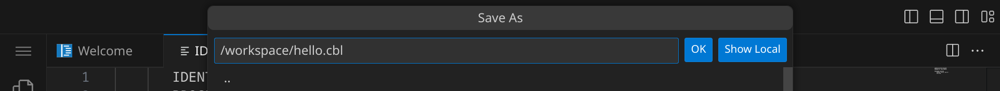
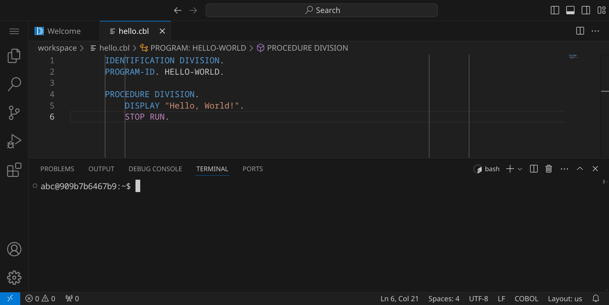
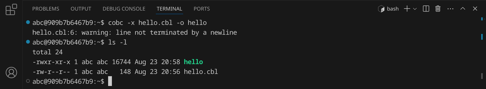
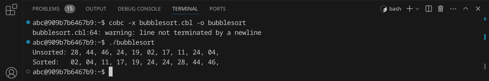

<div class='meta'>
image: cobol-logo.png
</div>

# COBOL <span style='font-size: 80%;'>(1959)</span>

<div class='floatright' style='width: 12em;'>
    
    <p>Grace Hopper</p>
</div>

<p class='abstract'>
COBOL (Common Business-Oriented Language) wurde 1959 von Grace Hopper entwickelt. Es war die erste Programmiersprache, die speziell für Geschäftsanwendungen entwickelt wurde. COBOL ist eine imperative Programmiersprache, die für die Verarbeitung von Daten in Form von Datensätzen optimiert ist. Trotz ihres hohen Alters wird die Programmiersprache COBOL immer noch in der Unternehmenssoftwareentwicklung eingesetzt.
</p>

<!-- ## Eigenschaften

- **Imperativ**: COBOL ist eine imperative Programmiersprache, die die Verarbeitung von Daten in Form von Datensätzen unterstützt.
- **Geschäftsorientiert**: COBOL wurde speziell für Geschäftsanwendungen entwickelt.
- **Datensatzorientiert**: COBOL ist für die Verarbeitung von Daten in Form von Datensätzen optimiert.
- **Weit verbreitet**: COBOL wird immer noch in der Unternehmenssoftwareentwicklung eingesetzt. -->

## Hello, world!

COBOL-Programme werden in Textdateien mit der Endung `.cbl` oder `.cob` geschrieben. Diese Dateien werden anschließend von einem Compiler in ausführbare Dateien übersetzt, die auf deinem Computer direkt ausgeführt werden können.

Stelle zuerst sicher, dass du keinen Ordner geöffnet hast. Um sicherzugehen, drücke einfach den Shortcut für »Ordner schließen«: <span class='key'>Strg</span><span class='key'>K</span> und dann <span class='key'>F</span>. Dein Workspace sollte jetzt ungefähr so aussehen:


### Quelltext schreiben

Klicke auf »New File« und wähle als Dateityp »Text File«.


Schreibe nun den folgenden Code in die Datei:

_include_file(hello.cbl, c)

Da Visual Studio Code noch nicht weiß, dass es sich um COBOL-Quelltext handelt, ist dein Programm momentan noch einfarbig, aber das wird sich gleich ändern. An dem weißen Punkt erkennst du, dass deine Änderungen noch nicht gespeichert sind.


Drücke nun <span class='key'>Strg</span><span class='key'>S</span>, um die Datei zu speichern. Gib `hello.cbl` ein – der vollständige Pfad zu deiner Datei lautet dann `/workspace/hello.cbl`.



<div class='hint'>
Achte darauf, dass du deine Datei nicht aus Versehen <code>hello.cbl.</code> (mit einem Punkt am Ende) nennst, da Visual Studio Code als Dateiname <code>IDENTIFICATION DIVISION.</code> vorschlägt.
</div>

Da COBOL standardmäßig nicht von Visual Studio Code unterstützt wird, müssen wir noch eine passende Erweiterung installieren. Klicke dazu auf das Erweiterungs-Symbol  in der Seitenleiste oder drücke <span class='key'>Strg</span><span class='key'>Shift</span><span class='key'>X</span>. Suche nach der Erweiterung »COBOL Language Support« und installiere sie.


Alternativ kannst du auch <span class='key'>Strg</span><span class='key'>P</span> drücken und `ext install broadcomMFD.cobol-language-support` eingeben, um die Erweiterung zu installieren.

Anschließend solltest du dein COBOL-Programm farbig sehen:


Wie man sieht, hat COBOL eine bestimmte Vorstellung davon, wie der Code eingerückt sein sollte. Das liegt daran, dass COBOL ein sehr altes Sprachdesign hat und auf Lochkartenprogrammierung ausgelegt ist. Die Einrückung ist also nicht nur eine Frage des Stils, sondern auch der Funktionalität. Früher wurde der Code auf solchen Formularen geschrieben:


### Kompilieren und ausführen

Bevor wir das Programm ausführen können, müssen wir es kompilieren. Dadurch wird der Quelltext in Maschinencode übersetzt, den dein Computer ausführen kann.

Öffne dazu ein Terminal, indem du entweder <span class='key'>Strg</span><span class='key'>J</span> drückst oder das Panel-Symbol  rechts oben drückst. Dein Fenster sollte jetzt ungefähr so aussehen:



Um das Programm zu kompilieren, gib folgenden Befehl ein:

```bash
cobc -x hello.cbl -o hello
```

<div class='hint'>
Du musst nicht den vollständigen Dateinamen schreiben. Schreib einfach <code>cobc -x he</code> und drücke <span class='key'>Tab</span>, um den Dateinamen automatisch zu <code>hello.cbl</code> vervollständigen zu lassen. Du kannst danach ganz normal weiterschreiben.
</div>

Falls du die Warnung _»line not terminated b a newline«_ erhältst, ist dies nicht weiter schlimm - sie bedeutet nur, dass die letzte Zeile deines Programms keinen Zeilenumbruch am Ende hat. Du kannst sie einfach ignorieren. Wenn du keinen Fehler gemacht hast, wird das Programm erfolgreich kompiliert und die ausführbare Datei `hello` wird im selben Verzeichnis erstellt. Du kannst dies überprüfen, indem du dir die Dateien im aktuellen Verzeichnis mit `ls` oder `ls -l` anzeigen lässt:



Die grüne Datei `hello` ist die ausführbare Datei – im Unterschied zu Windows, wo ausführbare Dateien die Endung `.exe` haben, haben ausführbare Dateien unter Linux keine Endung. Um das Programm auszuführen, gib folgenden Befehl ein:

```bash
./hello
```

Das Programm sollte die Nachricht `Hello, World!` im Terminal ausgeben. Du kannst beide Schritte auch in einem Befehl kombinieren:

```bash
cobc -x hello.cbl -o hello && ./hello
```

<div class='hint'>
Die Zeichenkombination <code>&amp;&amp;</code> sorgt dafür, dass der zweite Befehl nur ausgeführt wird, wenn der erste erfolgreich war.
</div>

### Fehler finden und beheben

Wenn du einen Fehler im Code machst, wird der Compiler eine Fehlermeldung ausgeben. Versuche zum Beispiel, statt `DISPLAY` das Wort `DISPLY` zu schreiben:

```c
           DISPLY "Hello, World!".
```

Speichere die Datei und führe den Compiler erneut aus:

```bash
cobc -x hello.cbl -o hello
```

<div class='hint'>
Nutze die Pfeiltaste hoch <span class='key'>↑</span>, um den letzten Befehl erneut einzugeben. So kannst du schnell dein Programm testen, nachdem du es verändert hast.
</div>

Der Compiler sollte eine Fehlermeldung ausgeben, die dir hilft, den Fehler zu finden:


Es lohnt sich, die Fehlermeldungen genau zu lesen, um den Fehler zu finden und zu beheben. Achte auf die Zeilennummer (in diesem Beispiel 5) und den Text, der dir sagt, was falsch ist. Denke daran, den Fehler wieder zu beheben, bevor du das nächste Beispiel ausprobierst.

## Primfaktorenzerlegung

Im zweiten Beispiel wollen wir eine Zahl in ihre Primfaktoren zerlegen. An diesem Beispiel kannst du sehen, wie man in COBOL Benutzereingaben verarbeitet und Schleifen verwendet.
Erstelle eine neue Datei mit <span class='key'>Strg</span><span class='key'>Alt</span><span class='key'>N</span> und schreibe den folgenden Code hinein:

_include_file(factor.cbl, c)

Speichere die Datei unter dem Namen `factor.cbl`. Kompiliere das Programm:

```bash
cobc -x factor.cbl -o factor
```

Falls du keine Fehlermeldung erhältst, kannst du das Programm ausführen und testen:


Das Programm hat die Zahl 123 in ihre Primfaktoren zerlegt und ausgegeben. Probiere aus, was passiert, wenn du die Zahl 3000000000 eingibst. Was könnte der Grund dafür sein?

## Bubblesort

Im dritten Beispiel wollen wir eine Liste von 10 Zufallszahlen sortieren. Dafür verwenden wir den [Bubblesort-Algorithmus](https://de.wikipedia.org/wiki/Bubblesort), der zwar nicht besonders effizient ist, aber sehr einfach zu verstehen und zu implementieren. Der Bubblesort-Algorithmus funktioniert, indem er die Liste mehrmals durchläuft und benachbarte Elemente vertauscht, wenn sie in der falschen Reihenfolge sind.

An diesem Beispiel kannst du sehen, wie man in COBOL Arrays verwendet und Schleifen verschachtelt.

Erstelle eine neue Datei und schreibe den folgenden Code hinein:

_include_file(bubblesort.cbl, c)

Speichere die Datei unter dem Namen `bubblesort.cbl`. Kompiliere das Programm:

```bash
cobc -x bubblesort.cbl -o bubblesort
```
Falls du keine Fehlermeldung erhältst, kannst du das Programm ausführen und testen:



Das Programm hat eine Liste von 10 Zufallszahlen sortiert. Versuche, den Quelltext so zu verändern, dass statt 10 Zahlen 100 oder mehr Zahlen sortiert werden.

## Zusammenfassung

In diesem Kapitel hast du an drei Beispielen gesehen, wie man ein einfaches COBOL-Programm schreiben, kompilieren und ausführen kann. Das ist natürlich nur ein erster Eindruck. Um COBOL wirklich zu beherrschen, musst du noch viel mehr lernen – am besten, indem du eigene Programme schreibst und ausprobierst. Die Buchhandlungen, Bibliotheken und Youtube sind voll von Material für dich. Viel Spaß beim Programmieren!

