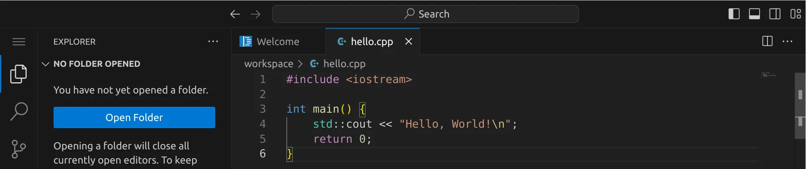

<div class='meta'>
image: cpp-logo.png
</div>

# Programmieren in C++

<p class='abstract'>
C++ ist eine Programmiersprache, die im Jahr 1983 von Bjarne Stroustrup entwickelt wurde. Sie ist eine Erweiterung der Programmiersprache C und wird in vielen Bereichen eingesetzt, darunter Spieleentwicklung, Betriebssysteme und Anwendungen, die hohe Leistung erfordern.
</p>

## Hello, world!

C++-Programme werden in Textdateien mit der Endung `.cpp` geschrieben. Diese Dateien werden anschließend von einem Compiler in ausführbare Dateien übersetzt, die auf deinem Computer direkt ausgeführt werden können. Es gibt eine Vielzahl von Compilern, die du verwenden kannst, aber wir werden hier den freien »GNU C Compiler« `gcc` verwenden, der auf den meisten Systemen verfügbar ist.

Stelle zuerst sicher, dass du keinen Ordner geöffnet hast. Um sicherzugehen, drücke einfach den Shortcut für »Ordner schließen«: <span class='key'>Strg</span><span class='key'>K</span> und dann <span class='key'>F</span>. Dein Workspace sollte jetzt ungefähr so aussehen:


### Quelltext schreiben

Klicke auf »New File« und wähle als Dateityp »Text File«.


Schreibe nun den folgenden Code in die Datei:

```cpp
#include <iostream>

int main() {
    std::cout << "Hello, World!\n";
    return 0;
}
```

Speichere die Datei unter dem Namen `hello.cpp`. Du solltest nun die Syntaxhervorhebung sehen:



### Compilieren und ausführen

Bevor wir das Programm ausführen können, müssen wir es compilieren. Öffne dazu ein Terminal und navigiere in den Ordner, indem du entweder <span class='key'>Strg</span><span class='key'>J</span> drückst oder das Panel-Symbol  rechts oben drückst. Dein Fenster sollte jetzt ungefähr so aussehen:


Um das Programm zu kompilieren, gib folgenden Befehl ein:

```bash
g++ hello.cpp -o hello
```
Wenn du keinen Fehler gemacht hast, wird das Programm erfolgreich kompiliert und die ausführbare Datei `hello` wird im selben Verzeichnis erstellt. Du kannst dies überprüfen, indem du dir die Dateien im aktuellen Verzeichnis mit `ls` oder `ls -l` anzeigen lässt:


Die grüne Datei `hello` ist die ausführbare Datei – im Unterschied zu Windows, wo ausführbare Dateien die Endung `.exe` haben, haben ausführbare Dateien unter Linux keine Endung. Um das Programm auszuführen, gib folgenden Befehl ein:

```bash
./hello
```

Wenn alles richtig gemacht wurde, sollte die Ausgabe `Hello, World!` erscheinen.

Herzlichen Glückwunsch! Du hast dein erstes C++-Programm geschrieben und ausgeführt.

### Ausblick

C++ ist eine mächtige Sprache, die viele Möglichkeiten bietet. Hier findest du eine Sammlung von Links, die dir helfen können, mehr über C++ zu lernen:

- [C++ Reference](https://en.cppreference.com/w/cpp) – eine umfassende Referenz für die C++-Programmiersprache.
- [C++ Tutorial](https://www.learncpp.com/) – ein umfangreiches Tutorial für C++.
- [C++ FAQ](https://isocpp.org/faq) – häufig gestellte Fragen zur C++-Programmiersprache.