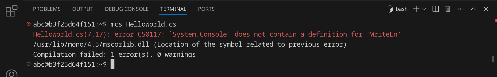
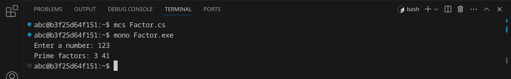
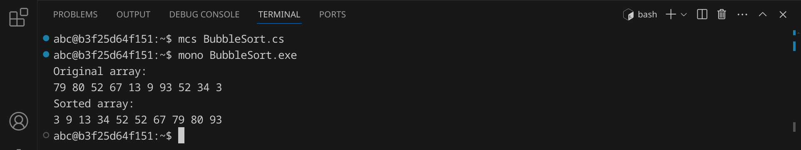

<div class='meta'>
image: cs-logo.png
</div>

# C&#35; <span style='font-size: 80%;'>(2000)</span>

<div class='floatright' style='width: 12em;'>
    
    <p>
        Anders Heijlsberg
    </p>
</div>

<p class='abstract'>
C# ist eine von Microsoft entwickelte Programmiersprache, die im Jahr 2000 veröffentlicht wurde. C# ist eine objektorientierte Programmiersprache, die auf C++ und Java basiert. C# wird z. B. in der Spieleentwicklung mit der Unity-Engine und in der Webentwicklung mit ASP.NET eingesetzt. In diesem Kapitel lernst du, wie du ein einfaches Programm in C# schreibst und ausführst.
</p>

<!-- ## Eigenschaften

- **Objektorientierung**: C# ist eine objektorientierte Programmiersprache, die auf der Verwendung von Objekten und Klassen basiert.
- **Typsicherheit**: C# ist eine typsichere Sprache, was bedeutet, dass Variablen einen festen Datentyp haben.
- **Interoperabilität**: C# ist eng mit der .NET-Plattform verbunden und ermöglicht die Interoperabilität mit anderen .NET-Sprachen wie Visual Basic und F#.
- **Webentwicklung**: C# wird in der Webentwicklung eingesetzt und ermöglicht die Entwicklung von Webanwendungen mit ASP.NET.
- **Spieleentwicklung**: C# wird in der Spieleentwicklung eingesetzt und ist die bevorzugte Sprache für die Entwicklung von Spielen mit der Unity-Engine.
- **Community**: C# hat eine aktive und engagierte Community, die eine Vielzahl von Bibliotheken und Frameworks entwickelt hat. -->

## Hello, world!

Um ein C#-Programm zu starten, benötigst du eine .NET-Laufzeitumgebung. Diese ist in der Regel auf Windows-Systemen vorinstalliert. Für den Workspace werden wir die freie .NET-Implementierung Mono verwenden, die plattformübergreifend auf Windows, macOS und Linux läuft.

C#-Programme werden in Textdateien mit der Endung `.cs` geschrieben Diese Dateien werden dann mit dem C#-Compiler `mcs` kompiliert, um ausführbare Dateien zu erzeugen. Diese haben die Endung `.exe` und sie können unter Linux und macOS mit dem Mono-Laufzeitumgebung ausgeführt werden.

Stelle zuerst sicher, dass du keinen Ordner geöffnet hast. Um sicherzugehen, drücke einfach den Shortcut für »Ordner schließen«: <span class='key'>Strg</span><span class='key'>K</span> und dann <span class='key'>F</span>. Dein Workspace sollte jetzt ungefähr so aussehen:


### Quelltext schreiben

Klicke auf »New File« und wähle als Dateityp »Text File« (oder bestätige einfach mit <span class='key'>Enter</span>).


Schreibe nun den folgenden Code in die Datei:

_include_file(HelloWorld.cs, cs)

Da Visual Studio Code noch nicht weiß, dass es sich um C#-Quelltext handelt, ist dein Programm momentan noch einfarbig, aber das wird sich gleich ändern. An dem weißen Punkt erkennst du, dass deine Änderungen noch nicht gespeichert sind.


Drücke nun <span class='key'>Strg</span><span class='key'>S</span>, um die Datei zu speichern. Gib `HelloWorld.cs` ein – der vollständige Pfad zu deiner Datei lautet dann `/workspace/HelloWorld.cs`.


Sobald du die Datei gespeichert hast, wird sie automatisch als C#-Datei erkannt und die Syntax wird hervorgehoben.


### Kompilieren und ausführen

Bevor wir das Programm ausführen können, müssen wir es kompilieren.
Dadurch wird der Quelltext des Programms in eine ausführbare Datei übersetzt, die von der .NET-Laufzeitumgebung ausgeführt werden kann.

Öffne dazu ein Terminal, indem du entweder <span class='key'>Strg</span><span class='key'>J</span> drückst oder das Panel-Symbol  rechts oben drückst. Dein Fenster sollte jetzt ungefähr so aussehen:


Wir rufen jetzt den C#-Compiler `mcs` auf, um das Programm zu übersetzen:

```bash
mcs HelloWorld.cs
```

<div class='hint'>
Du musst nicht den vollständigen Dateinamen schreiben. Schreib einfach <code>mcs He</code> und drücke <span class='key'>Tab</span>, um den Dateinamen automatisch zu <code>HelloWorld.csd</code> vervollständigen zu lassen.
</div>

Wenn du keinen Fehler gemacht hast, wird das Programm erfolgreich kompiliert und die Datei `HelloWorld.exe` wird im selben Verzeichnis erstellt. Du kannst dies überprüfen, indem du dir die Dateien im aktuellen Verzeichnis mit `ls` oder `ls -l` anzeigen lässt:


Die Datei `HelloWorld.class` ist die ausführbare Datei. Sie kann allerdings unter Linux nicht direkt gestartet werden, sondern muss mit der Mono-Laufzeitumgebung ausgeführt werden. Um das Programm auszuführen, gib folgenden Befehl ein:

```bash
mono HelloWorld.exe
```

Das Programm sollte die Nachricht `Hello, World!` im Terminal ausgeben. Du kannst beide Schritte auch in einem Befehl kombinieren:

```bash
mcs HelloWorld.cs && mono HelloWorld.exe
```

<div class='hint'>
Die Zeichenkombination <code>&amp;&amp;</code> sorgt dafür, dass der zweite Befehl nur ausgeführt wird, wenn der erste erfolgreich war.
</div>

### Fehler finden und beheben

Wenn du einen Fehler im Code machst, wird der Compiler eine Fehlermeldung ausgeben. Versuche zum Beispiel, statt `WriteLine` das Wort `WriteLin` zu schreiben:

```cs
        Console.WriteLin("Hello, World!");
```

Speichere die Datei und führe den Compiler erneut aus:

```bash
mcs HelloWorld.cs
```

<div class='hint'>
Nutze die Pfeiltaste hoch <span class='key'>↑</span>, um den letzten Befehl erneut einzugeben. So kannst du schnell dein Programm testen, nachdem du es verändert hast.
</div>

Der Compiler sollte eine Fehlermeldung ausgeben, die dir hilft, den Fehler zu finden:



Es lohnt sich, die Fehlermeldungen genau zu lesen, um den Fehler zu finden und zu beheben. Achte auf die Zeilennummer (in diesem Beispiel 7) und den Text, der dir sagt, was falsch ist. Denke daran, den Fehler wieder zu beheben, bevor du das nächste Beispiel ausprobierst.

## Primfaktorenzerlegung

Im zweiten Beispiel wollen wir eine Zahl in ihre Primfaktoren zerlegen.
Wir erreichen dies mit einem sehr einfachen Algorithmus, der einfach alle Zahlen von 2 bis zur eingegebenen Zahl durchprobiert und dabei diejenigen Zahlen ausgibt, bei denen die Division ohne Rest möglich ist. Außerdem wird die eingegebene Zahl durch jeden gefundenen Primfaktor geteilt, um die Schleife möglichst schnell zu beenden. An diesem Beispiel kannst du sehen, wie man in C# Benutzereingaben verarbeitet und Schleifen verwendet.
Erstelle eine neue Datei mit <span class='key'>Strg</span><span class='key'>Alt</span><span class='key'>N</span> und schreibe den folgenden Code hinein:

_include_file(Factor.cs, cs)

Speichere die Datei unter dem Namen `Factor.cs`. Kompiliere das Programm:

```bash
mcs Factor.cs
```

Falls du keine Fehlermeldung erhältst, kannst du das Programm ausführen und testen:



Das Programm hat die Zahl 123 in ihre Primfaktoren zerlegt und ausgegeben. Probiere aus, was passiert, wenn du die Zahl 3000000000 eingibst. Was könnte der Grund dafür sein?

## Bubblesort

Im dritten Beispiel wollen wir eine Liste von 10 Zufallszahlen sortieren. Dafür verwenden wir den [Bubblesort-Algorithmus](https://de.wikipedia.org/wiki/Bubblesort), der zwar nicht besonders effizient ist, aber sehr einfach zu verstehen und zu implementieren. Der Bubblesort-Algorithmus funktioniert, indem er die Liste mehrmals durchläuft und benachbarte Elemente vertauscht, wenn sie in der falschen Reihenfolge sind.

An diesem Beispiel kannst du sehen, wie man in C# Arrays verwendet, Funktionen verwendet und Schleifen verschachtelt.

Erstelle eine neue Datei und schreibe den folgenden Code hinein:

_include_file(BubbleSort.cs, cs)

Speichere die Datei unter dem Namen `BubbleSort.cs`. Kompiliere das Programm:

```bash
mono BubbleSort.cs
```
Falls du keine Fehlermeldung erhältst, kannst du das Programm ausführen und testen:



Das Programm hat eine Liste von 10 Zufallszahlen sortiert. Versuche, den Quelltext so zu verändern, dass statt 10 Zahlen 100 oder mehr Zahlen sortiert werden.

## Zusammenfassung

In diesem Kapitel hast du an drei Beispielen gesehen, wie man ein einfaches C#-Programm schreiben, kompilieren und ausführen kann. Das ist natürlich nur ein erster Eindruck. Um C# wirklich zu beherrschen, musst du noch viel mehr lernen – am besten, indem du eigene Programme schreibst und ausprobierst. Die Buchhandlungen, Bibliotheken und Youtube sind voll von Material für dich. Viel Spaß beim Programmieren!
