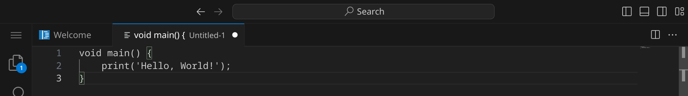
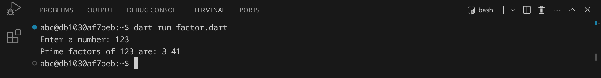
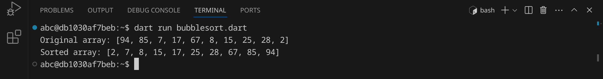

<div class='meta'>
image: dart-logo.png
</div>

# Dart <span style='font-size: 80%;'>(2011)</span>

<div class='floatright' style='width: 24em;'>
    
    <p>
        Lars Bak und Kaspar Lund
    </p>
</div>

<p class='abstract'>
Dart ist eine von Google entwickelte Programmiersprache, die im Jahr 2011 veröffentlicht wurde. Dart ist eine kompilierte Programmiersprache, die für die Entwicklung von Webanwendungen und mobilen Apps eingesetzt wird.
</p>

<!-- ## Eigenschaften

- **Kompiliert**: Dart ist eine kompilierte Sprache, was bedeutet, dass der Code in Maschinencode übersetzt wird, der direkt auf der Hardware ausgeführt werden kann.
- **Effizienz**: Dart wurde für die Effizienz entwickelt und bietet eine schnelle Kompilierung und Ausführung von Code.
- **Webentwicklung**: Dart wird häufig für die Entwicklung von Webanwendungen und mobilen Apps eingesetzt und bietet eine Vielzahl von Frameworks und Bibliotheken für die Webentwicklung.
- **Community**: Dart hat eine aktive und engagierte Community, die eine Vielzahl von Bibliotheken und Frameworks entwickelt hat. -->

## Hello, world!

Dart-Programme werden in Textdateien mit der Endung `.dart` geschrieben. Diese Dateien werden anschließend von einem Compiler in ausführbare Dateien übersetzt, die auf deinem Computer direkt ausgeführt werden können.

Stelle zuerst sicher, dass du keinen Ordner geöffnet hast. Um sicherzugehen, drücke einfach den Shortcut für »Ordner schließen«: <span class='key'>Strg</span><span class='key'>K</span> und dann <span class='key'>F</span>. Dein Workspace sollte jetzt ungefähr so aussehen:


### Quelltext schreiben

Klicke auf »New File« und wähle als Dateityp »Text File«.


Schreibe nun den folgenden Code in die Datei:

_include_file(hello.dart, dart)

Da Visual Studio Code noch nicht weiß, dass es sich um Dart-Quelltext handelt, ist dein Programm momentan noch einfarbig, aber das wird sich gleich ändern. An dem weißen Punkt erkennst du, dass deine Änderungen noch nicht gespeichert sind.



Drücke nun <span class='key'>Strg</span><span class='key'>S</span>, um die Datei zu speichern. Gib `hello.dart` ein – der vollständige Pfad zu deiner Datei lautet dann `/workspace/hello.dart`.


Sobald du die Datei gespeichert hast, wird sie automatisch als Dart-Datei erkannt und die Syntax wird hervorgehoben.


### Programm ausführen

Um unser Programm auszuführen, müssen wir den Dart-Compiler aufrufen und ihm den Dateinamen unseres Programms übergeben.

Öffne dazu ein Terminal, indem du <span class='key'>Strg</span><span class='key'>J</span> drückst und gib folgenden Befehl ein:

```bash
dart run hello.dart
```

<div class='hint'>
Du musst nicht den vollständigen Dateinamen schreiben. Schreib einfach <code>dart run he</code> und drücke <span class='key'>Tab</span>, um den Dateinamen automatisch zu <code>hello.dart</code> vervollständigen zu lassen. Du kannst danach ganz normal weiterschreiben.
</div>

Das Programm sollte die Nachricht `Hello, World!` im Terminal ausgeben:


<div class='hint'>
Dart kann Quelltext für viele verschiedene Plattformen kompilieren, z. B. für Webanwendungen, mobile Apps (mit Flutter) und Desktopanwendungen. In diesem Artikel probieren wir Dart auf der Kommandozeile aus, aber du kannst Dart auch in anderen Umgebungen verwenden.
</div>

### Fehler finden und beheben

Wenn du einen Fehler im Code machst, wird Ruby eine Fehlermeldung ausgeben. Versuche zum Beispiel, statt `print` das Wort `prin` zu schreiben:

```dart
prin('Hello, World!');
```

Speichere die Datei und führe das Programm erneut aus:

```bash
dart run hello.dart
```

<div class='hint'>
Nutze die Pfeiltaste hoch <span class='key'>↑</span>, um den letzten Befehl erneut einzugeben. So kannst du schnell dein Programm testen, nachdem du es verändert hast.
</div>

Dart sollte eine Fehlermeldung ausgeben, die dir hilft, den Fehler zu finden:


Es lohnt sich, die Fehlermeldungen genau zu lesen, um den Fehler zu finden und zu beheben. Achte auf die Zeilennummer (in diesem Beispiel 2) und den Text, der dir sagt, was falsch ist. Denke daran, den Fehler wieder zu beheben, bevor du das nächste Beispiel ausprobierst.

## Primfaktorenzerlegung

Im zweiten Beispiel wollen wir eine Zahl in ihre Primfaktoren zerlegen.
An diesem Beispiel kannst du sehen, wie man in Dart Benutzereingaben verarbeitet und Schleifen verwendet.
Erstelle eine neue Datei mit <span class='key'>Strg</span><span class='key'>Alt</span><span class='key'>N</span> und schreibe den folgenden Code hinein:

_include_file(factor.dart, dart)

Speichere die Datei unter dem Namen `factor.dart` und führe sie aus:



Das Programm hat die Zahl 123 in ihre Primfaktoren zerlegt und ausgegeben. Anders als andere Programmiersprachen kann Dart auch die Zahl 3000000000 in Sekundenbruchteilen zerlegen. Auch mit einer sehr großen Zahl wie 123456789123456789 kommt das Programm problemlos zurecht. Falls du auf eine Zahl stoßen solltest, die so groß ist, dass das Programm sehr lange braucht, kannst du das Programm mit <span class='key'>Strg</span><span class='key'>C</span> abbrechen.

## Bubblesort

Im dritten Beispiel wollen wir eine Liste von 10 Zufallszahlen sortieren. Dafür verwenden wir den [Bubblesort-Algorithmus](https://de.wikipedia.org/wiki/Bubblesort), der zwar nicht besonders effizient ist, aber sehr einfach zu verstehen und zu implementieren. Der Bubblesort-Algorithmus funktioniert, indem er die Liste mehrmals durchläuft und benachbarte Elemente vertauscht, wenn sie in der falschen Reihenfolge sind.

An diesem Beispiel kannst du sehen, wie man in Dart Listen verwendet, Funktionen verwendet und Schleifen verschachtelt.

Erstelle eine neue Datei und schreibe den folgenden Code hinein:

_include_file(bubblesort.dart, dart)

Speichere das Skript unter dem Namen `bubblesort.dart` und führe es aus:



Das Programm hat eine Liste von 10 Zufallszahlen sortiert. Versuche, den Quelltext so zu verändern, dass statt 10 Zahlen 100 oder mehr Zahlen sortiert werden.

## Zusammenfassung

In diesem Kapitel hast du an drei Beispielen gesehen, wie man ein einfaches Dart-Programm schreiben und ausführen kann. Das ist natürlich nur ein erster Eindruck. Um Dart wirklich zu beherrschen, musst du noch viel mehr lernen – am besten, indem du eigene Skripte schreibst und ausprobierst. Die Buchhandlungen, Bibliotheken und Youtube sind voll von Material für dich. Viel Spaß beim Programmieren!
