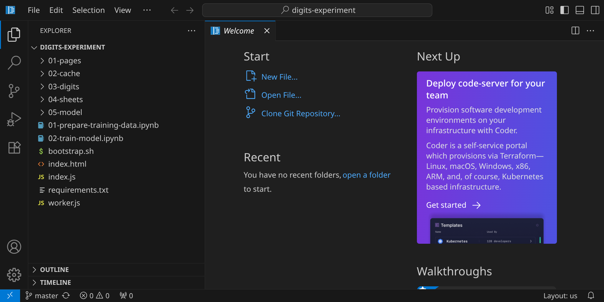
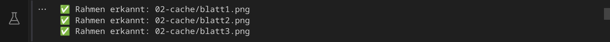
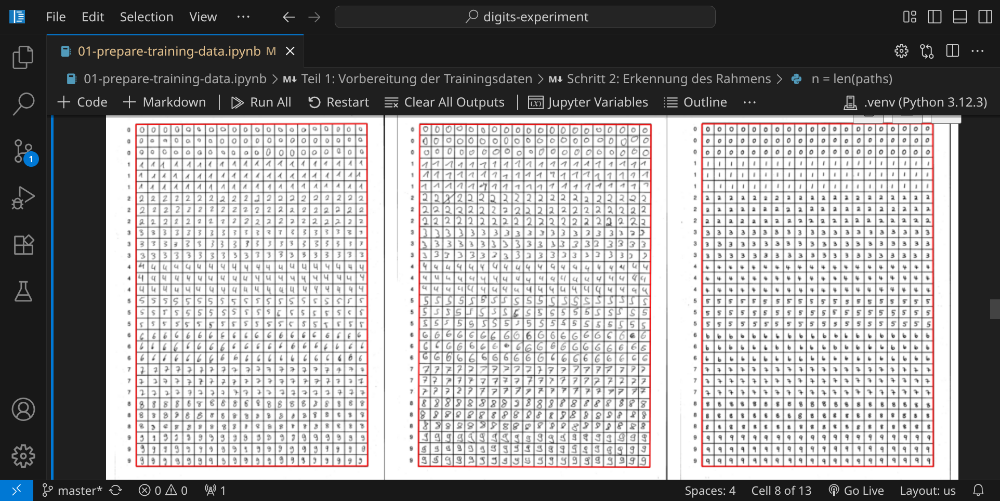
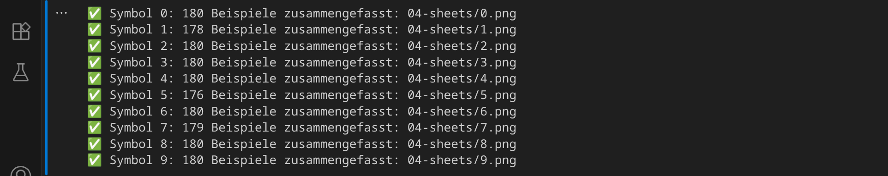
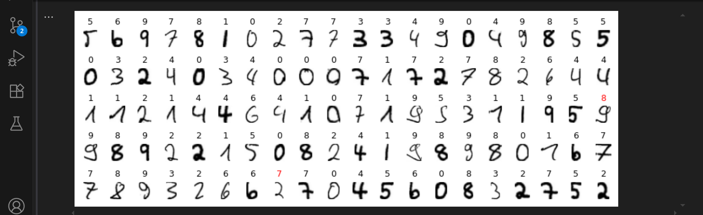
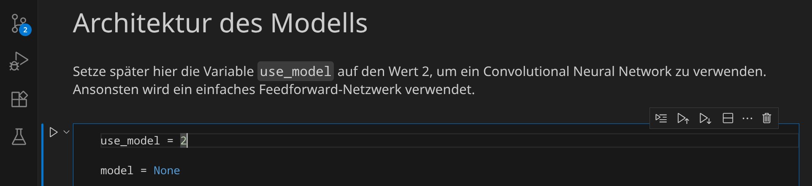
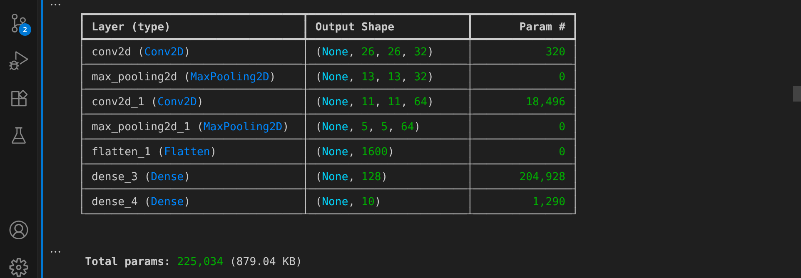
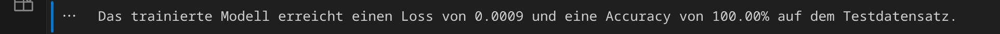

<div class='meta'>
image: interactive-3.webp:0:50
</div>

# Trainiere ein neuronales Netzwerk

<p class='abstract'>
In diesem Experiment lernst du, wie du ein neuronales Netzwerk trainierst, das deine handgeschriebenen Ziffern erkennt. Dazu verwendest du TensorFlow und Keras, zwei Bibliotheken für maschinelles Lernen in Python.
</p>

In diesem Artikel bekommst du eine Schritt-für-Schritt-Anleitung. Lies sie genau und befolge einen Schritt nach dem anderen.

## Vorbereitung

Stelle zuerst sicher, dass du keinen Ordner geöffnet hast. Um sicherzugehen, drücke einfach den Shortcut für »Ordner schließen«: <span class='key'>Strg</span><span class='key'>K</span> und dann <span class='key'>F</span>. Drücke <span class='key'>Strg</span><span class='key'>Shift</span><span class='key'>E</span>, um die Seitenleiste mit dem Explorer-Tab zu öffnen. Dein Workspace sollte jetzt ungefähr so aussehen:


Für diese Anleitung brauchst du ein Repository, das du klonen kannst, indem du auf den blauen Button »Clone Repository« klickst. Gib die folgende URL ein und bestätige mit <span class='key'>Enter</span>:

```bash
https://github.com/specht/digits-experiment.git
```


Als nächstes musst du angeben, in welches Verzeichnis du das Repository klonen möchtest. Bestätige den Standardpfad `/workspace/` mit <span class='key'>Enter</span>.


Beantworte die Frage »Would you like to open the cloned repository?« mit »Open«.


Du siehst nun auf der linken Seite ein paar Verzeichnisse und Dateien, die wir für dieses Experiment verwenden werden.



Öffne nun ein Terminal, indem du z. B. <span class='key'>Strg</span><span class='key'>J</span> drückst:


Starte nun das Skript `bootstrap.sh`, indem du den folgenden Befehl eingibst:

```bash
./bootstrap.sh
```

<div class='hint'>
Du musst nicht den vollständigen Dateinamen schreiben. Schreib einfach <code>./bo</code> und drücke <span class='key'>Tab</span>, um den Dateinamen automatisch zu <code>./boostrap.sh</code> vervollständigen zu lassen. Drücke <span class='key'>Enter</span>, um das Skript auszuführen.
</div>


Dieses Skript richtet eine Python-Umgebung ein und installiert die nötigen Pakete für das KI-Experiment. Dabei werden ca. 500 MB heruntergeladen und dein Verzeichnis ist danach ca. 2 GB groß (das ist aber in der Hackschule kein Problem). Wenn du den grünen Haken siehst, hat alles geklappt und du kannst das Terminal wieder schließen:

Wenn du zwischendurch diesen Hinweis siehst (s. oben rechts), kannst du mit »Yes« antworten, da wir die frisch eingerichtete Python-Umgebung in diesem Verzeichnis verwenden wollen.


## Trainingsmaterial herstellen

Du hast nun zwei Möglichkeiten: entweder verwendest du fertige Scans mit handgeschriebenen Ziffern, oder du schreibst selbst Ziffern &ndash; das ist natürlich viel spannender, weil du in diesem Fall dein neuronales Netzwerk mit deinen eigenen Daten trainieren wirst. In jedem Fall brauchst du mindestens zwei Seiten mit handgeschriebenen Ziffern als Trainingsmaterial.

<b>Variante 1: Fertige Scans verwenden</b>

Du kannst diese Seiten im PNG-Format hier herunterladen und per Drag & Drop in deinem Workspace in das Verzeichnis `01-pages` ziehen:

<a href='/cache/blatt1.png' target='_blank'></a>
<a href='/cache/blatt2.png' target='_blank'></a>
<a href='/cache/blatt3.png' target='_blank'></a>

<b>Variante 2: Ziffern selbst schreiben</b>

Drucke <a href='/docs/grid-digits.pdf' target='_blank'>diese PDF-Vorlage</a> ohne zusätzliche Seitenränder zweimal aus und trage in jedes Feld die entsprechenden Ziffern ein. Scanne die Blätter anschließend mit einer Auflösung von 300 dpi, speichere sie im PNG-Format und ziehe sie per Drag & Drop in deinen Workspace in das Verzeichnis `01-pages`.

<div class='hint'>
Wenn du deinen eigenen Blätter beschreibst, kannst du statt Ziffern auch Symbole verwenden. Dadurch ist dein neuronales Netzwerk später in der Lage, diese Symbole zu erkennen.
</div>

## Trainingsmaterial vorbereiten

Stelle sicher, dass du mindestens zwei Bilddateien im Verzeichnis `01-pages` hast. Du kannst die Dateien öffnen, um zu überprüfen, ob sie korrekt sind:


Öffne nun das erste Jupyter-Notebook `01-prepare-training-data.ipynb`, und führe den ersten Codeblock aus, indem du auf das Play-Symbol klickst.

Bevor der Code ausgeführt werden kann, musst du noch einen Python-Interpreter auswählen. Bestätige die Auswahl »Python Environments« und »★ .venv (Python 3.12.3)«:


Im ersten Schritt werden die Helligkeit und der Kontrast der eingescannten Seiten automatisch angepasst:


Im nächsten Schritt siehst du den Effekt der Farbanpassung:


Wenn die Bilder korrekt angezeigt werden, führe den nächsten Codeblock aus. In diesem Schritt werden die gedruckten Rahmen in jeder Bilddatei gesucht:



Der nächste Schritt zeigt dir, wo die Rahmen gefunden wurden:



Wenn das Ergebnis zufriedenstellend aussieht, führe den nächsten Codeblock aus. In diesem Schritt werden die einzelnen Ziffern aus den Bildern ausgeschnitten:


Im nächsten Schritt werden 10 Bilddateien generiert, in denen die einzelnen Ziffern gesammelt werden:



Du kannst dir die Bilder anschauen, indem du auf das Verzeichnis `04-sheets` klickst:


Wenn alle Schritte erfolgreich durchgelaufen sind, können wir mit dem Training des Modells beginnen.

## Modell trainieren

Öffne nun das zweite Jupyter-Notebook `02-train-model.ipynb`, indem du darauf klickst. Es enthält den Code, um unser neuronales Netzwerk zu trainieren, das die handgeschriebenen Ziffern erkennen soll. Im ersten Schritt wird die Menge aller Trainingsdaten in drei Teile aufgeteilt: 80% für das Training, 10% für die Validierung und 10% für den Test.

Bevor du den ersten Codeblock starten kannst, musst du wieder den Kenrel in ».venv« auswählen:


Im nächsten Schritt wird die Architektur des Modells festgelegt. Es handelt sich um ein einfaches neuronales Netzwerk mit vier Schichten:

- die erste Schicht ist ein »Flatten Layer«, das die 28x28 Pixel großen Bilder in einen Vektor mit 784 Elementen umwandelt.
- die zweite und dritte Schicht sind jeweils ein »Dense Layer« mit 100 Neuronen und der Aktivierungsfunktion »ReLU«.
- die vierte Schicht ist ebenfalls ein »Dense Layer« mit 10 Neuronen, die die jeweiligen Ziffern repräsentieren, jedoch mit der Aktivierungsfunktion »Softmax«.


Dieses Modell verfügt über eine Gesamtzahl von 89.610 Parametern, die während des Trainings optimiert werden.

Wir sind jetzt bereit, das Modell zu trainieren. Klicke auf das Play-Symbol, um den Codeblock auszuführen. Nach 30 Trainingsepochen ist das Training beendet.


<div class='hint'>
Du kannst hier gut beboachten, wie der »Loss« immer geringer wird – am Anfang ist er noch relativ groß und nach 30 Trainingsrunden schon bei 10<sup>-4</sup>.
</div>

Im nächsten Schritt wird das Modell im Verzeichnis `05-model` gespeichert:


Jetzt ermitteln wir, wie gut das Modell ist. Dazu verwenden wir die Testdaten, die wir zuvor beiseite gelegt haben. Die wichtigen Kennwerte sind der Verlust (loss) und die Genauigkeit (accuracy):

- der Verlust sollte möglichst klein sein, idealerweise nahe bei 0.
- die Genauigkeit sollte möglichst groß sein, idealerweise nahe bei 100%.


Um den vorherigen Schritt zu visualisieren, können wir uns nun ein paar Testbilder anzeigen lassen und die Vorhersagen des Modells überprüfen:



Die roten Ziffern markieren die falschen Vorhersagen. Das Modell ist noch nicht perfekt, aber es ist bereits in der Lage, handgeschriebene Ziffern zu erkennen.

## Modell ausprobieren

Im nächsten Schritt wollen wir unser Modell interaktiv im Webbrowser testen. Dazu müssen wir das gespeicherte Modell zunächst in ein anderes Format namens [ONNX](https://de.wikipedia.org/wiki/ONNX) konvertieren, damit wir es im Webbrowser laufen lassen können. Führe dazu den nächsten Codeblock aus:


Wenn das Modell erfolgreich konvertiert wurde, können wir es im Webbrowser testen. Klicke dazu rechts unten auf den Button »Go Live«.
Du kannst nun links oben mit der Maus Ziffern schreiben und zuschauen, wie sich die Aktivierungen der Neuronen im Modell verändern. Du siehst die einzelnen Schichten und die Aktivierungen der Neuronen. Ganz rechts siehst du die Vorhersage des Modells.

Versuche, die Grenze zwischen zwei Ziffern zu finden, um zu sehen, wie das Modell reagiert. Mit der rechten Maustaste kannst du deine Zeichnung wieder wegradieren.

<div style='clear: both;'></div>


## Modell verbessern

Um unser Modell zu verbessern, können wir ein [Convolutional Neural Network](https://de.wikipedia.org/wiki/Convolutional_Neural_Network) (CNN) verwenden. Dabei werden die Pixel nicht mehr unabhängig voneinander betrachtet, sondern unter Berücksichtigung ihrer Lage zueinander.

Um ein CNN zu verwenden, scrolle nach oben zum Abschnitt »Architektur des Modells« und setze die Variable `use_model` auf den Wert 2. Führe dann diesen und alle folgenden Codeblöcke erneut aus.



Das neue Modell hat eine etwas andere Architektur:

- die erste Schicht ist ein »Conv2D Layer«, das das 28x28 Pixel großen Eingabebild mit 32 3x3-Filtern in 32 26x26 Pixel große Bilder umwandelt.
- die zweite Schicht ist ein »MaxPooling2D Layer«, das die Größe der Bilder halbiert (13x13).
- die dritte Schicht ist ein weiteres »Conv2D Layer«, des die 13x13 großen Bilder mit 64 3x3-Filtern in 64 11x11 Pixel große Bilder umwandelt.
- die vierte Schicht ist ein weiteres »MaxPooling2D Layer«, des die Größe der Bilder halbiert (5x5).
- die fünfte Schicht ist ein »Flatten Layer«, das die 5x5 Pixel großen Bilder in einen Vektor mit 1600 Elementen umwandelt.
- die sechste Schicht ist ein »Dense Layer« mit 128 Neuronen und der Aktivierungsfunktion »ReLU«.
- die siebte Schicht ist ein weiteres »Dense Layer« mit 10 Neuronen, die die jeweiligen Ziffern repräsentieren, jedoch mit der Aktivierungsfunktion »Softmax«.

Das verbesserte Modell verfügt über eine Gesamtzahl von 225.034 Parametern, also ca. 2,5 mal so viele Parameter wie im vorherigen Modell:



Da das neue Modell mehr Parameter hat, dauert das Training auch länger. Nach 30 Epochen ist das Training beendet:


Im nächsten Schritt wird das Modell wieder gespeichert (natürlich mit mehr Layern als vorher):


Bei der Evaluation des neuen Modells siehst du, dass Loss und Accuracy besser sein sollten als beim ersten Modell:



Die Testbilder sehen jetzt so aus:


Um das Modell im Browser zu testen, musst du es erst wieder konvertieren:


Wenn du das Modell im Webbrowser testest, siehst du, wie die Pixel nicht mehr im ersten Schritt voneinander getrennt werden, sondern über mehrere Schichten hinweg im Quadrat angeordnet gemeinsam behandelt werden:


Falls du ein noch besseres Modell haben möchtest, kannst du die Anzahl der Epochen erhöhen oder die Architektur des Modells weiter anpassen. Du kannst auch die Anzahl der Trainingsdaten erhöhen, indem du mehr Blätter mit handgeschriebenen Ziffern verwendest. Hier findest du weitere Blätter, die du verwenden kannst:

<div style='text-align: left;'>
<a href='/cache/blatt4.png' target='_blank'></a>
<a href='/cache/blatt5.png' target='_blank'></a>
<a href='/cache/blatt6.png' target='_blank'></a>
<a href='/cache/blatt7.png' target='_blank'></a>
<a href='/cache/blatt8.png' target='_blank'></a>
<a href='/cache/blatt9.png' target='_blank'></a>
<a href='/cache/blatt10.png' target='_blank'></a>
<a href='/cache/blatt11.png' target='_blank'></a>
<a href='/cache/blatt12.png' target='_blank'></a>
</div>

In den bisherigen Beispielen war es so, dass wir nur weiß und blau gesehen haben, wobei blau für »positiv« steht. Wenn du statt `ReLU` eine Aktivierungsfunktion wählst, die auch negative Werte zurückgeben kann (wie z. B. `tanh`), dann wirst du auch orangefarbene Neuronen bekommen (für negative Werte):


## Zusammenfassung

In diesem Experiment hast du gelernt, wie du ein neuronales Netzwerk trainierst, das handgeschriebene Ziffern erkennt. Du hast gesehen, wie du die Trainingsdaten vorbereitest, das Modell trainierst und es im Webbrowser testest. Du hast auch gesehen, wie du das Modell verbessern kannst, indem du ein Convolutional Neural Network verwendest.