<div class='meta'>
image: rainbow.webp
</div>

# Pixelgrafik programmieren

<p class='abstract'>
In diesem Kapitel lernst du, wie du Pixelgrafiken programmieren kannst. Dazu installieren wir das Paket »Pixelflow Canvas« und erstellen ein erstes Bild mit einer hügeligen Wiese aus Bézierkurven und einem Regenbogen aus konzentrischen Kreisen.
</p>

Stelle zuerst sicher, dass du keinen Ordner geöffnet hast. Um sicherzugehen, drücke einfach den Shortcut für »Ordner schließen«: <span class='key'>Strg</span><span class='key'>K</span> und dann <span class='key'>F</span>. Dein Workspace sollte jetzt ungefähr so aussehen:


## Pixelflow Canvas installieren

Falls du es noch nicht getan hast, musst du zuerst eine Erweiterung für Visual Studio Code installieren. Anschließend installieren wir ein Rubygem, das uns das Programmieren von Pixelgrafiken ermöglicht.

### VS Code-Erweiterung installieren

Um Pixelgrafiken im Workspace programmieren zu können, benötigen wir die Erweiterung »Pixelflow Canvas«. Klicke dazu auf das Extensions-Symbol  in der Seitenleiste und suche nach »Pixelflow Canvas«. Klicke auf »Install«, um die Erweiterung zu installieren.

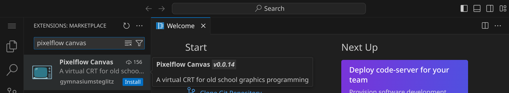

### Rubygem installieren

Um bequem von Ruby Befehle an das Canvas schicken zu können, benötigen wir das Rubygem »pixelflow_canvas«. Öffne das Terminal, indem du den Shortcut <span class='key'>Strg</span><span class='key'>J</span> drückst. Dein Workspace sollte jetzt ungefähr so aussehen:

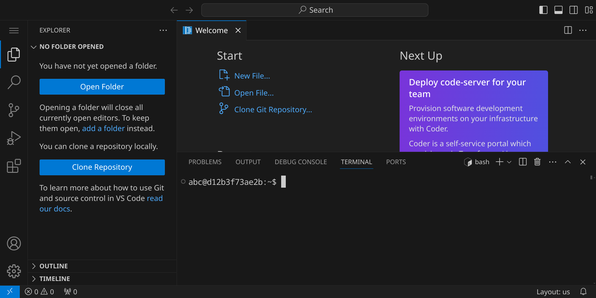

Installiere es, indem du folgenden Befehl in das Terminal eingibst:

```bash
gem install pixelflow_canvas
```

## Zeichenfläche ausprobieren

Wähle im Menü links oben »File« / »New Text File«, um eine neue Datei anzulegen:

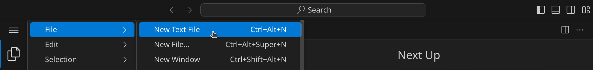

Schreibe den folgenden Code in die Datei:

```ruby
require 'pixelflow_canvas'

Pixelflow::Canvas.new(320, 180, :palette) do
    set_pixel(160, 90, 10)
end
```

Da Visual Studio Code noch nicht weiß, dass es sich um Ruby-Code handelt, sieht dein Code noch etwas farblos aus:

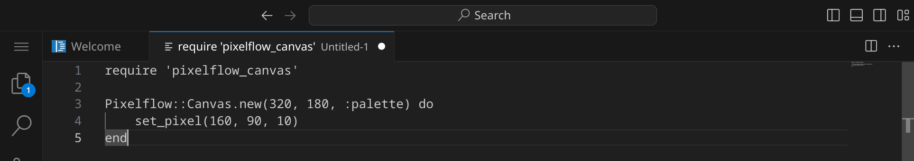

Speichere die Datei unter dem Dateinamen `rainbow.rb`, indem du <span class='key'>Strg</span><span class='key'>S</span> drückst und den Dateinamen eingibst. 

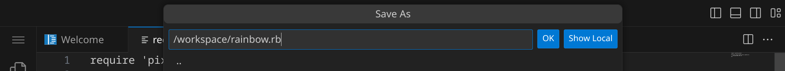

Dein Programm sollte jetzt ungefähr so aussehen:

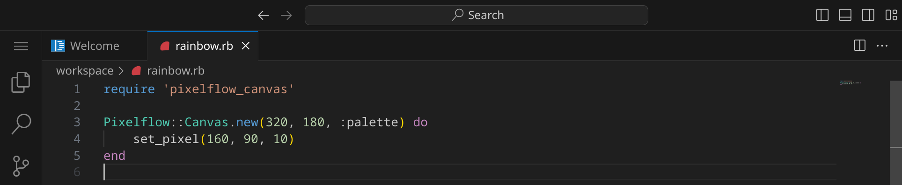

Bevor wir das Programm ausführen können, müssen wir das Pixelflow Canvas öffnen. Drücke dazu
<span class='key'>Strg</span><span class='key'>Shift</span><span class='key'>P</span> oder <span class='key'>F1</span>
und gib dann »Show Pixelflow Canvas« ein.

<div class='hint'>
    <strong>Tipp:</strong> Du kannst auch einfach »pixel« eingeben, es werden dir dann automatisch alle Befehle angezeigt, die mit »Pixelflow Canvas« zu tun haben.
</div>

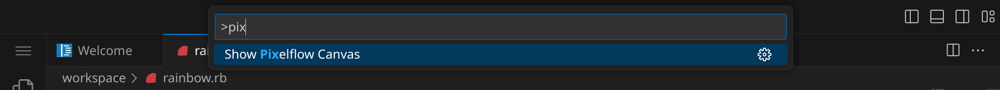

Du solltest jetzt ein neues Panel sehen, in dem das Pixelflow Canvas angezeigt wird:

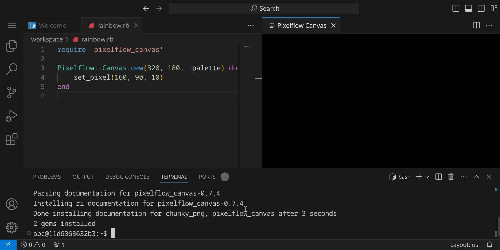

Führe das Programm aus, indem du im Terminal `ruby rainbow.rb` eingibst. Du solltest nun einen einzelnen, grünen Pixel in der Mitte der Zeichenfläche sehen:

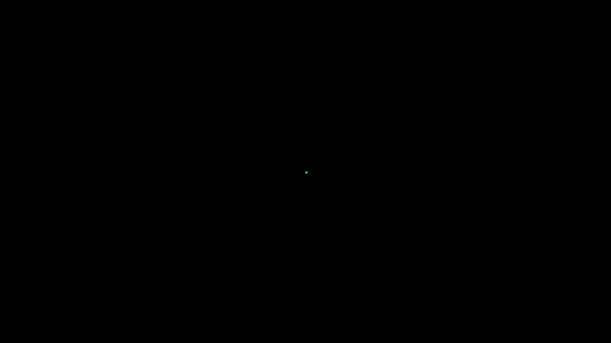

Schauen wir uns den Code genauer an:

```ruby
require 'pixelflow_canvas'

Pixelflow::Canvas.new(320, 180, :palette) do
    set_pixel(160, 90, 10)
end
```

- `require 'pixelflow_canvas'` lädt das Rubygem »pixelflow_canvas«.
- `Pixelflow::Canvas.new(320, 180, :palette)` erstellt ein neues Canvas mit einer Breite von 320 Pixeln und einer Höhe von 180 Pixeln. Der dritte Parameter `:palette` gibt an, dass wir eine Palette verwenden wollen.
- der `do` / `end`-Block enthält die Befehle, die auf das Canvas angewendet werden sollen.
- `set_pixel(160, 90, 10)` setzt den Pixel an der Position (160, 90) auf die Farbe 10.

Der Ursprung der Zeichenfläche ist oben links, der x-Wert nimmt nach rechts zu und der y-Wert nach unten.
Da wir eine Palette verwenden, geben wir Farben einfach als Zahl von 0 bis 255 an. Welche Farbe sich
hinter welcher Zahl verbirgt, ist in der Palette definiert.

Da standardmäßig die VGA-Palette verwendet wird, entspricht die Farbe 10 einem hellen Grün.

Hier findest du eine Übersicht über alle Farben der Standard-VGA-Palette: [https://github.com/specht/pixelflow_canvas?tab=readme-ov-file#vga](https://github.com/specht/pixelflow_canvas?tab=readme-ov-file#vga).

<div class='hint'>
    Kannst du die Farbe des Pixels auf Blau ändern? Versuche auch, den Pixel in alle vier Ecken der Zeichenfläche zu schieben.
</div>

<div class='hint books'>
Anstelle einer Palette kannst du auch RGB-Farben verwenden. Dazu ersetzt du einfach <code>:palette</code> durch <code>:rgb</code>.
Anschließend musst du alle Farben als Tripel von rot, grün und blau im Bereich von 0 bis 255 angeben. Der historische
Hintergrund für die Verwendung von Paletten rührt daher, dass man so mit weniger Speicherplatz auskam (während ein RGB-Pixel
3 Bytes benötigt, benötigt ein Pixel mit Palette nur 1 Byte, da die Farbe nur als Index in der Palette gespeichert wird).
Heute ist das eigentlich nicht mehr nötig, aber es kann trotzdem von Vorteil sein, eine Palette zu verwenden, da du so eine
einheitliche Farbgebung hast und nicht jedes Mal die passenden RGB-Werte heraussuchen musst.
</div>

## Palette wählen

Die Standard-VGA-Palette ist nicht die einzige Palette, die du verwenden kannst. Du kannst auch eine andere Palette
wählen oder sogar deine eigene Palette definieren. Eine Übersicht über alle verfügbaren Paletten findest du unter dem
weiter oben genannten Link. Da wir eine Wiese mit Regenbogen zeichnen möchten, wählen wir die »zughy_32«-Palette:

<div class='swatches'>
<span style='background-color: #472d3c;'><span>0</span></span>
<span style='background-color: #5e3643;'><span>1</span></span>
<span style='background-color: #7a444a;'><span>2</span></span>
<span style='background-color: #a05b53;'><span>3</span></span>
<span style='background-color: #bf7958;'><span>4</span></span>
<span style='background-color: #eea160;'><span>5</span></span>
<span style='background-color: #f4cca1;'><span>6</span></span>
<span style='background-color: #b6d53c;'><span>7</span></span>
<span style='background-color: #71aa34;'><span>8</span></span>
<span style='background-color: #397b44;'><span>9</span></span>
<span style='background-color: #3c5956;'><span>10</span></span>
<span style='background-color: #302c2e;'><span>11</span></span>
<span style='background-color: #5a5353;'><span>12</span></span>
<span style='background-color: #7d7071;'><span>13</span></span>
<span style='background-color: #a0938e;'><span>14</span></span>
<span style='background-color: #cfc6b8;'><span>15</span></span>
<span style='background-color: #dff6f5;'><span>16</span></span>
<span style='background-color: #8aebf1;'><span>17</span></span>
<span style='background-color: #28ccdf;'><span>18</span></span>
<span style='background-color: #3978a8;'><span>19</span></span>
<span style='background-color: #394778;'><span>20</span></span>
<span style='background-color: #39314b;'><span>21</span></span>
<span style='background-color: #564064;'><span>22</span></span>
<span style='background-color: #8e478c;'><span>23</span></span>
<span style='background-color: #cd6093;'><span>24</span></span>
<span style='background-color: #ffaeb6;'><span>25</span></span>
<span style='background-color: #f4b41b;'><span>26</span></span>
<span style='background-color: #f47e1b;'><span>27</span></span>
<span style='background-color: #e6482e;'><span>28</span></span>
<span style='background-color: #a93b3b;'><span>29</span></span>
<span style='background-color: #827094;'><span>30</span></span>
<span style='background-color: #4f546b;'><span>31</span></span>
</div>

Verändere den Code wie folgt und führe ihn erneut aus:

```ruby
require 'pixelflow_canvas'

Pixelflow::Canvas.new(320, 180, :palette) do
    set_predefined_palette(:zughy_32)
    set_pixel(160, 90, 10)
end
```

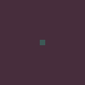

Führe das Programm aus, indem du im Terminal `ruby rainbow.rb` eingibst (du kannst auch einfach den letzten Befehl wiederholen, indem du <span class='key'>↑</span> und <span class='key'>Enter</span> drückst).

Du solltest jetzt sehen, dass sich die Farben geändert haben – der Hintergrund ist nicht mehr schwarz, weil
die Farbe 0 nun ein dunkles Lila ist und die Farbe 10 ist nun ein dunkles Türkis.

## Hintergrund zeichnen

Lösche den `set_pixel`-Befehl und füge stattdessen den folgenden Code ein:

```ruby
set_color(16)
fill_rect(0, 0, 319, 179)
```

Wir füllen die gesamte Zeichenfläche mit der Farbe 16 (hellblau), indem wir den Befehl `fill_rect` verwenden. Dieser Befehlt benötigt vier Parameter: die x- und y-Koordinaten der oberen linken Ecke des Rechtecks und die x- und y-Koordinaten der unteren rechten Ecke des Rechtecks.

<div class='hint'>
    Obwohl die Zeichenfläche eine Größe von 320x180 Pixeln hat, hat der Pixel rechts unten die Koordinaten (319, 179), da wir bei 0 anfangen zu zählen.
</div>

Dein Bild sollte jetzt so aussehen:

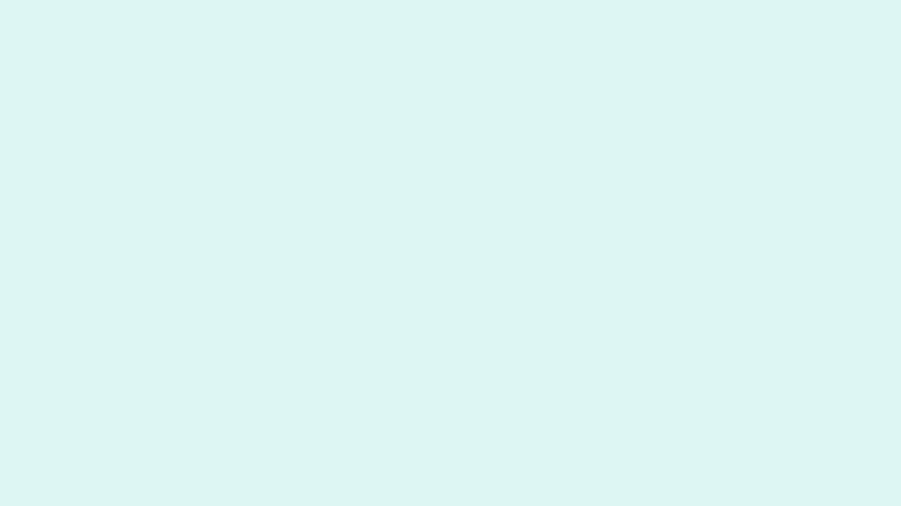

## Hügelige Wiese zeichnen

Um eine hügelige Wiese zu zeichnen, werden wir keine geraden Linien, sondern [Bézierkurven](https://de.wikipedia.org/wiki/B%C3%A9zierkurve) verwenden. Eine Bézierkurve wird durch eine Reihe von Punkten definiert, die die Kurve beeinflussen. Wir können hier zwei Arten von Bézierkurven verwenden: eine quadratische Bézierkurve (mit drei Punkten) und eine kubische Bézierkurve (mit vier Punkten).

Du kannst hier interaktiv die Punkte der Bézierkurven verschieben, um zu verstehen, wie Bézierkurven funktionieren:

<style>
.bezier_div circle {
    fill: white;
    stroke: #888;
    stroke-width: 0.1;
}
.bezier_div circle:hover {
    fill: #eee;
    stroke: #000;
    stroke-width: 0.1;
    cursor: pointer;
}
.bezier_div path.spline {
    stroke-width: 0.2;
    stroke: #000;
    fill: none;
}
.bezier_div path.line {
    stroke-width: 0.1;
    stroke: #888;
    stroke-dasharray: 0.2;
    fill: none;
}
[data-bs-theme=dark] {
    .bezier_div path.spline {
        stroke: #fff;
    }
    .bezier_div path.line {
        stroke: #666;
    }
    .bezier_div circle {
        fill: #222;
        stroke: #888;
    }
    .bezier_div circle:hover {
        fill: #333;
        stroke: #aaa;
    }
}
</style>

<div class='row'>
<div class='col-md-6'>
<h4>Quadratische Bézierkurve</h4>
<div class='bezier_div' data-points='3'>
    <svg width="100%" viewBox="0 0 16 9">
        <path class='line' d="M1,8 L 8,1 15,4" />
        <path class='spline' d="M1,8 Q8,1 15,4" />
        <circle cx='1' cy='8' r='0.3' data-index='0' />
        <circle cx='8' cy='1' r='0.3' data-index='1' />
        <circle cx='15' cy='4' r='0.3' data-index='2' />
    </svg>
</div>
</div>
<div class='col-md-6'>
<h4>Kubische Bézierkurve</h4>
<div class='bezier_div' data-points='4'>
    <svg width="100%" viewBox="0 0 16 9">
        <path class='line' d="M1,8 L 5,1 10,8 15,4" />
        <path class='spline' d="M1,8 C5,1 10,8 15,4" />
        <circle cx='1' cy='8' r='0.3' data-index='0' />
        <circle cx='5' cy='1' r='0.3' data-index='1' />
        <circle cx='10' cy='8' r='0.3' data-index='2' />
        <circle cx='15' cy='4' r='0.3' data-index='3' />
    </svg>
</div>
</div>
</div>

<script>
var current_circle = null;
window.addEventListener('DOMContentLoaded', function() {

    function handle_move(e) {
        let cx = e.clientX ?? e.touches[0].clientX;
        let cy = e.clientY ?? e.touches[0].clientY;
        let svg = current_circle.closest('svg');
        let rect = svg.getBoundingClientRect();
        let x = (cx - rect.left) / rect.width * 16.0;
        let y = (cy - rect.top) / rect.height * 9.0;
        if (x < 0.5) x = 0.5;
        if (x > 15.5) x = 15.5;
        if (y < 0.5) y = 0.5;
        if (y > 8.5) y = 8.5;
        current_circle.setAttribute('cx', x);
        current_circle.setAttribute('cy', y);
        let path = svg.querySelector('.spline');
        let line = svg.querySelector('.line');
        let points = Array.from(svg.querySelectorAll('circle')).map(c => [parseFloat(c.getAttribute('cx')), parseFloat(c.getAttribute('cy'))]);
        let d = '';
        if (points.length == 3) {
            d = `M${points[0][0]},${points[0][1]} Q${points[1][0]},${points[1][1]} ${points[2][0]},${points[2][1]}`;
        } else if (points.length == 4) {
            d = `M${points[0][0]},${points[0][1]} C${points[1][0]},${points[1][1]} ${points[2][0]},${points[2][1]} ${points[3][0]},${points[3][1]}`;
        }
        path.setAttribute('d', d);
        line.setAttribute('d', `M${points.map(p => p.join(',')).join(' L ')}`);
    }

    for (let div of document.querySelectorAll('.bezier_div')) {
        let points = parseInt(div.getAttribute('data-points'));
        for (let circle of div.querySelectorAll('circle')) {
            circle.addEventListener('mousedown', function(e) {
                e.preventDefault();
                e.stopPropagation();
                current_circle = circle;
            });
            circle.addEventListener('touchstart', function(e) {
                e.preventDefault();
                e.stopPropagation();
                current_circle = circle;
            });
        }
    }
    window.addEventListener('mousemove', function(e) {
        if (current_circle) {
            e.preventDefault();
            e.stopPropagation();
            handle_move(e);
        }
    });
    window.addEventListener('touchmove', function(e) {
        if (current_circle) {
            e.preventDefault();
            e.stopPropagation();
            handle_move(e);
        }
    });
    window.addEventListener('mouseup', function(e) {
        current_circle = null;
    });
    window.addEventListener('touchend', function(e) {
        current_circle = null;
    });
    window.addEventListener('touchcancel', function(e) {
        current_circle = null;
    });
});
</script>

Wir können also z. B. eine kubische Bézierkurve verwenden, um eine hügelige Wiese zu zeichnen. Dabei sind der erste und der letzte Punkt die Endpunkte der Kurve, während die beiden mittleren Punkte die Kontrollpunkte sind, die die Form der Kurve beeinflussen. Wir zeichnen drei Kurven mit verschiedenen Grüntönen, um eine hügelige Wiese darzustellen. Füge den folgenden Code hinzu:

```ruby
set_color(7)
draw_cubic_bezier(0, 120, 100, 140, 200, 100, 320, 120)
set_color(8)
draw_cubic_bezier(0, 140, 100, 150, 200, 110, 320, 140)
set_color(9)
draw_cubic_bezier(0, 170, 110, 140, 220, 140, 320, 170)
```

Dein Bild sollte jetzt so aussehen:

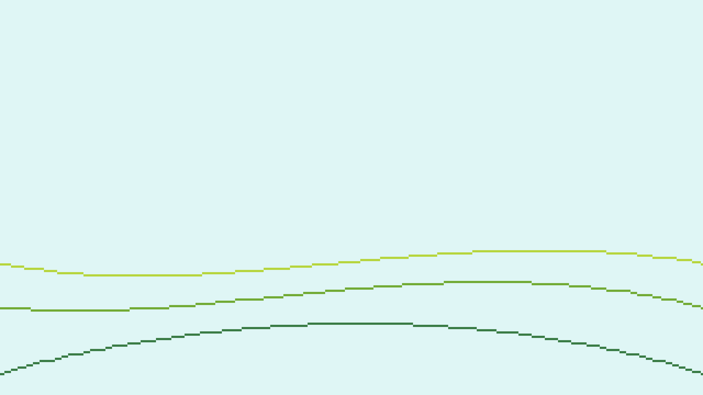

## Flächen füllen

Um den Hügel mit Farbe zu füllen, können wir den Befehl `flood_fill` verwenden. Dieser Befehl füllt eine Fläche mit einer bestimmten Farbe, beginnend von einem bestimmten Punkt. Füge den folgenden Code hinzu:

```ruby
set_color(7)
flood_fill(0, 130)
```

Der Punkt an der Stelle (0, 130) liegt zwischen den oberen beiden Kurven, und nun wird der Bereich zwischen diesen beiden Kurven mit der Farbe 7 (hellgrün) gefüllt. Dein Bild sollte danach so aussehen:

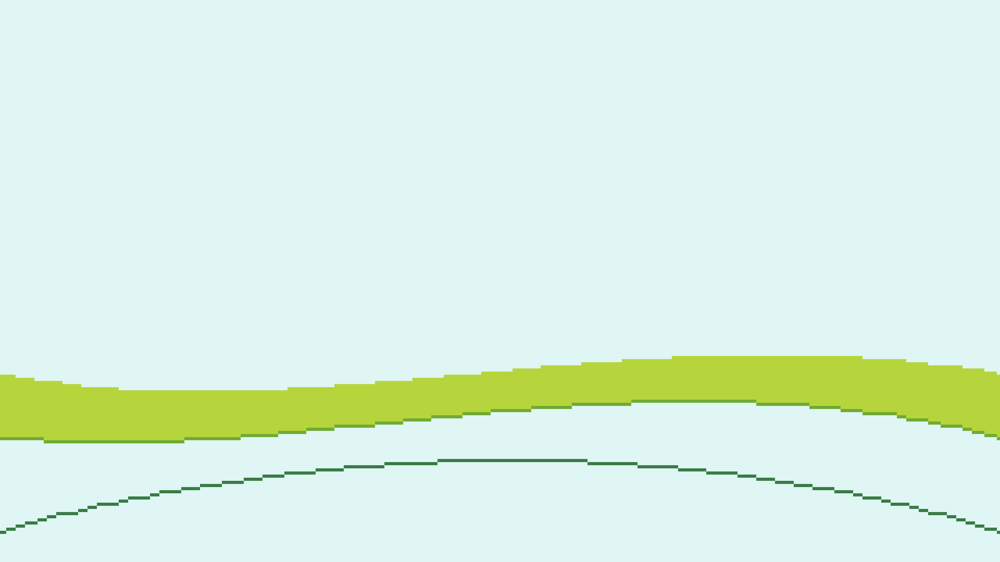

Füge anschließend die folgenden Zeilen hinzu, um die restlichen Flächen zu füllen:

```ruby
set_color(8)
flood_fill(0, 150)
set_color(9)
flood_fill(0, 179)
```

Dein Bild sollte jetzt so aussehen:

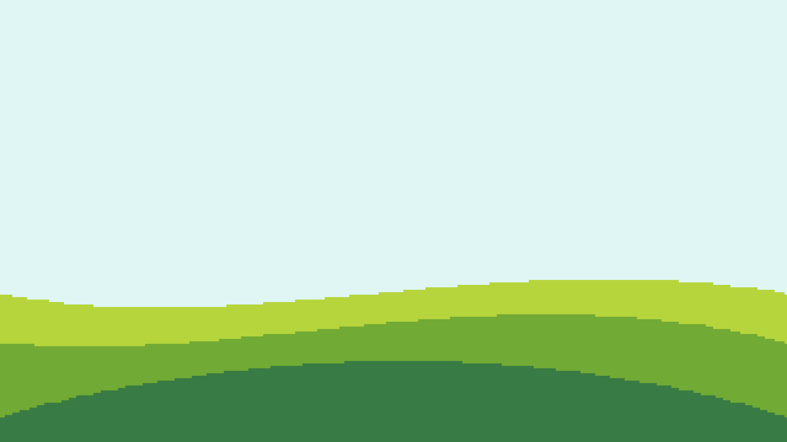

## Regenbogen zeichnen

Wir wollen nun einen Regenbogen zeichnen, der aus ineinander gelegten Kreisen besteht. Würden wir die Kreise einfach so zeichnen, würden sie den Rasen überdecken. Um das zu verhindern, können wir eine Maske verwenden. Eine Maske ist ein Bereich, in dem wir zeichnen können, ohne den Rest des Bildes zu beeinflussen. Wir definieren uns eine Maske, die nur die Hintergrundfarbe 16 (hellblau) umfasst, und zeichnen dann die Kreise.

Mit dem Befehl `set_mask` können wir eine Maske definieren. Innerhalb des `do` / `end`-Blocks können wir dann definieren, was alles zur Maske gehört. Mit dem Befehl `add_color(16)` geben wir an, dass alle Pixel, die momentan die Farbe 16 haben, zur Maske gehören. Alle anderen Pixel werden durch die nachfolgenden Zeichenbefehle nicht beeinflusst. Füge den folgenden Code hinzu:

```ruby
set_mask do
    add_color(16)
end
```

Nun können wir die Kreise zeichnen. Wir verwenden gefüllte Kreise und zeichnen sie von außen nach innen. Wir beginnen mit einem Radius von 125 Pixeln und verringern ihn dann um 5 Pixel für jeden Kreis, während wir die Farben rot (28), orange (27), gelb (26), grün (8), indigo (19), violett (23) und himmelblau (16) durchlaufen. Füge den folgenden Code hinzu:

```ruby
r = 125
[28, 27, 26, 8, 19, 23, 16].each do |color|
    set_color(color)
    fill_circle(160, 180, r)
    r -= 5
end
```

Dein Bild sollte anschließend so aussehen:

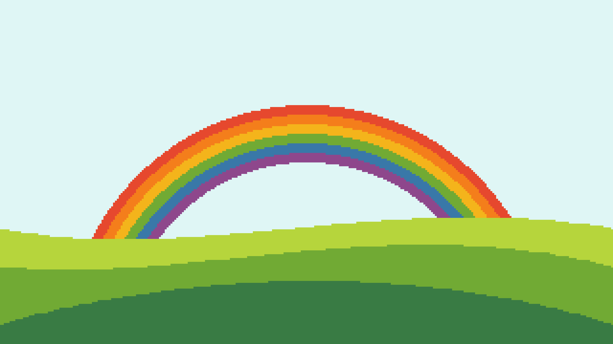

## Himmel zeichnen

Für den Himmel müssen wir die Maske erneuern, da sie nach wie vor gilt und somit folgende Zeichenbefehle auch den Regenbogen überdecken würden. Füge den folgenden Code ein:

```ruby
set_mask do
    add_color(16)
end
```
Im Bereich von 16 bis 20 gibt es ein paar schöne Blautöne, die wir für den Himmel verwenden können. Wir gehen zeilenweise von oben nach unten durch das Bild und wählen eine Farbe aus diesem Spektrum (mit etwas zufälliger Variation) und zeichnen damit eine horizontale Linie von links nach rechts. Füge den folgenden Code hinzu:

```ruby
(0...180).each do |y|
    set_color(20 - 3.5 * (y / 179.0) - rand() * 1.5)
    draw_line(0, y, 319, y)
end
```

Anschließend entfernen wir die Maske wieder:

```ruby
remove_mask()
```

Das fertige Bild sollte nun so aussehen:

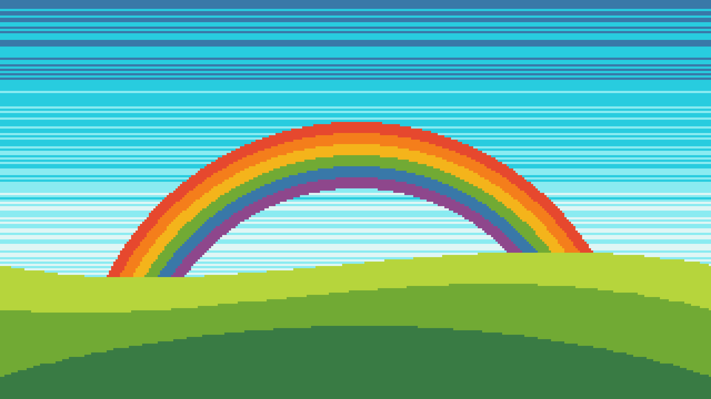

## Bild speichern

Um das Bild zu speichern, füge den folgenden Code hinzu:

```ruby
save_as_png('rainbow.png')
```

Hier siehst du noch einmal den gesamten Code:

_include_file(rainbow.rb, ruby)

## Zusammenfassung

In diesem Kapitel hast du gesehen, wie du Pixelgrafiken mit dem Pixelflow Canvas programmieren kannst. Du hast gesehen, wie man komplexe Szenen aus einfachen Formen zusammensetzen kann und anschließend das Bild speichern kann. In den nächsten Kapiteln werden wir uns mit weiteren Techniken beschäftigen, um noch komplexere Bilder zu erstellen.