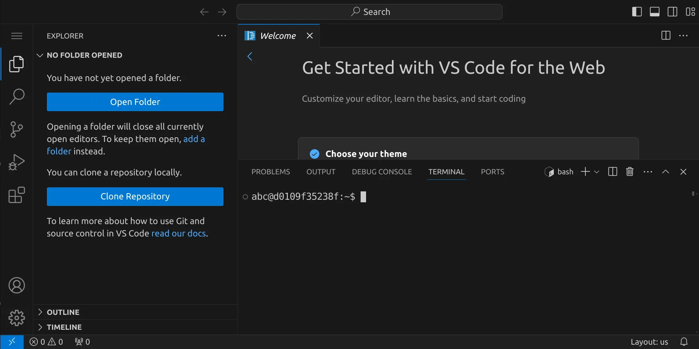
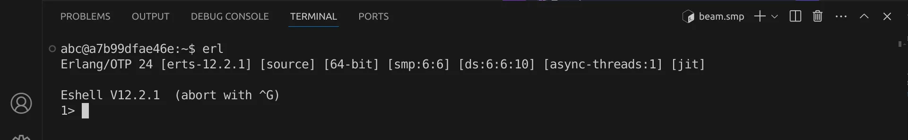
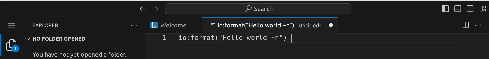
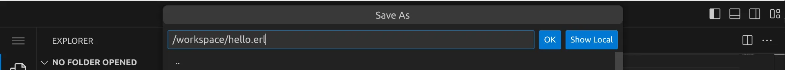
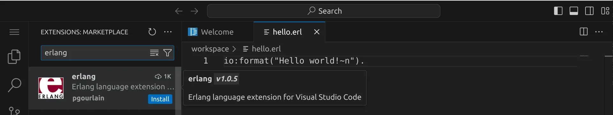
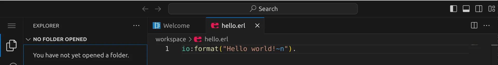

<div class='meta'>
image: erlang-logo.png
</div>

# Erlang <span style='font-size: 80%;'>(1986)</span>

<div class='floatright' style='width: 30em;'>
    
    <p>Joe Armstrong, Robert Verding und Mike Williams</p>
</div>

<p class='abstract'>
Erlang ist eine funktionale Programmiersprache, die 1986 von Joe Armstrong, Robert Verding und Mike Williams bei Ericsson entwickelt wurde. Sie wurde speziell für die Entwicklung von verteilten, fehlertoleranten und echtzeitfähigen Systemen konzipiert. Erlang ist bekannt für seine leichte Parallelisierung und seine Fähigkeit, mit Fehlern umzugehen, ohne das gesamte System zum Absturz zu bringen.
</p>

<!-- ## Eigenschaften

- **Funktionale Programmiersprache**: Erlang ist eine funktionale Programmiersprache, die auf der rekursiven Funktionstheorie basiert. -->

## Hello, world!

Erlang ist eine Skriptsprache, was bedeutet, dass der Code zur Laufzeit interpretiert wird. Du hast zwei Möglichkeiten, Erlang-Code auszuführen:

1. Du kannst Erlang-Code direkt in der Erlang-Shell ausführen.
2. Du kannst Erlang-Code in einer Textdatei speichern und dann ausführen.

**Möglichkeit 1:** Erlang-Code in der Erlang-Shell ausführen

Öffne dazu ein Terminal, indem du entweder <span class='key'>Strg</span><span class='key'>J</span> drückst oder das Panel-Symbol  rechts oben drückst. Dein Fenster sollte jetzt ungefähr so aussehen:



Starte nun die Erlang-Shell, indem du `erl` eingibst und dann <span class='key'>Enter</span> drückst. Du solltest eine Ausgabe wie diese sehen:



Jetzt kannst du Erlang-Code direkt in der Shell eingeben und ausführen. Schreibe einfach `io:format("Hello world!~n").` und drücke <span class='key'>Enter</span>. Du solltest die Ausgabe `Hello, world!` sehen.

Du kannst die Erlang-Shell wieder beenden, indem du zweimal hintereinander <span class='key'>Strg</span><span class='key'>C</span> drückst.

**Möglichkeit 2:** Erlang-Code in einer Textdatei speichern und ausführen

Erlang-Programme werden in Textdateien mit der Endung `.erl` geschrieben. Ein Erlang-Interpreter liest anschließend den Quelltext und führt ihn aus.

Stelle zuerst sicher, dass du keinen Ordner geöffnet hast. Um sicherzugehen, drücke einfach den Shortcut für »Ordner schließen«: <span class='key'>Strg</span><span class='key'>K</span> und dann <span class='key'>F</span>. Dein Workspace sollte jetzt ungefähr so aussehen:


### Quelltext schreiben

Klicke auf »New File« und wähle als Dateityp »Text File« (oder bestätige einfach mit <span class='key'>Enter</span>).


Schreibe nun den folgenden Code in die Datei:

_include_file(hello.erl, erlang)

Da Visual Studio Code noch nicht weiß, dass es sich um Erlkang-Quelltext handelt, ist dein Programm momentan noch einfarbig, aber das wird sich gleich ändern. An dem weißen Punkt erkennst du, dass deine Änderungen noch nicht gespeichert sind.



Drücke nun <span class='key'>Strg</span><span class='key'>S</span>, um die Datei zu speichern. Gib `hello.erl` ein – der vollständige Pfad zu deiner Datei lautet dann `/workspace/hello.erl`.



<div class='hint'>
Achte darauf, dass du deine Datei nicht aus Versehen <code>hello.erl.</code> (mit einem Punkt am Ende) nennst, da Visual Studio Code als Dateiname <code>io:format("Hello world!~n").</code> vorschlägt.
</div>

Da Smalltalk standardmäßig nicht von Visual Studio Code unterstützt wird, müssen wir noch eine passende Erweiterung installieren. Klicke dazu auf das Erweiterungs-Symbol  in der Seitenleiste oder drücke <span class='key'>Strg</span><span class='key'>Shift</span><span class='key'>X</span>. Suche nach der Erweiterung »Erlang« und installiere sie.



Alternativ kannst du auch <span class='key'>Strg</span><span class='key'>P</span> drücken und `ext install pgourlain.erlang` eingeben, um die Erweiterung zu installieren.

Anschließend solltest du dein Erlang-Programm farbig sehen:



### Skript ausführen

Um unser Programm auszuführen, müssen wir den Erlang-Interpreter aufrufen (in unserem Fall `erl`) und ihm den Dateinamen unseres Programms übergeben.

Öffne dazu ein Terminal, indem du <span class='key'>Strg</span><span class='key'>J</span> drückst und gib folgenden Befehl ein:

```bash
erl -noshell -s hello start -s init stop
```

<div class='hint'>
Du musst nicht den vollständigen Dateinamen schreiben. Schreib einfach <code>gst he</code> und drücke <span class='key'>Tab</span>, um den Dateinamen automatisch zu <code>hello.st</code> vervollständigen zu lassen. Du kannst danach ganz normal weiterschreiben.
</div>

Das Programm sollte die Nachricht `Hello, World!` im Terminal ausgeben:

