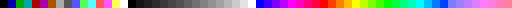
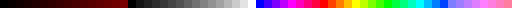
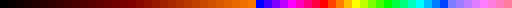
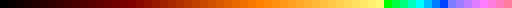
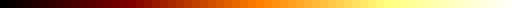
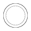
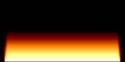
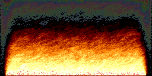
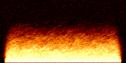

<div class='meta'>
image: fire.webp:73:0
</div>

# Feueranimation

<p class='abstract'>
»Demos« nannte man in der 90er Jahren kleine Programme, die spektakuläre Grafiken und Musik auf dem Bildschirm darstellten und dabei die Grenzen der verfügbaren Hardware ausreizten. Die Demoszene ist eine Subkultur, die sich um die Entwicklung von Demos und die Organisation von Demopartys dreht. In diesem Tutorial programmieren wir eine kleine Feueranimation in Ruby, die in der Demoszene relativ beliebt ist.
</p>

Stelle zuerst sicher, dass du keinen Ordner geöffnet hast. Um sicherzugehen, drücke einfach den Shortcut für »Ordner schließen«: <span class='key'>Strg</span><span class='key'>K</span> und dann <span class='key'>F</span>. Dein Workspace sollte jetzt ungefähr so aussehen:


<div class='hint books'>
Dieses Tutorial geht davon aus, dass du bereits die Pixelflow Canvas-Erweiterung und das pixelflow_canvas rubygem installiert hast. Falls nicht, findest du die Anleitung hier in Abschnitt 1: <a href='/drawing'>»Pixelflow Canvas installieren«</a>.
</div>

## Farbverlauf erstellen

Der Feuereffekt basiert auf einem Farbverlauf von Schwarz über Rot, Orange und Gelb bis Weiß. Wir verwenden das Pixelflow Canvas mit einer Palette von 64 Farben, wobei kleine Farben für kalte Pixel und große Farben für heiße Pixel stehen. Wir können den Farbverlauf in 4 Abschnitte unterteilen:

- Schwarz bis Dunkelrot (Farben 0 bis 15)
- Dunkelrot bis Orange (Farben 16 bis 31)
- Orange bis Gelb (Farben 32 bis 47)
- Gelb bis Weiß (Farben 48 bis 63)

Um den Farbverlauf zu programmieren, beginnen wir mit einem kleinen Programm, das uns die ersten 64 Farben ausgibt. So können wir kontrollieren, ob die Farben korrekt sind. Erstelle eine neue Datei namens `fire.rb` und füge folgenden Code ein:

```ruby
require 'pixelflow_canvas'

Pixelflow::Canvas.new(64, 1, :palette) do
    (0...64).each do |i|
        set_pixel(i, 0, i)
    end
end
```


Starte das Pixelflow Canvas, indem du <span class='key'>Strg</span><span class='key'>Shift</span><span class='key'>P</span> oder <span class='key'>F1</span> drückst und dann »Show Pixelflow Canvas« eingibst.
Führe das Programm aus, indem du im Terminal `ruby fire.rb` eingibst. Da standardmäßig die [VGA-Palette](https://specht.github.io/pixelflow_canvas_ruby/palettes.html#vga) verwendet wird, sehen wir die ersten 64 Farben der VGA-Palette:



Diese 64 Farben sollen nun durch unseren Farbverlauf ersetzt werden. Dazu schauen wir uns den Farbverlauf im Detail an:

<svg width="100%" viewBox="-0.3 -0.1 4.5 1.2">
    <defs>
        <linearGradient id="g0"><stop offset="0%" stop-color='#000' /><stop offset="100%" stop-color='#800' /></linearGradient>
        <linearGradient id="g1"><stop offset="0%" stop-color='#800' /><stop offset="100%" stop-color='#F80' /></linearGradient>
        <linearGradient id="g2"><stop offset="0%" stop-color='#F80' /><stop offset="100%" stop-color='#FF8' /></linearGradient>
        <linearGradient id="g3"><stop offset="0%" stop-color='#FF8' /><stop offset="100%" stop-color='#FFF' /></linearGradient>
    </defs>
    <path d="M0,1 l 1,0 0,-1 -1,0" stroke='none' fill='url(#g0)' />
    <path d="M1,1 l 1,0 0,-1 -1,0" stroke='none' fill='url(#g1)' />
    <path d="M2,1 l 1,0 0,-1 -1,0" stroke='none' fill='url(#g2)' />
    <path d="M3,1 l 1,0 0,-1 -1,0" stroke='none' fill='url(#g3)' />
    <path d="M0,0 l 0,1" stroke='#aaa' stroke-width='0.005' fill='none' />
    <path d="M1,0 l 0,1" stroke='#aaa' stroke-width='0.005' fill='none' />
    <path d="M2,0 l 0,1" stroke='#aaa' stroke-width='0.005' fill='none' />
    <path d="M3,0 l 0,1" stroke='#aaa' stroke-width='0.005' fill='none' />
    <path d="M4,0 l 0,1" stroke='#aaa' stroke-width='0.005' fill='none' />
    <path d="M0,0 l 4,0" stroke='#aaa' stroke-width='0.005' fill='none' />
    <path d="M0,0.5 l 4,0" stroke='#aaa' stroke-width='0.005' fill='none' />
    <path d="M0,1 l 4,0" stroke='#aaa' stroke-width='0.005' fill='none' />
    <path d="M0,1 L 1,0.5 2,0 3,0 4,0" stroke='#a00' stroke-width='0.01' fill='none'/>
    <path d="M0,1 L 1,1 2,0.5 3,0 4,0" stroke='#0a0' stroke-width='0.01' fill='none'/>
    <path d="M0,1 L 1,1 2,1 3,0.5 4,0" stroke='#00a' stroke-width='0.01' fill='none'/>
    <g transform='translate(-0.05,-0.05)'>
    <rect x='-0.1' y='1' width='0.1' height='0.1' rx='0.02' stroke='#a00' fill='#f00' stroke-width='0.01' />
    <rect x='0.0' y='1' width='0.1' height='0.1' rx='0.02' stroke='#0a0' fill='#0f0' stroke-width='0.01' />
    <rect x='0.1' y='1' width='0.1' height='0.1' rx='0.02' stroke='#00a' fill='#00f' stroke-width='0.01' />
    <rect x='1.0' y='0.5' width='0.1' height='0.1' rx='0.02' stroke='#a00' fill='#f00' stroke-width='0.01' />
    <rect x='0.95' y='1' width='0.1' height='0.1' rx='0.02' stroke='#0a0' fill='#0f0' stroke-width='0.01' />
    <rect x='1.05' y='1' width='0.1' height='0.1' rx='0.02' stroke='#00a' fill='#00f' stroke-width='0.01' />
    <rect x='2.0' y='0' width='0.1' height='0.1' rx='0.02' stroke='#a00' fill='#f00' stroke-width='0.01' />
    <rect x='2.0' y='0.5' width='0.1' height='0.1' rx='0.02' stroke='#0a0' fill='#0f0' stroke-width='0.01' />
    <rect x='2.0' y='1' width='0.1' height='0.1' rx='0.02' stroke='#00a' fill='#00f' stroke-width='0.01' />
    <rect x='2.95' y='0' width='0.1' height='0.1' rx='0.02' stroke='#a00' fill='#f00' stroke-width='0.01' />
    <rect x='3.05' y='0' width='0.1' height='0.1' rx='0.02' stroke='#0a0' fill='#0f0' stroke-width='0.01' />
    <rect x='3.0' y='0.5' width='0.1' height='0.1' rx='0.02' stroke='#00a' fill='#00f' stroke-width='0.01' />
    <rect x='3.9' y='0' width='0.1' height='0.1' rx='0.02' stroke='#a00' fill='#f00' stroke-width='0.01' />
    <rect x='4.0' y='0' width='0.1' height='0.1' rx='0.02' stroke='#0a0' fill='#0f0' stroke-width='0.01' />
    <rect x='4.1' y='0' width='0.1' height='0.1' rx='0.02' stroke='#00a' fill='#00f' stroke-width='0.01' />
    </g>
</svg>

Im ersten Abschnitt sehen wir, dass Grün und Blau auf 0 gesetzt sind, während Rot von 0 auf 50% ansteigt. Da jeder Farbkanal einen Wert von 0 bis 255 annehmen kann, entspricht 50% einem Wert von ca. 128. Der Farbverlauf beginnt also bei Schwarz (0, 0, 0) und endet bei Dunkelrot (128, 0, 0). Der erste Abschnitt umfasst 16 Farben, wir müssen also den Rotwert in jedem Schritt um 8 erhöhen, um nach 16 Schritten bei 128 zu landen. Ändere den Code wie folgt:

```ruby
require 'pixelflow_canvas'

Pixelflow::Canvas.new(64, 1, :palette) do
    (0...16).each do |i|
        set_palette(i, i * 8, 0, 0)
    end
    (0...64).each do |i|
        set_pixel(i, 0, i)
    end
end
```

<div class='hint books'>
Hinweis: Achte auf die drei Punkte im Bereich <code>(0...16)</code>. Der dritte Punkt schiebt die hintere Zahl aus dem Bereich heraus, sodass die Schleife nur von 0 bis 15 läuft. Alternativ könnten wir auch <code>(0..15)</code> schreiben (mit zwei Punkten).
</div>

Dein Bild sollte jetzt so aussehen:



Im zweiten Abschnitt steigt der Grünwert von 0 auf 50% an, während Rot weiter von 50% auf 100% wächst. Blau bleibt weiterhin auf 0.
Der Farbverlauf geht also von Dunkelrot (128, 0, 0) zu Orange (255, 128, 0). Füge folgenden Code direkt hinter dem `set_palette`-Aufruf ein:

```ruby
set_palette(i + 16, i * 8 + 128, i * 8, 0);
```

Dein Farbverlauf sollte nun so aussehen:



Im dritten Abschnitt steigt der Grünwert von 50% auf 100% an, während Blau von 0 auf 50% ansteigt. Rot bleibt bei 100%. Der Farbverlauf geht also von Orange (255, 128, 0) zu Gelb (255, 255, 128). Füge folgenden Code ein:

```ruby
set_palette(i + 32, 255, i * 8 + 128, i * 8);
```

Dein Farbverlauf sollte nun so aussehen:



Im vierten Abschnitt steigt der Blauwert von 50% auf 100% an, während Rot und Grün bei 100% bleiben. Der Farbverlauf geht also von Gelb (255, 255, 128) zu Weiß (255, 255, 255). Füge folgenden Code ein:

```ruby
set_palette(i + 48, 255, 255, i * 8 + 128);
```

Geschafft! Dein Farbverlauf sollte nun so aussehen:



## Animations-Loop

Wir schreiben nun unser Programm ein bisschen um, um das Grundgerüst für eine Animation zu erhalten, bei dem immer nur am unteren Rand des Bildschirms ein helles Rechteck erscheint, das wir anschließend animieren werden, so dass es wie ein Feuer aussieht. Ändere dein Programm wie folgt:

_include_file(draft1.rb, ruby)

Anmerkungen:

- In Zeile 3 legen wir die Größe für unsere Animation fest (256x128 Pixel).
- In Zeile 5 wird »Double Buffering« aktiviert, damit wir dem Bildschirm nicht beim Zeichnen zuschauen müssen, sondern nur das fertige Ergebnis sehen, wenn wir fertig sind. Dafür ist es wichtig, dass wir in Zeile 22 den Befehl `flip()` aufrufen, damit der Bildschirm aktualisiert wird.
- In Zeile 16 beginnt eine Endlosschleife, die die Animation Bild für Bild zeichnet. Da das Programm sich nun nicht mehr von selbst beendet, musst du es manuell abbrechen, indem du <span class='key'>Strg</span><span class='key'>C</span> drückst.

Das Ergebnis sieht jetzt noch relativ unspektakulär aus, aber wir sehen schon das helle Rechteck am unteren Rand des Bildes (und auch wenn es noch nicht so aussieht, werden schon regelmäßig neue Frames gezeichnet):


Um einen Feuereffekt zu erzielen, verwenden wir eine Technik aus der Bildbearbeitung, die als »Filterkernel« (bzw. Convolution Matrix oder Faltungsmatrix) bezeichnet wird.

## Filterkernel

Filterkernel werden für verschiedene Effekte verwendet, z. B. Weichzeichnen, Schärfen oder Kantenerkennung. Dabei wird ein kleines Quadrat von Pixeln um einen bestimmten Pixel herum betrachtet, und die Farben dieser Pixel werden mit einem bestimmten Gewicht multipliziert und addiert. Der resultierende Wert wird dann als neuer Farbwert für den betrachteten Pixel verwendet.

Hier siehst du ein paar Beispiele:

<style>
.kernel {
    color: #000;
    position: absolute;
    left: 0;
    top: 0;
    bottom: 0;
    right: 0;
    display: flex;
    align-items: center;
    justify-content: center;
    font-family: 'IBM Plex Mono';
    flex-direction: column;
}
.kernel td {
    width: 1.5em;
    text-align: center;
}
[data-bs-theme=dark] {
    .kernel {
        color: #fff;
    }
    .kernel td {
        color: #fff;
    }
    .kernel_img {
        filter: invert(0.917);
    }
}
</style>

<div class='row'>
    <div class='col-md-4' style='position: relative;'>
        
        <div class='kernel'>
            <strong>Identity</strong>
            <table>
                <tr><td>0</td><td>0</td><td>0</td></tr>
                <tr><td>0</td><td>1</td><td>0</td></tr>
                <tr><td>0</td><td>0</td><td>0</td></tr>
            </table>
        </div>
    </div>
    <div class='col-md-4' style='position: relative;'>
        
        <div class='kernel'>
            <strong>Box blur</strong>
            <table>
                <tr><td>1</td><td>1</td><td>1</td></tr>
                <tr><td>1</td><td>1</td><td>1</td></tr>
                <tr><td>1</td><td>1</td><td>1</td></tr>
            </table>
        </div>
    </div>
    <div class='col-md-4' style='position: relative;'>
        
        <div class='kernel'>
            <strong>Edge detection</strong>
            <table>
                <tr><td>0</td><td>-1</td><td>0</td></tr>
                <tr><td>-1</td><td>4</td><td>-1</td></tr>
                <tr><td>0</td><td>-1</td><td>0</td></tr>
            </table>
        </div>
    </div>
</div>

Im ersten Beispiel (»Identity«) wird der Pixelwert unverändert übernommen und alle umliegenden Pixel ignoriert. Im zweiten Beispiel (»Box blur«) wird der Pixelwert mit den Werten der umliegenden Pixel gemittelt, um einen Weichzeichnungseffekt zu erzielen. Im dritten Beispiel (»Edge detection«) wird der Pixelwert so berechnet, dass Kanten im Bild hervorgehoben werden.

Wird ein Filterkernel wiederholt auf ein Bild angewendet, entsteht ein Effekt, der sich über die gesamte Bildfläche ausbreitet. Der Feuereffekt verwendet einen speziellen Filterkernel, der die Farben von Pixeln nach oben bewegt und dabei abkühlt. Der Filterkernel sieht folgendermaßen aus:

<div style='max-width: 20em; margin-left: auto; margin-right: auto; position: relative;'>
    
    <div class='kernel'>
        <table>
            <tr><td>0</td><td>0</td><td>0</td></tr>
            <tr><td>1</td><td>0</td><td>1</td></tr>
            <tr><td>0</td><td>2</td><td>0</td></tr>
        </table>
    </div>
</div>

Der Filterkernel ist also sehr ähnlich zu einem »Box blur«-Filter, jedoch wird hier der untere Pixel doppelt gewichtet und der obere Pixel weggelassen, so dass sich die Farbe minimal nach oben bewegt.

## Feueranimation

Wir können den Filterkernel in unserem Programm verwenden, um den Feuereffekt zu erzeugen. Dazu müssen wir den Filterkernel auf jeden Pixel anwenden und die Farben entsprechend anpassen. Füge folgenden Code über der `flip()`-Zeile ein:

```ruby
# Filterkernel auf jedes Pixel anwenden
(0...128).each do |y|
    (0...256).each do |x|
        # Farbwerte der Nachbarpixel einsammeln
        c = get_pixel(x, y + 1) * 2
        c += get_pixel(x - 1, y)
        c += get_pixel(x + 1, y)
        # Summe durch vier teilen
        c /= 4
        # Pixel setzen
        set_pixel(x, y, c)
    end
end
```

Wir gehen zeilenweise durch das Bild und in jeder Zeile betrachten wir jeden Pixel. Für jeden Pixel addieren wir die Farbwerte der umliegenden Pixel und teilen das Ergebnis durch 4, um den Mittelwert zu erhalten. Diesen Mittelwert setzen wir dann als neuen Farbwert für den betrachteten Pixel.

Deine Animation sollte nach einer kleinen Weile nun so aussehen:



Wir sehen, dass die hellen Pixel langsam nach oben wandern und dabei abkühlen, wobei sie eine andere Farbe annehmen. Das Problem ist jedoch, dass das Ergebnis zu glatt und nicht wirklich wie ein Feuer aussieht. Um das zu beheben, fügen wir noch ein paar zufällige Farbvariationen hinzu. Füge folgenden Code vor der `set_pixel`-Zeile ein:

```ruby
# Zufällige Variation hinzufügen
c += rand(7) - 3
```

Da uns `rand(7)` eine zufällige Zahl im Bereich von 0…6 zurückgibt, subtrahieren wir 3, um Werte von -3 bis +3 zu erhalten. Das Ergebnis wird dann auf den Mittelwert addiert, um eine zufällige Variation zu erzeugen. Das Ergebnis sieht schon vielversprechender aus:



<div class='hint think'>
Hast du eine Idee, woran es liegen könnte, dass wir in den hellen und dunklen Bereichen falsche Farben bekommen?
</div>

Das Problem ist, dass wir die Farben in der Palette direkt als Index verwenden, ohne zu überprüfen, ob sie im Bereich von 0 bis 63 liegen. Wenn wir also eine Farbe von -3 oder +3 erhalten, landen wir außerhalb des gültigen Bereichs und erhalten eine falsche Farbe. Um das zu beheben, fügen wir folgenden Code vor der `set_pixel`-Zeile ein:

```ruby
# Wertebereich auf 0 bis 63 begrenzen
c = c.clamp(0, 63)
```

Dein Ergebnis sollte nun so aussehen:



Wir sind nun fast fertig – wir müssen nur noch dafür sorgen, dass nicht die gesamte Luft »glüht« – wir können dies erreichen, in dem wir die zufällige Variation nur anwenden, wenn unser Pixel nicht schon ganz schwarz ist. Ändere die Zeile mit dem `rand`-Aufruf wie folgt:

```ruby
c += rand(7) - 3 if c > 0
```

<div class='hint books'>
In Ruby können wir statt der normalen <code>if</code>-Syntax auch die Kurzform <code>if</code> am Ende eines Ausdrucks verwenden, um den Ausdruck nur dann auszuführen, wenn die Bedingung erfüllt ist. Das ist besonders nützlich, wenn wir nur eine einfache Anweisung ausführen wollen.
</div>

Dein Feuereffekt sollte nun so aussehen:


Das gesamte Programm sieht nun so aus:

_include_file(fire.rb, ruby)

## Zusammenfassung

In diesem Tutorial haben wir eine kleine Feueranimation in Ruby programmiert, die auf einem Farbverlauf basiert und einen speziellen Filterkernel verwendet, um die Farben zu animieren. Wir haben gesehen, wie Filterkernel in der Bildbearbeitung verwendet werden und wie sie in der Programmierung eingesetzt werden können, um Effekte zu erzielen. Die Feueranimation ist ein beliebter Effekt in der Demoszene und kann mit ein wenig Übung und Experimentieren noch weiter verbessert werden.

Hier sind ein paar Vorschläge, wie du die Animation weiter verbessern könntest:

- Versuche, andere Muster zu zeichnen, um die Quelle des Feuers zu verändern.
- Experimentiere mit verschiedenen Farbverläufen und Filterkernels, um andere Effekte (z. B. einen Raucheffekt) zu erzielen.
