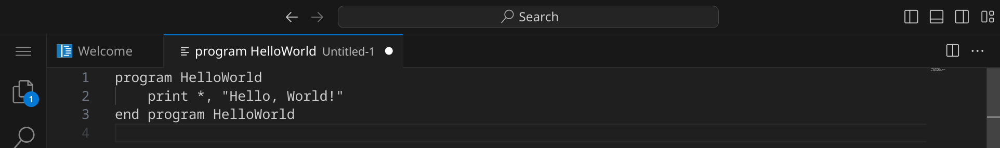
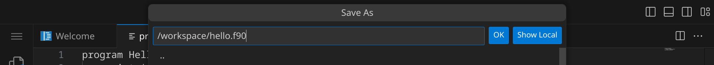
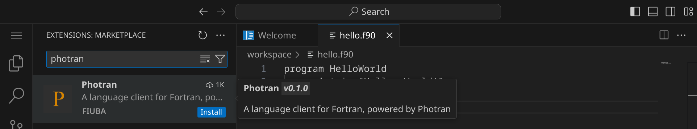
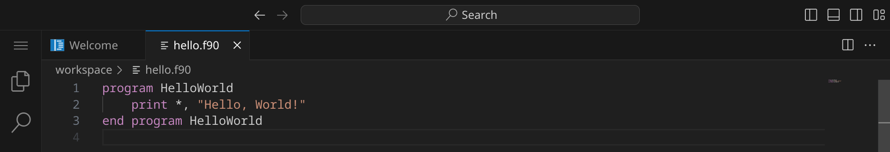
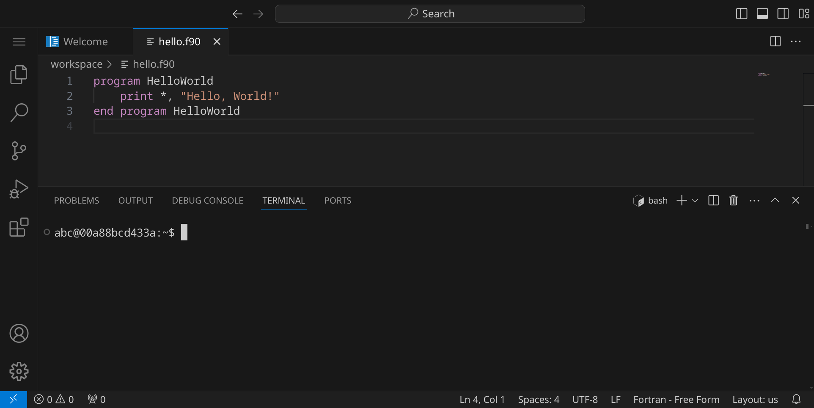
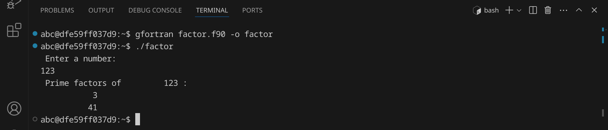
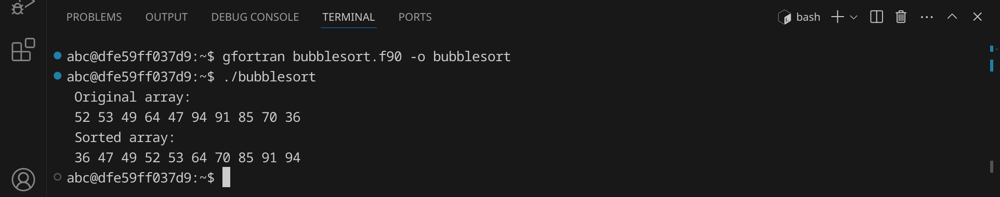

<div class='meta'>
image: fortran-logo.png
</div>

# Fortran <span style='font-size: 80%;'>(1957)</span>

<div class='floatright' style='width: 12em;'>
    
    <p>John Backus</p>
</div>

<p class='abstract'>
FORTRAN, kurz für "Formula Translation," wurde 1957 von John Backus bei IBM entwickelt und ist eine der ältesten Programmiersprachen. Sie wurde ursprünglich für wissenschaftliche und technische Anwendungen entwickelt und wird heute noch in diesen Bereichen eingesetzt. Fortran ist eine imperative Programmiersprache, die speziell für numerische Berechnungen optimiert ist. Sie bietet eine Vielzahl von Funktionen und Bibliotheken für mathematische und wissenschaftliche Berechnungen.
</p>

FORTRAN wurde vor allem in Bereichen eingesetzt, die intensive numerische Berechnungen erfordern, wie zum Beispiel in der Wettervorhersage, der numerischen Strömungsmechanik und der linearen Algebra. Ein bekanntes Softwareprojekt, das FORTRAN verwenden, ist das Weather Research and Forecasting (WRF) Model, das zur Wettervorhersage und Klimaforschung eingesetzt wird. FORTRAN wird auch in der Hochenergiephysik, der Astronomie und der Chemie eingesetzt.

<!-- ## Eigenschaften

- **Imperative Programmiersprache**: Fortran ist eine imperative Programmiersprache, die auf der sequentiellen Ausführung von Anweisungen basiert.
- **Numerische Berechnungen**: Fortran ist speziell für numerische Berechnungen optimiert und bietet eine Vielzahl von Funktionen und Bibliotheken für mathematische und wissenschaftliche Berechnungen.
- **Hohe Performance**: Fortran ist eine der schnellsten Programmiersprachen und wird häufig für rechenintensive Anwendungen eingesetzt.
- **Statische Typisierung**: Fortran ist eine statisch typisierte Sprache, was bedeutet, dass Variablen bei der Deklaration einen festen Datentyp haben.
- **Array-Operationen**: Fortran bietet leistungsstarke Array-Operationen, die es ermöglichen, effizient mit großen Datenmengen zu arbeiten.
- **Parallelisierung**: Fortran unterstützt die Parallelisierung von Code, was es ermöglicht, rechenintensive Anwendungen auf Mehrkernprozessoren und Clustern auszuführen. -->

## Hello, world!

Fortran-Programme werden in Textdateien mit der Endung `.f90` geschrieben. Diese Dateien werden anschließend von einem Compiler in ausführbare Dateien übersetzt, die auf deinem Computer direkt ausgeführt werden können. Es gibt eine Vielzahl von Compilern, die du verwenden kannst, aber wir werden hier den freien »GNU Fortran Compiler« `gfortran` verwenden, der auf den meisten Systemen verfügbar ist.

Stelle zuerst sicher, dass du keinen Ordner geöffnet hast. Um sicherzugehen, drücke einfach den Shortcut für »Ordner schließen«: <span class='key'>Strg</span><span class='key'>K</span> und dann <span class='key'>F</span>. Dein Workspace sollte jetzt ungefähr so aussehen:


### Quelltext schreiben

Klicke auf »New File« und wähle als Dateityp »Text File«.


Schreibe nun den folgenden Code in die Datei:

_include_file(hello.f90, fortran)

Da Visual Studio Code noch nicht weiß, dass es sich um Fortran-Quelltext handelt, ist dein Programm momentan noch einfarbig, aber das wird sich gleich ändern. An dem weißen Punkt erkennst du, dass deine Änderungen noch nicht gespeichert sind.



Drücke nun <span class='key'>Strg</span><span class='key'>S</span>, um die Datei zu speichern. Gib `hello.f90` ein – der vollständige Pfad zu deiner Datei lautet dann `/workspace/hello.f90`.



Da Fortran standardmäßig nicht von Visual Studio Code unterstützt wird, müssen wir noch eine passende Erweiterung installieren. Klicke dazu auf das Erweiterungs-Symbol  in der Seitenleiste oder drücke <span class='key'>Strg</span><span class='key'>Shift</span><span class='key'>X</span>. Suche nach der Erweiterung »Photran« und installiere sie.



Alternativ kannst du auch <span class='key'>Strg</span><span class='key'>P</span> drücken und `ext install fiuba.photran-lsp-client-vscode` eingeben, um die Erweiterung zu installieren.

Anschließend solltest du dein Fortran-Programm farbig sehen:



### Kompilieren und ausführen

Bevor wir das Programm ausführen können, müssen wir es kompilieren. Dadurch wird der Quelltext in Maschinencode übersetzt, den dein Computer ausführen kann.

Öffne dazu ein Terminal, indem du entweder <span class='key'>Strg</span><span class='key'>J</span> drückst oder das Panel-Symbol  rechts oben drückst. Dein Fenster sollte jetzt ungefähr so aussehen:



Um das Programm zu kompilieren, gib folgenden Befehl ein:

```bash
gfortran hello.f90 -o hello
```

<div class='hint'>
Du musst nicht den vollständigen Dateinamen schreiben. Schreib einfach <code>gfortran he</code> und drücke <span class='key'>Tab</span>, um den Dateinamen automatisch zu <code>hello.f90</code> vervollständigen zu lassen. Du kannst danach ganz normal weiterschreiben.
</div>

Wenn du keinen Fehler gemacht hast, wird das Programm erfolgreich kompiliert und die ausführbare Datei `hello` wird im selben Verzeichnis erstellt. Du kannst dies überprüfen, indem du dir die Dateien im aktuellen Verzeichnis mit `ls` oder `ls -l` anzeigen lässt:


Die grüne Datei `hello` ist die ausführbare Datei – im Unterschied zu Windows, wo ausführbare Dateien die Endung `.exe` haben, haben ausführbare Dateien unter Linux keine Endung. Um das Programm auszuführen, gib folgenden Befehl ein:

```bash
./hello
```

Das Programm sollte die Nachricht `Hello, World!` im Terminal ausgeben. Du kannst beide Schritte auch in einem Befehl kombinieren:

```bash
gfortran hello.f90 -o hello && ./hello
```

<div class='hint'>
Die Zeichenkombination <code>&amp;&amp;</code> sorgt dafür, dass der zweite Befehl nur ausgeführt wird, wenn der erste erfolgreich war.
</div>

### Fehler finden und beheben

Wenn du einen Fehler im Code machst, wird der Compiler eine Fehlermeldung ausgeben. Versuche zum Beispiel, statt `print` das Wort `prin` zu schreiben:

```fortran
    prin *, "Hello, World!"
```

Speichere die Datei und führe den Compiler erneut aus:

```bash
gfortran hello.f90 -o hello
```

<div class='hint'>
Nutze die Pfeiltaste hoch <span class='key'>↑</span>, um den letzten Befehl erneut einzugeben. So kannst du schnell dein Programm testen, nachdem du es verändert hast.
</div>

Der Compiler sollte eine Fehlermeldung ausgeben, die dir hilft, den Fehler zu finden:


Es lohnt sich, die Fehlermeldungen genau zu lesen, um den Fehler zu finden und zu beheben. Achte auf die Zeilennummer (in diesem Beispiel 2) und den Text, der dir sagt, was falsch ist. Denke daran, den Fehler wieder zu beheben, bevor du das nächste Beispiel ausprobierst.

## Primfaktorzerlegung

Im zweiten Beispiel wollen wir eine Zahl in ihre Primfaktoren zerlegen. An diesem Beispiel kannst du sehen, wie man in C Benutzereingaben verarbeitet und Schleifen verwendet.
Erstelle eine neue Datei mit <span class='key'>Strg</span><span class='key'>Alt</span><span class='key'>N</span> und schreibe den folgenden Code hinein:

_include_file(factor.f90, fortran)

Speichere die Datei unter dem Namen `factor.f90`. Kompiliere das Programm:

```bash
gfortran factor.f90 -o factor
```

Falls du keine Fehlermeldung erhältst, kannst du das Programm ausführen und testen:



Das Programm hat die Zahl 123 in ihre Primfaktoren zerlegt und ausgegeben. Probiere aus, was passiert, wenn du die Zahl 3000000000 eingibst. Was könnte der Grund dafür sein?

## Bubblesort

Im dritten Beispiel wollen wir eine Liste von 10 Zufallszahlen sortieren. Dafür verwenden wir den [Bubblesort-Algorithmus](https://de.wikipedia.org/wiki/Bubblesort), der zwar nicht besonders effizient ist, aber sehr einfach zu verstehen und zu implementieren. Der Bubblesort-Algorithmus funktioniert, indem er die Liste mehrmals durchläuft und benachbarte Elemente vertauscht, wenn sie in der falschen Reihenfolge sind.

An diesem Beispiel kannst du sehen, wie man in Fortran Arrays verwendet  und Schleifen verschachtelt.

Erstelle eine neue Datei und schreibe den folgenden Code hinein:

_include_file(bubblesort.f90, fortran)

Speichere die Datei unter dem Namen `bubblesort.f90`. Kompiliere das Programm:

```bash
gfortran bubblesort.f90 -o bubblesort
```
Falls du keine Fehlermeldung erhältst, kannst du das Programm ausführen und testen:



Das Programm hat eine Liste von 10 Zufallszahlen sortiert. Versuche, den Quelltext so zu verändern, dass statt 10 Zahlen 100 oder mehr Zahlen sortiert werden.

## Zusammenfassung

In diesem Kapitel hast du an drei Beispielen gesehen, wie man ein einfaches Fortran-Programm schreiben, kompilieren und ausführen kann. Das ist natürlich nur ein erster Eindruck. Um Fortran wirklich zu beherrschen, musst du noch viel mehr lernen – am besten, indem du eigene Programme schreibst und ausprobierst. Die Buchhandlungen, Bibliotheken und Youtube sind voll von Material für dich. Viel Spaß beim Programmieren!

