<div class='meta'>
image: git-logo.png
</div>

# Versionsverwaltung mit Git

<p class='abstract'>
Git ist ein Versionsverwaltungssystem, das von Linus Torvalds entwickelt wurde, also ein Werkzeug, mit dem Änderungen an Dateien über längere Zeit hinweg nachvollziehbar gespeichert werden können. Es wird zur Verwaltung von Quellcode in Softwareprojekten eingesetzt und gehört heute zu den bekanntesten und am weitesten verbreiteten Werkzeugen dieser Art.
Der eigentliche Nutzen von Git zeigt sich jedoch erst, wenn man selbst an größeren Texten oder Programmen arbeitet und dabei immer wieder Änderungen vornimmt. Oft möchte man etwas ausprobieren, eine Idee testen oder einen Fehler beheben – und merkt später, dass es doch nicht die richtige Lösung war. Ohne ein Werkzeug wie Git ist es dann schwierig, zu einem früheren, funktionierenden Stand zurückzukehren oder überhaupt noch nachzuvollziehen, was sich wann geändert hat.
</p>

Git löst dieses Problem, indem es die Entwicklung eines Projekts als eine Abfolge von nachvollziehbaren Zwischenschritten speichert. Diese Zwischenschritte bilden eine Art Geschichte des Projekts, zu der man jederzeit zurückkehren kann. Auf diese Weise wird es möglich, Änderungen zu vergleichen, alternative Lösungswege auszuprobieren und Fehler rückgängig zu machen, ohne Angst haben zu müssen, etwas dauerhaft zu zerstören.

In diesem Tutorial lernst du Git Schritt für Schritt kennen. Wir beginnen ganz lokal auf deinem eigenen Rechner und schauen uns zunächst an, wie Git Änderungen speichert und organisiert. Erst später werden wir darauf eingehen, wie Git auch die Zusammenarbeit mehrerer Personen an einem gemeinsamen Projekt unterstützt.

Stelle zuerst sicher, dass du keinen Ordner geöffnet hast. Um sicherzugehen, drücke einfach den Shortcut für »Ordner schließen«: <span class='key'>Strg</span><span class='key'>K</span> und dann <span class='key'>F</span>. Dein Workspace sollte jetzt ungefähr so aussehen:

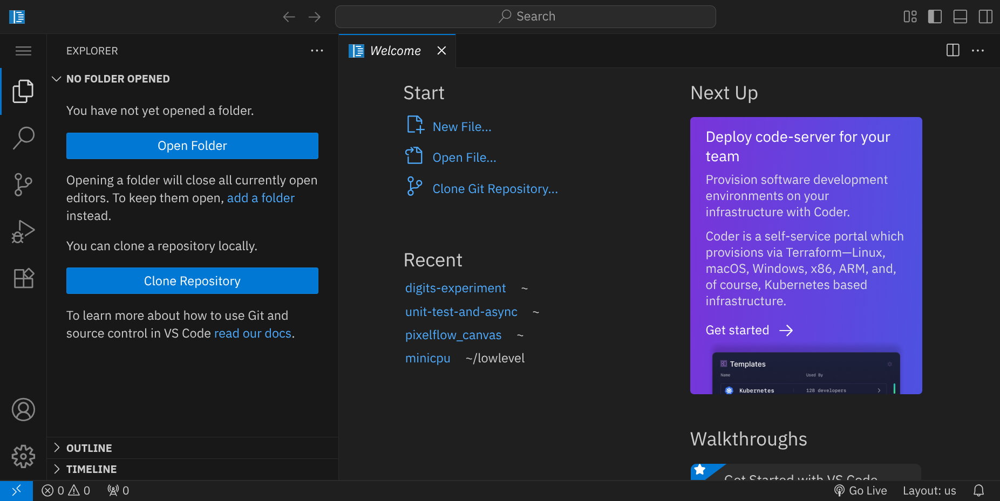

Schließe die linken Seitenleiste, indem du <span class='key'>Strg</span><span class='key'>B</span> drückst, um mehr Platz zu haben.
Öffne als nächstes das Terminal, indem du den Shortcut <span class='key'>Strg</span><span class='key'>J</span> drückst. Dein Workspace sollte jetzt ungefähr so aussehen:

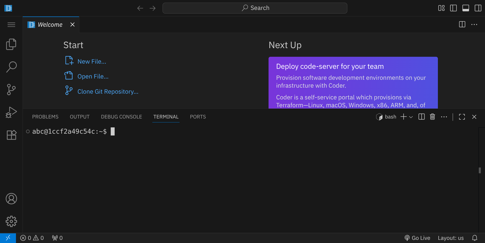


Du kannst das Terminal auch maximieren, indem du auf den Pfeil in der rechten oberen Ecke des Terminals klickst. Die linke Seitenleiste kannst du jederzeit mit <span class='key'>Strg</span><span class='key'>B</span> ein- und ausblenden.

Erstelle als erstes ein Verzeichnis für dieses Tutorial, indem du im Terminal folgenden Befehl eingibst:

```bash
mkdir git-tutorial
```

Mit `ls -l` kannst du anschließend überprüfen, ob das Verzeichnis erstellt wurde (das `d` am Anfang der Zeile zeigt an, dass es sich um ein Verzeichnis handelt):

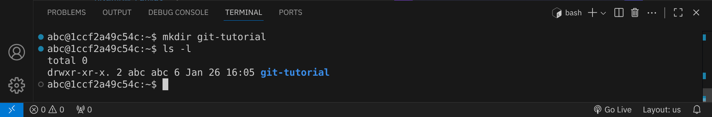

<div class='hint books'>
Falls du mehr über die Grundlagen der Kommandozeile erfahren möchtest, schau dir das <a href='/working-with-files'>Tutorial zu Dateien und Verzeichnissen</a> an.
</div>

Wechsle anschließend in das neu erstellte Verzeichnis und lege ein Verzeichnis namens `alice` für eine fiktive Person Alice an:

```bash
cd git-tutorial
mkdir alice
cd alice
```

## Repository initialisieren

Initialisiere jetzt ein neues Git-Repository mit dem Befehl `git init`:

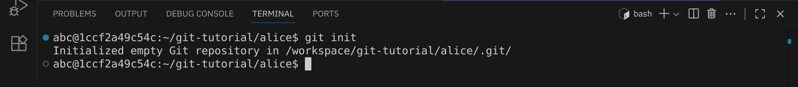

Mit dem Befehl `ls -la` kannst du sehen, dass ein verstecktes Verzeichnis namens `.git` erstellt wurde:

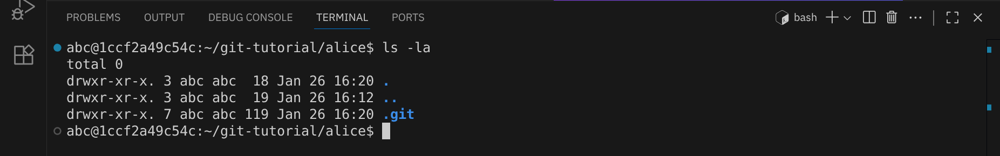

Das `.git`-Verzeichnis enthält alle Informationen, die Git benötigt, um die Versionsgeschichte deines Projekts zu verwalten. Darin befindet sich später die gesamte Historie deiner Änderungen.

<div class='hint danger'>
Das Vorhandensein eines <code>.git</code>-Verzeichnisses zeigt an, dass sich das aktuelle Verzeichnis in einem Git-Repository befindet. Wenn du ein Verzeichnis löschst, das ein <code>.git</code>-Verzeichnis enthält, verlierst du die gesamte Versionsgeschichte dieses Repositories und hast »nur noch« ein normales Verzeichnis ohne Versionskontrolle.
</div>

## Erste Datei erstellen

Erstelle jetzt eine Datei namens `hello.txt` mit dem Befehl `echo`:

```bash
echo "Hello, world!" > hello.txt
```

Überzeuge dich mit dem Befehl `cat hello.txt`, dass die Datei den erwarteten Inhalt hat:

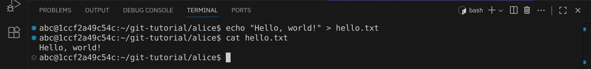

<div class='hint books'>
Der Befehl <code>echo</code> gibt den angegebenen Text im Terminal aus. Mit dem Zeichen <code>&gt;</code> leitest du die Ausgabe in eine Datei um. Wenn die Datei noch nicht existiert, wird sie erstellt. Wenn sie bereits existiert, wird ihr Inhalt überschrieben. Der Befehl <code>cat</code> zeigt den Inhalt einer Datei im Terminal an.
</div>

Verwende nun den Befehl `git status`, um den aktuellen Status des Repositories zu überprüfen:

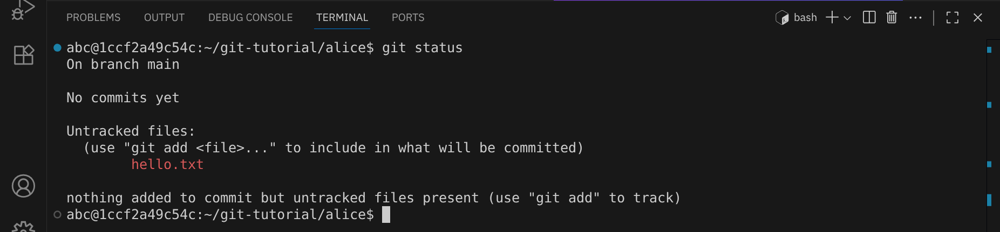

## Die Staging Area

Die Ausgabe von `git status` zeigt, dass die Datei `hello.txt` als »untracked« (nicht verfolgt) markiert ist. Das bedeutet, dass Git diese Datei noch nicht in die Versionskontrolle aufgenommen hat. Bei Git werden Änderungen nicht direkt zum Repository hinzugefügt, sondern zunächst in eine sogenannten »Staging Area« (auch »Index« genannt) kopiert. Verwende den Befehl `git add`, um die Datei zur Staging Area hinzuzufügen:

```bash
git add hello.txt
```

<div class='hint books'>
Durch <code>git add</code> sagen wir Git explizit, dass wir die Datei <code>hello.txt</code> in die nächste Commit-Änderung aufnehmen möchten. Dies gibt uns die Möglichkeit, Änderungen selektiv zu committen, anstatt alle Änderungen auf einmal zu übernehmen.
</div>

Überprüfe den Status erneut mit `git status`:

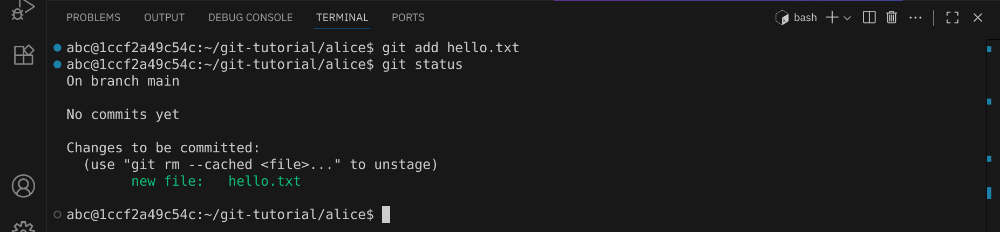

Die Ausgabe zeigt jetzt, dass die Datei `hello.txt` in der Staging Area bereitsteht, um committet zu werden.

## Einen Commit erstellen

Um die Änderungen dauerhaft im Repository zu speichern, verwende den Befehl `git commit`. Füge die Option `-m` hinzu, um eine Commit-Nachricht anzugeben, die beschreibt, was du geändert hast (falls du die Nachricht weglässt, öffnet Git einen Texteditor, in dem du die Nachricht eingeben kannst):

```bash
git commit -m "initial commit"
```

Die Ausgabe zeigt, dass ein neuer Commit erstellt wurde:

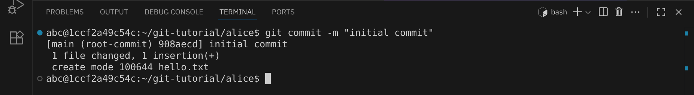

Im `.git`-Verzeichnis ist jetzt ein [gerichteter, azyklischer Graph (DAG)](https://en.wikipedia.org/wiki/Directed_acyclic_graph) entstanden, der mehrere Knoten enthält, wobei jeder Knoten durch eine eindeutige SHA-1-Hash-ID identifiziert wird. Diese Knoten repräsentieren die verschiedenen Objekte in Git: Blobs, Trees und Commits.

_include_svg(graph0.svg)

- **Blob**: Der Blob-Knoten mit der SHA1-ID `af5626b` repräsentiert den Inhalt »Hello, world!« (der Dateiname spielt dabei noch keine Rolle).
- **Tree**: Der Tree-Knoten mit der SHA1-ID `ec947e3` repräsentiert ein Verzeichnis, das die Datei `hello.txt` enthält, deren Inhalt durch den Blob `af5626b` repräsentiert wird.
- **Commit**: Der Commit-Knoten repräsentiert einen Snapshot des Repositories zu einem bestimmten Zeitpunkt. Er verweist auf den Tree `ec947e3`, der den Zustand des Verzeichnisses zum Zeitpunkt des Commits beschreibt. Der Commit enthält auch Metadaten wie den Autor, das Datum und die Commit-Nachricht.

Zusätzlich gibt es noch zwei Zeiger:

- **main**: Der Zeiger `main` zeigt auf den neuesten Commit im `main`-Branch.
- **HEAD**: Der Zeiger `HEAD` zeigt auf den aktuellen Branch (`main` in diesem Fall). Der daraus resultierende Commit ist der aktuelle Zustand des Repositories, also die Dateien, die sich gerade im Arbeitsverzeichnis befinden.

Die Ausgabe von `git status` zeigt außerdem an, dass wir keine lokalen Änderungen haben, die noch nicht committet wurden und unser Arbeitsverzeichnis »sauber« ist:

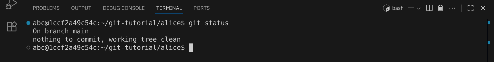

## Dateien umbenennen

Benenne die Datei `hello.txt` in `README.md` um, indem du den Befehl `git mv` verwendest:

```bash
git mv hello.txt README.md
```

<div class='hint info'>
Normalerweise kannst du Dateien mit dem Befehl <code>mv</code> umbenennen. Da die Datei <code>readme.txt</code> jedoch unter der Versionskontrolle von Git steht, solltest du den Befehl <code>git mv</code> verwenden. Dadurch wird Git darüber informiert, dass die Datei umbenannt wurde, und die Änderung wird automatisch zur Staging Area hinzugefügt.
</div>

Erzeuge anschließend einen neuen Commit:

```bash
git commit -m "rename hello.txt to README.md"
```

Die Ausgabe zeigt, dass ein neuer Commit erstellt wurde:

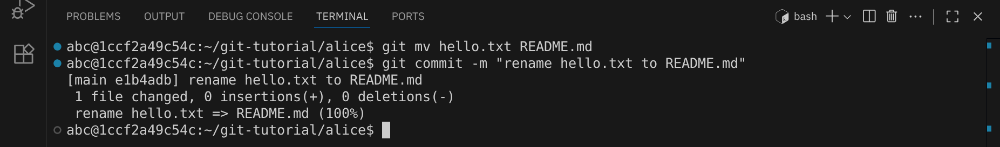

Der Git-Objektgraph sieht jetzt folgendermaßen aus:

_include_svg(graph1.svg)

Wie du siehst, sind die alten Objekte (Blob `af5626b` und Tree `ec947e3`) weiterhin vorhanden, da Git die gesamte Versionsgeschichte beibehält. Da die Datei jetzt einen neuen Namen hat, wurde ein neuer Tree-Knoten `ebfd749` erstellt, der die Datei `README.md` enthält, die auf den gleichen Blob `af5626b` verweist. Da sich der Inhalt der Datei nicht geändert hat, bleibt der Blob unverändert. Zusätzlich wurde ein neuer Commit-Knoten erstellt, der auf den neuen Tree `ebfd749` verweist und den vorherigen Commit als Vorgänger hat.

## Dateien ändern

Öffne jetzt das Verzeichnis `/workspace/git-tutorial/alice` in VS Code, indem du <span class='key'>Strg</span><span class='key'>K</span> und dann <span class='key'>Strg</span><span class='key'>O</span> drückst:

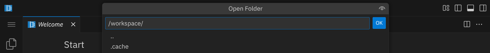

Wähle das Verzeichnis `/workspace/git-tutorial/alice` aus und klicke auf »OK«:

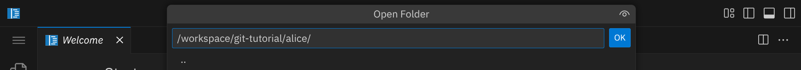

Öffne die Datei `README.md` und ändere `world` zu `planet` und füge eine neue Zeile hinzu:

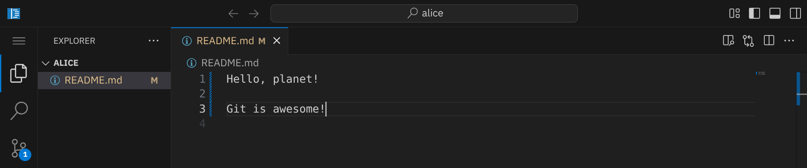

Speichere die Datei mit <span class='key'>Strg</span><span class='key'>S</span> und überprüfe den Status mit `git status` im Terminal:

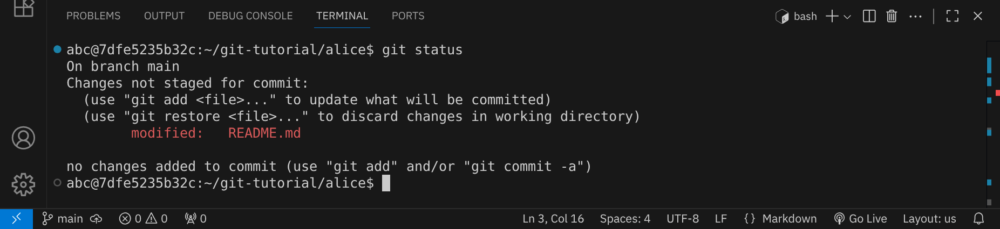

Überprüfe vor jedem Commit, welche Änderungen du vorgenommen hast, indem du den Befehl `git diff` ausführst:

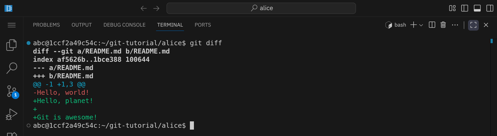

Du siehst jetzt die aktuellen Änderungen in deinem Arbeitsverzeichnis. Rote Zeilen (`–`) zeigen entfernte Zeilen an, während grüne Zeilen (`+`) hinzugefügte Zeilen darstellen.

Wenn du einen Commit erstellen möchtest, der alle Änderungen in deinem Arbeitsverzeichnis umfasst, kannst du den Befehl `git commit` mit der Option `-a` verwenden. Diese Option fügt automatisch alle geänderten und gelöschten Dateien zur Staging Area hinzu, bevor der Commit erstellt wird (du sparst dir so `git add`). Führe den folgenden Befehl aus, um die Änderungen zu committen:

```bash
git commit -a -m "updated README.md"
```

Der Git-Objektgraph sieht jetzt folgendermaßen aus:

_include_svg(graph2.svg)

Wie du sehen kannst, zeigen der `main`-Branch und `HEAD` jetzt auf den neuesten Commit, der die Datei `README.md` mit dem aktualisierten Inhalt enthält. Da der Inhalt verändert wurde, musste ein neuer Blob angelegt werden. Die alten Knoten bleiben weiterhin im Graphen erhalten.

## Zeitreise

Lass uns jetzt zu einem früheren Commit zurückkehren. Verwende den Befehl `git log`, um die Commit-Historie anzuzeigen:

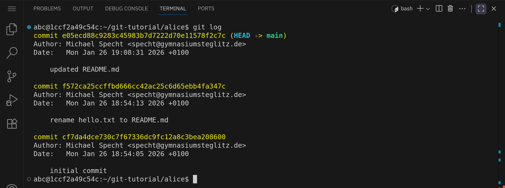

Du siehst eine Liste der Commits, beginnend mit dem neuesten Commit. Du siehst außerdem, dass der `main`-Branch auf den neuesten Commit zeigt und gerade ausgecheckt ist, da auch `HEAD` auf diesen Commit zeigt.

<div class='hint info'>
Was heißt »ausgecheckt«? In Git bedeutet »auschecken«, dass du den Zustand des Repositories zu einem bestimmten Commit wiederherstellst. Wenn du einen Commit auscheckst, ändert Git die Dateien in deinem Arbeitsverzeichnis so, dass sie dem Zustand entsprechen, der in diesem Commit gespeichert ist. Standardmäßig zeigt <code>HEAD</code> auf den neuesten Commit im aktuellen Branch. Wenn du jedoch einen älteren Commit auscheckst, verschiebst du <code>HEAD</code> auf diesen älteren Commit, und dein Arbeitsverzeichnis wird entsprechend aktualisiert.
</div>

Wir checken nun eine frühere Version des Repositories aus, nämlich die Version `HEAD~2`, also zwei Commits vor dem aktuellen `HEAD`:

```bash
git checkout HEAD~2
```

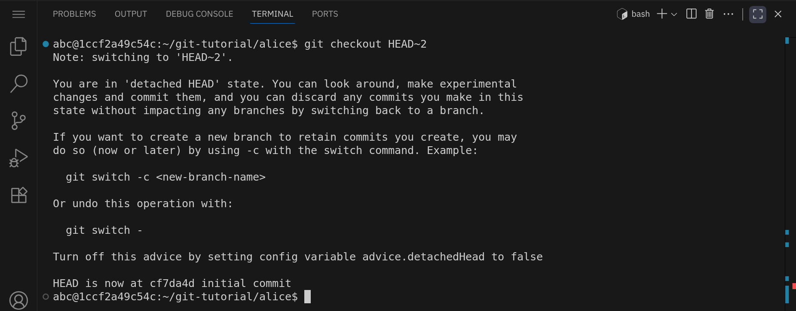

<div class='hint danger'>
Nachdem du einen älteren Commit ausgecheckt hast, befindest du dich in einem sogenannten »detached HEAD«-Zustand. In diesem Zustand zeigt <code>HEAD</code> nicht auf einen Branch, sondern direkt auf einen bestimmten Commit. Das heißt, dass es momentan keinen Branch gibt, der auf diesen Commit zeigt. Änderungen, die du in diesem Zustand vornimmst, werden daher auch nicht automatisch einem Branch zugeordnet. Wenn du später zu einem Branch zurückkehrst, gehen diese Änderungen verloren, sofern du sie nicht vorher in einem neuen Branch speicherst oder du dir die Commit-ID notierst.
</div>

Du siehst auch, dass die Datei `README.md` jetzt wieder `hello.txt` heißt und den ursprünglichen Inhalt »Hello, world!« hat:

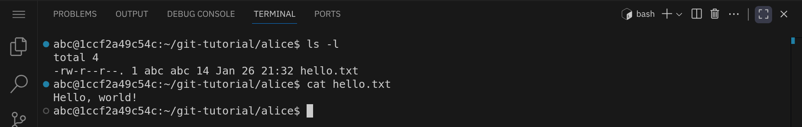

Der Git-Objektgraph sieht jetzt folgendermaßen aus:

_include_svg(graph3.svg)

Du kannst sehen, dass der `main`-Branch unverändert bleibt und weiterhin auf den neuesten Commit zeigt. Allerdings zeigt `HEAD` jetzt auf den älteren Commit, den wir ausgecheckt haben (weshalb wir jetzt wieder den ursprünglichen Inhalt des Repositories sehen).

Um wieder zum `main`-Branch zurückzukehren, kannst du den Befehl `git checkout main` verwenden:

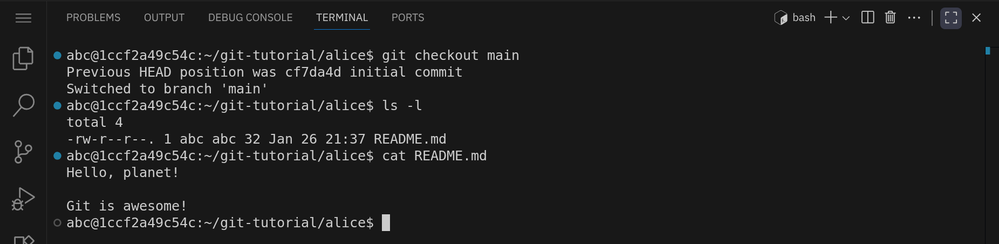

Damit sind wir wieder im neuesten Zustand des Repositories. Der Git-Objektgraph sieht jetzt wieder folgendermaßen aus:

_include_svg(graph4.svg)

## Branch & Merge

Kennst du die Situation, in der du eine neue Funktion zu deinem Projekt hinzufügen möchtest, aber nicht sicher bist, ob sie funktioniert? Mit Git kannst du einen neuen Branch erstellen, um an dieser Funktion zu arbeiten, ohne den Haupt-Branch zu beeinflussen. Wenn die Funktion fertig ist und gut funktioniert, kannst du sie wieder in den Haupt-Branch zusammenführen (mergen). Anderenfalls kannst du den Branch einfach löschen, ohne dass dein Haupt-Branch davon betroffen ist.

Wir erstellen jetzt einen neuen Branch namens `feature` und wechseln zu diesem Branch:

```bash
git branch feature
git checkout feature
```

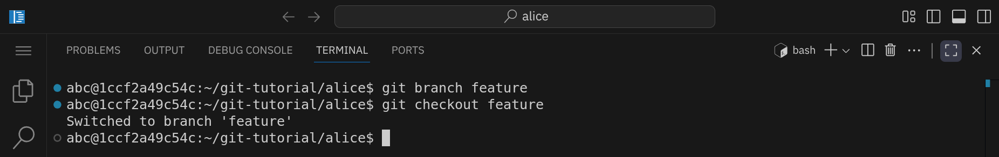

Der Git-Objektgraph sieht jetzt folgendermaßen aus:

_include_svg(graph5.svg)

Es ist also alles wie zuvor, nur dass `HEAD` jetzt auf den neuen Branch `feature` zeigt. Erstelle eine neue Datei namens `hello.c` mit folgendem Inhalt:

_include_file(hello.c, c)

Compiliere die Datei, um ein ausführbares Programm zu erhalten:

```bash
gcc -o hello hello.c
```

…und führe das Programm anschließend aus:

```bash
./hello
```

Du solltest die Meldung `Hello, World!` im Terminal sehen:


Überprüfe den Status mit `git status`:

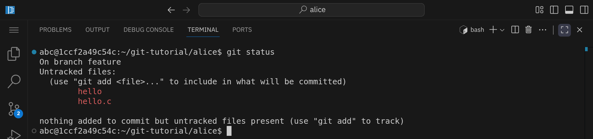

Es sind zwei neue Dateien vorhanden: `hello.c` und `hello` (die ausführbare Datei). Wir möchten nur die Quellcodedatei `hello.c` zur Versionskontrolle hinzufügen, nicht jedoch die ausführbare Datei `hello`.

<div class='hint warning'>
Es gibt bestimmte Arten von Dateien, die nicht in ein Git-Repository aufgenommen werden sollten, wie z.B. ausführbare Dateien, temporäre Dateien oder sensible Informationen wie Zugangsdaten oder API-Schlüssel. Um zu verhindern, dass solche Dateien versehentlich hinzugefügt werden, kannst du eine Datei namens <code>.gitignore</code> erstellen. In dieser Datei kannst du Muster definieren, die Git anweisen, bestimmte Dateien oder Verzeichnisse zu ignorieren. Und genau das machen wir jetzt.
</div>

Erstelle eine Datei namens `.gitignore` mit folgendem Inhalt:

```c
hello
```

<div class='hint info'>
Du kannst auch Platzhalter verwenden, um mehrere Dateien oder Verzeichnisse zu ignorieren. Zum Beispiel ignoriert <code>*.log</code> alle Dateien mit der Endung <code>.log</code>, und <code>temp/</code> ignoriert das gesamte Verzeichnis <code>temp</code>.
</div>

Speichere die Datei und überprüfe den Status erneut mit `git status`:

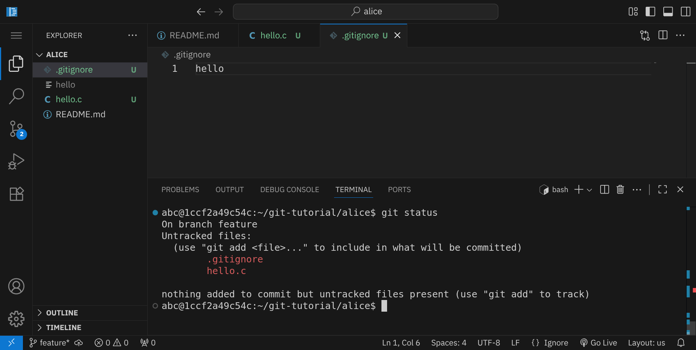

Jetzt wird nur noch die Datei `hello.c` als untracked angezeigt, während die ausführbare Datei `hello` ignoriert wird. Aber auch die Datei `.gitignore` selbst ist noch nicht zur Versionskontrolle hinzugefügt worden, was wir unbedingt nachholen sollten. Füge beide Dateien zur Staging Area hinzu:

```bash
git add .gitignore hello.c
```

Erstelle anschließend einen neuen Commit:

```bash
git commit -m "added hello.c"
```

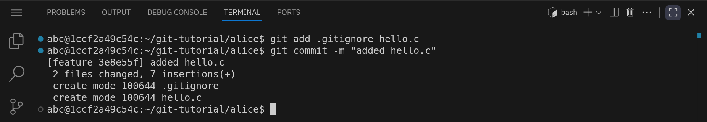

Der Git-Objektgraph sieht jetzt folgendermaßen aus:

_include_svg(graph6.svg)

Wie du sehen kannst, zeigt der `feature`-Branch jetzt auf den neuesten Commit, der die Dateien `hello.c` und `.gitignore` enthält. Der `main`-Branch bleibt unverändert und zeigt weiterhin auf den vorherigen Commit.

Wir können uns anzeigen lassen, welche Branches es gibt und auf welchen Commit sie zeigen, indem wir den Befehl `git branch` ausführen:

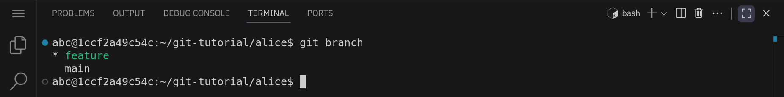

Wie du siehst, gibt es momentan zwei Branches: `main` und `feature`. Der Stern (*) zeigt an, dass wir uns gerade im `feature`-Branch befinden.

Wir wechseln jetzt zurück zum `main`-Branch:

```bash
git checkout main
```

Dort passen wir – unabhängig vom `feature`-Branch – die Datei `README.md` an und fügen einen Smiley hinzu:

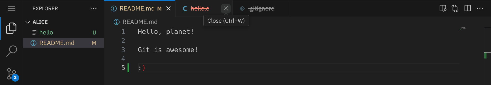

<div class='hint info'>
Wie du in der oberen Leiste sehen kannst, sind die Dateien <code>hello.c</code> und <code>.gitignore</code>, die gerade noch geöffnet waren, jetzt nicht mehr im Arbeitsverzeichnis vorhanden. Das liegt daran, dass wir zu einem anderen Branch gewechselt haben, in dem diese Dateien nicht existieren. Git passt das Arbeitsverzeichnis automatisch an den Zustand des ausgecheckten Branches an.
</div>

Es ist eine gute Angewohnheit, vor dem Committen die Änderungen mit `git diff` zu überprüfen:


Wir erstellen jetzt einen neuen Commit:

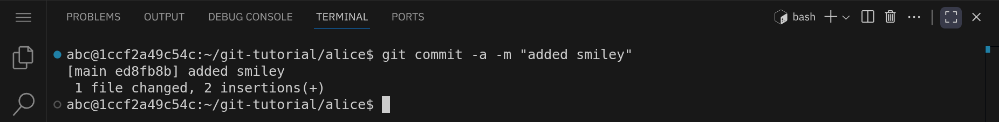

Der Git-Objektgraph sieht jetzt folgendermaßen aus:

_include_svg(graph7.svg)

<div class='hint info'>
Wir haben jetzt an beiden Branches unabhängig voneinander Änderungen vorgenommen. Der <code>main</code>-Branch enthält den neuesten Commit mit der aktualisierten <code>README.md</code>-Datei, während der <code>feature</code>-Branch den neuesten Commit mit der <code>hello.c</code>-Datei enthält.
</div>

Wir könnten uns jetzt dazu entscheiden, die Änderungen aus dem `feature`-Branch zu verwerfen, indem wir den Branch einfach löschen. In diesem Fall würden die Änderungen an der Datei `hello.c` verloren gehen, da sie nur im `feature`-Branch existieren.

Wir möchten die Änderungen aus dem `feature`-Branch jedoch in den `main`-Branch übernehmen. Dazu verwenden wir den Befehl `git merge`, während wir uns im `main`-Branch befinden:

```bash
git merge feature
```

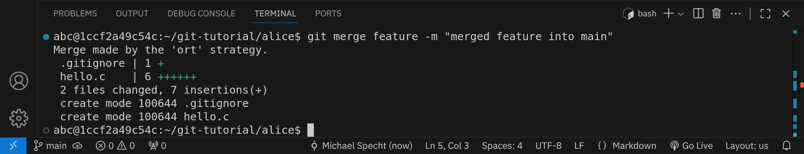

<div class='hint warning'>
Beim Mergen ist es wichtig, dass du dich im Ziel-Branch befindest, also in dem Branch, in den du die Änderungen übernehmen möchtest. In diesem Fall möchten wir die Änderungen aus dem <code>feature</code>-Branch in den <code>main</code>-Branch übernehmen, also müssen wir uns zuerst im <code>main</code>-Branch befinden, bevor wir den Merge-Befehl ausführen.
</div>

Der Git-Objektgraph sieht jetzt folgendermaßen aus:

_include_svg(graph8.svg)

Wie du sehen kannst, wurde ein neuer Merge-Commit erstellt, der zwei Vorgänger hat: den vormals neuesten Commit im `main`-Branch und den neuesten Commit im `feature`-Branch. Der Merge-Commit kombiniert die Änderungen aus beiden Branches.

Der `main`-Branch zeigt jetzt auf das aktuelle, vollständige Projekt und wir können den Feature-Branch löschen, da wir ihn nicht mehr benötigen:

```bash
git branch -d feature
```

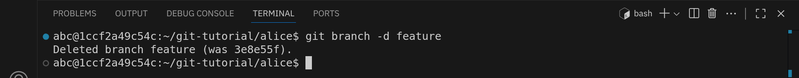

Der Git-Objektgraph sieht jetzt folgendermaßen aus:

_include_svg(graph9.svg)

Obwohl es nun keinen `feature`-Branch mehr gibt, sieht man immer noch Spuren davon im Graphen, da es Verzweigungen und Zusammenführungen in der Versionsgeschichte gibt. Der Vorteil des Feature-Branches war, dass wir isoliert an einer neuen Funktion arbeiten konnten, ohne den Haupt-Branch zu beeinflussen. Nachdem die Funktion fertig war, konnten wir sie problemlos in den Haupt-Branch integrieren.

<div class='hint books'>
Wenn es dir wichtig ist, dass dein <code>main</code>-Branch stabil bleibt, solltest du den <code>feature</code>-Branch nicht ungeprüft in den <code>main</code>-Branch mergen. Hole vorher alle Änderungen aus dem <code>main</code>-Branch in deinen <code>feature</code>-Branch, teste alles gründlich und führe erst dann den Merge durch.
</div>

## Etwas Luxus im Terminal

Um die Arbeit im Terminal etwas zu vereinfachen, können wir zwei Dinge tun:

1. Bash-Completion für Git aktivieren
2. Einen Git-Prompt einrichten

Um den Git-Prompt zu installieren, klone das Repository `bash-git-prompt` in dein Home-Verzeichnis:

```bash
git clone https://github.com/magicmonty/bash-git-prompt.git ~/.bash-git-prompt --depth=1
```

Öffne anschließend die Datei `/workspace/.bashrc` in VS Code und füge am Ende der Datei folgende Zeilen hinzu:

```bash
# enable Bash completion for Git
source /usr/share/bash-completion/completions/git

# enable Git prompt
if [ -f "$HOME/.bash-git-prompt/gitprompt.sh" ]; then
    GIT_PROMPT_ONLY_IN_REPO=1
    GIT_PROMPT_VIRTUALENV=""
    source "$HOME/.bash-git-prompt/gitprompt.sh"
fi
```

Speichere die Datei und lade die Änderungen mit folgendem Befehl neu:

```bash
source ~/.bashrc
```

Jetzt hast du einen speziellen Git-Prompt, wenn du in einem Git-Repository arbeitest. Dieser Prompt zeigt dir immer den aktuellen Branch und den Status des Repositories an:

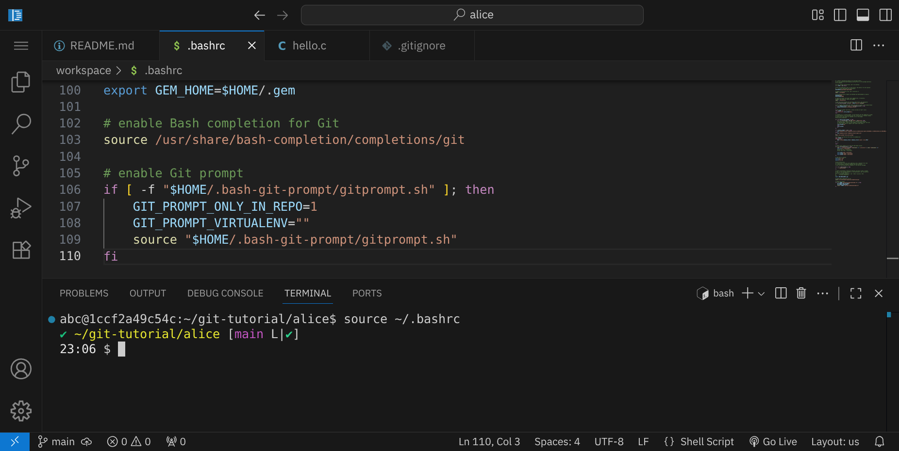

## Git Remotes

In einem echten Projekt arbeitest du wahrscheinlich nicht alleine, sondern im Team. Damit mehrere Personen an demselben Repository arbeiten können, verwenden wir sogenannte »Remotes«. Ein Remote ist eine Kopie deines Repositories, die an einer anderen Stelle – also normalerweise auf einem anderen Computer oder Server – gespeichert ist.

In diesem Tutorial werden wir jedoch anstelle eines Servers einfach ein lokales Verzeichnis verwenden, um das Konzept der Remotes zu demonstrieren – die Handhabung ist in beiden Fällen identisch.

Zuerst legen wir ein neues Verzeichnis namens `remote-repo` an, das unser Remote-Repository darstellen soll:

```bash
cd ~/git-tutorial
mkdir remote-repo
cd remote-repo
```

In diesem Verzeichnis initialisieren wir ein neues, leeres Git-Repository:

```bash
git init --bare
```

Im Terminal sollte jetzt Folgendes zu sehen sein:

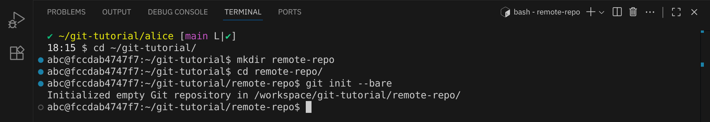

<div class='hint info'>
Ein »bare«-Repository ist ein spezieller Typ von Git-Repository, das kein Arbeitsverzeichnis enthält. Es wird hauptsächlich als zentrales Repository verwendet, auf das mehrere Entwickler zugreifen können, um ihre Änderungen zu pushen und zu pullen. In einem bare-Repository gibt es keine ausgecheckten Dateien, sondern nur die Git-Objekte und Metadaten.
</div>

Mit dem Befehl `ls -l` kannst du sehen, dass in diesem Verzeichnis die üblichen Git-Ordner und -Dateien vorhanden sind, die sonst im <code>.git</code>-Verzeichnis eines normalen Repositories zu finden sind:

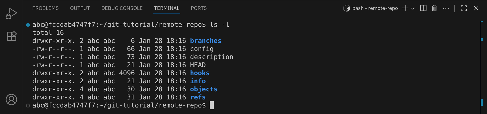

Wir wechseln jetzt zurück in das Verzeichnis von Alice, um unser Remote-Repository zu verknüpfen:

```bash
cd ~/git-tutorial/alice
git remote add origin ../remote-repo
```

Der Befehl bewirkt nur, dass das Remote-Repository verknüpft wird, es gibt keine Ausgabe im Terminal. Ein Blick in die Datei `.git/config` zeigt jedoch, dass das Remote-Repository jetzt konfiguriert ist:

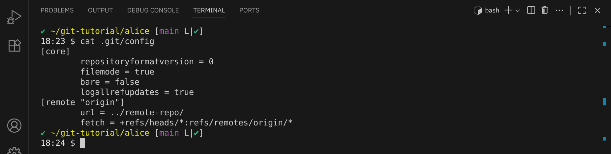


<div class='hint info'>
Der Befehl <code>git remote add</code> fügt ein neues Remote-Repository hinzu. In diesem Fall nennen wir das Remote <code>origin</code>, was der Standardname für das Haupt-Remote ist (wir könnten aber auch jeden anderen Namen wählen). Der Pfad <code>../remote-repo</code> gibt den Speicherort des Remote-Repositories an. In einem echten Szenario würde hier normalerweise eine URL zu einem entfernten Server stehen, die z. B. mit <code>https://</code> oder <code>git://</code> beginnt.
</div>

Jetzt können wir unsere Änderungen an das Remote-Repository pushen. Verwende den folgenden Befehl, um den `main`-Branch zum ersten Mal zu pushen:

```bash
git push -u origin main
```

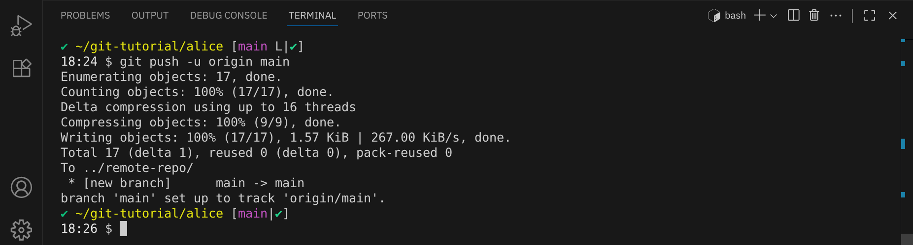

Die Option `-u` (oder `--set-upstream`) richtet eine Tracking-Verbindung zwischen dem lokalen `main`-Branch und dem Remote-Branch `origin/main` ein. Dadurch kannst du in Zukunft einfach `git push` oder `git pull` ausführen, ohne den Remote-Namen und den Branch-Namen angeben zu müssen (ansonsten müsstest du immer `git push origin main` schreiben).

## Git clone

Um zu demonstrieren, wie mehrere Personen an demselben Repository arbeiten können, erstellen wir jetzt ein neues Verzeichnis für eine fiktive Person namens Bob:

```bash
cd ~/git-tutorial
mkdir bob
cd bob
```

Bob kann jetzt das Remote-Repository klonen, das wir zuvor erstellt haben:

```bash
git clone ../remote-repo
```

Das Repository wird in ein neues Verzeichnis namens `remote-repo` geklont. Wechsle in dieses Verzeichnis:

```bash
cd remote-repo
```

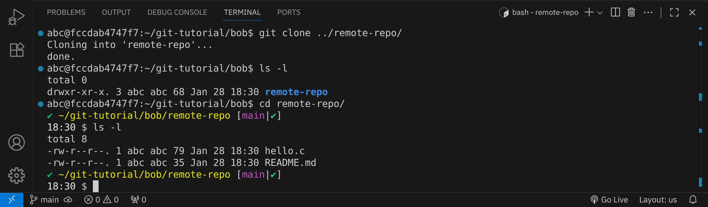

Bob hat jetzt eine vollständige Kopie des Repositories, einschließlich der gesamten Versionsgeschichte. Öffne die Datei `README.md` mit dem Editor `nano`, um sie zu bearbeiten:

```bash
nano README.md
```

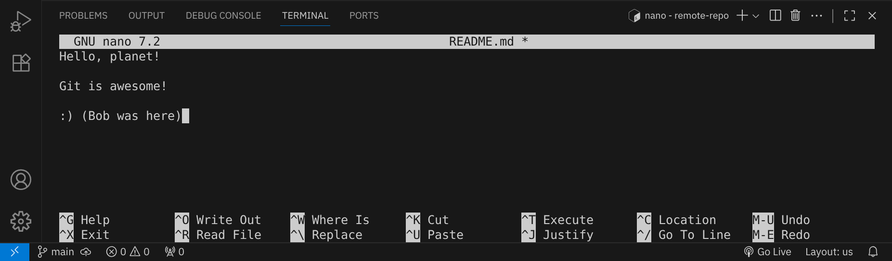

Speichere die Datei mit <span class='key'>Strg</span><span class='key'>O</span> und <span class='key'>Enter</span> und schließe den Editor mit <span class='key'>Strg</span><span class='key'>X</span>. Mit `git diff` kann Bob seine Änderungen überprüfen:

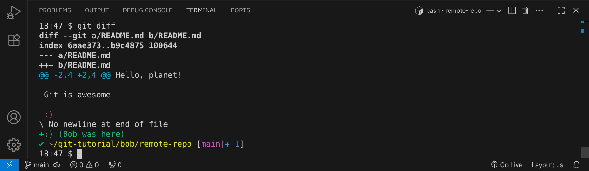

Wir haben nun drei Möglichkeiten, wie Bob seine Änderungen committen kann:

1. `git add README.md` und `git commit -m "Bob was here"`
2. `git commit -a -m "Bob was here"`
3. `git commit -a` – bei dieser Variante öffnet sich ein Texteditor, in dem Bob seine Commit-Nachricht eingeben kann.

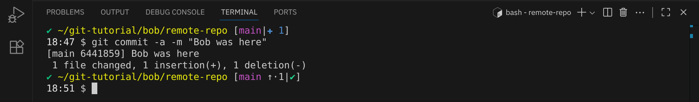

<div class='hint info'>
Achtung: Die Änderungen liegen immer noch komplett bei Bob lokal vor. Der Objektgraph in Bobs Repository ist gewachsen, aber das Remote-Repository hat davon noch nichts mitbekommen.
</div>

Um die Änderungen an das Remote-Repository zu senden, verwendet Bob den Befehl `git push`:

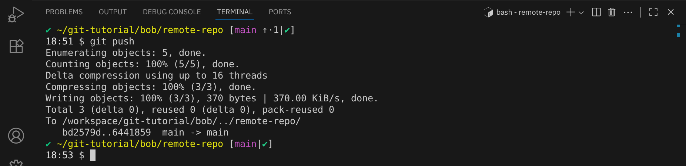

Wechsle nun wieder in das Verzeichnis von Alice:

```bash
cd ~/git-tutorial/alice
```

Mit dem Befehl `git pull` kann Alice die Änderungen von Bob in ihr lokales Repository holen und mit ihrem aktuellen Stand zusammenführen:

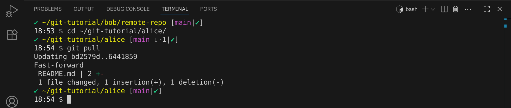

Alice sieht, dass die Datei `README.md` aktualisiert wurde und jetzt auch Bobs Änderung enthält:

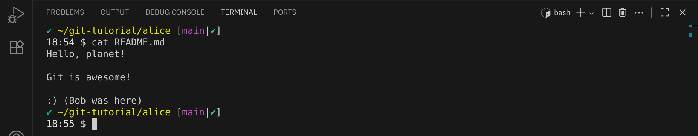

## Merge-Konflikte

Wenn Alice und Bob gleichzeitig an derselben Datei arbeiten und ihre Änderungen nicht kompatibel sind, entsteht ein Merge-Konflikt. Um dies zu demonstrieren, ändern wir die Datei `README.md` sowohl bei Alice als auch bei Bob.

Alice ändert die Datei `README.md`:

```bash
echo "HEYYYY" >> README.md
```

<div class='hint warning'>
Vorhin haben wir <code>&gt;</code> verwendet, um eine Ausgabe in eine Datei umzuleiten. Das <code>&gt;&gt;</code> fügt die Ausgabe am Ende der Datei hinzu, anstatt den Inhalt zu überschreiben. Achte also darauf, dass du <code>&gt;&gt;</code> verwendest, um die Zeile hinzuzufügen, ohne den bestehenden Inhalt zu löschen.
</div>

Überprüfe die Änderungen mit `cat` und `git diff`:

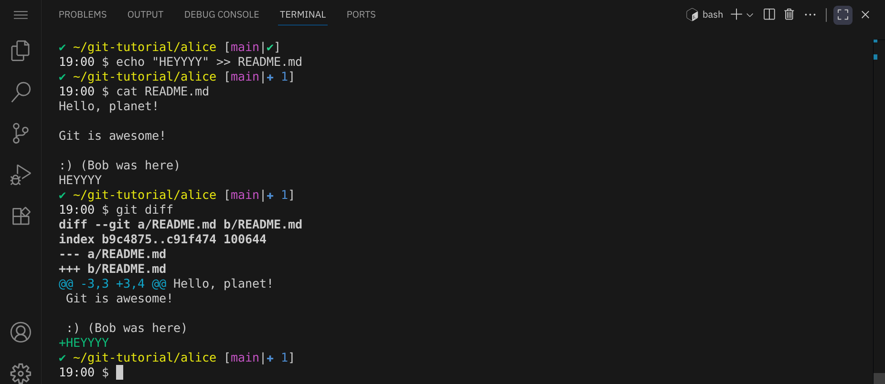

Alice committet ihre Änderungen und pusht sie zum Remote-Repository:

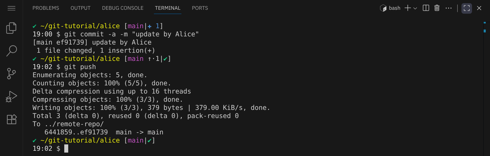

Wechsle jetzt in Bobs Verzeichnis:

```bash
cd ~/git-tutorial/bob/remote-repo
```

Bob ändert ebenfalls die Datei `README.md`:

```bash
echo "HOLAAA" >> README.md
```

Er überprüft seine Änderungen mit `git diff` und committet sie:

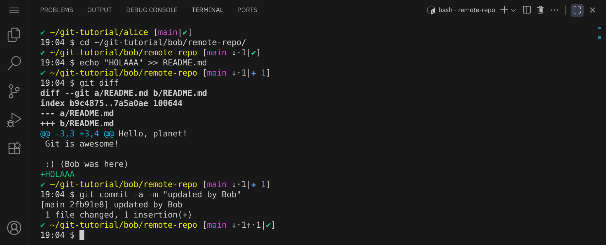

Wenn Bob jetzt versucht, seine Änderungen zu pushen, erhält er eine Fehlermeldung, da Alice bereits Änderungen gepusht hat, die Bob noch nicht in seinem lokalen Repository hat:

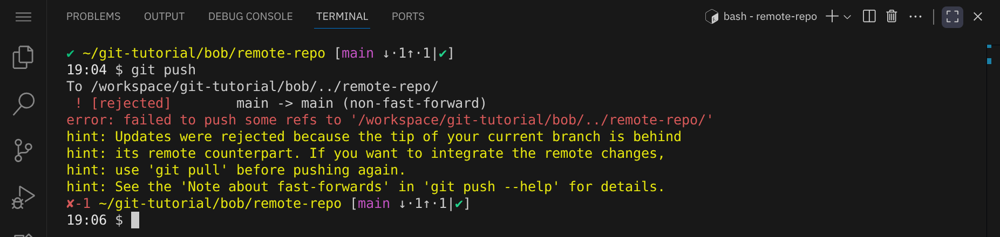

Um die Änderungen von Alice zu holen und mit seinen eigenen zusammenzuführen, führt Bob den Befehl `git pull` aus:

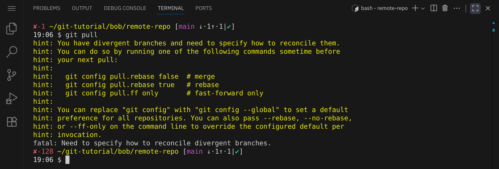

Auch hier erhält Bob eine Fehlermeldung, die besagt, dass es einen Merge-Konflikt gibt, da divergente Branches existieren, also Alice und Bob gleichzeitig an derselben Datei gearbeitet haben. Für die Konfliktbehebung gibt es verschiedene Möglichkeiten, von denen wir jetzt eine Default-Strategie für unser lokales Repository wählen sollen. Die Möglichkeiten sind:

1. `git config pull.rebase false` – Standard-Merge-Strategie
2. `git config pull.rebase true` – Rebase-Strategie
3. `git config pull.ff only` – Nur Fast-Forward-Merges

<div class='hint info'>
Welche Strategie du wählst, hängt von deinem Workflow und deinen Präferenzen ab. Die Standard-Merge-Strategie ist einfach zu verstehen und zu verwenden, während die Rebase-Strategie eine sauberere Historie erzeugt. Die Fast-Forward-Strategie ist nützlich, wenn du eine lineare Historie bevorzugst und keine Merge-Commits erstellen möchtest.
</div>

Bob entscheidet sich für die Standard-Merge-Strategie und führt die folgenden Befehle aus:

```bash
git config pull.rebase false
git pull
```

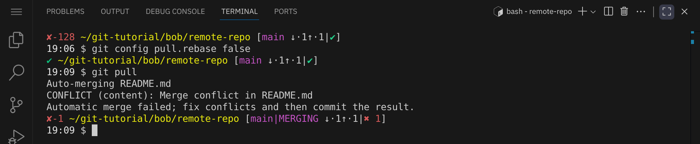

Wir sehen, dass Git den Merge-Konflikt in der Datei `README.md` markiert hat. Bob muss die Datei jetzt manuell bearbeiten, um den Konflikt zu lösen. Öffne die Datei `README.md` in einem Texteditor (`nano README.md`):

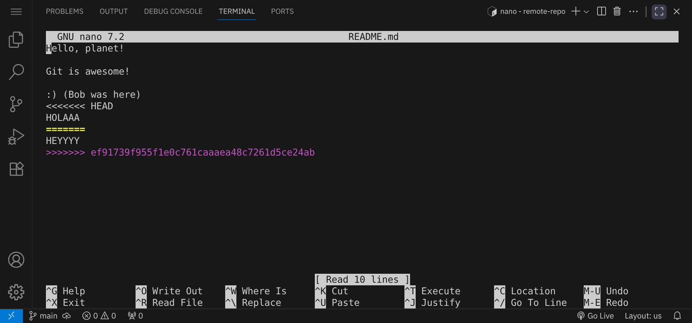

Hier siehst du die Konfliktmarkierungen:

```c
<<<<<<< HEAD
HOLAAA
=======
HEYYYY
>>>>>>> ef91739f955f1e0c761caaaea48c7261d5ce24ab
```

Die Markierungen `<<<<<<<`, `=======` und `>>>>>>>` zeigen die Bereiche an, in denen der Konflikt aufgetreten ist. Der obere Abschnitt enthält Bobs lokale Änderungen, während der untere Abschnitt die Änderungen des Remote-Repository (also Alices Änderungen) enthält.

Bob muss sich jetzt entscheiden, wie er den Konflikt lösen möchte. Er könnte zum Beispiel beide Änderungen manuell zusammenführen:

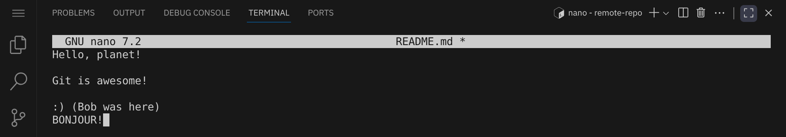

Speichere die Datei und beende den Editor. Bob muss den Konflikt nun als gelöst markieren, indem er die Datei mit `git add` zur Staging Area hinzufügt. Anschließend kann er den Merge-Commit, der durch den Pull-Vorgang erstellt wurde und zunächst aufgrund des Konflikts unvollständig war, abschließen und danach seine Änderungen pushen:

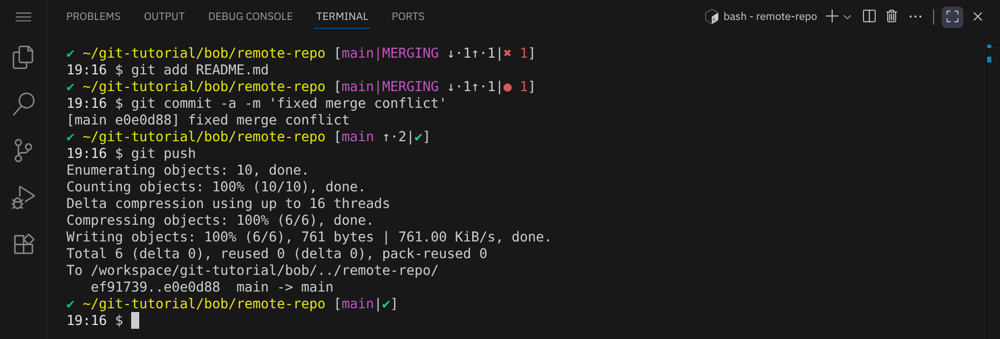

Alice hat von dem Merge-Konflikt nichts mitbekommen, da Bob den Konflikt lokal gelöst hat, bevor er seine Änderungen gepusht hat. Wenn Alice jetzt ihre Änderungen mit `git pull` holt, erhält sie die von Bob aktualisierte Datei `README.md`.

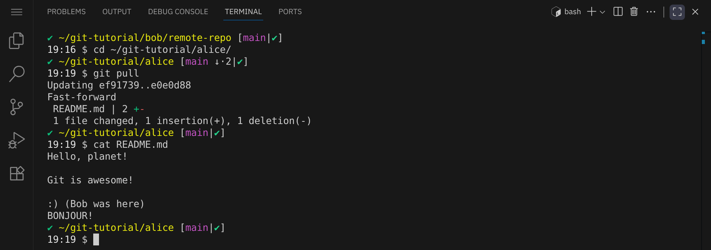

## Tags

Tags sind eine Möglichkeit, bestimmte Punkte in der Versionsgeschichte zu markieren, z.B. für Releases oder wichtige Meilensteine. Wir erstellen jetzt einen Tag namens `v1.0` für den aktuellen Commit im `main`-Branch:

```bash
git tag v1.0 -m "v1.0 release"
```

So können wir später leicht zu diesem Punkt in der Geschichte zurückkehren, wenn wir z.B. ein Release erstellen möchten. Um Tags zu pushen, verwenden wir den Befehl `git push` mit dem Tag-Namen:

```bash
git push origin v1.0
```

…oder um alle Tags auf einmal zu pushen:

```bash
git push origin --tags
```

## Git checkout

Um zu einem bestimmten Branch oder Tag zurückzukehren, verwenden wir den Befehl `git checkout`. Du kannst also z. B. folgende Befehle verwenden:

- `git checkout main` – wechselt zum `main`-Branch
- `git checkout v1.0` – wechselt zum Tag `v1.0`
- `git checkout HEAD~2` – wechselt zu dem Commit, der zwei Commits vor dem aktuellen `HEAD` liegt

<div class='hint warning'>
Beachte, dass das Auschecken eines Tags oder eines älteren Commits dazu führt,
dass du dich in einem »detached HEAD«-Zustand befindest. In diesem Zustand kannst du keine neuen Commits zu einem Branch hinzufügen, da <code>HEAD</code> nicht auf einen Branch zeigt. Wenn du Änderungen vornehmen möchtest, solltest du stattdessen von dieser Stelle aus einen neuen Branch erstellen.
</div>

## Fehler rückgängig machen

Manchmal möchtest du vielleicht Änderungen an Dateien rückgängig machen. Hierzu gibt es verschiedene Möglichkeiten:

### Wenn die Änderungen noch nicht gestaged sind

Um Änderungen an einer Datei rückgängig zu machen, die noch nicht zur Staging Area hinzugefügt wurden, kannst du den Befehl `git checkout -- <datei>` verwenden. Dies setzt die Datei auf den Zustand des letzten Commits zurück:

```bash
git restore README.md
```

### Wenn die Änderungen bereits gestaged sind

Um Änderungen rückgängig zu machen, die bereits zur Staging Area hinzugefügt wurden, kannst du den Befehl `git reset HEAD <datei>` verwenden. Dies entfernt die Datei aus der Staging Area, behält jedoch die Änderungen im Arbeitsverzeichnis bei:

```bash
git restore --staged README.md
```

### Wenn du einen Commit rückgängig machen möchtest

Um den letzten Commit rückgängig zu machen, kannst du den Befehl `git revert HEAD` verwenden. Dies erstellt einen neuen Commit, der die Änderungen des letzten Commits rückgängig macht:

```bash
git revert HEAD
```

<div class='hint warning'>
Denke daran, dass Knoten im Git-Objektgraphen niemals gelöscht werden. Selbst wenn du einen Commit rückgängig machst, bleibt der ursprüngliche Commit weiterhin in der Versionsgeschichte erhalten – es wird nur ein neuer Commit erstellt, der die Änderungen des ursprünglichen Commits aufhebt.
</div>

## Zusammenfassung

In diesem Tutorial haben wir die Grundlagen von Git kennengelernt, einschließlich der Erstellung eines Repositories, dem Hinzufügen und Committen von Dateien, dem Arbeiten mit Branches und Merges sowie dem Umgang mit Remotes. Wir haben auch gesehen, wie
man Merge-Konflikte löst und Tags verwendet. Mit diesem Wissen bist du nun in der Lage, Git effektiv für die Versionskontrolle deiner Projekte zu nutzen. Viel Erfolg bei deinen zukünftigen Projekten!
