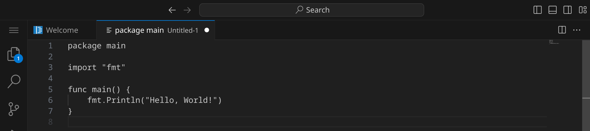
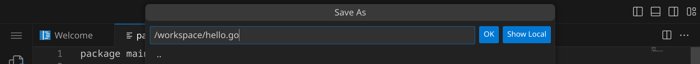
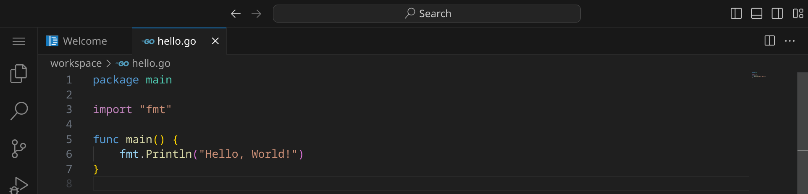
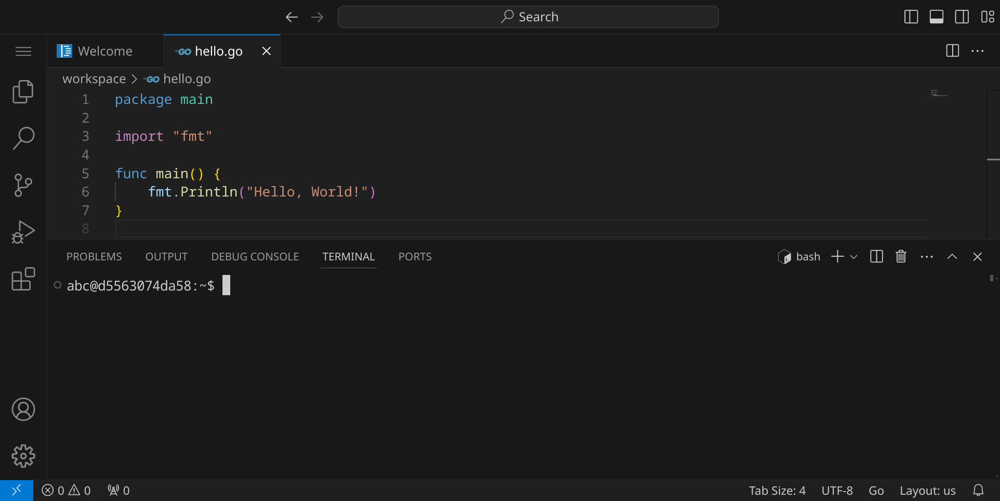
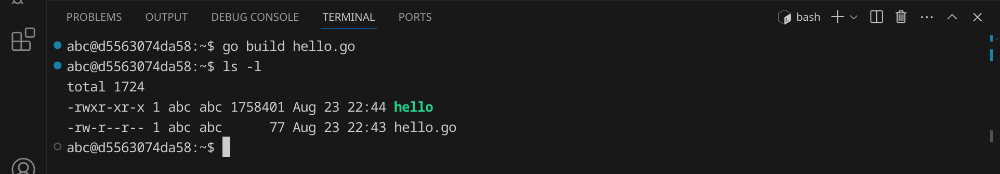
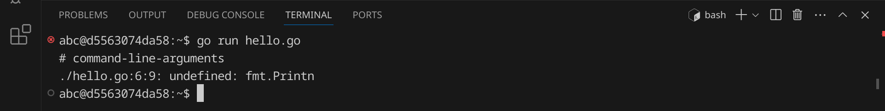
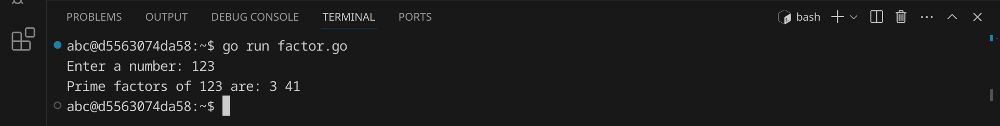
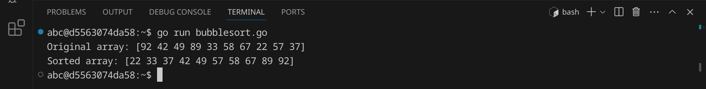

<div class='meta'>
image: go-logo.png
</div>

# Go <span style='font-size: 80%;'>(2009)</span>

<div class='floatright' style='width: 24em;'>
    
    <p>
        Robert Griesemer, Rob Pike, Ken Thompson
    </p>
</div>

<p class='abstract'>
Go, auch bekannt als Golang, wurde 2009 von Robert Griesemer, Rob Pike und Ken Thompson bei Google entwickelt. Die Programmiersprache wurde für die Entwicklung von Systemsoftware und Webanwendungen konzipiert und zeichnet sich durch ihre einfache Syntax, effiziente Kompilierung und integrierte Unterstützung für Nebenläufigkeit aus.
</p>

Bekannte Beispiele für Anwendungen, die in Go entwickelt wurden, sind Docker, Kubernetes und das Web-Framework Hugo. Heutzutage ist Go immer noch äußerst relevant, insbesondere in der Cloud- und Server-Backend-Entwicklung, da es eine hohe Leistung und Skalierbarkeit bietet und von einer aktiven Entwickler-Community unterstützt wird.

<!-- ## Eigenschaften

- **Kompiliert**: Go ist eine kompilierte Sprache, was bedeutet, dass der Code in
    Maschinencode übersetzt wird, der direkt auf der Hardware ausgeführt werden kann.
- **Effizienz**: Go wurde für die Effizienz entwickelt und bietet eine schnelle
    Kompilierung und Ausführung von Code.
- **Concurrency**: Go bietet integrierte Unterstützung für Nebenläufigkeit und
    Parallelität, was es ermöglicht, effiziente und skalierbare Programme zu schreiben.
- **Einfachheit**: Go legt Wert auf eine klare und einfache Syntax, die es
    ermöglicht, den Code leicht zu lesen und zu schreiben.
- **Webentwicklung**: Go wird häufig für die Entwicklung von Webanwendungen
    eingesetzt und bietet eine Vielzahl von Frameworks und Bibliotheken für die
    Webentwicklung.
- **Community**: Go hat eine aktive und engagierte Community, die eine Vielzahl von
    Bibliotheken und Frameworks entwickelt hat. -->

## Hello, world!

Go-Programme werden in Textdateien mit der Endung `.go` geschrieben. Diese Dateien werden anschließend von einem Compiler in ausführbare Dateien übersetzt, die auf deinem Computer direkt ausgeführt werden können.

Stelle zuerst sicher, dass du keinen Ordner geöffnet hast. Um sicherzugehen, drücke einfach den Shortcut für »Ordner schließen«: <span class='key'>Strg</span><span class='key'>K</span> und dann <span class='key'>F</span>. Dein Workspace sollte jetzt ungefähr so aussehen:


### Quelltext schreiben

Klicke auf »New File« und wähle als Dateityp »Text File«.


Schreibe nun den folgenden Code in die Datei:

_include_file(hello.go, go)

Da Visual Studio Code noch nicht weiß, dass es sich um C-Quelltext handelt, ist dein Programm momentan noch einfarbig, aber das wird sich gleich ändern. An dem weißen Punkt erkennst du, dass deine Änderungen noch nicht gespeichert sind.



Drücke nun <span class='key'>Strg</span><span class='key'>S</span>, um die Datei zu speichern. Gib `hello.go` ein – der vollständige Pfad zu deiner Datei lautet dann `/workspace/hello.go`.



Sobald du die Datei gespeichert hast, wird sie automatisch als C-Datei erkannt und die Syntax wird hervorgehoben.



### Kompilieren und ausführen

Bevor wir das Programm ausführen können, müssen wir es kompilieren. Dadurch wird der Quelltext in Maschinencode übersetzt, den dein Computer ausführen kann.

Öffne dazu ein Terminal, indem du entweder <span class='key'>Strg</span><span class='key'>J</span> drückst oder das Panel-Symbol  rechts oben drückst. Dein Fenster sollte jetzt ungefähr so aussehen:



Um das Programm zu kompilieren, gib folgenden Befehl ein:

```bash
go build hello.go
```

<div class='hint'>
Du musst nicht den vollständigen Dateinamen schreiben. Schreib einfach <code>go build he</code> und drücke <span class='key'>Tab</span>, um den Dateinamen automatisch zu <code>hello.go</code> vervollständigen zu lassen. Du kannst danach ganz normal weiterschreiben.
</div>

Wenn du keinen Fehler gemacht hast, wird das Programm erfolgreich kompiliert und die ausführbare Datei `hello` wird im selben Verzeichnis erstellt. Du kannst dies überprüfen, indem du dir die Dateien im aktuellen Verzeichnis mit `ls` oder `ls -l` anzeigen lässt:



Die grüne Datei `hello` ist die ausführbare Datei – im Unterschied zu Windows, wo ausführbare Dateien die Endung `.exe` haben, haben ausführbare Dateien unter Linux keine Endung. Um das Programm auszuführen, gib folgenden Befehl ein:

```bash
./hello
```

Das Programm sollte die Nachricht `Hello, World!` im Terminal ausgeben. Du kannst beide Schritte auch in einem Befehl kombinieren:

```bash
go build hello.go && ./hello
```

<div class='hint'>
Die Zeichenkombination <code>&amp;&amp;</code> sorgt dafür, dass der zweite Befehl nur ausgeführt wird, wenn der erste erfolgreich war.
</div>

Go bietet hierfür auch einen Shortcut an, der das Kompilieren und Ausführen in einem Schritt erledigt (dann wird die temporäre, ausführbare Datei nach der Ausführung wieder gelöscht):

```bash
go run hello.go
```
### Fehler finden und beheben

Wenn du einen Fehler im Code machst, wird der Compiler eine Fehlermeldung ausgeben. Versuche zum Beispiel, statt `Println` das Wort `Printn` zu schreiben:

```go
    fmt.Printn("Hello, World!")
```

Speichere die Datei und führe den Compiler erneut aus:

```bash
go run hello.go
```

<div class='hint'>
Nutze die Pfeiltaste hoch <span class='key'>↑</span>, um den letzten Befehl erneut einzugeben. So kannst du schnell dein Programm testen, nachdem du es verändert hast.
</div>

Der Compiler sollte eine Fehlermeldung ausgeben, die dir hilft, den Fehler zu finden:



Es lohnt sich, die Fehlermeldungen genau zu lesen, um den Fehler zu finden und zu beheben. Achte auf die Zeilennummer (in diesem Beispiel 6) und den Text, der dir sagt, was falsch ist. Denke daran, den Fehler wieder zu beheben, bevor du das nächste Beispiel ausprobierst.

## Primfaktorzerlegung

Im zweiten Beispiel wollen wir eine Zahl in ihre Primfaktoren zerlegen. An diesem Beispiel kannst du sehen, wie man in Go Benutzereingaben verarbeitet und Schleifen verwendet.
Erstelle eine neue Datei mit <span class='key'>Strg</span><span class='key'>Alt</span><span class='key'>N</span> und schreibe den folgenden Code hinein:

_include_file(factor.go, go)

Speichere die Datei unter dem Namen `factor.go` und führe sie aus:



Das Programm hat die Zahl 123 in ihre Primfaktoren zerlegt und ausgegeben. Anders als andere Programmiersprachen kann Go auch die Zahl 3000000000 in Sekundenbruchteilen zerlegen. Auch mit einer sehr großen Zahl wie 123456789123456789 kommt das Programm problemlos zurecht. Falls du auf eine Zahl stoßen solltest, die so groß ist, dass das Programm sehr lange braucht, kannst du das Programm mit <span class='key'>Strg</span><span class='key'>C</span> abbrechen.

## Bubblesort

Im dritten Beispiel wollen wir eine Liste von 10 Zufallszahlen sortieren. Dafür verwenden wir den [Bubblesort-Algorithmus](https://de.wikipedia.org/wiki/Bubblesort), der zwar nicht besonders effizient ist, aber sehr einfach zu verstehen und zu implementieren. Der Bubblesort-Algorithmus funktioniert, indem er die Liste mehrmals durchläuft und benachbarte Elemente vertauscht, wenn sie in der falschen Reihenfolge sind.

An diesem Beispiel kannst du sehen, wie man in Go Listen verwendet, Funktionen verwendet und Schleifen verschachtelt.

Erstelle eine neue Datei und schreibe den folgenden Code hinein:

_include_file(bubblesort.go, go)

Speichere das Programm unter dem Namen `bubblesort.go` und führe es aus:



Das Programm hat eine Liste von 10 Zufallszahlen sortiert. Versuche, den Quelltext so zu verändern, dass statt 10 Zahlen 100 oder mehr Zahlen sortiert werden.

## Zusammenfassung

In diesem Kapitel hast du an drei Beispielen gesehen, wie man ein einfaches Go-Programm schreiben und ausführen kann. Das ist natürlich nur ein erster Eindruck. Um Go wirklich zu beherrschen, musst du noch viel mehr lernen – am besten, indem du eigene Skripte schreibst und ausprobierst. Die Buchhandlungen, Bibliotheken und Youtube sind voll von Material für dich. Viel Spaß beim Programmieren!
