<div class='meta'>
image: hades.webp
</div>

# Hades in der Altgriechisch-App

<p class='abstract'>
Falls du die Altgriechisch-App nutzt, hast du sicherlich schon einige Aufgaben gelöst und die gewonnen Drachmen in Götter eingetauscht. Es gibt jedoch einen Gott, den du nicht im Shop kaufen kannst, sondern nur durch eine bestimmte HTTP-POST-Anfrage erhältst. In diesem Artikel erfährst du, wie du Hades mit Hilfe eines kleinen Ruby-Skripts freischalten kannst.
</p>

<div class='hint'>
Hinweis: Die Altgriechisch-App findest du hier für <a href='https://play.google.com/store/apps/details?id=de.gymnasiumsteglitz.agr_app' target='_blank'>Android</a>, für <a href='https://apps.apple.com/de/app/id1597703481' target='_blank'>iOS</a> und <a href='https://agr.gymnasiumsteglitz.de/' target='_blank'>im Web</a>.
</div>

Stelle zuerst sicher, dass du keinen Ordner geöffnet hast. Um sicherzugehen, drücke einfach den Shortcut für »Ordner schließen«: <span class='key'>Strg</span><span class='key'>K</span> und dann <span class='key'>F</span>. Dein Workspace sollte jetzt ungefähr so aussehen:

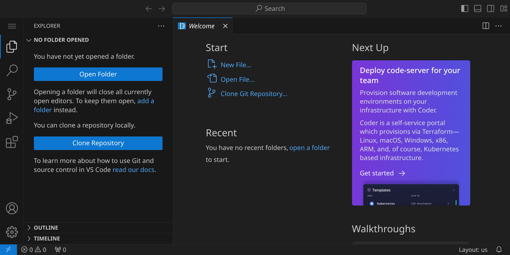

## HTTParty installieren

Bevor wir anfangen können, müssen wir ein Rubygem installieren, das uns hilft, HTTP-Anfragen zu senden. Öffne das Terminal, indem du den Shortcut <span class='key'>Strg</span><span class='key'>J</span> drückst. Dein Workspace sollte jetzt ungefähr so aussehen:

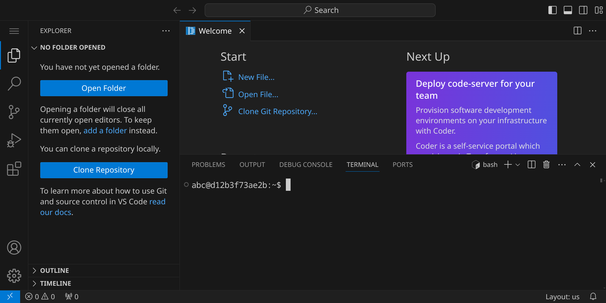

Installiere das Rubygem 'HTTParty', indem du folgenden Befehl in das Terminal eingibst:

```bash
gem install httparty
```

Wenn du die Meldung `3 gems installed` siehst, war die Installation erfolgreich:

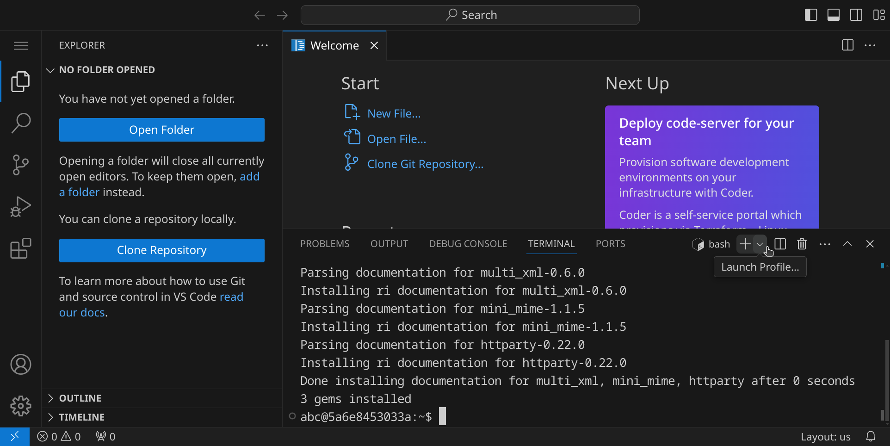

## Anmeldecode anfordern

Normalerweise meldest du dich in der App an, indem du deine E-Mail-Adresse eingibst und dann einen Code erhältst, den du in die App eingibst. Diesen Code können wir auch über eine HTTP-Anfrage anfordern – genauso macht es die App sonst für uns.

Wähle im Menü links oben »File« / »New Text File« (oder drücke <span class='key'>Strg</span><span class='key'>Alt</span><span class='key'>N</span>), um eine neue Datei anzulegen:

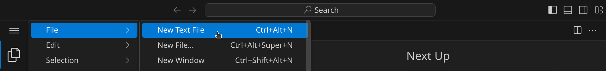

Schreibe den folgenden Code in die Datei:

```ruby
require 'httparty'
require 'json'

HOST = "https://agr.nhcham.org"

def post(path, data, headers = nil)
    response = JSON.parse(HTTParty.post("#{HOST}/#{path}", body: data.to_json, headers: headers).body)
    puts response
    response
end

print "Bitte gib deine E-Mail ein: "
email = gets.strip

puts "Code wird angefordert..."
tag = post('/api/login', {email: email})['tag']
```

Da Visual Studio Code noch nicht weiß, dass es sich um Ruby-Code handelt, sieht dein Code noch etwas farblos aus:

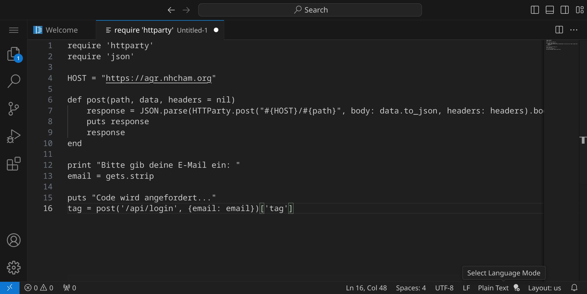

Speichere die Datei unter dem Dateinamen `hades.rb`, indem du <span class='key'>Strg</span><span class='key'>S</span> drückst und den Dateinamen eingibst. 

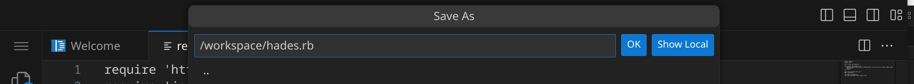

Dein Programm sollte jetzt ungefähr so aussehen:

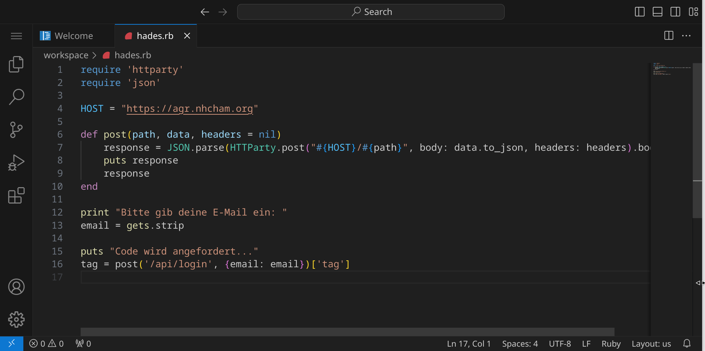

Wir lesen die E-Mail-Adresse ein und stellen eine Anfrage an den Server, in der wir die E-Mail-Adresse übergeben und um einen Anmeldecode bitten. Der Server antwortet mit einem kleinen Tag, das wir für die nächste Anfrage benötigen.

Führe das Programm aus, indem du im Terminal `ruby hades.rb` eingibst. Du wirst nach deiner E-Mail-Adresse gefragt:

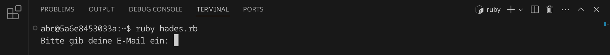

Wenn du deine Adresse eingibst, bekommst du zwei Teile eines Codes: das Tag, das der Server zurückgibt, und den Code, den du per E-Mail erhältst:

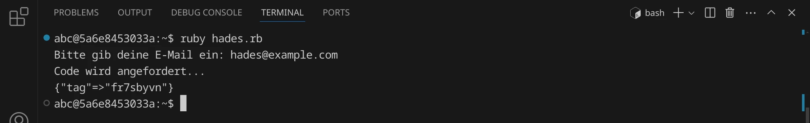

## Anmeldung mit Code bestätigen

Erweitere dein Programm um folgende Zeilen:

```ruby
print "Bitte gib deinen Anmeldecode ein: "
code = gets.strip

sid = post('/api/confirm_login', {tag: tag, code: code})['sid']
headers = { 'X-Session-ID': sid }
```

Mit diesen Zeilen bitten wir um die Eingabe des Zahlencodes und melden uns dann mit dem zuvor erhaltenen Tag und dem Code an. Führe das Programm erneut aus, indem du im Terminal `ruby hades.rb` eingibst. Du bekommst eine weitere E-Mail mit einem Code, den du eingeben musst:

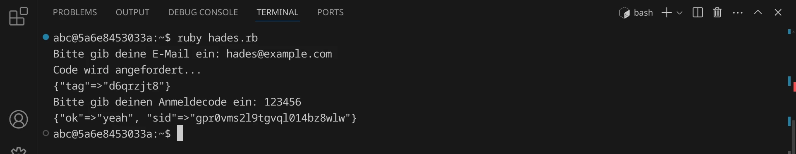

<div class='hint'>
Du musst natürlich deinen eigenen Code verwenden, den du per E-Mail bekommen hast.
</div>

Der Server antwortet mit einer Session-ID, die wir für alle weiteren Anfragen benötigen und an der der Server erkennt, dass wir es sind. Wir speichern sie in der Variable `sid` und setzen sie als Header für alle weiteren Anfragen.

## Hades aktivieren

Um Hades zu aktivieren, können wir eine spezielle Anfrage an den Server senden, die [genau für diesen Zweck vorgesehen ist](https://github.com/specht/language-trainer/blob/f47412697a41d9b614aa7fb04d8e2526cde0af1f/src/ruby/main.rb#L932). Füge folgende Zeilen zu deinem Ruby-Skript hinzu:

```ruby
puts "Aktiviere Hades..."
post('/api/activate_hades', nil, headers)

post('/api/logout', nil, headers)
```

Mit diesen Zeilen aktivieren wir Hades und melden uns dann wieder ab. Führe das Programm erneut aus, indem du im Terminal `ruby hades.rb` eingibst. Wenn alles geklappt hat, bekommst du eine Erfolgsmeldung:

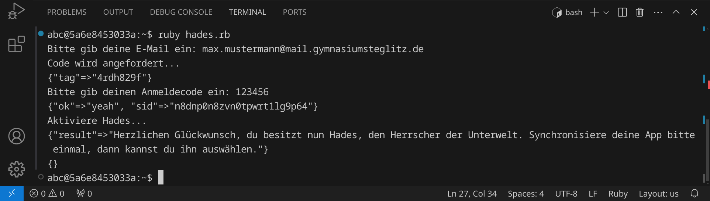

Herzlichen Glückwunsch, du hast nun Hades, den Herrscher der Unterwelten, in der Altgriechisch-App freigeschaltet!

Hier siehst du noch einmal den gesamten Quelltext:

_include_file(hades.rb, ruby)