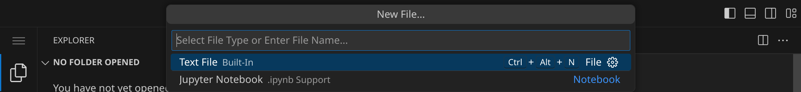

<div class='meta'>
image: Java-Logo.png
</div>

# Java (1995)

<p class='abstract'>
Java ist eine der meistverwendeten Programmiersprachen weltweit,
die zum Beispiel in der Anwendungsentwicklung und
Programmierung von Datenbanken eingesetzt wird.
Sie wurde 1995 von James Gosling entwickelt und
ist eine objektorientierte Programmiersprache.
In diesem Kapitel lernst du,
wie du ein einfaches Programm in Java schreibst und ausführst.
</p>

## Hello, world!

Java-Programme werden in Textdateien mit der Endung `.java` geschrieben. Diese Dateien werden dann mit dem Java-Compiler `javac` kompiliert, um ausführbare Dateien zu erzeugen. Diese ausführbaren Dateien haben die Endung `.class` und können mit dem Java-Interpreter `java` ausgeführt werden.

Stelle zuerst sicher, dass du keinen Ordner geöffnet hast. Um sicherzugehen, drücke einfach den Shortcut für »Ordner schließen«: <span class='key'>Strg</span><span class='key'>K</span> und dann <span class='key'>F</span>. Dein Workspace sollte jetzt ungefähr so aussehen:


### Quelltext schreiben

Klicke auf »New File« und wähle als Dateityp »Text File«.



Schreibe nun den folgenden Code in die Datei:

```java
public class HelloWorld {
    public static void main(String[] args) {
        System.out.println("Hello, World!");
    }
}
```

Deine Datei sieht noch nicht besonders spektakulär aus, aber das ist in Ordnung und wird sich gleich ändern. An dem weißen Punkt erkennst du, dass deine Änderungen noch nicht gespeichert sind.


Drücke nun <span class='key'>Strg</span><span class='key'>S</span>, um die Datei zu speichern. Gib `HelloWorld.java` ein – der vollständige Pfad zu deiner Datei lautet dann `/workspace/HelloWorld.java`.


Sobald du die Datei gespeichert hast, wird sie automatisch als Java-Datei erkannt und die Syntax wird hervorgehoben.


### Compilieren und ausführen

Bevor wir das Programm ausführen können, müssen wir es compilieren.
Dadurch wird der Quelltext des Programms in Bytecode übersetzt, den die Java Virtual Machine (JVM) ausführen kann.

Öffne dazu ein Terminal und navigiere in den Ordner, indem du entweder <span class='key'>Strg</span><span class='key'>J</span> drückst oder das Panel-Symbol  rechts oben drückst. Dein Fenster sollte jetzt ungefähr so aussehen:


Wir rufen jetzt den Java-Compiler `javac` auf, um das Programm zu übersetzen:

```bash
javac HelloWorld.java
```

<div class='hint'>
Du musst nicht den vollständigen Dateinamen schreiben. Schreib einfach <code>javac He</code> und drücke <span class='key'>Tab</span>, um den Rest automatisch vervollständigen zu lassen.
</div>

Dieser Befehl kompiliert den Java-Code und erzeugt eine ausführbare Datei namens `HelloWorld.class`. Um das Programm auszuführen, gib folgenden Befehl ein:

```bash
java HelloWorld
```

Das Programm sollte die Nachricht `Hello, World!` auf der Konsole ausgeben. Du kannst beide Schritte auch in einem Befehl kombinieren:

```bash
javac HelloWorld.java && java HelloWorld
```

<div class='hint'>
Die Zeichenkombination <code>&amp;&amp;</code> sorgt dafür, dass der zweite Befehl nur ausgeführt wird, wenn der erste erfolgreich war.
</div>

Nutze die Pfeiltaste hoch <span class='key'>↑</span>, um den letzten Befehl erneut einzugeben. So kannst du schnell dein Programm testen, nachdem du es verändert hast.

### Fehler finden und beheben

Wenn du einen Fehler im Code machst, wird der Compiler eine Fehlermeldung ausgeben. Versuche zum Beispiel, die Methode `println` falsch zu schreiben:

```java
System.out.printn("Hello, World!");
```

Speichere die Datei und führe den Compiler erneut aus:

```bash
javac HelloWorld.java
```

Der Compiler sollte eine Fehlermeldung ausgeben, die dir hilft, den Fehler zu finden:

```bash
HelloWorld.java:3: error: cannot find symbol
        System.out.printn("Hello, World!");
                  ^
  symbol:   method printn(String)
  location: variable out of type PrintStream
1 error
```

Es lohnt sich, die Fehlermeldungen genau zu lesen, um den Fehler zu finden und zu beheben. Achte auf die Zeilennummer (in diesem Beispiel 3) und den Text, der dir sagt, was falsch ist.

### Zusammenfassung

In diesem Kapitel hast du gelernt, wie du ein einfaches Java-Programm schreibst, compilierst und ausführst. Als nächstes wirst du lernen, wie du Variablen deklarierst, Schleifen und Bedingungen verwendest und Klassen und Methoden schreibst &ndash; die Buchhandlungen, Bibliotheken und Youtube sind voll von Material für dich. Java ist eine mächtige Programmiersprache, die dir viele Möglichkeiten bietet, eigene Programme zu schreiben. Viel Spaß beim Programmieren!
