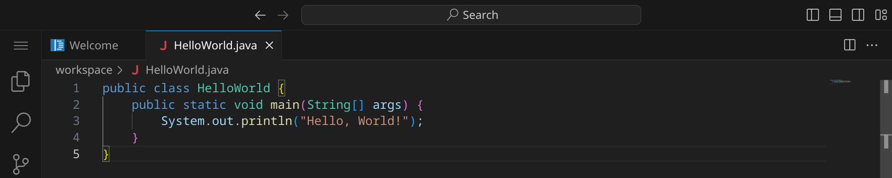
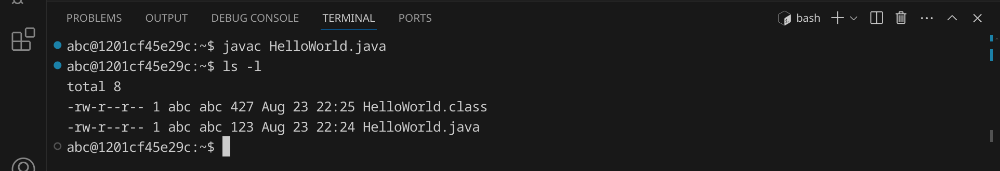

<div class='meta'>
image: Java-Logo.png
</div>

<div class='floatright mt-5' style='width: 12em;'>
    
    <p>
      James Gosling<br>
      <span style='font-size: 90%; opacity: 0.7;'>(Foto von Yuichi Sakuraba)</span>
    </p>
</div>

# Java <span style='font-size: 80%;'>(1995)</span>

<p class='abstract'>
Java ist eine der meistverwendeten Programmiersprachen weltweit, die zum Beispiel in der Anwendungsentwicklung und Programmierung von Datenbanken eingesetzt  wird. Sie wurde 1995 von James Gosling entwickelt und ist eine objektorientierte Programmiersprache. In diesem Kapitel lernst du, wie du ein einfaches Programm in Java schreibst und ausführst.
</p>

<!--
## Eigenschaften

- **Objektorientierung**: Java ist eine objektorientierte Programmiersprache, die auf der Verwendung von Objekten und Klassen basiert.
- **Plattformunabhängigkeit**: Java-Programme können auf verschiedenen Betriebssystemen und Plattformen ausgeführt werden.
- **Sicherheit**: Java bietet eine Vielzahl von Sicherheitsfunktionen, die es ermöglichen, sichere Anwendungen zu entwickeln.
- **Performance**: Java ist eine der schnellsten Programmiersprachen und wird häufig für rechenintensive Anwendungen eingesetzt.
- **Community**: Java hat eine aktive und engagierte Community, die eine Vielzahl von Bibliotheken und Frameworks entwickelt hat.
- **Vielseitigkeit**: Java wird in vielen Bereichen eingesetzt, darunter Anwendungsentwicklung, Webentwicklung und Datenbankprogrammierung.
-->

## Hello, world!

Java-Programme werden in Textdateien mit der Endung `.java` geschrieben. Diese Dateien werden dann mit dem Java-Compiler `javac` kompiliert, um ausführbare Dateien zu erzeugen. Diese ausführbaren Dateien haben die Endung `.class` und können mit dem Java-Interpreter `java` ausgeführt werden.

Stelle zuerst sicher, dass du keinen Ordner geöffnet hast. Um sicherzugehen, drücke einfach den Shortcut für »Ordner schließen«: <span class='key'>Strg</span><span class='key'>K</span> und dann <span class='key'>F</span>. Dein Workspace sollte jetzt ungefähr so aussehen:


### Quelltext schreiben

Klicke auf »New File« und wähle als Dateityp »Text File« (oder bestätige einfach mit <span class='key'>Enter</span>).


Schreibe nun den folgenden Code in die Datei:

_include_file(HelloWorld.java, java)

Da Visual Studio Code noch nicht weiß, dass es sich um Java-Quelltext handelt, ist dein Programm momentan noch einfarbig, aber das wird sich gleich ändern. An dem weißen Punkt erkennst du, dass deine Änderungen noch nicht gespeichert sind.


Drücke nun <span class='key'>Strg</span><span class='key'>S</span>, um die Datei zu speichern. Gib `HelloWorld.java` ein – der vollständige Pfad zu deiner Datei lautet dann `/workspace/HelloWorld.java`.


Sobald du die Datei gespeichert hast, wird sie automatisch als Java-Datei erkannt und die Syntax wird hervorgehoben.



### Compilieren und ausführen

Bevor wir das Programm ausführen können, müssen wir es compilieren.
Dadurch wird der Quelltext des Programms in Bytecode übersetzt, den die Java Virtual Machine (JVM) ausführen kann.

Öffne dazu ein Terminal, indem du entweder <span class='key'>Strg</span><span class='key'>J</span> drückst oder das Panel-Symbol  rechts oben drückst. Dein Fenster sollte jetzt ungefähr so aussehen:


Wir rufen jetzt den Java-Compiler `javac` auf, um das Programm zu übersetzen:

```bash
javac HelloWorld.java
```

<div class='hint'>
Du musst nicht den vollständigen Dateinamen schreiben. Schreib einfach <code>javac He</code> und drücke <span class='key'>Tab</span>, um den Rest automatisch vervollständigen zu lassen.
</div>

Wenn du keinen Fehler gemacht hast, wird das Programm erfolgreich kompiliert und die Datei `HelloWorld.class` wird im selben Verzeichnis erstellt. Du kannst dies überprüfen, indem du dir die Dateien im aktuellen Verzeichnis mit `ls` oder `ls -l` anzeigen lässt:



Die Datei `HelloWorld.class` ist die ausführbare Datei. Sie kann allerdings nicht direkt vom Computer ausgeführt werden, sondern muss von der Java Virtual Machine (JVM) ausgeführt werden.
Um das Programm auszuführen, gib folgenden Befehl ein:

```bash
java HelloWorld
```

Das Programm sollte die Nachricht `Hello, World!` im Terminal ausgeben. Du kannst beide Schritte auch in einem Befehl kombinieren:

```bash
javac HelloWorld.java && java HelloWorld
```

<div class='hint'>
Die Zeichenkombination <code>&amp;&amp;</code> sorgt dafür, dass der zweite Befehl nur ausgeführt wird, wenn der erste erfolgreich war.
</div>

### Fehler finden und beheben

Wenn du einen Fehler im Code machst, wird der Compiler eine Fehlermeldung ausgeben. Versuche zum Beispiel, statt `println` das Wort `printn` zu schreiben:

```java
System.out.printn("Hello, World!");
```

Speichere die Datei und führe den Compiler erneut aus:

```bash
javac HelloWorld.java
```

<div class='hint'>
Nutze die Pfeiltaste hoch <span class='key'>↑</span>, um den letzten Befehl erneut einzugeben. So kannst du schnell dein Programm testen, nachdem du es verändert hast.
</div>

Der Compiler sollte eine Fehlermeldung ausgeben, die dir hilft, den Fehler zu finden:

```bash
HelloWorld.java:3: error: cannot find symbol
        System.out.printn("Hello, World!");
                  ^
  symbol:   method printn(String)
  location: variable out of type PrintStream
1 error
```

Es lohnt sich, die Fehlermeldungen genau zu lesen, um den Fehler zu finden und zu beheben. Achte auf die Zeilennummer (in diesem Beispiel 3) und den Text, der dir sagt, was falsch ist. Denke daran, den Fehler wieder zu beheben, bevor du das nächste Beispiel ausprobierst.

## Primfaktorenzerlegung

Im zweiten Beispiel wollen wir eine Zahl in ihre Primfaktoren zerlegen.
Wir erreichen dies mit einem sehr einfachen Algorithmus, der einfach alle Zahlen von 2 bis zur eingegebenen Zahl durchprobiert und dabei diejenigen Zahlen ausgibt, bei denen die Division ohne Rest möglich ist. Außerdem wird die eingegebene Zahl durch jeden gefundenen Primfaktor geteilt, um die Schleife möglichst schnell zu beenden. An diesem Beispiel kannst du sehen, wie man in Java Benutzereingaben verarbeitet und Schleifen verwendet.
Erstelle eine neue Datei mit <span class='key'>Strg</span><span class='key'>Shift</span><span class='key'>N</span> und schreibe den folgenden Code hinein:

_include_file(Factor.java, java)

Speichere die Datei unter dem Namen `Factor.java`. Kompiliere das Programm:

```bash
javac Factor.java
```

Falls du keine Fehlermeldung erhältst, kannst du das Programm ausführen und testen:


Das Programm hat die Zahl 123 in ihre Primfaktoren zerlegt und ausgegeben. Probiere aus, was passiert, wenn du die Zahl 3000000000 eingibst. Was könnte der Grund dafür sein?

## Bubblesort

Im dritten Beispiel wollen wir eine Liste von 10 Zufallszahlen sortieren. Dafür verwenden wir den [Bubblesort-Algorithmus](https://de.wikipedia.org/wiki/Bubblesort), der zwar nicht besonders effizient ist, aber sehr einfach zu verstehen und zu implementieren. Der Bubblesort-Algorithmus funktioniert, indem er die Liste mehrmals durchläuft und benachbarte Elemente vertauscht, wenn sie in der falschen Reihenfolge sind.

An diesem Beispiel kannst du sehen, wie man in Java Arrays verwendet, Funktionen verwendet und Schleifen verschachtelt.

Erstelle eine neue Datei und schreibe den folgenden Code hinein:

_include_file(BubbleSort.java, java)

Speichere die Datei unter dem Namen `BubbleSort.java`. Kompiliere das Programm:

```bash
javac BubbleSort.java
```
Falls du keine Fehlermeldung erhältst, kannst du das Programm ausführen und testen:


Das Programm hat eine Liste von 10 Zufallszahlen sortiert. Versuche, den Quelltext so zu verändern, dass statt 10 Zahlen 100 oder mehr Zahlen sortiert werden.

## Zusammenfassung

In diesem Kapitel hast du an drei Beispielen gesehen, wie man ein einfaches Java-Programm schreiben, kompilieren und ausführen kann. Das ist natürlich nur ein erster Eindruck. Um Java wirklich zu beherrschen, musst du noch viel mehr lernen – am besten, indem du eigene Programme schreibst und ausprobierst. Die Buchhandlungen, Bibliotheken und Youtube sind voll von Material für dich. Viel Spaß beim Programmieren!
