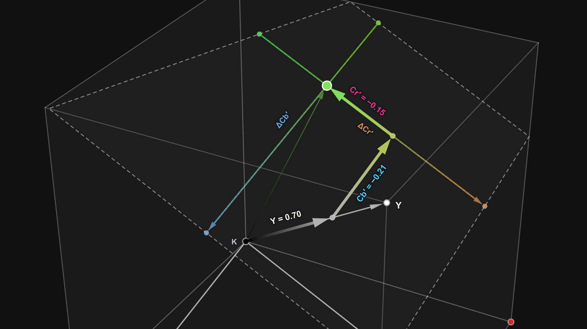
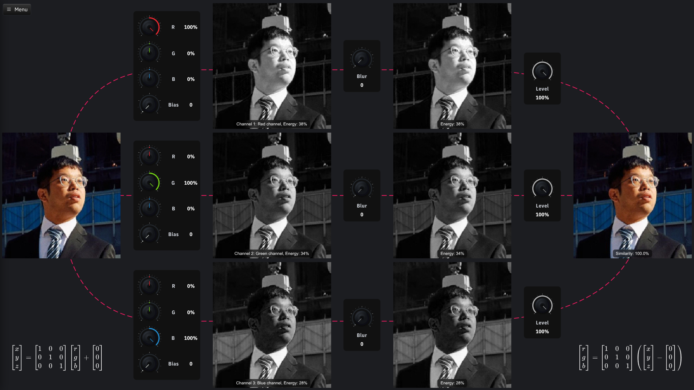
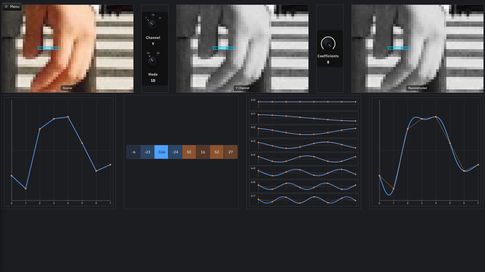

image: title.webp

<link rel="stylesheet" href="include/katex/katex.min.css">

# Eine JPEG-Datei decodieren

Das JPEG-Format (Joint Photographic Experts Group) ist ein weit verbreitetes Bildformat, das hauptsächlich für die Komprimierung von Fotografien und realistischen Bildern verwendet wird. Es wurde in den frühen 1990er Jahren entwickelt und bietet eine effiziente Methode zur Reduzierung der Dateigröße von Bildern, während gleichzeitig eine akzeptable Bildqualität beibehalten wird. JPEG verwendet eine verlustbehaftete Komprimierungstechnik, bei der bestimmte Bildinformationen entfernt werden, um die Dateigröße zu verringern. Dies führt zu einer gewissen Qualitätsminderung, die jedoch oft nicht sichtbar ist, insbesondere bei höheren Qualitätsstufen.

## Grundlagen

Dieser Artikel soll dir helfen, einen JPEG-Decoder zu implementieren. Dafür ist es wichtig, zunächst einige Grundlagen zu verstehen:

Farbräume

Trennung von Helligkeit und Farbe

Diskrete Kosinustransformation (DCT)

<!-- Basiswechsel, Quantisierung, Huffman-Codierung -->

## Grober Ablauf eines JPEG-Decoders

Um eine JPEG-Datei zu decodieren, musst du die folgenden Schritte durchführen:

1. **Marker erkennen**: Suche nach den JPEG-Markern, um die Struktur der Datei zu verstehen.
2. **Segmente interpretieren**: Je nach Marker musst du die entsprechenden Daten interpretieren. Zum Beispiel musst du bei einem DQT-Marker die Quantisierungstabelle lesen, bei einem SOF0-Marker die Bildgröße und die Anzahl der Komponenten, und bei einem DHT-Marker einen Huffman-Baum aufbauen.
3. **Huffman-Codes lesen**: Ab dem SOS-Marker (Start of Scan) musst du die komprimierten Bilddaten lesen und die Huffman-Codes decodieren, um die quantisierten DCT-Koeffizienten zu erhalten.
4. **Dequantisierung**: Verwende die passende Quantisierungstabelle, um die quantisierten DCT-Koeffizienten in ihre ursprünglichen Werte zurückzuverwandeln.
5. **Inverse DCT**: Wende die inverse diskrete Kosinustransformation an, um die Pixelwerte aus den DCT-Koeffizienten zu berechnen.
6. **Bild rekonstruieren**: Setze die Pixelwerte zusammen, um das endgültige Bild zu erstellen. Dabei müssen die Chroma-Kanäle entsprechend der Subsampling-Methode interpoliert werden, falls diese verwendet wurde.
7. **Farbraumkonvertierung**: Nutze eine Farbraumtransformation, um die Bilddaten von YCbCr zurück in RGB zu konvertieren.
8. **Bild anzeigen**: Zeige das rekonstruierte Bild mit dem Pixelflow Canvas an.

Der vollständige [JPEG-Standard](https://www.w3.org/Graphics/JPEG/itu-t81.pdf) ist sehr umfangreich und komplex. Wir fassen deshalb hier alle relevanten Informationen zusammen, die du für die Implementierung eines Baseline-JPEG-Decoders benötigst.

Wir beginnen mit den Markern und Segmenten, die die Struktur einer JPEG-Datei definieren, und gehen dann Schritt für Schritt durch die Decodierung der Bilddaten.

Marker sind spezielle 16-Bit-Sequenzen, die bestimmte Abschnitte eines JPEG-Bildes kennzeichnen. Sie beginnen immer mit 0xFF, gefolgt von einem weiteren Byte, das den Typ des Markers angibt. Einige Marker stehen für sich allein und beinhalten keine Daten, während andere Marker von einer 16-Bit-Länge gefolgt werden, die die Anzahl der nachfolgenden Datenbytes angibt (inkl. der 2 Bytes für die Länge selbst). Hier ist eine Übersicht über die wichtigsten Marker (dabei werden Marker ohne Daten mit einem Sternchen (*) gekennzeichnet):

<table class='table'>
    <thead>
        <tr>
        <th>Marker</th>
        <th colspan='2'>Name</th>
        <th>Beschreibung</th>
        </tr>
    </thead>
    <tbody>
        <tr>
        <td><code>0xFFD8</code></td>
        <td><code>SOI</code>*</td>
        <td>Start of Image</td>
        <td>Markiert den Beginn eines JPEG-Bildes.</td>
        </tr>
        <tr>
        <td><code>0xFFDB</code></td>
        <td><code>DQT</code></td>
        <td>Define Quantization Table</td>
        <td>Definiert eine oder mehrere Quantisierungstabellen.</td>
        </tr>
        <tr>
        <td><code>0xFFC0</code></td>
        <td><code>SOF0</code></td>
        <td>Start of Frame (Baseline DCT)</td>
        <td>Definiert die Bildgröße, die Anzahl der Komponenten und die Präzision der Bilddaten.</td>
        </tr>
        <tr>
        <td><code>0xFFC4</code></td>
        <td><code>DHT</code></td>
        <td>Define Huffman Table</td>
        <td>Definiert eine oder mehrere Huffman-Tabellen.</td>
        </tr>
        <tr>
        <td><code>0xFFDA</code></td>
        <td><code>SOS</code></td>
        <td>Start of Scan</td>
        <td>Markiert den Beginn der komprimierten Bilddaten.</td>
        </tr>
        <tr>
        <td><code>0xFFD9</code></td>
        <td><code>EOI</code>*</td>
        <td>End of Image</td>
        <td>Markiert das Ende eines JPEG-Bildes.</td>
        </tr>
    </tbody>
</table>

Du solltest sicherstellen, dass die Datei mit den Bytes 0xFFD8 (SOI) beginnt. Anschließend kannst du in einer Schleife immer einen Marker lesen, dann je nach Marker eine Länge und die entsprechende Anzahl von Bytes überspringen, bis du auf den SOS-Marker (0xFFDA) stößt. Ab diesem Punkt kannst du später die komprimierten Bilddaten lesen.

## Start of Image (SOI)

Der SOI-Marker (0xFFD8) markiert den Beginn eines JPEG-Bildes. Er besteht aus zwei Bytes und enthält keine weiteren Daten. Ein gültiges JPEG-Bild muss mit diesem Marker beginnen.

<pre class='spec'>
     7 6 5 4 3 2 1 0        Field Name                    Type
    +---------------+
 0  |               |       Marker (FFD8)                 Word
    +-             -+
 1  |               |
    +---------------+
</pre>

**Beispiel:**

<pre class='spec hexdump'>
00000000  ff d8 ff e0 00 10 4a 46  49 46 00 01 01 01 01 2c  |......JFIF.....,|
</pre>

Der SOI-Marker steht am Anfang der Datei. Sollte er fehlen, beende dein Programm mit einer Fehlermeldung. Gleich im Anschluss an den SOI-Marker folgt oft ein APP0-Segment (0xFFE0), das Metadaten enthält. Wir überspringen es mit Hilfe der Segmentlänge, da es für uns nicht relevant ist.

Falls du vorher noch nie einen Hex-Dump gesehen hast, hier eine kurze Erklärung zu diesem Format: Es werden immer 16 Bytes in einer Zeile dargestellt. Die erste Spalte zeigt den Offset (die Position) des ersten Bytes in der Zeile an (in hexadezimaler Form). Dann folgen die 16 Bytes in hexadezimaler Form (in der Mitte gibt es eine kleine Lücke nach 8 Bytes, um die Lesbarkeit zu verbessern). Am Ende der Zeile wird die ASCII-Darstellung der Bytes angezeigt, wobei nicht druckbare Zeichen durch einen Punkt (.) ersetzt werden. In diesem Beispiel siehst du, dass die ersten beiden Bytes 0xFF und 0xD8 sind (der SOI-Marker), gefolgt von weiteren Daten, die das APP0-Segment bilden.

Die Beispiele beziehen sich alle auf die Datei <a href='/jpeg/44-baseline.jpg' target='_blank'>44-baseline.jpg</a>, die du zum Testen deiner Implementation verwenden kannst.

## Define Quantization Table (DQT)

Im DQT-Segment werden Quantisierungstabellen definiert. Es gibt 4 mögliche Slots für diese Tabellen (0 bis 3), die jeweils 64 Werte enthalten. Die 64 Werte sind in der Zig-Zag-Reihenfolge abgespeichert.

<pre class='spec'>
     7 6 5 4 3 2 1 0        Field Name                    Type
    +---------------+
 0  |               |       Marker (FFDB)                 Word
    +-             -+
 1  |               |
    +---------------+
 2  |               |       Segment Length                Word
    +-             -+
 3  |               |
    +---------------+
 4  |   Pq  |  Tq   |       [Packed Fields]               See below
    +---------------+
 5  |               |       Quantization Table Values     64 Bytes
    +-   . . . .   -+
68  |               |
    +---------------+

    [Packed Fields]  =      Pq: Precision (0 = 8-bit, 1 = 16-bit)     4 Bits
                            Tq: Table Identifier (0–3)                4 Bits
</pre>

**Beispiel:**

<pre class='spec hexdump'>
00000010  01 2c 00 00 ff db 00 43  00 05 03 04 04 04 03 05  |.,.....C........|
00000020  04 04 04 05 05 05 06 07  0c 08 07 07 07 07 0f 0b  |................|
00000030  0b 09 0c 11 0f 12 12 11  0f 11 11 13 16 1c 17 13  |................|
00000040  14 1a 15 11 11 18 21 18  1a 1d 1d 1f 1f 1f 13 17  |......!.........|
00000050  22 24 22 1e 24 1c 1e 1f  1e ff db 00 43 01 05 05  |"$".$.......C...|
</pre>

<table class='table'>
<tr>
<td><code>FF DB</code></td>
<td>DQT-Marker</td>
</tr>
<tr>
<td><code>00 43</code></td>
<td>Segmentlänge (0x43 = 67 Bytes)

Es kann vorkommen, dass in einem DQT-Segment mehrere Quantisierungstabellen definiert werden. Du erkennst dies daran, dass die Segmentlänge größer als erwartet ist. In diesem Fall wiederholt sich die Struktur ab Offset 4.

</td>
</tr>
<tr>
<td><code>00</code></td>
<td>Pq = 0 (8-Bit-Werte), Tq = 0 (Slot 0)

Du kannst für deinen Decoder davon ausgehen, dass Pq immer 0 ist, wir also 8-Bit-Werte einlesen können. Sollte Pq einen anderen Wert haben, beende dein Programm mit einer Fehlermeldung.

</td>
</tr>
<tr>
<td><code>05 03 04 04</code> ...</td>
<td>64 Werte der Quantisierungstabelle

Speichere die Werte in dem entsprechenden Slot (Tq) ab, damit du sie später für die Dequantisierung verwenden kannst.

</td>
</tr>
</table>

## Start of Frame (SOF0)

Im SOF0-Segment (Start of Frame, Baseline DCT) werden die Bildgröße, die Anzahl der Komponenten und die Präzision der Bilddaten definiert. Es enthält auch Informationen über die Subsampling-Methode, die für die Chroma-Kanäle verwendet wird.

<pre class='spec'>
     7 6 5 4 3 2 1 0        Field Name                    Type
    +---------------+
 0  |               |       Marker (FFC0)                 Word
    +-             -+
 1  |               |
    +---------------+
 2  |               |       Segment Length                Word
    +-             -+
 3  |               |
    +---------------+
 4  |       P       |       Sample Precision              Byte
    +---------------+
 5  |       Y       |       Number of Lines               Word
    +-             -+
 6  |               |
    +---------------+
 7  |       X       |       Number of Samples/Line        Word
    +-             -+
 8  |               |
    +---------------+
 9  |      Nf       |       Number of Image Components    Byte
    +---------------+

(for each image component:)

    +---------------+
10  |      Ci       |       Component Identifier          Byte
    +---------------+
11  |   Hi  |  Vi   |       [Packed Fields]               See below
    +---------------+
12  |      Tqi      |       Quantization Table Selector   Byte
    +---------------+

    [Packed Fields]  =      Hi: Horizontal Sampling Factor     4 Bits
                            Vi: Vertical Sampling Factor       4 Bits
</pre>

**Beispiel:**

<pre class='spec hexdump'>
00000090  1e 1e 1e 1e 1e 1e 1e 1e  1e 1e 1e 1e 1e 1e ff c0  |................|
000000a0  00 11 08 02 9b 03 e8 03  01 22 00 02 11 01 03 11  |........."......|
000000b0  01 ff c4 00 1f 00 00 01  05 01 01 01 01 01 01 00  |................|
</pre>

<table class='table'>
<tr>
<td><code>FF C0</code></td>
<td>SOF0-Marker

Zusätzlich zum SOF0-Marker gibt es noch weitere SOF-Marker (SOF1, SOF2, ...), die für verschiedene JPEG-Varianten verwendet werden. Für unseren Baseline-JPEG-Decoder kannst du davon ausgehen, dass nur der SOF0-Marker verwendet wird.

</td>
</tr>
<tr>
<td><code>00 11</code></td>
<td>Segmentlänge (0x11 = 17 Bytes)</td>
</tr>
<tr>
<td><code>08</code></td>
<td>Sample Precision (8 Bit)

Du kannst für deinen Decoder davon ausgehen, dass dieser Wert immer 8 ist. Sollte er einen anderen Wert haben, beende dein Programm mit einer Fehlermeldung.

</td>
</tr>
<tr>
<td><code>02 9B</code></td>
<td>Anzahl der Zeilen (0x29b = 667)

Dieser Wert beschreibt die Höhe des Bildes in Pixeln.

</td>
</tr>
<tr>
<td><code>03 E8</code></td>
<td>Anzahl der Samples pro Zeile (0x3e8 = 1000)

Dieser Wert beschreibt die Breite des Bildes in Pixeln.

</td>
</tr>
<tr>
<td><code>03</code></td>
<td>Anzahl der Komponenten (3)

Du kannst für deinen Decoder davon ausgehen, dass dieser Wert immer 3 ist und für die drei Komponenten Y, Cb und Cr steht. Sollte er einen anderen Wert haben, beende dein Programm mit einer Fehlermeldung.

</td>
</tr>
<tr>
<td style='white-space: nowrap;'><code>01</code> <code>22</code> <code>00</code></td>
<td>Komponente 1 (Y), 2:2 Subsampling, Quantization Table 0</td>
</tr>
<tr>
<td><code>02</code> <code>11</code> <code>01</code></td>
<td>Komponente 2 (Cb), 1:1 Subsampling, Quantization Table 1</td>
</tr>
<tr>
<td><code>03</code> <code>11</code> <code>01</code></td>
<td>Komponente 3 (Cr), 1:1 Subsampling, Quantization Table 1</td>
</tr>
</table>

### Chroma Subsampling

In diesem Beispiel siehst du, dass die Y-Komponente (Helligkeit) mit einem 2:2-Subsampling codiert ist, während die Cb- und Cr-Komponenten (Farbinformationen) mit einem 1:1-Subsampling codiert sind. Im JPEG-Jargon spricht man von einer Minimal Coding Unit (MCU), die in diesem Fall aus 4 Y-Blöcken, 1 Cb-Block und 1 Cr-Block besteht. Das bedeutet, dass für jede MCU 4 Blöcke der Y-Komponente und jeweils 1 Block der Cb- und Cr-Komponenten codiert werden: die Auflösung der Chroma-Komponenten ist also halb so hoch wie die der Luma-Komponente in beiden Dimensionen. 

## Define Huffman Table (DHT)

Im DHT-Segment werden Huffman-Tabellen definiert, die wir für die Decodierung der komprimierten Bilddaten benötigen. Dabei wird in DC- und AC-Tabellen unterschieden: DC-Tabellen codieren die Differenzen der DC-Koeffizienten, während AC-Tabellen die AC-Koeffizienten codieren. Es gibt 4 mögliche Slots für DC-Tabellen (0 bis 3) und 4 mögliche Slots für AC-Tabellen (0 bis 3). Jede Tabelle besteht aus 16 Bytes, die die Anzahl der Codes für jede Code-Länge von 1 bis 16 angeben, gefolgt von den Symbolen, die diesen Codes zugeordnet sind.

<pre class='spec'>
     7 6 5 4 3 2 1 0        Field Name                    Type
    +---------------+
 0  |               |       Marker (FFC4)                 Word
    +-             -+
 1  |               |
    +---------------+
 2  |               |       Segment Length                Word
    +-             -+
 3  |               |
    +---------------+
 4  |   Tc  |  Th   |       [Packed Fields]               See below
    +---------------+
 5  |      L1       |       Number of Codes of Length 1   Byte
    +-   . . . .   -+
20  |      L16      |       Number of Codes of Length 16  Byte
    +---------------+
21  |      V1       |       First Symbol                  Byte
    +-   . . . .   -+
    |      Vn       |       Last Symbol                   Byte
    +---------------+

    [Packed Fields]  =      Tc: Table Class (0 = DC, 1 = AC)   4 Bits
                            Th: Table Identifier (0–3)         4 Bits
</pre>

<pre class='spec hexdump'>
000000b0  01 ff c4 00 1f 00 00 01  05 01 01 01 01 01 01 00  |................|
000000c0  00 00 00 00 00 00 00 01  02 03 04 05 06 07 08 09  |................|
000000d0  0a 0b ff c4 00 b5 10 00  02 01 03 03 02 04 03 05  |................|
</pre>

<table class='table'>
<tr>
<td><code>FF C4</code></td>
<td>DHT-Marker
</td>
</tr>
<tr>
<td><code>00 1F</code></td>
<td>Segmentlänge (0x1f = 31 Bytes)

Es kann vorkommen, dass in einem DHT-Segment mehrere Huffman-Tabellen definiert werden. Du erkennst dies daran, dass die Segmentlänge größer als erwartet ist. In diesem Fall wiederholt sich die Struktur ab Offset 4.

</td>
</tr>
<tr>
<td><code>00</code></td>
<td>Tc = 0 (DC-Tabelle), Th = 0 (Slot 0)

Dieser Huffman-Baum ist für DC-Slot 0 bestimmt und wird später benötigt werden.

</td>
</tr>
<tr>
<td style='white-space: nowrap;'>

<code>00</code> <code>01</code>
<code>05</code> <code>01</code>

<code>01</code> <code>01</code>
<code>01</code> <code>01</code>

<code>01</code> <code>00</code>
<code>00</code> <code>00</code>

<code>00</code> <code>00</code>
<code>00</code> <code>00</code>

</td>
<td>Anzahl der Codes pro Code-Länge für die DC-Tabelle im Slot 0

Diese Werte geben an, wie viele Codes es mit einer bestimmten Länge gibt. In diesem Beispiel gibt es 0 Codes mit der Länge 1, 1 Code mit der Länge 2, 5 Codes mit der Länge 3 sowie jeweils 1 Code mit den Längen 4, 5, 6, 7, 8 und 9 – insgesamt also 12 Codes, deren Symbole nun folgen.

</td>
</tr>
<tr>
<td style='white-space: nowrap;'>

<code>00</code> <code>01</code>
<code>02</code> <code>03</code>

<code>04</code> <code>05</code>
<code>06</code> <code>07</code>

<code>08</code> <code>09</code>
<code>0a</code> <code>0b</code>

</td>
<td>Symbole für die DC-Tabelle im Slot 0

Diese Werte sind die Symbole, die den Codes zugeordnet werden. Das erste Symbol (0x00) wird dem einzigen Code mit der Länge 2 zugeordnet, die nächsten 5 Symbole (0x01 bis 0x05) werden den 5 Codes mit der Länge 3 zugeordnet, und so weiter.

</td>
</tr>
</table>

Du findest in der JPEG-Datei keinen kompletten Huffman-Baum, sondern nur eine Art Bauanleitung für einen »kanonischen Huffman-Baum«. Anhand der Anzahl der Codes pro Code-Länge kannst du die Struktur des Baumes rekonstruieren und die Symbole den entsprechenden Codes zuordnen.

**Implementierungshinweis:**

Für einen JPEG-Decoder benötigst du keinen tatsächlichen Huffman-Baum. Es reicht, für jede Codelänge einen Bereich von Codes zu berechnen, der dieser Länge entspricht, und die Symbole in der richtigen Reihenfolge diesen Codes zuzuordnen.

Wir benötigen die folgenden Arrays:

- `min_code`: Ein Array, das für jede Codelänge den kleinsten Code dieser Länge enthält.
- `max_code`: Ein Array, das für jede Codelänge den größten Code dieser Länge enthält.
- `val_ptr`: Ein Array, das für jede Codelänge den Index des ersten Symbols dieser Länge enthält.
- `huffval`: Ein Array, das die Symbole enthält, sortiert nach der Reihenfolge der Codes.

In unserem Beispiel würden sich diese Arrays wie folgt füllen:

<table class='table center'>
<tr>
<th>length</th>
<th>min_code</th>
<th>max_code</th>
<th>(valid codes)</th>
<th>val_ptr</th>
</tr>
<tr>
<td>1</td>
<td>–</td>
<td>–</td>
<td>–</td>
<td>–</td>
</tr>
<tr>
<td>2</td>
<td>0</td>
<td>0</td>
<td>00</td>
<td>0</td>
</tr>
<tr>
<td>3</td>
<td>2</td>
<td>6</td>
<td>010, 011, 100, 101, 110</td>
<td>1</td>
</tr>
<tr>
<td>4</td>
<td>14</td>
<td>14</td>
<td>1110</td>
<td>6</td>
</tr>
<tr>
<td>5</td>
<td>30</td>
<td>30</td>
<td>11110</td>
<td>7</td>
</tr>
<tr>
<td>6</td>
<td>62</td>
<td>62</td>
<td>111110</td>
<td>8</td>
</tr>
<tr>
<td>7</td>
<td>126</td>
<td>126</td>
<td>1111110</td>
<td>9</td>
</tr>
<tr>
<td>8</td>
<td>254</td>
<td>254</td>
<td>11111110</td>
<td>10</td>
</tr>
<tr>
<td>9</td>
<td>510</td>
<td>510</td>
<td>111111110</td>
<td>11</td>
</tr>
<tr>
<td>10</td>
<td>–</td>
<td>–</td>
<td>–</td>
<td>–</td>
</tr>
<tr>
<td colspan='5' style='text-align: center;'>...</td>
</tr>
</table>

Die Werte für `huffval` können direkt aus den Symbolen im DHT-Segment übernommen werden, da sie bereits in der richtigen Reihenfolge vorliegen. Es ergibt sich also folgende Zuordnung:

<table class='table center'>
<tr>
<th>Code</th>
<td>00</td>
<td>010</td>
<td>011</td>
<td>100</td>
<td>101</td>
<td>110</td>
<td>1110</td>
<td>11110</td>
<td>111110</td>
<td>1111110</td>
<td>11111110</td>
<td>111111110</td>
</tr>
<tr>
<th>Symbol</th>
<td>0</td>
<td>1</td>
<td>2</td>
<td>3</td>
<td>4</td>
<td>5</td>
<td>6</td>
<td>7</td>
<td>8</td>
<td>9</td>
<td>10</td>
<td>11</td>
</tr>
</table>

Im Decoder müssen wir später »nur noch« die Bits solange einzeln einlesen, bis wir einen gültigen Code erkennen und das entsprechende Symbol ermitteln können.

**Ein weiteres Beispiel:**

In diesem Beispiel wird eine AC-Tabelle im Slot 0 definiert, die deutlich mehr Codes enthält als die vorherige DC-Tabelle. Wir benötigen sie später für die Decodierung der AC-Koeffizienten.

<pre class='spec hexdump'>
000000d0  0a 0b ff c4 00 b5 10 00  02 01 03 03 02 04 03 05  |................|
000000e0  05 04 04 00 00 01 7d 01  02 03 00 04 11 05 12 21  |......}........!|
000000f0  31 41 06 13 51 61 07 22  71 14 32 81 91 a1 08 23  |1A..Qa."q.2....#|
00000100  42 b1 c1 15 52 d1 f0 24  33 62 72 82 09 0a 16 17  |B...R..$3br.....|
00000110  18 19 1a 25 26 27 28 29  2a 34 35 36 37 38 39 3a  |...%&'()*456789:|
00000120  43 44 45 46 47 48 49 4a  53 54 55 56 57 58 59 5a  |CDEFGHIJSTUVWXYZ|
00000130  63 64 65 66 67 68 69 6a  73 74 75 76 77 78 79 7a  |cdefghijstuvwxyz|
00000140  83 84 85 86 87 88 89 8a  92 93 94 95 96 97 98 99  |................|
00000150  9a a2 a3 a4 a5 a6 a7 a8  a9 aa b2 b3 b4 b5 b6 b7  |................|
00000160  b8 b9 ba c2 c3 c4 c5 c6  c7 c8 c9 ca d2 d3 d4 d5  |................|
00000170  d6 d7 d8 d9 da e1 e2 e3  e4 e5 e6 e7 e8 e9 ea f1  |................|
00000180  f2 f3 f4 f5 f6 f7 f8 f9  fa ff c4 00 1f 01 00 03  |................|
</pre>

## Start of Scan (SOS)

Der SOS-Marker (Start of Scan) markiert den Beginn der komprimierten Bilddaten. Er enthält Informationen über die Anzahl der Komponenten im Scan sowie die zu verwendenden Huffman-Tabellen.

<pre class='spec'>
     7 6 5 4 3 2 1 0        Field Name                    Type
    +---------------+
 0  |               |       Marker (FFDA)                 Word
    +-             -+
 1  |               |
    +---------------+
 2  |               |       Segment Length                Word
    +-             -+
 3  |               |
    +---------------+
 4  |      Ns       |       Number of Image Components in Scan Byte
    +---------------+

(for each image component in scan:)

    +---------------+
 5  |      Cs       |       Scan Component Selector       Byte
    +---------------+
 6  |   Td  |  Ta   |       [Packed Fields]               See below
    +---------------+

    [Packed Fields]  =      Td: DC Huffman Table Selector 4 Bits
                            Ta: AC Huffman Table Selector 4 Bits

(at the end:)

    +---------------+
 7  | Ss            |       Start of Spectral Selection   Byte
    +---------------+
 8  | Se            |       End of Spectral Selection     Byte
    +---------------+
 9  | Ah  | Al      |       Successive Approximation      Byte
    +---------------+

    [Packed Fields]  =  Ah: Successive Approximation High 4 Bits
                        Al: Successive Approximation Low  4 Bits

</pre>

**Beispiel:**

<pre class='spec hexdump'>
00000260  fa ff da 00 0c 03 01 00  02 11 03 11 00 3f 00 f0  |.............?..|
00000270  7b 9d 26 64 7c c4 d9 52  7e e9 ed 59 b3 44 23 60  |{.&d|..R~..Y.D#`|
00000280  92 2e c6 3d 33 5d f5 c5  96 d2 44 67 38 ec 45 72  |...=3]....Dg8.Er|
</pre>

<table class='table'>
<tr>
<td><code>FF DA</code></td>
<td>SOS-Marker
</td>
</tr>
<tr>
<td><code>00 0C</code></td>
<td>Segmentlänge (0x0c = 12 Bytes)</td>
</tr>
<tr>
<td><code>03</code></td>
<td>Anzahl der Komponenten im Scan (3)

Du kannst für deinen Decoder davon ausgehen, dass dieser Wert immer 3 ist und für die drei Komponenten Y, Cb und Cr steht. Sollte er einen anderen Wert haben, beende dein Programm mit einer Fehlermeldung.

</td>
</tr>
<tr>
<td style='white-space: nowrap;'>

<code>01</code> <code>00</code>

<code>02</code> <code>11</code>

<code>03</code> <code>11</code>

</td>
<td>Auswahl der Huffman-Tabellen

Für jede der drei Komponenten Y, Cb und Cr wird angegeben, welche DC- und AC-Huffman-Tabelle verwendet werden soll. In diesem Beispiel wird für die Y-Komponente DC-Tabelle 0 und AC-Tabelle 0 verwendet, während für die Cb- und Cr-Komponenten jeweils DC-Tabelle 1 und AC-Tabelle 1 verwendet wird.

</td>
</tr>
<tr>
<td style='white-space: nowrap;'>

<code>00</code>

<code>3f</code>

<code>00</code>

</td>
<td>Parameter für Progressive JPEGs

In komplexeren JPEG-Varianten können Teile der Bilddaten nach und nach codiert werden. Dies war vor allem früher wichtig, als die Übertragung von Bildern über das Internet noch sehr langsam war. Du kannst für deinen Decoder davon ausgehen, dass diese Werte immer 0x00, 0x3f und 0x00 sind. Sollte dies nicht der Fall sein, beende dein Programm mit einer Fehlermeldung.

</td>
</tr>
</table>

## Decodierung der Bilddaten

Direkt hinter dem SOS-Segment beginnen die komprimierten Bilddaten:

<pre class='spec hexdump'>
00000260  fa ff da 00 0c 03 01 00  02 11 03 11 00 3f 00 f0  |.............?..|
00000270  7b 9d 26 64 7c c4 d9 52  7e e9 ed 59 b3 44 23 60  |{.&d|..R~..Y.D#`|
00000280  92 2e c6 3d 33 5d f5 c5  96 d2 44 67 38 ec 45 72  |...=3]....Dg8.Er|
</pre>

Dabei wird das Bild MCU-weise codiert. In unserem Beispiel haben wir eine MCU-Größe von 16x16 Pixeln, bestehend aus 4 Blöcken der Y-Komponente (jeweils 8x8 Pixel), 1 Block der Cb-Komponente (8x8 Pixel) und 1 Block der Cr-Komponente (8x8 Pixel), also folgende Reihenfolge: Y0, Y1, Y2, Y3, Cb0, Cr0. Wir müssen demnach insgesamt sechs 8x8-Pixel-Blöcke decodieren, um eine MCU von 16x16 Pixeln zu erhalten.

### Decodierung eines Blocks: DC-Koeffizient

In jedem Block wird zuerst der DC-Koeffizient decodiert, indem die entsprechenden Bits aus der Datei gelesen werden. Wir verwenden in diesem Beispiel die folgende DC-Tabelle in Slot 0, die wir vorher aus dem ersten DHT-Segment erstellt haben:

<table class='table center'>
<tr>
<th>Code</th>
<td>00</td>
<td>010</td>
<td>011</td>
<td>100</td>
<td>101</td>
<td>110</td>
<td>1110</td>
<td>11110</td>
<td>111110</td>
<td>1111110</td>
<td>11111110</td>
<td>111111110</td>
</tr>
<tr>
<th>Symbol</th>
<td>0</td>
<td>1</td>
<td>2</td>
<td>3</td>
<td>4</td>
<td>5</td>
<td>6</td>
<td>7</td>
<td>8</td>
<td>9</td>
<td>10</td>
<td>11</td>
</tr>
</table>

Nehmen wir die ersten beiden Bytes `F0 7B` und betrachten sie als Bits:

<pre class='spec hexdump'>
11110000 01111011
</pre>

Den ersten Code, den wir finden ist `11110`:

<pre class='spec hexdump'>
11110 000 01111011
</pre>

Der Code `11110` entspricht dem Symbol 7, was bedeutet, dass der DC-Koeffizient in diesem Block mit 7 Bits codiert ist. Wir lesen also die nächsten 7 Bits ein:

<pre class='spec hexdump'>
11110 0000111 1011
</pre>

Wir dürfen nun diese Zahl nicht einfach als 7 interpretieren, sondern müssen sie anhand der JPEG-Spezifikation in eine vorzeichenbehaftete Zahl umwandeln:

- höchstes Bit: 1 → positive Zahl, kann so bleiben
- höchstes Bit: 0 → negative Zahl, wir müssen 27 - 1 = 127 subtrahieren (die 7 steht für die Anzahl der Bits)

Also rechnen wir: 7 - 127 = -120. Da der DC-Koeffizient nicht direkt, sondern als Differenz zum vorherigen DC-Koeffizienten codiert ist, müssen wir diesen Wert noch zum vorherigen DC-Koeffizienten addieren. Da dies der erste Block ist, nehmen wir an, dass der vorherige DC-Koeffizient 0 war, und erhalten somit einen DC-Koeffizienten von -120 für diesen Block.

Achtung: Für jede Komponente gibt es einen eigenen vorherigen DC-Koeffizienten.

Unser DCT-Block sieht bisher wie folgt aus:

<table class='table dct'>
<tr>
<td class='m1'>-120</td><td></td><td></td><td></td><td></td><td></td><td></td><td></td>
</tr>
<tr>
<td></td><td></td><td></td><td></td><td></td><td></td><td></td><td></td>
</tr>
<tr>
<td></td><td></td><td></td><td></td><td></td><td></td><td></td><td></td>
</tr>
<tr>
<td></td><td></td><td></td><td></td><td></td><td></td><td></td><td></td>
</tr>
<tr>
<td></td><td></td><td></td><td></td><td></td><td></td><td></td><td></td>
</tr>
<tr>
<td></td><td></td><td></td><td></td><td></td><td></td><td></td><td></td>
</tr>
<tr>
<td></td><td></td><td></td><td></td><td></td><td></td><td></td><td></td>
</tr>
<tr>
<td></td><td></td><td></td><td></td><td></td><td></td><td></td><td></td>
</tr>
</table>

### Decodierung eines Blocks: AC-Koeffizienten

Direkt auf die DC-Differenz folgen die AC-Koeffizienten. Schauen wir uns wieder den Hexdump an:

<pre class='spec hexdump'>
00000260  fa ff da 00 0c 03 01 00  02 11 03 11 00 3f 00 f0  |.............?..|
00000270  7b 9d 26 64 7c c4 d9 52  7e e9 ed 59 b3 44 23 60  |{.&d|..R~..Y.D#`|
00000280  92 2e c6 3d 33 5d f5 c5  96 d2 44 67 38 ec 45 72  |...=3]....Dg8.Er|
</pre>

<!--
  00 ->   1 (0x01)
  01 ->   2 (0x02)
  100 ->   3 (0x03)
  1010 ->   0 (0x00)
  1011 ->   4 (0x04)
  1100 ->  17 (0x11)
  11010 ->   5 (0x05)
  11011 ->  18 (0x12)
  11100 ->  33 (0x21)
  111010 ->  49 (0x31)
  111011 ->  65 (0x41)
  1111000 ->   6 (0x06)
  1111001 ->  19 (0x13)
  1111010 ->  81 (0x51)
  1111011 ->  97 (0x61)
  11111000 ->   7 (0x07)
  11111001 ->  34 (0x22)
  11111010 -> 113 (0x71)
  111110110 ->  20 (0x14)
  111110111 ->  50 (0x32)
  111111000 -> 129 (0x81)
  111111001 -> 145 (0x91)
  111111010 -> 161 (0xA1)
  1111110110 ->   8 (0x08)
  1111110111 ->  35 (0x23)
  1111111000 ->  66 (0x42)
  1111111001 -> 177 (0xB1)
  1111111010 -> 193 (0xC1)
  11111110110 ->  21 (0x15)
  11111110111 ->  82 (0x52)
  11111111000 -> 209 (0xD1)
  11111111001 -> 240 (0xF0)
  111111110100 ->  36 (0x24)
  111111110101 ->  51 (0x33)
  111111110110 ->  98 (0x62)
  111111110111 -> 114 (0x72)
  111111111000000 -> 130 (0x82)
  1111111110000010 ->   9 (0x09)
  1111111110000011 ->  10 (0x0A)
  1111111110000100 ->  22 (0x16)
  1111111110000101 ->  23 (0x17)
  1111111110000110 ->  24 (0x18)
  1111111110000111 ->  25 (0x19)
  1111111110001000 ->  26 (0x1A)
  1111111110001001 ->  37 (0x25)
  1111111110001010 ->  38 (0x26)
  1111111110001011 ->  39 (0x27)
  1111111110001100 ->  40 (0x28)
  1111111110001101 ->  41 (0x29)
  1111111110001110 ->  42 (0x2A)
  1111111110001111 ->  52 (0x34)
  1111111110010000 ->  53 (0x35)
  1111111110010001 ->  54 (0x36)
  1111111110010010 ->  55 (0x37)
  1111111110010011 ->  56 (0x38)
  1111111110010100 ->  57 (0x39)
  1111111110010101 ->  58 (0x3A)
  1111111110010110 ->  67 (0x43)
  1111111110010111 ->  68 (0x44)
  1111111110011000 ->  69 (0x45)
  1111111110011001 ->  70 (0x46)
  1111111110011010 ->  71 (0x47)
  1111111110011011 ->  72 (0x48)
  1111111110011100 ->  73 (0x49)
  1111111110011101 ->  74 (0x4A)
  1111111110011110 ->  83 (0x53)
  1111111110011111 ->  84 (0x54)
  1111111110100000 ->  85 (0x55)
  1111111110100001 ->  86 (0x56)
  1111111110100010 ->  87 (0x57)
  1111111110100011 ->  88 (0x58)
  1111111110100100 ->  89 (0x59)
  1111111110100101 ->  90 (0x5A)
  1111111110100110 ->  99 (0x63)
  1111111110100111 -> 100 (0x64)
  1111111110101000 -> 101 (0x65)
  1111111110101001 -> 102 (0x66)
  1111111110101010 -> 103 (0x67)
  1111111110101011 -> 104 (0x68)
  1111111110101100 -> 105 (0x69)
  1111111110101101 -> 106 (0x6A)
  1111111110101110 -> 115 (0x73)
  1111111110101111 -> 116 (0x74)
  1111111110110000 -> 117 (0x75)
  1111111110110001 -> 118 (0x76)
  1111111110110010 -> 119 (0x77)
  1111111110110011 -> 120 (0x78)
  1111111110110100 -> 121 (0x79)
  1111111110110101 -> 122 (0x7A)
  1111111110110110 -> 131 (0x83)
  1111111110110111 -> 132 (0x84)
  1111111110111000 -> 133 (0x85)
  1111111110111001 -> 134 (0x86)
  1111111110111010 -> 135 (0x87)
  1111111110111011 -> 136 (0x88)
  1111111110111100 -> 137 (0x89)
  1111111110111101 -> 138 (0x8A)
  1111111110111110 -> 146 (0x92)
  1111111110111111 -> 147 (0x93)
  1111111111000000 -> 148 (0x94)
  1111111111000001 -> 149 (0x95)
  1111111111000010 -> 150 (0x96)
  1111111111000011 -> 151 (0x97)
  1111111111000100 -> 152 (0x98)
  1111111111000101 -> 153 (0x99)
  1111111111000110 -> 154 (0x9A)
  1111111111000111 -> 162 (0xA2)
  1111111111001000 -> 163 (0xA3)
  1111111111001001 -> 164 (0xA4)
  1111111111001010 -> 165 (0xA5)
  1111111111001011 -> 166 (0xA6)
  1111111111001100 -> 167 (0xA7)
  1111111111001101 -> 168 (0xA8)
  1111111111001110 -> 169 (0xA9)
  1111111111001111 -> 170 (0xAA)
  1111111111010000 -> 178 (0xB2)
  1111111111010001 -> 179 (0xB3)
  1111111111010010 -> 180 (0xB4)
  1111111111010011 -> 181 (0xB5)
  1111111111010100 -> 182 (0xB6)
  1111111111010101 -> 183 (0xB7)
  1111111111010110 -> 184 (0xB8)
  1111111111010111 -> 185 (0xB9)
  1111111111011000 -> 186 (0xBA)
  1111111111011001 -> 194 (0xC2)
  1111111111011010 -> 195 (0xC3)
  1111111111011011 -> 196 (0xC4)
  1111111111011100 -> 197 (0xC5)
  1111111111011101 -> 198 (0xC6)
  1111111111011110 -> 199 (0xC7)
  1111111111011111 -> 200 (0xC8)
  1111111111100000 -> 201 (0xC9)
  1111111111100001 -> 202 (0xCA)
  1111111111100010 -> 210 (0xD2)
  1111111111100011 -> 211 (0xD3)
  1111111111100100 -> 212 (0xD4)
  1111111111100101 -> 213 (0xD5)
  1111111111100110 -> 214 (0xD6)
  1111111111100111 -> 215 (0xD7)
  1111111111101000 -> 216 (0xD8)
  1111111111101001 -> 217 (0xD9)
  1111111111101010 -> 218 (0xDA)
  1111111111101011 -> 225 (0xE1)
  1111111111101100 -> 226 (0xE2)
  1111111111101101 -> 227 (0xE3)
  1111111111101110 -> 228 (0xE4)
  1111111111101111 -> 229 (0xE5)
  1111111111110000 -> 230 (0xE6)
  1111111111110001 -> 231 (0xE7)
  1111111111110010 -> 232 (0xE8)
  1111111111110011 -> 233 (0xE9)
  1111111111110100 -> 234 (0xEA)
  1111111111110101 -> 241 (0xF1)
  1111111111110110 -> 242 (0xF2)
  1111111111110111 -> 243 (0xF3)
  1111111111111000 -> 244 (0xF4)
  1111111111111001 -> 245 (0xF5)
  1111111111111010 -> 246 (0xF6)
  1111111111111011 -> 247 (0xF7)
  1111111111111100 -> 248 (0xF8)
  1111111111111101 -> 249 (0xF9)
  1111111111111110 -> 250 (0xFA)
-->

<button id='bu-first' class='btn btn-sm btn-success'><i class='bi bi-chevron-bar-left' style='margin-right: 0;'></i></button>
<button id='bu-prev' class='btn btn-sm btn-success'><i class='bi bi-chevron-left' style='margin-right: 0;'></i></button>
<button id='bu-next' class='btn btn-sm btn-success'><i class='bi bi-chevron-right' style='margin-right: 0;'></i></button>
<button id='bu-last' class='btn btn-sm btn-success'><i class='bi bi-chevron-bar-right' style='margin-right: 0;'></i></button>

Hier wird die AC-Tabelle im Slot 0 verwendet, die insgesamt 162 Codes definiert, von denen wir für dieses Beispiel nur einen Auszug benötigen.
Verwende die Buttons, um zu sehen, wie der Bitstream decodiert wird (die Bits des bereits decodierten DC-Koeffizienten sind weiterhin markiert):

<table class='table center' id='ac_table'>
<tr>
<th>Code</th>
<td>00</td>
<td>01</td>
<td>100</td>
<td>1010</td>
<td>1011</td>
<td>1100</td>
<td>11010</td>
<td>11011</td>
<td>11100</td>
<td>111010</td>
<td>111011</td>
<td>1111000</td>
<td>1111001</td>
<td>...</td>
<td>111110111</td>
<td>...</td>
</tr>
<tr>
<th>Symbol</th>
<td>0x01</td>
<td>0x02</td>
<td>0x03</td>
<td>0x00</td>
<td>0x04</td>
<td>0x11</td>
<td>0x05</td>
<td>0x12</td>
<td>0x21</td>
<td>0x31</td>
<td>0x41</td>
<td>0x06</td>
<td>0x13</td>
<td>...</td>
<td>0x32</td>
<td>...</td>
</tr>
</table>

<ol>
<li class='step0'>Wir finden den nächsten Code <code class='read_code'>1011</code>.</li>
<li class='step1'>Zum Code <code class='read_code'>1011</code> gehört das Symbol <code class='read_symbol'>0x04</code>. Dieses Byte beinhaltet zwei Informationen:
<ul>
<li>die Anzahl der Nullen, die vor diesem Koeffizienten in der DCT-Matrix stehen (0 Nullen)</li>
<li>die Anzahl der Bits, die für diesen Koeffizienten codiert sind (4 Bits)</li>
</ul>
<li class='step2'>Wir lesen also die nächsten 4 Bits ein und erhalten <code>1001</code>.</li>
<li class='step3'></li>
</ol>

Es gibt zwei spezielle Symbole bei der Decodierung der AC-Koeffizienten:

- `0x00`: EOB (End of Block) → Alle restlichen Koeffizienten in diesem Block haben den Wert 0.
- `0xF0`: ZRL (Zero Run Length) → Es werden 16 Nullen in der DCT-Matrix eingetragen, bevor der nächste Koeffizient decodiert wird.

## Dequantisierung

Jeder Block wird anschließend dequantisiert, indem die Koeffizienten komponentenweise mit den entsprechenden Werten aus der Quantisierungstabelle multipliziert werden. In unserem Beispiel verwenden wir die folgende Quantisierungstabelle für die Y-Komponente, die wir vorher aus dem ersten DQT-Segment erstellt haben:

    

    ×
    

    =
    

## iDCT

Nachdem alle Koeffizienten eines Blocks decodiert wurden, müssen wir die inverse DCT (iDCT) anwenden, um die Pixelwerte zu erhalten. Die iDCT wird auf die 8x8-DCT-Matrix angewendet und liefert eine 8x8-Matrix mit den Pixelwerten zurück. Diese Werte liegen im Bereich von -128 bis 127 und müssen um 128 verschoben werden, um den Bereich von 0 bis 255 zu erhalten.

Du kannst folgende Formel für die iDCT verwenden:

## Rekonstruktion der MCU

Wenn wir 6 Blöcke decodiert haben (4&times;Y, 1&times;Cb, 1&times;Cr), können wir die MCU von 16x16 Pixeln rekonstruieren. Dazu müssen wir die Blöcke der Y-Komponente entsprechend ihrer Position in der MCU anordnen und die Blöcke der Cb- und Cr-Komponenten auf die Größe von 16x16 Pixeln hochskalieren (da sie nur 8x8 Pixel groß sind). Anschließend können wir die iDCT auf jeden Block anwenden, um die Pixelwerte zu erhalten.

## Farbraumkonvertierung

Nachdem wir die Pixelwerte für die Y-, Cb- und Cr-Komponenten erhalten haben, müssen wir diese in den RGB-Farbraum konvertieren, um das Bild korrekt darstellen zu können. Die Konvertierung erfolgt mit den folgenden Formeln:

R = Y + 1.402 * (Cr - 128) 
G = Y - 0.344136 * (Cb - 128) - 0.714136 * (Cr - 128) 
B = Y + 1.772 * (Cb - 128)

