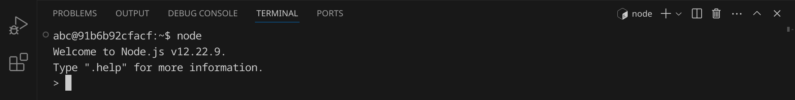
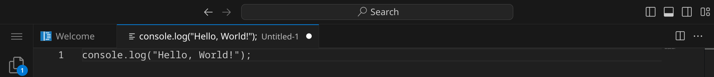
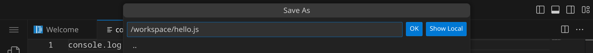
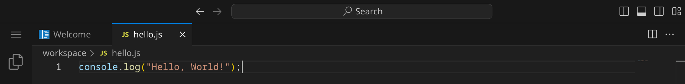
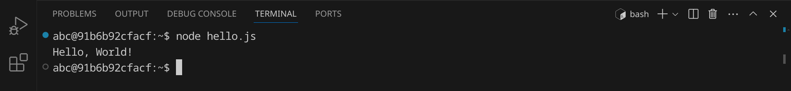
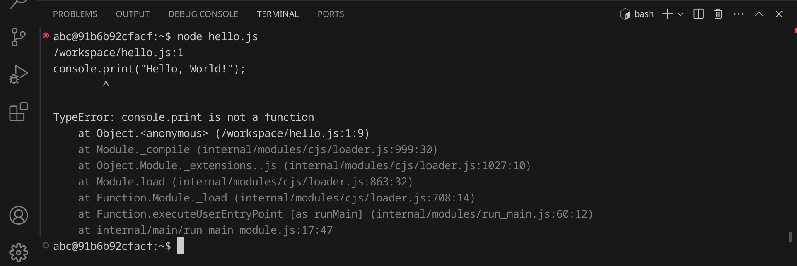
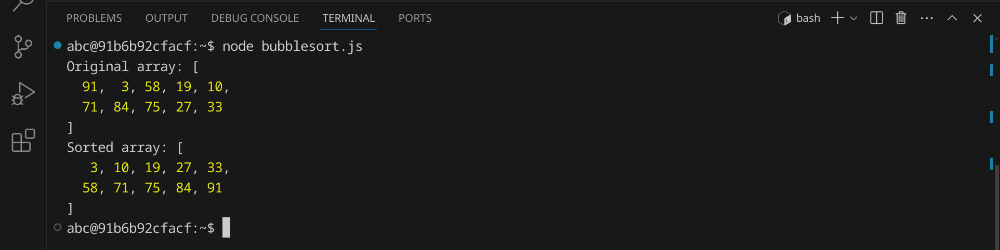

<div class='meta'>
image: js-logo.png
</div>

<div class='floatright mt-5' style='width: 12em;'>
    
    <p>
      Brendan Eich<br>
      <span style='font-size: 90%; opacity: 0.7;'>(Foto von James Duncan Davidson)</span>
    </p>
</div>

# JavaScript <span style='font-size: 80%;'>(1995)</span>

<p class='abstract'>
JavaScript ist eine der bekanntesten Programmiersprachen und wird in der Webentwicklung eingesetzt. Die Sprache wurde im Jahr 1995 von Brendan Eich entwickelt und wird für die Interaktion mit HTML-Elementen und CSS-Stilen verwendet. Inzwischen wird JavaScript auch für serverseitige Anwendungen mit Node.js eingesetzt.
</p>

<!-- ## Eigenschaften

- **Clientseitige Skriptsprache**: JavaScript ist eine clientseitige Skriptsprache, die im Webbrowser ausgeführt wird.
- **Dynamische Typisierung**: JavaScript ist eine dynamisch typisierte Sprache, was bedeutet, dass Variablen ihren Datentyp zur Laufzeit ändern können.
- **Objektorientierung**: JavaScript ist eine objektorientierte Programmiersprache, die auf der Verwendung von Objekten und Klassen basiert.
- **Webentwicklung**: JavaScript wird in der Webentwicklung eingesetzt und ermöglicht die Interaktion mit HTML-Elementen und CSS-Stilen.
- **Node.js**: Node.js ist eine serverseitige JavaScript-Laufzeitumgebung, die die Entwicklung von serverseitigen Anwendungen mit JavaScript ermöglicht.
- **Frameworks**: JavaScript hat eine Vielzahl von Frameworks und Bibliotheken, darunter React, Angular und Vue.js. -->

## Hello, world!

JavaScript wird in der Regel in Webbrowsern ausgeführt, um die Interaktion mit Webseiten zu ermöglichen. Du kannst JavaScript-Code direkt in der Entwicklerkonsole deines Browsers ausführen oder in einer HTML-Datei speichern und dann im Browser öffnen.

In diesem Kapitel wollen wir uns jedoch auf JavaScript außerhalb des Browsers konzentrieren. Dazu verwenden wir Node.js, eine serverseitige JavaScript-Laufzeitumgebung, die die Ausführung von JavaScript-Code auf einem Server ermöglicht. JavaScript ist eine Skriptsprache, was bedeutet, dass der Code zur Laufzeit interpretiert wird. Du hast zwei Möglichkeiten, JavaScript-Code auszuführen:

1. Du kannst JavaScript-Code direkt in der Node.js-Shell ausführen.
2. Du kannst JavaScript-Code in einer Textdatei speichern und dann ausführen.

**Möglichkeit 1:** JavaScript-Code in der Node.js-Shell ausführen

Öffne dazu ein Terminal, indem du entweder <span class='key'>Strg</span><span class='key'>J</span> drückst oder das Panel-Symbol  rechts oben drückst. Dein Fenster sollte jetzt ungefähr so aussehen:


Starte nun die Node.js-Shell, indem du `node` eingibst und dann <span class='key'>Enter</span> drückst. Du solltest eine Ausgabe wie diese sehen:



Jetzt kannst du JavaScript-Code direkt in der Shell eingeben und ausführen. Schreibe einfach `console.log("Hello, world!");` und drücke <span class='key'>Enter</span>. Du solltest die Ausgabe `Hello, world!` sehen.

Du kannst die Node.js-Shell wieder beenden, indem du <span class='key'>Strg</span><span class='key'>D</span> drückst.

**Möglichkeit 2:** JavaScript-Code in einer Textdatei speichern und ausführen

JavaScript-Programme werden in Textdateien mit der Endung `.js` geschrieben. Der Node.js-Interpreter liest anschließend den Quelltext und führt ihn aus.

Stelle zuerst sicher, dass du keinen Ordner geöffnet hast. Um sicherzugehen, drücke einfach den Shortcut für »Ordner schließen«: <span class='key'>Strg</span><span class='key'>K</span> und dann <span class='key'>F</span>. Dein Workspace sollte jetzt ungefähr so aussehen:


### Quelltext schreiben

Klicke auf »New File« und wähle als Dateityp »Text File« (oder bestätige einfach mit <span class='key'>Enter</span>).


Schreibe nun den folgenden Code in die Datei:

_include_file(hello.js, js)

Da Visual Studio Code noch nicht weiß, dass es sich um JavaScript-Quelltext handelt, ist dein Programm momentan noch einfarbig, aber das wird sich gleich ändern. An dem weißen Punkt erkennst du, dass deine Änderungen noch nicht gespeichert sind.



Drücke nun <span class='key'>Strg</span><span class='key'>S</span>, um die Datei zu speichern. Gib `hello.js` ein – der vollständige Pfad zu deiner Datei lautet dann `/workspace/hello.js`.



Sobald du die Datei gespeichert hast, wird sie automatisch als JavaScript-Datei erkannt und die Syntax wird hervorgehoben.



### Skript ausführen

Um unser Programm auszuführen, müssen wir den Node.js-Interpreter aufrufen und ihm den Dateinamen unseres Programms übergeben.

Öffne dazu ein Terminal, indem du <span class='key'>Strg</span><span class='key'>J</span> drückst und gib folgenden Befehl ein:

```bash
node hello.js
```

<div class='hint'>
Du musst nicht den vollständigen Dateinamen schreiben. Schreib einfach <code>node he</code> und drücke <span class='key'>Tab</span>, um den Dateinamen automatisch zu <code>hello.js</code> vervollständigen zu lassen. Du kannst danach ganz normal weiterschreiben.
</div>

Das Programm sollte die Nachricht `Hello, World!` im Terminal ausgeben:



### Fehler finden und beheben

Wenn du einen Fehler im Code machst, wird Node.js eine Fehlermeldung ausgeben. Versuche zum Beispiel, statt `log` das Wort `print` zu schreiben:

```lua
console.print("Hello, World!");
```

Speichere die Datei und führe das Skript erneut aus:

```bash
node hello.js
```

<div class='hint'>
Nutze die Pfeiltaste hoch <span class='key'>↑</span>, um den letzten Befehl erneut einzugeben. So kannst du schnell dein Programm testen, nachdem du es verändert hast.
</div>

Node.js sollte eine Fehlermeldung ausgeben, die dir hilft, den Fehler zu finden:



Es lohnt sich, die Fehlermeldungen genau zu lesen, um den Fehler zu finden und zu beheben. Achte auf die Zeilennummer (in diesem Beispiel 1) und den Text, der dir sagt, was falsch ist. Denke daran, den Fehler wieder zu beheben, bevor du das nächste Beispiel ausprobierst.

### Shebang `#!`

Bisher musst du, um dein Skript auszuführen, immer den Node.js-Interpreter explizit aufrufen. Wenn du dein Skript wie ein normales Programm ausführen möchtest, kannst du ein sogenanntes Shebang am Anfang deiner Datei hinzufügen. Das Shebang besteht aus einer Raute `#` gefolgt von einem Ausrufezeichen `!` und dem Pfad zum Lua-Interpreter. In unserem Fall sieht das so aus:

```js
#!/usr/bin/env nodejs
```

Füge diese Zeile ganz oben in deinem Skript ein und speichere die Datei. Bevor wir das Skript ausführen können, müssen wir es noch ausführbar machen. Das machen wir mit dem Befehl `chmod`:

```bash
chmod +x hello.js
```
Jetzt können wir das Skript direkt ausführen:

```bash
./hello.js
```


## Primfaktorenzerlegung

Im zweiten Beispiel wollen wir eine Zahl in ihre Primfaktoren zerlegen.
An diesem Beispiel kannst du sehen, wie man in JavaScript Benutzereingaben verarbeitet und Schleifen verwendet.
Erstelle eine neue Datei mit <span class='key'>Strg</span><span class='key'>Alt</span><span class='key'>N</span> und schreibe den folgenden Code hinein:

_include_file(factor.js, js)

Speichere die Datei unter dem Namen `factor.js` und führe sie aus:


Das Programm hat die Zahl 123 in ihre Primfaktoren zerlegt und ausgegeben. Anders als andere Programmiersprachen kann JavaScript auch die Zahl 3000000000 in Sekundenbruchteilen zerlegen. Auch mit einer sehr großen Zahl wie 123456789123456789 kommt das Programm problemlos zurecht. Falls du auf eine Zahl stoßen solltest, die so groß ist, dass das Programm sehr lange braucht, kannst du das Programm mit <span class='key'>Strg</span><span class='key'>C</span> abbrechen.

## Bubblesort

Im dritten Beispiel wollen wir eine Liste von 10 Zufallszahlen sortieren. Dafür verwenden wir den [Bubblesort-Algorithmus](https://de.wikipedia.org/wiki/Bubblesort), der zwar nicht besonders effizient ist, aber sehr einfach zu verstehen und zu implementieren. Der Bubblesort-Algorithmus funktioniert, indem er die Liste mehrmals durchläuft und benachbarte Elemente vertauscht, wenn sie in der falschen Reihenfolge sind.

An diesem Beispiel kannst du sehen, wie man in JavaScript Listen verwendet, Funktionen verwendet und Schleifen verschachtelt.

Erstelle eine neue Datei und schreibe den folgenden Code hinein:

_include_file(bubblesort.js, js)

Speichere das Skript unter dem Namen `bubblesort.js` und führe es aus:



Das Programm hat eine Liste von 10 Zufallszahlen sortiert. Versuche, den Quelltext so zu verändern, dass statt 10 Zahlen 100 oder mehr Zahlen sortiert werden.

## Zusammenfassung

In diesem Kapitel hast du an drei Beispielen gesehen, wie man ein einfaches JavaScript-Programm schreiben und ausführen kann. Das ist natürlich nur ein erster Eindruck. Um JavaScript wirklich zu beherrschen, musst du noch viel mehr lernen – am besten, indem du eigene Skripte schreibst und ausprobierst. Die Buchhandlungen, Bibliotheken und Youtube sind voll von Material für dich. Viel Spaß beim Programmieren!
