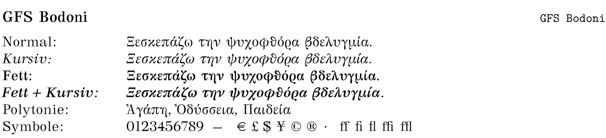
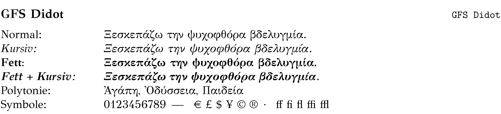
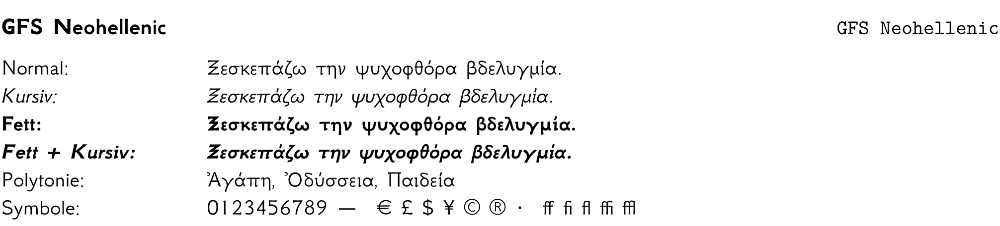

<div class='meta'>
image: latex-logo.png
</div>

# Dokumente schreiben mit LaTeX

<p class='abstract'>
LaTeX ist ein Textsatzsystem, das von Leslie Lamport entwickelt wurde und auf dem Textsatzsystem TeX von Donald E. Knuth basiert. LaTeX wird für die Erstellung von wissenschaftlichen Dokumenten, wie z. B. Abschlussarbeiten, Dissertationen und wissenschaftlichen Artikeln, eingesetzt.
</p>

extensions:
  - latex
  - unzip

https://www.latextemplates.com/template/tufte-essay
https://www.latextemplates.com/template/drake-certificate
https://www.teuderun.de/latex/vorlagen-downloads/vorlagen-latex/

- Drehbuch
- Gedicht
- Wörterbuch
- Lebenslauf
- Lehrbuch

## Schriftarten

### Klassiker (typisches LaTeX-Aussehen)

Diese Schriftarten sind die klassischen LaTeX-Schriftarten, die oft in wissenschaftlichen Arbeiten verwendet werden. Sie sind gut lesbar und haben ein traditionelles Aussehen.

Achte auf den Bezeichner rechts oben im Bild - um z. B. `Latin Modern Roman` zu verwenden, musst du folgende Befehle in deinem LaTeX-Dokument verwenden:

```tex
\setmainfont{Latin Modern Roman}
```


### Buch- und Textschriften (für längere Texte)

Diese Schriftarten sind gut geeignet für längere Texte, wie z. B. Bücher oder Berichte. Sie sind angenehm zu lesen und haben ein professionelles Aussehen.


### Moderne serifenlose Schriften (Arbeitsblätter, Präsentationen)

Diese Schriftarten sind modern und serifenlos, was sie gut geeignet macht für Arbeitsblätter, Präsentationen oder andere Dokumente, die ein zeitgemäßes Aussehen erfordern.


### Monospace-Schriften

Monospace-Schriften sind Schriftarten, bei denen jedes Zeichen die gleiche Breite hat. Sie werden oft für Code, Terminal-Ausgaben und Informatik-Dokumente verwendet.


### Kreative Schriftarten (für Überschriften, Plakate)

Diese Schriftarten sind kreativ und gut lesbar, was sie ideal macht für Überschriften, Plakate oder andere Dokumente, die Aufmerksamkeit erregen sollen.


### Schriftarten mit griechischer Unterstützung

Die Greek Font Society (GFS) stellt eine Reihe von Schriftarten bereit, die speziell für die Darstellung griechischer Texte entwickelt wurden.






### Schriftarten mit mathematischer Unterstützung

In LaTeX wird unterschieden zwischen Text- und Mathe-Schriftarten. Für mathematische Formeln werden spezielle Schriftarten benötigt, die mathematische Symbole und Zeichen unterstützen. Hier sind einige Schriftarten, die sowohl für den Text als auch für mathematische Formeln geeignet sind.

Achte auf die Bezeichner rechts oben im Bild - um z. B. `Latin Modern Roman` und `Latin Modern Math` zu verwenden, musst du folgende Befehle in deinem LaTeX-Dokument verwenden:

```tex
\setmainfont{Latin Modern Roman}
\setmathfont{Latin Modern Math}
```


