<div class='meta'>
image: latex-logo.png
</div>

<div
    class="autotoc-secondary-trigger"
    data-title="Auf dieser Seite"
    data-levels="h2,h3,h4">
</div>


# Dokumente schreiben mit LaTeX

<p class='abstract'>
In diesem Tutorial lernst du LaTeX kennen – ein Werkzeug, mit dem man Texte nicht „zusammenschiebt“, sondern strukturiert beschreibt.
Anstatt Schriftgrößen, Abstände und Formatierungen per Hand einzustellen, sagst du LaTeX, was etwas ist (Überschrift, Absatz, Tabelle, Formel) – und LaTeX kümmert sich darum, wie es aussieht.
</p>

LaTeX wird häufig an Universitäten, in der Wissenschaft und bei technischen Berufen verwendet, zum Beispiel für Protokolle, Facharbeiten, Präsentationen oder Bewerbungen. Aber auch für die Schule ist es sehr praktisch: Texte sehen automatisch ordentlich aus, Formeln sind klar lesbar, und Änderungen wirken sich sofort auf das ganze Dokument aus.

In diesem Tutorial lernst du die Grundlagen von LaTeX anhand einer **Bewerbung**, eines **Lebenslaufs** und einer **schriftlichen Ausarbeitung** kennen.

Stelle zuerst sicher, dass du keinen Ordner geöffnet hast. Um sicherzugehen, drücke einfach den Shortcut für »Ordner schließen«: <kbd>Strg</kbd><kbd>K</kbd> und dann <kbd>F</kbd>. Dein Workspace sollte jetzt ungefähr so aussehen:

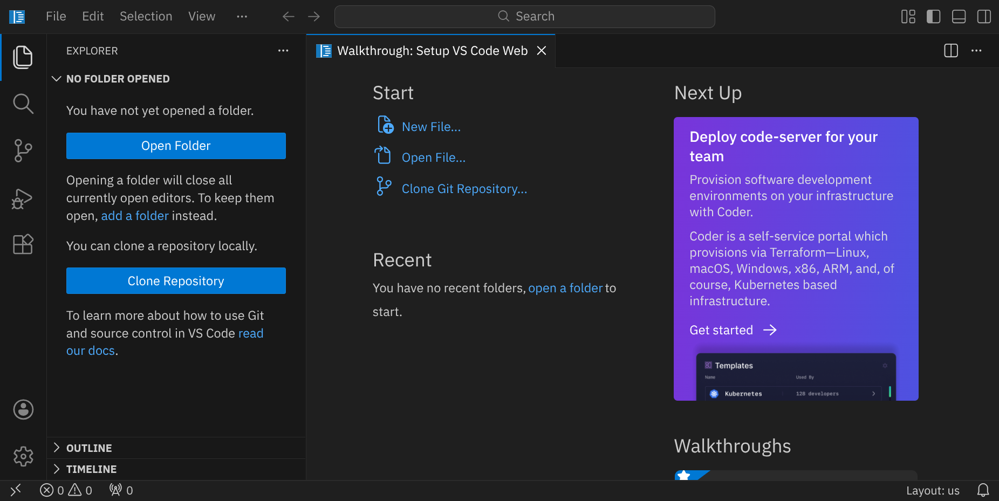

## Repository klonen

Für diese Anleitung brauchst du ein Repository, das du klonen kannst, indem du auf den blauen Button »Clone Repository« klickst. Gib die folgende URL ein und bestätige mit <kbd>Enter</kbd>:

```bash
https://github.com/specht/latex-tutorial.git
```

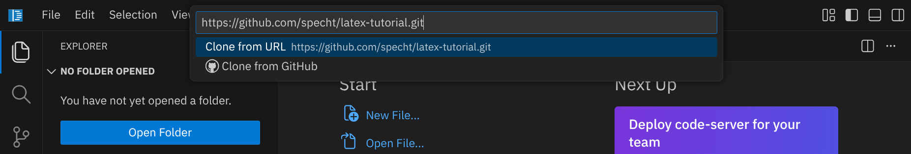

Als nächstes musst du angeben, in welches Verzeichnis du das Repository klonen möchtest. Bestätige den Standardpfad `/workspace/` mit <kbd>Enter</kbd>.

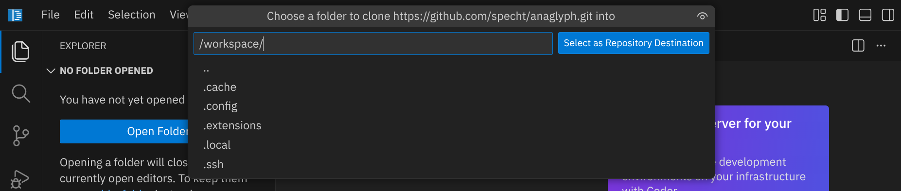

Beantworte die Frage »Would you like to open the repository?« mit »Open«.

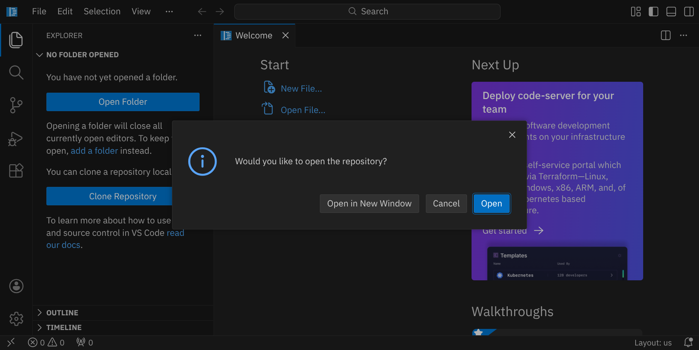

## LaTeX Workshop installieren

Um uns die Arbeit mit LaTeX zu erleichtern, verwenden wir die Erweiterung »LaTeX Workshop«. Diese Erweiterung bietet viele nützliche Funktionen, wie z. B. das automatische Compilieren von LaTeX-Dokumenten, Syntaxhervorhebung und Vorschauen. Klicke dazu auf das Extensions-Symbol  in der Seitenleiste und suche nach »LaTeX Workshop«. Klicke auf »Install«, um die Erweiterung zu installieren.

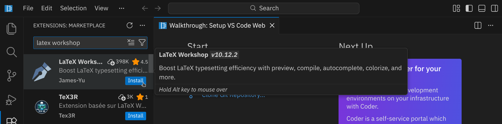

Wechsle nun wieder zurück zum Explorer, indem du auf das Explorer-Symbol  in der Seitenleiste klickst. Öffne als erstes die Datei `hello.tex`. Diese Datei enthält ein einfaches LaTeX-Dokument, das du als Ausgangspunkt verwenden kannst. Schau dir den Inhalt der Datei an und versuche zu verstehen, was die verschiedenen Teile bedeuten:

_include_file(hello.tex, tex)

Rechts oben findest du einen kleinen Button: »Build LaTeX project« 
. Drücke diesen Button, um dein LaTeX-Dokument zu compilieren (oder drücke <kbd>Strg</kbd><kbd>Alt</kbd><kbd>B</kbd>). Währenddessen siehst du unten in der Zeile den Fortschritt der Compilierung (<i class='bi bi-arrow-repeat bi-spin'></i> Build), und wenn die compilierung abgeschlossen ist, siehst du ein grünes Häkchen (<i class='bi bi-check-lg'></i>):

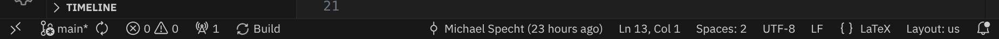

Wenn die compilierung erfolgreich war, solltest du eine
PDF-Datei namens `hello.pdf` im selben Verzeichnis sehen. Klicke anschließend auf den Button rechts oben: »View LaTeX PDF file«
 oder verwende den Shortcut <kbd>Strg</kbd><kbd>Alt</kbd><kbd>V</kbd>, um die PDF-Datei neben deinem LaTeX-Quelltext anzuzeigen:

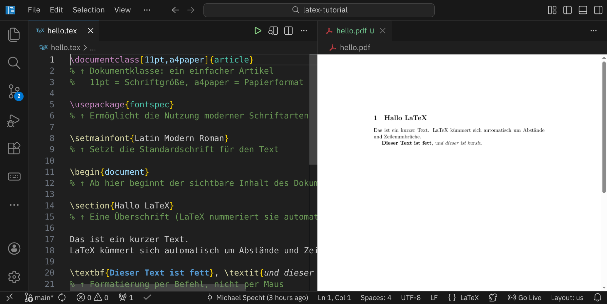

Das Dokument sieht noch nicht besonders spektakulär aus, deswegen schauen wir uns jetzt das nächste Dokument an: die Bewerbung.

## Bewerbung

Öffne als nächstes die Datei `Bewerbung.tex`. Diese Datei enthält eine Vorlage für eine Bewerbung, die du anpassen kannst. Wenn du die Datei compilierst und die PDF-Datei anschaust, sollte sie ungefähr so aussehen:

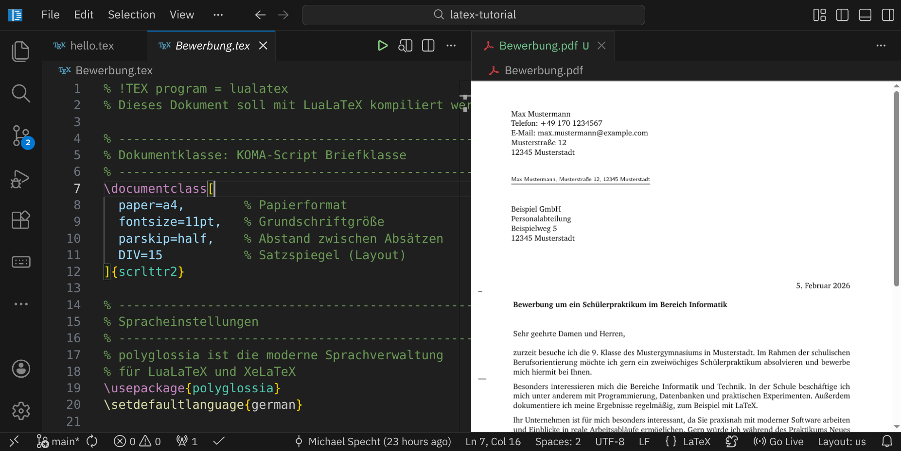

Schau dir den Inhalt der LaTeX-Datei an und versuche zu verstehen, wie die verschiedenen Teile funktionieren. Du kannst die Vorlage an deine eigenen Bedürfnisse anpassen, indem du die entsprechenden Informationen änderst.

Versuche als nächstes die Schriftart in der Bewerbung zu ändern, indem du in der Zeile `\setmainfont{XCharter}` die Schriftart `XCharter` durch eine andere Schriftart ersetzt. Welche Schriftarten du verwenden kannst, erfährst du im nächsten Abschnitt.

## Schriftarten

In LaTeX kannst du verschiedene Schriftarten verwenden, um dein Dokument ansprechender zu gestalten. Es gibt viele verschiedene Schriftarten, die du verwenden kannst, und jede hat ihren eigenen Stil und Charakter. In diesem Abschnitt findest du eine kleine Auswahl an Schriftarten, die besonders gut für LaTeX-Dokumente geeignet sind.

### Klassiker (typisches LaTeX-Aussehen)

Diese Schriftarten sind die klassischen LaTeX-Schriftarten, die oft in wissenschaftlichen Arbeiten verwendet werden. Sie sind gut lesbar und haben ein traditionelles Aussehen.

Achte auf den Bezeichner rechts oben im Bild - um z. B. `Latin Modern Roman` zu verwenden, musst du folgende Befehle in deinem LaTeX-Dokument verwenden:

```tex
\setmainfont{Latin Modern Roman}
```

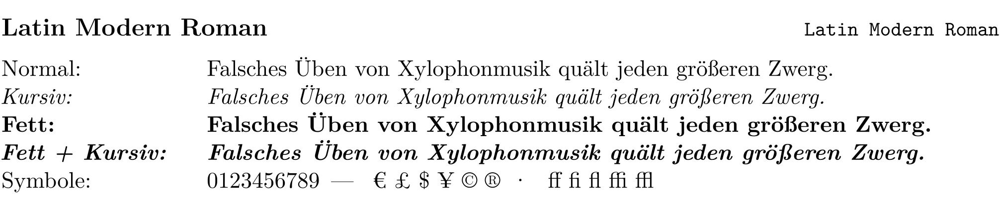
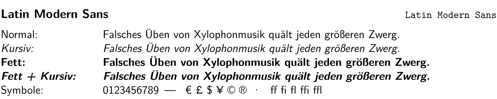
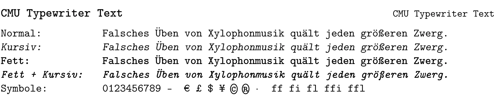

### Buch- und Textschriften (für längere Texte)

Diese Schriftarten sind gut geeignet für längere Texte, wie z. B. Bücher oder Berichte. Sie sind angenehm zu lesen und haben ein professionelles Aussehen.

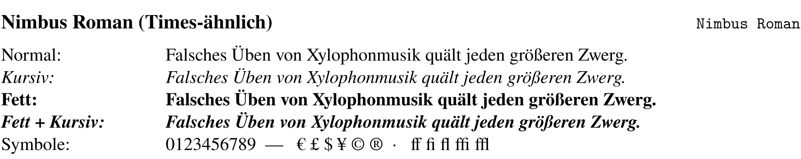
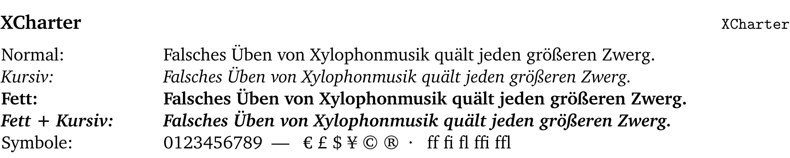
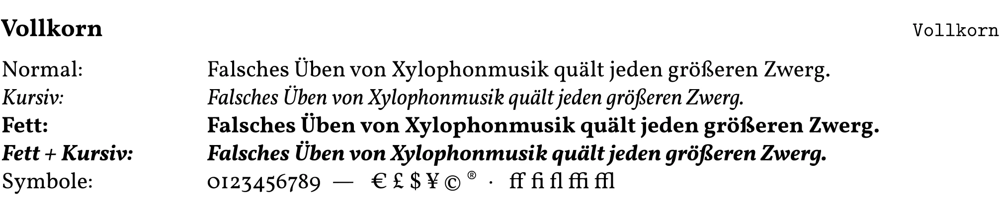

### Moderne serifenlose Schriften (Arbeitsblätter, Präsentationen)

Diese Schriftarten sind modern und serifenlos, was sie gut geeignet macht für Arbeitsblätter, Präsentationen oder andere Dokumente, die ein zeitgemäßes Aussehen erfordern.

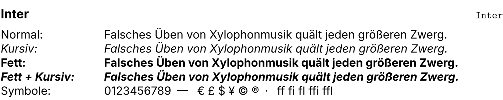
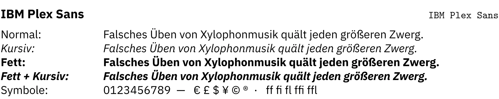
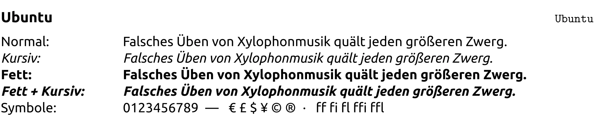

### Monospace-Schriften

Monospace-Schriften sind Schriftarten, bei denen jedes Zeichen die gleiche Breite hat. Sie werden oft für Code, Terminal-Ausgaben und Informatik-Dokumente verwendet.

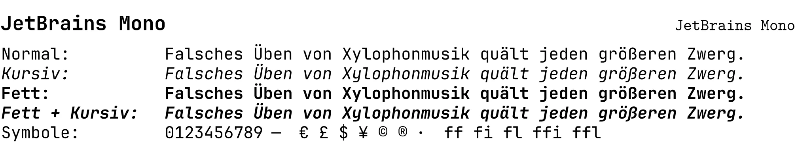
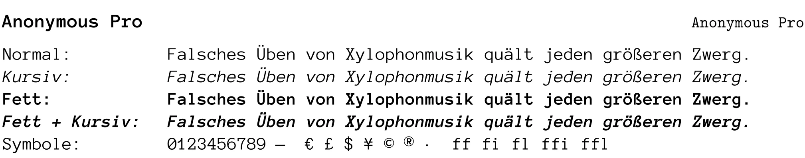
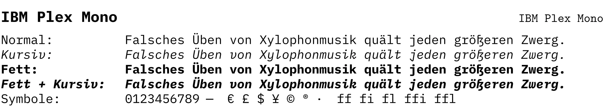

### Kreative Schriftarten (für Überschriften, Plakate)

Diese Schriftarten sind kreativ und gut lesbar, was sie ideal macht für Überschriften, Plakate oder andere Dokumente, die Aufmerksamkeit erregen sollen.

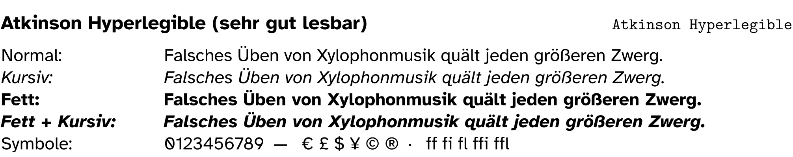
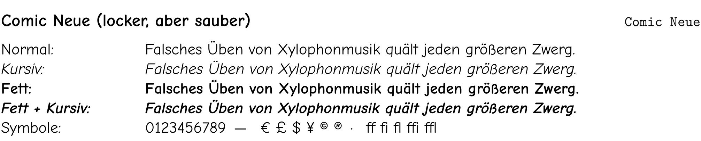
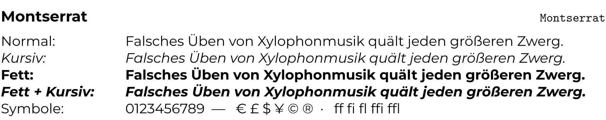
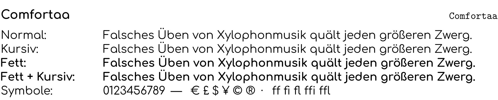

### Schriftarten mit mathematischer Unterstützung

In LaTeX wird unterschieden zwischen Text- und Mathe-Schriftarten. Für mathematische Formeln werden spezielle Schriftarten benötigt, die mathematische Symbole und Zeichen unterstützen. Hier sind einige Schriftarten, die sowohl für den Text als auch für mathematische Formeln geeignet sind.

Achte auf die Bezeichner rechts oben im Bild - um z. B. `Latin Modern Roman` und `Latin Modern Math` zu verwenden, musst du folgende Befehle in deinem LaTeX-Dokument verwenden:

```tex
\setmainfont{Latin Modern Roman}
\setmathfont{Latin Modern Math}
```

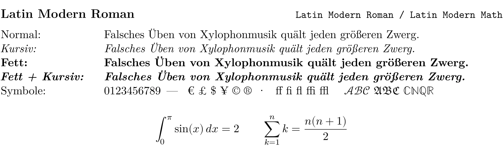
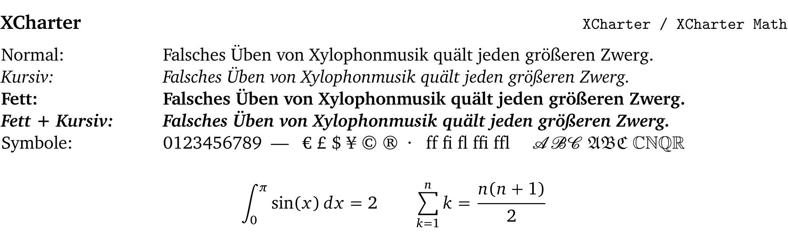
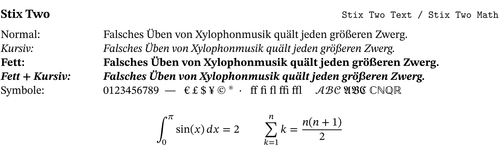
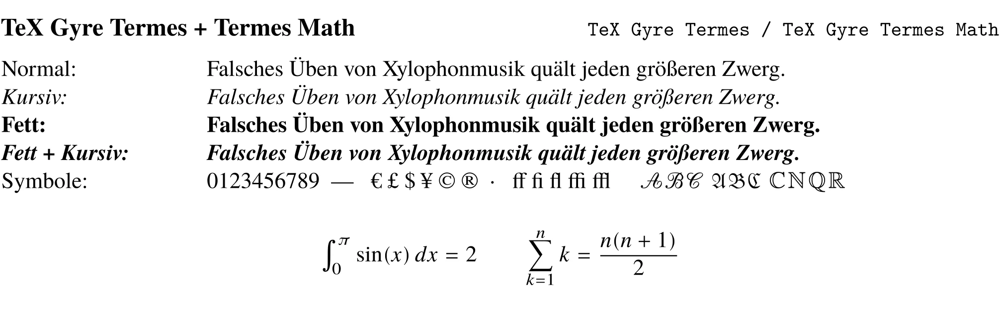
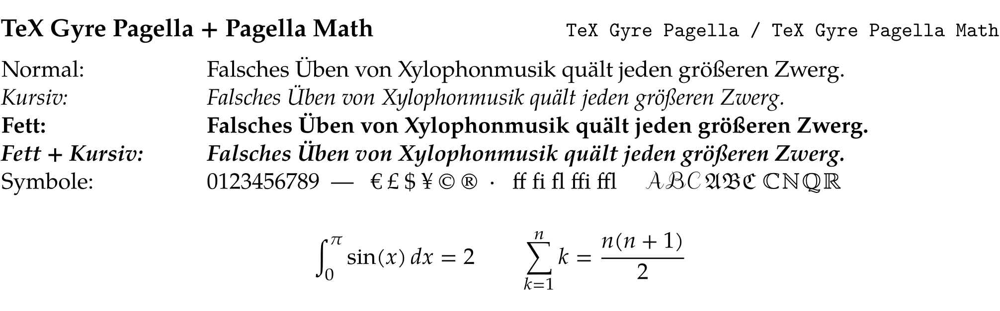
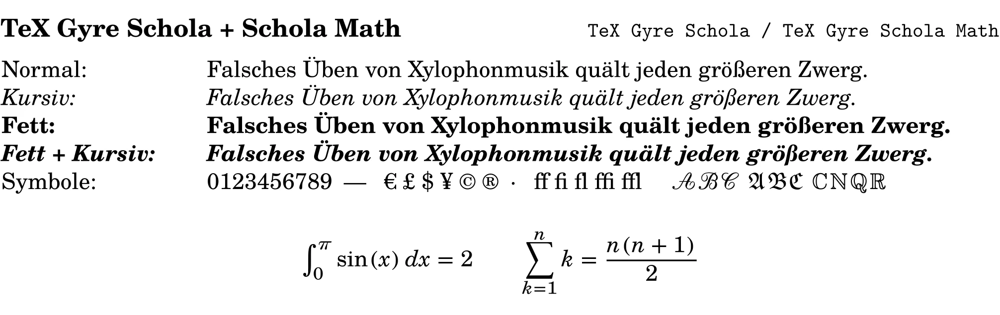
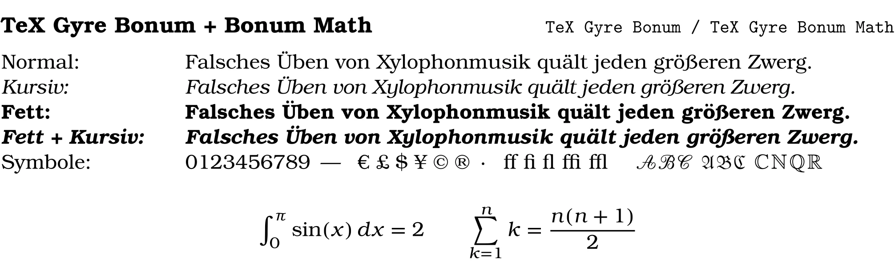

<div class='hint'>
Du kannst auch eigene Schriftarten verwenden, wenn du die entsprechenden Schriftdateien (z. B. .ttf oder .otf) hast.
</div>

## Lebenslauf

In der Datei `CV.tex` findest du eine Vorlage für einen Lebenslauf, die du anpassen kannst. Wenn du die Datei compilierst und die PDF-Datei anschaust, sollte sie ungefähr so aussehen:

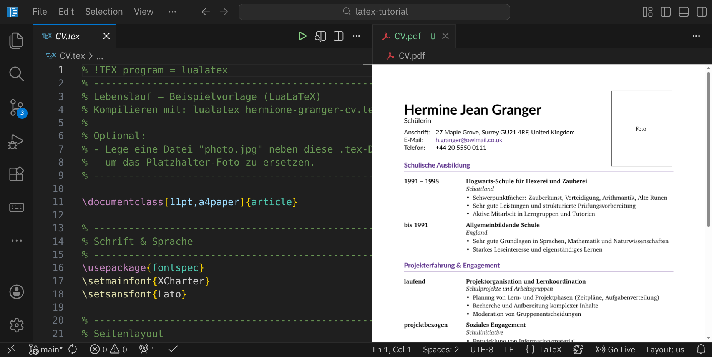

Wenn du eine Datei `photo.jpg` im selben Verzeichnis hast, wird sie automatisch in den Lebenslauf eingebunden.

## Schriftliche Ausarbeitung

Falls du eine schriftliche Ausarbeitung oder einen Bericht schreiben musst, kannst du die Vorlage in der Datei `Ausarbeitung.tex` verwenden. Diese Vorlage enthält bereits eine Struktur für eine wissenschaftliche Arbeit, einschließlich Titelblatt, Inhaltsverzeichnis, Abschnitte und Literaturverzeichnis. Wenn du die Datei compilierst und die PDF-Datei anschaust, sollte sie ungefähr so aussehen:

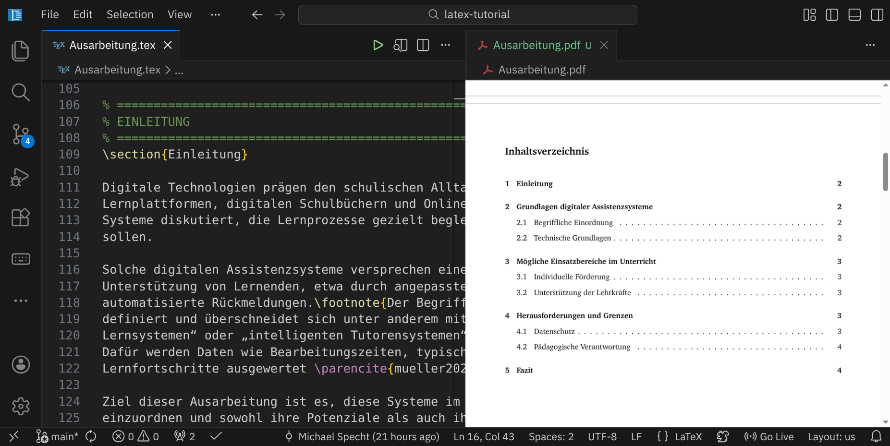

Der Befehl `\setstretch{1.2}` sorgt dafür, dass der Zeilenabstand auf 1,2-fach eingestellt ist, was die Lesbarkeit verbessert. Du kannst diesen Wert anpassen, um den Zeilenabstand nach deinen Bedürfnissen zu ändern.

Zur Ausarbeitung gehört auch ein Literaturverzeichnis. In der Vorlage wird das Literaturverzeichnis mit dem Befehl `\printbibliography` erstellt, und die Literaturangaben werden in der Datei `litatur.bib` gespeichert, die im BibTeX-Format geschrieben ist:

_include_file(literatur.bib, bibtex)

In dieser Datei kannst du deine Literaturangaben hinzufügen, indem du die entsprechenden Einträge im BibTeX-Format erstellst. Anschließend kannst du die Literaturangaben in deinem LaTeX-Dokument mit dem Befehl `\cite{}` zitieren, wobei du den Schlüssel des Eintrags in der `literatur.bib`-Datei angibst:

- `\textcite{mueller2022}`: Zitiert die Quelle mit dem Schlüssel `mueller2022` und zeigt die Zitatangabe im Fließtext an, z. B. Müller (2022).
- `\parencite{schmidt2023}`: Zitiert die Quelle mit dem Schlüssel `schmidt2023` und zeigt die Zitatangabe in Klammern an, z. B. (Schmidt, 2023).

## Mathematische Formeln

Ein Bereicht, in dem LaTeX besonders glänzt, ist die Darstellung von mathematischen Formeln. LaTeX bietet eine Vielzahl von Möglichkeiten, um komplexe mathematische Ausdrücke klar und professionell darzustellen. In der Datei `Mathe.tex` findest du bereits einige Beispiele für mathematische Formeln, die du anpassen und erweitern kannst:

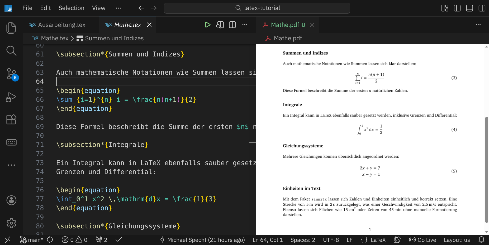

## Ein ganzes Buch

Zum Abschluss dieses Tutorials findest du in der Datei `wpgtr.tex` eine LaTeX-Datei für ein ganzes Buch: »Why's (Poignant) Guide to Ruby« von [*\_why the lucky stiff*](https://tmewett.com/whytheluckystiff/). Diese Datei enthält die gesamte Struktur eines Buches, einschließlich Inhaltsverzeichnis, Kapiteln, Bildern und Formatierungen. Wenn du die Datei compilierst und die PDF-Datei anschaust, sollte sie ungefähr so aussehen:

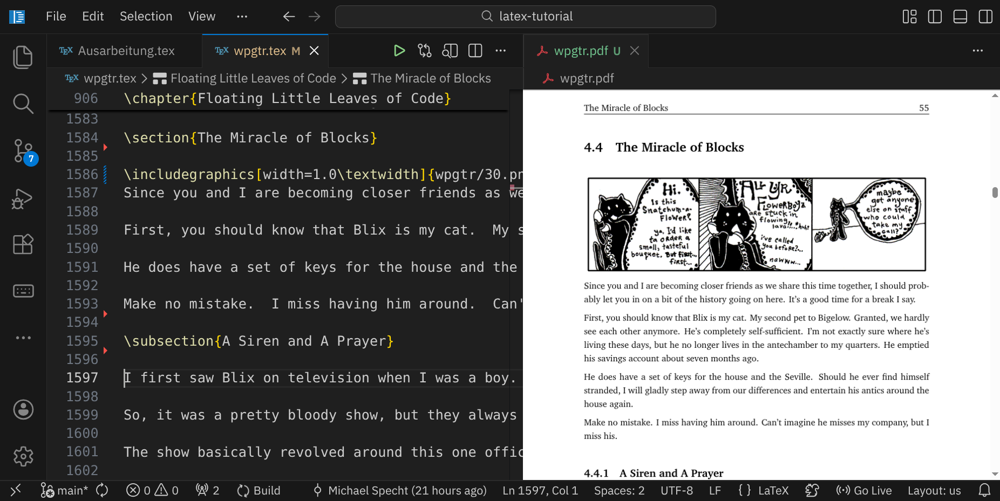