<div class='meta'>
image: select-land.webp:25:0
</div>

<div
    class="autotoc-secondary-trigger"
    data-title="Auf dieser Seite"
    data-levels="h2,h3">
</div>

# Einführung in SQL

<p class='abstract'>
In diesem Kapitel lernst du, wie du MySQL-Da­ten­ban­ken abfragen kannst. Dazu verwenden wir SQL, die Structured Query Language. Wir beginnen mit einfachen Abfragen und kombinieren die einzelnen Bausteine anschließend zu eigenen Fragen an die Daten.
</p>

Stelle zuerst sicher, dass du keinen Ordner geöffnet hast. Um sicherzugehen, drücke einfach den Shortcut für »Ordner schließen«: <kbd>Strg</kbd><kbd>K</kbd> und dann <kbd>F</kbd>. Dein Workspace sollte jetzt ungefähr so aussehen:

<!-- tutorial-screenshot
# Workspace ohne geöffneten Ordner
show-left-sidebar
-->

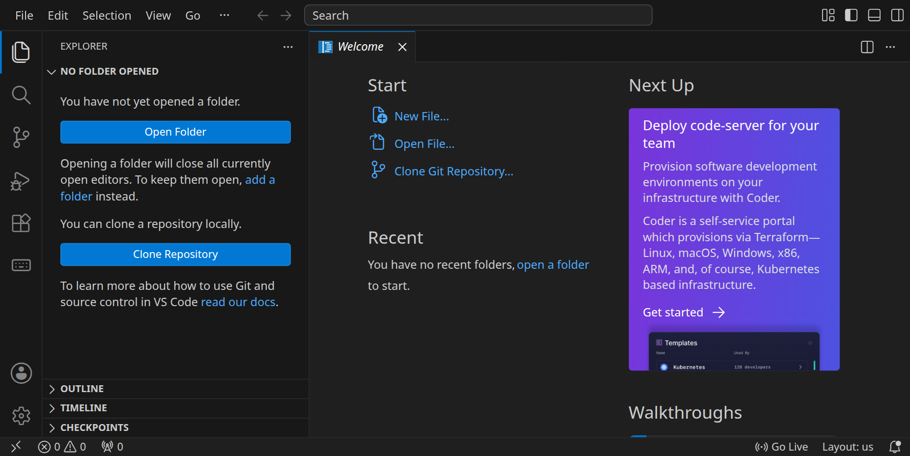

Wir erstellen nun ein Verzeichnis für unser MySQL-Experiment. Klicke dazu auf »Open Folder« und gib `mysql-terra` ein:

<!-- tutorial-screenshot
press: Control+K
press: Control+O
wait-for-input-value: /workspace/
type: mysql-terra
crop-bottom: 55%
-->

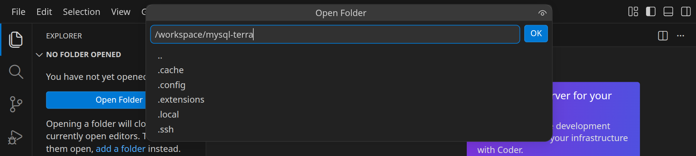

Da das Verzeichnis noch nicht existiert, wirst du gefragt, ob das Verzeichnis erstellt werden soll. Bestätige die Frage mit <kbd>Enter</kbd>:

<!-- tutorial-screenshot
press: Enter
wait-for-text: create it
crop-bottom: 83%
-->

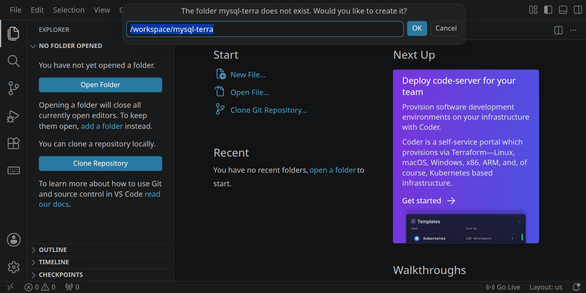

Öffne anschließend das Terminal:

<!-- tutorial-screenshot
press: Enter
sleep: 1
click: Next Up
terminal-open
-->

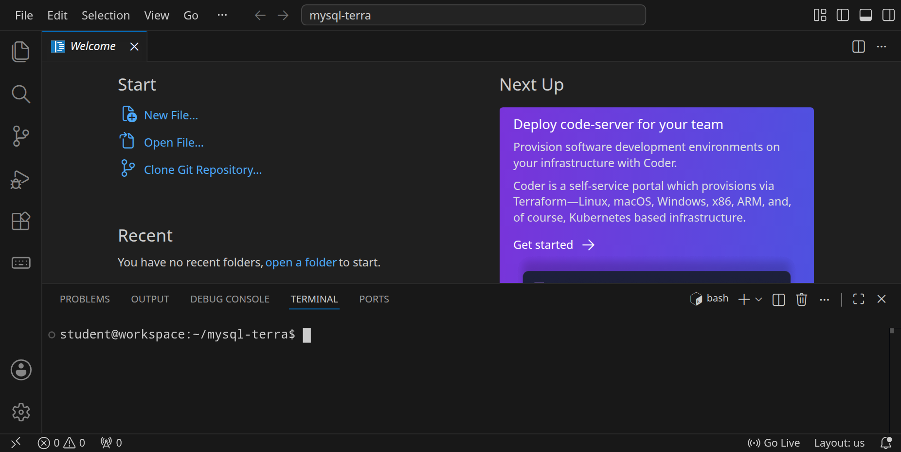

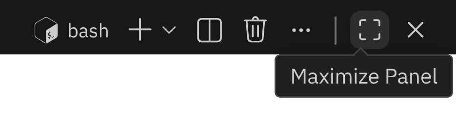

Du kannst das Terminal auch maximieren, indem du auf das Symbol in der rechten oberen Ecke des Terminals klickst.

## Beispieldaten laden

Um MySQL kennenzulernen, benötigen wir eine Datenbank. Wir verwenden die Beispieldatenbank `terra1`, die du dir herunterladen kannst, indem du folgenden Befehl eingibst:

```bash
wget https://github.com/specht/workspace-files/raw/main/terra1.sql
```

Die Ausgabe sollte in etwa so aussehen:

<!-- tutorial-screenshot
terminal-maximize
terminal-run: clear
terminal-run: wget https://github.com/specht/workspace-files/raw/main/terra1.sql
terminal-wait-for-prompt
wait-for-file: mysql-terra/terra1.sql
sleep: 0.51
-->

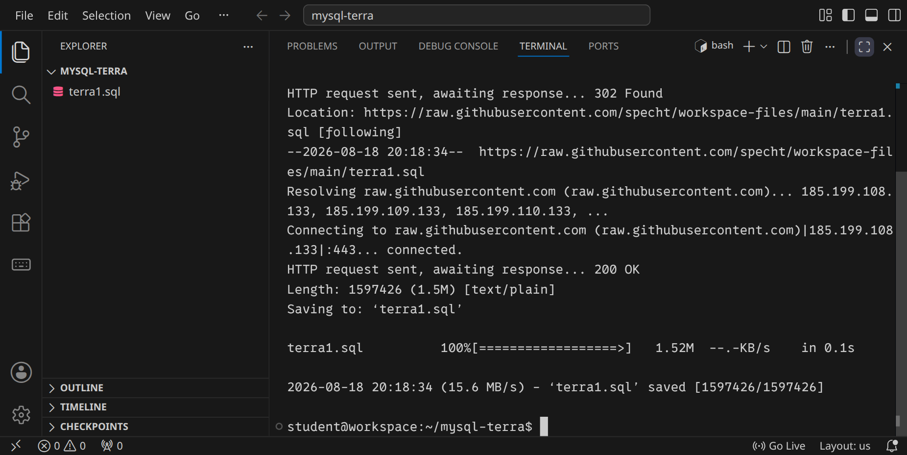

Klicke auf die Datei, um sie zu öffnen. Es befinden sich Daten zu Ländern und Städten darin.

<!-- tutorial-screenshot
open-file: terra1.sql
press: Control+G
press: 2
press: 3
press: 7
press: 7
press: Enter
press: Control+J
sleep: 0.5
-->

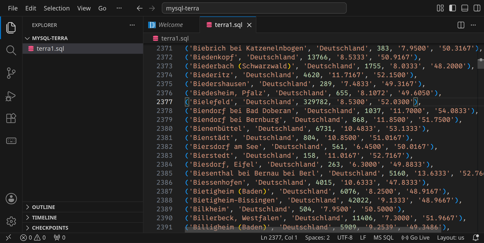

Um die Beispieldatenbank in MySQL zu importieren, gib einfach den folgenden Befehl ein:

```bash
mysql < terra1.sql
```

Der Import geht relativ schnell und wenn alles geklappt hat, solltest du keine Ausgabe sehen:

<!-- tutorial-screenshot
press: Control+B
press: Control+J
terminal-maximize
terminal-run: clear
terminal-run: mysql < terra1.sql
terminal-wait-for-prompt
sleep: 0.5
crop-terminal-lines: auto
-->

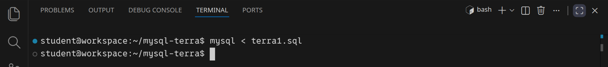

## Die Datenbank erkunden

Um mit MySQL zu arbeiten, verwenden wir `mycli`, einen MySQL-Client, der speziell für die Kommandozeile entwickelt wurde. Starte `mycli`, indem du den folgenden Befehl eingibst:

```bash
mycli
```

Die Ausgabe sollte in etwa so aussehen:

<!-- tutorial-screenshot
terminal-run: clear
terminal-run: mycli
sleep: 0.5
crop-terminal-lines: auto
crop-terminal-skip-bottom: 1
-->

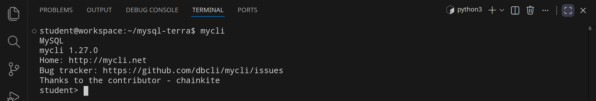

Um dir die Tabellen in der Datenbank anzeigen zu lassen, gib den Befehl `SHOW TABLES;` ein und drücke <kbd>Enter</kbd>:

<!-- tutorial-screenshot
press: Control+L
type: SHOW TABLES;
press: Enter
sleep: 0.5
crop-terminal-lines: auto
crop-terminal-skip-bottom: 1
-->

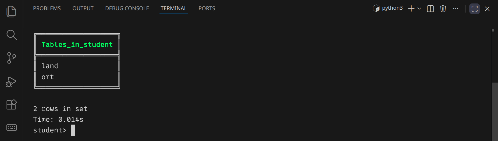

Du siehst die beiden Tabellen `land` und `ort`.

<div class='hint'>
SQL-Befehle schreiben wir in diesem Tutorial zur besseren Les­bar­keit in Großbuchstaben. Für MySQL spielt die Groß- und Kleinschreibung der hier ver­wen­deten SQL-Schlüsselwörter keine Rolle.
</div>

Mit `DESCRIBE` kannst du untersuchen, welche Spalten eine Tabelle besitzt:

```sql
DESCRIBE land;
```

<!-- tutorial-screenshot
press: Control+L
type: DESCRIBE land;
press: Enter
sleep: 0.5
terminal-scroll-back: 2
crop-terminal-lines: auto
crop-terminal-skip-bottom: 1
-->

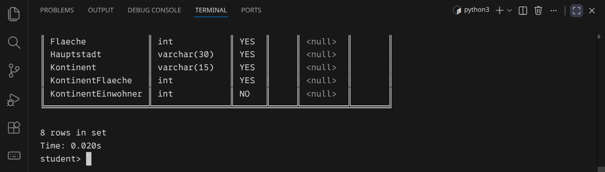

Jede Spalte hat einen Namen und einen Datentyp. So erkennst du, welche Informationen in der Tabelle gespeichert werden.

<div class='hint task'>
Untersuche auch die Tabelle <code>ort</code> &ndash; welche Spalten gibt es und welche Datentypen haben sie?
</div>

## Daten mit SELECT anzeigen

Mit `SELECT` fragst du Daten aus einer Tabelle ab. Ein Stern `*` steht dabei für alle Spalten:

```sql
SELECT * FROM land;
```

<!-- tutorial-screenshot
press: Control+L
type: SELECT * FROM land;
press: Enter
sleep: 0.5
-->

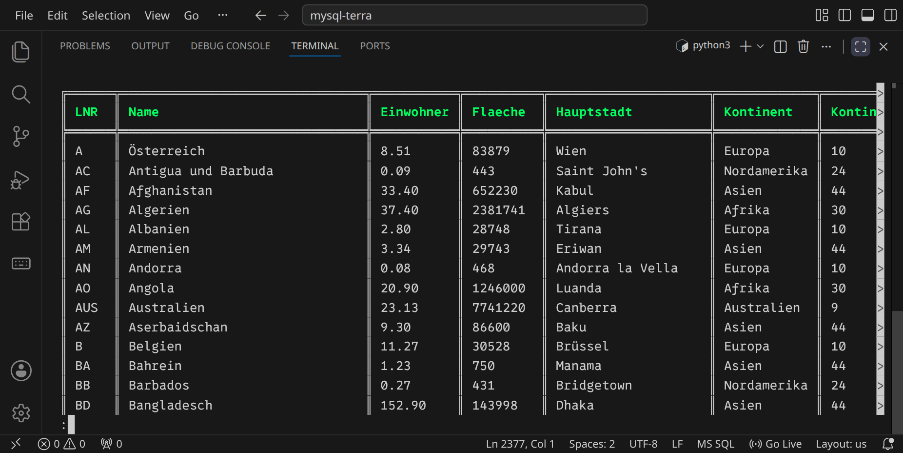

Du siehst nun alle Einträge in der Tabelle `land`. Eine Zeile entspricht einem Land in der Tabelle. Nutze die Pfeiltasten <kbd>←</kbd><kbd>↑</kbd><kbd>→</kbd><kbd>↓</kbd> sowie <kbd>Bild↑</kbd><kbd>Bild↓</kbd>, um durch die Ausgabe zu navigieren.

<div class='hint'>
Bei langen Ergebnissen zeigt <code>mycli</code> die Ausgabe seitenweise an. Drücke <kbd>Q</kbd>, um zur SQL-Eingabe zurückzukehren.
</div>

Meistens brauchst du nicht alle Spalten. Schreibe die gewünschten Spaltennamen hinter `SELECT`, zum Beispiel:

```sql
SELECT name, hauptstadt FROM land;
```

<!-- tutorial-screenshot
press: Q
press: Control+L
type: SELECT name, hauptstadt FROM land;
press: Enter
sleep: 0.5
-->

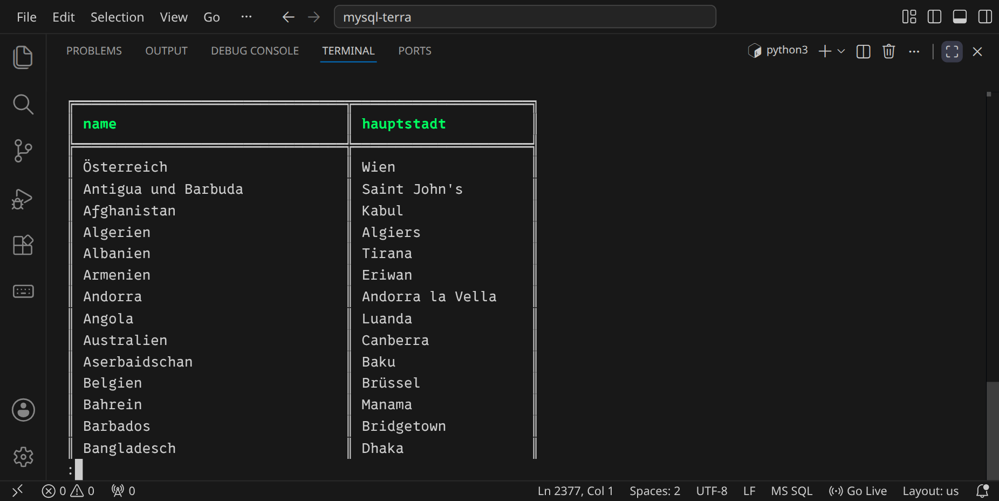

## Zeilen mit WHERE filtern

Mit `WHERE` wählst du nur die Zeilen aus, die eine Bedingung erfüllen:

```sql
SELECT * FROM land WHERE name = 'Deutschland';
```

<!-- tutorial-screenshot
press: Q
press: Control+L
type: SELECT * FROM land WHERE name = 'Deutschland';
press: Enter
sleep: 0.5
crop-terminal-lines: auto
crop-terminal-skip-bottom: 1
-->

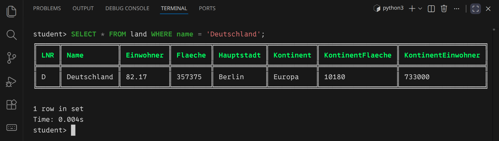

Texte stehen in SQL in einfachen Anführungszeichen, zum Beispiel `'Deutschland'`.

<div class='hint task'>
Wie viele Einwohner hat Griechenland? Welche Zahl erhältst du und wie ist sie zu interpretieren?
</div>

Bedingungen lassen sich kombinieren. Mit `AND` müssen beide Bedingungen erfüllt sein:

```sql
SELECT * FROM land
WHERE einwohner < 5 AND flaeche > 1000000;
```

<!-- tutorial-screenshot
press: Control+L
type: SELECT * FROM land WHERE einwohner < 5 AND flaeche > 1000000;
press: Enter
sleep: 0.5
press: Q
crop-terminal-lines: auto
crop-terminal-skip-bottom: 1
-->

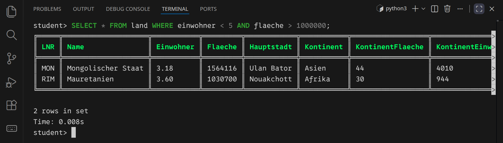

Das Ergebnis enthält genau die Länder, die beide Bedingungen erfüllen. Mit OR genügt dagegen eine der Bedingungen, zum Beispiel:

```sql
SELECT name FROM land
WHERE kontinent = 'Europa' OR kontinent = 'Asien';
```

<!-- tutorial-screenshot
press: Control+L
type: SELECT * FROM land WHERE kontinent = 'Europa' OR kontinent = 'Asien';
press: Enter
sleep: 0.5
-->

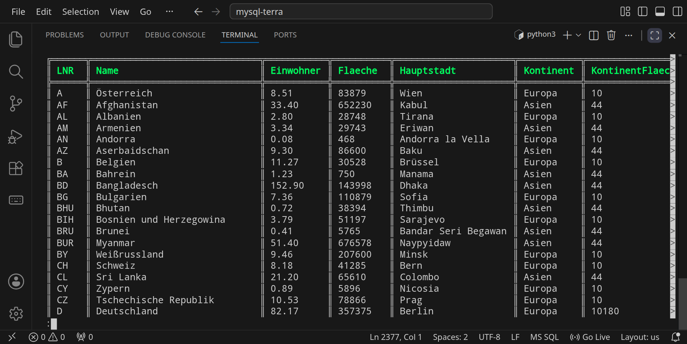


## Zeilen mit ORDER BY sortieren

Mit `ORDER BY` sortierst du ein Abfrageergebnis. Ohne weitere Angabe wird aufsteigend sortiert:

```sql
SELECT * FROM land ORDER BY einwohner;
```

<!-- tutorial-screenshot
press: Q
press: Control+L
type: SELECT * FROM land ORDER BY einwohner;
press: Enter
sleep: 0.5
-->

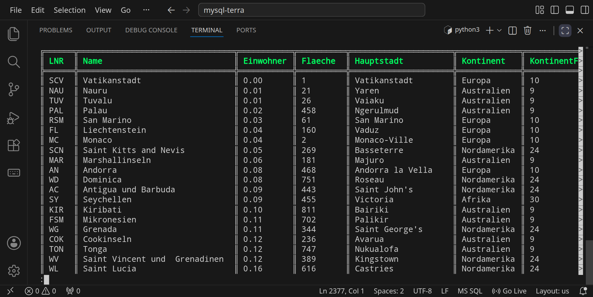

Für eine absteigende Sortierung ergänzt du DESC:

```sql
SELECT * FROM land ORDER BY einwohner DESC;
```

<!-- tutorial-screenshot
press: Q
press: Control+L
type: SELECT * FROM land ORDER BY einwohner DESC;
press: Enter
sleep: 0.5
-->

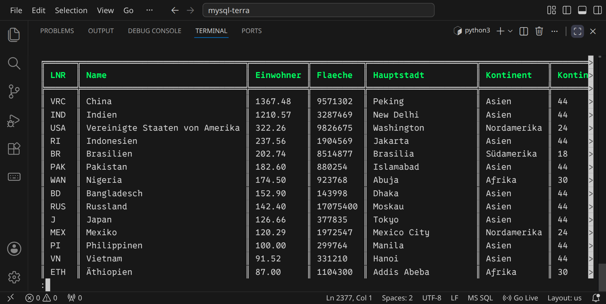

## Ausgabe mit LIMIT begrenzen

Mit `LIMIT` begrenzt du die Anzahl der ausgegebenen Zeilen:

```sql
SELECT * FROM land LIMIT 5;
```

<!-- tutorial-screenshot
press: Q
press: Control+L
type: SELECT * FROM land LIMIT 5;
press: Enter
sleep: 0.5
press: Q
terminal-scroll-back: 1
crop-terminal-lines: auto
crop-terminal-skip-bottom: 1
-->

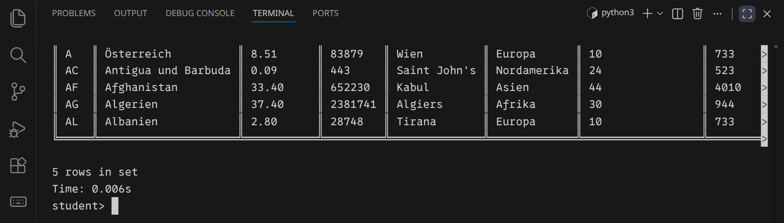

`ORDER BY` und `LIMIT` lassen sich gut kombinieren. Damit kannst du zum Beispiel nach einer Spalte sortieren und anschließend nur die ersten zehn Treffer ausgeben.

## Zeilen mit COUNT zählen

`COUNT(*)` zählt, wie viele Zeilen ein Abfrageergebnis enthält:

```sql
SELECT COUNT(*) FROM land;
```

<!-- tutorial-screenshot
press: Control+L
terminal-run: SELECT COUNT(*) FROM land;
sleep: 0.5
crop-terminal-lines: auto
crop-terminal-skip-bottom: 1
-->

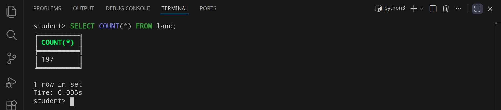

Auch `COUNT` kannst du mit `WHERE` kombinieren. So lässt sich zum Beispiel zählen, wie viele Datensätze eine bestimmte Bedingung erfüllen:

```sql
SELECT COUNT(*) FROM land WHERE kontinent = 'Asien';
```

<!-- tutorial-screenshot
press: Control+L
terminal-run: SELECT COUNT(*) FROM land WHERE kontinent = 'Asien';
sleep: 0.5
crop-terminal-lines: auto
crop-terminal-skip-bottom: 1
-->

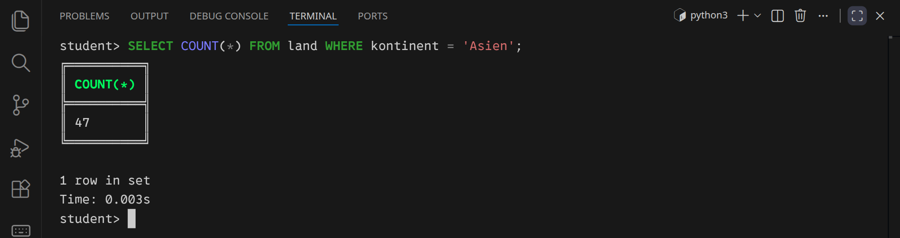

## Text mit LIKE durchsuchen

Mit `LIKE` kannst du Text nach einem Muster durchsuchen. Das Prozentzeichen `%` steht dabei für beliebig viele Zeichen. Die folgende Abfrage findet Ländernamen, in denen `land` vorkommt:

```sql
SELECT name FROM land
WHERE name LIKE '%land%'
ORDER BY name;
```

<!-- tutorial-screenshot
press: Control+L
terminal-run: SELECT name FROM land WHERE name LIKE '%land%' ORDER BY name;
sleep: 0.5
-->

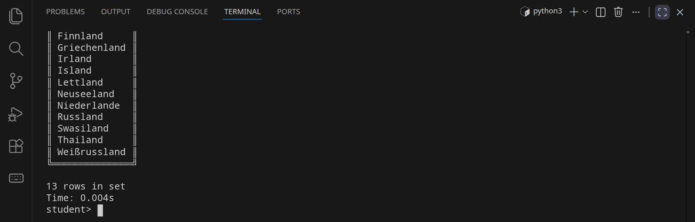

`'land%'` würde dagegen nur Namen finden, die mit `land` beginnen, und `'%land'` nur Namen, die damit enden.

## Unterschiedliche Werte mit DISTINCT anzeigen

Wenn du nur sehen möchtest, welche **verschiedenen** Werte in einer Spalte vorkommen, verwendest du `DISTINCT`:

```sql
SELECT DISTINCT kontinent FROM land
ORDER BY kontinent;
```

<!-- tutorial-screenshot
press: Q
press: Control+L
terminal-run: SELECT DISTINCT kontinent FROM land ORDER BY kontinent;
sleep: 0.5
terminal-scroll-back: 2
crop-terminal-lines: auto
crop-terminal-skip-bottom: 1
-->

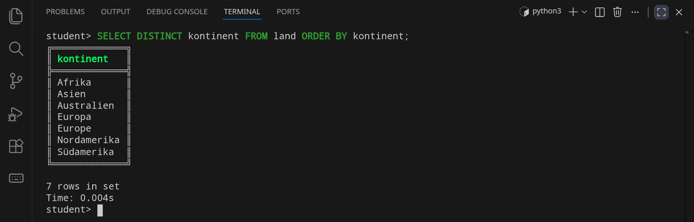

Dabei fällt etwas auf: In den Beispieldaten kommen sowohl `Europa` als auch `Europe` vor. Eine Datenbank speichert die Werte so, wie sie eingetragen wurden; uneinheitliche Daten verschwinden also nicht von selbst. Solche Auffälligkeiten lassen sich mit Abfragen entdecken.

## Zusammenfassung

Du kennst jetzt die wichtigsten Bausteine, die wir für die folgenden Aufgaben benötigen:

<div style='max-width: 100%; overflow-x: auto;'>
<table class='table'>
<thead>
<tr><th>Baustein</th><th>Bedeutung</th></tr>
</thead>
<tbody>
<tr><td><code>SELECT</code></td><td>Welche Spalten oder berechneten Werte sollen ausgegeben werden?</td></tr>
<tr><td><code>FROM</code></td><td>Aus welcher Tabelle kommen die Daten?</td></tr>
<tr><td><code>WHERE</code></td><td>Welche Zeilen erfüllen die Bedingung?</td></tr>
<tr><td><code>AND</code> / <code>OR</code></td><td>Wie werden mehrere Bedingungen verknüpft?</td></tr>
<tr><td><code>ORDER&nbsp;BY</code></td><td>In welcher Reihenfolge werden die Zeilen ausgegeben?</td></tr>
<tr><td><code>LIMIT</code></td><td>Wie viele Zeilen werden höchstens ausgegeben?</td></tr>
<tr><td><code>COUNT(*)</code></td><td>Wie viele Zeilen enthält das Ergebnis?</td></tr>
<tr><td><code>LIKE</code></td><td>Welche Texte passen zu einem Muster?</td></tr>
<tr><td><code>DISTINCT</code></td><td>Welche unterschiedlichen Werte kommen vor?</td></tr>
</tbody>
</table>
</div>

Die Bausteine lassen sich kombinieren. Eine typische Abfrage kann beispielsweise filtern, sortieren und die Ausgabe anschließend begrenzen.

<div class='hint'>
Um <code>mycli</code> zu beenden, gib <code>exit</code> ein oder verwende <kbd>Strg</kbd><kbd>D</kbd>.
</div>

## Aufgaben

Beantworte die folgenden Fragen mit geeigneten SQL-Abfragen. Notiere jeweils deine Abfrage und das Ergebnis. Gib möglichst nur die Spalten aus, die du für die Antwort tatsächlich brauchst.

1. Gib alle Länder mit Name, Einwohnerzahl und Hauptstadt aus. Sortiere die Tabelle nach der Einwohnerzahl absteigend.

2. Wie viele Länder gibt es in der Tabelle `land`?

3. Wie viele Länder liegen in Europa? Beachte die beiden unterschiedlichen Schreibweisen, die du mit `DISTINCT` entdeckt hast.

4. Welche Länder haben die Zeichenfolge `arm` oder `bein` im Namen?

5. Welcher Ort hat die meisten Einwohner, wie viele Einwohner hat er und in welchem Land liegt er?

6. Wie viele Orte aus Frankreich sind in der Tabelle `ort` gespeichert?

7. Gib die zehn bevölkerungsreichsten Orte Frankreichs aus.

8. Finde jeweils drei Orte, deren Name die Zeichenfolge `arm` beziehungsweise `bein` enthält.

9. Welche Orte in Deutschland liegen westlich von Aachen (6,046° Ost)?