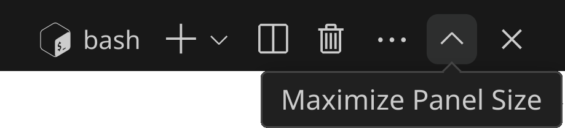
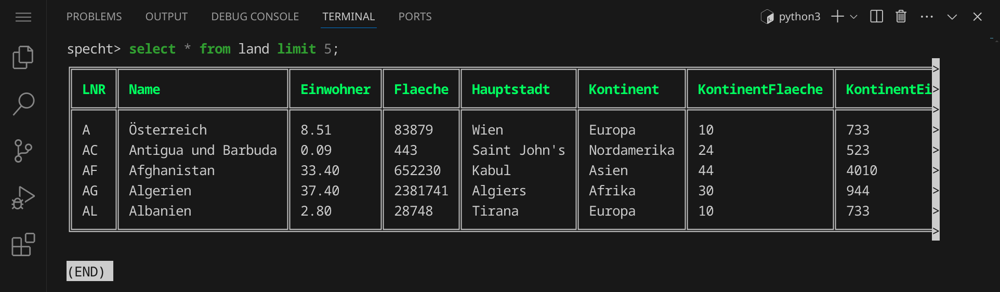

<div class='meta'>
image: select-land.webp:25:0
</div>

# Einführung in SQL

<p class='abstract'>
In diesem Kapitel lernst du, wie du MySQL-Datenbanken abfragen kannst. Dazu verwenden wir die Programmiersprache SQL, die speziell für Datenbanken entwickelt wurde. SQL steht für Structured Query Language und wird ausgesprochen wie »Sequel«.
</p>

Stelle zuerst sicher, dass du keinen Ordner geöffnet hast. Um sicherzugehen, drücke einfach den Shortcut für »Ordner schließen«: <span class='key'>Strg</span><span class='key'>K</span> und dann <span class='key'>F</span>. Dein Workspace sollte jetzt ungefähr so aussehen:


Schließe die linken Seitenleiste, indem du <span class='key'>Strg</span><span class='key'>B</span> drückst, um mehr Platz zu haben.
Öffne als nächstes das Terminal, indem du den Shortcut <span class='key'>Strg</span><span class='key'>J</span> drückst. Dein Workspace sollte jetzt ungefähr so aussehen:




Du kannst das Terminal auch maximieren, indem du auf den Pfeil in der rechten oberen Ecke des Terminals klickst. Die linke Seitenleiste kannst du jederzeit mit <span class='key'>Strg</span><span class='key'>B</span> ein- und ausblenden.

Im Terminal siehst du nun die Eingabeaufforderung, auch Prompt genannt, der dir u.a. anzeigt, in welchem Verzeichnis du dich befindest. Der Prompt sieht in etwa so aus:

```bash
abc@7a93efd91905:~$
```

Lass dich von dem Prompt nicht verwirren. Der Teil `abc` vor dem `@` ist dein Benutzername, der Teil `7a93efd91905` nach dem `@` ist der Name deines Computers, und der Teil nach dem `:` ist das aktuelle Verzeichnis. In diesem Fall ist das aktuelle Verzeichnis `~`, welches die Abkürzung für dein Home-Verzeichnis ist. Das `$` am Ende des Prompts zeigt an, dass du als normaler Benutzer angemeldet bist. Wenn du als Administrator angemeldet wärst, würde das `$` durch ein `#` ersetzt.

## Beispieldaten herunterladen

Um MySQL kennenzulernen, benötigen wir eine Datenbank. Wir verwenden die Beispieldatenbank `terra1`, die du dir herunterladen kannst, indem du folgenden Befehl eingibst:

```bash
wget https://github.com/specht/workspace-files/raw/main/terra1.sql
```

Die Ausgabe sollte in etwa so aussehen:


<div class='hint'>
Lass dich nicht davon stören, dass die Ausgabe so umfangreich ist. Der Grund dafür ist, dass der Webserver die
Anfrage auf eine andere URL umleitet (»302 Found«) und <code>wget</code> dieser Umleitung folgt. Die eigentliche Datei wird
dann heruntergeladen (»200 OK«) und die Ausgabe von <code>wget</code> zeigt dir den Fortschritt an.
</div>

Das Programm `wget` können wir dazu verwenden, um Dateien aus dem Internet herunterzuladen.
Die Datei wird standardmäßig im aktuellen Verzeichnis gespeichert. Schau nach, ob die Datei
angekommen ist, indem du den Befehl `ls` (kurz für »list«) eingibst:


Viele Befehle auf der Kommandozeile haben Optionen, die stets hinter dem Befehlsnamen mit einem `-` beginnen.
Probiere hier den Befehl `ls -l` (für »long«), um dir mehr Details anzeigen zu lassen:


Du siehst nun u.a., wie groß die Datei ist. Nutze den Befehl `ls -lh` (für »long human-readable«),
um die Größe in einer besser lesbaren Form zu sehen:


Die Datei ist also 1,6 MB groß.

Um dir den Inhalt der Datei anzeigen zu lassen, kannst du den Befehl `less` verwenden. `less` ist ein Pager, der dir den Inhalt einer Datei seitenweise anzeigt. Um den Inhalt der Datei `terra1.sql` anzuzeigen, gib folgenden Befehl ein:

```bash
less terra1.sql
```

<div class='hint'>
Du musst nicht den vollständigen Dateinamen schreiben. Schreib einfach <code>less te</code> und drücke <span class='key'>Tab</span>, um den Dateinamen automatisch zu <code>terra1.sql</code> vervollständigen zu lassen. Du kannst danach ganz normal weiterschreiben.
</div>

Du siehst jetzt die ersten Zeilen der Datei:


Nutze die Pfeiltasten <span class='key'>←</span><span class='key'>↑</span><span class='key'>→</span><span class='key'>↓</span> sowie <span class='key'>Bild↑</span><span class='key'>Bild↓</span>, um durch die Datei zu navigieren.

Wenn du etwas nach unten scrollst, siehst du, dass in der Datei zwei Tabellen enthalten sind, die Informationen zu Ländern und Orten enthalten.

Drücke <span class='key'>Q</span>, um `less` zu beenden.

## Beispieldaten importieren

Um die Beispieldatenbank in MySQL zu importieren, gib einfach den folgenden Befehl ein:

```bash
mysql < terra1.sql
```

<div class='hint wink'>
Hast du daran gedacht, die <span class='key'>Tab</span>-Taste zu verwenden, um den Dateinamen automatisch vervollständigen zu lassen?
</div>

Wenn alles geklappt hat, siehst du keine Ausgabe. Das ist ein gutes Zeichen, denn das bedeutet, dass der Import erfolgreich war:


## Tabellenaufbau anzeigen

Um mit MySQL zu arbeiten, verwenden wir `mycli`, einen MySQL-Client, der speziell für die Kommandozeile entwickelt wurde. Starte `mycli`, indem du den folgenden Befehl eingibst:

```bash
mycli
```

Die Ausgabe sollte in etwa so aussehen:


Um dir die Tabellen in der Datenbank anzeigen zu lassen, gib den Befehl `SHOW TABLES;` ein und drücke <span class='key'>Enter</span>:


<div class='hint'>
Die Groß- und Kleinschreibung spielt bei SQL-Befehlen keine Rolle. In diesem Artikel schreiben wir die Befehle in Großbuchstaben, um sie hervorzuheben. Du kannst sie aber auch in Kleinbuchstaben schreiben.
</div>

Du siehst nun die beiden Tabellen `land` und `ort`. Um dir den Aufbau einer Tabelle anzeigen zu lassen, kannst du den Befehl `DESCRIBE` verwenden. Gib z. B. den Befehl `DESCRIBE land;` ein, um dir den Aufbau der Tabelle `land` anzeigen zu lassen:


Du siehst nun die Spalten der Tabelle `land` und deren Datentypen.

<div class='hint task'>
Untersuche die Tabelle <code>ort</code> &ndash; welche Spalten gibt es und welche Datentypen haben sie?
</div>

## Daten anzeigen

Um dir die Daten in einer Tabelle anzeigen zu lassen, kannst du den Befehl `SELECT` verwenden. Gib z. B. den Befehl `SELECT * FROM land;` ein, um dir alle Daten in der Tabelle `land` anzeigen zu lassen:


Du siehst nun alle Einträge in der Tabelle `land`. Eine Zeile entspricht einem Land in der Tabelle. Nutze die Pfeiltasten <span class='key'>←</span><span class='key'>↑</span><span class='key'>→</span><span class='key'>↓</span> sowie <span class='key'>Bild↑</span><span class='key'>Bild↓</span>, um durch die Tabelle zu navigieren.

<div class='hint'>
Drücke <span class='key'>Q</span> (genau wie vorhin bei <code>less</code>), um zur Eingabeaufforderung von <code>mycli</code> zurückzukehren.
</div>

Der Befehl `SELECT *` bedeutet, dass alle Spalten ausgewählt werden sollen. Wenn du nur bestimmte Spalten anzeigen möchtest, kannst du diese explizit angeben. Gib z. B. den Befehl `SELECT name, hauptstadt FROM land;` ein, um dir nur die Spalten `name` und `hauptstadt` anzeigen zu lassen:


## Zeilen filtern

Um nur bestimmte Zeilen anzuzeigen, kannst du den Befehl `WHERE` verwenden. Gib z. B. den Befehl `SELECT * FROM land WHERE name = 'Deutschland';` ein, um dir nur das Land Deutschland anzeigen zu lassen:


<div class='hint'>
Statt der einfachen Anführungszeichen <code>'</code> kannst du auch doppelte Anführungszeichen <code>"</code> verwenden. Das ist besonders nützlich, wenn du Anführungszeichen in deinem Text hast, nach dem du filtern möchtest. Wichtig ist nur,
dass du am Anfang und am Ende dieselben Anführungszeichen verwendest.
</div>

<div class='hint task'>
Wie viele Einwohner hat Griechenland? Welche Zahl erhältst du und wie ist sie zu interpretieren?
</div>

Du kannst auch mehrere Bedingungen kombinieren. Gib z. B. den Befehl `SELECT * FROM land WHERE einwohner < 5 AND flaeche > 1000000;` ein, um dir alle Länder anzeigen zu lassen, die weniger als 5 Millionen Einwohner haben und eine Fläche von mehr als 1 Million Quadratkilometern:


Wir sehen also nun die beiden Länder mit der niedrigsten Bevölkerungsdichte, die mindestens 1 Mio. km<sup>2</sup> groß sind.

## Zeilen sortieren

Um die Zeilen in einer Tabelle zu sortieren, kannst du den Befehl `ORDER BY` verwenden. Gib z. B. den Befehl `SELECT * FROM land ORDER BY einwohner;` ein, um dir die Länder nach ihrer Einwohnerzahl sortiert anzeigen zu lassen:


Du siehst nun die Länder nach ihrer Einwohnerzahl sortiert. Standardmäßig wird aufsteigend sortiert. Um absteigend zu sortieren, füge das Schlüsselwort `DESC` (für »descending«) hinzu. Gib z. B. den Befehl `SELECT * FROM land ORDER BY einwohner DESC;` ein, um die Länder nach ihrer Einwohnerzahl absteigend sortiert anzeigen zu lassen:


## Ausgabe begrenzen

Um die Anzahl der Zeilen zu begrenzen, die angezeigt werden, kannst du den Befehl `LIMIT` verwenden. Gib z. B. den Befehl `SELECT * FROM land LIMIT 5;` ein, um dir nur die ersten 5 Länder anzeigen zu lassen:



## Zusammenfassung

Du hast jetzt die einzelnen Bestandteile einer SQL-Abfrage kennengelernt:

<div style='max-width: 100%; overflow-x: auto;'>
<table class='table'>
<thead>
<tr><th>Befehl</th><th>Bedeutung</th></tr>
</thead>
<tbody>
<tr><td><code>SELECT</code></td><td>Was / Welche Spalten sollen angezeigt werden?</td></tr>
<tr><td><code>FROM</code></td><td>Woher / Aus welcher Tabelle sollen die Daten kommen?</td></tr>
<tr><td><code>WHERE</code></td><td>Filter / Welche Zeilen sollen angezeigt werden?</td></tr>
<tr><td><code>ORDER&nbsp;BY</code></td><td>Sortierung / In welcher Reihenfolge sollen die Zeilen angezeigt werden?</td></tr>
<tr><td><code>LIMIT</code></td><td>Anzahl / Wie viele Zeilen sollen angezeigt werden?</td></tr>
</tbody>
</table>
</div>

Du kannst diese Befehle kombinieren, um genau die Daten zu erhalten, die du benötigst.

<div class='hint'>
Um <code>mycli</code> zu beenden, gib einfach den Befehl <code>exit</code> ein oder verwende die Tastenkombination <span class='key'>Strg</span><span class='key'>D</span>.
</div>

### Aufgaben

Beantworte die folgenden Fragen, indem du eine geeignete SQL-Abfrage formulierst. Notiere jeweils die Abfrage und dein Ergebnis. Formuliere die Abfrage möglichst so, dass du nur die benötigten Spalten erhältst.

1. Gib eine Tabelle aller Länder aus. Dabei sollen Name, Einwohner und die Hauptstadt angezeigt werden und die Tabelle soll nach der Einwohnerzahl absteigend sortiert sein.

2. Wie viele Länder gibt es in der Tabelle `land`?<br>_Hinweis: Du kannst bei <code>SELECT</code> statt Spaltennamen auch Funktionen verwenden, z. B. <code>SELECT COUNT(Name) ...</code> statt <code>SELECT Name ...</code>_.

3. Wie viele Länder liegen in Europa?

4. Welche Länder haben das Wort »arm« oder »bein« im Namen?<br>_Hinweis: Du kannst nicht nur nach exakten Begriffen suchen, sondern auch nach Teilen von Begriffen, z. B. <code>WHERE Name LIKE '%land%'</code>, wenn du nach allen Ländern suchen möchtest, die den Begriff »land« im Namen haben._

5. Welcher Ort hat die meisten Einwohner, wie viele Einwohner sind es und in welchem Land liegt dieser Ort?

6. Wie viele Orte gibt es in Frankreich?<br>_Hinweis: Es gibt natürlich mehr Orte in Frankreich, als in dieser Tabelle stehen, aber wir wollen diese Frage in Bezug auf die uns zur Verfügung stehenden Daten beantworten._

7. Gib die 10 bevölkerungsreichsten Orte in Frankreich aus.

8. Gib jeweils drei Orte an, die den Begriff »arm« oder »bein« im Namen haben.

9. Welche Orte in Deutschland liegen westlich von Aachen (6,046° Ost)?