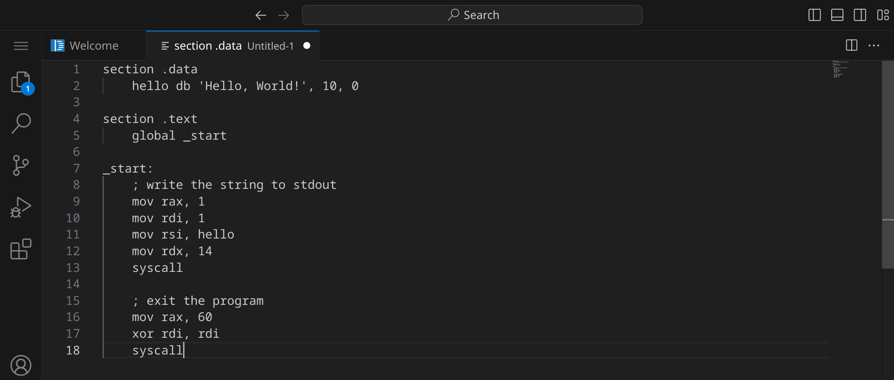
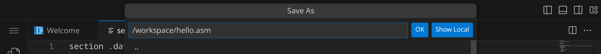
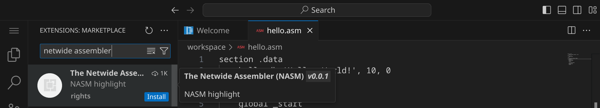
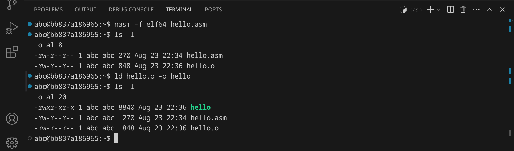
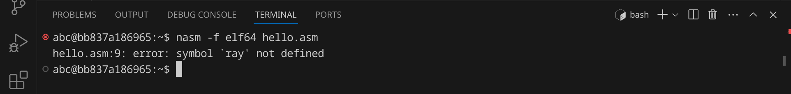
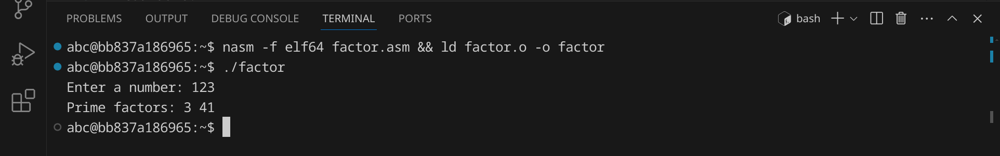

<div class='meta'>
image: nasm-logo.png
</div>

# Netwide Assembler <span style='font-size: 80%;'>(1996)</span>

<div class='floatright' style='width: 24em;'>
    
    <p>Simon Tatham</p>
</div>

<p class='abstract'>
Assembler ist eine maschinennahe Programmiersprache, die direkt auf der Maschinenebene arbeitet und es ermöglicht, Programme zu schreiben, die von der CPU direkt ausgeführt werden.
</p>

Assembler wird häufig für die Entwicklung von Betriebssystemen, Gerätetreibern und eingebetteten Systemen verwendet, da es eine hohe Effizienz und direkte Kontrolle über die Hardware bietet. Bekannte Beispiele für die Verwendung von Assembler sind der Linux-Kernel, der Teile seines Codes in Assembler enthält, und die Firmware von Mikrocontrollern in eingebetteten Systemen. Auch viele frühe Computerspiele wie »Prince of Persia« und »RollerCoaster Tycoon« wurden in Assembler geschrieben. Heutzutage ist Assembler immer noch relevant, insbesondere in Bereichen, die eine hohe Leistung und präzise Hardwaresteuerung erfordern, wie in der Systemprogrammierung und bei der Entwicklung von Echtzeitsystemen.

NASM (Netwide Assembler) ist ein freier Assembler, der auf vielen Plattformen verfügbar ist und die x86-Architektur unterstützt. Er wurde 1996 von Simon Tatham entwickelt und ist eine der beliebtesten Assembler-Tools in der Open-Source-Community.

## Hello, world!

Assembler-Programme werden in Textdateien mit der Endung `.asm` oder `.s` geschrieben. Diese Dateien werden anschließend von einem Assembler in ausführbare Dateien übersetzt, die auf deinem Computer direkt ausgeführt werden können. Es gibt eine Vielzahl von Assemblern, die du verwenden kannst, aber wir werden hier den »Netwide Assembler« (NASM) verwenden, der auf vielen Plattformen verfügbar ist.

Stelle zuerst sicher, dass du keinen Ordner geöffnet hast. Um sicherzugehen, drücke einfach den Shortcut für »Ordner schließen«: <span class='key'>Strg</span><span class='key'>K</span> und dann <span class='key'>F</span>. Dein Workspace sollte jetzt ungefähr so aussehen:


### Quelltext schreiben

Klicke auf »New File« und wähle als Dateityp »Text File«.


Schreibe nun den folgenden Code in die Datei:

_include_file(hello.asm, nasm)

### Warum einfach, wenn's auch kompliziert geht?

Wie du sehen kannst, ist der Assembler-Code für ein einfaches »Hello, world!«-Programm im Vergleich zu anderen Programmierspracen relativ lang. Das liegt daran, dass Assembler eine sehr maschinennahe Sprache ist und du viele Details explizit angeben musst.

In den Zeilen 9 bis 13 wird ein Systemaufruf (`syscall`) verwendet, um die Funktion `write` aufzurufen und den Text »Hello, world!« auf der Standardausgabe auszugeben. Die Register `rax`, `rdi`, `rsi` und `rdx` enthalten die Argumente für den Systemaufruf:

- `rax` enthält die Nummer des Systemaufrufs (1 für `write`)
- `rdi` enthält den Dateideskriptor (1 für die Standardausgabe)
- `rsi` enthält die Adresse des Texts
- `rdx` enthält die Länge des Texts

Eine Übersicht über alle Linux-Systemaufrufe für die x86_64-Architektur findest du hier: [Linux x86_64 System Call Reference Table](https://hackeradam.com/x86-64-linux-syscalls/).

<div class='hint'>
Die Frage, warum man in Assembler programmieren sollte, wenn es doch so viel einfacher geht, ist berechtigt. Assembler ist eine sehr mächtige Programmiersprache, die es dir erlaubt, die Hardware deines Computers direkt zu kontrollieren. Das kann in bestimmten Situationen sehr nützlich sein, z. B. wenn du extrem schnelle oder ressourcenschonende Programme schreiben möchtest. Außerdem kann es sehr lehrreich sein, Assembler zu lernen, da du ein tiefes Verständnis dafür bekommst, wie Computer auf der Ebene der CPU funktionieren. Unabhängig davon spielt Assembler auch in der Softwareentwicklung eine wichtige Rolle, da die Quelltexte kompilierter Programmiersprachen (z. B. C und C++) im ersten Schritt in Assembler-Code übersetzt werden.
</div>

### Syntax-Highlighting aktivieren

Da Visual Studio Code noch nicht weiß, dass es sich um Assembler-Quelltext handelt, ist dein Programm momentan noch einfarbig, aber das wird sich gleich ändern. An dem weißen Punkt erkennst du, dass deine Änderungen noch nicht gespeichert sind.



Drücke nun <span class='key'>Strg</span><span class='key'>S</span>, um die Datei zu speichern. Gib `hello.asm` ein – der vollständige Pfad zu deiner Datei lautet dann `/workspace/hello.asm`.



Da Assembler standardmäßig nicht von Visual Studio Code unterstützt wird, müssen wir noch eine passende Erweiterung installieren. Klicke dazu auf das Erweiterungs-Symbol  in der Seitenleiste oder drücke <span class='key'>Strg</span><span class='key'>Shift</span><span class='key'>X</span>. Suche nach der Erweiterung »The Netwide Assembler« und installiere sie.



Alternativ kannst du auch <span class='key'>Strg</span><span class='key'>P</span> drücken und `ext install rights.nas-vscode` eingeben, um die Erweiterung zu installieren.

Anschließend solltest du dein Assembler-Programm farbig sehen:


### Kompilieren und ausführen

Bevor wir das Programm ausführen können, müssen wir es kompilieren und linken. Dazu verwenden wir den Netwide Assembler `nasm`, um den Assembler-Code in eine Objektdatei zu übersetzen, und den GNU Linker `ld`, um die Objektdatei anschließend in eine ausführbare Datei zu linken.

Öffne dazu ein Terminal, indem du entweder <span class='key'>Strg</span><span class='key'>J</span> drückst oder das Panel-Symbol  rechts oben drückst. Dein Fenster sollte jetzt ungefähr so aussehen:


Um das Programm zu kompilieren, gib folgenden Befehl ein:

```bash
nasm -f elf64 hello.asm
```

<div class='hint'>
Du musst nicht den vollständigen Dateinamen schreiben. Schreib einfach <code>nasm -f elf64 he</code> und drücke <span class='key'>Tab</span>, um den Dateinamen automatisch zu <code>hello.asm</code> vervollständigen zu lassen. Du kannst danach ganz normal weiterschreiben.
</div>

Wenn du keinen Fehler gemacht hast, wird das Programm erfolgreich kompiliert und die Objektdatei `hello.o` wird im selben Verzeichnis erstellt. Du kannst dies überprüfen, indem du dir die Dateien im aktuellen Verzeichnis mit `ls` oder `ls -l` anzeigen lässt:


Um eine ausführbare Datei zu erstellen, müssen wir die Objektdatei mit dem GNU Linker `ld` linken. Gib dazu folgenden Befehl ein:

```bash
ld hello.o -o hello
```

Nun sollte eine ausführbare Datei mit dem Namen `hello` im Verzeichnis liegen. Du kannst dies überprüfen, indem du dir die Dateien im aktuellen Verzeichnis mit `ls` oder `ls -l` anzeigen lässt:



Die grüne Datei `hello` ist die ausführbare Datei – im Unterschied zu Windows, wo ausführbare Dateien die Endung `.exe` haben, haben ausführbare Dateien unter Linux keine Endung. Um das Programm auszuführen, gib folgenden Befehl ein:

```bash
./hello
```

Das Programm sollte die Nachricht `Hello, World!` im Terminal ausgeben. Du kannst alle drei Schritte (kompilien, linken, ausführen) auch in einem Befehl kombinieren:

```bash
nasm -f elf64 hello.asm && ld hello.o -o hello && ./hello
```

<div class='hint'>
Die Zeichenkombination <code>&amp;&amp;</code> sorgt dafür, dass der nächste Befehl nur ausgeführt wird, wenn der vorherige Befehl erfolgreich war.
</div>

### Fehler finden und beheben

Wenn du einen Fehler im Code machst, wird der Compiler eine Fehlermeldung ausgeben. Versuche zum Beispiel, in Zeile 9 statt `rax` das Wort `ray` zu schreiben:

```nasm
    mov ray, 1
```

Speichere die Datei und führe den Assembler erneut aus:

```bash
nasm -f elf64 hello.asm
```

<div class='hint'>
Nutze die Pfeiltaste hoch <span class='key'>↑</span>, um einen vorherigen Befehl erneut einzugeben. So kannst du schnell dein Programm testen, nachdem du es verändert hast.
</div>

Der Assembler sollte eine Fehlermeldung ausgeben, die dir hilft, den Fehler zu finden:



Es lohnt sich, die Fehlermeldungen genau zu lesen, um den Fehler zu finden und zu beheben. Achte auf die Zeilennummer (in diesem Beispiel 9) und den Text, der dir sagt, was falsch ist. Denke daran, den Fehler wieder zu beheben, bevor du das nächste Beispiel ausprobierst.

## Primfaktorzerlegung

Im zweiten Beispiel wollen wir eine Zahl in ihre Primfaktoren zerlegen. An diesem Beispiel kannst du sehen, wie man in Assembler Benutzereingaben verarbeitet, Schleifen verwendet sowie Strings in Zahlen umwandelt und anders herum.
Erstelle eine neue Datei mit <span class='key'>Strg</span><span class='key'>Alt</span><span class='key'>N</span> und schreibe den folgenden Code hinein:

_include_file(factor.asm, nasm)

Speichere die Datei unter dem Namen `factor.asm`. Kompiliere und linke das Programm:

```bash
nasm -f elf64 factor.asm && ld factor.o -o factor
```

Falls du keine Fehlermeldung erhältst, kannst du das Programm ausführen und testen:



Das Programm hat die Zahl 123 in ihre Primfaktoren zerlegt und ausgegeben. Probiere aus, was passiert, wenn du die Zahl 3000000000 eingibst oder die Zahl 123456789123456789. Was könnte der Grund dafür sein?

## Zusammenfassung

Wie du siehst, ist Assembler eine sehr komplexe Programmiersprache. Daher verzichten wir vorerst auf das Bubblesort-Beispiel. Falls du eine funktionierende NASM-Implentierung des Bubblesort-Algorihmus (für x86_64) hast, schick sie bitte an <a href='mailto:specht@gymnasiumsteglitz.de'>specht@gymnasiumsteglitz.de</a>, damit wir sie hier einfügen können.

In diesem Kapitel hast du an zwei Beispielen gesehen, wie man ein einfaches Assembler-Programm schreiben, kompilieren, linken und ausführen kann. Das ist natürlich nur ein erster Eindruck. Um Assembler wirklich zu beherrschen, musst du noch viel mehr lernen – am besten, indem du eigene Programme schreibst und ausprobierst. Die Buchhandlungen, Bibliotheken und Youtube sind voll von Material für dich. Viel Spaß beim Programmieren!

