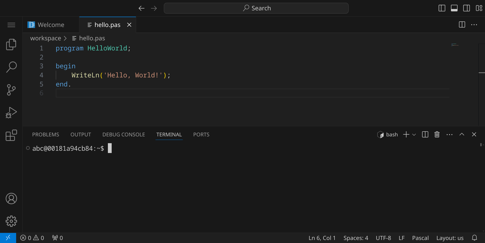
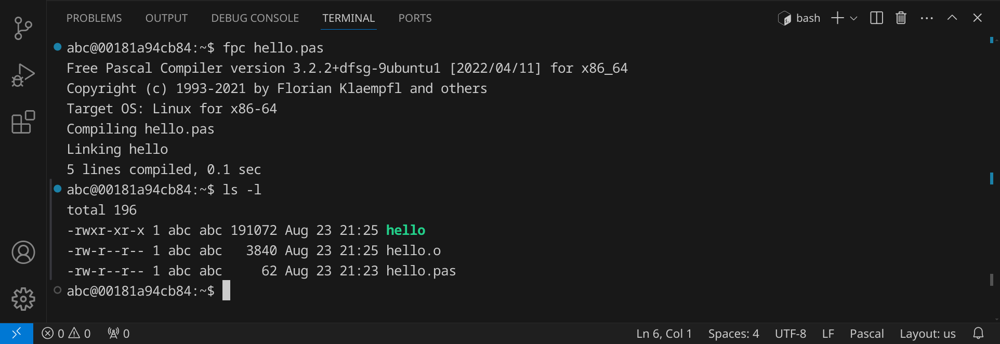
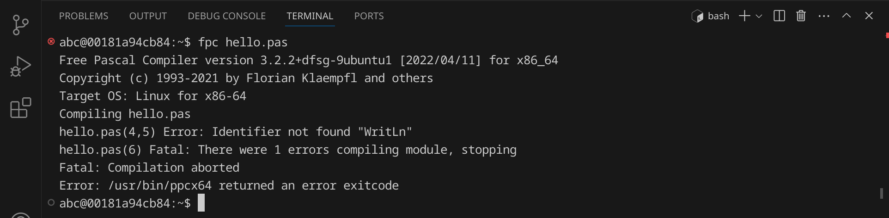
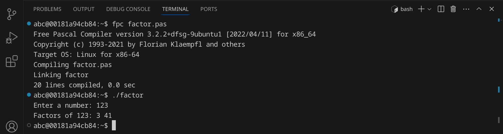
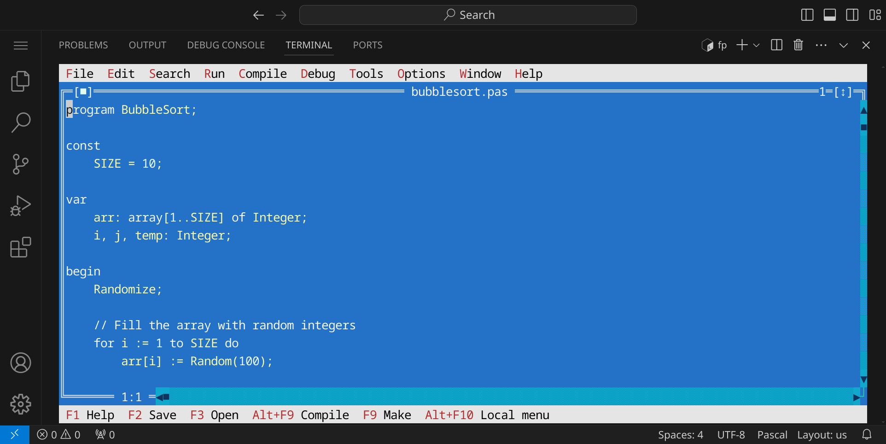
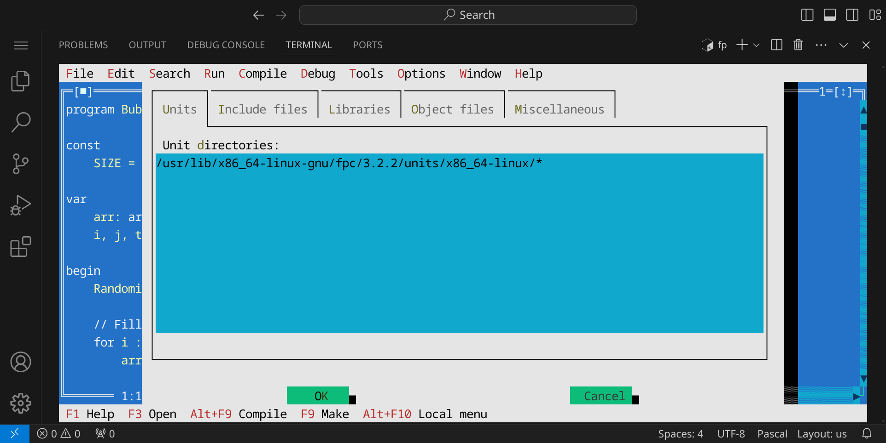

<div class='meta'>
image: pascal-logo.png
</div>

# Pascal <span style='font-size: 80%;'>(1970)</span>

<div class='floatright' style='width: 12em;'>
    
    <p>Niklaus Wirth</p>
</div>

<p class='abstract'>
Die Programmiersprache Pascal wurde 1970 von Niklaus Wirth entwickelt und ist eine imperative und strukturierte Programmiersprache. Pascal wurde ursprünglich als Sprache für die Lehre entwickelt und hat eine klare und einfache Syntax. Die Sprache wurde nach dem französischen Mathematiker und Philosophen Blaise Pascal benannt.
</p>

<!-- ## Eigenschaften

- **Imperativ**: Pascal ist eine imperative Programmiersprache, die auf der Abarbeitung von Befehlen basiert.
- **Strukturiert**: Pascal ist eine strukturierte Programmiersprache, die auf der Verwendung von Kontrollstrukturen wie Schleifen und Verzweigungen basiert.
- **Statisch**: Pascal ist eine statisch typisierte Sprache, was bedeutet, dass Variablen einen festen Datentyp haben, der zur Kompilierzeit überprüft wird. -->

## Hello, world!

Pascal-Programme werden in Textdateien mit der Endung `.pas` geschrieben. Diese Dateien werden anschließend von einem Compiler in ausführbare Dateien übersetzt, die auf deinem Computer direkt ausgeführt werden können. Früher waren der Compiler »Turbo Pascal« sehr verbreitet, heute wird meist der freie Compiler »Free Pascal« verwendet.

Stelle zuerst sicher, dass du keinen Ordner geöffnet hast. Um sicherzugehen, drücke einfach den Shortcut für »Ordner schließen«: <span class='key'>Strg</span><span class='key'>K</span> und dann <span class='key'>F</span>. Dein Workspace sollte jetzt ungefähr so aussehen:


### Quelltext schreiben

Klicke auf »New File« und wähle als Dateityp »Text File«.


Schreibe nun den folgenden Code in die Datei:

_include_file(hello.pas, pascal)

Da Visual Studio Code noch nicht weiß, dass es sich um Pascal-Quelltext handelt, ist dein Programm momentan noch einfarbig, aber das wird sich gleich ändern. An dem weißen Punkt erkennst du, dass deine Änderungen noch nicht gespeichert sind.


Drücke nun <span class='key'>Strg</span><span class='key'>S</span>, um die Datei zu speichern. Gib `hello.pas` ein – der vollständige Pfad zu deiner Datei lautet dann `/workspace/hello.pas`.


Da Pascal standardmäßig nicht von Visual Studio Code unterstützt wird, müssen wir noch eine passende Erweiterung installieren. Klicke dazu auf das Erweiterungs-Symbol  in der Seitenleiste oder drücke <span class='key'>Strg</span><span class='key'>Shift</span><span class='key'>X</span>. Suche nach der Erweiterung »Pascal Magic« und installiere sie.


Alternativ kannst du auch <span class='key'>Strg</span><span class='key'>P</span> drücken und `ext install theangryepicbanana.language-pascal` eingeben, um die Erweiterung zu installieren.

Anschließend solltest du dein Pascal-Programm farbig sehen:


### Kompilieren und ausführen

Bevor wir das Programm ausführen können, müssen wir es kompilieren. Dadurch wird der Quelltext in Maschinencode übersetzt, den dein Computer ausführen kann.

Öffne dazu ein Terminal, indem du entweder <span class='key'>Strg</span><span class='key'>J</span> drückst oder das Panel-Symbol  rechts oben drückst. Dein Fenster sollte jetzt ungefähr so aussehen:



Um das Programm zu kompilieren, gib folgenden Befehl ein:

```bash
fpc hello.pas
```

<div class='hint'>
Du musst nicht den vollständigen Dateinamen schreiben. Schreib einfach <code>fpc he</code> und drücke <span class='key'>Tab</span>, um den Dateinamen automatisch zu <code>hello.pas</code> vervollständigen zu lassen. Du kannst danach ganz normal weiterschreiben.
</div>

Wenn du keinen Fehler gemacht hast, wird das Programm erfolgreich kompiliert und die ausführbare Datei `hello` wird im selben Verzeichnis erstellt. Du kannst dies überprüfen, indem du dir die Dateien im aktuellen Verzeichnis mit `ls` oder `ls -l` anzeigen lässt:



Die grüne Datei `hello` ist die ausführbare Datei – im Unterschied zu Windows, wo ausführbare Dateien die Endung `.exe` haben, haben ausführbare Dateien unter Linux keine Endung. Um das Programm auszuführen, gib folgenden Befehl ein:

```bash
./hello
```

Das Programm sollte die Nachricht `Hello, World!` im Terminal ausgeben. Du kannst beide Schritte auch in einem Befehl kombinieren:

```bash
fpc hello.pas && ./hello
```

<div class='hint'>
Die Zeichenkombination <code>&amp;&amp;</code> sorgt dafür, dass der zweite Befehl nur ausgeführt wird, wenn der erste erfolgreich war.
</div>

### Fehler finden und beheben

Wenn du einen Fehler im Code machst, wird der Compiler eine Fehlermeldung ausgeben. Versuche zum Beispiel, statt `WriteLn` das Wort `WritLn` zu schreiben:

```c
    WritLn('Hello, World!');
```

Speichere die Datei und führe den Compiler erneut aus:

```bash
fpc hello.pas
```

<div class='hint'>
Nutze die Pfeiltaste hoch <span class='key'>↑</span>, um den letzten Befehl erneut einzugeben. So kannst du schnell dein Programm testen, nachdem du es verändert hast.
</div>

Der Compiler sollte eine Fehlermeldung ausgeben, die dir hilft, den Fehler zu finden:



Es lohnt sich, die Fehlermeldungen genau zu lesen, um den Fehler zu finden und zu beheben. Achte auf die Zeilennummer (in diesem Beispiel 4) und den Text, der dir sagt, was falsch ist. Denke daran, den Fehler wieder zu beheben, bevor du das nächste Beispiel ausprobierst.

## Primfaktorenzerlegung

Im zweiten Beispiel wollen wir eine Zahl in ihre Primfaktoren zerlegen. An diesem Beispiel kannst du sehen, wie man in Pascal Benutzereingaben verarbeitet und Schleifen verwendet.
Erstelle eine neue Datei mit <span class='key'>Strg</span><span class='key'>Alt</span><span class='key'>N</span> und schreibe den folgenden Code hinein:

_include_file(factor.pas, pascal)

Speichere die Datei unter dem Namen `factor.pas`. Kompiliere das Programm:

```bash
fpc factor.pas
```

Falls du keine Fehlermeldung erhältst, kannst du das Programm ausführen und testen:



Das Programm hat die Zahl 123 in ihre Primfaktoren zerlegt und ausgegeben. Probiere aus, was passiert, wenn du die Zahl 100000 eingibst. Was könnte der Grund dafür sein?

## Bubblesort

Im dritten Beispiel wollen wir eine Liste von 10 Zufallszahlen sortieren. Dafür verwenden wir den [Bubblesort-Algorithmus](https://de.wikipedia.org/wiki/Bubblesort), der zwar nicht besonders effizient ist, aber sehr einfach zu verstehen und zu implementieren. Der Bubblesort-Algorithmus funktioniert, indem er die Liste mehrmals durchläuft und benachbarte Elemente vertauscht, wenn sie in der falschen Reihenfolge sind.

An diesem Beispiel kannst du sehen, wie man in Pascal Arrays verwendet und Schleifen verschachtelt.

Erstelle eine neue Datei und schreibe den folgenden Code hinein:

_include_file(bubblesort.pas, pascal)

Speichere die Datei unter dem Namen `bubblesort.pas`. Kompiliere das Programm:

```bash
fpc bubblesort.pas
```
Falls du keine Fehlermeldung erhältst, kannst du das Programm ausführen und testen:


Das Programm hat eine Liste von 10 Zufallszahlen sortiert. Versuche, den Quelltext so zu verändern, dass statt 10 Zahlen 100 oder mehr Zahlen sortiert werden.

## Programmieren wie in den 90ern

Wenn du möchtest, kannst du eine kleine Zeitreise machen und wie früher in den 90ern programmieren. Vergrößere dein Terminal und gib einfach `fp bubblesort.pas` ein:



In dieser Entwicklungsumgebung kannst du den Quelltext direkt bearbeiten und du kannst folgende Tasten verwenden:

<table class='table'>
<tr><td><span class='key'>F9</span></td><td>Kompilieren</td></tr>
<tr><td><span class='key'>Strg</span><span class='key'>F9</span></td><td>Ausführen</td></tr>
<tr><td><span class='key'>F2</span></td><td>Speichern</td></tr>
<tr><td><span class='key'>Alt</span><span class='key'>X</span></td><td>Beenden</td></tr>
</table>

<div class='hint'>
Auch wenn es nicht so aussieht: in der FreePascal-Entwicklungsumgebung kann man auch die Maus verwenden.
</div>

Bevor du ein Programm kompilieren kannst, musst du der Entwicklungsumgebung allerdings noch einen Hinweis geben, wo die benötigten Units zu finden sind. Klicke dazu auf »Options« und »Directories…«:


…und trage dann den Pfad `/usr/lib/x86_64-linux-gnu/fpc/3.2.2/units/x86_64-linux/*` ein:



## Zusammenfassung

In diesem Kapitel hast du an drei Beispielen gesehen, wie man ein einfaches Pascal-Programm schreiben, kompilieren und ausführen kann. Das ist natürlich nur ein erster Eindruck. Um Pascal wirklich zu beherrschen, musst du noch viel mehr lernen – am besten, indem du eigene Programme schreibst und ausprobierst. Die Buchhandlungen, Bibliotheken und Youtube sind voll von Material für dich. Viel Spaß beim Programmieren!