# Echtzeitgrafik mit C

<div class='meta'>
image: pixelram.webp
</div>

<div
    class="autotoc-secondary-trigger"
    data-title="Auf dieser Seite"
    data-levels="h2,h3">
</div>

<p class='abstract'>
Mit PixelRAM programmierst du schnelle Computergrafik direkt in C. Statt fertige Zeichenbefehle zu verwenden, berechnet dein Programm selbst die Farbe jedes einzelnen Bildpunkts. In diesem Tutorial entwickeln wir daraus Schritt für Schritt ein animiertes Interferenzmuster und sehen, warum sich C besonders gut für solche rechenintensiven Grafikeffekte eignet.
</p>

Bei [Pixelflow Canvas](/drawing) kannst du mit einfachen Zeichenbefehlen schnell eigene Bilder und Animationen in Ruby programmieren. PixelRAM geht noch einen Schritt tiefer: Hier arbeitest du direkt mit den Pixeln des Bildschirms und berechnest selbst, welche Farbe an welcher Position erscheinen soll. Das ist etwas aufwendiger, eröffnet aber ganz andere Möglichkeiten. Auf dieser Grundlage lassen sich zum Beispiel Fraktale, Partikelsimulationen, Raycaster, Raytracer, Bilddecoder, eigene Software-Renderer oder ganze Spiele entwickeln.

Dafür verwenden wir die Programmiersprache C. Diese Sprache ist näher an der Arbeitsweise eines Computers als beispielsweise Ruby und eignet sich besonders gut für Programme, die sehr viele Berechnungen schnell durchführen müssen. Genau das werden wir in diesem Tutorial tun: Am Ende berechnet unser Programm viele zehntausend Pixel für jedes einzelne Bild einer Animation.

## Repository klonen

Stelle zuerst sicher, dass du keinen Ordner geöffnet hast. Um sicherzugehen, drücke den Shortcut für »Ordner schließen«: <kbd>Strg</kbd><kbd>K</kbd> und danach <kbd>F</kbd>. Dein Work­space sollte jetzt ungefähr so aussehen:

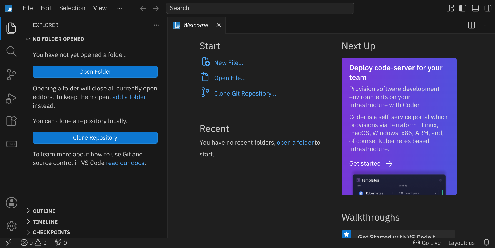

<!-- Screenshot: Workspace ohne geöffneten Ordner -->

Klicke auf den blauen Button »Clone Repository« und gib folgende Adresse ein:

```text
https://github.com/specht/pixelram-starter.git
```


Als nächstes musst du angeben, in welches Verzeichnis du das Repository klonen möchtest. Bestätige den Standardpfad `/workspace/` mit <kbd>Enter</kbd>.


Beantworte die Frage »Would you like to open the cloned repository?« mit »Open«.

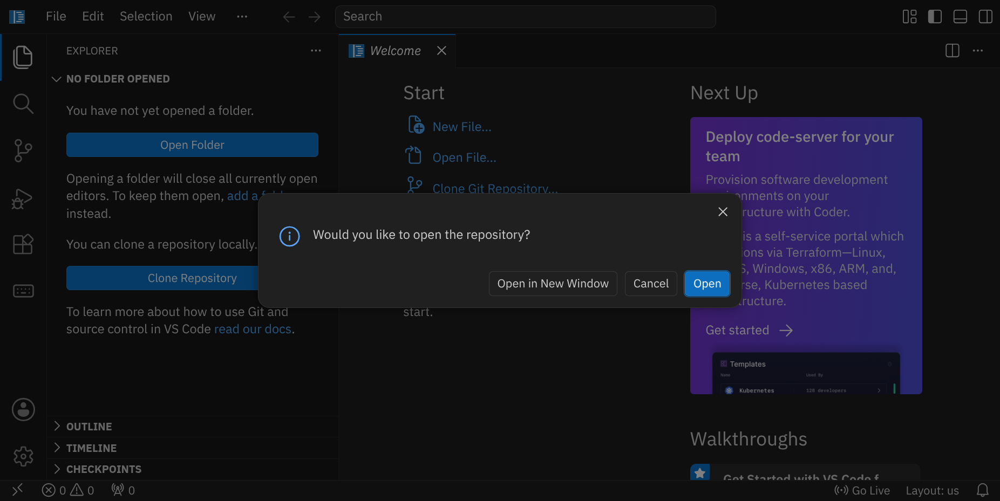

Öffne nun die Datei `main.c` und führe im Terminal `make` aus:

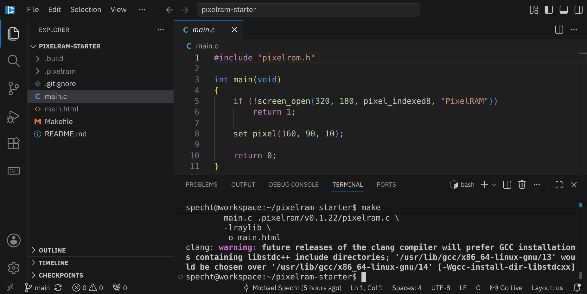

Du erhältst nun eine Datei `main.html`, die du anschauen kannst, indem du rechts unten auf »Go Live« drückst und dann die Datei auswählst. Passend zum Testprogramm solltest du einen kleinen grünen Punkt in der Mitte des Bildes sehen:

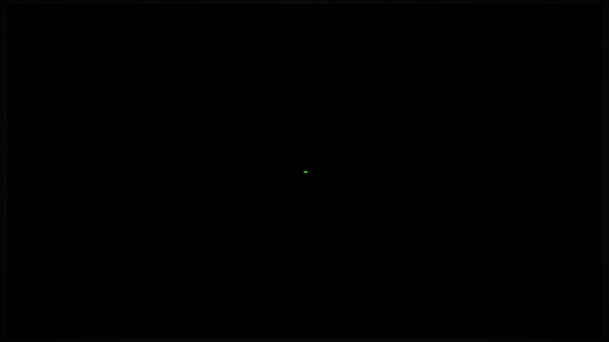

Wenn du später ein anderes Programm als `main.c` compilieren möchtest, musst du den entsprechenden Eintrag im `Makefile` unter `PROGRAM` ändern. Falls deinem Programm Default-Argumente übergeben werden sollen, kannst du diese unter `ARGS` eintragen. Die übrigen Zeilen kannst du so lassen, wie sie sind.

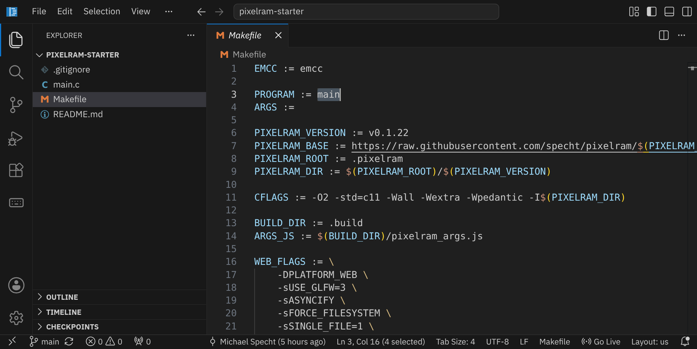

## Grundlagen

### Das erste Pixel

Schauen wir uns den Quellcode von `main.c` einmal genauer an:

```c
#include "pixelram.h"

int main(void)
{
    if (!screen_open(320, 180, pixel_indexed8, "PixelRAM"))
        return 1;

    set_pixel(160, 90, 10);

    return 0;
}
```

Mit dem Befehl:

```c
screen_open(320, 180, pixel_indexed8, "PixelRAM")
```

öffnen wir einen Bildschirm mit 320 × 180 Pixeln, und mit `set_pixel(160, 90, 10)` setzen wir genau einen dieser Pixel, nämlich:

- Position 160, 90 (also in der Mitte des Bildschirms)
- Farbe 10 (hellgrün in der Standard-VGA-Palette)

### Farbpaletten

Da wir den Modus `pixel_indexed8` aktiviert haben, können wir nicht beliebige RGB-Farben für jedes Pixel setzen, sondern nur einfache Bytes, die in eine vordefinierte Farbpalette verweisen. Welche Farbe der Pixel mit dem Wert 10 also tatsächlich hat, hängt von der aktuellen Palette ab.

<div class='hint books'>
Eine Übersicht über die eingebauten Paletten findest du unter <a href='https://specht.github.io/pixelram/palettes.html'>specht.github.io/pixelram/palettes.html</a>.
</div>


PixelRAM bringt viele fertige Farbpaletten mit. Ergänze vor oder nach dem `set_pixel`-Aufruf:

```c
use_palette("sweetie_16");
```

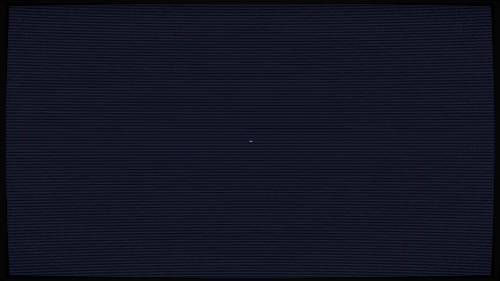

Durch die veränderte Palette ist der Pixel jetzt blau und auch die Hintergrundfarbe (Farbe 0) ist nicht mehr schwarz, sondern dunkelblau.

<div class='hint info'>
Man kann Computergrafiken auch animieren, indem man das Bild selbst unverändert lässt und nur die Palette animiert. Der PixelArt-Künstler Mark Ferrari hat viel mit diesem Trick gearbeitet, eine Auswahl seiner Werke <a href='https://www.effectgames.com/demos/canvascycle/' target='_blank'>findest du hier</a>.
</div>

### Alle Pixel

Unser Bildschirm besteht aus 320 × 180 Pixeln, also insgesamt **57.600 Pixeln**. Natürlich wäre es unsinnig, für jeden davon einen eigenen `set_pixel`-Befehl zu schreiben. Stattdessen lassen wir den Computer die Positionen mit zwei ineinander verschachtelten Schleifen durchlaufen:

```c
for (int y = 0; y < 180; y++)
{
    for (int x = 0; x < 320; x++) {
        set_pixel(x, y, 4);
    }
}
```

Die äußere Schleife läuft von oben nach unten durch alle Zeilen des Bildes. Für jede dieser Zeilen läuft die innere Schleife von links nach rechts durch alle Pixel. Auf diese Weise besucht das Programm jeden der 57.600 Bildpunkte genau einmal.

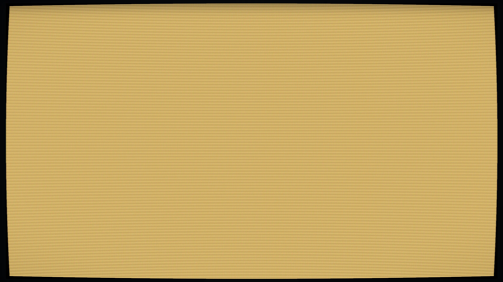

Damit wir die Breite und Höhe unseres Bildes nicht an mehreren Stellen als Zahlen eintragen müssen, legen wir sie am Anfang des Programms fest:

```c
#define WIDTH  320
#define HEIGHT 180
```

Ändere dein vollständiges Programm nun zu:

```c
#include "pixelram.h"

#define WIDTH  320
#define HEIGHT 180

int main(void)
{
    screen_open(WIDTH, HEIGHT, pixel_indexed8, "PixelRAM");
    use_palette("sweetie_16");

    for (int y = 0; y < HEIGHT; y++)
        for (int x = 0; x < WIDTH; x++)
            set_pixel(x, y, (x / 20 + y / 20) % 16);
}
```

Jetzt bekommt nicht mehr jeder Pixel dieselbe Farbe. Stattdessen hängt seine Farbe von seiner Position `x` und `y` ab. Wir haben also aufgehört, einzelne Objekte auf einen Bildschirm zu zeichnen: Unser Programm berechnet das gesamte Bild Pixel für Pixel. Genau dieses Prinzip werden wir in den nächsten Schritten weiter ausbauen.

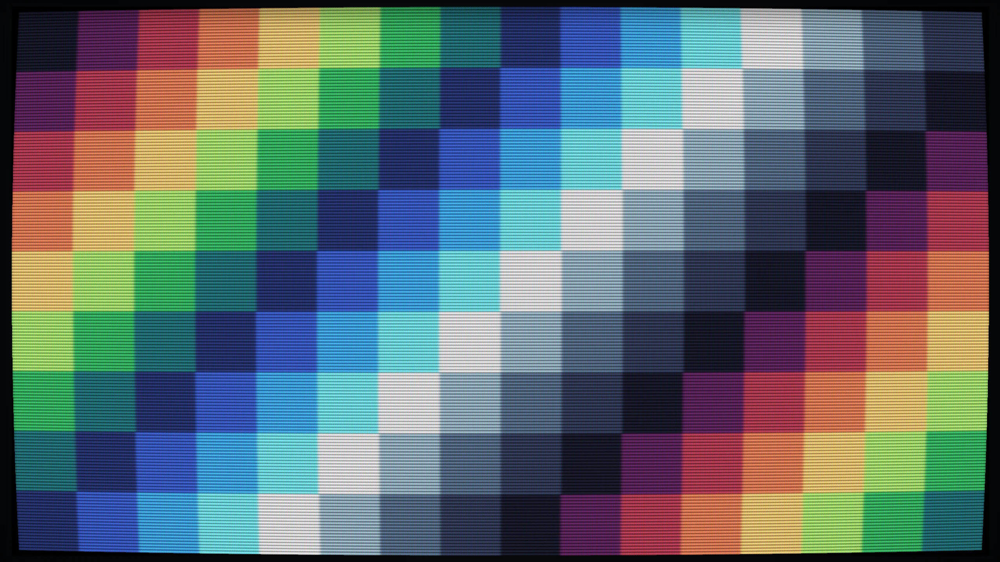

<div class='hint'>
Probiere auch den CRT-Filter in der PixelRAM-Anzeige aus. Er simuliert Scanlines und die Farbmaske eines Röhrenbildschirms und passt besonders gut zur niedrigen Auflösung und den begrenzten Paletten.
</div>

## Interferenzmuster

### Abstand vom Mittelpunkt

Als Nächstes wollen wir nicht nur die Position eines Pixels verwenden, sondern seinen Abstand zur Mitte des Bildschirms berechnen. Dafür benötigen wir die mathematische Funktion `sqrt`, weshalb wir oben im Programm eine weitere Bibliothek einbinden:

```c
#include <math.h>
```

Innerhalb unserer beiden Schleifen bestimmen wir zunächst den horizontalen und vertikalen Abstand des aktuellen Pixels vom Mittelpunkt:

```c
double dx = x - WIDTH / 2.0;
double dy = y - HEIGHT / 2.0;
```

Aus diesen beiden Werten können wir mit dem Satz des Pythagoras den tatsächlichen Abstand berechnen:

```c
double distance = sqrt(dx * dx + dy * dy);
```

Verwenden wir diesen Abstand für die Farbauswahl, entstehen automatisch kreisförmige Muster:

```c
int color = ((int)(distance / 6.0)) % 16;
set_pixel(x, y, color);
```

Der vollständige Inhalt der beiden Schleifen lautet damit:

```c
for (int y = 0; y < HEIGHT; y++)
{
    for (int x = 0; x < WIDTH; x++)
    {
        double dx = x - WIDTH / 2.0;
        double dy = y - HEIGHT / 2.0;
        double distance = sqrt(dx * dx + dy * dy);

        set_pixel(x, y, ((int)(distance / 6.0)) % 16);
    }
}
```

Pixel mit ungefähr demselben Abstand vom Mittelpunkt erhalten dieselbe Farbe. Deshalb entstehen konzentrische Kreise, obwohl wir im Programm nirgendwo einen Kreis zeichnen:

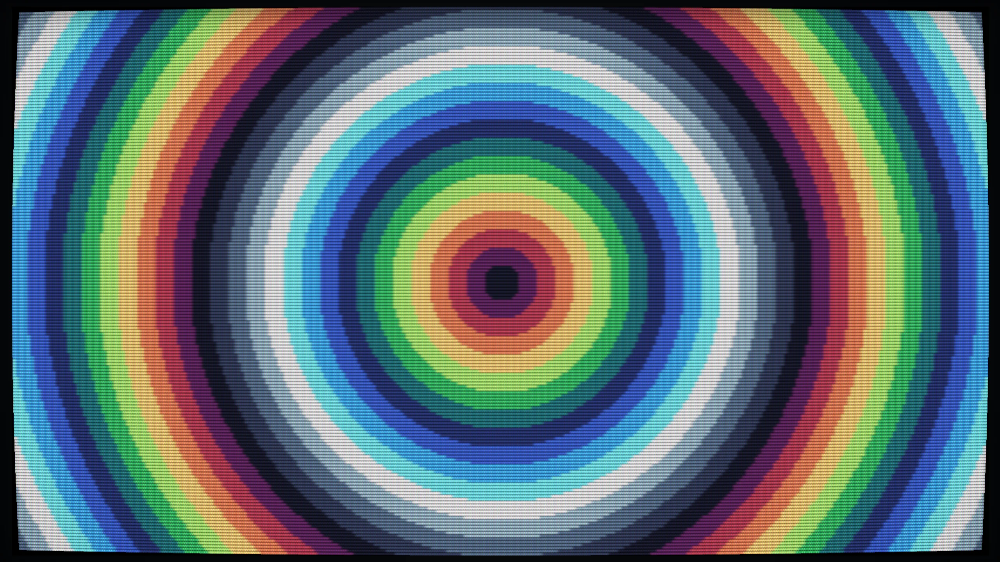

Der Kreis ergibt sich allein aus der Berechnung für jeden einzelnen Pixel. Probiere aus, was passiert, wenn du die Zahl `6.0` größer oder kleiner machst.

### Kreiswellen

Unsere bisherigen Kreise haben harte Übergänge. Für einen wellenförmigen Verlauf können wir die mathematische Sinusfunktion verwenden. Sie liefert einen Wert, der sich regelmäßig zwischen -1 und 1 bewegt.

Ersetze die Farbberechnung durch:

```c
double wave = sin(distance * 0.12);
int color = (int)((wave + 1.0) * 7.5);

set_pixel(x, y, color);
```

Durch `wave + 1.0` verschieben wir den Wertebereich von -1 ... 1 auf 0 ... 2. Anschließend multiplizieren wir mit 7.5 und erhalten Werte von ungefähr 0 bis 15, die direkt zu unserer 16-Farben-Palette passen. Aus den harten Farbringen sind dadurch regelmäßig wiederkehrende Kreiswellen geworden.

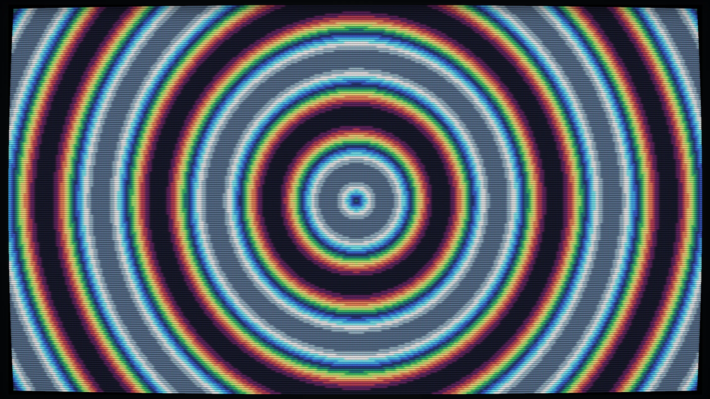

Auch hier lohnt es sich zu experimentieren. Wenn du `distance * 0.12` beispielsweise durch `distance * 0.20` ersetzt, liegen die Wellen dichter zusammen. Mit einem kleineren Wert werden sie breiter.

### Animation

Bis jetzt berechnet unser Programm nur ein einziges Bild und beendet sich anschließend. Für eine Animation müssen wir dagegen immer wieder ein neues Bild berechnen. PixelRAM verwendet dafür eine Schleife, die so lange läuft, bis das Fenster geschlossen wird:

```c
while (!should_close())
{
    // neues Bild berechnen
    // ...

    // neues Bild anzeigen
    present();
}
```

Mit `present()` teilen wir PixelRAM mit, dass das aktuelle Bild fertig ist und angezeigt werden kann. Anschließend beginnt die Schleife wieder von vorne und berechnet den nächsten Frame. Zusätzlich können wir mit `seconds()` abfragen, wie viel Zeit seit dem Start des Programms vergangen ist.

Wenn wir diese Zeit in die Sinusfunktion einbauen, beginnt sich unsere Welle zu bewegen:

```c
double t = seconds();
double wave = sin(distance * 0.12 - t * 2.0);
```

Das vollständige Programm sieht nun so aus:

```c
#include "pixelram.h"
#include <math.h>

#define WIDTH  320
#define HEIGHT 180

int main(void)
{
    screen_open(WIDTH, HEIGHT, pixel_indexed8, "PixelRAM");
    use_palette("sweetie_16");

    while (!should_close()) {
        double t = seconds();

        for (int y = 0; y < HEIGHT; y++)
        {
            for (int x = 0; x < WIDTH; x++)
            {
                double dx = x - WIDTH / 2.0;
                double dy = y - HEIGHT / 2.0;
                double distance = sqrt(dx * dx + dy * dy);

                double wave = sin(distance * 0.12 - t * 2.0);
                set_pixel(x, y, (int)((wave + 1.0) * 7.5));
            }
        }
        present();
    }

    screen_close();
}
```

<!-- Screenshot: animierte Ringe -->

Jetzt laufen die Wellen kontinuierlich über den Bildschirm. Der entscheidende Unterschied steckt in `t`: Da dieser Wert ständig größer wird, liefert die Sinusfunktion bei jedem Frame leicht andere Ergebnisse. Unsere Animation entsteht also nicht dadurch, dass wir einen fertigen Kreis verschieben, sondern dadurch, dass wir das komplette Bild immer wieder neu berechnen.

### Die Wellenquelle bewegt sich

Bisher liegt das Zentrum unserer Wellen fest in der Mitte des Bildschirms. Es gibt aber keinen Grund, warum dieser Punkt unbeweglich bleiben müsste. Mit `sin` und `cos` können wir seine Position gleichmäßig über den Bildschirm wandern lassen:

```c
double cx = WIDTH / 2.0 + cos(t * 0.8) * 70.0;
double cy = HEIGHT / 2.0 + sin(t * 1.1) * 40.0;
```

<div class='hint info'>
Du fragst dich sicherlich, wo diese beiden Zeilen hin gehören. Tipp: Schau genau hin, wovon <code>cx</code> und <code>cy</code> abhängen.
</div>

Statt den Abstand vom festen Mittelpunkt zu berechnen, verwenden wir jetzt `cx` und `cy`:

```c
double distance = hypot(x - cx, y - cy);
```

Die Funktion `hypot` berechnet direkt den Abstand aus horizontalem und vertikalem Unterschied. Sie macht also dasselbe wie unsere vorherige Rechnung mit `sqrt(dx * dx + dy * dy)`, ist hier aber kürzer zu schreiben.

Die Werte von `sin` und `cos` bewegen sich gleichmäßig zwischen -1 und 1. Durch die Multiplikation mit 70.0 beziehungsweise 40.0 bestimmen wir, wie weit sich der Mittelpunkt horizontal und vertikal bewegen darf. Das Ergebnis ist eine Kreiswelle, deren Quelle selbst durch das Bild wandert.

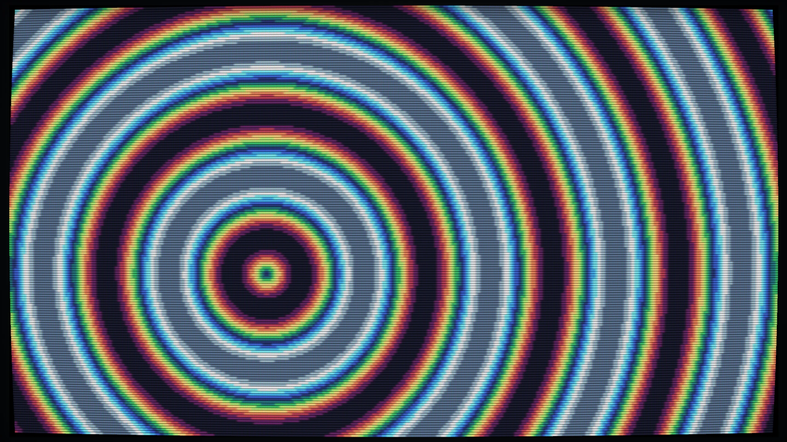

### Zwei Wellen treffen aufeinander

Mit einer einzigen Wellenquelle können wir bereits interessante Muster erzeugen. Spannender wird es, wenn wir eine zweite Quelle hinzufügen und beide Wellen miteinander kombinieren. Zunächst berechnen wir zwei Punkte, die sich mit unterschiedlichen Geschwindigkeiten über den Bildschirm bewegen:

```c
double ax = WIDTH / 2.0 + cos(t * 0.8) * 70.0;
double ay = HEIGHT / 2.0 + sin(t * 1.1) * 40.0;

double bx = WIDTH / 2.0 + cos(t * 1.3) * 90.0;
double by = HEIGHT / 2.0 + sin(t * 0.7) * 50.0;
```

Für jeden Pixel bestimmen wir anschließend seinen Abstand zu beiden Quellen:

```c
double d1 = hypot(x - ax, y - ay);
double d2 = hypot(x - bx, y - by);
```

Aus jedem Abstand erzeugen wir eine eigene Welle und addieren die beiden Werte:

```c
double wave =
    sin(d1 * 0.12 - t * 2.0) +
    sin(d2 * 0.12 + t * 2.3);
```

An einigen Stellen sind beide Wellen gleichzeitig groß und verstärken sich gegenseitig, an anderen Stellen schwächen sie sich ab. Dieses Überlagern von Wellen nennt man **Interferenz**. Obwohl unser Programm nur zwei Entfernungen und zwei Sinuswerte berechnet, entsteht dadurch ein überraschend komplexes bewegtes Muster.

### Das fertige Interferenzmuster

Unser vollständiges Programm ist inzwischen erstaunlich kurz:

```c
#include "pixelram.h"
#include <math.h>

#define W 320
#define H 180

int main(void)
{
    screen_open(W, H, pixel_indexed8, "PixelRAM Interference");
    use_palette("sweetie_16");

    while (!should_close())
    {
        double t = seconds();

        double ax = W / 2.0 + cos(t * 0.8) * 70;
        double ay = H / 2.0 + sin(t * 1.1) * 40;
        double bx = W / 2.0 + cos(t * 1.3) * 90;
        double by = H / 2.0 + sin(t * 0.7) * 50;

        for (int y = 0; y < H; y++)
            for (int x = 0; x < W; x++)
            {
                double d1 = hypot(x - ax, y - ay);
                double d2 = hypot(x - bx, y - by);

                double wave =
                    sin(d1 * 0.12 - t * 2.0) +
                    sin(d2 * 0.12 + t * 2.3);

                set_pixel(x, y, (int)((wave + 2) * 3.75));
            }

        present();
    }

    screen_close();
}
```

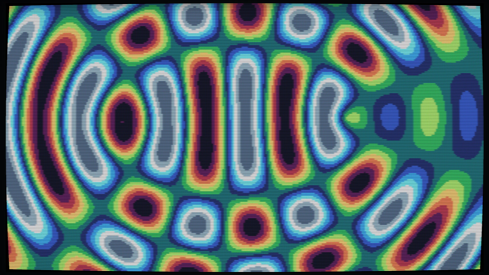

Hinter der Animation steckt eine ganze Menge Arbeit: Bei 320 × 180 Pixeln berechnet unser Programm für jeden Frame 57.600 Pixel neu. Für jeden einzelnen davon bestimmen wir zwei Abstände und berechnen zwei Sinusfunktionen. Bei 60 Bildern pro Sekunde sind das mehr als **3 Millionen neu berechnete Pixel pro Sekunde**. Genau bei solchen Aufgaben zeigt sich, warum eine schnelle Sprache wie C gut für Animationen geeignet ist.

### Experimente

Das fertige Programm eignet sich gut zum Experimentieren, weil schon kleine Änderungen an den Zahlen deutlich sichtbare Auswirkungen haben. Wenn du beispielsweise mehr Ringe möchtest, kannst du den Faktor hinter dem Abstand erhöhen:

```c
sin(d1 * 0.18 - t * 2.0)
```

Mit einem kleineren Zeitfaktor laufen die Wellen langsamer:

```c
sin(d1 * 0.12 - t * 1.0)
```

Auch die Bewegungsbahn der Wellenquellen kannst du verändern. Aus

```c
cos(t * 0.8) * 70
```

könnte beispielsweise

```c
cos(t * 0.8) * 110
```

werden. Dann bewegt sich diese Quelle deutlich weiter über den Bildschirm. Du kannst auch eine dritte Wellenquelle ergänzen, unterschiedliche Geschwindigkeiten ausprobieren oder die Bewegungen so verändern, dass sich die Quellen außerhalb des sichtbaren Bildes befinden.

Natürlich kannst du außerdem mit den Farbpaletten experimentieren. PixelRAM bringt viele davon bereits mit:

```c
use_palette("pico_8");
use_palette("endesga_32");
use_palette("aap_64");
```

Achte dabei darauf, dass die Paletten unterschiedlich viele Farben enthalten. Unser aktueller Quelltext berechnet Werte zwischen 0 und 15 und passt deshalb direkt zu `sweetie_16`. Wenn du eine Palette mit einer anderen Anzahl von Farben vollständig ausnutzen möchtest, musst du auch die Berechnung des Farbwerts entsprechend verändern.

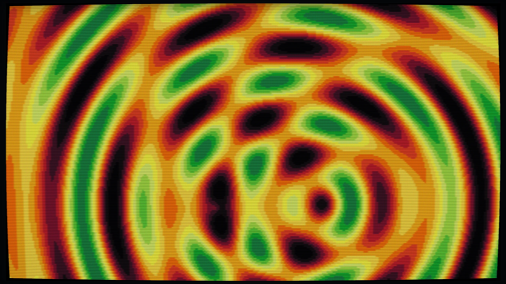

## Noch mehr PixelRAM

Unser Interferenzmuster besteht vollständig aus Berechnungen, die wir selbst auf die Pixel anwenden. PixelRAM kennt weder Kreise noch Wellen und enthält auch keinen Befehl für einen Tunnel oder ein Fraktal. Genau das macht die Bibliothek interessant: Sie stellt nur den Bildschirm und seine Pixel bereit, während du entscheidest, welche Algorithmen darauf arbeiten sollen.

Die folgenden beiden Programme zeigen, wie unterschiedlich die Ergebnisse sein können.

### Tunnel

Bei einem klassischen Tunnel-Effekt berechnen wir für jeden Pixel seinen Abstand und seinen Winkel zum Mittelpunkt des Bildschirms. Aus beiden Werten entstehen kreisförmige Strukturen und radiale Streifen, die sich so verändern, dass der Eindruck eines Fluges durch einen Tunnel entsteht.

```c
#include "pixelram.h"
#include <math.h>
#include <stdint.h>

#define W 320
#define H 180

int main(void)
{
    screen_open(W, H, pixel_rgb24, "PixelRAM Tunnel");
    use_palette("endesga_32");

    while (!should_close())
    {
        double t = seconds();
        double cx = W / 2.0 + sin(t * 0.7) * 18;
        double cy = H / 2.0 + cos(t * 0.9) * 10;

        for (int y = 0; y < H; y++)
            for (int x = 0; x < W; x++)
            {
                double dx = x - cx, dy = y - cy;
                double d = hypot(dx, dy);
                double a = atan2(dy, dx);

                double v =
                    sin(540.0 / (d + 1) + t * 4) +
                    sin(a * 8 + t * 1.2) + 2;

                double c = v * 7.75;
                if (c < 0) c = 0;
                if (c > 31) c = 31;

                int i = (int)c, j = i < 31 ? i + 1 : 31;
                double f = c - i;

                uint8_t r0, g0, b0, r1, g1, b1;
                get_palette(i, &r0, &g0, &b0);
                get_palette(j, &r1, &g1, &b1);

                double fade = (d - 10) / 30;
                if (fade < 0) fade = 0;
                if (fade > 1) fade = 1;
                fade = fade * fade * (3 - 2 * fade);

                set_pixel_rgb(x, y,
                    (r0 + (r1 - r0) * f) * fade,
                    (g0 + (g1 - g0) * f) * fade,
                    (b0 + (b1 - b0) * f) * fade);
            }

        present();
    }

    screen_close();
}
```

Die Funktion `atan2(dy, dx)` berechnet den Winkel eines Pixels zum Mittelpunkt. Gemeinsam mit dem Abstand `d` erhalten wir dadurch zwei Werte, aus denen das Muster auf der Tunnelwand berechnet werden kann. Das Grundprinzip ist trotzdem dasselbe wie zuvor: Jeder Pixel wird aus seiner Position und der aktuellen Zeit berechnet.

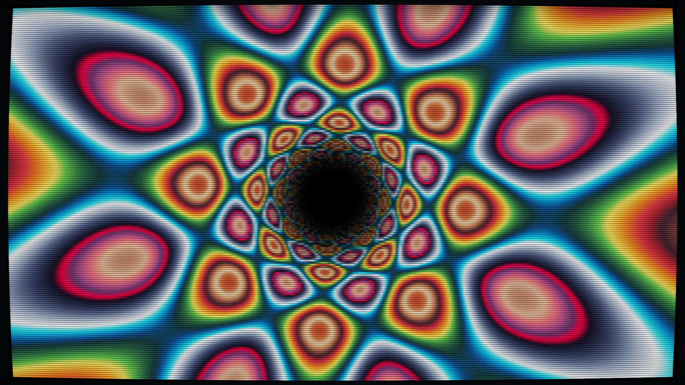

### Animierte Julia-Menge

Noch überraschender wird es bei einem Fraktal. Hier wird für jeden Pixel dieselbe kleine Rechnung immer wieder ausgeführt. Je nachdem, wie lange die Werte dabei klein bleiben, bekommt der Pixel eine andere Farbe. Aus dieser einfachen Regel entstehen sehr komplexe Formen.

```c
#include "pixelram.h"
#include <math.h>

#define W 320
#define H 180
#define ITER 48

int main(void)
{
    screen_open(W, H, pixel_indexed8, "PixelRAM Julia");
    use_palette("aap_64");

    while (!should_close())
    {
        double t = seconds();
        double cr = -0.72 + cos(t * 0.17) * 0.08;
        double ci =  0.27 + sin(t * 0.13) * 0.08;

        for (int y = 0; y < H; y++)
            for (int x = 0; x < W; x++)
            {
                double zx = (x - W / 2.0) * 3.0 / W;
                double zy = (y - H / 2.0) * 2.0 / H;
                int i = 0;

                while (zx * zx + zy * zy < 4 && i < ITER)
                {
                    double xx = zx * zx - zy * zy + cr;
                    zy = 2 * zx * zy + ci;
                    zx = xx;
                    i++;
                }

                set_pixel(x, y,
                    i == ITER ? 0 : 1 + i * 62 / ITER);
            }

        present();
    }

    screen_close();
}
```

Die beiden Werte `cr` und `ci` verändern sich langsam mit der Zeit, wodurch sich auch die Form des Fraktals kontinuierlich verändert. Du musst die Mathematik hinter Julia-Mengen nicht vollständig verstehen, um mit dem Programm zu experimentieren. Schon kleine Änderungen an `-0.72`, `0.27` oder `0.08` können völlig andere Formen erzeugen.

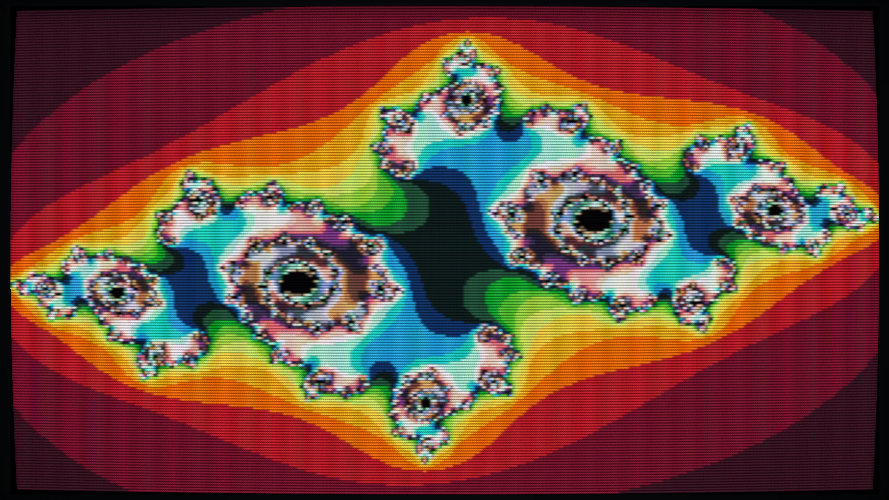

### Bonus: Palette Cycling

Bei allen bisherigen Animationen haben wir den Bildschirminhalt für jeden Frame neu berechnet. Mit einer Farbpalette gibt es aber noch einen ganz anderen Trick: Die Pixel können unverändert bleiben, während wir lediglich die Farben der Palette verändern. Im folgenden Beispiel wird der magische Kreis deshalb nur ein einziges Mal gezeichnet. In der Animationsschleife ändern wir anschließend ausschließlich acht Paletteneinträge – trotzdem sieht es so aus, als würde Energie durch das Muster wandern.

```c
#include "pixelram.h"
#include <math.h>
#include <stdint.h>

#define W 320
#define H 180

static const uint8_t magic[8][3] = {
    { 12,  10,  45},
    { 35,  20, 100},
    { 85,  30, 180},
    {190,  45, 220},
    {255, 180, 255},
    {150, 245, 255},
    { 30, 180, 255},
    { 15,  70, 160}
};

static void draw_scene(void)
{
    double cx = W / 2.0, cy = H / 2.0;

    for (int y = 0; y < H; y++)
        for (int x = 0; x < W; x++)
        {
            double dx = x - cx, dy = y - cy;
            double r = hypot(dx, dy);
            double a = atan2(dy, dx);

            int color = 0;

            /* Outer halo. */
            if (r > 67 && r < 71)
                color = 8 + ((int)(a * 8 + 40) & 7);

            /* Twelve radial marks. */
            if (r > 51 && r < 64 && fabs(sin(a * 12)) < .16)
                color = 8 + ((int)(r / 3 + a * 5) & 7);

            /* Two spell rings. */
            if ((r > 43 && r < 47) || (r > 29 && r < 33))
                color = 8 + ((int)(a * 9 + r / 3) & 7);

            /* Curved energy inside the circle. */
            if (r < 28 &&
                fabs(sin(r * .34 + a * 5)) < .38)
                color = 8 + ((int)(r / 2 + a * 4) & 7);

            /* Bright core. */
            if (r < 9)
                color = 8 + ((int)(r + a * 3) & 7);

            set_pixel(x, y, color);
        }
}

static void cycle_magic(double t)
{
    double p = fmod(t * 5.0, 8.0);
    int shift = (int)p;
    double f = p - shift;

    for (int i = 0; i < 8; i++)
    {
        int a = (i + shift) & 7;
        int b = (a + 1) & 7;

        set_palette(8 + i,
            magic[a][0] + (magic[b][0] - magic[a][0]) * f,
            magic[a][1] + (magic[b][1] - magic[a][1]) * f,
            magic[a][2] + (magic[b][2] - magic[a][2]) * f);
    }
}

int main(void)
{
    screen_open(W, H, pixel_indexed8, "Palette Cycling: Magic");

    set_palette(0,  2,  3,  9);

    cycle_magic(0);
    draw_scene();

    while (!should_close())
    {
        cycle_magic(seconds());
        present();
    }

    screen_close();
}
```

Schau dir dazu besonders `draw_scene()` an: Die Funktion wird vor der Animationsschleife genau einmal aufgerufen. Innerhalb der Schleife stehen nur `cycle_magic(seconds())` und `present()`. Kein einziger Pixel wird dort neu gesetzt; die scheinbare Bewegung entsteht ausschließlich durch die animierte Palette.

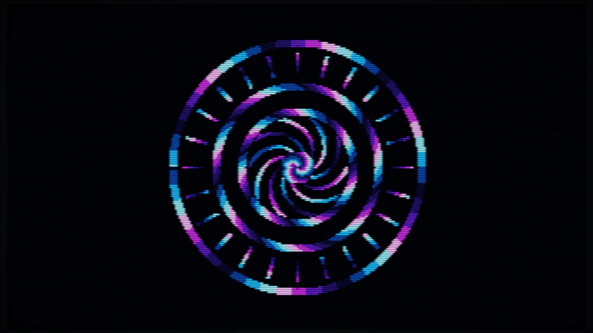

## Wie geht es weiter?

In diesem Tutorial haben wir keine fertigen Formen gezeichnet. Stattdessen haben wir für jeden Pixel selbst berechnet, welche Farbe dort erscheinen soll. Aus einem einzelnen Pixel wurde zunächst ein vollständiges berechnetes Bild, dann eine Kreiswelle, eine Animation und schließlich ein komplexes Interferenzmuster.

Dasselbe Grundprinzip lässt sich noch viel weiter treiben. Du könntest mit PixelRAM beispielsweise Fraktale und Partikelsimulationen programmieren, einen Raycaster oder Raytracer schreiben oder untersuchen, wie Bildformate wie JPEG ihre Daten wieder in Pixel verwandeln. Auch ein vollständiger Software-3D-Renderer beginnt letztlich bei derselben einfachen Frage:
**Welche Farbe soll dieser Pixel haben?**
