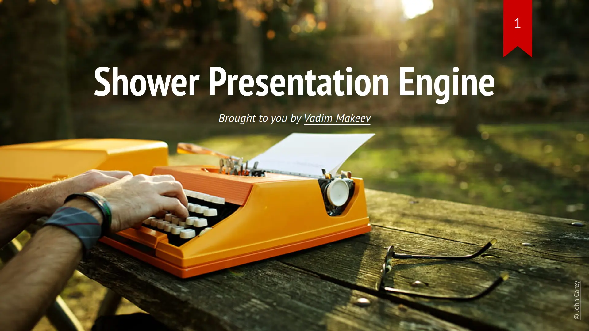
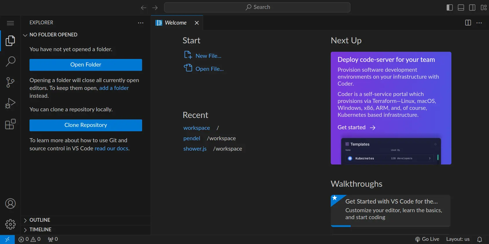
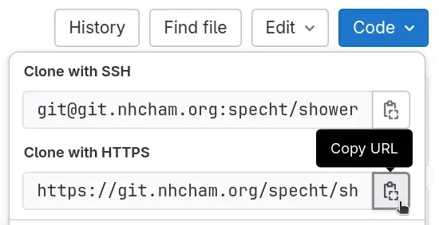
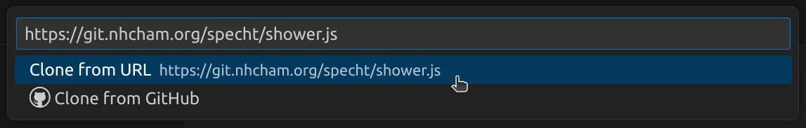
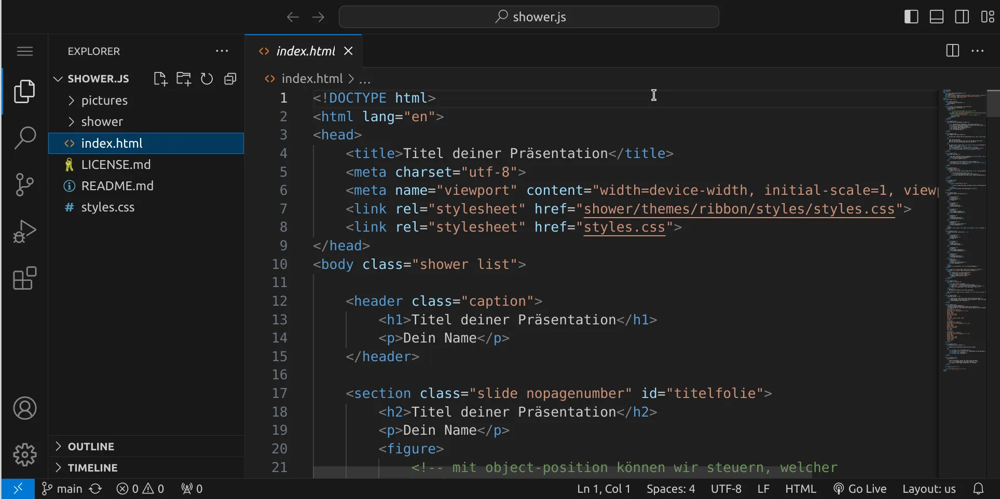
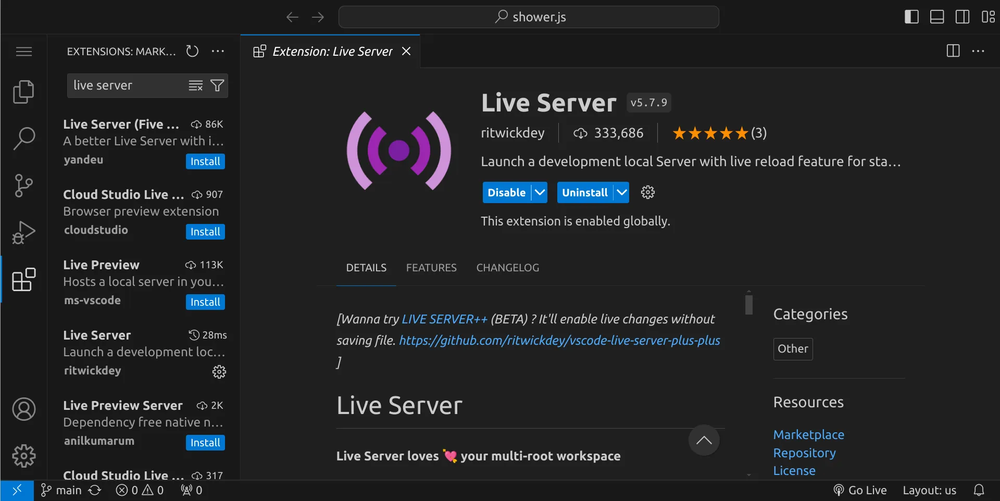
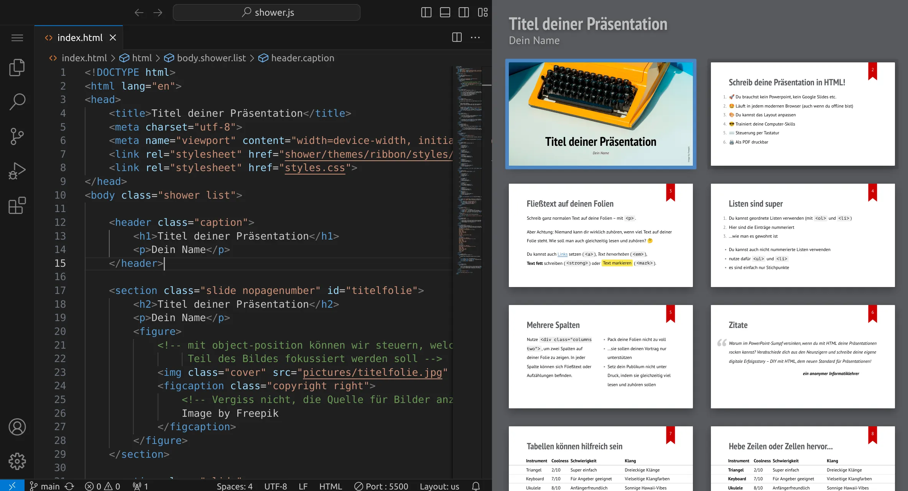

section: programming
image: showerjs.webp:0:80

# Eine Präsentation in HTML erstellen

Erstelle eine Präsentation mit shower.js in HTML und CSS. Mach dich unabhängig von PowerPoint und Keynote und erstelle eine Präsentation, die in jedem modernen Browser vom Stick oder von der Cloud aus funktioniert.

In diesem Tutorial erstellen wir eine Präsentation mit Hilfe von [shower.js](https://github.com/shower/shower) auf der Grundlage von HTML und CSS. Das heisst, dass jeder Webbrowser deine Präsentation abspielen kann und du keine besondere Software brauchst, um deine Präsentation abzuspielen. Du kannst shower.js hier [in Aktion sehen](https://shwr.me/).

## Los geht's!

Stelle zuerst sicher, dass du keinen Ordner geöffnet hast. Um sicherzugehen, drücke einfach den Shortcut für »Ordner schließen«: StrgK und dann F. Dein Workspace sollte jetzt ungefähr so aussehen:

### Repository klonen

Wir holen uns eine Vorlage mit Hilfe von Git, damit wir gleich loslegen können.
Öffne dazu die Seite [https://git.nhcham.org/specht/shower.js](https://git.nhcham.org/specht/shower.js), klicke auf den blauen Button »Code« und wähle die HTTPS-URL.

Wähle »Clone Repository« in deinem Workspace, füge die URL mit StrgV ein und bestätige mit Enter.

Anschließend müssen wir einen Speicherort für das Verzeichnis wählen. Wählen dafür den Ordner `/workspace`. Das Repository wird jetzt ins Verzeichnis `/workspace/shower.js` geklont. Öffne anschließend das Verzeichnis, indem du entweder die Frage, ob das Repository jetzt geöffnet werden soll, mit »Open« beantwortest oder indem du alternativ das Verzeichnis selbst öffnest (StrgK und dann StrgO).

Öffne die Datei `index.html` &ndash; dein Workspace sollte jetzt ungefähr so aussehen:

### Live Server-Erweiterung installieren

Als nächstes müssen wir eine Erweiterung installieren, die uns eine Live-Vorschau unserer Präsentation zeigen kann. Öffne dazu links die Extensions, suche die Erweiterung »Live Server« und klicke auf »Install«, um die Erweiterung zu installieren. Anschließend sollte dein Workspace so aussehen:

Öffne nun wieder den Explorer und öffne die `index.html`. Unten rechts findest du jetzt den Eintrag »Go Live«. Drück dort drauf und deine Präsentation wird sich in einem neuen Tab öffnen, das du mit der Maus einfach aus dem Browser lösen kannst, um beide Fenster nebeneinander anzuordnen.

### Schreib deine Präsentation

Du kannst nun damit beginnen, die Vorlage an deine Bedürfnisse anzupassen. Falls du nach Hilfe suchst: die Technologien, die hier verwendet werden, heißen HTML und CSS. Wenn du die `index.html` bearbeitest, musst du darauf achten, dass du vorsichtig bist, da die Syntax relativ wichtig ist und eine fehlende spitze Klammer dazu führen kann, dass viele Folien auf einmal nicht mehr sichtbar sind. Gehe also behutsam vor und verwende zur Not StrgZ, um Änderungen rückgängig zu machen. Speichere deine Änderungen mit StrgS, um den Effekt im Vorschaufenster zu sehen, falls dein Workspace Änderungen nicht schon automatisch speichert (das kannst du im Menü unter File / Auto Save einstellen).

#### HTML-Syntax

HTML wird normalerweise nicht für Präsentationen, sondern für Websites verwendet. Die Funktion dieser Sprache ist es, Text mit bestimmten Eigenschaften auszuzeichnen &ndash; daher auch der Name »Hypertext Markup Language«. Schau dir den Quelltext einer beliebigen Website mit StrgU an und du wirst HTML-Code sehen (der sicherlich wiederum auch JavaScript enthält).

Generell ist es so, dass bei HTML Textteile in sogenannte Tags eingeschlossen werden. Schreibt man z. B. `H2O`, sorgen die ``-Tags dafür, dass die 2 tiefer gestellt wird: H2O. Ein öffnendes Tag wie `` muss immer mit einem passenden schließenden Tag `` geschlossen werden, wobei Tags beliebig geschachtelt werden können. Die folgende Auflistung ist nicht vollständig und es gibt viele weitere Tags, die du an anderen Stellen im Internet dokumentiert findest.

<table class='table'>
<tr>
<th>Tag</th>
<th>Bedeutung</th>
</tr>
<tr>
<td><code>&lt;strong&gt;</code></td>
<td><strong>fetter Text</strong></td>
</tr>
<tr>
<td><code>&lt;em&gt;</code></td>
<td><em>kursiver Text</em></td>
</tr>
<tr>
<td><code>&lt;u&gt;</code></td>
<td><u>unterstrichener Text</u></td>
</tr>
<tr>
<td><code>&lt;sub&gt;</code></td>
<td>tiefgestellter Text</td>
</tr>
<tr>
<td><code>&lt;sup&gt;</code></td>
<td>hochgestellter Text</td>
</tr>
<tr>
<td><code>&lt;p&gt;</code></td>
<td>
Absatz
</td>
</tr>
<tr>
<td><code>&lt;h1&gt;</code></td>
<td><h1 style='margin: 0;'>Überschrift 1</h1></td>
</tr>
<tr>
<td><code>&lt;h2&gt;</code></td>
<td><h2 style='margin: 0;'>Überschrift 2</h2></td>
</tr>
<tr>
<td><code>&lt;h3&gt;</code></td>
<td><h3 style='margin: 0;'>Überschrift 3</h3></td>
</tr>
<tr>
<td><code>&lt;h4&gt;</code></td>
<td><h4 style='margin: 0;'>Überschrift 4</h4></td>
</tr>
<tr>
<td><code>&lt;ul&gt;</code></td>
<td>Aufzählung ohne Nummerierung</td>
</tr>
<tr>
<td><code>&lt;ol&gt;</code></td>
<td>Aufzählung mit Nummerierung</td>
</tr>
<tr>
<td><code>&lt;li&gt;</code></td>
<td>Listenpunkt (nur innerhalb <code>&lt;ul&gt;</code> oder <code>&lt;ol&gt;</code>)</td>
</tr>
<tr>
<td><code>&lt;img&gt;</code></td>
<td>Bild</td>
</tr>
</table>

#### CSS-Syntax

Während HTML für die Struktur eines Dokuments zuständig ist, wird CSS für die visuelle Repräsentation, also das Aussehen, verwendet.

<em>to be continued...</em>

