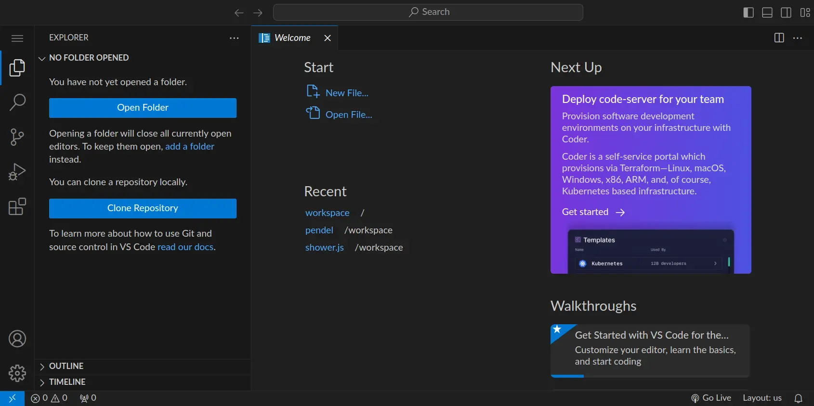
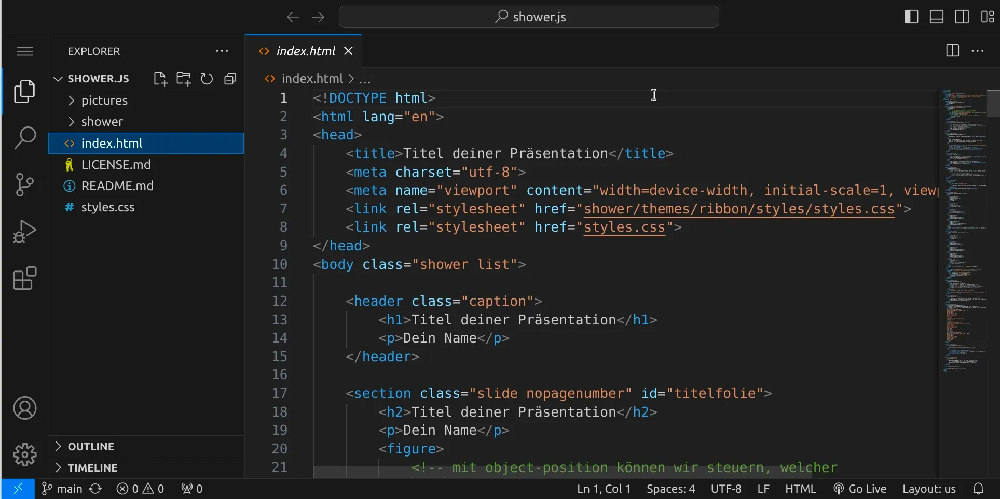

section: programming

# Erstelle eine Präsentation in HTML!

Erstelle eine Präsentation mit shower.js in HTML und CSS. Mach dich unabhängig von PowerPoint und Keynote und erstelle eine Präsentation, die in jedem modernen Browser vom Stick oder von der Cloud aus funktioniert.

In diesem Tutorial erstellen wir eine Präsentation mit Hilfe von [shower.js](https://github.com/shower/shower) auf der Grundlage von HTML und CSS. Das heisst, dass jeder Webbrowser deine Präsentation abspielen kann.

## Los geht's!

Stelle zuerst sicher, dass du keinen Ordner geöffnet hast. Um sicherzugehen, drücke einfach den Shortcut für »Ordner schließen«: StrgK und dann F. Dein Workspace sollte jetzt ungefähr so aussehen:

### Repository klonen

Wir holen uns eine Vorlage mit Hilfe von Git, damit wir gleich loslegen können.
Öffne dazu die Seite [https://git.nhcham.org/specht/shower.js](https://git.nhcham.org/specht/shower.js), klicke auf den blauen Button »Code« und wähle die HTTPS-URL.

Wähle »Clone Repository« in deinem Workspace, füge die URL mit StrgV ein und bestätige mit Enter.

Anschließend müssen wir einen Speicherort für das Verzeichnis wählen. Wählen dafür den Ordner `/workspace`. Das Repository wird jetzt ins Verzeichnis `/workspace/shower.js` geklont. Öffne anschließend das Verzeichnis, indem du entweder die Frage, ob das Repository jetzt geöffnet werden soll, mit »Open« beantwortest oder indem du alternativ das Verzeichnis selbst öffnest (StrgK und dann StrgO).

Öffne die Datei `index.html` &ndash; dein Workspace sollte jetzt ungefähr so aussehen:

### Live Server installieren

Als nächstes müssen wir eine Erweiterung installieren, die uns eine Live-Vorschau unserer Präsentation zeigen kann.

<em>Fortsetzung folgt...</em>

