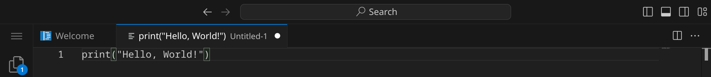
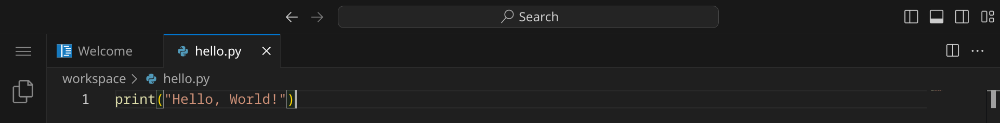
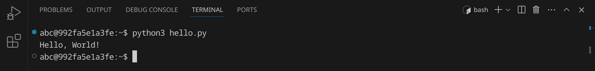
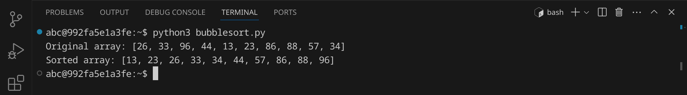

<div class='meta'>
image: python-logo.png
</div>

# Python <span style='font-size: 80%;'>(1991)</span>

<div class='floatright' style='width: 12em;'>
    
    <p>Guido van Rossum</p>
</div>

<p class='abstract'>
Python, entwickelt von Guido van Rossum und erstmals 1991 veröffentlicht, ist eine der beliebtesten Programmiersprachen der Welt. Python wird aufgrund seiner Einfachheit und Lesbarkeit in vielen Bereichen eingesetzt, darunter Webentwicklung, Datenanalyse, künstliche Intelligenz und maschinelles Lernen.
</p>

Bekannte Beispiele für Anwendungen, die in Python entwickelt wurden, sind das Web-Framework Django, die Datenanalysebibliothek Pandas und das maschinelle Lernframework TensorFlow. Heutzutage ist Python äußerst relevant und weit verbreitet, da es eine aktive Community und eine Vielzahl von Bibliotheken und Frameworks bietet, die die Entwicklung in verschiedenen Domänen unterstützen.

<!-- ## Eigenschaften

- **Einfachheit**: Python legt Wert auf eine klare und einfache Syntax, die es ermöglicht, den Code leicht zu lesen und zu schreiben.
- **Lesbarkeit**: Python-Code ist leicht lesbar und verständlich, was die Wartung und Weiterentwicklung von Projekten erleichtert.
- **Vielseitigkeit**: Python wird in vielen Bereichen eingesetzt, darunter Webentwicklung, Datenanalyse, künstliche Intelligenz und maschinelles Lernen.
- **Community**: Python hat eine aktive und engagierte Community, die eine Vielzahl von Bibliotheken und Frameworks entwickelt hat.
- **Interpretiert**: Python ist eine interpretierte Sprache, was bedeutet, dass der Code zur Laufzeit ausgeführt wird.
- **Objektorientierung**: Python ist eine objektorientierte Programmiersprache, die auf der Verwendung von Objekten und Klassen basiert. -->

## Hello, world!

Python ist eine Skriptsprache, was bedeutet, dass der Code zur Laufzeit interpretiert wird. Du hast zwei Möglichkeiten, Python-Code auszuführen:

1. Du kannst Python-Code direkt in der Python-Shell ausführen.
2. Du kannst Python-Code in einer Textdatei speichern und dann ausführen.

**Möglichkeit 1:** Python-Code in der Python-Shell ausführen

Öffne dazu ein Terminal, indem du entweder <span class='key'>Strg</span><span class='key'>J</span> drückst oder das Panel-Symbol  rechts oben drückst. Dein Fenster sollte jetzt ungefähr so aussehen:


Starte nun die Python-Shell, indem du `python3` eingibst und dann <span class='key'>Enter</span> drückst. Du solltest eine Ausgabe wie diese sehen:


Jetzt kannst du Python-Code direkt in der Shell eingeben und ausführen. Schreibe einfach `print("Hello, world!")` und drücke <span class='key'>Enter</span>. Du solltest die Ausgabe `Hello, world!` sehen.

Du kannst die Python-Shell wieder beenden, indem du `exit()` eingibst und <span class='key'>Enter</span> drückst oder einfach <span class='key'>Strg</span><span class='key'>D</span> drückst.

**Möglichkeit 2:** Python-Code in einer Textdatei speichern und ausführen

Python-Programme werden in Textdateien mit der Endung `.py` geschrieben. Ein Python-Interpreter liest anschließend den Quelltext und führt ihn aus.

Stelle zuerst sicher, dass du keinen Ordner geöffnet hast. Um sicherzugehen, drücke einfach den Shortcut für »Ordner schließen«: <span class='key'>Strg</span><span class='key'>K</span> und dann <span class='key'>F</span>. Dein Workspace sollte jetzt ungefähr so aussehen:


### Quelltext schreiben

Klicke auf »New File« und wähle als Dateityp »Text File« (oder bestätige einfach mit <span class='key'>Enter</span>).


Schreibe nun den folgenden Code in die Datei:

_include_file(hello.py, python)

Da Visual Studio Code noch nicht weiß, dass es sich um Python-Quelltext handelt, ist dein Programm momentan noch einfarbig, aber das wird sich gleich ändern. An dem weißen Punkt erkennst du, dass deine Änderungen noch nicht gespeichert sind.



Drücke nun <span class='key'>Strg</span><span class='key'>S</span>, um die Datei zu speichern. Gib `hello.py` ein – der vollständige Pfad zu deiner Datei lautet dann `/workspace/hello.py`.


Sobald du die Datei gespeichert hast, wird sie automatisch als Python-Datei erkannt und die Syntax wird hervorgehoben.



### Skript ausführen

Um unser Programm auszuführen, müssen wir den Python-Interpreter aufrufen und ihm den Dateinamen unseres Programms übergeben.

Öffne dazu ein Terminal, indem du <span class='key'>Strg</span><span class='key'>J</span> drückst und gib folgenden Befehl ein:

```bash
python3 hello.py
```

<div class='hint'>
Du musst nicht den vollständigen Dateinamen schreiben. Schreib einfach <code>python3 he</code> und drücke <span class='key'>Tab</span>, um den Dateinamen automatisch zu <code>hello.py</code> vervollständigen zu lassen. Du kannst danach ganz normal weiterschreiben.
</div>

Das Programm sollte die Nachricht `Hello, World!` im Terminal ausgeben:



### Fehler finden und beheben

Wenn du einen Fehler im Code machst, wird Python eine Fehlermeldung ausgeben. Versuche zum Beispiel, statt `print` das Wort `prin` zu schreiben:

```python
prin("Hello, World!")
```

Speichere die Datei und führe das Skript erneut aus:

```bash
python3 hello.py
```

<div class='hint'>
Nutze die Pfeiltaste hoch <span class='key'>↑</span>, um den letzten Befehl erneut einzugeben. So kannst du schnell dein Programm testen, nachdem du es verändert hast.
</div>

Python sollte eine Fehlermeldung ausgeben, die dir hilft, den Fehler zu finden:


Es lohnt sich, die Fehlermeldungen genau zu lesen, um den Fehler zu finden und zu beheben. Achte auf die Zeilennummer (in diesem Beispiel 1) und den Text, der dir sagt, was falsch ist. Denke daran, den Fehler wieder zu beheben, bevor du das nächste Beispiel ausprobierst.

### Shebang `#!`

Bisher musst du, um dein Skript auszuführen, immer den Python-Interpreter explizit aufrufen. Wenn du dein Skript wie ein normales Programm ausführen möchtest, kannst du ein sogenanntes Shebang am Anfang deiner Datei hinzufügen. Das Shebang besteht aus einer Raute `#` gefolgt von einem Ausrufezeichen `!` und dem Pfad zum Python-Interpreter. In unserem Fall sieht das so aus:

```python
#!/usr/bin/env python3
```

Füge diese Zeile ganz oben in deinem Skript ein und speichere die Datei. Bevor wir das Skript ausführen können, müssen wir es noch ausführbar machen. Das machen wir mit dem Befehl `chmod`:

```bash
chmod +x hello.py
```
Jetzt können wir das Skript direkt ausführen:

```bash
./hello.py
```


## Python-Skripte direkt in Visual Studio Code ausführen

Visual Studio Code bietet auch eine integrierte Möglichkeit, Python-Skripte direkt auszuführen, ohne dass du das Skript jedesmal im Terminal ausführen musst. Dazu musst du die Python-Erweiterung installieren. Klicke dazu auf das Extensions-Symbol  in der Seitenleiste und suche nach »Python«. Klicke auf »Install«, um die Erweiterung zu installieren.


Du kannst nun dein Skript einfach direkt aus dem Editor starten, indem du rechts oben auf das Run-Symbol  klickst.

## Primfaktorenzerlegung

Im zweiten Beispiel wollen wir eine Zahl in ihre Primfaktoren zerlegen.
An diesem Beispiel kannst du sehen, wie man in Python Benutzereingaben verarbeitet und Schleifen verwendet.
Erstelle eine neue Datei mit <span class='key'>Strg</span><span class='key'>Alt</span><span class='key'>N</span> und schreibe den folgenden Code hinein:

_include_file(factor.py, python)

Speichere die Datei unter dem Namen `factor.py` und führe sie aus:


Das Programm hat die Zahl 123 in ihre Primfaktoren zerlegt und ausgegeben. Anders als andere Programmiersprachen kann Python auch die Zahl 3000000000 in Sekundenbruchteilen zerlegen. Wenn du allerdings eine sehr große Zahl wie 123456789123456789 verwendest, dauert die Berechnung sehr lange (probier es gern aus, du kannst das Programm mit <span class='key'>Strg</span><span class='key'>C</span> abbrechen).

## Bubblesort

Im dritten Beispiel wollen wir eine Liste von 10 Zufallszahlen sortieren. Dafür verwenden wir den [Bubblesort-Algorithmus](https://de.wikipedia.org/wiki/Bubblesort), der zwar nicht besonders effizient ist, aber sehr einfach zu verstehen und zu implementieren. Der Bubblesort-Algorithmus funktioniert, indem er die Liste mehrmals durchläuft und benachbarte Elemente vertauscht, wenn sie in der falschen Reihenfolge sind.

An diesem Beispiel kannst du sehen, wie man in Python Arrays verwendet, Funktionen verwendet und Schleifen verschachtelt.

Erstelle eine neue Datei und schreibe den folgenden Code hinein:

_include_file(bubblesort.py, python)

Speichere das Skript unter dem Namen `bubblesort.py` und führe es aus:



Das Programm hat eine Liste von 10 Zufallszahlen sortiert. Versuche, den Quelltext so zu verändern, dass statt 10 Zahlen 100 oder mehr Zahlen sortiert werden.

## Zusammenfassung

In diesem Kapitel hast du an drei Beispielen gesehen, wie man ein einfaches Python-Skript schreiben und ausführen kann. Das ist natürlich nur ein erster Eindruck. Um Python wirklich zu beherrschen, musst du noch viel mehr lernen – am besten, indem du eigene Skripte schreibst und ausprobierst. Die Buchhandlungen, Bibliotheken und Youtube sind voll von Material für dich. Viel Spaß beim Programmieren!
