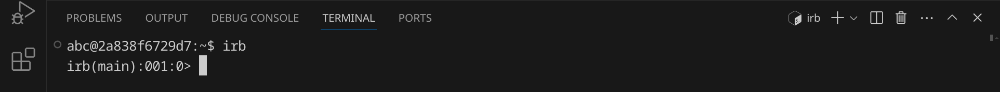
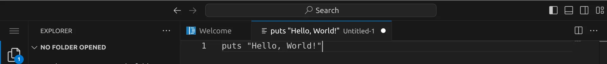
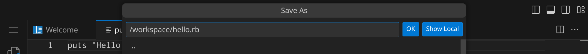
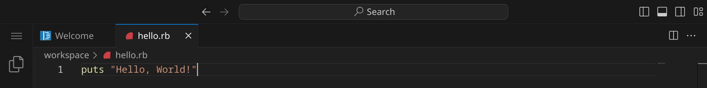
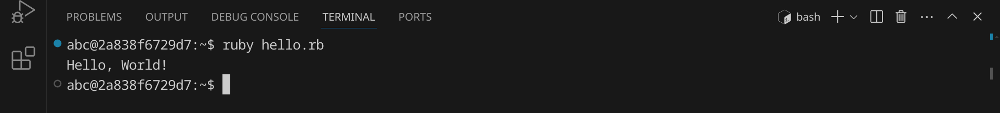
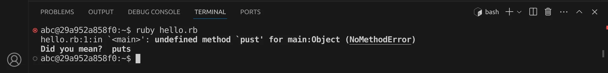
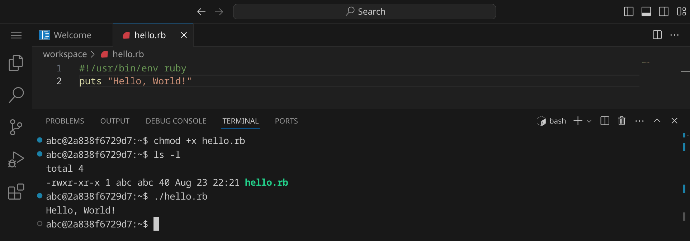
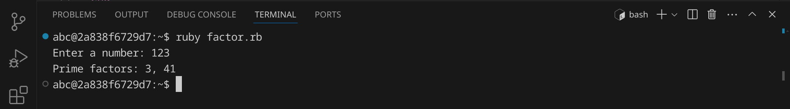
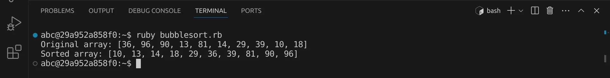

<div class='meta'>
image: ruby-logo.png
</div>

# Ruby <span style='font-size: 80%;'>(1995)</span>

<div class='floatright' style='width: 12em;'>
    
    <p>
        Yukihiro Matsumoto<br>
        <span style='font-size: 90%; opacity: 0.7;'>(Foto von Marcin Bajer)</span>
    </p>
</div>

<p class='abstract'>
Ruby ist eine von Yukihiro Matsumoto entwickelte Programmiersprache, die im Jahr 1995 veröffentlicht wurde. Der Fokus von Ruby liegt auf der Einfachheit und Produktivität, weshalb sie oft als »Programmiersprache für glückliche Entwickler« bezeichnet wird. Ruby wird häufig für die Entwicklung von Webanwendungen eingesetzt und bietet eine Vielzahl von Frameworks und Bibliotheken für die Webentwicklung.
</p>

<!-- ## Eigenschaften

- **Dynamische Typisierung**: Ruby ist eine dynamisch typisierte Sprache, was bedeutet, dass Variablen ihren Datentyp zur Laufzeit ändern können.
- **Objektorientierung**: Ruby ist eine objektorientierte Programmiersprache, die auf der Verwendung von Objekten und Klassen basiert.
- **Hohe Lesbarkeit**: Ruby legt Wert auf eine klare und verständliche Syntax, die es ermöglicht, den Code leicht zu lesen und zu verstehen.
- **Webentwicklung**: Ruby wird häufig für die Entwicklung von Webanwendungen eingesetzt und bietet eine Vielzahl von Frameworks und Bibliotheken für die Webentwicklung.
- **Community**: Ruby hat eine aktive und engagierte Community, die eine Vielzahl von Bibliotheken und Frameworks entwickelt hat.
- **Rails**: Ruby on Rails ist ein beliebtes Webframework, das auf Ruby basiert und die Entwicklung von Webanwendungen erleichtert. -->

## Hello, world!

Ruby ist eine Skriptsprache, was bedeutet, dass der Code zur Laufzeit interpretiert wird. Du hast zwei Möglichkeiten, Ruby-Code auszuführen:

1. Du kannst Ruby-Code direkt in der Ruby-Shell `irb` ausführen.
2. Du kannst Ruby-Code in einer Textdatei speichern und dann ausführen.

**Möglichkeit 1:** Ruby-Code in der Ruby-Shell ausführen

Öffne dazu ein Terminal, indem du entweder <span class='key'>Strg</span><span class='key'>J</span> drückst oder das Panel-Symbol  rechts oben drückst. Dein Fenster sollte jetzt ungefähr so aussehen:


Starte nun die Ruby-Shell, indem du `irb` eingibst und dann <span class='key'>Enter</span> drückst. Du solltest eine Ausgabe wie diese sehen:



Jetzt kannst du Ruby-Code direkt in der Shell eingeben und ausführen. Schreibe einfach `puts "Hello, world!"` und drücke <span class='key'>Enter</span>. Du solltest die Ausgabe `Hello, world!` sehen.

Du kannst die Ruby-Shell wieder beenden, indem du `exit` eingibst und <span class='key'>Enter</span> drückst oder einfach <span class='key'>Strg</span><span class='key'>D</span> drückst.

**Möglichkeit 2:** Ruby-Code in einer Textdatei speichern und ausführen

Ruby-Programme werden in Textdateien mit der Endung `.rb` geschrieben. Ein Ruby-Interpreter liest anschließend den Quelltext und führt ihn aus.

Stelle zuerst sicher, dass du keinen Ordner geöffnet hast. Um sicherzugehen, drücke einfach den Shortcut für »Ordner schließen«: <span class='key'>Strg</span><span class='key'>K</span> und dann <span class='key'>F</span>. Dein Workspace sollte jetzt ungefähr so aussehen:


### Quelltext schreiben

Klicke auf »New File« und wähle als Dateityp »Text File« (oder bestätige einfach mit <span class='key'>Enter</span>).


Schreibe nun den folgenden Code in die Datei:

_include_file(hello.rb, ruby)

Da Visual Studio Code noch nicht weiß, dass es sich um Ruby-Quelltext handelt, ist dein Programm momentan noch einfarbig, aber das wird sich gleich ändern. An dem weißen Punkt erkennst du, dass deine Änderungen noch nicht gespeichert sind.



Drücke nun <span class='key'>Strg</span><span class='key'>S</span>, um die Datei zu speichern. Gib `hello.rb` ein – der vollständige Pfad zu deiner Datei lautet dann `/workspace/hello.rb`.



Sobald du die Datei gespeichert hast, wird sie automatisch als Ruby-Datei erkannt und die Syntax wird hervorgehoben.



### Skript ausführen

Um unser Programm auszuführen, müssen wir den Ruby-Interpreter aufrufen und ihm den Dateinamen unseres Programms übergeben.

Öffne dazu ein Terminal, indem du <span class='key'>Strg</span><span class='key'>J</span> drückst und gib folgenden Befehl ein:

```bash
ruby hello.rb
```

<div class='hint'>
Du musst nicht den vollständigen Dateinamen schreiben. Schreib einfach <code>ruby he</code> und drücke <span class='key'>Tab</span>, um den Dateinamen automatisch zu <code>hello.rb</code> vervollständigen zu lassen. Du kannst danach ganz normal weiterschreiben.
</div>

Das Programm sollte die Nachricht `Hello, World!` im Terminal ausgeben:



### Fehler finden und beheben

Wenn du einen Fehler im Code machst, wird Ruby eine Fehlermeldung ausgeben. Versuche zum Beispiel, statt `puts` das Wort `pust` zu schreiben:

```ruby
pust "Hello, World!"
```

Speichere die Datei und führe das Skript erneut aus:

```bash
ruby hello.rb
```

<div class='hint'>
Nutze die Pfeiltaste hoch <span class='key'>↑</span>, um den letzten Befehl erneut einzugeben. So kannst du schnell dein Programm testen, nachdem du es verändert hast.
</div>

Ruby sollte eine Fehlermeldung ausgeben, die dir hilft, den Fehler zu finden:



Es lohnt sich, die Fehlermeldungen genau zu lesen, um den Fehler zu finden und zu beheben. Achte auf die Zeilennummer (in diesem Beispiel 1) und den Text, der dir sagt, was falsch ist. Denke daran, den Fehler wieder zu beheben, bevor du das nächste Beispiel ausprobierst.

### Shebang `#!`

Bisher musst du, um dein Skript auszuführen, immer den Ruby-Interpreter explizit aufrufen. Wenn du dein Skript wie ein normales Programm ausführen möchtest, kannst du ein sogenanntes Shebang am Anfang deiner Datei hinzufügen. Das Shebang besteht aus einer Raute `#` gefolgt von einem Ausrufezeichen `!` und dem Pfad zum Ruby-Interpreter. In unserem Fall sieht das so aus:

```ruby
#!/usr/bin/env ruby
```

Füge diese Zeile ganz oben in deinem Skript ein und speichere die Datei. Bevor wir das Skript ausführen können, müssen wir es noch ausführbar machen. Das machen wir mit dem Befehl `chmod`:

```bash
chmod +x hello.rb
```
Jetzt können wir das Skript direkt ausführen:

```bash
./hello.rb
```



## Primfaktorenzerlegung

Im zweiten Beispiel wollen wir eine Zahl in ihre Primfaktoren zerlegen.
An diesem Beispiel kannst du sehen, wie man in Ruby Benutzereingaben verarbeitet und Schleifen verwendet.
Erstelle eine neue Datei mit <span class='key'>Strg</span><span class='key'>Alt</span><span class='key'>N</span> und schreibe den folgenden Code hinein:

_include_file(factor.rb, ruby)

Speichere die Datei unter dem Namen `factor.rb` und führe sie aus:



Das Programm hat die Zahl 123 in ihre Primfaktoren zerlegt und ausgegeben. Anders als andere Programmiersprachen kann Ruby auch die Zahl 3000000000 in Sekundenbruchteilen zerlegen. Auch mit einer sehr großen Zahl wie 123456789123456789 kommt das Programm problemlos zurecht. Falls du auf eine Zahl stoßen solltest, die so groß ist, dass das Programm sehr lange braucht, kannst du das Programm mit <span class='key'>Strg</span><span class='key'>C</span> abbrechen.

## Bubblesort

Im dritten Beispiel wollen wir eine Liste von 10 Zufallszahlen sortieren. Dafür verwenden wir den [Bubblesort-Algorithmus](https://de.wikipedia.org/wiki/Bubblesort), der zwar nicht besonders effizient ist, aber sehr einfach zu verstehen und zu implementieren. Der Bubblesort-Algorithmus funktioniert, indem er die Liste mehrmals durchläuft und benachbarte Elemente vertauscht, wenn sie in der falschen Reihenfolge sind.

An diesem Beispiel kannst du sehen, wie man in Ruby Listen verwendet, Funktionen verwendet und Schleifen verschachtelt.

Erstelle eine neue Datei und schreibe den folgenden Code hinein:

_include_file(bubblesort.rb, ruby)

Speichere das Skript unter dem Namen `bubblesort.rb` und führe es aus:



Das Programm hat eine Liste von 10 Zufallszahlen sortiert. Versuche, den Quelltext so zu verändern, dass statt 10 Zahlen 100 oder mehr Zahlen sortiert werden.

## Zusammenfassung

In diesem Kapitel hast du an drei Beispielen gesehen, wie man ein einfaches Ruby-Skript schreiben und ausführen kann. Das ist natürlich nur ein erster Eindruck. Um Ruby wirklich zu beherrschen, musst du noch viel mehr lernen – am besten, indem du eigene Skripte schreibst und ausprobierst. Die Buchhandlungen, Bibliotheken und Youtube sind voll von Material für dich. Viel Spaß beim Programmieren!
