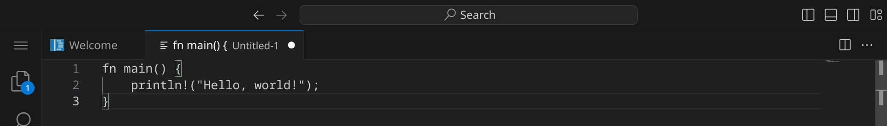
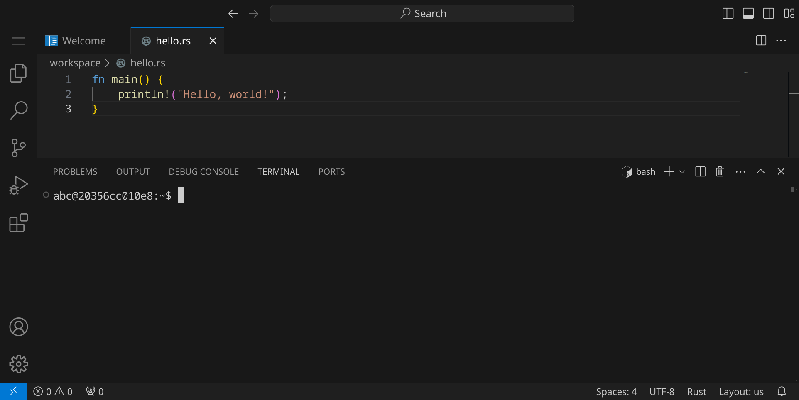
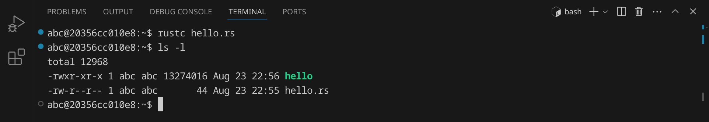
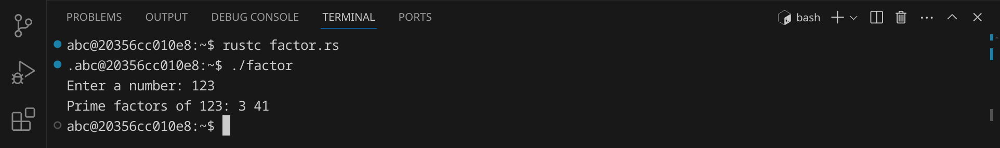

<div class='meta'>
image: rust-logo.png
needs_contrast: light
</div>

# Rust <span style='font-size: 80%;'>(2015)</span>

<div class='floatright' style='width: 12em;'>
    
    <p>
        Graydon Hoare
    </p>
</div>

<p class='abstract'>
Rust, entwickelt von Graydon Hoare und erstmals 2015 veröffentlicht, ist eine kompilierte Programmiersprache, die für die Entwicklung von Systemsoftware und Webanwendungen konzipiert wurde. Rust legt besonderen Wert auf Sicherheit, Geschwindigkeit und Parallelität, was sie ideal für die Entwicklung von Betriebssystemen, Browser-Engines und anderen leistungsintensiven Anwendungen macht.
</p>

Bekannte Beispiele für die Verwendung von Rust sind der Browser-Engine-Teil von Mozilla Firefox, genannt Servo, und das Betriebssystem Redox. Heutzutage ist Rust äußerst relevant, da sie von einer aktiven Community unterstützt wird und eine wachsende Anzahl von Bibliotheken und Frameworks bietet, die die Entwicklung sicherer und effizienter Software ermöglichen.

## Hello, world!

Rust-Programme werden in Textdateien mit der Endung `.rs` geschrieben. Diese Dateien werden anschließend von einem Compiler in ausführbare Dateien übersetzt, die auf deinem Computer direkt ausgeführt werden können.

Stelle zuerst sicher, dass du keinen Ordner geöffnet hast. Um sicherzugehen, drücke einfach den Shortcut für »Ordner schließen«: <span class='key'>Strg</span><span class='key'>K</span> und dann <span class='key'>F</span>. Dein Workspace sollte jetzt ungefähr so aussehen:


### Quelltext schreiben

Klicke auf »New File« und wähle als Dateityp »Text File«.


Schreibe nun den folgenden Code in die Datei:

_include_file(hello.rs, rust)

Da Visual Studio Code noch nicht weiß, dass es sich um Rust-Quelltext handelt, ist dein Programm momentan noch einfarbig, aber das wird sich gleich ändern. An dem weißen Punkt erkennst du, dass deine Änderungen noch nicht gespeichert sind.



Drücke nun <span class='key'>Strg</span><span class='key'>S</span>, um die Datei zu speichern. Gib `hello.rs` ein – der vollständige Pfad zu deiner Datei lautet dann `/workspace/hello.rs`.


Sobald du die Datei gespeichert hast, wird sie automatisch als Rust-Datei erkannt und die Syntax wird hervorgehoben.


### Kompilieren und ausführen

Bevor wir das Programm ausführen können, müssen wir es kompilieren. Dadurch wird der Quelltext in Maschinencode übersetzt, den dein Computer ausführen kann.

Öffne dazu ein Terminal, indem du entweder <span class='key'>Strg</span><span class='key'>J</span> drückst oder das Panel-Symbol  rechts oben drückst. Dein Fenster sollte jetzt ungefähr so aussehen:



Um das Programm zu kompilieren, gib folgenden Befehl ein:

```bash
rustc hello.rs
```

<div class='hint'>
Du musst nicht den vollständigen Dateinamen schreiben. Schreib einfach <code>rustc he</code> und drücke <span class='key'>Tab</span>, um den Dateinamen automatisch zu <code>hello.rs</code> vervollständigen zu lassen. Du kannst danach ganz normal weiterschreiben.
</div>

Wenn du keinen Fehler gemacht hast, wird das Programm erfolgreich kompiliert und die ausführbare Datei `hello` wird im selben Verzeichnis erstellt. Du kannst dies überprüfen, indem du dir die Dateien im aktuellen Verzeichnis mit `ls` oder `ls -l` anzeigen lässt:



Die grüne Datei `hello` ist die ausführbare Datei – im Unterschied zu Windows, wo ausführbare Dateien die Endung `.exe` haben, haben ausführbare Dateien unter Linux keine Endung. Um das Programm auszuführen, gib folgenden Befehl ein:

```bash
./hello
```

Das Programm sollte die Nachricht `Hello, World!` im Terminal ausgeben. Du kannst beide Schritte auch in einem Befehl kombinieren:

```bash
rustc hello.rs && ./hello
```

<div class='hint'>
Die Zeichenkombination <code>&amp;&amp;</code> sorgt dafür, dass der zweite Befehl nur ausgeführt wird, wenn der erste erfolgreich war.
</div>

### Fehler finden und beheben

Wenn du einen Fehler im Code machst, wird der Compiler eine Fehlermeldung ausgeben. Versuche zum Beispiel, statt `println` das Wort `printn` zu schreiben:

```rust
printn!("Hello, world!");
```

Speichere die Datei und führe den Compiler erneut aus:

```bash
rustc hello.rs
```

<div class='hint'>
Nutze die Pfeiltaste hoch <span class='key'>↑</span>, um den letzten Befehl erneut einzugeben. So kannst du schnell dein Programm testen, nachdem du es verändert hast.
</div>

Der Compiler sollte eine Fehlermeldung ausgeben, die dir hilft, den Fehler zu finden:


Es lohnt sich, die Fehlermeldungen genau zu lesen, um den Fehler zu finden und zu beheben. Achte auf die Zeilennummer (in diesem Beispiel 2) und den Text, der dir sagt, was falsch ist. Denke daran, den Fehler wieder zu beheben, bevor du das nächste Beispiel ausprobierst.

## Primfaktorzerlegung

Im zweiten Beispiel wollen wir eine Zahl in ihre Primfaktoren zerlegen. An diesem Beispiel kannst du sehen, wie man in Rust Benutzereingaben verarbeitet und Schleifen verwendet.
Erstelle eine neue Datei mit <span class='key'>Strg</span><span class='key'>Alt</span><span class='key'>N</span> und schreibe den folgenden Code hinein:

_include_file(factor.rs, rust)

Speichere die Datei unter dem Namen `factor.rs`. Kompiliere das Programm:

```bash
rustc factor.rs
```

Falls du keine Fehlermeldung erhältst, kannst du das Programm ausführen und testen:



Das Programm hat die Zahl 123 in ihre Primfaktoren zerlegt und ausgegeben. Anders als andere Programmiersprachen kann Rust auch die Zahl 3000000000 in Sekundenbruchteilen zerlegen. Auch mit einer sehr großen Zahl wie 123456789123456789 kommt das Programm problemlos zurecht. Falls du auf eine Zahl stoßen solltest, die so groß ist, dass das Programm sehr lange braucht, kannst du das Programm mit <span class='key'>Strg</span><span class='key'>C</span> abbrechen.

## Bubblesort

Im dritten Beispiel wollen wir eine Liste von 10 Zufallszahlen sortieren. Dafür verwenden wir den [Bubblesort-Algorithmus](https://de.wikipedia.org/wiki/Bubblesort), der zwar nicht besonders effizient ist, aber sehr einfach zu verstehen und zu implementieren. Der Bubblesort-Algorithmus funktioniert, indem er die Liste mehrmals durchläuft und benachbarte Elemente vertauscht, wenn sie in der falschen Reihenfolge sind.

An diesem Beispiel kannst du sehen, wie man in Rust Arrays verwendet, Funktionen verwendet und Schleifen verschachtelt.

Erstelle eine neue Datei und schreibe den folgenden Code hinein:

_include_file(bubblesort.rs, rust)

Speichere die Datei unter dem Namen `bubblesort.rs`. Kompiliere das Programm:

```bash
rustc bubblesort.rs
```
Falls du keine Fehlermeldung erhältst, kannst du das Programm ausführen und testen:


Das Programm hat eine Liste von 10 Zufallszahlen sortiert. Versuche, den Quelltext so zu verändern, dass statt 10 Zahlen 100 oder mehr Zahlen sortiert werden.

## Zusammenfassung

In diesem Kapitel hast du an drei Beispielen gesehen, wie man ein einfaches Rust-Programm schreiben, kompilieren und ausführen kann. Das ist natürlich nur ein erster Eindruck. Um Rust wirklich zu beherrschen, musst du noch viel mehr lernen – am besten, indem du eigene Programme schreibst und ausprobierst. Die Buchhandlungen, Bibliotheken und Youtube sind voll von Material für dich. Viel Spaß beim Programmieren!

