<div class='meta'>
image: showerjs.webp:0:80
</div>

<style>
.shower-mini {
    box-sizing: border-box;
    float: right;
    position: relative;

    width: min(28rem, 45%);
    aspect-ratio: 16 / 9;
    margin: 0.2rem 0 1.2rem 1.5rem;
    padding: 0;

    overflow: hidden;
    border: 0;
    border-radius: 10px;
    box-shadow: 0 0.35rem 1.15rem rgba(0, 0, 0, 0.22);

    background: white;
    color: inherit;
    text-decoration: none;
    cursor: zoom-in;

    transition:
        box-shadow 160ms ease,
        filter 160ms ease,
        transform 160ms ease;
}

.shower-mini img {
    display: block;
    width: 100%;
    height: 100%;
    object-fit: cover;
}

.shower-mini::before {
    content: '';
    position: absolute;
    inset: 0;
    z-index: 1;

    border-radius: inherit;
    box-shadow: inset 0 0 0 1px rgba(0, 0, 0, 0.12);
    pointer-events: none;

    transition: box-shadow 160ms ease;
}

.shower-mini:hover,
.shower-mini:focus-visible {
    box-shadow: 0 0.55rem 1.45rem rgba(0, 0, 0, 0.3);
    filter: brightness(1.03);
}

.shower-mini:hover::before,
.shower-mini:focus-visible::before {
    box-shadow: inset 0 0 0 1px rgba(0, 0, 0, 0.26);
}

.shower-mini:focus-visible {
    outline: 0.18rem solid currentColor;
    outline-offset: 0.3rem;
}

.shower-mini::before {
    content: '';
    position: absolute;
    inset: 0;
    z-index: 1;

    border-radius: inherit;
    box-shadow: inset 0 0 0 1px rgba(0, 0, 0, 0.12);
    pointer-events: none;

    transition: box-shadow 160ms ease;
}

.shower-mini:hover,
.shower-mini:focus-visible {
    box-shadow: 0 0.55rem 1.45rem rgba(0, 0, 0, 0.3);
}

.shower-mini:hover::before,
.shower-mini:focus-visible::before {
    box-shadow: inset 0 0 0 1px rgba(0, 0, 0, 0.26);
}

.shower-mini:focus-visible {
    outline: 0.18rem solid currentColor;
    outline-offset: 0.3rem;
}

.shower-mini-clear {
    clear: both;
}

/* Eine einzige wiederverwendbare Lightbox für alle Mini-Folien. */
.mini-lightbox {
    width: 100vw;
    height: 100vh;
    max-width: none;
    max-height: none;
    margin: 0;
    padding: 2rem;

    border: 0;
    background: transparent;
    opacity: 0;

    transition: opacity 180ms ease;
}

.mini-lightbox::backdrop {
    background: rgba(0, 0, 0, 0.75);
    opacity: 0;
    transition: opacity 180ms ease;
}

.mini-lightbox[open] {
    display: grid;
    place-items: center;
}

.mini-lightbox.is-visible,
.mini-lightbox.is-visible::backdrop {
    opacity: 1;
}

.mini-lightbox-content {
    position: relative;

    width: min(1024px, calc(100vw - 4rem), calc((100vh - 4rem) * 16 / 9));
    aspect-ratio: 16 / 9;

    overflow: hidden;
    border-radius: 10px;
    box-shadow: 0 0.8rem 3rem rgba(0, 0, 0, 0.45);

    background: white;

    opacity: 0;
    transform: scale(0.96);
    transition:
        opacity 180ms ease,
        transform 180ms ease;
}

.mini-lightbox-content img {
    display: block;
    width: 100%;
    height: 100%;
    object-fit: contain;
}

.mini-lightbox.is-visible .mini-lightbox-content {
    opacity: 1;
    transform: scale(1);
}

.mini-lightbox-close {
    position: fixed;
    top: 1rem;
    right: 1.4rem;
    z-index: 1;

    border: 0;
    background: transparent;
    color: white;

    font-family: 'PT Sans', sans-serif;
    font-size: 3rem;
    line-height: 1;
    cursor: pointer;
}

@media (max-width: 760px) {
    .shower-mini {
        float: none;
        width: 100%;
        margin: 1rem 0;
    }
}

@media (prefers-reduced-motion: reduce) {
    .shower-mini,
    .shower-mini::before,
    .mini-lightbox,
    .mini-lightbox::backdrop,
    .mini-lightbox-content {
        transition: none;
    }
}
/*
 * Kompakte Gut-/Schlecht-Beispiele
 * --------------------------------
 * Diese kleinen Labels markieren Codebeispiele, ohne sie in große Kästen zu
 * packen. Dadurch bleiben Vergleichsbeispiele kurz und gut scanbar.
 */
.example-label {
    display: inline-flex;
    align-items: center;
    gap: 0.38em;

    margin: 0.35rem 0 0.25rem;
    padding: 0.16rem 0.55rem 0.18rem;

    border: 1px solid currentColor;
    border-radius: 999px;

    font-weight: 700;
    font-size: 0.92em;
    line-height: 1.15;
}

.example-label::before {
    display: inline-grid;
    place-items: center;

    width: 1.15em;
    height: 1.15em;

    border-radius: 50%;
    color: white;

    font-size: 0.82em;
    line-height: 1;
}
</style>

<script>
document.addEventListener('DOMContentLoaded', () => {
    const ANIMATION_TIME = 180;

    const lightbox = document.createElement('dialog');
    lightbox.className = 'mini-lightbox';
    lightbox.innerHTML = `
        <button class='mini-lightbox-close' type='button' aria-label='Vorschau schließen'>×</button>
        <div class='mini-lightbox-content'></div>
    `;

    document.body.appendChild(lightbox);

    const content = lightbox.querySelector('.mini-lightbox-content');
    const closeButton = lightbox.querySelector('.mini-lightbox-close');

    function prepareMiniSlides() {
        document.querySelectorAll('.shower-mini').forEach((mini) => {
            const img = mini.querySelector('img');

            if (!img) return;

            if (!mini.getAttribute('aria-label')) {
                mini.setAttribute(
                    'aria-label',
                    img.alt ? `${img.alt} vergrößern` : 'Beispiel vergrößern'
                );
            }
        });
    }

    function openMiniSlide(mini) {
        const previewImage = mini.querySelector('img');
        if (!previewImage) return;

        const image = document.createElement('img');
        image.src = mini.dataset.full || previewImage.src;
        image.alt = previewImage.alt || '';

        content.replaceChildren(image);
        lightbox.classList.remove('is-visible');

        if (typeof lightbox.showModal === 'function') {
            lightbox.showModal();
        } else {
            lightbox.setAttribute('open', '');
        }

        requestAnimationFrame(() => {
            lightbox.classList.add('is-visible');
        });
    }

    function closeMiniSlide() {
        if (!lightbox.open) return;

        lightbox.classList.remove('is-visible');

        window.setTimeout(() => {
            if (typeof lightbox.close === 'function') {
                lightbox.close();
            } else {
                lightbox.removeAttribute('open');
            }

            content.replaceChildren();
        }, ANIMATION_TIME);
    }

    document.addEventListener('click', (event) => {
        const mini = event.target.closest('.shower-mini');
        if (!mini) return;

        event.preventDefault();
        openMiniSlide(mini);
    });

    closeButton.addEventListener('click', closeMiniSlide);

    lightbox.addEventListener('click', (event) => {
        if (event.target === lightbox) {
            closeMiniSlide();
        }
    });

    lightbox.addEventListener('cancel', (event) => {
        event.preventDefault();
        closeMiniSlide();
    });

    prepareMiniSlides();
});
</script>

# Eine Präsentation in HTML erstellen

<p class='abstract'>
Erstelle eine Präsentation mit shower.js in HTML und CSS. Mach dich unabhängig von PowerPoint und Keynote und erstelle eine Präsentation, die in jedem modernen Browser vom Stick oder von der Cloud aus funktioniert.
</p>


In diesem Tutorial erstellen wir eine Präsentation mit Hilfe von [shower.js](https://github.com/shower/shower) auf der Grundlage von HTML und CSS. Das heißt, dass jeder Webbrowser deine Präsentation abspielen kann und du keine besondere Software brauchst. Du kannst shower.js hier [in Aktion sehen](https://shwr.me/).

## Repository klonen

Stelle zuerst sicher, dass du keinen Ordner geöffnet hast. Um sicherzugehen, drücke einfach den Shortcut für »Ordner schließen«: <span class='key'>Strg</span><span class='key'>K</span> und dann <span class='key'>F</span>. Dein Workspace sollte jetzt ungefähr so aussehen:


Wir holen uns eine Vorlage mit Hilfe von Git, damit du gleich loslegen kannst. Klicke dazu auf »Clone Repository« und füge die folgende URL ein:

```bash
https://git.nhcham.org/specht/shower.js.git
```


Bestätige anschließend mit <span class='key'>Enter</span>. Danach musst du ein Verzeichnis wählen, in dem das Repository gespeichert werden soll. Wähle dafür den Ordner `/workspace`.


Das Repository wird jetzt ins Verzeichnis `/workspace/shower.js` geklont. Öffne anschließend das Verzeichnis, indem du die Frage, ob das Repository jetzt geöffnet werden soll, mit »Open« beantwortest:


Dein Workspace sollte jetzt ungefähr so aussehen:


Links siehst du die Verzeichnisse und Dateien, die gerade heruntergeladen wurden. Öffne die Datei `index.html`, indem du darauf klickst.

## Live Server-Erweiterung installieren

Bevor wir mit dem Schreiben der Präsentation beginnen, installieren wir eine Erweiterung, die uns eine Live-Vorschau unserer Präsentation zeigt. Öffne dazu links die Extensions, suche die Erweiterung »Live Server« und klicke auf »Install«. Anschließend sollte dein Workspace so aussehen:


Öffne nun wieder den Explorer und öffne die Datei `index.html`. Unten rechts findest du jetzt den Eintrag »Go Live«. Drück dort drauf und die Vorschau deiner Präsentation sollte sich in einem neuen Browsertab öffnen.

Wenn du alles richtig gemacht hast, sollte dein Fenster so aussehen:

<div style='clear: both;'></div>


Zieh das Tab aus dem Browser und ordne beide Fenster nebeneinander an, um deine Änderungen live in der Vorschau zu sehen:


## Präsentation schreiben

Schau dir die Vorlage an und versuche, sie zu verstehen. Die Präsentation steht in der Datei `index.html`. Sie besteht aus einzelnen Folien, die du verändern, löschen oder ergänzen kannst.

Für diese Präsentation verwendest du zwei Sprachen:

- **HTML** beschreibt den Inhalt: Überschriften, Texte, Listen, Bilder und Folien.
- **CSS** beschreibt das Aussehen: Farben, Größen, Abstände und Positionen.

In der Vorlage sind Inhalt und Aussehen getrennt:

- Deine Folien stehen in der Datei `index.html`.
- Deine eigenen Gestaltungsregeln schreibst du in die Datei `styles.css`.

Öffne deshalb am besten zusätzlich die Datei `styles.css`.
Am Ende der Datei findest du diesen Kommentar:

```css
/*
 * Eigene CSS-Regeln
 *
 * Hier kannst du das Aussehen deiner Folien verändern:
 * Farben, Größen, Abstände, Schatten und Positionen.
 *
 * Schreibe deine eigenen CSS-Regeln unter diese Zeile.
 */
```

Wenn in diesem Tutorial später CSS-Beispiele gezeigt werden, gehören sie normalerweise **unter diesen Kommentar in `styles.css`**.
So bleibt `index.html` übersichtlich: Dort stehen die Folien, während `styles.css` für das Aussehen zuständig ist.

Du kannst jetzt damit beginnen, die Vorlage an deine Bedürfnisse anzupassen und deine Präsentation zu schreiben.

Speichere deine Änderungen mit <span class='key'>Strg</span><span class='key'>S</span>, um den Effekt im Vorschaufenster zu sehen, falls dein Workspace Änderungen nicht schon automatisch speichert. Das kannst du im Menü unter »File« / »Auto Save« einstellen.

<div class='hint'>
Wenn du die Datei <code>index.html</code> bearbeitest, musst du vorsichtig sein, weil die Syntax relativ wichtig ist. Schon eine fehlende spitze Klammer kann dazu führen, dass mehrere Folien auf einmal nicht mehr sichtbar sind. Gehe also behutsam vor und verwende zur Not <span class='key'>Strg</span><span class='key'>Z</span>, um Änderungen rückgängig zu machen. Wenn du dir unsicher bist, ob deine Änderungen funktionieren, speichere sie und schau dir das Ergebnis in der Vorschau an. Du kannst sie immer noch rückgängig machen.
</div>

<div class='hint melting'>
Falls sich deine Vorschau einmal nicht mehr aktualisieren sollte, kannst du die Seite einfach neu laden. Drück dafür <span class='key'>Strg</span><span class='key'>R</span> oder <span class='key'>F5</span>.
</div>

## Präsentation halten

Wenn du deine Präsentation halten möchtest, kannst du sie einfach im Browser öffnen und mit den Pfeiltasten navigieren. Du kannst auch die Maus benutzen, um durch die Präsentation zu scrollen.

Der besondere Vorteil bei dieser Art von Präsentation ist, dass sie in jedem modernen Browser funktioniert und du keine spezielle Software brauchst. Du kannst einfach das ganze Verzeichnis auf einen Stick kopieren und deine Präsentation überall abspielen, wo es einen modernen Webbrowser gibt.

## Referenz: Folien gestalten

<!--
Dieser Referenzteil soll später wie ein Nachschlagewerk funktionieren, nicht wie ein linearer Lehrgang.
Jeder Unterabschnitt sollte ein kleines Problem lösen: kurze Erklärung, Mini-Folie, kopierbares Beispiel und ein Hinweis auf typische Fehler.
-->

In diesem Abschnitt findest du kurze Beispiele für typische Dinge, die du beim Gestalten deiner Folien brauchst. Du musst nicht alles der Reihe nach lesen. Such dir einfach die Stelle heraus, die zu deinem Problem passt.

### Grundlagen

<!--
Hier sollten nur die HTML-Grundbausteine stehen, die man braucht, um überhaupt eine saubere Folie zu schreiben.
Ziel: Die Schülerinnen und Schüler sollen bestehende Folien sicher ändern können, bevor CSS und Layout dazukommen.
-->

#### Der Grundaufbau einer Folie

<!--
Dieser Abschnitt führt <section class="slide"> als Rahmen einer Folie ein.
Gezeigt werden sollten: Überschrift, Liste, öffnende und schließende Tags, Einrückung und die Idee, dass alles zwischen <section> und </section> zu genau einer Folie gehört.
Die Mini-Folie zeigt zusätzlich schon das rote Standard-Ribbon von Shower mit einer Beispiel-Foliennummer, damit die Vorschau wie die echte Vorlage wirkt.
-->

Eine Folie ist in shower.js ein eigener Abschnitt in der Datei `index.html`.
Dieser Abschnitt beginnt mit `<section class="slide">` und endet mit `</section>`.
Alles, was zwischen diesen beiden Zeilen steht, gehört zu dieser einen Folie.

<button class='shower-mini' type='button'>
    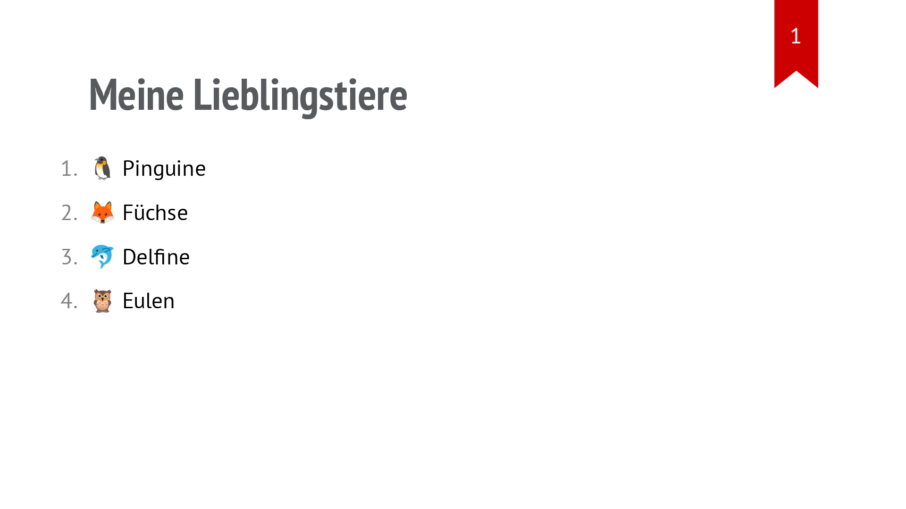
</button>

```html
<section class="slide">
    <h2>Meine Lieblingstiere</h2>
    <ol>
        <li>🐧 Pinguine</li>
        <li>🦊 Füchse</li>
        <li>🐬 Delfine</li>
        <li>🦉 Eulen</li>
    </ol>
</section>
```

Die wichtigsten Teile sind:

- `<section class="slide">` beginnt eine neue Folie.
- `<h2>` ist die Überschrift der Folie.
- `<ol>` beginnt eine nummerierte Liste.
- Jedes `<li>` ist ein Punkt in der Liste.
- `</section>` beendet die Folie.

Die meisten HTML-Tags bestehen aus einem **öffnenden Tag** und einem **schließenden Tag**:

```html
<h2>Meine Überschrift</h2>
```

Das öffnende Tag ist `<h2>`. Das schließende Tag ist `</h2>` – beim schließenden Tag steht also zusätzlich ein `/` vor dem Namen.

<div class='hint'>
Wenn du ein Tag öffnest, musst du es meistens auch wieder schließen.
Fehlt ein schließendes Tag, kann es passieren, dass die Folie oder sogar mehrere Folien danach falsch angezeigt werden.
</div>

Einrückungen sind für den Browser nicht unbedingt nötig, aber sie helfen dir beim Lesen.
Man sieht dadurch besser, welche Teile zusammengehören:

```html
<section class="slide">
    <h2>Überschrift</h2>
    <p>Dieser Text gehört zur Folie.</p>
</section>
```

<div class='shower-mini-clear'></div>

#### Text und Überschriften

<!--
Hier sollten <h2>, <p> und eventuell <br> erklärt werden.
Wichtig wäre: Eine Folie hat meistens eine <h2>-Überschrift; längere Texte gehören in Absätze; zu viel Text macht Folien schnell unlesbar.
-->

Eine Folie braucht meistens zuerst eine klare Überschrift.
In der Shower-Vorlage verwendest du dafür normalerweise `<h2>`.

Längere Texte schreibst du nicht direkt lose in die Folie, sondern in Absätze.
Ein Absatz beginnt mit `<p>` und endet mit `</p>`.

<button class='shower-mini' type='button'>
    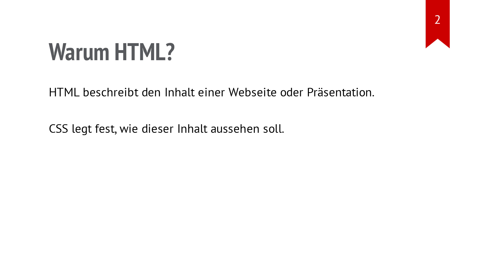
</button>


```html
<section class="slide">
    <h2>Warum HTML?</h2>

    <p>HTML beschreibt den Inhalt einer Webseite oder Präsentation.</p>
    <p>CSS legt fest, wie dieser Inhalt aussehen soll.</p>
</section>
```

Die wichtigsten Tags in diesem Beispiel sind:

- `<h2>` ist die Überschrift der Folie.
- `<p>` beginnt einen Textabsatz.
- `</p>` beendet den Textabsatz.
- Zwischen zwei Absätzen entsteht automatisch etwas Abstand.

<div class='hint'>
Schreibe Text auf Folien lieber in kurze Absätze.
Eine Folie ist keine ganze Buchseite. Wenn du zu viel Text auf eine Folie schreibst, wird sie beim Vortragen schnell unübersichtlich.
</div>

##### Überschriften

In einer normalen Folie reicht meistens eine einzige Überschrift:

```html
<h2>Mein Thema</h2>
```

Die Überschrift sollte kurz sagen, worum es auf der Folie geht.
Besser ist oft eine konkrete Überschrift statt nur ein einzelnes Wort.

<div class='row'>
    <div class='col-md-6'>
        <div class='hint bad'>
            <p>Nicht so gut:</p>
            <pre><code class='html'>&lt;h2&gt;HTML&lt;/h2&gt;</code></pre>
        </div>
    </div>

    <div class='col-md-6'>
        <div class='hint good'>
            <p>Besser:</p>
            <pre><code class='html'>&lt;h2&gt;HTML beschreibt die Struktur&lt;/h2&gt;</code></pre>
        </div>
    </div>
</div>

Die zweite Überschrift hilft dem Publikum mehr, weil sie schon eine kleine Aussage enthält.

##### Absätze

Wenn du mehrere Gedanken auf einer Folie hast, kannst du mehrere Absätze verwenden:

<button class='shower-mini' type='button'>
    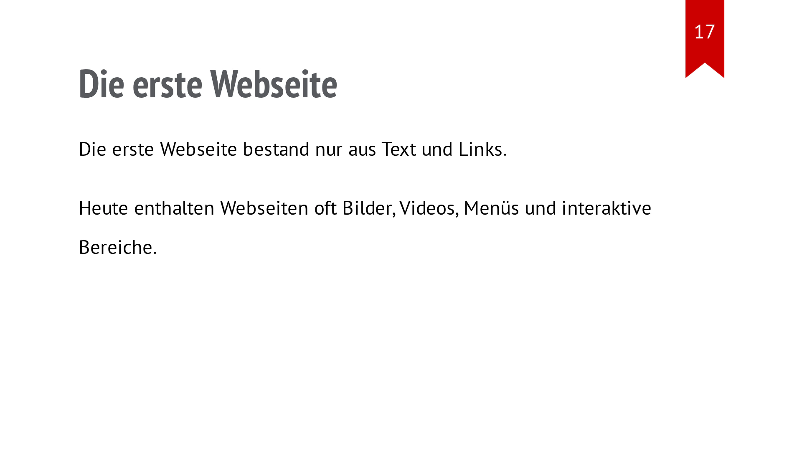
</button>


```html
<section class="slide">
    <h2>Die erste Webseite</h2>

    <p>Die erste Webseite bestand nur aus Text und Links.</p>

    <p>
        Heute enthalten Webseiten oft Bilder, Videos,
        Menüs und interaktive Bereiche.
    </p>
</section>
```

Du musst nicht selbst leere Zeilen in die Folie schreiben.
Der Abstand entsteht durch die Gestaltung der Vorlage. Dabei ist es egal, ob du hinter `<p>` direkt Text schreibst oder erst eine Zeile frei lässt.

<div class='hint'>
Verwende keine leeren Absätze wie <code>&lt;p&gt;&lt;/p&gt;</code>, nur um Abstand zu erzeugen.
Wenn du später Abstände verändern möchtest, ist CSS dafür der bessere Ort.
</div>

##### Einen Zeilenumbruch erzwingen

Manchmal möchtest du innerhalb eines Absatzes eine neue Zeile beginnen, ohne einen neuen Absatz zu starten.
Dafür gibt es `<br>`.

<button class='shower-mini' type='button'>
    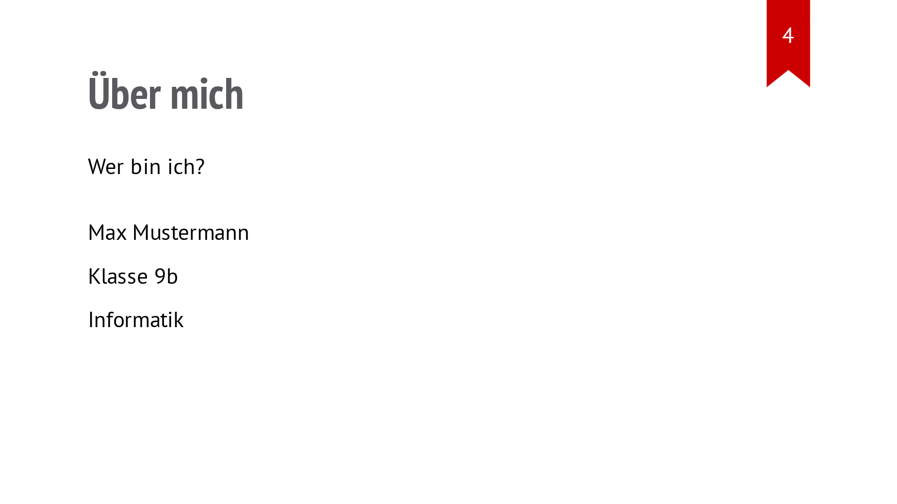
</button>

```html
<section class="slide">
    <h2>Über mich</h2>
    <p>Wer bin ich?</p>
    <p>
        Max Mustermann<br>
        Klasse 9b<br>
        Informatik
    </p>
</section>
```

`<br>` bedeutet: Hier beginnt eine neue Zeile.

Anders als viele andere HTML-Tags hat `<br>` kein eigenes schließendes Tag.
Du schreibst also nicht `</br>`.

<div class='hint'>
Wie du siehst, erhältst du durch <code>&lt;br&gt;</code> nur einen Zeilenumbruch, aber keinen Abstand zwischen den Zeilen wie bei Absätzen. Verwende <code>&lt;br&gt;</code> also nur, wenn du wirklich nur einen Zeilenumbruch brauchst, aber keinen neuen Absatz.
</div>

##### Zu viel Text vermeiden

Diese Folie ist technisch korrekt, aber als Präsentationsfolie wahrscheinlich zu voll:

<button class='shower-mini' type='button'>
    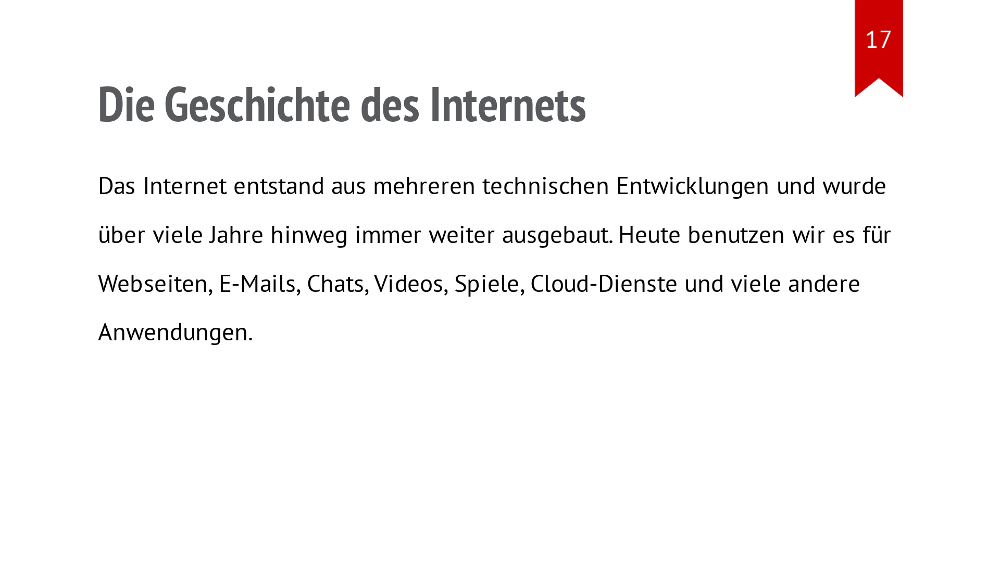
</button>

```html
<section class="slide">
    <h2>Die Geschichte des Internets</h2>

    <p>
        Das Internet entstand aus mehreren technischen Entwicklungen und wurde
        über viele Jahre hinweg immer weiter ausgebaut. Heute benutzen wir es
        für Webseiten, E-Mails, Chats, Videos, Spiele, Cloud-Dienste und viele
        andere Anwendungen.
    </p>
</section>
```

Oft ist es besser, den Text zu kürzen oder auf mehrere Folien zu verteilen:

<button class='shower-mini' type='button'>
    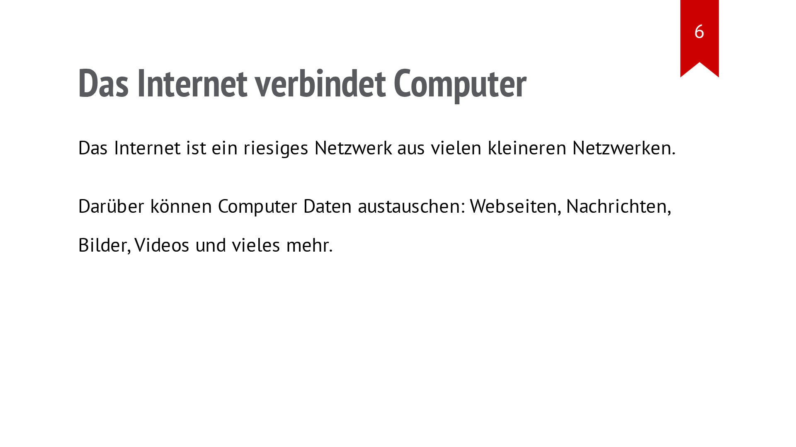
</button>

```html
<section class="slide">
    <h2>Das Internet verbindet Computer</h2>

    <p>
        Das Internet ist ein riesiges Netzwerk aus vielen kleineren Netzwerken.
    </p>

    <p>
        Darüber können Computer Daten austauschen: Webseiten, Nachrichten,
        Bilder, Videos und vieles mehr.
    </p>
</section>
```

<div class='hint'>
Wenn du beim Vortragen sowieso erklären möchtest, was auf der Folie steht, muss nicht jeder Satz ausgeschrieben werden.
Die Folie soll deinen Vortrag unterstützen, nicht ihn vollständig ersetzen.
</div>

<div class='shower-mini-clear'></div>

#### Listen und Stichpunkte

<!--
Hier sollten <ul>, <ol> und <li> eingeführt werden.
Sinnvoll wäre ein Vergleich zwischen ungeordneter Liste und nummerierter Liste sowie ein Hinweis, dass jeder Listenpunkt ein eigenes <li> braucht.
-->

Listen sind auf Präsentationsfolien sehr praktisch, weil sie Informationen übersichtlich machen.
In HTML gibt es zwei wichtige Arten von Listen:

- `<ul>` erstellt eine Liste mit Stichpunkten.
- `<ol>` erstellt eine nummerierte Liste.
- Jeder einzelne Listenpunkt steht in einem eigenen `<li>`.

`li` steht für »list item«, also »Listenpunkt«.

<button class='shower-mini' type='button'>
    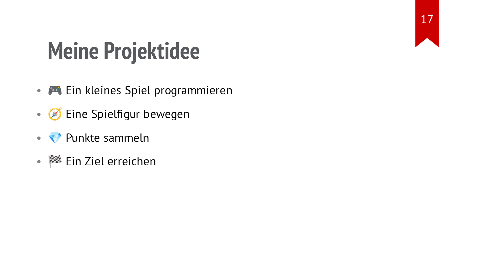
</button>

```html
<section class="slide">
    <h2>Meine Projektidee</h2>

    <ul>
        <li>🎮 Ein kleines Spiel programmieren</li>
        <li>🧭 Eine Spielfigur bewegen</li>
        <li>💎 Punkte sammeln</li>
        <li>🏁 Ein Ziel erreichen</li>
    </ul>
</section>
```

Die wichtigsten Tags in diesem Beispiel sind:

- `<ul>` beginnt eine Liste mit Stichpunkten.
- `<li>` beginnt einen Listenpunkt.
- `</li>` beendet einen Listenpunkt.
- `</ul>` beendet die ganze Liste.

<div class='hint'>
Jeder Listenpunkt braucht ein eigenes <code>&lt;li&gt;</code>.
Schreibe also nicht alle Punkte in ein einziges <code>&lt;li&gt;</code>, sondern mache für jeden Punkt eine eigene Zeile.
</div>

##### Nummerierte Liste

Eine nummerierte Liste verwendest du, wenn die Reihenfolge wichtig ist:

<button class='shower-mini' type='button'>
    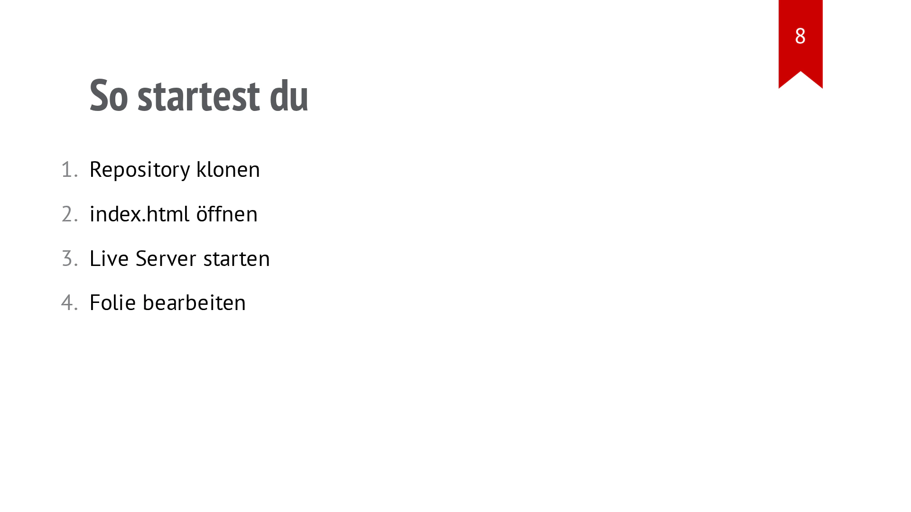
</button>

```html
<section class="slide">
    <h2>So startest du</h2>

    <ol>
        <li>Repository klonen</li>
        <li>index.html öffnen</li>
        <li>Live Server starten</li>
        <li>Folie bearbeiten</li>
    </ol>
</section>
```

Bei `<ol>` setzt der Browser die Zahlen automatisch davor.
Du musst die Zahlen also nicht selbst schreiben.

<div class='row'>
    <div class='col-md-6'>
        <div class='hint bad'>
            <p>Nicht so gut:</p>
            <pre><code class='html'>&lt;ul&gt;
    &lt;li&gt;1. Repository klonen&lt;/li&gt;
    &lt;li&gt;2. index.html öffnen&lt;/li&gt;
    &lt;li&gt;3. Live Server starten&lt;/li&gt;
&lt;/ul&gt;</code></pre>
        </div>
    </div>

    <div class='col-md-6'>
        <div class='hint good'>
            <p>Besser:</p>
            <pre><code class='html'>&lt;ol&gt;
    &lt;li&gt;Repository klonen&lt;/li&gt;
    &lt;li&gt;index.html öffnen&lt;/li&gt;
    &lt;li&gt;Live Server starten&lt;/li&gt;
&lt;/ol&gt;</code></pre>
        </div>
    </div>
</div>

So kann der Browser die Nummerierung selbst übernehmen.
Wenn du später einen Punkt einfügst oder löschst, stimmen die Zahlen automatisch wieder.

##### Listen nicht zu voll machen


Eine Liste auf einer Folie sollte nicht zu lang sein.
Diese Folie ist zu voll und stößt an den unteren Rand der Folie:

<button class='shower-mini' type='button'>
    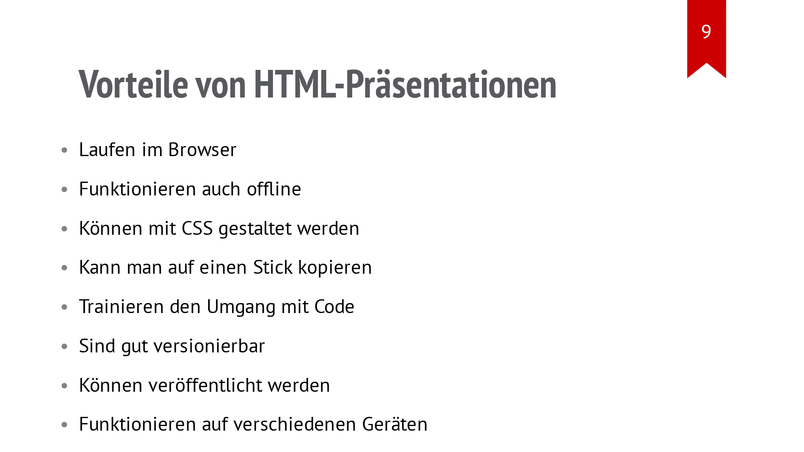
</button>

```html
<section class="slide">
    <h2>Vorteile von HTML-Präsentationen</h2>

    <ul>
        <li>Laufen im Browser</li>
        <li>Funktionieren auch offline</li>
        <li>Können mit CSS gestaltet werden</li>
        <li>Kann man auf einen Stick kopieren</li>
        <li>Trainieren den Umgang mit Code</li>
        <li>Sind gut versionierbar</li>
        <li>Können veröffentlicht werden</li>
        <li>Funktionieren auf verschiedenen Geräten</li>
    </ul>
</section>
```

Oft ist es besser, nur die wichtigsten Punkte auf die Folie zu schreiben:

<button class='shower-mini' type='button'>
    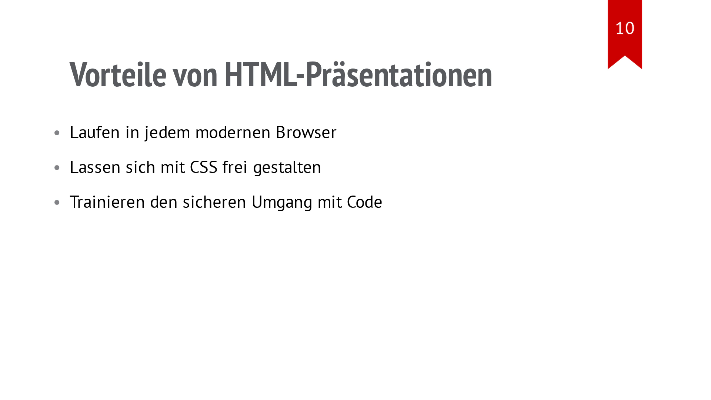
</button>

```html
<section class="slide">
    <h2>Vorteile von HTML-Präsentationen</h2>

    <ul>
        <li>Laufen in jedem modernen Browser</li>
        <li>Lassen sich mit CSS frei gestalten</li>
        <li>Trainieren den sicheren Umgang mit Code</li>
    </ul>
</section>
```

<div class='hint'>
Eine gute Folie zeigt nicht alles, was du sagen möchtest.
Sie zeigt die wichtigsten Stichworte, damit dein Publikum dir leichter folgen kann.
</div>

##### Typische Fehler bei Listen

Achte darauf, dass die `<li>`-Tags wirklich innerhalb der Liste stehen:

```html
<ul>
    <li>Erster Punkt</li>
    <li>Zweiter Punkt</li>
    <li>Dritter Punkt</li>
</ul>
```

Nicht so:

```html
<ul>
</ul>
<li>Erster Punkt</li>
<li>Zweiter Punkt</li>
<li>Dritter Punkt</li>
```

Im zweiten Beispiel stehen die Listenpunkte außerhalb der Liste.
Der Browser versucht zwar oft trotzdem, etwas daraus zu machen, aber der HTML-Code ist nicht sauber.

<div class='hint'>
Wenn eine Liste merkwürdig aussieht, prüfe zuerst, ob jedes <code>&lt;li&gt;</code> zwischen dem öffnenden Listen-Tag und dem schließenden Listen-Tag steht.
Also zwischen <code>&lt;ul&gt;</code> und <code>&lt;/ul&gt;</code> oder zwischen <code>&lt;ol&gt;</code> und <code>&lt;/ol&gt;</code>.
</div>

<div class='shower-mini-clear'></div>

#### Wörter hervorheben

<!--
Hier sollten einfache Inline-Tags wie <strong>, <em>, <code>, <sub> und <sup> gezeigt werden.
Ziel: Einzelne Wörter hervorheben, ohne gleich eigenes CSS schreiben zu müssen.
-->

Manchmal möchtest du nicht einen ganzen Absatz verändern, sondern nur einzelne Wörter hervorheben.
Dafür gibt es in HTML kleine Tags, die mitten im Text stehen können.

Solche Tags nennt man **Inline-Tags**, weil sie in einer Zeile im Text mitlaufen.

<button class='shower-mini' type='button'>
    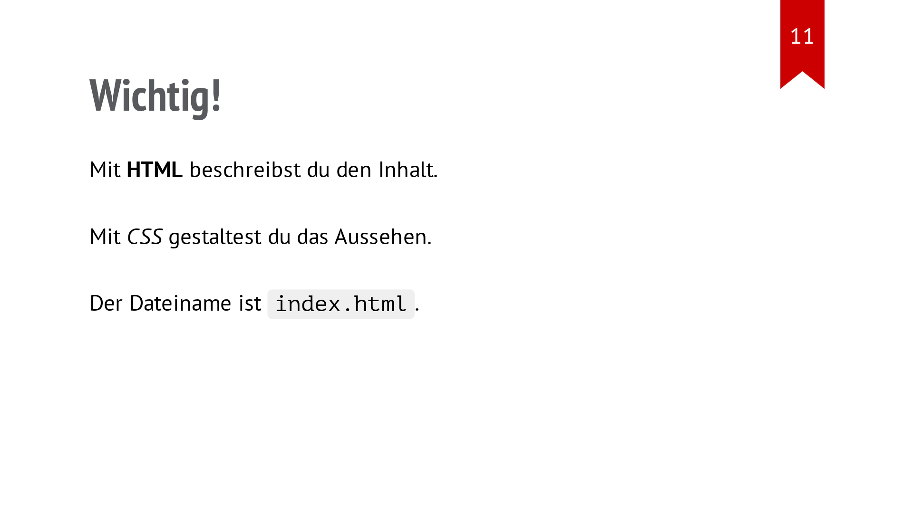
</button>

```html
<section class="slide">
    <h2>Wichtig!</h2>

    <p>Mit <strong>HTML</strong> beschreibst du den Inhalt.</p>
    <p>Mit <em>CSS</em> gestaltest du das Aussehen.</p>
    <p>Der Dateiname ist <code>index.html</code>.</p>
</section>
```

Die wichtigsten Inline-Tags sind:

- `<strong>` hebt etwas stark hervor.
- `<em>` betont etwas.
- `<code>` markiert Code, Dateinamen oder Befehle.
- `<sub>` stellt Text tiefer.
- `<sup>` stellt Text höher.

##### Stark hervorheben mit strong

Mit `<strong>` markierst du Wörter, die besonders wichtig sind:

<button class='shower-mini' type='button'>
    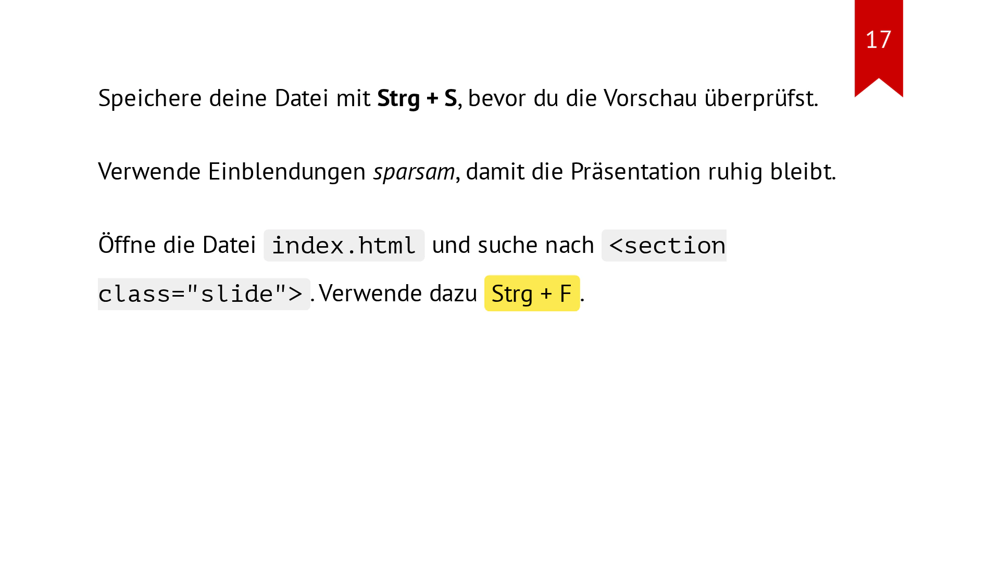
</button>

```html
<p>
    Speichere deine Datei mit <strong>Strg + S</strong>,
    bevor du die Vorschau überprüfst.
</p>
```

Im Browser wird dieser Text meistens fett dargestellt.
Wichtiger ist aber die Bedeutung: Dieses Wort oder diese Stelle ist besonders wichtig.

##### Betonen mit em

Mit `<em>` betonst du ein Wort oder eine kurze Wortgruppe:

```html
<p>
    Verwende Einblendungen <em>sparsam</em>,
    damit die Präsentation ruhig bleibt.
</p>
```

Im Browser wird der Text meistens kursiv dargestellt.

<div class='hint'>
Verwende Hervorhebungen gezielt.
Wenn auf einer Folie fast alles fett oder kursiv ist, fällt am Ende gar nichts mehr besonders auf.
</div>

##### Code, Dateinamen und Befehle markieren

Mit `<code>` markierst du kurze Stücke Code, Dateinamen, Tags oder Befehle:

```html
<p>
    Öffne die Datei <code>index.html</code>
    und suche nach <code>&lt;section class="slide"&gt;</code>. Verwende dazu <mark>Strg + F</mark>.
</p>
```

Bei echten HTML-Tags im normalen Text musst du die spitzen Klammern ersetzen:

- Statt `<` schreibst du `&lt;`.
- Statt `>` schreibst du `&gt;`.

Darum steht im Beispiel:

```html
<code>&lt;section class="slide"&gt;</code>
```

und nicht:

```html
<code><section class="slide"></code>
```

Im zweiten Beispiel würde der Browser versuchen, wirklich eine neue Folie zu beginnen, und das ist nicht das, was du hier möchtest.

##### Hochgestellte und tiefgestellte Zeichen

Für manche Themen brauchst du hochgestellte oder tiefgestellte Zeichen.
Dafür gibt es `<sup>` und `<sub>`.

<button class='shower-mini' type='button'>
    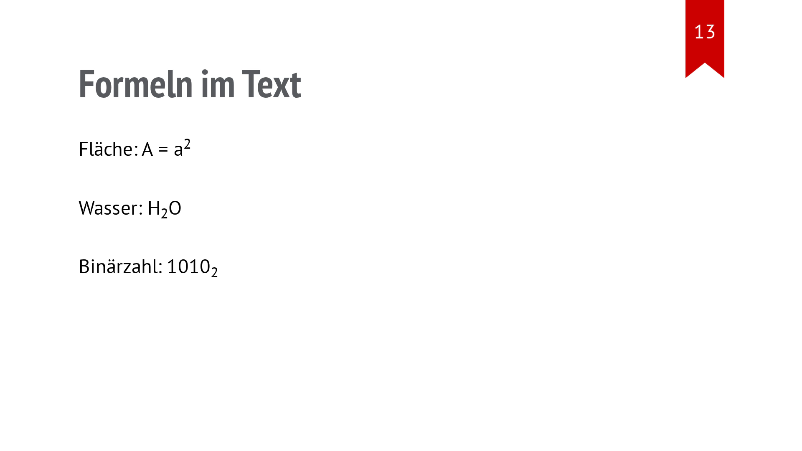
</button>

```html
<section class="slide">
    <h2>Formeln im Text</h2>

    <p>Fläche: A = a<sup>2</sup></p>
    <p>Wasser: H<sub>2</sub>O</p>
    <p>Binärzahl: 1010<sub>2</sub></p>
</section>
```

`<sup>` stellt den Text höher.
Das ist praktisch für Potenzen wie `a²`.

`<sub>` stellt den Text tiefer.
Das ist praktisch für chemische Formeln oder Zahlensysteme.

##### Inline-Tags richtig schließen

Auch Inline-Tags müssen meistens wieder geschlossen werden:

```html
<p>Das ist <strong>wichtig</strong>.</p>
```

Nicht so:

```html
<p>Das ist <strong>wichtig.</p>
```

Wenn du das schließende `</strong>` vergisst, kann es passieren, dass viel mehr Text fett wird, als du eigentlich wolltest.

<div class='hint'>
Wenn plötzlich ein ganzer Abschnitt fett, kursiv oder in Code-Schrift erscheint, fehlt wahrscheinlich irgendwo ein schließendes Tag wie <code>&lt;/strong&gt;</code>, <code>&lt;/em&gt;</code> oder <code>&lt;/code&gt;</code>.
</div>

<div class='shower-mini-clear'></div>


#### Echte Formeln mit LaTeX und KaTeX

Manchmal reichen `<sup>` und `<sub>` nicht aus.
Für richtige mathematische Formeln kannst du in der Vorlage LaTeX-Schreibweise verwenden.
Die Darstellung übernimmt KaTeX.

Es gibt zwei typische Arten von Formeln:

- Eine **Inline-Formel** steht mitten im Satz.
- Eine **abgesetzte Formel** steht groß in einer eigenen Zeile.

<button class='shower-mini' type='button'>
    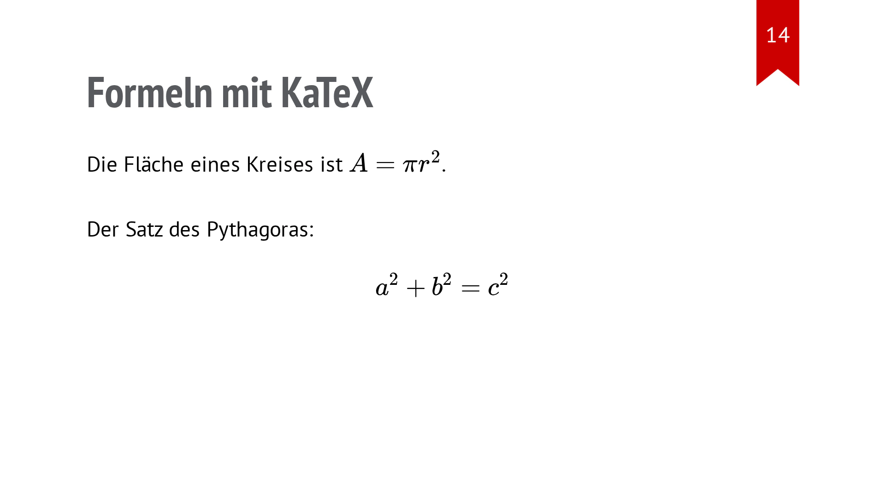
</button>

```html
<section class="slide">
    <h2>Formeln mit KaTeX</h2>

    <p>Die Fläche eines Kreises ist \(A = \pi r^2\).</p>

    <p>Der Satz des Pythagoras:</p>

    <p>$$a^2 + b^2 = c^2$$</p>
</section>
```

Für kurze Formeln im Text verwendest du `\(` und `\)`:

```html
<p>Die Fläche eines Kreises ist \(A = \pi r^2\).</p>
```

Für größere Formeln in einer eigenen Zeile verwendest du doppelte Dollarzeichen:

```html
<p>$$a^2 + b^2 = c^2$$</p>
```

<div class='hint'>
Dieses Tutorial geht davon aus, dass KaTeX in der Vorlage bereits eingerichtet ist.
Du musst also normalerweise nur die Formel in LaTeX-Schreibweise in deine Folie schreiben.
</div>

##### Häufige LaTeX-Schreibweisen

Einige Schreibweisen brauchst du besonders oft:

```text
x^2              hochgestellte 2
H_2O             tiefgestellte 2
\frac{a}{b}      Bruch
\sqrt{x}         Wurzel
\pi              π
\cdot            Malpunkt
\le              kleiner oder gleich
\ge              größer oder gleich
```

Zum Beispiel:

<button class='shower-mini' type='button'>
    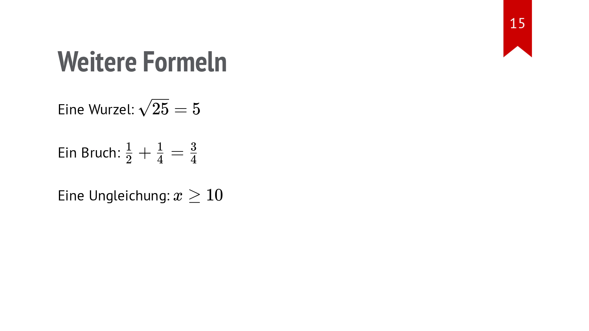
</button>

```html
<section class="slide">
    <h2>Weitere Formeln</h2>

    <p>Eine Wurzel: \(\sqrt{25} = 5\)</p>
    <p>Ein Bruch: \(\frac{1}{2} + \frac{1}{4} = \frac{3}{4}\)</p>
    <p>Eine Ungleichung: \(x \ge 10\)</p>
</section>
```

##### Wenn eine Formel nicht angezeigt wird

Wenn du statt einer schön gesetzten Formel nur den LaTeX-Code siehst, prüfe zuerst diese Punkte:

- Hast du am Anfang und am Ende der Formel `\(` und `\)` geschrieben?
- Bei abgesetzten Formeln: Hast du am Anfang und am Ende jeweils zwei Dollarzeichen geschrieben?
- Hast du geschweifte Klammern richtig geschlossen, zum Beispiel bei `\frac{1}{2}`?
- Hast du einen Backslash `\` vor LaTeX-Befehlen wie `\sqrt`, `\frac` oder `\pi` geschrieben?


<div class='row'>
    <div class='col-md-6'>
        <div class='hint bad'>
            <p>Falsch:</p>
            <pre><code class='html'>&lt;p&gt;Die Fläche ist \(A = \pi r^2.&lt;/p&gt;</code></pre>
        </div>
    </div>

    <div class='col-md-6'>
        <div class='hint good'>
            <p>Richtig:</p>
            <pre><code class='html'>&lt;p&gt;Die Fläche ist \(A = \pi r^2\).&lt;/p&gt;</code></pre>
        </div>
    </div>
</div>

Im falschen Beispiel fehlt das schließende Klammerzeichen `\)`. Dadurch weiß KaTeX nicht, wo die Formel endet.

<div class='hint'>
LaTeX-Formeln sind sehr praktisch, aber sie können eine Folie auch schnell überladen.
Für Präsentationen sind wenige große und gut erklärte Formeln meistens besser als viele kleine Formeln auf einmal.
</div>

<div class='shower-mini-clear'></div>

### Bilder

<!--
Dieser Block sollte Bilder Schritt für Schritt einführen: erst einfügen, dann Größe und Zuschnitt, dann Platzierung, dann Hintergrundbilder und Lesbarkeit.
Die Beispiele sollten möglichst mit denselben Bilddateien funktionieren, die ohnehin im Tutorial vorkommen.
-->

Bilder können eine Präsentation viel anschaulicher machen.
Dabei musst du dich um zwei Dinge kümmern:

1. Du brauchst zuerst eine Bilddatei in deinem Projekt.
2. Danach musst du diese Bilddatei mit HTML in eine Folie einfügen.

#### Bilder in den Ordner pictures bekommen

<!--
Hier wird erklärt, wie Schülerinnen und Schüler in der browserbasierten VS-Code-Umgebung an Bilddateien kommen:
per Drag & Drop vom eigenen Computer, per Zwischenablage und per wget im Terminal.
-->

Wenn du den File Explorer in VS Code öffnest, siehst du einen Ordner namens `pictures`, in dem alle Bilder liegen sollten, die du in deiner Präsentation verwenden möchtest. Klicke auf eine Bilddatei, um sie in der Vorschau zu sehen:

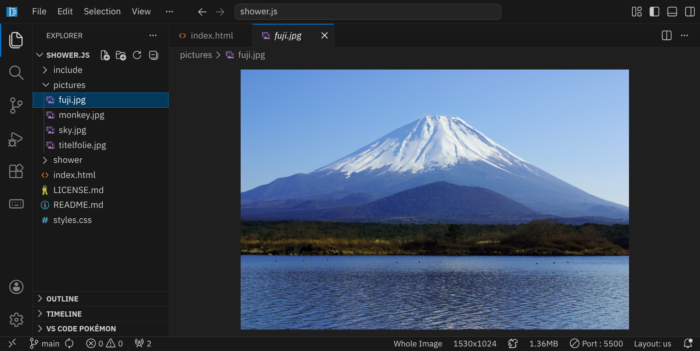

Es gibt verschiedene Bilddateiformate, die dir begegnen werden:

<div style='max-width: 100%; overflow-x: auto;'>
<table class='table'>
<tr>
<th>Format</th>
<th>Eigenschaften</th>
<th>Dateiendung</th>
</tr>
<tr>
<td><strong>JPEG</strong></td>
<td>Gut für Fotos, weil sie die Dateigröße klein halten</td>
<td><code>.jpg</code> oder <code>.jpeg</code></td>
</tr>
<tr>
<td><strong>PNG</strong></td>
<td>Gut für Grafiken, Logos oder Bilder mit transparentem Hintergrund</td>
<td><code>.png</code></td>
</tr>
<tr>
<td><strong>GIF</strong></td>
<td>Gut für einfache Animationen, aber nicht so gut für Fotos</td>
<td><code>.gif</code></td>
</tr>
<tr>
<td><strong>WebP</strong></td>
<td>Ein modernes Format, das oft kleinere Dateien als JPEG oder PNG erzeugt</td>
<td><code>.webp</code></td>
</tr>
<tr>
<td><strong>SVG</strong></td>
<td>Ein Vektorformat, das sich gut für Logos und Icons eignet, weil es ohne Qualitätsverlust skaliert werden kann</td>
<td><code>.svg</code></td>
</tr>
</table>
</div>

Verwende für Bilddateien am besten einfache Dateinamen:
kleine Buchstaben, keine Leerzeichen, keine Umlaute und keine Sonderzeichen.
Gut sind zum Beispiel <code>fuji.jpg</code>, <code>berlin.webp</code> oder <code>live-at-msg.png</code>.

<div class='row'>
    <div class='col-md-4'>
        <div class='hint good'>
            <p>Gut:</p>
            <pre>fuji.jpg</pre>
        </div>
    </div>

    <div class='col-md-4'>
        <div class='hint good'>
            <p>Auch gut:</p>
            <pre>mount-fuji.webp</pre>
        </div>
    </div>

    <div class='col-md-4'>
        <div class='hint bad'>
            <p>Eher schlecht:</p>
            <pre>Fuji Bild endgültig NEU!!!.JPG</pre>
        </div>
    </div>
</div>

Im Folgenden siehst du drei Möglichkeiten, wie du eine Bilddatei in den Ordner `pictures` bekommen kannst, damit du sie später in deiner Präsentation verwenden kannst.

##### Möglichkeit 1: Bilddatei per Drag & Drop hochladen

Wenn du eine Bilddatei bereits auf deinem Computer hast, kannst du sie in den File Explorer von VS Code ziehen und dort im Verzeichnis `pictures` ablegen:

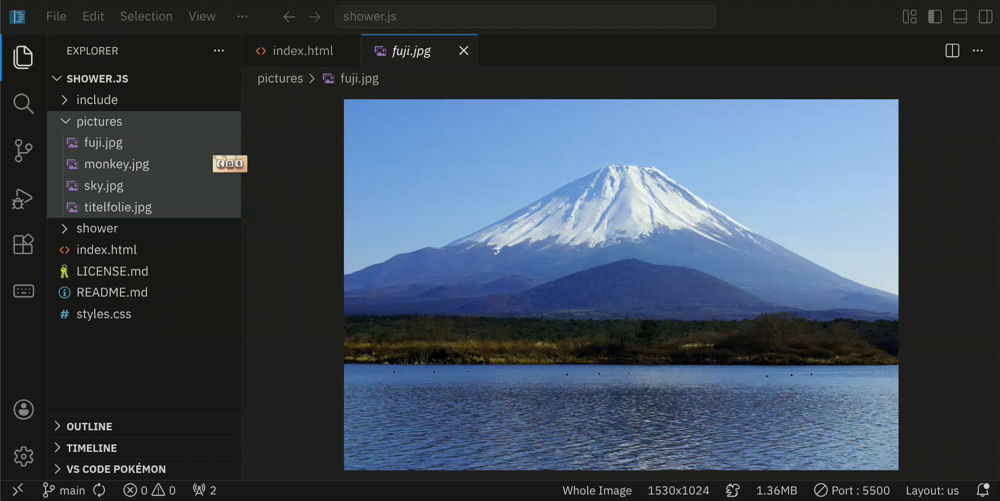

<div class='hint'>
Egal, wie du dein Bild in den Ordner bekommst: Achte darauf, deinen Bildern einen sinnvollen Dateinamen zu geben. Das erleichtert dir später die Arbeit, wenn du das Bild in deine Folie einfügen möchtest.
</div>

##### Möglichkeit 2: Bild aus der Zwischenablage einfügen

Du kannst auch ein Bild direkt in die Zwischenablage kopieren und dann in den Ordner `pictures` einfügen. Das ist besonders praktisch, wenn du einen Screenshot gemacht hast und diesen direkt verwenden möchtest, du kannst aber auch Bilder aus dem Internet oder von anderen Quellen auf diese Weise in deinen Workspace bekommen.

Um ein Bild aus dem Internet in die Zwischenablage zu kopieren, kannst du mit der rechten Maustaste auf das Bild klicken und »Bild kopieren« oder »Copy Image« auswählen:

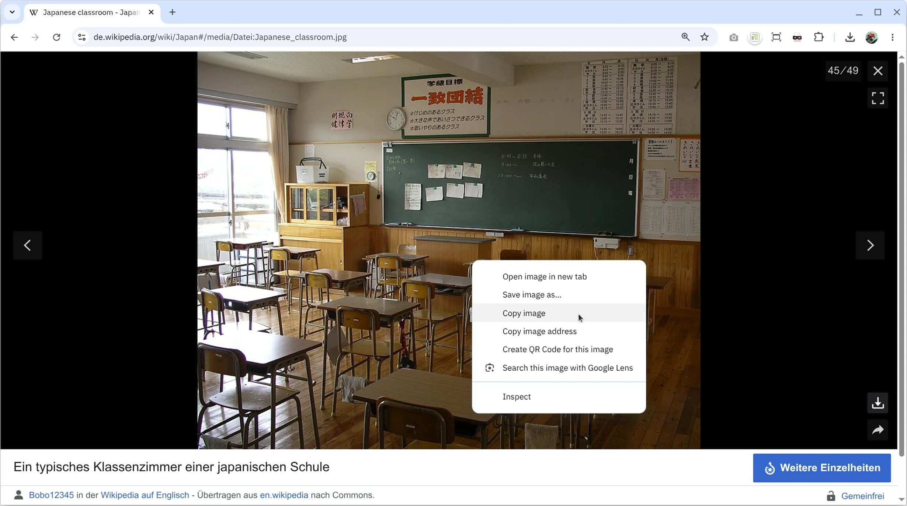

<!-- https://de.wikipedia.org/wiki/Japan#/media/Datei:Japanese_classroom.jpg -->

Klicke jetzt im File Explorer auf ein Bild im Ordner `pictures` und drücke <span class='key'>Strg</span><span class='key'>V</span>, um das Bild in denselben Ordner einzufügen:

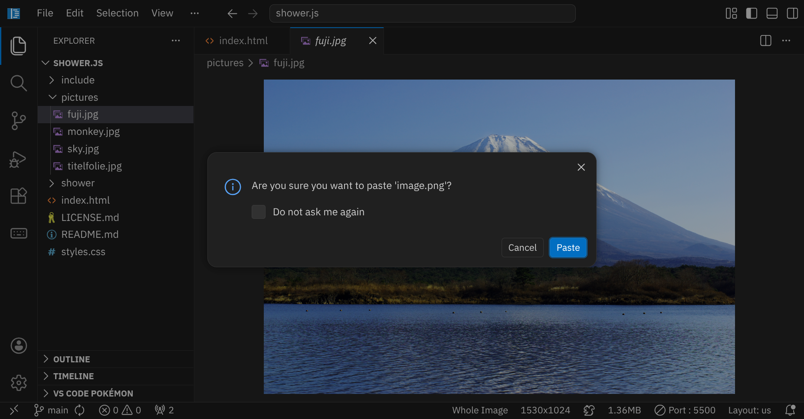

Du solltest die neue Datei sehen, die automatisch einen Namen wie `image.png` bekommt:

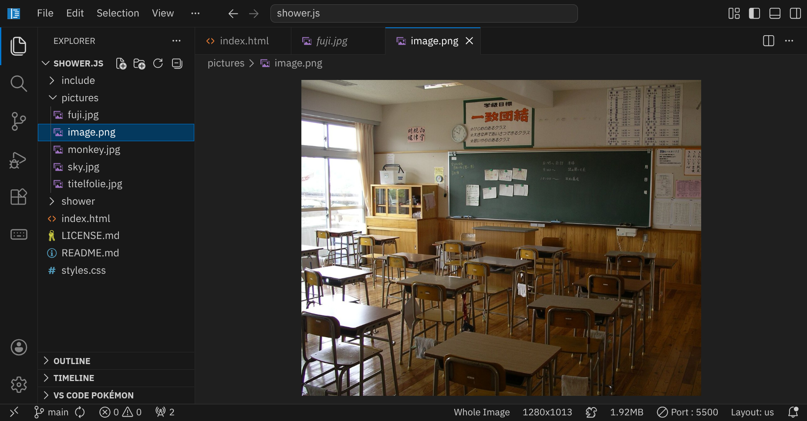

Am unteren Rand siehst du zwei wichtige Informationen:

1. die Auflösung des Bildes (in diesem Fall 1280×1013 Pixel): Achte darauf, dass deine Bilder nicht zu klein sind, damit sie auf der Folie nicht unscharf werden
2. die Dateigröße (in diesem Fall 1,92 MB): Achte darauf, dass deine Bilder nicht zu groß sind, damit deine Präsentation später nicht zu viel Speicherplatz braucht und schnell lädt

<div class='hint'>
1,92 MB ist für ein Bild ziemlich groß – wir merken uns das und kümmern uns gleich darum, das Bild zu verkleinern, damit es besser für die Präsentation geeignet ist.
</div>

Gib der Bilddatei jetzt einen sinnvollen Namen, zum Beispiel `classroom.png`:

<div class='row' style='margin-bottom: 1em;'>
    <div class='col-md-6'>
        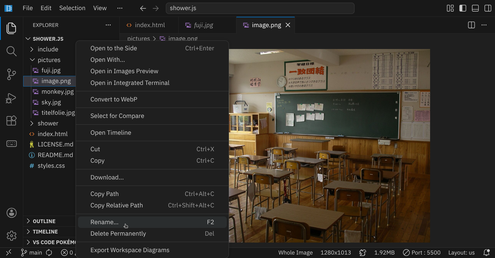
    </div>
    <div class='col-md-6'>
        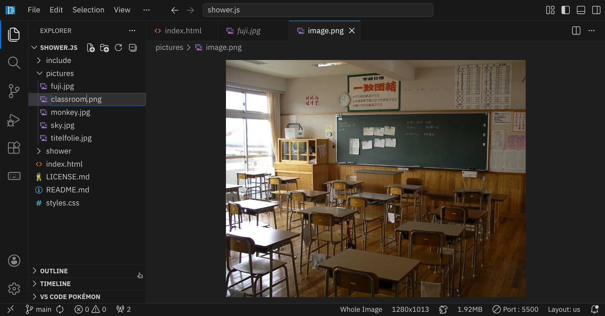
    </div>
</div>

<div class='hint think'>
Achte darauf, dass die Dateiendung erhalten bleibt (in diesem Fall <code>.png</code>), damit die Datei später als Bild erkannt wird.
</div>

Dadurch, dass ein Bild aus der Zwischenablage oft als PNG-Datei gespeichert wird, kann es passieren, dass die Dateigröße sehr groß ist, auch wenn die Auflösung nicht besonders hoch ist. Wir können die Datei aber leicht verkleinern, indem wir sie in ein moderneres Format wie WebP umwandeln.

Installiere dazu die Erweiterung »WebP Converter for VSCode«. Anschließend kannst du mit einem Rechtsklick auf die Bilddatei die Option »Convert to WebP« auswählen:

<div class='row' style='margin-bottom: 1em;'>
    <div class='col-md-6'>
        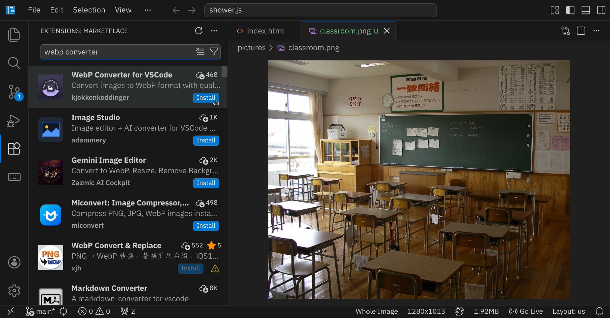
    </div>
    <div class='col-md-6'>
        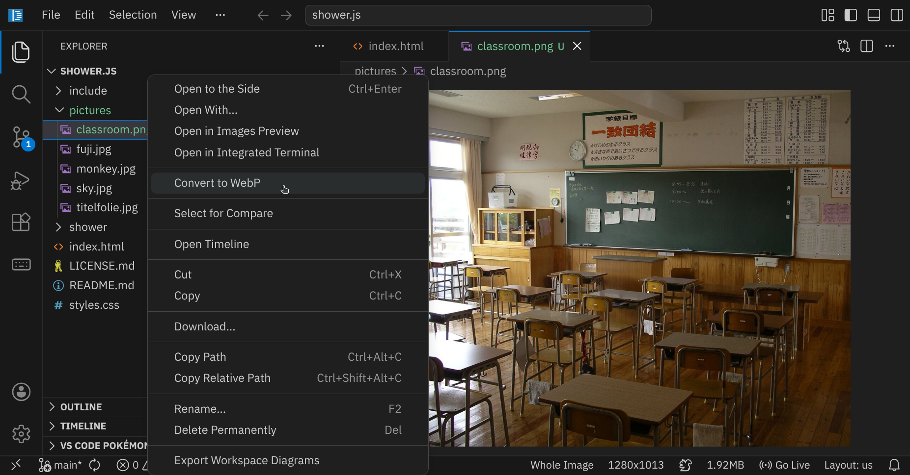
    </div>
</div>

Du wirst nun nach der Qualität gefragt, die du verwenden möchtest. »Lossless« bedeutet, dass die Qualität des Bildes erhalten bleibt, aber die Dateigröße trotzdem deutlich kleiner wird – diese Option eignet sich am besten für Grafiken. »Lossy« bedeutet, dass die Qualität des Bildes etwas schlechter wird, aber die Dateigröße noch weiter reduziert wird – diese Option eignet sich am besten für Fotos. Für unser Foto eines Klassenzimmers wählen wir »Lossy« mit einer Qualität von 85%:

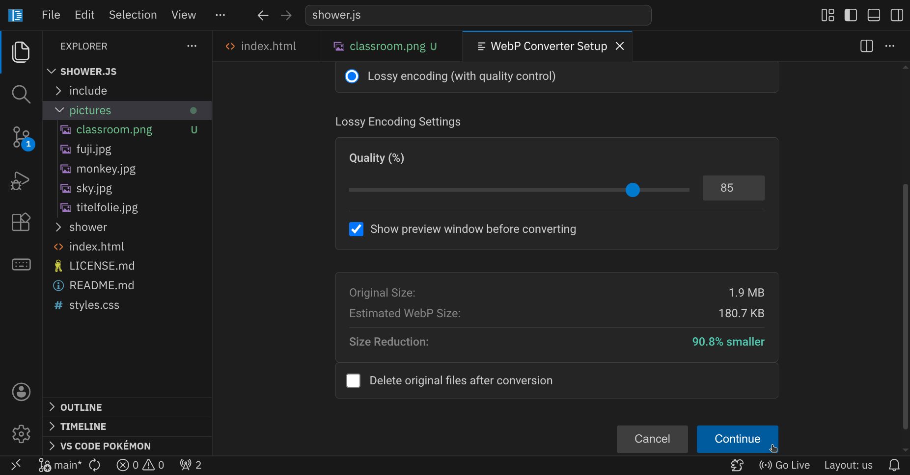

Mit einem Klick auf »Finish« wird die neue WebP-Datei erstellt, die deutlich kleiner ist als die ursprüngliche PNG-Datei:

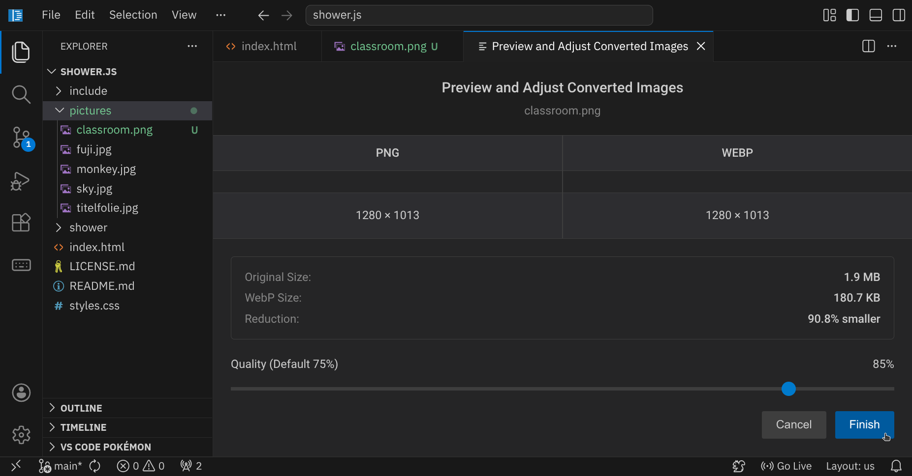

Die neue Datei `classroom.webp` hat jetzt eine Dateigröße von nur 180 kB und sieht immer noch gut aus:

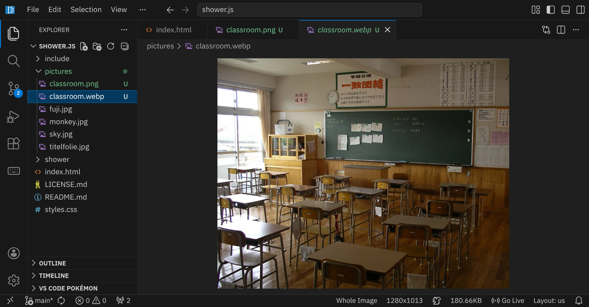

<div class='hint'>
Bilder, die du mit <span class='key'>Strg</span><span class='key'>V</span> einfügst, werden oft als PNG-Dateien gespeichert.
Das ist für Screenshots gut, aber für Fotos manchmal unnötig groß.
Im Profi-Abschnitt unten siehst du, wie du solche Dateien prüfen und umwandeln kannst.
</div>

#### Bilder einfügen

<!--
Hier sollte  erklärt werden.
Wichtig wären Dateinamen, relative Pfade, Dateiendungen und ein kurzer Hinweis auf alt-Text, ohne den Abschnitt zu überfrachten.
-->

Wenn die Bilddatei im richtigen Ordner liegt, kannst du sie mit dem Tag `` in eine Folie einfügen. Angenommen, dein Bild heißt `fuji.jpg` und liegt im Ordner `pictures`.
Dann fügst du es so ein:

<button class='shower-mini' type='button'>
    
</button>

```html
<section class="slide">
    <h2>Dieses Bild ist zu groß</h2>

    
</section>
```

<div class='shower-mini-clear'></div>

<div class='hint'>
Wir ignorieren erst einmal, dass das eingefügte Bild zu groß ist und nicht auf die Folie passt – wir kümmern uns gleich darum.
</div>

Die wichtigsten Teile sind:

- `` fügt ein Bild ein.
- `src="pictures/fuji.jpg"` sagt dem Browser, wo die Bilddatei liegt.
- `alt="Der Fuji vom Shōji-See aus gesehen"` beschreibt das Bild kurz.

<div class='hint'>
Das <code>&lt;img&gt;</code>-Tag hat kein eigenes schließendes Tag.
Du schreibst also normalerweise nicht <code>&lt;/img&gt;</code>.
</div>

##### Der Pfad muss genau stimmen

Der häufigste Fehler bei Bildern ist ein falscher Pfad. Wenn dein Bild im Ordner `pictures` liegt, muss dieser Ordner auch im `src`-Attribut stehen:

<div class='row'>
    <div class='col-md-6'>
        <div class='hint good'>
            <p>Richtig:</p>
            <pre><code class='html'>&lt;img src="pictures/fuji.jpg" alt="Der Fuji"&gt;</code></pre>
        </div>
    </div>

    <div class='col-md-6'>
        <div class='hint bad'>
            <p>Falsch:</p>
            <pre><code class='html'>&lt;img src="Fuji.jpg" alt="Der Fuji"&gt;</code></pre>
        </div>
    </div>
</div>

<div class='hint'>
Du kannst theoretisch auch eine URL zu einem Bild angeben. Man nennt das »Hotlinking« und es birgt einige Probleme, zum Beispiel, dass das Bild plötzlich nicht mehr da ist, wenn die Webseite, von der du es verlinkt hast, offline geht oder das Bild löscht. Es könnte auch sein, dass der Betreiber der Webseite das Hotlinking nicht erlaubt und das Bild deshalb nicht angezeigt wird. Deshalb ist es meistens besser, Bilder in deinen eigenen Ordner zu legen und von dort aus zu verlinken – dann funktioniert deine Präsentation auch offline und du hast die volle Kontrolle über die Bilder, die du verwendest.
</div>

#### Bildgröße anpassen

<!--
Hier sollten typische Größenprobleme gelöst werden: Bild zu groß, Bild zu klein, falsches Seitenverhältnis.
Mögliche Beispiele: width per style, vorhandene Hilfsklassen der Vorlage und object-fit für zugeschnittene Bilder.
-->

Um die Größe eines Bildes anzupassen, kannst du CSS verwenden. Füge dazu ein `style`-Attribut zum ``-Tag hinzu und schreibe die gewünschten CSS-Eigenschaften hinein.

<button class='shower-mini' type='button'>
    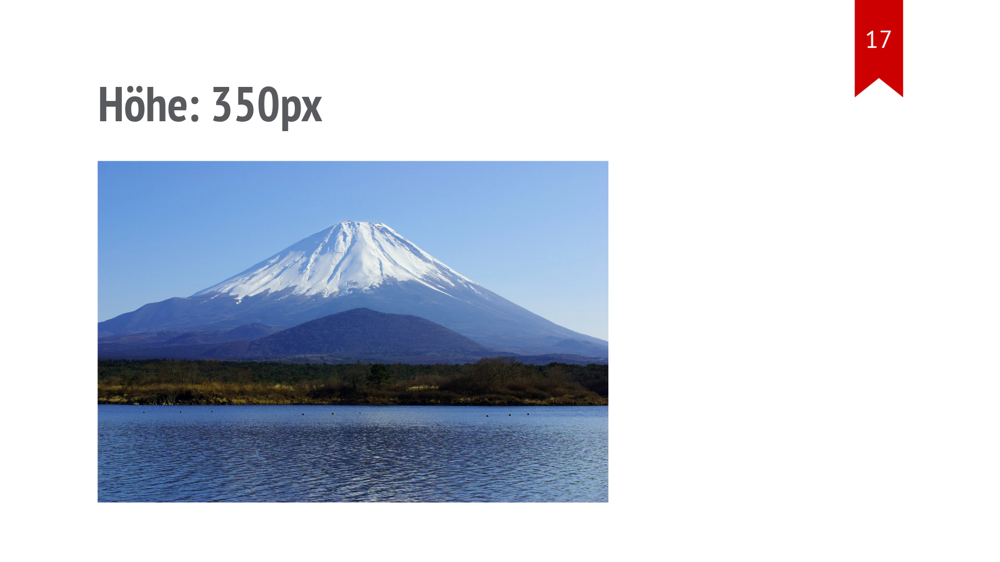
</button>

```html
<section class="slide">
    <h2>Höhe: 350px</h2>

    
</section>
```

<div class='shower-mini-clear'></div>

In diesem Beispiel wird die Höhe des Bildes auf 350 Pixel festgelegt. Die Breite wird automatisch angepasst, damit das Seitenverhältnis erhalten bleibt.

Du kannst auch die Breite festlegen, zum Beispiel mit `width: 350px;`, oder beides gleichzeitig, zum Beispiel mit `width: 350px; height: 350px;`. Wenn du beides gleichzeitig festlegst, kann es passieren, dass das Bild verzerrt wird, wenn die angegebenen Werte nicht zum ursprünglichen Seitenverhältnis des Bildes passen. In diesem Fall kannst du die Eigenschaft `object-fit: cover;` verwenden, damit das Bild zugeschnitten wird, aber nicht verzerrt:


#### Bild verschieben

<button class='shower-mini' type='button'>
    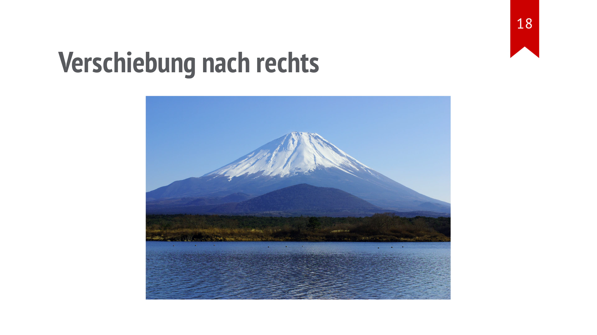
</button>

```html
<section class="slide">
    <h2>Verschiebung nach rechts</h2>

    
</section>
```

<div class='shower-mini-clear'></div>

#### Abgerundete Ecken und Schattierung

<button class='shower-mini' type='button'>
    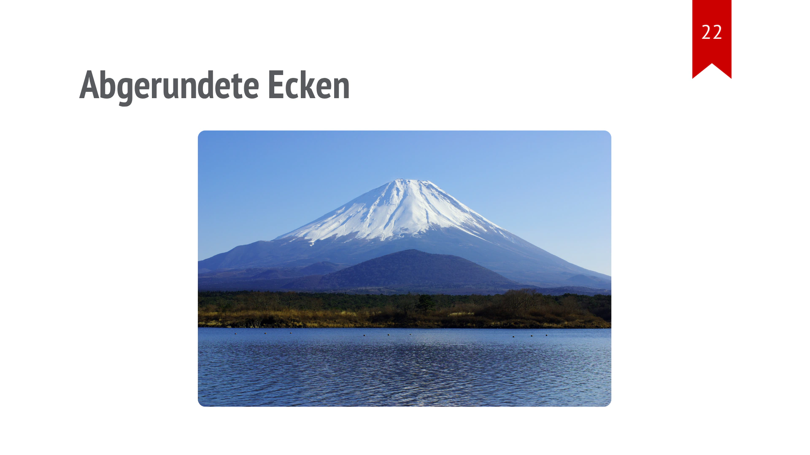
</button>

```html
<section class="slide">
    <h2>Abgerundete Ecken</h2>

    
</section>
```

<div class='shower-mini-clear'></div>

<button class='shower-mini' type='button'>
    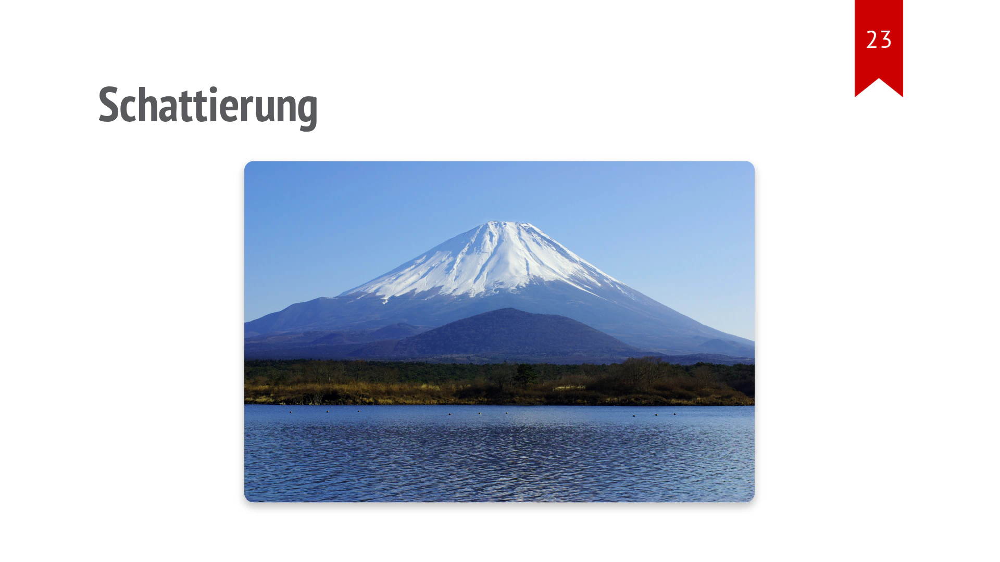
</button>

```html
<section class="slide">
    <h2>Schattierung</h2>

    
</section>
```

#### Bilder zuschneiden

<button class='shower-mini' type='button'>
    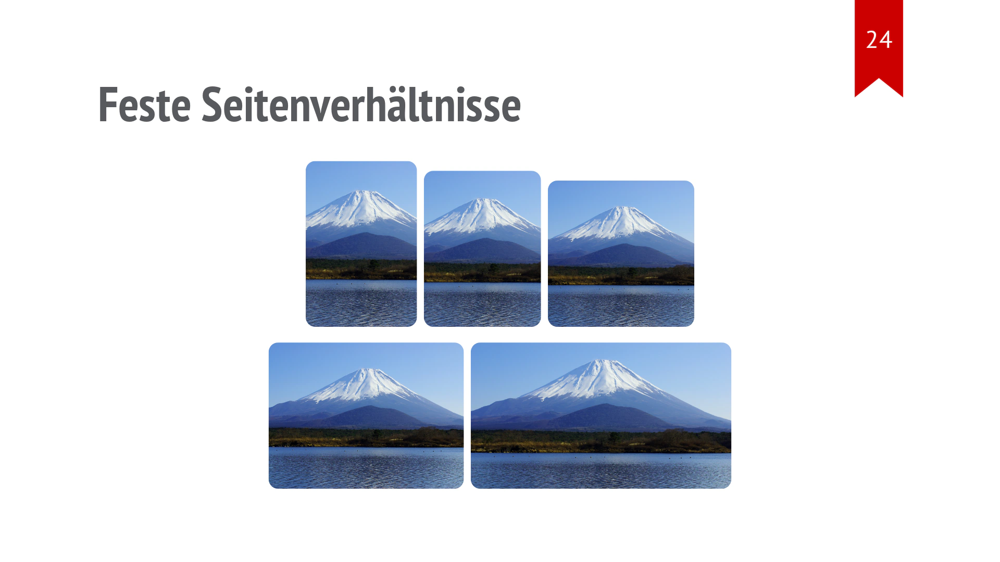
</button>

```html
<section class="slide">
    <h2>Feste Seitenverhältnisse</h2>

    <div style="text-align: center;">

        
        
        
        <br>
        
        
    </div>
</section>
```

#### Bild im Hintergrund

<button class='shower-mini' type='button'>
    
</button>

```html
<section class="slide bright-text">
    <h2>Mount Fuji im Hintergrund</h2>

    
</section>
```

<div class='shower-mini-clear'></div>

#### Text und Bild nebeneinander

<button class='shower-mini' type='button'>
    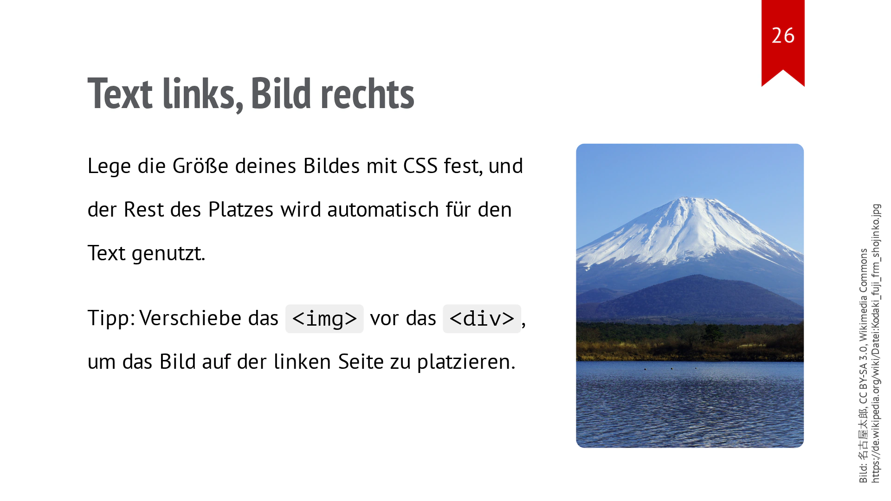
</button>

```html
<section class="slide">
    <h2>Text links, Bild rechts</h2>

    <div class="side-by-side">
        <div>
            <p>
                Lege die Größe deines Bildes mit CSS fest, und der Rest
                des Platzes wird automatisch für den Text genutzt.
            </p>
            <p>
                Tipp: Verschiebe das <code>&lt;img&gt;</code> vor das
                <code>&lt;div&gt;</code>, um das Bild auf der linken
                Seite zu platzieren.
            </p>
        </div>
        
    </div>
        <figcaption class="copyright right">
        Bild: 名古屋太郎, CC BY-SA 3.0, Wikimedia Commons<br>
        https://de.wikipedia.org/wiki/Datei:Kodaki_fuji_frm_shojinko.jpg
    </figcaption>
</section>
```

<div class='shower-mini-clear'></div>

<button class='shower-mini' type='button'>
    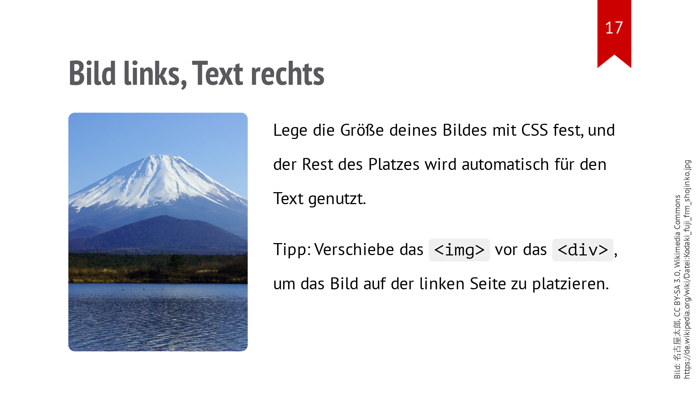
</button>

```html
<section class="slide">
    <h2>Bild links, Text rechts</h2>

    <div class="side-by-side">
        
        <div>
            <p>
                Lege die Größe deines Bildes mit CSS fest, und der Rest
                des Platzes wird automatisch für den Text genutzt.
            </p>
            <p>
                Tipp: Verschiebe das <code>&lt;img&gt;</code> vor das
                <code>&lt;div&gt;</code>, um das Bild auf der linken
                Seite zu platzieren.
            </p>
        </div>
    </div>
    <figcaption class="copyright right">
        Bild: 名古屋太郎, CC BY-SA 3.0, Wikimedia Commons<br>
        https://de.wikipedia.org/wiki/Datei:Kodaki_fuji_frm_shojinko.jpg
    </figcaption>
</section>
```

<div class='shower-mini-clear'></div>

### Gestaltung

<!--
Hier beginnt CSS als Werkzeug zur Gestaltung.
Die Abschnitte sollten bewusst klein bleiben: erst einzelne Eigenschaften ändern, dann wiederverwendbare Klassen.
-->

#### Farben ändern

<!--
Hier sollten color und background erklärt werden.
Gute Reihenfolge: erst ein einzelnes Element färben, dann eine eigene Klasse für wiederholbare Gestaltung.
-->

#### Schriftgrößen ändern

<!--
Hier sollten font-size und eventuell line-height gezeigt werden.
Wichtig wäre ein Hinweis, dass größere Schrift oft besser ist als mehr Text und dass zu viele verschiedene Größen unruhig wirken.
-->

#### Schriftarten ändern

<!--
Hier sollte font-family erklärt werden, aber eher vorsichtig.
Sinnvoll wäre: vorhandene Schriftarten nutzen, nicht zu viele Schriftarten mischen, Überschriften und normalen Text unterscheiden.
-->

#### Abstände ändern

<!--
Hier sollten margin und padding auf sehr einfache Weise erklärt werden.
Ziel: Schülerinnen und Schüler sollen Abstand erzeugen, ohne leere Absätze oder viele <br>-Tags zu missbrauchen.
-->

#### Seitenzahl-Ribbon ändern oder ausblenden

<!--
Hier soll erklärt werden, dass die Standardvorlage das rote Seitenzahl-Ribbon schon automatisch mitbringt.
Wichtig ist jetzt besonders: In der Starter-Vorlage steht dafür kein <style>-Block in index.html, sondern die eigenen Regeln gehören in styles.css.
Zuerst sollte man das Default-Verhalten verstehen, dann kleine CSS-Änderungen ausprobieren: Farbe ändern, eine andere Form verwenden, die Seitenzahl an eine andere Stelle setzen oder sie ausblenden.
Dabei sollte klar bleiben, dass man normalerweise kein neues HTML für die Zahl schreibt, sondern das vorhandene ::after-Styling der Vorlage anpasst.
-->

In der Standardvorlage von shower.js erscheint rechts oben automatisch ein rotes Ribbon mit der Foliennummer.
Du musst dafür normalerweise **nichts** in deine Folie schreiben.
Die Vorlage erzeugt dieses Ribbon selbst mit Hilfe dieser CSS-Regel:

<button class='shower-mini' type='button'>
    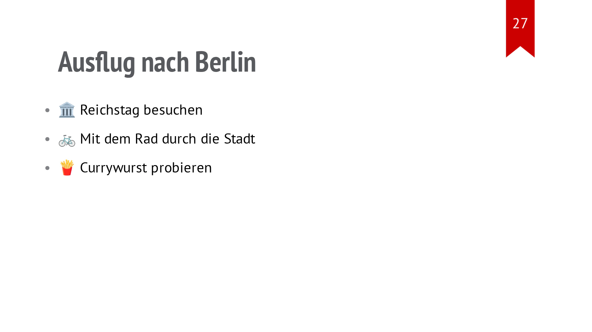
</button>

```css
.slide::after {
    position: absolute;
    top: 0;
    left: 875px;
    padding-top: 15px;
    box-sizing: border-box;
    width: var(--ribbon-size);
    height: calc(var(--ribbon-size) * 2);
    clip-path: polygon(0% 0%, 100% 0%, 100% 100%, 50% 80%, 0% 100%);
    background-color: var(--color-red);
    color: white;
    text-align: center;
    counter-increment: slide;
    content: counter(slide);
}
```

Die Zeile `content: counter(slide);` ist besonders wichtig.
Sie sorgt dafür, dass die Foliennummer automatisch eingesetzt wird.
Du schreibst die Zahl also **nicht** selbst in den HTML-Code der Folie.

Die Variablen `--color-red` und `--ribbon-size` kommen ebenfalls aus der Vorlage.
`var(--color-red)` bedeutet: »Nimm den Wert der CSS-Variable `--color-red`.«
So kann die Vorlage Farben und Größen an einer zentralen Stelle verwalten.

<div class='shower-mini-clear'></div>

##### Farbe des Standard-Ribbons ändern

Wenn du nur die Farbe ändern möchtest, kannst du das vorhandene Ribbon behalten und nur die Hintergrundfarbe überschreiben.
Schreibe diese Regel in `styles.css` unter den Kommentar `Eigene CSS-Regeln`:

<button class='shower-mini' type='button'>
    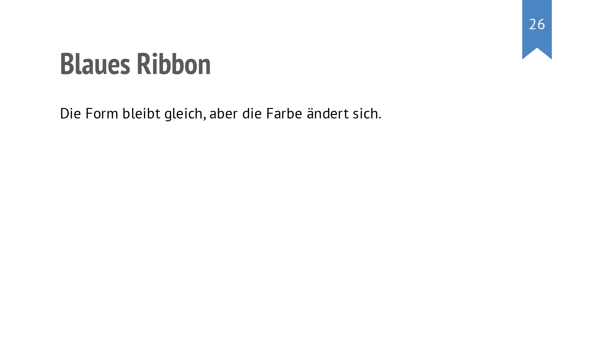
</button>

```css
.slide::after {
    background-color: #4b86c2;
}
```

Du kannst auch die vorhandene Shower-Farbvariable verwenden:

```css
.slide::after {
    background-color: var(--color-blue);
}
```

<div class='shower-mini-clear'></div>

##### Eine runde Seitenzahl verwenden

Das Ribbon muss nicht wie ein Lesezeichen aussehen.
Du kannst daraus auch einen Kreis machen.
Auch diese Regel gehört in `styles.css`:

<button class='shower-mini' type='button'>
    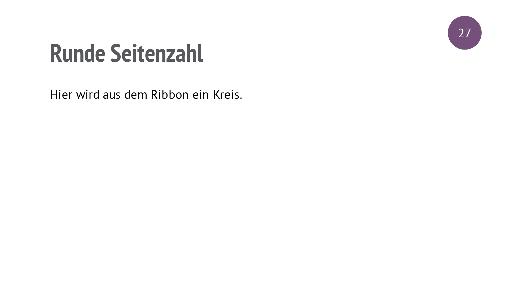
</button>

```css
.slide::after {
    top: 32px;
    left: auto;
    right: 55px;

    display: grid;
    place-items: center;

    width: 68px;
    height: 68px;
    padding-top: 0;

    clip-path: none;
    border-radius: 50%;
    background-color: #4aa03f;

    line-height: 1;
}
```

Wichtig sind hier vor allem drei Dinge:

- `clip-path: none;` entfernt die Lesezeichenform.
- `border-radius: 50%;` macht aus der Fläche einen Kreis.
- `left: auto; right: 55px;` platziert die Seitenzahl von rechts aus.

<div class='shower-mini-clear'></div>

##### Nur eine kleine Zahl unten rechts anzeigen

Manchmal soll die Seitenzahl sehr unauffällig sein.
Dann kannst du Hintergrund und Form komplett entfernen:

<button class='shower-mini' type='button'>
    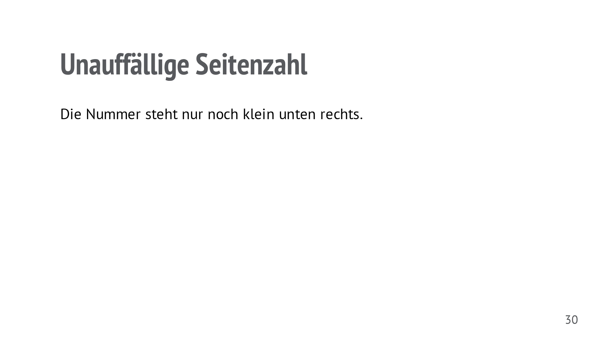
</button>

```css
.slide::after {
    top: auto;
    left: auto;
    right: 60px;
    bottom: 32px;

    width: auto;
    height: auto;
    padding-top: 0;

    clip-path: none;
    background: transparent;
    color: var(--color-grey);

    font-size: 20px;
    line-height: 1;
}
```

<div class='shower-mini-clear'></div>

##### Die Seitenzahl auf einer einzelnen Folie ausblenden

In der Starter-Vorlage gibt es dafür schon eine CSS-Regel in `styles.css`:

```css
.slide.nopagenumber::after {
    visibility: hidden;
}
```

Du musst also nur der Folie in `index.html` die zusätzliche Klasse `nopagenumber` geben:

<button class='shower-mini' type='button'>
    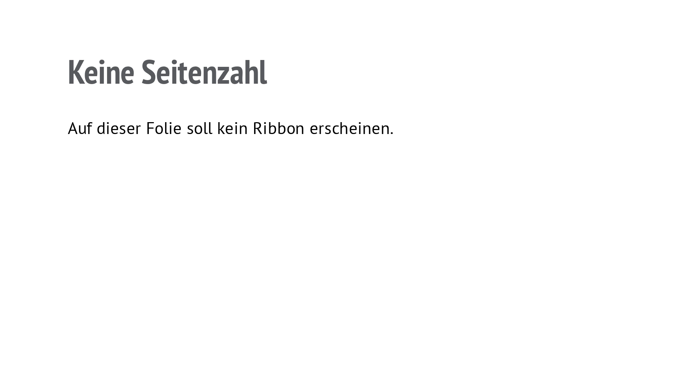
</button>

```html
<section class="slide nopagenumber">
    <h2>Startfolie ohne Seitenzahl</h2>
    <p>Auf dieser Folie soll kein Ribbon erscheinen.</p>
</section>
```

Achte darauf, dass beide Klassen im selben `class`-Attribut stehen:

```html
class="slide nopagenumber"
```

`slide` macht den Abschnitt zu einer Folie.
`nopagenumber` blendet nur auf dieser Folie die Seitenzahl aus.

##### Die Seitenzahl überall ausblenden

Wenn du die Seitenzahl **auf allen Folien** ausblenden möchtest, kannst du diese Regel in `styles.css` ergänzen:

```css
.slide::after {
    visibility: hidden;
}
```

<div class='hint'>
Am einfachsten ist es, das Standard-Ribbon erst einmal so zu lassen, wie es ist.
Wenn du später sicherer mit CSS wirst, kannst du sein Aussehen Schritt für Schritt verändern, statt es komplett neu zu bauen.
</div>

<div class='shower-mini-clear'></div>

#### Elemente genau platzieren

<!--
Hier sollten absolute Positionierung oder vorhandene Shower-Hilfsklassen wie place/top/left erklärt werden.
Wichtig: Nur für gezielte Layouts verwenden, nicht als Ersatz für normalen Textfluss.
-->

#### Zwei Spalten verwenden

<!--
Hier sollte ein sehr einfaches Zwei-Spalten-Layout gezeigt werden.
Am besten mit CSS Grid oder Flexbox, aber so reduziert, dass man das Muster kopieren und anpassen kann.
-->

### Mehr Möglichkeiten

<!--
Dieser Block sollte Dinge enthalten, die nicht direkt nötig sind, aber Präsentationen deutlich stärker machen.
Die Beispiele sollten erst kommen, wenn HTML-Struktur und einfaches CSS sitzen.
-->

#### Dinge nacheinander einblenden

<!--
Hier sollte class="next" erklärt werden.
Wichtig: Nur sparsam verwenden; Einblendungen sollen den Vortrag unterstützen und nicht jede Folie unnötig kompliziert machen.
-->

#### Wiederverwendbare CSS-Klassen schreiben

<!--
Hier sollte der Schritt von Inline-Style zu eigener Klasse kommen.
Ziel: Wiederholung vermeiden und den Schülerinnen und Schülern zeigen, dass CSS-Klassen eigene kleine Werkzeuge sind.
-->

#### Häufige Fehler finden

<!--
Hier sollten typische Fehler gesammelt werden: vergessenes schließendes Tag, falscher Dateiname, fehlende Anführungszeichen, CSS-Regel an falscher Stelle.
Sinnvoll wäre eine kleine Checkliste für die Fehlersuche in VS Code und Browser-Vorschau.
-->

### Profi-Tipps

<!--
Dieser Teil sollte Arbeitsweisen behandeln, nicht neue HTML/CSS-Bausteine.
Er ist für die Schülerinnen und Schüler gedacht, die ihre Präsentation sichern, teilen oder veröffentlichen wollen.
-->

#### Änderungen mit Git sichern

<!--
Hier sollte sehr praktisch erklärt werden, wann man einen Commit macht und warum das vor größeren Änderungen hilft.
Ziel: Git als Sicherheitsnetz zeigen, nicht als abstraktes Versionskontrollsystem.
-->

#### Präsentation veröffentlichen

<!--
Hier sollte auf /custom-subdomain hingewiesen werden, damit die Schülerinnen und Schüler ihre Präsentation online stellen können, ohne einen eigenen Server zu brauchen.
-->