<div class='meta'>
image: showerjs.webp:0:80
</div>

<style>
/*
 * Mini-Folien im Referenzteil
 * --------------------------------
 * Die Mini-Folien verwenden dieselbe 16:9-Grundfläche wie die Shower-Vorlage:
 * 1024 × 576 Pixel. Vorschau und Lightbox skalieren diese Fläche nur optisch.
 * Dadurch bleibt das Layout beim Vergrößern exakt gleich.
 */
.shower-mini,
.mini-lightbox-content {
    --mini-scale: 1;
    --mini-slide-width: 1024px;
    --mini-slide-height: 576px;
}

.shower-mini {
    box-sizing: border-box;
    float: right;
    position: relative;

    width: min(28rem, 45%);
    aspect-ratio: 16 / 9;
    margin: 0.2rem 0 1.2rem 1.5rem;

    overflow: hidden;
    border-radius: 10px;
    box-shadow: 0 0.35rem 1.15rem rgba(0, 0, 0, 0.22);

    color: inherit;
    text-decoration: none;
    cursor: zoom-in;

    transition:
        border-color 160ms ease,
        box-shadow 160ms ease,
        filter 160ms ease;
}

.shower-mini::before {
    content: '';
    position: absolute;
    inset: 0;
    z-index: 1;

    border-radius: inherit;
    box-shadow: inset 0 0 0 1px rgba(0, 0, 0, 0.12);
    pointer-events: none;

    transition: box-shadow 160ms ease;
}

.shower-mini:hover,
.shower-mini:focus-visible {
    box-shadow: 0 0.55rem 1.45rem rgba(0, 0, 0, 0.3);
}

.shower-mini:hover::before,
.shower-mini:focus-visible::before {
    box-shadow: inset 0 0 0 1px rgba(0, 0, 0, 0.26);
}

.shower-mini:focus-visible {
    outline: 0.18rem solid currentColor;
    outline-offset: 0.3rem;
}

.shower-mini-slide {
    box-sizing: border-box;
    position: relative;
    overflow: hidden;

    width: var(--mini-slide-width);
    height: var(--mini-slide-height);
    padding: 70px;

    background: white;
    color: #222;
    border-radius: 10px;

    font-family: 'PT Sans', sans-serif;
    font-size: 34px;
    line-height: 1.35;

    transform: scale(var(--mini-scale));
    transform-origin: top left;
}

.shower-mini > .shower-mini-slide,
.mini-lightbox-content > .shower-mini-slide {
    position: absolute;
    top: 0;
    left: 0;
}

.shower-mini-slide .mini-title {
    margin: 0 0 0.35em;

    font-family: 'PT Sans Narrow', 'PT Sans', sans-serif;
    font-size: 64px;
    font-weight: bold;
    line-height: 1.05;
}

.shower-mini-slide p {
    margin: 0 0 0.6em;
}

.shower-mini-slide img {
    max-width: 100%;
}

/* Hilfsklassen für typische Beispiele. */
.shower-mini-slide .mini-right {
    float: right;
    width: 38%;
    margin: 0 0 0.6em 0.8em;
}

.shower-mini-slide .mini-place {
    position: absolute;
    top: 50%;
    left: 50%;
    transform: translate(-50%, -50%);
}

.shower-mini-slide .mini-top {
    top: 12%;
}

.shower-mini-slide .mini-bottom {
    top: 88%;
}

.shower-mini-slide .mini-left {
    left: 15%;
}

.shower-mini-slide .mini-right-place {
    left: 85%;
}

.shower-mini-slide .mini-cover {
    position: absolute;
    inset: 0;

    width: 100%;
    height: 100%;
    max-width: none;
    object-fit: cover;
}

.shower-mini-slide .mini-over-image {
    position: relative;
    z-index: 1;

    color: white;
    text-shadow: 0 0.08em 0.25em black;
}

.shower-mini-clear {
    clear: both;
}

/* Eine einzige wiederverwendbare Lightbox für alle Mini-Folien. */
.mini-lightbox {
    width: 100vw;
    height: 100vh;
    max-width: none;
    max-height: none;
    margin: 0;
    padding: 2rem;

    border: 0;
    background: transparent;
    opacity: 0;

    transition: opacity 180ms ease;
}

.mini-lightbox::backdrop {
    background: rgba(0, 0, 0, 0.75);
    opacity: 0;
    transition: opacity 180ms ease;
}

.mini-lightbox[open] {
    display: grid;
    place-items: center;
}

.mini-lightbox.is-visible,
.mini-lightbox.is-visible::backdrop {
    opacity: 1;
}

.mini-lightbox-content {
    position: relative;

    width: min(1024px, calc(100vw - 4rem), calc((100vh - 4rem) * 16 / 9));
    aspect-ratio: 16 / 9;

    overflow: hidden;
    border-radius: 10px;
    box-shadow: 0 0.8rem 3rem rgba(0, 0, 0, 0.45);

    opacity: 0;
    transform: scale(0.96);
    transition:
        opacity 180ms ease,
        transform 180ms ease;
}

.mini-lightbox.is-visible .mini-lightbox-content {
    opacity: 1;
    transform: scale(1);
}

.mini-lightbox-close {
    position: fixed;
    top: 1rem;
    right: 1.4rem;
    z-index: 1;

    border: 0;
    background: transparent;
    color: white;

    font-family: 'PT Sans', sans-serif;
    font-size: 3rem;
    line-height: 1;
    cursor: pointer;
}

@media (max-width: 760px) {
    .shower-mini {
        float: none;
        width: 100%;
        margin: 1rem 0;
    }
}

@media (prefers-reduced-motion: reduce) {
    .shower-mini,
    .shower-mini::before,
    .mini-lightbox,
    .mini-lightbox::backdrop,
    .mini-lightbox-content {
        transition: none;
    }
}
</style>
<script>
document.addEventListener('DOMContentLoaded', () => {
    const SLIDE_WIDTH = 1024;
    const ANIMATION_TIME = 180;

    const lightbox = document.createElement('dialog');
    lightbox.className = 'mini-lightbox';
    lightbox.innerHTML = `
        <button class='mini-lightbox-close' type='button' aria-label='Vorschau schließen'>×</button>
        <div class='mini-lightbox-content'></div>
    `;

    document.body.appendChild(lightbox);

    const content = lightbox.querySelector('.mini-lightbox-content');
    const closeButton = lightbox.querySelector('.mini-lightbox-close');

    function setSlideScale(container) {
        const width = container.getBoundingClientRect().width;
        if (width > 0) {
            container.style.setProperty('--mini-scale', width / SLIDE_WIDTH);
        }
    }

    function updateAllScales() {
        document.querySelectorAll('.shower-mini').forEach(setSlideScale);
        if (lightbox.open) {
            setSlideScale(content);
        }
    }

    function prepareMiniSlides() {
        document.querySelectorAll('.shower-mini').forEach((mini) => {
            mini.setAttribute('role', 'button');
            mini.setAttribute('tabindex', '0');
            mini.setAttribute('aria-label', 'Beispiel vergrößern');
            setSlideScale(mini);
        });
    }

    function openMiniSlide(mini) {
        const slide = mini.querySelector('.shower-mini-slide');
        if (!slide) return;

        content.replaceChildren(slide.cloneNode(true));
        lightbox.classList.remove('is-visible');

        if (typeof lightbox.showModal === 'function') {
            lightbox.showModal();
        } else {
            lightbox.setAttribute('open', '');
        }

        setSlideScale(content);

        requestAnimationFrame(() => {
            setSlideScale(content);
            lightbox.classList.add('is-visible');
        });
    }

    function closeMiniSlide() {
        if (!lightbox.open) return;

        lightbox.classList.remove('is-visible');

        window.setTimeout(() => {
            if (typeof lightbox.close === 'function') {
                lightbox.close();
            } else {
                lightbox.removeAttribute('open');
            }

            content.replaceChildren();
        }, ANIMATION_TIME);
    }

    document.addEventListener('click', (event) => {
        const mini = event.target.closest('.shower-mini');
        if (!mini) return;

        event.preventDefault();
        openMiniSlide(mini);
    });

    document.addEventListener('keydown', (event) => {
        const mini = event.target.closest('.shower-mini');

        if (mini && (event.key === 'Enter' || event.key === ' ')) {
            event.preventDefault();
            openMiniSlide(mini);
        }
    });

    closeButton.addEventListener('click', closeMiniSlide);

    lightbox.addEventListener('click', (event) => {
        if (event.target === lightbox) {
            closeMiniSlide();
        }
    });

    lightbox.addEventListener('cancel', (event) => {
        event.preventDefault();
        closeMiniSlide();
    });

    if ('ResizeObserver' in window) {
        const observer = new ResizeObserver(updateAllScales);
        document.querySelectorAll('.shower-mini').forEach((mini) => observer.observe(mini));
        observer.observe(content);
    }

    window.addEventListener('resize', updateAllScales);

    prepareMiniSlides();
    updateAllScales();
});
</script>

# Eine Präsentation in HTML erstellen

<p class='abstract'>
Erstelle eine Präsentation mit shower.js in HTML und CSS. Mach dich unabhängig von PowerPoint und Keynote und erstelle eine Präsentation, die in jedem modernen Browser vom Stick oder von der Cloud aus funktioniert.
</p>

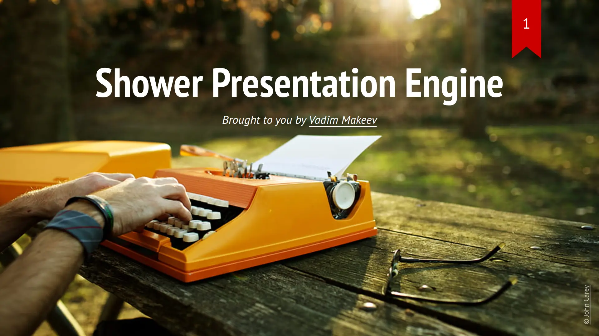

In diesem Tutorial erstellen wir eine Präsentation mit Hilfe von [shower.js](https://github.com/shower/shower) auf der Grundlage von HTML und CSS. Das heißt, dass jeder Webbrowser deine Präsentation abspielen kann und du keine besondere Software brauchst. Du kannst shower.js hier [in Aktion sehen](https://shwr.me/).

## Repository klonen

Stelle zuerst sicher, dass du keinen Ordner geöffnet hast. Um sicherzugehen, drücke einfach den Shortcut für »Ordner schließen«: <span class='key'>Strg</span><span class='key'>K</span> und dann <span class='key'>F</span>. Dein Workspace sollte jetzt ungefähr so aussehen:

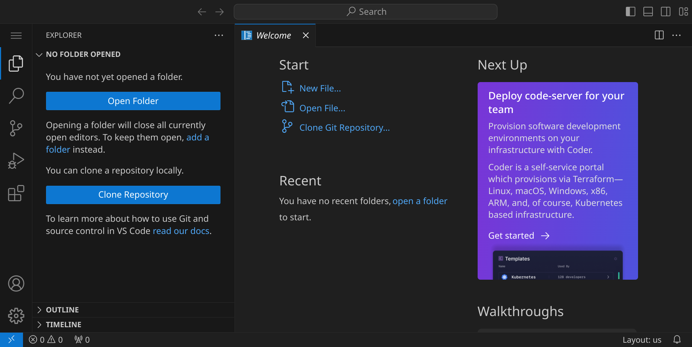

Wir holen uns eine Vorlage mit Hilfe von Git, damit du gleich loslegen kannst. Klicke dazu auf »Clone Repository« und füge die folgende URL ein:

```bash
https://git.nhcham.org/specht/shower.js.git
```

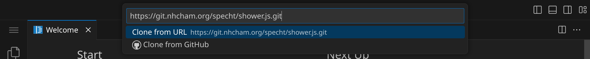

Bestätige anschließend mit <span class='key'>Enter</span>. Danach musst du ein Verzeichnis wählen, in dem das Repository gespeichert werden soll. Wähle dafür den Ordner `/workspace`.

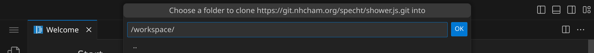

Das Repository wird jetzt ins Verzeichnis `/workspace/shower.js` geklont. Öffne anschließend das Verzeichnis, indem du die Frage, ob das Repository jetzt geöffnet werden soll, mit »Open« beantwortest:

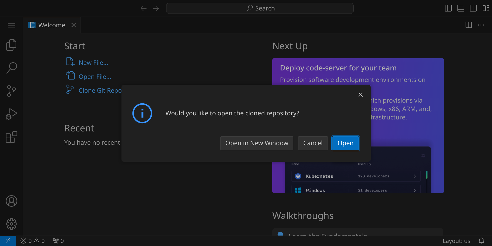

Dein Workspace sollte jetzt ungefähr so aussehen:

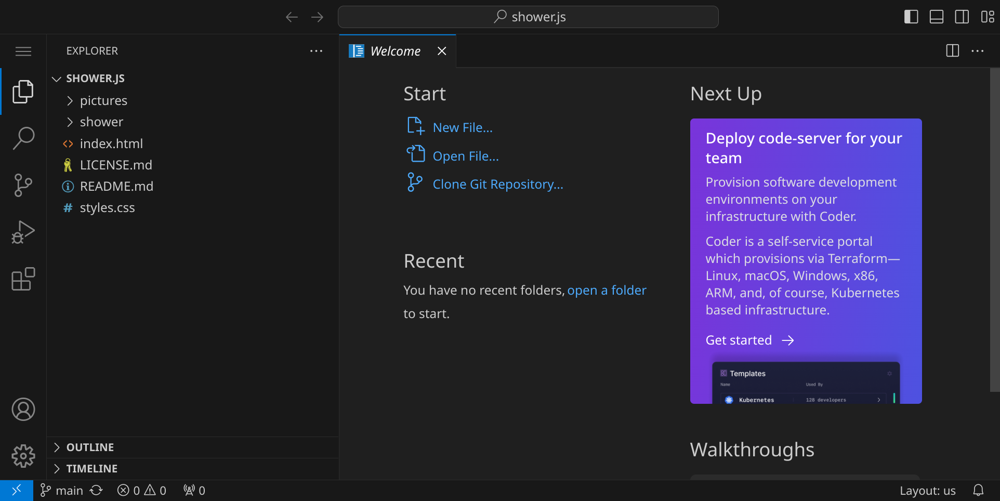

Links siehst du die Verzeichnisse und Dateien, die gerade heruntergeladen wurden. Öffne die Datei `index.html`, indem du darauf klickst.

## Live Server-Erweiterung installieren

Bevor wir mit dem Schreiben der Präsentation beginnen, installieren wir eine Erweiterung, die uns eine Live-Vorschau unserer Präsentation zeigt. Öffne dazu links die Extensions, suche die Erweiterung »Live Server« und klicke auf »Install«. Anschließend sollte dein Workspace so aussehen:

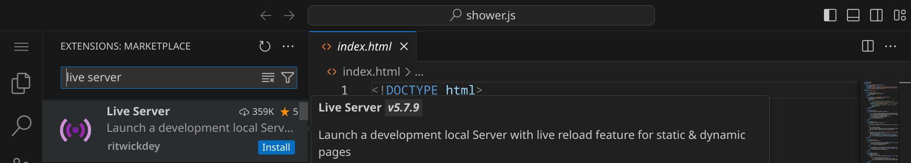

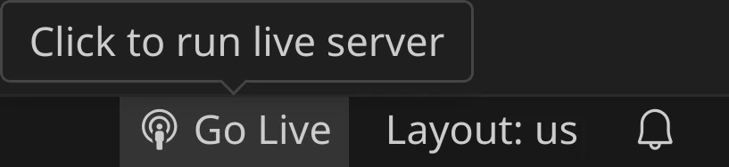

Öffne nun wieder den Explorer und öffne die Datei `index.html`. Unten rechts findest du jetzt den Eintrag »Go Live«. Drück dort drauf und die Vorschau deiner Präsentation sollte sich in einem neuen Browsertab öffnen.

Wenn du alles richtig gemacht hast, sollte dein Fenster so aussehen:

<div style='clear: both;'></div>

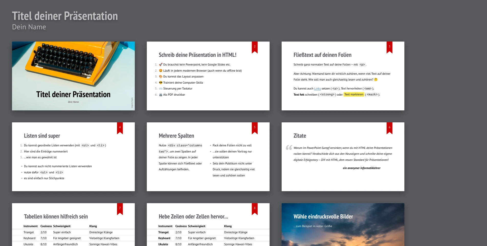

Zieh das Tab aus dem Browser und ordne beide Fenster nebeneinander an, um deine Änderungen live in der Vorschau zu sehen:

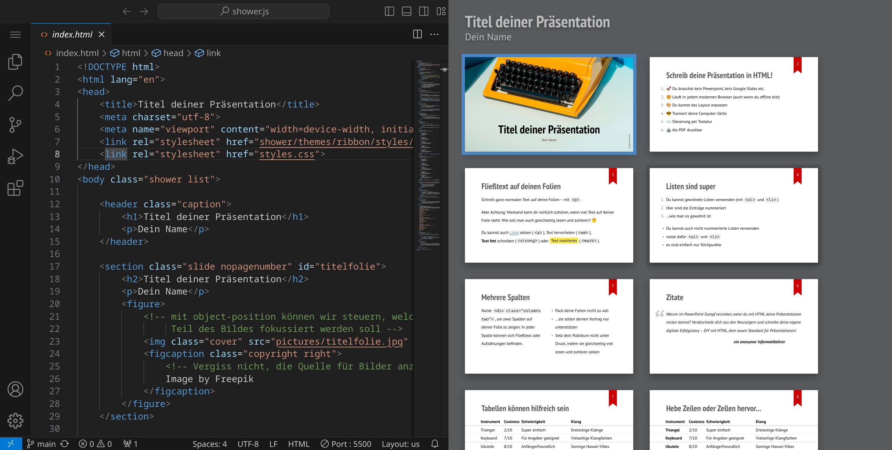

## Präsentation schreiben

Schau dir die Vorlage an und versuche, sie zu verstehen. Die Präsentation steht in der Datei `index.html`. Sie besteht aus einzelnen Folien, die du verändern, löschen oder ergänzen kannst.

Für diese Präsentation verwendest du zwei Sprachen:

- **HTML** beschreibt den Inhalt: Überschriften, Texte, Listen, Bilder und Folien.
- **CSS** beschreibt das Aussehen: Farben, Größen, Abstände und Positionen.

Du kannst jetzt damit beginnen, die Vorlage an deine Bedürfnisse anzupassen und deine Präsentation zu schreiben.

Speichere deine Änderungen mit <span class='key'>Strg</span><span class='key'>S</span>, um den Effekt im Vorschaufenster zu sehen, falls dein Workspace Änderungen nicht schon automatisch speichert. Das kannst du im Menü unter »File« / »Auto Save« einstellen.

<div class='hint'>
Wenn du die Datei <code>index.html</code> bearbeitest, musst du vorsichtig sein, weil die Syntax relativ wichtig ist. Schon eine fehlende spitze Klammer kann dazu führen, dass mehrere Folien auf einmal nicht mehr sichtbar sind. Gehe also behutsam vor und verwende zur Not <span class='key'>Strg</span><span class='key'>Z</span>, um Änderungen rückgängig zu machen. Wenn du dir unsicher bist, ob deine Änderungen funktionieren, speichere sie und schau dir das Ergebnis in der Vorschau an. Du kannst sie immer noch rückgängig machen.
</div>

<div class='hint melting'>
Falls sich deine Vorschau einmal nicht mehr aktualisieren sollte, kannst du die Seite einfach neu laden. Drück dafür <span class='key'>Strg</span><span class='key'>R</span> oder <span class='key'>F5</span>.
</div>

## Präsentation halten

Wenn du deine Präsentation halten möchtest, kannst du sie einfach im Browser öffnen und mit den Pfeiltasten navigieren. Du kannst auch die Maus benutzen, um durch die Präsentation zu scrollen.

Der besondere Vorteil bei dieser Art von Präsentation ist, dass sie in jedem modernen Browser funktioniert und du keine spezielle Software brauchst. Du kannst einfach das ganze Verzeichnis auf einen Stick kopieren und deine Präsentation überall abspielen, wo es einen modernen Webbrowser gibt.

## Referenz: Folien gestalten

In diesem Abschnitt findest du kurze Beispiele für typische Dinge, die du beim Gestalten deiner Folien brauchst. Du musst nicht alles der Reihe nach lesen. Such dir einfach die Stelle heraus, die zu deinem Problem passt.

### Grundlagen

#### Der Grundaufbau einer Folie

<div class='shower-mini'>
<div class='shower-mini-slide'>
<div class='mini-title'>Der Eisvogel</div>
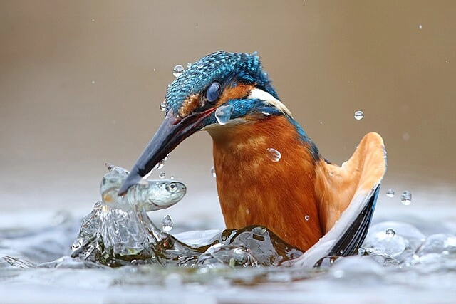
<p>Dieses Bild steht rechts. Der Text läuft links daran vorbei.</p>
</div>
</div>

#### Text und Überschriften
#### Listen und Stichpunkte
#### Wörter hervorheben

### Bilder

#### Bilder einfügen
#### Bilder vergrößern, verkleinern und zuschneiden
#### Bilder links oder rechts platzieren
#### Ein Bild als Hintergrund verwenden
#### Text auf Bildern lesbar machen

### Gestaltung

#### Farben ändern
#### Schriftgrößen ändern
#### Schriftarten ändern
#### Abstände ändern
#### Elemente genau platzieren
#### Zwei Spalten verwenden

### Mehr Möglichkeiten

#### Dinge nacheinander einblenden
#### Wiederverwendbare CSS-Klassen schreiben
#### Häufige Fehler finden

### Profi-Tipps

#### Änderungen mit Git sichern
#### Präsentation veröffentlichen