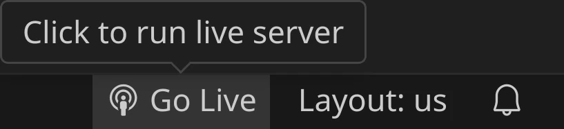
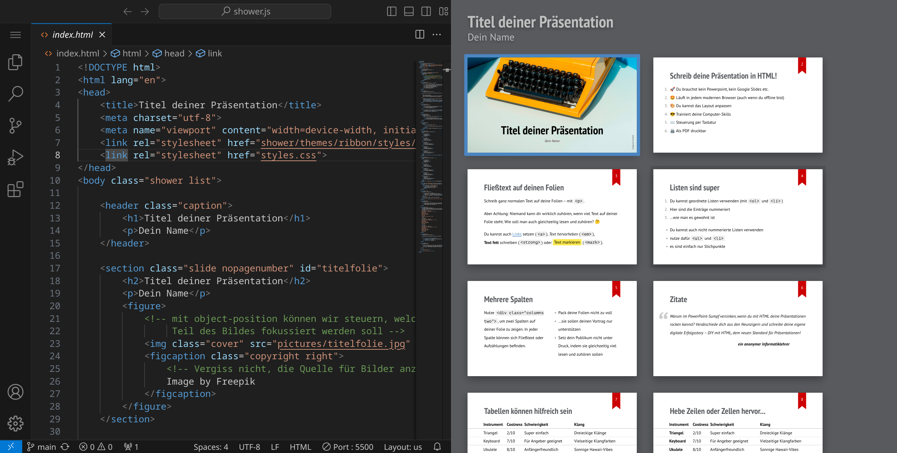

<div class='meta'>
image: showerjs.webp:0:80
</div>

# Eine Präsentation in HTML erstellen

<p class='abstract'>
Erstelle eine Präsentation mit shower.js in HTML und CSS. Mach dich unabhängig von PowerPoint und Keynote und erstelle eine Präsentation, die in jedem modernen Browser vom Stick oder von der Cloud aus funktioniert.
</p>


In diesem Tutorial erstellen wir eine Präsentation mit Hilfe von [shower.js](https://github.com/shower/shower) auf der Grundlage von HTML und CSS. Das heisst, dass jeder Webbrowser deine Präsentation abspielen kann und du keine besondere Software brauchst, um deine Präsentation abzuspielen. Du kannst shower.js hier [in Aktion sehen](https://shwr.me/).

## Repository klonen

Stelle zuerst sicher, dass du keinen Ordner geöffnet hast. Um sicherzugehen, drücke einfach den Shortcut für »Ordner schließen«: <span class='key'>Strg</span><span class='key'>K</span> und dann <span class='key'>F</span>. Dein Workspace sollte jetzt ungefähr so aussehen:


Wir holen uns eine Vorlage mit Hilfe von Git, damit wir gleich loslegen können. Klicke dazu auf »Clone Repository« und füge die folgende URL ein:

```bash
https://git.nhcham.org/specht/shower.js.git
```


Bestätige anschließend mit <span class='key'>Enter</span>.
Anschließend musst du ein Verzeichnis wählen, in dem das Repository gespeichert werden soll. Wähle dafür den Ordner `/workspace`.


Das Repository wird jetzt ins Verzeichnis `/workspace/shower.js` geklont. Öffne anschließend das Verzeichnis, indem du die Frage,
ob das Repository jetzt geöffnet werden soll, mit »Open« beantwortest:


Dein Workspace sollte jetzt ungefähr so aussehen:


Links siehst du die Verzeichnisse und Dateien, die gerade heruntergeladen wurden. Öffne die Datei `index.html`, indem du darauf klickst.

## Live Server-Erweiterung installieren

Bevor wir mit dem Schreiben der Präsentation beginnen, installieren wir eine Erweiterung, die uns eine Live-Vorschau unserer Präsentation zeigt.
Öffne dazu links die Extensions, suche die Erweiterung »Live Server« und klicke auf »Install«, um die Erweiterung zu installieren. Anschließend sollte dein Workspace so aussehen:




Öffne nun wieder den Explorer und öffne die Datei `index.html`. Unten rechts findest du jetzt den Eintrag »Go Live«.
Drück dort drauf und die Vorschau deiner Präsentation sollte sich in einem neuen Browsertab öffnen.

Wenn du alles richtig gemacht hast, sollte dein Fenster so aussehen:

<div style='clear: both;'></div>


Zieh das Tab aus dem Browser und ordne beide Fenster nebeneinander an, um deine Änderungen live in der Vorschau zu sehen:



## Präsentation schreiben

Schau dir die Vorlage an und versuche, sie zu verstehen. Falls du nach Hilfe suchst: die Technologien, die hier verwendet werden, heißen HTML und CSS.
Du kannst dann damit beginnen, die Vorlage an deine Bedürfnisse anzupassen und deine Präsentation zu schreiben.

Speichere deine Änderungen mit <span class='key'>Strg</span><span class='key'>S</span>, um den Effekt im Vorschaufenster zu sehen, falls dein Workspace Änderungen nicht schon automatisch speichert (das kannst du im Menü unter »File« / »Auto Save« einstellen).

<div class='hint'>
Wenn du die Datei <code>index.html</code> bearbeitest, musst du darauf achten, dass du vorsichtig bist, da die Syntax relativ wichtig ist und eine fehlende spitze Klammer dazu führen kann, dass viele Folien auf einmal nicht mehr sichtbar sind. Gehe also behutsam vor und verwende zur Not <span class='key'>Strg</span><span class='key'>Z</span>, um Änderungen rückgängig zu machen. Wenn du dir unsicher bist, ob deine Änderungen funktionieren, speichere sie und schau dir das Ergebnis in der Vorschau an. Du kannst sie immer noch rückgängig machen.
</div>

<div class='hint melting'>
Falls sich deine Vorschau einmal nicht mehr aktualisieren sollte, kannst du die Seite einfach neu laden. Drück dafür einfach <span class='key'>Strg</span><span class='key'>R</span> oder <span class='key'>F5</span>.
</div>

## HTML

HTML wird normalerweise nicht für Präsentationen, sondern für Websites verwendet. Die Funktion dieser Sprache ist es, Text mit bestimmten Eigenschaften auszuzeichnen &ndash; daher auch der Name »Hypertext Markup Language«. Schau dir den Quelltext einer beliebigen Website mit <span class='key'>Strg</span><span class='key'>U</span> an und du wirst HTML-Code sehen.

Generell ist es so, dass bei HTML Textteile in sogenannte Tags eingeschlossen werden. Schreibt man z. B. `H<sub>2</sub>O`, sorgen die `<sub>`-Tags dafür, dass die 2 tiefer gestellt wird: H<sub>2</sub>O. Ein öffnendes Tag wie `<sub>` muss immer mit einem passenden schließenden Tag `</sub>` geschlossen werden, wobei Tags beliebig geschachtelt werden können. Hier sind einige Beispiele:

<div style='max-width: 100%; overflow-x: auto;'>
<table class='table'>
<tr>
<th>HTML-Tag</th>
<th>Beispiel</th>
<th>Code</th>
</tr>
<tr>
<td><code>&lt;strong&gt;</code></td>
<td><strong>fetter Text</strong></td>
<td><code style='white-space: nowrap;'>&lt;strong&gt;fetter Text&lt;/strong&gt;</code></td>
</tr>
<tr>
<td><code>&lt;em&gt;</code></td>
<td><em>kursiver Text</em></td>
<td><code style='white-space: nowrap;'>&lt;em&gt;kursiver Text&lt;/em&gt;</code></td>
</tr>
<tr>
<td><code>&lt;u&gt;</code></td>
<td><u>unterstrichener Text</u></td>
<td><code style='white-space: nowrap;'>&lt;u&gt;unterstrichener Text&lt;/u&gt;</code></td>
</tr>
<tr>
<td><code>&lt;sub&gt;</code></td>
<td><sub style='white-space: nowrap;'>tiefgestellter</sub> Text</td>
<td><code>&lt;sub&gt;tiefgestellter&lt;/sub&gt; Text</code></td>
</tr>
<tr>
<td><code>&lt;sup&gt;</code></td>
<td><sup>hochgestellter</sup> Text</td>
<td><code style='white-space: nowrap;'>&lt;sup&gt;hochgestellter&lt;/sup&gt; Text</code></td>
</tr>
<tr>
<td><code>&lt;p&gt;</code></td>
<td><p style='margin: 0;'>Absatz</p></td>
<td><code style='white-space: nowrap;'>&lt;p&gt;<br>Absatz<br>&lt;/p&gt;</code></td>
</tr>
<tr>
<td><code>&lt;h1&gt;</code></td>
<td><h1 style='margin: 0; white-space: nowrap;'>Überschrift 1</h1></td>
<td><code style='white-space: nowrap;'>&lt;h1&gt;Überschrift 1&lt;/h1&gt;</code></td>
</tr>
<tr>
<td><code>&lt;h2&gt;</code></td>
<td><h2 data-autotoc='ignore' style='margin: 0;'>Überschrift 2</h2></td>
<td><code style='white-space: nowrap;'>&lt;h2&gt;Überschrift 2&lt;/h2&gt;</code></td>
</tr>
<tr>
<td><code>&lt;h3&gt;</code></td>
<td><h3 style='margin: 0;'>Überschrift 3</h3></td>
<td><code style='white-space: nowrap;'>&lt;h3&gt;Überschrift 3&lt;/h3&gt;</code></td>
</tr>
<tr>
<td><code>&lt;ul&gt;</code></td>
<td><ul><li>Stichpunkt 1</li><li>Stichpunkt 2</li></ul></td>
<td><code style='white-space: nowrap;'>&lt;ul&gt;<br>&nbsp;&nbsp;&lt;li&gt;Stichpunkt 1&lt;/li&gt;<br>&nbsp;&nbsp;&lt;li&gt;Stichpunkt 2&lt;/li&gt;<br>&lt;/ul&gt;</code></td>
</tr>
<tr>
<td><code>&lt;ol&gt;</code></td>
<td><ol><li>Aufzählung 1</li><li>Aufzählung 2</li></ol></td>
<td><code style='white-space: nowrap;'>&lt;ol&gt;<br>&nbsp;&nbsp;&lt;li&gt;Aufzählung 1&lt;/li&gt;<br>&nbsp;&nbsp;&lt;li&gt;Aufzählung 2&lt;/li&gt;<br>&lt;/ol&gt;</code></td>
</tr>
<tr>
<td><code>&lt;img&gt;</code></td>
<td></td>
<td><code style='white-space: nowrap;'>&lt;img src='image.jpg'&gt;</code></td>
</tr>
</table>
</div>

<!-- ## CSS -->

## Präsentation halten

Wenn du deine Präsentation halten möchtest, kannst du sie einfach im Browser öffnen und mit den Pfeiltasten navigieren. Du kannst auch die Maus benutzen, um durch die Präsentation zu scrollen. Der besondere Vorteil bei dieser Art von Präsentation ist, dass sie in jedem modernen Browser funktioniert und du keine spezielle Software brauchst, um sie abzuspielen. Du kannst einfach das ganze Verzeichnis auf einen Stick kopieren und deine Präsentation überall abspielen, wo es einen modernen Webbrowser gibt.