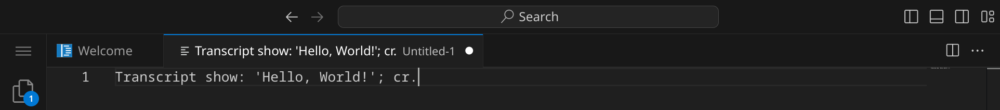
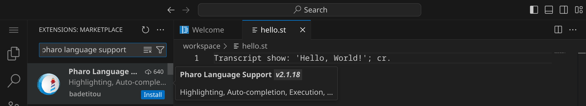
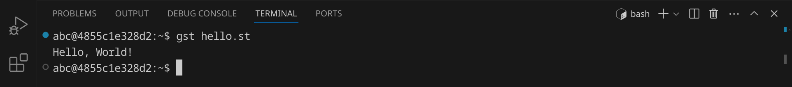
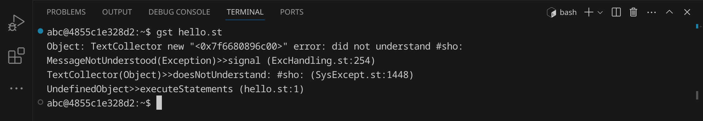
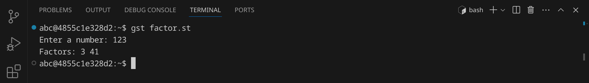
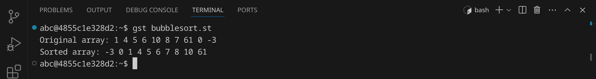

<div class='meta'>
image: smalltalk-logo.png
</div>

# Smalltalk <span style='font-size: 80%;'>(1980)</span>

<div class='floatright fr-wide' style='width: 30em;'>
    
    <p>Alan Kay, Adele Goldberg und Dan Ingalls</p>
</div>

<p class='abstract'>
Smalltalk ist eine objektorientierte Programmiersprache, die 1980 von Alan Kay, Adele Goldberg und Dan Ingalls am Xerox Palo Alto Research Center (PARC) entwickelt wurde. Smalltalk war die erste Programmiersprache, die das Konzept der Objektorientierung vollständig umsetzte und beeinflusste viele moderne Programmiersprachen wie Java, Ruby und Objective-C.
</p>

<!-- ## Eigenschaften

- **Objektorientiert**: Smalltalk ist eine objektorientierte Programmiersprache, die auf der Verwendung von Objekten und Klassen basiert.
- **Dynamisch**: Smalltalk ist eine dynamisch typisierte Sprache, was bedeutet, dass Variablen ihren Datentyp zur Laufzeit ändern können.
- **Reflexiv**: Smalltalk ist eine reflexive Sprache, was bedeutet, dass sie zur Laufzeit auf ihre eigene Struktur zugreifen kann.
- **Live-Programmierung**: Smalltalk unterstützt Live-Programmierung, was bedeutet, dass du den Code während der Ausführung ändern kannst.
- **Entwicklungsumgebung**: Smalltalk wird oft mit einer integrierten Entwicklungsumgebung (IDE) geliefert, die es ermöglicht, den Code zu schreiben, zu testen und zu debuggen. -->

## Hello, world!

Smalltalk ist eine Skriptsprache, was bedeutet, dass der Code zur Laufzeit interpretiert wird. Du hast zwei Möglichkeiten, Smalltalk-Code auszuführen:

1. Du kannst Smalltalk-Code direkt in der Smalltalk-Shell ausführen.
2. Du kannst Smalltalk-Code in einer Textdatei speichern und dann ausführen.

**Möglichkeit 1:** Smalltalk-Code in der Smalltalk-Shell ausführen

Öffne dazu ein Terminal, indem du entweder <span class='key'>Strg</span><span class='key'>J</span> drückst oder das Panel-Symbol  rechts oben drückst. Dein Fenster sollte jetzt ungefähr so aussehen:


Starte nun die Smalltalk-Shell, indem du `gst` eingibst und dann <span class='key'>Enter</span> drückst. Du solltest eine Ausgabe wie diese sehen:


Jetzt kannst du Smalltalk-Code direkt in der Shell eingeben und ausführen. Schreibe einfach `Transcript show: 'Hello, World!'; cr.` und drücke <span class='key'>Enter</span>. Du solltest die Ausgabe `Hello, world!` sehen.

Du kannst die Smalltalk-Shell wieder beenden, indem du `ObjectMemory quit` eingibst und <span class='key'>Enter</span> drückst oder einfach <span class='key'>Strg</span><span class='key'>D</span> drückst.

**Möglichkeit 2:** Smalltalk-Code in einer Textdatei speichern und ausführen

Smalltalk-Programme werden in Textdateien mit der Endung `.st` geschrieben. Ein Smalltalk-Interpreter liest anschließend den Quelltext und führt ihn aus.

Stelle zuerst sicher, dass du keinen Ordner geöffnet hast. Um sicherzugehen, drücke einfach den Shortcut für »Ordner schließen«: <span class='key'>Strg</span><span class='key'>K</span> und dann <span class='key'>F</span>. Dein Workspace sollte jetzt ungefähr so aussehen:


### Quelltext schreiben

Klicke auf »New File« und wähle als Dateityp »Text File« (oder bestätige einfach mit <span class='key'>Enter</span>).


Schreibe nun den folgenden Code in die Datei:

_include_file(hello.st, smalltalk)

Da Visual Studio Code noch nicht weiß, dass es sich um Smalltalk-Quelltext handelt, ist dein Programm momentan noch einfarbig, aber das wird sich gleich ändern. An dem weißen Punkt erkennst du, dass deine Änderungen noch nicht gespeichert sind.



Drücke nun <span class='key'>Strg</span><span class='key'>S</span>, um die Datei zu speichern. Gib `hello.st` ein – der vollständige Pfad zu deiner Datei lautet dann `/workspace/hello.st`.


<div class='hint'>
Achte darauf, dass du deine Datei nicht aus Versehen <code>hello.st.</code> (mit einem Punkt am Ende) nennst, da Visual Studio Code als Dateiname <code>Transcript show: 'Hello, World!'; cr.</code> vorschlägt.
</div>

Da Smalltalk standardmäßig nicht von Visual Studio Code unterstützt wird, müssen wir noch eine passende Erweiterung installieren. Klicke dazu auf das Erweiterungs-Symbol  in der Seitenleiste oder drücke <span class='key'>Strg</span><span class='key'>Shift</span><span class='key'>X</span>. Suche nach der Erweiterung »Pharo Language Support« und installiere sie.



Alternativ kannst du auch <span class='key'>Strg</span><span class='key'>P</span> drücken und `ext install badetitou.pharo-language-server` eingeben, um die Erweiterung zu installieren.

Anschließend solltest du dein Smalltalk-Programm farbig sehen:


### Skript ausführen

Um unser Programm auszuführen, müssen wir den Smalltalk-Interpreter aufrufen (in unserem Fall `gst`) und ihm den Dateinamen unseres Programms übergeben.

Öffne dazu ein Terminal, indem du <span class='key'>Strg</span><span class='key'>J</span> drückst und gib folgenden Befehl ein:

```bash
gst hello.st
```

<div class='hint'>
Du musst nicht den vollständigen Dateinamen schreiben. Schreib einfach <code>gst he</code> und drücke <span class='key'>Tab</span>, um den Dateinamen automatisch zu <code>hello.st</code> vervollständigen zu lassen. Du kannst danach ganz normal weiterschreiben.
</div>

Das Programm sollte die Nachricht `Hello, World!` im Terminal ausgeben:



### Fehler finden und beheben

Wenn du einen Fehler im Code machst, wird Lisp eine Fehlermeldung ausgeben. Versuche zum Beispiel, statt `show` das Wort `sho` zu schreiben:

```smalltalk
Transcript sho: 'Hello, World!'; cr.
```

Speichere die Datei und führe das Skript erneut aus:

```bash
gst hello.st
```

<div class='hint'>
Nutze die Pfeiltaste hoch <span class='key'>↑</span>, um den letzten Befehl erneut einzugeben. So kannst du schnell dein Programm testen, nachdem du es verändert hast.
</div>

Smalltalk sollte eine Fehlermeldung ausgeben, die dir hilft, den Fehler zu finden:



Es lohnt sich, die Fehlermeldungen genau zu lesen, um den Fehler zu finden und zu beheben. Achte auf die Zeilennummer (in diesem Beispiel 1) und den Text, der dir sagt, was falsch ist. Denke daran, den Fehler wieder zu beheben, bevor du das nächste Beispiel ausprobierst.

### Shebang `#!`

Bisher musst du, um dein Skript auszuführen, immer den Smalltalk-Interpreter explizit aufrufen. Wenn du dein Skript wie ein normales Programm ausführen möchtest, kannst du ein sogenanntes Shebang am Anfang deiner Datei hinzufügen. Das Shebang besteht aus einer Raute `#` gefolgt von einem Ausrufezeichen `!` und dem Pfad zum Smalltalk-Interpreter. In unserem Fall sieht das so aus:

```smalltalk
#!/usr/bin/env gst
```

Füge diese Zeile ganz oben in deinem Skript ein und speichere die Datei. Bevor wir das Skript ausführen können, müssen wir es noch ausführbar machen. Das machen wir mit dem Befehl `chmod`:

```bash
chmod +x hello.st
```
Jetzt können wir das Skript direkt ausführen:

```bash
./hello.st
```


## Primfaktorenzerlegung

Im zweiten Beispiel wollen wir eine Zahl in ihre Primfaktoren zerlegen. An diesem Beispiel kannst du sehen, wie man in Smalltalk Benutzereingaben verarbeitet und Schleifen verwendet.
Erstelle eine neue Datei mit <span class='key'>Strg</span><span class='key'>Alt</span><span class='key'>N</span> und schreibe den folgenden Code hinein:

_include_file(factor.st, smalltalk)

Speichere die Datei unter dem Namen `factor.st`. Kompiliere das Programm:

```bash
gcc factor.c -o factor
```

Falls du keine Fehlermeldung erhältst, kannst du das Programm ausführen und testen:



Das Programm hat die Zahl 123 in ihre Primfaktoren zerlegt und ausgegeben. Anders als andere Programmiersprachen kann Smalltalk auch Zahlen wie 3000000000 und 123456789123456789 in Sekundenbruchteilen zerlegen, allerdings beendet sich das Programm nicht (probier es gern aus, du kannst das Programm mit <span class='key'>Strg</span><span class='key'>C</span> abbrechen). Falls du einen sachdienlichen Hinweis hast, schreib bitte eine E-Mail an <a href='mailto:specht@gymnasiumsteglitz.de'>specht@gymnasiumsteglitz.de</a>.

## Bubblesort

Im dritten Beispiel wollen wir eine Liste von 10 Zufallszahlen sortieren. Dafür verwenden wir den [Bubblesort-Algorithmus](https://de.wikipedia.org/wiki/Bubblesort), der zwar nicht besonders effizient ist, aber sehr einfach zu verstehen und zu implementieren. Der Bubblesort-Algorithmus funktioniert, indem er die Liste mehrmals durchläuft und benachbarte Elemente vertauscht, wenn sie in der falschen Reihenfolge sind.

An diesem Beispiel kannst du sehen, wie man in Smalltalk Arrays verwendet, Funktionen verwendet und Schleifen verschachtelt.

Erstelle eine neue Datei und schreibe den folgenden Code hinein:

_include_file(bubblesort.st, smalltalk)

Speichere das Skript unter dem Namen `bubblesort.st` und führe es aus:



Das Programm hat eine Liste von 10 Zufallszahlen sortiert. Versuche, den Quelltext so zu verändern, dass statt 10 Zahlen 100 oder mehr Zahlen sortiert werden.

## Zusammenfassung

In diesem Kapitel hast du an drei Beispielen gesehen, wie man ein einfaches Smalltalk-Skript schreiben und ausführen kann. Das ist natürlich nur ein erster Eindruck. Um Smalltalk wirklich zu beherrschen, musst du noch viel mehr lernen – am besten, indem du eigene Skripte schreibst und ausprobierst. Die Buchhandlungen, Bibliotheken und Youtube sind voll von Material für dich. Viel Spaß beim Programmieren!
