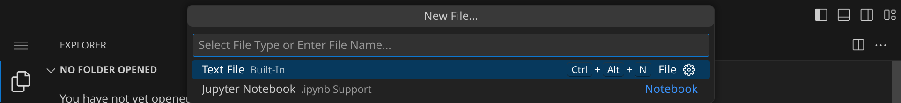
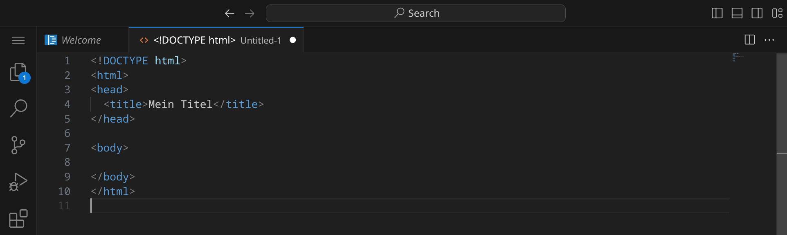
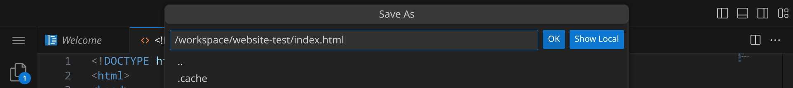
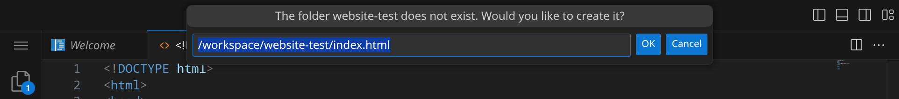
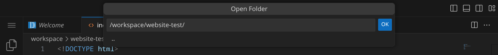
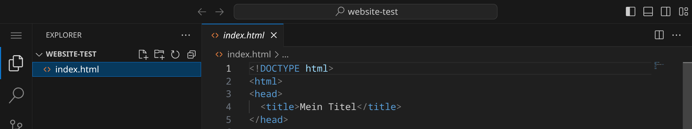
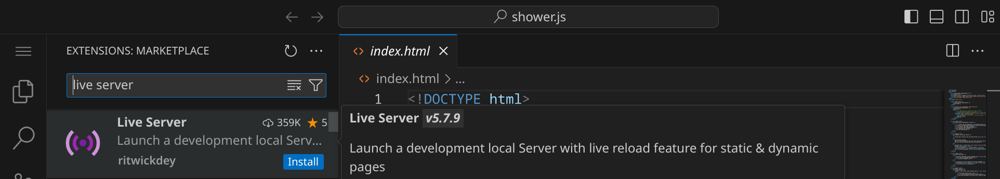
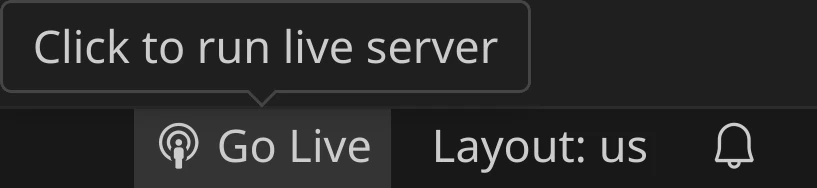
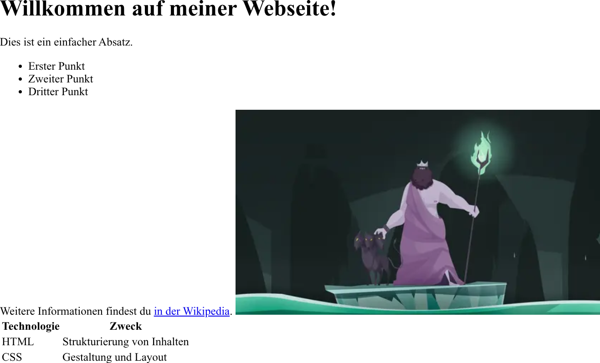
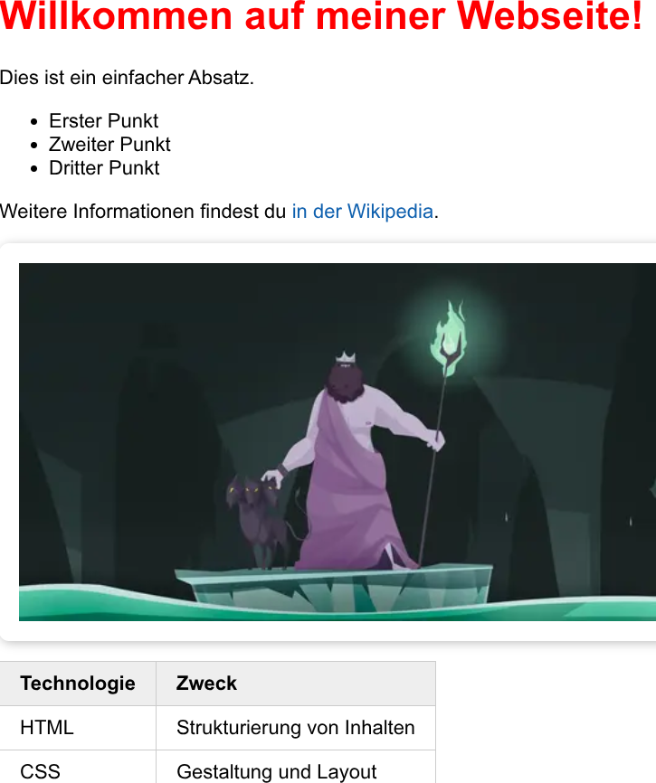

<div class='meta'>
image: html-css-logo.png
</div>

# Statische Webseiten mit HTML & CSS

<p class='abstract'>
Immer, wenn du mit einem Webbrowser wie z. B. Firefox, Chrome oder Safari eine Webseite aufrufst, siehst du eine HTML-Seite. HTML ist die Abkürzung für <a href="https://de.wikipedia.org/wiki/Hypertext_Markup_Language">Hypertext Markup Language</a> und ist die Sprache, mit der Webseiten erstellt werden. HTML ist eine Auszeichnungssprache, die es ermöglicht, Inhalte in einem strukturierten Format darzustellen.
</p>

## Vorbereitung

Stelle zuerst sicher, dass du keinen Ordner geöffnet hast. Um sicherzugehen, drücke einfach den Shortcut für »Ordner schließen«: <span class='key'>Strg</span><span class='key'>K</span> und dann <span class='key'>F</span>. Dein Workspace sollte jetzt ungefähr so aussehen:


### HTML-Datei anlegen

Klicke auf »New File« und wähle als Dateityp »Text File« (oder bestätige einfach mit <span class='key'>Enter</span>).



Schreibe nun den folgenden Code in die Datei:

_include_file(template.html, html)

Dein Fenster sollte jetzt ungefähr so aussehen (an dem weißen Punkt erkennst du, dass deine Änderungen noch nicht gespeichert sind):



Drücke nun <span class='key'>Strg</span><span class='key'>S</span>, um die Datei zu speichern. Gib `website-test/index.html` ein – der vollständige Pfad zu deiner Datei lautet dann `/workspace/website-test/index.html`.



Da das Unterverzeichnis `website-test` noch nicht existiert, wirst du gefragt, ob es für dich erstellt werden soll. Bestätige dies mit <span class='key'>Enter</span>.



Da wir nun in diesem Verzeichnis arbeiten wollen, kannst du es öffnen, indem du entweder im Menü »File« / »Open Folder…« auswählst oder einfach <span class='key'>Strg</span><span class='key'>K</span> und dann <span class='key'>Strg</span><span class='key'>O</span> drückst. Wähle den Ordner `website-test` aus:



Nachdem das Verzeichnis geöffnet wurde, siehst du auf der linken Seite den Explorer. Hier siehst du alle Dateien und Ordner, die sich in diesem Verzeichnis befinden. Klicke auf die Datei `index.html`, um sie zu öffnen.




### Live Server-Erweiterung installieren

Damit wir unsere Webseite jederzeit im Browser anschauen können, installieren wir eine Erweiterung. Öffne dazu links die Extensions, suche die Erweiterung »Live Server« und klicke auf »Install«, um die Erweiterung zu installieren:





Wenn alles geklappt hat, solltest du unten rechts den Eintrag »Go Live« sehen. Wenn du darauf klickst, öffnet sich ein neues Tab in deinem Browser mit der Vorschau deiner HTML-Seite. Deine Seite ist noch leer, aber das wird sich gleich ändern. Zumindest solltest du in der Titelzeile des Browserfenster schon den Seitentitel »Mein Titel« sehen.

<div style='clear: both;'></div>

<div class='hint'>
Tipp: Ziehe deinen Workspace und die Vorschau nebeneinander, damit du deine Änderungen live sehen kannst.
</div>

## Grundaufbau einer HTML-Seite

Öffne nun wieder die Datei `index.html` und schau dir den Quelltext an. Bis auf die erste Zeile `<!DOCTYPE html>` siehst du Tags, wie z. B. `<html>`, `<head>` und `<body>`. Zu jedem öffnenden Tag gehört ein schließender Tag, der mit einem `/` beginnt. Zum Beispiel wird der `<html>`-Tag mit `</html>` geschlossen. Diese Tags sind wichtig, um den Browser zu zeigen, wie die Seite strukturiert ist. Sie sind verschachtelt und definieren so die Struktur und den Inhalt der Seite.

### Titel der Seite ändern

Im `<title>`-Tag steht der Titel der Seite, der in der Titelzeile des Browserfensters angezeigt wird. Ändere den Titel der Seite in »Meine erste Webseite« und speichere die Datei mit <span class='key'>Strg</span><span class='key'>S</span>. Du solltest jetzt den neuen Titel in der Titelzeile des Browserfensters sehen.

<div class='hint'>
Tipp: Es kann manchmal passieren, dass sich die Vorschau nicht automatisch aktualisiert. Wenn das passiert, drücke einfach <span class='key'>F5</span>, um die Seite neu zu laden.
</div>

### Die Seite mit Inhalt füllen

Jetzt kannst du die Seite mit Inhalt füllen. HTML ist eine Auszeichnungssprache, die es ermöglicht, Text mit bestimmten Eigenschaften auszuzeichnen. Du kannst z. B. Überschriften, Absätze, Links und Bilder einfügen. Schreibe folgenden Code in den `<body>`-Tag:

```html
<h1>Willkommen auf meiner Webseite!</h1>
<p>Dies ist ein einfacher Absatz.</p>
```

Nachdem du die Datei gespeichert hast, solltest du den Text »Willkommen auf meiner Webseite!« in der Vorschau sehen. Der Text ist fett und groß, weil er als Überschrift 1 (`<h1>`) ausgezeichnet ist. Der Text »Dies ist ein einfacher Absatz.« ist ein normaler Absatz (`<p>`) und deshalb in normaler Schriftgröße dargestellt.

<div class='hint'>
Die HTML-Tags sind nur dazu da, um den Text zu strukturieren, aber sie sind nicht für die konkrete Gestaltung verantwortlich. Wenn du Schriftart, Schriftgröße, Farben etc. ändern möchtest, musst du dich noch kurz gedulden – das machen wir gleich mit CSS.
</div>

### Listen

Du kannst auch Listen in HTML erstellen. Es gibt zwei Arten von Listen: ungeordnete Listen (`<ul>`) und geordnete Listen (`<ol>`). Eine ungeordnete Liste wird mit Punkten dargestellt, während eine geordnete Liste nummeriert wird. Hier ist ein Beispiel für eine ungeordnete Liste:

```html
<ul>
  <li>Erster Punkt</li>
  <li>Zweiter Punkt</li>
  <li>Dritter Punkt</li>
</ul>
```

### Links

Das Fantastische an HTML ist, dass du auch Links zu anderen Webseiten einfügen kannst. Das machst du mit dem `<a>`-Tag. Hier ist ein Beispiel:

```html
Weitere Informationen findest du <a href="https://de.wikipedia.org">in der Wikipedia</a>.
```

<div class='hint'>
Übrigens, das »H« in HTML steht für »Hypertext« und bedeutet, dass du mit HTML auch Links zu anderen Webseiten erstellen kannst. Das ist eine der wichtigsten Funktionen von HTML und macht das Web so mächtig – damals, zum Beginn des World Wide Web, war das eine Revolution!
</div>

Beim `<a>`-Tag musst du das Attribut `href` angeben, das die URL der Seite angibt, auf die du verlinken möchtest. Möchtest du, dass sich die Seite in einem neuen Tab öffnet, kannst du das Attribut `target="_blank"` hinzufügen (ansonsten verlässt der Nutzer mit dem Klick auf den Link deine Seite). Hier ist ein Beispiel:

```html
Weitere Informationen findest du <a href="https://de.wikipedia.org" target="_blank">in der Wikipedia</a>.
```

### Bilder

Bilder kannst du mit dem ``-Tag einfügen. Hier ist ein Beispiel:

```html

```

Mit dem Attribut `src` gibst du die URL des Bildes an. Das Attribut `alt` ist wichtig, da es den Inhalt des Bildes beschreibt. Wenn das Bild nicht geladen werden kann, wird der Text im `alt`-Attribut angezeigt. Außerdem ist es wichtig für Screenreader, die den Inhalt der Seite vorlesen.

Statt einer URL kannst du auch einen relativen Pfad angeben. Wenn du z. B. ein Bild im selben Verzeichnis wie die HTML-Datei hast, kannst du einfach den Dateinamen angeben:

```html

```

<div class='hint'>
Früher wurden vor allem die Bildformate GIF, JPEG und PNG verwendet. Heutzutage werden auch WebP-, AVIF-Dateien unterstützt. Diese Formate sind moderner und bieten eine bessere Qualität bei kleinerer Dateigröße.
</div>

<div class='hint think'>
Wenn du besonders aufmerksam warst, hast du vielleicht bemerkt, dass es zum <code>&lt;img&gt;</code>-Tag kein schließendes Tag gibt. Das liegt daran, dass es sich um ein sogenanntes Void-Element handelt, das leer ist und kein schließendes Tag benötigt. Es gibt noch einige andere Void-Elemente, die du <a href="https://developer.mozilla.org/de/docs/Glossary/Void_element">hier</a> nachlesen kannst.
</div>

### Tabellen

Um eine Tabelle zu erstellen, verwendest du die Tags `<table>`, `<tr>` (für Zeilen) sowie `<th>` (für Tabellenüberschriften) und `<td>` (für Zellen). Hier ist ein Beispiel:

```html
<table>
  <tr>
    <th>Technologie</th>
    <th>Zweck</th>
  </tr>
  <tr>
    <td>HTML</td>
    <td>Strukturierung von Inhalten</td>
  </tr>
  <tr>
    <td>CSS</td>
    <td>Gestaltung und Layout</td>
  </tr>
  <tr>
    <td>JavaScript</td>
    <td>Interaktivität</td>
  </tr>
</table>
```

Hier siehst du noch einmal den vollständigen Code:

```html
<!DOCTYPE html>
<html>
<head>
  <title>Meine erste Webseite</title>
</head>

<body>
  <h1>Willkommen auf meiner Webseite!</h1>
  <p>Dies ist ein einfacher Absatz.</p>

  <ul>
    <li>Erster Punkt</li>
    <li>Zweiter Punkt</li>
    <li>Dritter Punkt</li>
  </ul>

  <p>
    Weitere Informationen findest du <a href="https://de.wikipedia.org">in der Wikipedia</a>.
  </p>

  

  <table>
    <tr>
      <th>Technologie</th>
      <th>Zweck</th>
    </tr>
    <tr>
      <td>HTML</td>
      <td>Strukturierung von Inhalten</td>
    </tr>
    <tr>
      <td>CSS</td>
      <td>Gestaltung und Layout</td>
    </tr>
  </table>

</body>
</html>
```

<div class='hint'>
Beachte, dass wir den Text mit dem Link nun auch in einen Absatz (<code>&lt;p&gt;</code>) gepackt haben, damit er nicht einfach so »in der Luft hängt«. Das ist wichtig, damit der Text richtig strukturiert ist und die Seite gut aussieht.
</div>

<div class='floatright' style='width: 32em;'>
    
</div>

Deine Seite sollte in der Live-Vorschau jetzt so aussehen wie rechts abgebildet. Wenn du die Seite so siehst, hast du alles richtig gemacht. Wenn nicht, schau dir den Quelltext noch einmal genau an und achte darauf, dass du alle Tags richtig gesetzt hast. HTML ist sehr empfindlich gegenüber Fehlern. Wenn du z. B. ein schließendes Tag vergisst oder ein Tag falsch schreibst, wird die Seite nicht richtig angezeigt.

Schön ist das alles noch nicht, aber keine Sorge &ndash; HTML ist ja auch nur für die Strukturierung zuständig. Um die Gestaltung kümmern wir uns jetzt mit CSS.

## Gestaltung mit CSS

CSS steht für <a href="https://de.wikipedia.org/wiki/Cascading_Style_Sheets">Cascading Style Sheets</a> und ist eine Stylesheet-Sprache, die es ermöglicht, das Layout und das Design von Webseiten zu gestalten. Mit CSS kannst du Farben, Schriftarten, Abstände und viele andere Eigenschaften von HTML-Elementen ändern.

### CSS in HTML einfügen

Es gibt drei Möglichkeiten, CSS in HTML einzufügen:

**Inline-CSS**: Du kannst CSS direkt in den HTML-Tag einfügen, indem du das `style`-Attribut verwendest. Hier ist ein Beispiel:

```html
<h1 style="color: red;">Willkommen auf meiner Webseite!</h1>
```

**Eingebettetes CSS**: Du kannst CSS im `<head>`-Tag der HTML-Datei einfügen, indem du den `<style>`-Tag verwendest. Hier ist ein Beispiel:

```html
<head>
  <style>
    h1 {
        color: red;
    }
  </style>
</head>
```

**Externes CSS**: Du kannst deinen ganzen CSS-Code in eine separate Datei auslagern und diese Datei im `<head>`-Tag der HTML-Datei verlinken:

```html
<head>
  <link rel="stylesheet" type="text/css" href="styles.css">
</head>
```

In diesem Fall musst du eine Datei mit dem Namen `styles.css` erstellen und den CSS-Code dort einfügen.

Wir verwenden in diesem Tutorial die letzte Variante, da es die beste Methode ist, um CSS in HTML zu verwenden. Du kannst so den CSS-Code von der HTML-Datei trennen und ihn in mehreren HTML-Dateien wiederverwenden.

### CSS-Datei erstellen

Erstelle eine neue Datei und speichere sie unter dem Namen `styles.css`. Schreibe den folgenden Code in die Datei:

```css
body {
  font-family: Arial, sans-serif;
}
```

Wenn du die Datei gespeichert hast, solltest du die Änderungen in der Vorschau sehen: die Schriftart sollte sich geändert haben. Falls die Schriftart Arial installiert (was unter Windows seit 1992 überall der Fall sein sollte und auf dem Mac auch), wird sie verwendet. Wenn nicht, wird eine andere, <a href="https://de.wikipedia.org/wiki/Serife">serifenlose Schriftart</a> verwendet.

<div class='hint think'>
Tipp: Deine Vorschau hat sich nicht verändert, obwohl du schon einmal neu geladen hast? Hast du daran gedacht, die CSS-Datei im <code>&lt;head&gt;</code>-Tag der HTML-Datei zu verlinken?
</div>

### Schriftarten ändern

Du kannst die Schriftart auch auf eine andere Schriftart ändern, indem du den Namen der Schriftart im `font-family`-Attribut änderst. Aber Achtung: nicht alle Schriftarten sind auf jedem Computer installiert. Wenn du eine Schriftart verwendest, die nicht installiert ist, wird der Browser eine andere Schriftart verwenden. Um sicherzustellen, dass die korrekte Schriftart verwendet werden kann, kannst du die passende Font-Datei angeben, die dein Browser laden kann. Das geht z. B. mit <a href="https://fonts.google.com/">Google Fonts</a>. Du kannst die Schriftart auswählen, die du verwenden möchtest, und den Link in den `<head>`-Tag deiner HTML-Datei einfügen. Hier ist ein Beispiel:

```html
<head>
  <link rel="stylesheet" href="https://fonts.googleapis.com/css2?family=Roboto:wght@400&display=swap">
  <link rel="stylesheet" type="text/css" href="styles.css">
</head>
```

Nun kannst du die Schriftart »Roboto« auf deiner Webseite verwenden.

<div class='hint think'>
Achtung: Wenn du eine Schriftart direkt von Google Fonts verwendest, wird eine Verbindung zu Google aufgebaut, bei der die IP-Adresse der Besucher deiner Webseite an Google übermittelt wird. Das ist ohne weitere Schritte nicht datenschutzkonform. Wenn du eine Schriftart von Google Fonts verwenden möchtest, lade sie herunter und binde sie lokal ein, so dass alle benötigten Dateien direkt von deiner Webseite kommen. Das geht z. B. mit dem <a href="https://gwfh.mranftl.com/fonts">Google Webfonts Helper</a>.
</div>

Schau noch einmal in die CSS-Datei:

```css
body {
  font-family: Arial, sans-serif;
}
```

Vor den geschweiften Klammern `{}` steht der Selektor `body`. Der Selektor gibt an, auf welches HTML-Element die CSS-Regel angewendet werden soll. In diesem Fall wird die Regel auf das `<body>`-Tag angewendet, sie gilt also für den gesamten Inhalt der Seite. Du kannst auch andere Selektoren verwenden, um bestimmte HTML-Elemente auszuwählen. Hier sind einige Beispiele:

```css
h1 {
  color: red;
}

p {
  font-size: 16px;
}
```

Wir haben die Textfarbe des `<h1>`-Tags auf rot gesetzt und die Schriftgröße des `<p>`-Tags auf 16 Pixel geändert.

### Links gestalten

Kümmern wir uns nun um die Links: Normalerweise sind Links blau und unterstrichen. Wir ändern den Blauton und sorgen dafür, dass die Links nur unterstrichen sind, wenn der Mauszeiger darüber schwebt.

```css
a {
  color: #0d60ae;
  text-decoration: none;
}
```

<div class='hint'>
<p>
Tipp: Farben kannst du in CSS auf verschiedene Arten angeben: z. B. mit dem Namen der Farbe (z. B. <code>red</code>), als Hexadezimalwert (z. B. <code>#ff0000</code>) oder als RGB-Wert (z. B. <code>rgb(255, 0, 0)</code>). Neben dem Wert im Quelltext siehst du ein kleines Quadrat, das die Farbe anzeigt. Wenn du darauf klickst, öffnet sich ein Farbwähler, mit dem du die Farbe auswählen kannst.
</p>
<p>
In unserem Beispiel haben wir die Farbe <code>#0d60ae</code> verwendet, die ein dunkles Blau ist. Jeweils zwei Zeichen stehen für die Farbanteile Rot, Grün und Blau. Das erste Zeichen <code>#</code> ist ein Platzhalter, der angibt, dass es sich um eine Hexadezimalangabe handelt. Die ersten beiden Zeichen <code>0d</code> stehen für den Rotanteil von 13 (auf einer Skala von 0 bis 255), die nächsten beiden Zeichen <code>60</code> für den Grünanteil 96 und die letzten beiden Zeichen <code>ae</code> für den Blauanteil von 174. Das ergibt zusammen die Werte rot=13, grün=96 und blau=174 – blau ist also die dominierende Farbe und grün ist stärker als rot ausgeprägt.
</p>
</div>

Wenn du die Datei gespeichert hast, solltest du die Änderungen in der Vorschau sehen. Die Links sollten jetzt blau sein und nicht mehr unterstrichen. Ergänze den Code wie folgt:

```css
a {
  color: #0d60ae;
  text-decoration: none;

  &:hover {
    text-decoration: underline;
  }
}
```

Jetzt sind die Links wieder unterstrichen, wenn der Mauszeiger darüber schwebt. Das geht mit dem sogenannten Pseudoklassen-Selektor `:hover`. Wenn du den Mauszeiger über den Link bewegst, wird die Regel angewendet und der Link wird unterstrichen.

<div class='hint'>
Tipp: Wie du siehst, kann man CSS-Regeln auch ineinander verschachteln. Mit dem <code>&</code>-Zeichen kannst du den übergeordneten Selektor erweitern. Wir sagen also: Links (<code>a</code>) sollen blau und nicht unterstrichen sein, aber wenn der Mauszeiger darüber schwebt (<code>&:hover</code>), sollen sie unterstrichen werden.
</div>

### Bilder gestalten

Vielleicht hast du dich schon gefragt, wieso das Bild mitten im Text steht und nicht auf einer eigenen Zeile. Das liegt daran, dass Bilder standardmäßig als Inline-Elemente dargestellt werden. Das bedeutet, dass sie sich wie Text verhalten und in der Zeile bleiben, in der sie eingefügt wurden. Wenn du das Bild auf eine eigene Zeile setzen möchtest, kannst du es mit dem CSS-Attribut `display` ändern:

```css
img {
  display: block;
}
```

Jetzt sollte das Bild auf einer eigenen Zeile stehen. Wir fügen jetzt noch einen weißen Rand und einen leichten Schatten hinzu, damit es besser aussieht:

```css
img {
  display: block;
  padding: 1em;
  margin: 1em 0;
  background-color: white;
  border-radius: 0.5em;
  box-shadow: 0.1em 0.1em 0.5em rgba(0, 0, 0, 0.25);
}
```

Du siehst nun, dass das Bild einen weißen Rand und einen leichten Schatten hat. Das macht das Bild schöner und hebt es vom Hintergrund ab. 

### CSS Box-Modell

Wir verwenden hier die CSS-Eigenschaften `padding` und `margin`, die jeweils den Innen- und Außenabstand eines Elements definieren. Schau dir das <a href='https://developer.mozilla.org/de/docs/Learn_web_development/Core/Styling_basics/Box_model'>CSS Box-Modell</a> an, um mehr über die verschiedenen Abstände zu erfahren. Anstelle der Einheit `px` verwenden wir hier die Einheit `em`, die relativ zur Schriftgröße des Elements ist. So passt sich der Abstand automatisch an die Schriftgröße an, wenn du sie änderst.

Hier ist eine kurze Zusammenfassung der oben aufgeführten CSS-Eigenschaften:

- `padding: 1em;`: wir fügen einen Innenabstand von 1em hinzu, damit man den weißen Hintergrund des Bildes sieht
- `margin: 1em 0;`: wir fügen einen Außenabstand von 1em oben und unten hinzu, damit das Bild nicht direkt am Text klebt (bei zwei Angaben wird der erste Wert für den oberen und unteren Abstand und der zweite Wert für den linken und rechten Abstand verwendet, der hier 0 ist)
- `background-color: white;`: wir fügen einen weißen Hintergrund hinzu
- `border-radius: 0.5em;`: wir runden die Ecken des Bildes ab
- `box-shadow: 0.1em 0.1em 0.5em rgba(0, 0, 0, 0.25);`: wir fügen einen leichten Schatten hinzu, der das Bild vom Hintergrund abhebt (die Angaben stehen für den horizontalen und vertikalen Abstand des Schattens, die Unschärfe und die Farbe des Schattens)
  - `rgba(0, 0, 0, 0.25)`: die Farbe des Schattens ist schwarz mit einer Transparenz von 25% (die ersten drei Werte stehen für rot, grün und blau (diesmal im Dezimalsystem) und der letzte Wert für die Transparenz) – wir könnten auch `#00000040` verwenden, was dasselbe bedeutet


### Tabellen gestalten

Tabellen sind in HTML sehr nützlich, aber sie sehen oft nicht besonders gut aus. Hier ist ein Beispiel, wie du eine Tabelle gestalten kannst:

```css
table {
  border-collapse: collapse;

  th, td {
    padding: 0.5em 1em;
    background-color: #fff;
    border: 1px solid #ccc;
  }

  th {
    font-weight: bold;
    text-align: left;
    background-color: #eee;
  }
}
```

Mit `border-collapse: collapse;` sorgen wir dafür, dass die Ränder der Zellen zusammengefasst werden, damit sie nicht doppelt angezeigt werden. Außerdem verwenden wir wieder verschachtelte Selektoren. Mit dem Selektor `th, td` sprechen wir sowohl die Tabellenüberschriften (`<th>`) als auch die Zellen (`<td>`) an. Später verfeinern wir die Regeln noch für die Tabellenüberschriften, damit sie sich von den Zellen abheben.

Deine Webseite sollte jetzt ungefähr so aussehen:

<div class='floatright' style='width: 32em;'>
    
</div>

## Tipps & Tricks

Hier sind einige Tipps, die dir helfen können, deine Webseite zu gestalten:

### Responsive Design

Wenn du im Browser die mobile Ansicht aktivierst, siehst du, dass die Webseite auf einem Handy nicht besonders gut aussieht und viel zu klein ist. Als ersten Schritt solltest du die folgende Zeile in den `<head>`-Tag einfügen:

```html
<meta name="viewport" content="width=device-width, initial-scale=1.0">
```

Das sorgt dafür, dass die Webseite auf mobilen Geräten richtig skaliert wird. Wenn du die Seite jetzt im Browser öffnest und die mobile Ansicht aktivierst, sollte sie besser aussehen.

### CSS-Frameworks

Es gibt viele CSS-Frameworks, die dir helfen können, deine Webseite schnell und einfach zu gestalten. Einige der bekanntesten sind <a href="https://getbootstrap.com/">Bootstrap</a>, <a href="https://tailwindcss.com/">Tailwind CSS</a> und <a href="https://bulma.io/">Bulma</a>.

Es gibt auch viele andere Frameworks, die du verwenden kannst und dazu jede Menge Tutorials im Internet.

### Deine Seite veröffentlichen

Du kannst deine Webseite ganz einfach veröffentlichen, indem du sie auf einen Webserver hochlädst. Es gibt viele kostenlose Hosting-Anbieter, die dir helfen können, deine Webseite online zu stellen. Du kannst deine Seite aber auch gern kostenlos unter einer Subdomain von hackschule.de veröffentlichen (also z. B. meineseite.hackschule.de). Wenn du das möchtest, schreib einfach eine E-Mail an <a href="mailto:specht@gymnasiumsteglitz.de">specht@gymnasiumsteglitz.de</a>. Eine Anleitung, wie du auf deinen Webspace zugreifen kannst, findest du <a href="/custom-subdomain">hier</a>.

### Ausblick

Um deine Webseite interaktiv zu gestalten, kannst du auch JavaScript verwenden. JavaScript ist eine Programmiersprache, die es dir ermöglicht, deine Webseite mit interaktiven Elementen zu versehen. Du kannst z. B. Formulare validieren, Animationen erstellen oder mit einem Server interagieren. Wenn du mehr über JavaScript lernen möchtest, schau dir die <a href="https://developer.mozilla.org/de/docs/Learn/JavaScript">MDN Web Docs</a> an. Es gibt auch viele JavaScript-Frameworks, die dir helfen können, deine Webseite schnell und einfach zu gestalten. Einige der bekanntesten sind <a href="https://reactjs.org/">React</a>, <a href="https://vuejs.org/">Vue.js</a>, <a href="https://angular.io/">Angular</a> und <a href="https://svelte.dev/">Svelte</a>.

Hier haben wir uns nur mit statischen Webseiten beschäftigt. Statische Seiten haben den Nachteil, dass sie weniger interaktiv sind und z. B. keine Daten dauerhaft speichern können. Der große Vorteil ist aber, dass sie sehr schnell geladen werden und sehr sicher sind, da sie keine spezielle Server-Software benötigen, die aktuell gehalten werden muss.

Es gibt aber auch mit statischen Webseiten viele Möglichkeiten, sie interaktiv zu gestalten. Du kannst z. B. eine Software wie <a href="https://gohugo.io/">Hugo</a> oder <a href="https://jekyllrb.com/">Jekyll</a> verwenden, um deine Webseite zu erstellen. Diese Programme generieren statische Webseiten aus Vorlagen und Inhalten, die du in Markdown schreibst – so kannst du z. B. relativ leicht einen Blog erstellen.