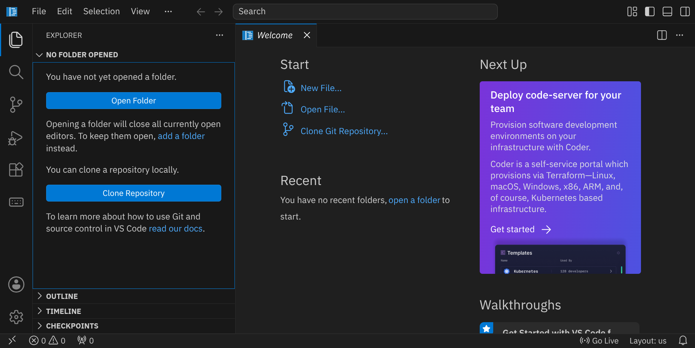
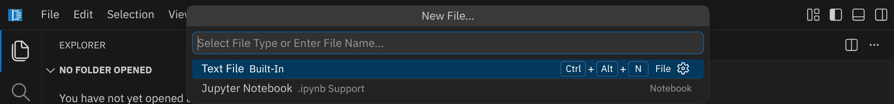
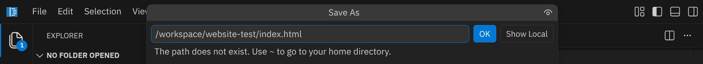
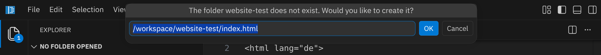
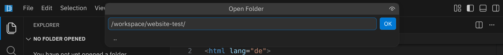
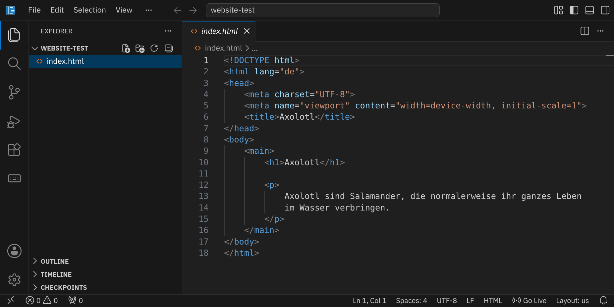
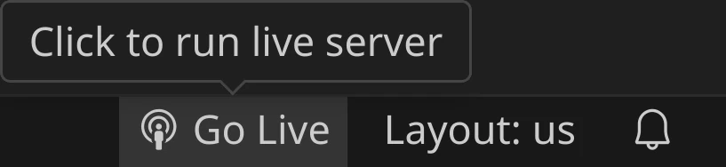
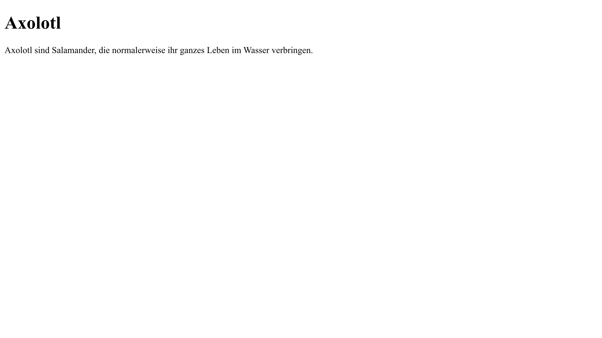
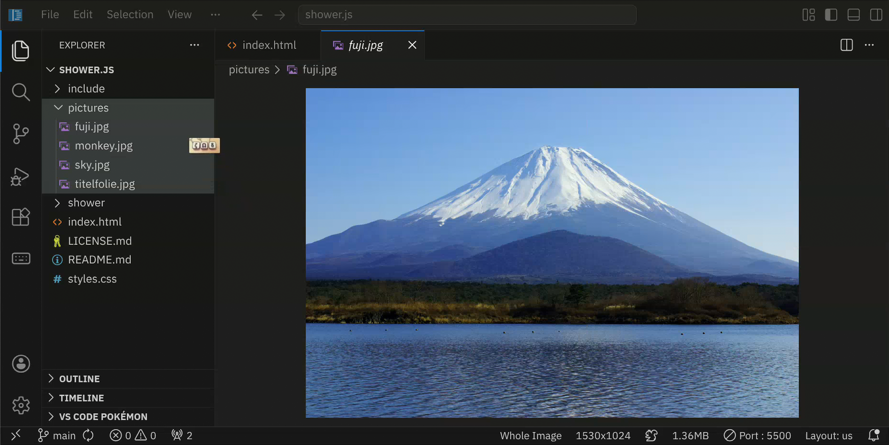
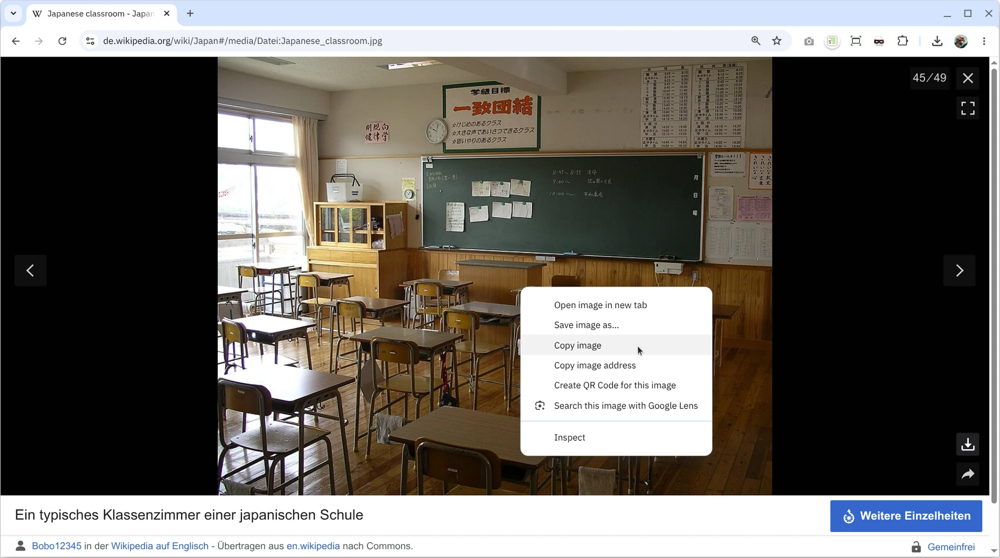

<div class='meta'>
image: html-css-logo.png
</div>

<div
    class="autotoc-secondary-trigger"
    data-title="Auf dieser Seite"
    data-levels="h2,h3">
</div>

# Statische Webseiten mit HTML & CSS

<p class='abstract'>
Baue eine kleine Webseite über etwas, das du magst. Du lernst dabei, wie HTML den Inhalt einer Webseite beschreibt und wie du mit CSS Farben, Abstände und das Layout gestaltest. Am Ende funktioniert deine Seite auch auf kleinen Bildschirmen und du kannst sie veröffentlichen.
</p>

In diesem Tutorial bauen wir als Beispiel eine kleine Seite über **Axolotl**. Du musst aber keine Axolotl-Seite bauen: Sobald deine erste Seite läuft, kannst du Überschrift, Texte, Bild und Farben durch dein eigenes Thema ersetzen. Nimm etwas, das dich interessiert – zum Beispiel ein Spiel, einen Film, ein Tier, einen Sport, eine Band oder einen Ort.

## Projekt anlegen

Stelle zuerst sicher, dass du keinen Ordner geöffnet hast. Um sicherzugehen, drücke einfach den Shortcut für »Ordner schließen«: <kbd>Strg</kbd><kbd>K</kbd> und dann <kbd>F</kbd>. Dein Workspace sollte jetzt ungefähr so aussehen:



### HTML-Datei anlegen

Klicke auf »New File« und wähle als Dateityp »Text File« oder bestätige einfach mit <kbd>Enter</kbd>.



Schreibe nun diesen Code in die neue Datei:

```html
<!DOCTYPE html>
<html lang="de">
<head>
    <meta charset="UTF-8">
    <meta name="viewport" content="width=device-width, initial-scale=1">
    <title>Axolotl</title>
</head>
<body>
    <main>
        <h1>Axolotl</h1>

        <p>
            Axolotl sind Salamander, die normalerweise ihr ganzes Leben
            im Wasser verbringen.
        </p>
    </main>
</body>
</html>
```

Drücke <kbd>Strg</kbd><kbd>S</kbd>, um die Datei zu speichern. Gib als Dateinamen `website-test/index.html` ein. Der vollständige Pfad lautet dann `/workspace/website-test/index.html`.



Da das Unterverzeichnis `website-test` noch nicht existiert, wirst du gefragt, ob es erstellt werden soll. Bestätige mit <kbd>Enter</kbd>.



Öffne jetzt dieses Verzeichnis. Wähle dazu im Menü »File« / »Open Folder…« oder drücke <kbd>Strg</kbd><kbd>K</kbd> und dann <kbd>Strg</kbd><kbd>O</kbd>. Wähle den Ordner `website-test` aus:



Nachdem das Verzeichnis geöffnet wurde, siehst du links im Explorer deine Datei `index.html`. Klicke darauf, um sie wieder zu öffnen.



### Vorschau starten



Unten rechts im Fenster findest du »Go Live«. Klicke darauf. In einem neuen Browsertab öffnet sich deine Webseite.

Du solltest jetzt schon die Überschrift »Axolotl« und einen kurzen Text sehen. Mehr ist noch nicht passiert – aber du hast gerade deine erste eigene HTML-Seite im Browser geöffnet:

<div style='clear: both;'></div>



<div class='hint'>
Tipp: Ziehe den Workspace und die Vorschau nebeneinander. Dann kannst du in <code>index.html</code> etwas ändern, mit <kbd>Strg</kbd><kbd>S</kbd> speichern und sofort sehen, was im Browser passiert.
</div>

<div class='hint melting'>
Falls sich die Vorschau einmal nicht automatisch aktualisiert, lade sie mit <kbd>Strg</kbd><kbd>R</kbd> oder <kbd>F5</kbd> neu.
</div>

## Inhalt mit HTML

HTML steht für **Hypertext Markup Language**. HTML beschreibt nicht in erster Linie, wie eine Webseite aussieht, sondern **was auf der Seite steht und welche Bedeutung die einzelnen Teile haben**. Schau noch einmal auf den Quelltext: Fast alles darin steht zwischen sogenannten Tags:

```html
<h1>Axolotl</h1>
```

`<h1>` beginnt eine große Überschrift und `</h1>` beendet sie. Beim schließenden Tag steht zusätzlich ein `/` vor dem Namen. Ein Absatz funktioniert nach demselben Prinzip:

```html
<p>Ein kurzer Text.</p>
```

Die Tags sind ineinander verschachtelt. Alles, was im Browser sichtbar auf der Seite steht, befindet sich in unserem Beispiel im `<body>`-Tag. Der `<head>` enthält dagegen Informationen **über** die Seite, zum Beispiel den Titel und die Zeichenkodierung.

<div class='hint think'>
Browser sind erstaunlich tolerant und versuchen auch fehlerhaftes HTML noch darzustellen. Dadurch kann ein fehlendes oder falsch gesetztes Tag aber an einer ganz anderen Stelle zu einem überraschenden Ergebnis führen. Wenn etwas merkwürdig aussieht, prüfe zuerst, ob deine Tags richtig geöffnet und geschlossen sind.
</div>

### Dein eigenes Thema

Bevor wir weitermachen, ändere den Inhalt. Wenn du keine Axolotl-Seite bauen möchtest, ersetze jetzt:

- den Text im `<title>`-Tag,
- die Überschrift im `<h1>`-Tag,
- und den ersten Absatz.

Speichere die Datei und schau dir die Änderung in der Vorschau an.

<div class='hint task'>
Such dir spätestens jetzt ein eigenes Thema für deine Seite aus. Du kannst die folgenden Beispiele weiter mit Axolotl ausprobieren und den Inhalt später ersetzen – oder du schreibst ab jetzt direkt über dein eigenes Thema.
</div>

### Eine Liste hinzufügen

Auf unserer Beispielseite wollen wir drei Dinge sammeln, die an Axolotl interessant sind. Füge unter dem ersten Absatz Folgendes ein:

```html
<h2>Was ich spannend finde</h2>

<ul>
    <li>Sie behalten auch als erwachsene Tiere ihre äußeren Kiemen.</li>
    <li>Sie können verlorene Gliedmaßen regenerieren.</li>
    <li>In freier Wildbahn kommen sie nur im Gebiet von Xochimilco vor.</li>
</ul>
```

<div class='hint'>
<p>
Wenn du den Code kopierst und einfügst, kann es passieren, dass die Einrückung danach etwas durcheinander aussieht. Für den Browser sind die Leerzeichen am Zeilenanfang zwar nicht wichtig, für uns Menschen aber schon: Durch die Einrückung kannst du viel leichter erkennen, welche Tags ineinander verschachtelt sind.
</p>

<p>
Du kannst mehrere Zeilen markieren und mit <kbd>Tab</kbd> gemeinsam einrücken bzw. mit <kbd>Shift</kbd>+<kbd>Tab</kbd> wieder nach links verschieben. Wenn du mit solchen Tastenkombinationen noch nicht sicher bist, öffne links über das Tastatur-Symbol das eingebaute Tastatur-Tutorial. Gerade beim Programmieren lohnt sich das sehr.
</p>

<p>
VS Code kann die Einrückung auch automatisch aufräumen: Klicke mit der rechten Maustaste in die Datei und wähle »Format Document«. Das ist besonders praktisch, nachdem du einen größeren Codeblock eingefügt hast.
</p>
</div>

`<h2>` ist eine Überschrift der zweiten Ebene. Mit `<ul>` beginnt eine Liste mit Stichpunkten. Jeder einzelne Listenpunkt steht in einem `<li>`-Tag – `li` steht für »list item«.

Wenn du eine nummerierte Liste brauchst, kannst du statt `<ul>` einfach `<ol>` verwenden. Dann setzt der Browser die Nummern automatisch davor.

<div class='hint task'>
Schreibe drei eigene Punkte über dein Thema. Es ist deine Seite – die Beispieltexte sind nur Platzhalter.
</div>

### Einen Link einfügen

Das **H** in HTML steht für **Hypertext**. Eine der wichtigsten Ideen des World Wide Web ist, dass Dokumente miteinander verlinkt werden können.

Füge unter der Liste einen Link ein:

```html
<p>
    <a href="https://de.wikipedia.org/wiki/Axolotl">Mehr über Axolotl erfahren</a>
</p>
```

Der Tag `<a>` macht einen Text anklickbar. Im Attribut `href` steht die Adresse, zu der der Link führt. Bei deinem eigenen Thema kannst du natürlich auf eine andere Seite verlinken.

### Ein Bild einfügen

Ein Bild wird mit dem Tag `` eingefügt. Für den ersten Versuch verwenden wir ein frei lizenziertes Axolotl-Foto von Wikimedia Commons, damit du noch keine Bilddatei in den Workspace übertragen musst.

Füge das Bild **vor** der Überschrift ein:

```html

```

Beim ``-Tag gibt es zwei besonders wichtige Attribute:

- `src` gibt an, wo die Bilddatei liegt.
- `alt` beschreibt kurz, was das Bild zusätzlich zum übrigen Text vermittelt.

Anders als `<p>` oder `<h1>` enthält `` keinen Text und braucht deshalb auch kein schließendes `</img>`.

Das Foto stammt von **Nasreddine Nas'h** und steht auf Wikimedia Commons unter der Lizenz **CC BY-SA 4.0**. Füge außerdem am Ende deines `<main>`-Bereichs einen Bildnachweis ein:

```html
<p class="credit">
    Foto:
    <a href="https://commons.wikimedia.org/wiki/File:Ambystoma_mexicanum_photo.jpg">
        Nasreddine Nas'h / Wikimedia Commons
    </a>,
    <a href="https://creativecommons.org/licenses/by-sa/4.0/">CC BY-SA 4.0</a>
</p>
```

Wikimedia Commons erlaubt das direkte Einbinden seiner Bilder, also sogenanntes **Hotlinking**. Die Lizenzbedingungen gelten trotzdem. Für eine fertige eigene Webseite ist es meist robuster, die Bilddatei selbst im Projekt zu haben: Dann verschwindet sie nicht, wenn sich die Adresse auf einem fremden Server ändert.

<div class='hint think'>
Nicht jedes Bild, das du im Internet findest, darfst du einfach für deine Webseite verwenden. Bei Wikimedia Commons findest du viele Bilder mit freien Lizenzen. Schau auf der Dateiseite nach, wer das Bild gemacht hat und unter welcher Lizenz es steht.
</div>

### Was gehört in den Alt-Text?

Der Alt-Text ist für Menschen wichtig, die das Bild nicht sehen können und zum Beispiel einen Screenreader verwenden. Er sollte kurz beschreiben, welche **zusätzliche Information** das Bild vermittelt. Für unser Foto passt zum Beispiel:

```html
alt="Ein hell gefärbter Axolotl in einem Aquarium"
```

Ein schlechter Alt-Text wäre:

```html
alt="Bild"
```

Wenn ein Bild nur Dekoration ist und keinerlei zusätzliche Information enthält, kann ein leerer Alt-Text richtig sein:

```html
alt=""
```

<div class='hint'>
Schreibe nicht automatisch »Bild von …« oder »Foto von …« in den Alt-Text. Ein Screenreader weiß bereits, dass es sich um ein Bild handelt. Beschreibe lieber knapp den Inhalt, der für die Seite wichtig ist.
</div>

## Ein eigenes Bild verwenden

Bis jetzt kommt das Axolotl-Foto direkt von Wikimedia Commons. Spannender wird deine Webseite natürlich mit einem eigenen Bild. Das ist im browserbasierten Workspace etwas ungewohnt: Die Datei liegt zunächst auf **deinem Computer oder im Browser**, dein Projekt liegt aber im **Workspace**. Die Bilddatei muss also erst in den Explorer von VS Code gelangen.

Verwende für Bilder am besten einfache Dateinamen mit kleinen Buchstaben, ohne Leerzeichen und möglichst ohne Umlaute oder Sonderzeichen. Gute Namen sind zum Beispiel `axolotl.jpg`, `mein-spiel.webp` oder `berlin.png`.

### Möglichkeit 1: Eine Datei vom Computer hochladen

Wenn du das Bild bereits auf deinem Computer gespeichert hast, kannst du es einfach aus deinem Dateimanager in den Explorer von VS Code ziehen. Lege es dort **neben `index.html`** ab.



Anschließend sollte die Datei links im Explorer auftauchen. Wenn du auf sie klickst, zeigt VS Code eine Vorschau an.

### Möglichkeit 2: Ein Bild aus dem Browser kopieren

Bei vielen Bildern im Browser kannst du mit der rechten Maustaste »Bild kopieren« oder »Copy Image« auswählen:



Wechsle danach zum Workspace. Klicke im Explorer auf `index.html`, damit VS Code weiß, in welchem Ordner die neue Datei landen soll, und drücke <kbd>Strg</kbd><kbd>V</kbd>.

Je nach Browser musst du das Einfügen noch bestätigen. Danach erscheint eine neue Bilddatei im selben Ordner wie `index.html`. Sie hat häufig einen Namen wie `image.png`.

Benenne die Datei in einen sinnvollen Namen um. Achte darauf, dass die Dateiendung wie `.png`, `.jpg` oder `.webp` erhalten bleibt.

<div class='hint think'>
Wenn du ein fremdes Bild aus dem Internet kopierst, prüfe trotzdem vorher, ob du es verwenden darfst. Durch das Kopieren in deinen Workspace ändert sich die Lizenz des Bildes nicht.
</div>

### Von der URL zum Dateinamen

Sobald die Bilddatei neben `index.html` liegt, brauchst du nicht mehr die lange Internetadresse. Angenommen, deine Datei heißt `mein-bild.jpg`. Dann änderst du:

```html

```

zu:

```html

```

`mein-bild.jpg` ist ein **relativer Pfad**. Der Browser sucht die Datei relativ zu `index.html`. Da beide Dateien im selben Ordner liegen, reicht der Dateiname.

Wenn dein Bild nicht erscheint, prüfe zuerst ganz genau:

- Stimmt der Dateiname einschließlich Groß- und Kleinschreibung?
- Stimmt die Dateiendung?
- Liegt die Bilddatei wirklich neben `index.html`?
- Steht im `src`-Attribut exakt derselbe Dateiname?

<div class='hint task'>
Wenn du ein eigenes Bild hast, ersetze jetzt das Axolotl-Foto. Passe auch den Alt-Text an. Wenn du das Bild selbst fotografiert oder gezeichnet hast, brauchst du den Bildnachweis aus unserem Beispiel natürlich nicht mehr.
</div>

## Aussehen mit CSS

Bis jetzt haben wir mit HTML beschrieben, **was** auf der Seite steht. Der Browser entscheidet noch weitgehend selbst, wie Überschriften, Listen und Links aussehen. Dafür gibt es CSS: **Cascading Style Sheets**. Mit CSS legst du Farben, Schriftarten, Größen, Abstände und das Layout fest. Wir schreiben das CSS in eine eigene Datei, damit Inhalt und Gestaltung getrennt bleiben.

### CSS-Datei erstellen

Erstelle im Explorer neben `index.html` eine neue Datei namens `styles.css`.

Damit der Browser diese Datei verwendet, fügst du im `<head>` von `index.html` diese Zeile ein:

```html
<link rel="stylesheet" href="styles.css">
```

Der `<head>` sollte jetzt so aussehen:

```html
<head>
    <meta charset="UTF-8">
    <meta name="viewport" content="width=device-width, initial-scale=1">
    <title>Axolotl</title>
    <link rel="stylesheet" href="styles.css">
</head>
```

Schreibe nun in `styles.css`:

```css
body {
    margin: 0;
    background: #102522;
    color: #f4f1e8;
    font-family: system-ui, sans-serif;
}

main {
    max-width: 900px;
    margin: 0 auto;
    padding: 2rem;
}

a {
    color: #7fe0cb;
}

img {
    display: block;
    max-width: 100%;
    border-radius: 1rem;
}

.credit {
    font-size: 0.8rem;
    opacity: 0.75;
}
```

Speichere die Datei. Die Änderung sollte sofort deutlich zu sehen sein: dunkler Hintergrund, helle Schrift, eine andere Linkfarbe und ein Bild mit abgerundeten Ecken.

### Wie eine CSS-Regel funktioniert

Schau dir diese Regel an:

```css
img {
    border-radius: 1rem;
}
```

Vor den geschweiften Klammern steht der **Selektor** `img`. Er sagt, welche Elemente gemeint sind. Zwischen `{` und `}` stehen die Eigenschaften, die für diese Elemente gelten sollen. In diesem Fall bekommen also alle ``-Elemente abgerundete Ecken.

Bei dieser Regel:

```css
.credit {
    font-size: 0.8rem;
}
```

beginnt der Selektor mit einem Punkt. Damit wird keine HTML-Tag-Art ausgewählt, sondern eine **Klasse**. Unser Bildnachweis hat diese Klasse hier bekommen:

```html
<p class="credit">
```

Klassen sind praktisch, wenn du einzelne Elemente gezielt gestalten möchtest, ohne gleich alle Elemente derselben Art zu verändern.

<div class='hint'>
Neben Farbangaben wie <code>#102522</code> zeigt VS Code ein kleines Farbfeld an. Klicke darauf, wenn du eine andere Farbe ausprobieren möchtest. Du musst die Hexadezimalzahlen nicht auswendig lernen.
</div>

## Layout mit Flexbox

Unsere Seite sieht jetzt schon absichtlicher gestaltet aus, aber Bild und Text stehen immer noch untereinander. Auf einem breiten Bildschirm wäre es schön, wenn das Bild links und der Text rechts stehen würden. Dafür verwenden wir **Flexbox**.

Zuerst müssen Bild und Text zwei getrennte Bereiche innerhalb von `<main>` sein. Packe deshalb den gesamten Text – von `<h1>` bis zum Bildnachweis – in ein `<section>`-Element. Der relevante Teil deiner HTML-Datei sieht dann ungefähr so aus:

```html
<main>
    

    <section>
        <h1>Axolotl</h1>

        <p>
            Axolotl sind Salamander, die normalerweise ihr ganzes Leben
            im Wasser verbringen.
        </p>

        <h2>Was ich spannend finde</h2>

        <ul>
            <li>Sie behalten auch als erwachsene Tiere ihre äußeren Kiemen.</li>
            <li>Sie können verlorene Gliedmaßen regenerieren.</li>
            <li>In freier Wildbahn kommen sie nur im Gebiet von Xochimilco vor.</li>
        </ul>

        <p>
            <a href="https://de.wikipedia.org/wiki/Axolotl">Mehr über Axolotl erfahren</a>
        </p>

        <p class="credit">
            Foto:
            <a href="https://commons.wikimedia.org/wiki/File:Ambystoma_mexicanum_photo.jpg">
                Nasreddine Nas'h / Wikimedia Commons
            </a>,
            <a href="https://creativecommons.org/licenses/by-sa/4.0/">CC BY-SA 4.0</a>
        </p>
    </section>
</main>
```

Wenn du dein eigenes Thema und Bild verwendest, behältst du natürlich **deine** Texte und deinen Bildnamen. Es geht nur darum, dass das Bild und der Text zwei direkte Kinder von `<main>` werden.

Ergänze nun die vorhandene `main`-Regel in `styles.css`:

```css
main {
    max-width: 900px;
    margin: 0 auto;
    padding: 2rem;

    display: flex;
    gap: 2rem;
    align-items: center;
}
```

Und füge darunter hinzu:

```css
main > img {
    width: 45%;
}

section {
    flex: 1;
}
```

Speichere die Datei. Auf einem breiten Fenster sollten Bild und Text jetzt nebeneinander stehen.

Die wichtigsten neuen Eigenschaften sind:

- `display: flex` ordnet die direkten Kinder von `<main>` als flexible Elemente an.
- `gap: 2rem` lässt Platz zwischen Bild und Text.
- `align-items: center` richtet beide Bereiche vertikal zueinander aus.
- `width: 45%` gibt dem Bild knapp die Hälfte der Breite.
- `flex: 1` erlaubt dem Textbereich, den übrigen Platz einzunehmen.

<div class='hint task'>
Probiere bei <code>gap</code> und <code>width</code> andere Werte aus. Was passiert bei <code>width: 30%</code> oder <code>width: 60%</code>?
</div>

## Auf kleinen Bildschirmen

Ziehe dein Browserfenster jetzt schmaler. Irgendwann wird die Seite unangenehm, weil Bild und Text sich zu wenig Platz teilen. Webseiten werden auf sehr unterschiedlichen Geräten geöffnet, deshalb sollte sich das Layout an die verfügbare Breite anpassen.

Die Zeile

```html
<meta name="viewport" content="width=device-width, initial-scale=1">
```

steht schon seit dem Anfang in unserem `<head>`. Sie sagt mobilen Browsern, dass die Seite in der tatsächlichen Gerätebreite dargestellt werden soll.

Jetzt ergänzen wir am Ende von `styles.css` eine **Media Query**:

```css
@media (max-width: 700px) {
    main {
        flex-direction: column;
        padding: 1rem;
    }

    main > img {
        width: 100%;
    }
}
```

Die Regeln innerhalb der Media Query gelten nur, wenn das Browserfenster höchstens 700 Pixel breit ist.

`flex-direction: column` sorgt dann dafür, dass Bild und Text wieder untereinander stehen. Das Bild bekommt mit `width: 100%` die gesamte verfügbare Breite.

Mach dein Browserfenster langsam breiter und schmaler. Du solltest genau sehen können, wann das Layout zwischen den beiden Varianten wechselt.

<div class='hint task'>
Ändere testweise die Grenze von <code>700px</code> auf <code>500px</code> oder <code>900px</code>. Welche Einstellung passt zu deiner Seite am besten?
</div>

## Mach die Seite zu deiner

Der technische Teil ist geschafft. Jetzt sollte die Seite nicht mehr wie unser Beispiel aussehen, sondern wirklich zu deinem Thema passen. Verändere dafür mindestens einige dieser Dinge:

- eigenes Thema und eigene Texte
- eigenes Bild und passender Alt-Text
- Überschrift und Seitentitel
- Hintergrund- und Textfarbe
- Linkfarbe
- Breite des Bildes
- Abstand zwischen Bild und Text
- Stärke der abgerundeten Ecken

Du kannst zum Beispiel noch diese CSS-Regel ausprobieren:

```css
h1 {
    font-size: 3rem;
    margin-top: 0;
}
```

Oder Links verändern, wenn der Mauszeiger darüber steht:

```css
a:hover {
    text-decoration: none;
}
```

<div class='hint think'>
Wenn du beim Ausprobieren etwas kaputtmachst, ist das kein Problem. Mit <kbd>Strg</kbd><kbd>Z</kbd> kannst du Änderungen rückgängig machen. Am meisten lernst du hier, wenn du Werte veränderst und beobachtest, was passiert.
</div>

## Deine Seite veröffentlichen

Bis jetzt läuft die Seite nur über »Go Live« in deinem eigenen Workspace. Eine statische Webseite besteht aber nur aus Dateien wie HTML, CSS und Bildern und lässt sich deshalb sehr einfach auf einen Webserver kopieren. Im Workspace kannst du deine Seite kostenlos unter einer Hackschule-Subdomain veröffentlichen; wie das funktioniert, steht in der [Anleitung zum eigenen Webspace](/custom-subdomain).

Achte beim Veröffentlichen darauf, dass **alle Dateien deines Projekts** mitkommen, die deine Seite benötigt – also zum Beispiel:

```text
index.html
styles.css
mein-bild.jpg
```

Wenn du weiterhin das Wikimedia-Bild per URL einbindest, liegt diese Datei natürlich nicht in deinem Projekt. Dann braucht die veröffentlichte Seite eine Internetverbindung zu Wikimedia, um das Bild zu laden.

## Weiter ausprobieren

Deine erste Webseite braucht nicht mehr als HTML und CSS. Genau das ist eine Stärke des Webs: Eine Datei `index.html` und eine Datei `styles.css` reichen schon für eine richtige Webseite. Wenn dein Projekt größer wird, gibt es aber Werkzeuge, die dir Arbeit abnehmen können. Einige davon sind im Workspace bereits installiert oder lassen sich direkt dort verwenden.

### Mehr HTML und CSS

Bevor du ein neues Werkzeug ausprobierst, kannst du deine Seite auch einfach mit dem weiterbauen, was du schon kennst:

- Erstelle eine zweite Datei `zweite-seite.html` und verlinke sie mit `<a href="zweite-seite.html">...</a>`.
- Probiere weitere HTML-Tags aus, zum Beispiel Tabellen, Zitate oder Formulare.
- Informiere dich über **CSS Grid**, wenn du mehrere Bereiche in Zeilen und Spalten anordnen möchtest.
- Lade eine eigene Schriftart herunter und binde sie lokal ein.
- Probiere weitere Selektoren, Farben, Abstände und Layouts aus.

### CSS-Frameworks

Du musst nicht jede CSS-Regel selbst schreiben. **CSS-Frameworks** stellen fertige Regeln und Bausteine für typische Webseiten bereit, zum Beispiel für Layouts, Buttons, Navigationen oder Formulare. Bekannte Frameworks sind zum Beispiel:

- [Bootstrap](https://getbootstrap.com/)
- [Bulma](https://bulma.io/)
- [Tailwind CSS](https://tailwindcss.com/)

Weil du Farben, Abstände und ein responsives Layout vorher selbst mit CSS gebaut hast, kannst du jetzt auch besser einschätzen, was ein solches Framework für dich übernimmt.

<div class='hint think'>
Ein Framework ist kein notwendiger Bestandteil einer Webseite. Verwende es, wenn es dir Arbeit abnimmt – nicht nur, weil moderne Webseiten angeblich eines brauchen.
</div>

Viele Frameworks lassen sich entweder direkt über ein `<link>`-Tag einbinden oder mit einem Paketmanager wie `npm` in ein Projekt installieren.

### Pakete mit npm installieren

Im Workspace sind **Node.js** und der Paketmanager **npm** bereits installiert. Öffne ein Terminal mit <kbd>Strg</kbd><kbd>J</kbd> und probiere aus:

```bash
node --version
npm --version
```

Mit npm kannst du JavaScript-Bibliotheken, CSS-Frameworks und Entwicklungswerkzeuge aus dem Internet in ein Projekt holen. Wenn du in einem neuen Projekt

```bash
npm init -y
```

aufrufst, legt npm eine Datei namens `package.json` an. Darin kann ein Projekt festhalten, welche Pakete es benötigt und welche Befehle dazugehören.

<div class='hint'>
Für die Webseite aus diesem Tutorial brauchst du npm nicht. Es ist nur der nächste Schritt, wenn du mit größeren Webprojekten experimentieren möchtest.
</div>

Viele moderne Werkzeuge bauen auf diesem Prinzip auf. Im [Svelte-Tutorial](/svelte) verwendest du npm, um aus HTML, CSS und JavaScript eine interaktive Webanwendung zu bauen.

### Größere statische Seiten mit Hugo

Eine einzelne HTML-Seite lässt sich gut von Hand schreiben. Stell dir aber eine Webseite mit 50 Artikeln vor, auf denen immer dieselbe Navigation, derselbe Kopfbereich und derselbe Footer stehen sollen. Dafür gibt es **Static Site Generators**: Sie erzeugen aus Vorlagen und Inhalten automatisch fertige HTML-Dateien.

Im Workspace ist [Hugo](https://gohugo.io/) bereits installiert. Im Terminal kannst du das überprüfen:

```bash
hugo version
```

Ein neues Hugo-Projekt kannst du zum Beispiel so anlegen:

```bash
hugo new site meine-seite
```

Hugo legt dann die Grundstruktur einer neuen Webseite an. Inhalte können zum Beispiel in Markdown geschrieben werden, während Vorlagen bestimmen, wie die fertigen HTML-Seiten aussehen. Auf diese Weise musst du wiederkehrende Teile nicht in jeder einzelnen HTML-Datei von Hand pflegen.

<div class='hint think'>
Hugo ersetzt HTML und CSS nicht. Am Ende erzeugt Hugo genau daraus wieder statische Webseiten. Es hilft dir vor allem dabei, viele Seiten und wiederkehrende Bestandteile zu organisieren.
</div>

Wenn dich das interessiert, kannst du nach diesem Tutorial ein neues Verzeichnis anlegen und mit `hugo new site` experimentieren, ohne deine Axolotl-Seite anzutasten.

### Und JavaScript?

Mit HTML und CSS kann eine Webseite schon sehr viel darstellen und gestalten. Wenn sie aber auf Eingaben reagieren, etwas berechnen oder ihren Inhalt während der Benutzung verändern soll, kommt meistens **JavaScript** dazu. Dafür brauchst du nicht sofort ein Framework: Eine kleine JavaScript-Datei lässt sich genauso direkt in eine Webseite einbinden wie unsere CSS-Datei. Wenn du später sehen möchtest, wie ein modernes Webprojekt mit Komponenten, Zuständen und Entwicklungswerkzeugen funktioniert, ist das [Svelte-Tutorial](/svelte) ein guter nächster Schritt.

Auch bei größeren Projekten bleibt die Grundlage dieselbe, die du in diesem Tutorial benutzt hast:

- **HTML** beschreibt Inhalt und Struktur.
- **CSS** beschreibt Aussehen und Layout.
- **JavaScript** kann Verhalten und Interaktivität hinzufügen.
- Werkzeuge wie **npm**, **CSS-Frameworks** oder **Hugo** helfen dir bei größeren Projekten – sie sind aber keine Voraussetzung dafür, eine Webseite zu bauen.