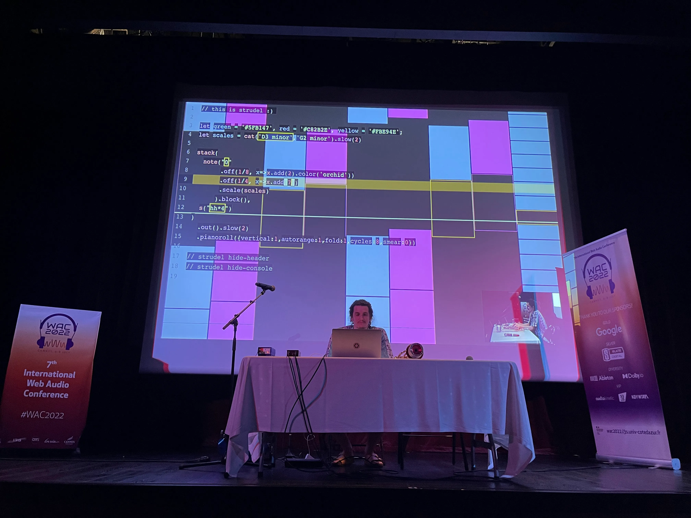

    image: strudel-logo.png

# Strudel (2021)

    
    

        Felix Roos & Team

Strudel, entwickelt von einem Team um Felix Roos und erstmals 2021 veröffentlicht, ist eine domänenspezifische Programmiersprache für Live-Coding und algorithmische Musik. Sie überträgt das Konzept von TidalCycles in die JavaScript-Welt und ermöglicht es, Musik in Echtzeit zu programmieren, zu manipulieren und direkt im Browser auszuführen.

Bekannte Anwendungen von Strudel sind Live-Coding Performances, algorithmische Musik und Musikpädagogik. Besonders relevant ist Strudel, da keine Installation erforderlich ist und die Sprache kontinuierlich um neue Synthesizer, Effekte und Pattern-Funktionen erweitert wird.

**Was ist Live-Coding?** Live-Coding bedeutet, dass du Musik schreibst, während sie gleichzeitig läuft. Du tippst Code und hörst sofort das Ergebnis – wie ein Instrument, das man mit der Tastatur spielt. Strudel läuft komplett im Browser, du musst also nichts installieren oder einrichten.

---

## Hello, beats!

Strudel-Programme werden direkt im Browser geschrieben und ausgeführt. Du brauchst keine Entwicklungsumgebung zu installieren – öffne einfach das Editor-Fenster und starte sofort.

### Deinen ersten Beat programmieren

Schreibe im Editor-Fenster:

<pre><code class="language-javascript">
s("bd sd")
</code></pre>

`s(...)` steht für „sound" – du sagst Strudel, welche Klänge es abspielen soll. `"bd sd"` sind zwei Drum-Klänge: **bd** steht für Bass Drum (der tiefe Grundschlag) und **sd** für Snare Drum (der hellere Gegenschlag). Strudel wiederholt diese Sequenz automatisch in einer Endlosschleife.

Klicke auf den Play-Button oder drücke Strg + Enter, um den Code auszuführen.  
Um den Beat zu stoppen, drücke Strg + .  

### Erste Sounds ausprobieren

<pre><code class="language-javascript">
sound("casio")
</code></pre>

Strudel hat viele eingebaute Klangvorlagen, sogenannte Samples. `casio` klingt wie ein altes Casio-Keyboard aus den 80ern. Du kannst einfach andere Wörter ausprobieren – wenn Strudel den Sound kennt, spielt er ihn ab. Probiere zum Beispiel `metal`, `piano` oder `jazz`.

Ändere `casio` in `metal` und drücke wieder Strg + Enter.  

Samples wechseln:

<pre><code class="language-javascript">
sound("casio:1")
</code></pre>

Viele Sounds gibt es in mehreren Varianten. Mit `:0`, `:1`, `:2` usw. wählst du eine bestimmte Version aus. Probiere verschiedene Zahlen, um andere Varianten desselben Klangs zu hören.

### Drum Sounds

<pre><code class="language-javascript">
sound("bd hh sd oh")
</code></pre>

Strudel verwendet kurze Kürzel für typische Schlagzeug-Elemente:

- bd = Bass Drum – der tiefe Grundschlag  
- sd = Snare Drum – der hellere Gegenschlag  
- hh = HiHat – das kurze, metallische Zischen  
- oh = Open HiHat – wie hh, aber offen und länger ausklingend  
- rim = Rimshot – Schlag auf den Rand der Snare  
- lt = Low Tom – tiefer Trommelklang  
- mt = Middle Tom – mittlerer Trommelklang  
- ht = High Tom – hoher Trommelklang  
- rd = Ride Cymbal – metallisches Becken für gleichmäßige Rhythmen  
- cr = Crash Cymbal – das laute Akzent-Becken

### Sequenzen / Patterns

<pre><code class="language-javascript">
sound("bd hh sd hh")
sound("<bd bd hh bd rim bd hh bd>")
sound("<bd bd hh bd rim bd hh bd>*8")
setcpm(90/4)
sound("<bd hh rim hh>*8")
</code></pre>

Leerzeichen zwischen Sounds teilen einen Takt gleichmäßig auf – 4 Sounds ergeben 4 gleichlange Schritte. Spitze Klammern `< >` bedeuten: Strudel wählt bei jedem Takt abwechselnd einen anderen Klang aus der Liste aus. Der Stern `*8` bedeutet, das Pattern 8× schneller abzuspielen, also mehr Schläge pro Takt. `setcpm(90/4)` setzt das Tempo – CPM steht für Cycles per Minute, und `90/4` entspricht einem typischen 90-BPM-Groove.

### Pausen, Untersequenzen und Parallel-Sequenzen

<pre><code class="language-javascript">
sound("bd hh - rim")
sound("bd [hh hh] rim [hh hh]")
sound("bd hh*2 sd hh*3")
sound("bd hh*16 sd hh*8")
sound("hh hh hh, bd casio")
sound("hh hh hh, bd bd, - casio")
sound("hh hh hh, bd [bd,casio]")
</code></pre>

Ein Bindestrich `-` steht für eine Pause – an dieser Stelle im Takt ist Stille. Eckige Klammern `[ ]` fassen mehrere Sounds zu einer Untersequenz zusammen, die in denselben Zeitslot gequetscht wird. Ein Komma `,` spielt zwei oder mehr Sequenzen gleichzeitig ab – so baust du mehrere Spuren übereinander.

---

# Erste Effekte

## Ein paar grundlegende Effekte

**low-pass filter**

<pre><code class="language-javascript">
note("<[c2 c3]*4 [bb1 bb2]*4 [f2 f3]*4 [eb2 eb3]*4>/2")
.sound("sawtooth").lpf(800)
</code></pre>

`lpf` steht für Low-Pass-Filter. Er lässt nur tiefe Frequenzen durch und schneidet hohe ab – niedrige Werte (z.B. 200) klingen dumpf und dunkel, hohe Werte (z.B. 5000) klingen hell und offen. Probiere verschiedene Zahlen aus, um den Unterschied zu hören.

**Filter automatisieren**

<pre><code class="language-javascript">
note("<[c2 c3]*4 [bb1 bb2]*4 [f2 f3]*4 [eb2 eb3]*4>/2")
.sound("sawtooth").lpf("200 1000")
</code></pre>

Statt eines festen Werts kannst du dem Filter ein Pattern übergeben. Hier wechselt der Filter zwischen 200 und 1000 – der Klang öffnet und schließt sich rhythmisch.

**Vokal-Sound**

<pre><code class="language-javascript">
note("<[c3,g3,e4] [bb2,f3,d4] [a2,f3,c4] [bb2,g3,eb4]>/2")
.sound("sawtooth").vowel("<a e i o>/2")
</code></pre>

Der `vowel`-Effekt formt den Klang so, als würde eine Stimme einen Vokal singen. Mit einem Pattern wie `<a e i o>` wechselt der Klang rhythmisch zwischen verschiedenen Vokalformanten.

**Gain (Lautstärke)**

<pre><code class="language-javascript">
stack(
  sound("hh*8").gain("[.25 1]*2"),
  sound("bd*2,~ sd:1")
)
</code></pre>

`gain` steuert die Lautstärke – 0 ist Stille, 1 ist volle Lautstärke. Mit einem Pattern wie `[.25 1]*2` erzeugst du einen rhythmischen Akzent, bei dem jede zweite Note lauter ist.

**Stack kombinieren**

<pre><code class="language-javascript">
stack(
  stack(
    sound("hh*8").gain("[.25 1]*2"),
    sound("bd*2,~ sd:1")
  ),
  note("<[c2 c3]*4 [bb1 bb2]*4 [f2 f3]*4 [eb2 eb3]*4>/2")
  .sound("sawtooth").lpf("200 1000"),
  note("<[c3,g3,e4] [bb2,f3,d4] [a2,f3,c4] [bb2,g3,eb4]>/2")
  .sound("sawtooth").vowel("<a e i o>/2")
)
</code></pre>

`stack(...)` spielt mehrere Patterns gleichzeitig ab – es ist das Herzstück, um vollständige Songs zusammenzubauen. Du kannst so viele Ebenen schichten wie du möchtest.

**ADSR-Hüllkurve**

<pre><code class="language-javascript">
note("<c3 bb2 f3 eb3>")
.sound("sawtooth").lpf(600)
.attack(.1)
.decay(.1)
.sustain(.25)
.release(.2)
</code></pre>

Die ADSR-Hüllkurve bestimmt, wie sich die Lautstärke eines Klangs über die Zeit verhält. **Attack** ist die Zeit, bis der Klang seine volle Lautstärke erreicht. **Decay** ist, wie schnell er danach abfällt. **Sustain** ist die Lautstärke, auf der er sich hält, solange der Ton gehalten wird. **Release** ist, wie lange er nach dem Loslassen noch ausklingt. Alle Werte sind in Sekunden angegeben.

**Delay**

<pre><code class="language-javascript">
stack(
  note("~ [<[d3,a3,f4]!2 [d3,bb3,g4]!2> ~]")
  .sound("gm_electric_guitar_muted"),
  sound("<bd rim>").bank("RolandTR707")
).delay(".5")
</code></pre>

`delay` erzeugt ein Echo – der Klang wird verzögert ein oder mehrere Male wiederholt. Der Wert bestimmt die Lautstärke des Echos: 0 = kein Echo, 1 = sehr starkes Echo. Werte um 0.3–0.5 klingen oft musikalisch interessant.

**Room / Reverb**

<pre><code class="language-javascript">
n("<4 [3@3 4] [<2 0> ~@16] ~>/2")
.scale("D4:minor").sound("gm_accordion:2")
.room(2)
</code></pre>

`room` simuliert einen Raumklang – als würde der Sound in einem Raum oder einer Halle gespielt. Kleine Werte (0.1–0.5) klingen wie ein kleines Zimmer, große Werte (1–4) wie eine große Halle oder Kathedrale.

**Panorama und Geschwindigkeit**

<pre><code class="language-javascript">
sound("numbers:1 numbers:2 numbers:3 numbers:4")
.pan("0 0.3 .6 1")
.slow(2)

sound("bd rim").speed("<1 2 -1 -2>")
sound("bd*2,~ rim").slow(2)
sound("[bd*2,~ rim]*<1 [2 4]>")
</code></pre>

`pan` verteilt Klänge im Stereo-Panorama: 0 = ganz links, 0.5 = Mitte, 1 = ganz rechts. `.slow(2)` verlangsamt das Pattern auf die halbe Geschwindigkeit. `speed` ändert die Abspielgeschwindigkeit eines Samples – negative Werte spielen das Sample rückwärts ab.

**Automation mit Signalen**

<pre><code class="language-javascript">
sound("hh*16").gain(sine)
sound("hh*8").lpf(saw.range(500, 2000))
note("<[c2 c3]*4 [bb1 bb2]*4 [f2 f3]*4 [eb2 eb3]*4>/2")
.sound("sawtooth")
.lpf(sine.range(100, 2000).slow(8))
</code></pre>

Statt fester Werte kannst du Signale wie `sine` oder `saw` verwenden, die sich kontinuierlich über die Zeit verändern. `sine` schwingt weich auf und ab wie eine Sinuswelle, `saw` steigt linear an und springt dann zurück. Mit `.range(min, max)` legst du fest, zwischen welchen Werten das Signal schwingen soll – so entstehen lebendige, sich bewegende Klänge ganz ohne manuelle Automation.

## Rückblick

| Effekt  | Beispiel                                                                                  |
| ------- | ---------------------------------------------------------------------------------------- |
| lpf     | <pre><code>note("c2 c3").sound("sawtooth").lpf("<400 2000>")</code></pre>                 |
| vowel   | <pre><code>note("c3 eb3 g3").sound("sawtooth").vowel("<a e i o>")</code></pre>           |
| gain    | <pre><code>sound("hh*8").gain("[.25 1]*2")</code></pre>                                   |
| delay   | <pre><code>sound("bd rim").delay(.5)</code></pre>                                        |
| room    | <pre><code>sound("bd rim").room(.5)</code></pre>                                         |
| pan     | <pre><code>sound("bd rim").pan("0 1")</code></pre>                                        |
| speed   | <pre><code>sound("bd rim").speed("<1 2 -1 -2>")</code></pre>                              |
| range   | <pre><code>sound("hh*16").lpf(saw.range(200,4000))</code></pre>                           |
