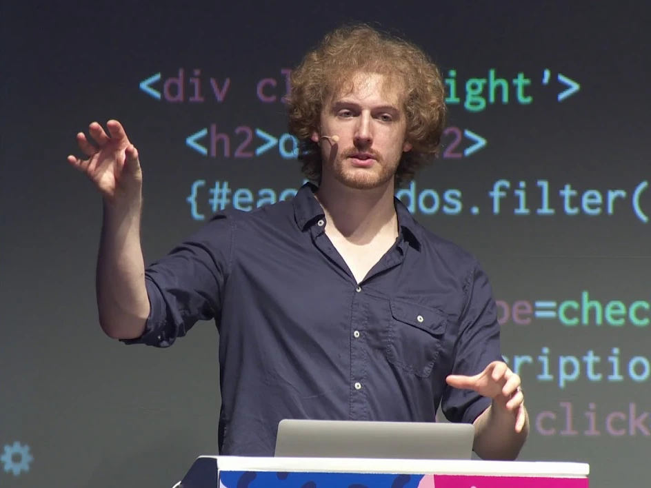
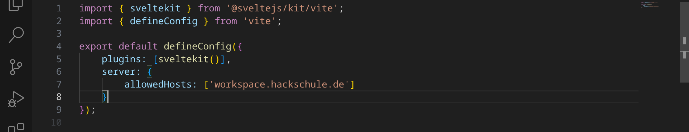
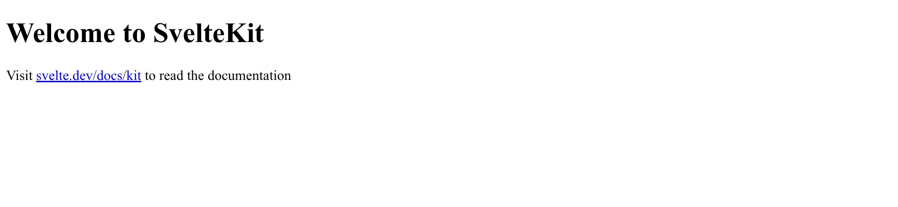

<div class='meta'>
image: svelte5.webp:0:80
</div>

# Frontend-Entwicklung mit Svelte

<div class='floatright' style='width: 18em;'>
    
    <p>Rich Harris</p>
</div>


<p class='abstract'>
In diesem Tutorial werden wir die Grundlagen von Svelte kennenlernen und eine einfache Anwendung erstellen. Svelte ist ein modernes Frontend-Framework, das es dir ermöglicht, interaktive Webseiten zu erstellen. Du kannst damit z. B. kleine Spiele oder Webanwendungen entwickeln. In diesem Tutorial werden wir einen »Rubik's Cube Timer« programmieren – also eine Stoppuhr, die die Zeit misst, die du für das Lösen eines Rubik's Cube benötigst.
</p>

<p class='hint'>
Bevor du dieses Tutorial beginnst, solltest du dich ein wenig mit HTML und CSS auskennen. Wenn du noch nie mit diesen Technologien gearbeitet hast, empfehlen wir dir, zuerst das <a href='/static-website'>Tutorial zu Statischen Webseiten</a> durchzuarbeiten.
</p>

### Was ist Svelte?

Svelte ist ein modernes Frontend-Framework. Es gab vorher schon viele andere Frontend-Frameworks, wie z. B. [React](https://react.dev/) (2013), [Vue](https://vuejs.org/) (2014) und [Angular](https://angular.dev/) (2016). Diese Frameworks haben alle ihre Vor- und Nachteile. [Svelte](https://svelte.dev/) ist ein relativ neues Framework, das 2016 von Rich Harris – einem Journalisten und Softwareentwickler – entwickelt wurde.

## Vorbereitung

Stelle zuerst sicher, dass du keinen Ordner geöffnet hast. Um sicherzugehen, drücke einfach den Shortcut für »Ordner schließen«: <span class='key'>Strg</span><span class='key'>K</span> und dann <span class='key'>F</span>. Dein Workspace sollte jetzt ungefähr so aussehen:


### Svelte-Erweiterung installieren

Klicke dazu auf das Erweiterungs-Symbol  in der Seitenleiste oder drücke <span class='key'>Strg</span><span class='key'>Shift</span><span class='key'>X</span>. Suche nach der Erweiterung »Svelte for VS Code« und installiere sie.

### Svelte-Projekt erstellen

Um ein neues Svelte-Projekt zu erstellen, öffne ein Terminal und gib folgenden Befehl ein:

```bash
npx sv create rubik-timer
```

Du wirst vermutlich gefragt, ob das `sv`-Paket installiert werden soll:


Bestätige mit <span class='key'>Enter</span>. Du wirst nun gefragt, welches Template du verwenden möchtest. Wähle das Standard-Template »SvelteKit minimal« aus, indem du <span class='key'>Enter</span> drückst:


Bei der nächsten Frage wäre die richtige Antwort »TypeScript«, aber da wir in diesem Tutorial kein TypeScript verwenden, sondern normales JavaScript, wähle hier bitte »No« aus:


Du wirst als nächstes gefragt, ob du schon ein paar Plugins installieren möchtest. Da wir keine Plugins benötigen, kannst du einfach <span class='key'>Enter</span> drücken:


Als letztes wirst du gefragt, welchen Paketmanager du verwenden möchtest. Wähle hier »npm« aus, indem du <span class='key'>Enter</span> drückst:


Daraufhin musst du noch ein paar Sekunden warten, bis alle Abhängigkeiten installiert sind und das Projekt erstellt wurde. Wenn du die Meldung »Project created« siehst, hat alles geklappt:


<div class='hint'>
Falls du von vorne beginnen möchtest, kannst du einfach das Verzeichnis <code>/workspace/rubik-timer</code> löschen und von vorn beginnen.
</div>

Öffne nun das Verzeichnis, indem du entweder im Menü »File« / »Open Folder…« auswählst oder einfach <span class='key'>Strg</span><span class='key'>K</span> und dann <span class='key'>Strg</span><span class='key'>O</span> drückst. Wähle den Ordner `rubik-timer` aus:


## Development-Server starten

Bevor wir den Entwicklungs-Server im Workspace starten können, müssen wir noch eine Kleinigkeit anpassen. Öffne die Datei `package.json` und ändere den Eintrag für `"dev"` von `"vite dev"` in `"vite dev --host --open"`.


Öffne nun die Datei `vite.config.js` und füge einen Eintrag `server` hinzu, um den Server für Anfragen aus deinem Workspace zu öffnen:



Du musst also den folgenden Eintrag hinzufügen:

```json
server: {
    allowedHosts: ['workspace.hackschule.de']
}
```

<div class='hint'>
Achte auf das Komma am Ende der Zeile darüber! Wenn du das Komma vergisst, wird die Datei nicht richtig interpretiert und du bekommst eine Fehlermeldung.
</div>

Anschließend kannst du den Entwicklungs-Server starten, indem du im Terminal folgenden Befehl eingibst:

```bash
npm run dev
```

Wenn alles geklappt hat, sollte sich deine Webseite automatisch in einem neuen Tab öffnen:



<div class='hint'>
Tipp: Ziehe deinen Workspace und die Vorschau nebeneinander, damit du beide Fenster gleichzeitig sehen kannst.
</div>

<div cass='hint'>
Wenn etwas nicht funktioniert, kannst du den Server jederzeit beenden, indem du im Terminal <span class='key'>Strg</span><span class='key'>C</span> drückst. Du kannst den Server dann wieder neu starten, indem du <code>npm run dev</code> eingibst.
</div>

## Webseite implementieren

Jetzt, wo wir alles eingerichtet haben, können wir mit dem Programmieren beginnen. Wir werden eine einfache Stoppuhr erstellen, die die Zeit misst, die du für das Lösen eines Rubikwürfels benötigst.

Du kennst dich bereits mit HTML und CSS aus, und jetzt werden wir auch ein wenig JavaScript verwenden, um die Webseite interaktiv zu machen. Bei Svelte werden alle drei Technologien in einer Datei kombiniert, die eine Komponente darstellt. Eine Komponente ist ein wiederverwendbarer Baustein, der eine bestimmte Funktionalität bereitstellt. In unserem Fall wird die Komponente die Stoppuhr darstellen.

Öffne die Datei `src/routes/+page.svelte`. Diese Datei enthält den Quelltext für unsere Webseite. Du solltest etwas Code sehen, der ungefähr so aussieht:

```html
<h1>Welcome to SvelteKit</h1>
<p>Visit <a href="https://svelte.dev/docs/kit">svelte.dev/docs/kit</a> to read the documentation</p>
```

<div class='hint'>
Das Öffnen von Dateien geht besonders schnell, wenn du <span class='key'>Strg</span><span class='key'>P</span> drückst und dann den Dateinamen eingibst. Probier es einmal aus, indem du die Tastenkombination drückst und dann »page« eingibst! So kannst du die Datei schnell finden, ohne durch alle Ordner navigieren zu müssen.
</div>

Du kannst den Code jetzt einfach löschen und durch den folgenden ersetzen:

```html
<script>
</script>

<div class="main">
    <h1>Rubik's Cube Timer</h1>
</div>

<style>
</style>
```

Du siehst drei Abschnitte:

- `<script>`: Hier kommt der JavaScript-Code hin, der die Logik der Webseite enthält.
- `<div class="main">`: Hier kommt der HTML-Code hin, der die Struktur der Webseite definiert. Wir haben ein `<div>`-Element mit der Klasse `main` erstellt, das den Titel der Webseite enthält.
- `<style>`: Hier kommt der CSS-Code hin, der das Aussehen der Seite bestimmt.

Wir beginnen mit dem CSS-Code für die Webseite. Füge den folgenden Code in den `<style>`-Tag ein, um den Inhalt des `.main`-Elements zu zentrieren:

```css
.main {
    display: flex;
    flex-direction: column;
    align-items: center;
    justify-content: center;
    min-height: 100vh;
    margin: 0 1em;
}
```

Wenn du jetzt die Seite aktualisierst, solltest du den Titel »Rubik's Cube Timer« in der Mitte der Seite sehen. Allerdings stört am rechten Rand noch ein Scrollbalken, den wir mit folgendem CSS-Code in der Datei `src/app.html` entfernen können:

```css
html,
body {
    margin: 0;
}
```

Füge den Code in einen `<style>`-Tag in der Datei `src/app.html` ein (am besten nach dem `</body>`). Wenn du die Seite jetzt aktualisierst, sollte der Scrollbalken verschwunden sein.

### Modellierung

Um die Stoppuhr zu programmieren, brauchen wir eine Idee, wie sie benutzt werden soll – kümmern wir uns um die »Business-Logik«! Die Stoppuhr kann in verschiedenen Zuständen sein:

- **Zustand 0:** Zu Beginn ist die Stoppuhr gestoppt. Wenn man die Leertaste drückt, kommt man in Zustand 1.
- **Zustand 1:** Um Fehlstarts zu vermeiden, wird überprüft, ob die Leertaste mindestens 500 ms lang gedrückt wird. Falls nicht, geht es zurück zu Zustand 0, anderenfalls zu Zustand 2.
- **Zustand 2:** Die Stoppuhr färbt sich grün und ist bereit. Wenn die Leertaste jetzt losgelassen wird, kommt man in Zustand 3.
- **Zustand 3:** Die Stoppuhr läuft. Wenn die Leertaste erneut gedrückt wird, kommt man in Zustand 4.
- **Zustand 4:** Die Stoppuhr wird gestoppt.

Daraus ergibt sich folgender Ablauf:


Um den Zustand auf der Webseite zu speichern, deklarieren wir eine Variable `state` im `<script>`-Tag:

```js
let state = $state(0);
// 0 : idle
// 1 : space pressed
// 2 : space pressed for 500 ms
// 3 : timer running
// 4 : timer stopped
```

Die Variable ist keine normale JavaScript-Variable, sondern eine Svelte-Variable – man erkennt es daran, dass sie in `$state(` ... `)` steht. Das bedeutet, dass wir sie in unseren HTML-Code einbauen können und die Seite automatisch aktualisiert wird, wenn sich der Wert der Variable ändert. Das ist eine der Stärken von Svelte: Es macht es einfach, interaktive Webseiten zu erstellen!

Wir können die Variable `state` jetzt in unserem HTML-Code verwenden, um den aktuellen Zustand der Stoppuhr anzuzeigen. Füge den folgenden Code in den `<div class="main">`-Tag unterhalb der Überschrift ein:

```html
<p>State = {state}</p>
```

In deiner Vorschau sollte jetzt der Text »State = 0« erscheinen:


### Tastendruck erkennen

Um zu erkennen, wann die Leertaste gedrückt wird, müssen wir einen Event-Listener hinzufügen. Das sollten wir tun, nachdem die Seite vollständig geladen ist. Dafür brauchen wir den `onMount`-Lifecycle-Hook von Svelte. Dieser Hook wird aufgerufen, wenn die Komponente in den DOM eingefügt wird. Füge den folgenden Code ganz oben in den `<script>`-Tag ein:

```js
import { onMount } from 'svelte';
```

Wir können nun den `onMount`-Hook verwenden, um den Event-Listener hinzuzufügen. Füge den folgenden Code in das `<script>`-Tag ein:

```js
function handleKeyDown() {
    state = 1;
}

onMount(() => {
    document.addEventListener("keydown", (e) => {
        if (e.code === "Space") {
            handleKeyDown();
        }
    });
});
```

Wir definieren eine Funktion `handleKeyDown`, die den Zustand auf 1 setzt (wir werden die Logik später noch erweitern). Dann fügen wir im `onMount`-Hook einen Event-Listener hinzu, der die Funktion `handleKeyDown` aufruft, wenn die Leertaste gedrückt wird.

<div class='hint'>
Achte beim Einfügen von Code darauf, dass du eine einheitliche Einrückung verwendest. Mach dich mit den Möglichkeiten in VS Code vertraut, um den Code einzurücken. Du kannst z. B. den gesamten Code markieren und dann <span class='key'>Tab</span> drücken, um ihn einzurücken, oder <span class='key'>Shift</span><span class='key'>Tab</span>, um ihn wieder auszurücken. VS Code kann Code auch automatisch einrücken – drücke dazu <span class='key'>Strg</span><span class='key'>Shift</span><span class='key'>P</span> und gib »Reindent Lines« ein.
</div>

Wenn du die Seite jetzt aktualisierst und die Leertaste drückst, sollte sich der Zustand auf 1 ändern. Wenn du die Leertaste loslässt, bleibt der Zustand auf 1 stehen. Das liegt daran, dass wir noch keine Logik implementiert haben, um den Zustand zurückzusetzen. Du kannst die Seite aber neu laden, um den Zustand zurückzusetzen.

Wir fügen eine Funktion `handleKeyUp` hinzu, die den Zustand zurücksetzt, wenn die Leertaste losgelassen wird. Füge den folgenden Code in das `<script>`-Tag ein:

```js
function handleKeyUp() {
    state = 0;
}
```

Füge außerdem einen weiteren Event-Listener in `onMount` hinzu, der die Funktion `handleKeyUp` aufruft, wenn die Leertaste losgelassen wird:

```js
document.addEventListener("keyup", (e) => {
    if (e.code === "Space") {
        handleKeyUp();
    }
});
```

Du solltest jetzt sehen, wie der Zustand auf 0 zurückgesetzt wird, wenn du die Leertaste loslässt.

Damit der Timer auch auf dem Handy funktioniert, wo es keine Leertaste gibt, fügen wir noch einen weiteren Event-Listener im `onMount`-Hook hinzu, der auf das Antippen des Bildschirms reagiert:

```js
document.addEventListener("touchstart", () => handleKeyDown());
document.addEventListener("touchend", () => handleKeyUp());
```

Wir fügen noch noch ein paar Variablen oben im `<script>`-Tag hinzu:

```js
let t0 = 0;
let timerString = $state("00:00<span class='small'>.00</span>");
let timeoutId = null;
```

- `t0` ist die Startzeit des Timers – hiermit berechnen wir später die Zeit, die seit dem Start vergangen ist.
- `timerString` ist der Text, der auf der Webseite angezeigt wird. Wir verwenden hier HTML, um die Zeit mit hunderstel Sekunden anzuzeigen. Die CSS-Klasse `small` soll dafür sorgen, dass die hunderstel Sekunden kleiner dargestellt werden – wir definieren sie später. Dieser Variable verwendet auch wieder `$state` von Svelte, damit sie im HTML automatisch aktualisiert wird, wenn sich der Wert ändert.
- `timeoutId` ist eine ID, die wir später verwenden werden, um den 500 ms-Timeout abzubrechen, falls die Leertaste vorher losgelassen wird.

Im `main`-Tag fügen wir jetzt noch eine Anleitung und den eigentlichen Timer hinzu:

```html
<p>
    Halte die Leertaste gedrückt, bis der Timer grün wird. Wenn du dann los lässt, beginnt die Zeit zu laufen.
</p>

<p class="timer">{@html timerString}</p>
```

Im CSS-Abschnitt fügen wir noch ein paar Zeilen hinzu, um den Timer zu formatieren:

```css
.timer {
    font-size: 300%;
    font-weight: bold;
    padding: 0.25em 0.5em;
    border-radius: 0.2em;
    background-color: #eeeeec;

    :global(.small) {
        font-size: 75%;
    }

    :global(&.ready) {
        transition: background-color 0.3s ease-in;
        background-color: #73a946;
    }
}
```

Da Svelte normalerweise allen Code, der nicht verwendet wird, aus Effizienzgründen entfernt, müssen wir CSS-Klassen, die nicht von Anfang an schon im HTML-Code vorhanden sind, mit `:global(`...`)` kennzeichnen. Das ist hier der Fall, weil die CSS-Klassen `ready` und `small` erst später durch JavaScript-Funktionen hinzugefügt werden.

Wir brauchen eine Funktion, die die Timeranzeige, also die Variable `timerString`, aktualisiert. Füge den folgenden Code in das `<script>`-Tag ein:

```js
function updateTimer() {
    if (state != 3) return;

    let t1 = Date.now();
    let duration = (t1 - t0) / 1000.0;

    let minutes = `${Math.floor(duration / 60.0)}`;
    if (minutes.length < 2) minutes = "0" + minutes;

    let seconds = `${Math.floor(duration % 60)}`;
    if (seconds.length < 2) seconds = "0" + seconds;

    let centiseconds = `${Math.floor(duration * 100.0) % 100}`;
    if (centiseconds.length < 2) centiseconds = "0" + centiseconds;

    timerString = `${minutes}:${seconds}<span class='small'>.${centiseconds}</span>`;

    requestAnimationFrame(updateTimer);
}
```

<div class='hint'>
Die Funktion bricht sofort ab, wenn der Zustand nicht 3 ist. Anderenfalls wird die vergangene Zeit berechnet und in der Variable `timerString` gespeichert. Diese wird dann automatisch aktualisiert, weil wir sie mit `$state` deklariert haben. Anschließend wird mit Hilfe von `requestAnimationFrame` die Funktion `updateTimer` erneut aufgerufen. Das sorgt dafür, dass die Funktion so oft wie möglich aufgerufen wird, ohne den Browser zu überlasten.
</div>

Die Funktion `handleKeyDown` muss jetzt noch angepasst werden, damit sie korrekt zwischen den einzelnen Zuständen wechselt:

```js
function handleKeyDown() {
    if (state === 0) {
        state = 1;
        timeoutId = setTimeout(() => {
            if (state === 1) {
                state = 2;
                document.querySelector(".timer")?.classList.add("ready");
            }
        }, 500);
    } else if (state === 3) {
        state = 4;
    }
}
```

Wenn der Zustand 0 ist, wird er auf 1 gesetzt und ein Timeout von 500 ms gestartet. Am Ende dieses Timeouts wird geschaut, ob der Zustand immer noch 1 ist. Wenn ja, wird er auf 2 gesetzt und die Klasse `ready` zur Timeranzeige hinzugefügt. Diese Klasse sorgt dafür, dass die Stoppuhr grün wird.

Ist der Zustand jedoch 3, wird er auf 4 gesetzt (die Stoppuhr wird gestoppt).

Die Funktion `handleKeyUp` muss ebenfalls angepasst werden:

```js
function handleKeyUp() {
    if (state === 1) {
        state = 0;
        clearTimeout(timeoutId);
    } else if (state === 2) {
        state = 3;
        t0 = Date.now();
        requestAnimationFrame(updateTimer);
    }
}
```

Wenn die Taste losgelassen wird, während wir noch im Zustand 1 sind, wird der Zustand auf 0 zurückgesetzt und der 500 ms-Timeout abgebrochen. Wenn der Zustand 2 ist, wird er auf 3 gesetzt und die aktuelle Zeit in der Variable `t0` gespeichert. Außerdem wird mit dem Befehl `requestAnimationFrame(updateTimer)` die Funktion `updateTimer` einmalig aufgerufen, die die Timeranzeige aktualisiert und dann dafür sorgt, dass sie immer wieder aufgerufen wird.

Der ganzen Code für die Datei `src/routes/+page.svelte` sieht jetzt so aus:

_include_file(+page.svelte, svelte)

Deine Seite sollte jetzt so aussehen:


## Webseite erweitern

Jetzt, wo die Stoppuhr funktioniert, können wir uns um das Styling kümmern. Wir haben bereits ein paar CSS-Regeln hinzugefügt, aber es gibt noch ein paar Dinge, die wir verbessern können.

### Bessere Schriftarten

Wir können die Schriftart der Webseite ändern, um sie ansprechender zu gestalten. Dazu verwenden wir Google Fonts. Füge den folgenden Code in den `<head>`-Tag der Datei `src/app.html` ein:

```html
<link rel="preconnect" href="https://fonts.googleapis.com">
<link rel="preconnect" href="https://fonts.gstatic.com" crossorigin>
<link href="https://fonts.googleapis.com/css2?family=IBM+Plex+Mono:ital,wght@0,400;0,700;1,400;1,700&family=Quicksand:wght@300..700&display=swap" rel="stylesheet">
```

Ändere außerdem den CSS-Code in der Datei `src/routes/+page.svelte`, so dass die Schriftarten verwendet werden:

```css
.main {
    font-family: Quicksand;
}
.timer {
    font-family: "IBM Plex Mono";
}
```

Du solltest jetzt sehen, dass die Schriftart der Webseite geändert wurde. Wenn du die Seite aktualisierst, sollte sie jetzt so aussehen:


### Bootstrap einbinden und Reset-Button hinzufügen

[Bootstrap](https://getbootstrap.com/) ist ein beliebtes CSS-Framework, das dir hilft, deine Webseite schnell und einfach zu gestalten. Du kannst es einbinden, indem du den folgenden Code in den `<head>`-Tag der Datei `src/app.html` einfügst:

```html
<link href="https://cdn.jsdelivr.net/npm/bootstrap@5.3.6/dist/css/bootstrap.min.css" rel="stylesheet" integrity="sha384-4Q6Gf2aSP4eDXB8Miphtr37CMZZQ5oXLH2yaXMJ2w8e2ZtHTl7GptT4jmndRuHDT" crossorigin="anonymous">
```

Jetzt kannst du Bootstrap-Klassen verwenden, um deine Webseite zu gestalten. Unter anderem stellt Bootstrap Klassen zum Styling von Buttons zur Verfügung, die wir für unseren Reset-Button verwenden können. Füge den folgenden Code in den `<div class="main">`-Tag ein, um einen Reset-Button hinzuzufügen:

```html
<button
    id="bu_reset"
    class="btn btn-lg {state < 3 ? 'btn-outline-secondary' : 'btn-warning'}"
    disabled={state < 3 ? "disabled" : ""}
    on:click={resetTimer}>
    Reset
</button>
```

Wir definieren hier einen Button mit der ID `bu_reset`, der die Klasse `btn` von Bootstrap hat. Außerdem verwenden wir die Klasse `btn-outline-secondary` (graue Umrandung), wenn `state` kleiner als 3 ist, und ansonsten die Klasse `btn-warning` (gelbe Farbe). Außerdem wird der Button deaktiviert, wenn `state` kleiner als 3 ist. Wenn der Button geklickt wird, wird die Funktion `resetTimer` aufgerufen.

Wir müssen jetzt noch eine Funktion `resetTimer` hinzufügen, die den Timer zurücksetzt. Füge den folgenden Code in das `<script>`-Tag ein (z. B. hinter der Funktion `handleKeyUp`):

```js
function resetTimer() {
    if (state > 2) {
        state = 0;
        t0 = 0;
        timerString = "00:00<span class='small'>.00</span>";
        document.querySelector(".timer")?.classList.remove("ready");
    }
}
```

### Icons einbinden

Auf dem Reset-Button fehlt noch ein Icon. Wir verwenden dafür [Iconify](https://iconify.design/), eine Sammlung von Icons, die du ganz einfach in deine Webseite einfügen kannst. Um die Icons zu verwenden, müssen wir das Iconify-Paket installieren. Das geht ganz einfach mit dem folgenden Befehl:

```bash
npm install @iconify/svelte
```

Wenn du das Paket installiert hast, kannst du die Icons ganz einfach in deine Webseite einfügen. Füge den folgenden Code in den `<script>`-Tag ein:

```js
import Icon from '@iconify/svelte';
```
Füge dann den folgenden Code in den `<button>`-Tag ein (genau vor dem Label »Reset«), um das Icon anzuzeigen:

```html
<Icon icon="material-symbols:device-reset-rounded" class="icon" />
```

<div class='hint'>
Denke daran, dass du den Entwicklungs-Server neu starten musst, damit du die Seite aufrufen kannst.
</div>

Das Icon wird jetzt in dem Button angezeigt. Du kannst die Größe des Icons ändern, indem du die CSS-Klasse `icon` anpasst. Füge den folgenden Code in den `<style>`-Tag ein:

```css
:global(.btn .icon) {
    margin-right: 0.25em;
    padding-bottom: 0.1em;
    transform: scale(1.3);
}
```

Wenn du die Seite jetzt aktualisierst, solltest du den Reset-Button mit dem Icon sehen:


Du kannst dir hier auch andere Icons aussuchen: [https://icon-sets.iconify.design/](https://icon-sets.iconify.design/). Du kannst die Icons ganz einfach in deine Webseite einfügen, indem du den Namen des Icons in den `<Icon>`-Tag einfügst. Zum Beispiel:

```html
<Icon icon="mdi:home" class="icon" />
```

<div class='hint'>
Es kann sein, dass deine Icons etwas verzögert angezeigt werden. Das ist aber nur in der Vorschau so. Wenn du die Seite als statische Webseite exportierst, werden die Icons sofort angezeigt.
</div>

## Statische Webseite exportieren

Um deine Webseite online zu stellen, bietet es sich an, sie als statische Webseite zu exportieren. Das bedeutet, dass die Webseite in eine HTML-Datei umgewandelt wird, die du dann auf einem Webserver hosten kannst. Gegenüber dynamischen Webseiten, die bei jedem Aufruf neu generiert werden, sind statische Webseiten schneller und benötigen weniger Ressourcen. Außerdem verzichtest du so auf eine relativ große Angriffsfläche, die ein Backend mit sich bringen kann.

Um deine Webseite als statische Webseite zu exportieren, müssen wir erst einen statischen Adapter für Svelte installieren. Das geht ganz einfach mit dem folgenden Befehl:

```bash
npm install -D @sveltejs/adapter-static
```

Anschließend musst du den Adapter in der Datei `svelte.config.js` aktivieren. Öffne die Datei und ändere `adapter-auto` in `adapter-static`:


Wir müssen Svelte jetzt noch mitteilen, dass wir die Webseite als statische Webseite exportieren möchten. Erstelle dazu eine neue Datei `src/routes/+layout.js` und füge den folgenden Code ein:

```js
export const prerender = true;
```

Anschließend kannst du den statischen Build erstellen, indem du im Terminal folgenden Befehl eingibst:

```bash
npm run build
```
Wenn alles geklappt hat, solltest du ein neues Verzeichnis `build` in deinem Verzeichnis sehen, das alle Dateien enthält, die du für deine Webseite benötigst.

<div class='hint'>
Du kannst die Seite testen, indem du das <code>build</code>-Verzeichnis öffnest und den Live-Server startest. Sie sollte genauso aussehen und funktionieren wie die Seite, die du mit dem Entwicklungs-Server siehst.
</div>

### Deine Seite veröffentlichen

Du kannst deine Webseite ganz einfach veröffentlichen, indem du sie auf einen Webserver hochlädst. Es gibt viele kostenlose Hosting-Anbieter, die dir helfen können, deine Webseite online zu stellen. Du kannst deine Seite aber auch gern kostenlos unter einer Subdomain von hackschule.de veröffentlichen (also z. B. meineseite.hackschule.de). Wenn du das möchtest, schreib einfach eine E-Mail an <a href="mailto:specht@gymnasiumsteglitz.de">specht@gymnasiumsteglitz.de</a>. Eine Anleitung, wie du auf deinen Webspace zugreifen kannst, findest du <a href="/custom-subdomain">hier</a>.

<!--
- Plugin installieren: Svelte for VS Code
- npx sv create rubik-timer
- npm install
- npm run dev
- Stoppuhr implementieren (Schritt für Schritt)
- npm install @iconify/svelte
- Icons unter: https://icon-sets.iconify.design/
- statischen Build aktivieren
- npm run build
- Extras:
  - Google Fonts
  - Reset-Button
  - Bootstrap
  - Icons
- -> Hosten auf eigener Subdomain von hackschule.de
-->