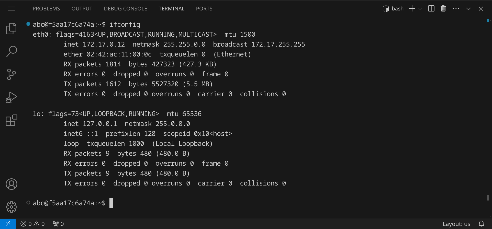
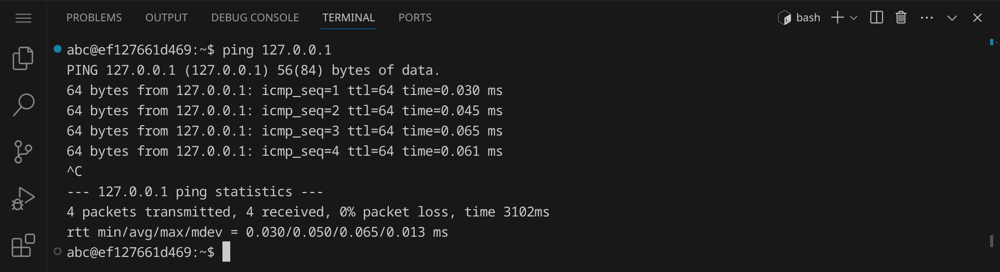
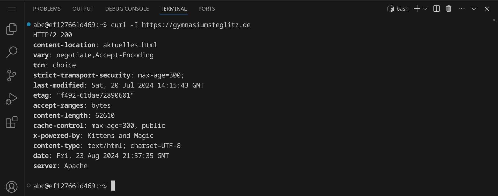
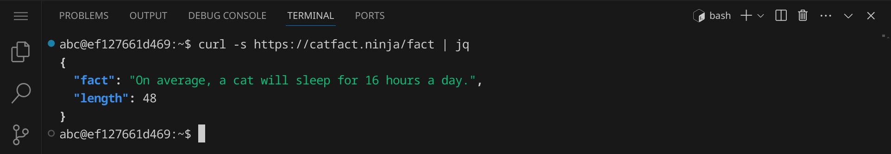
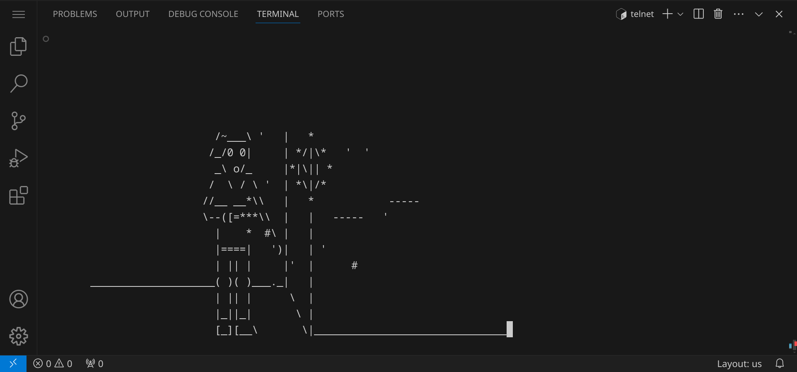
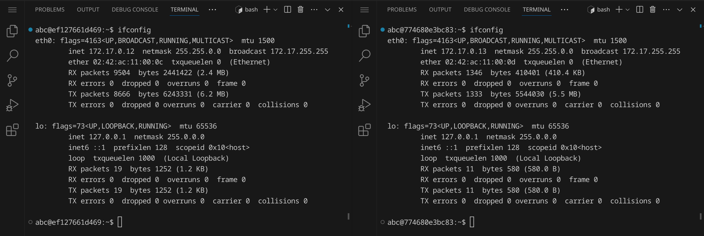
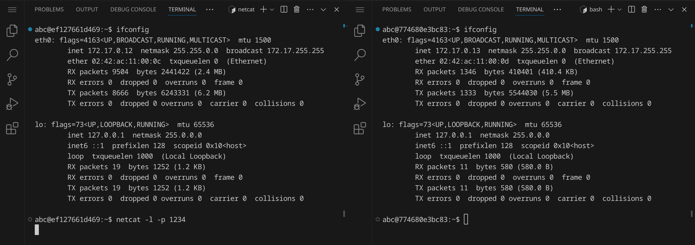
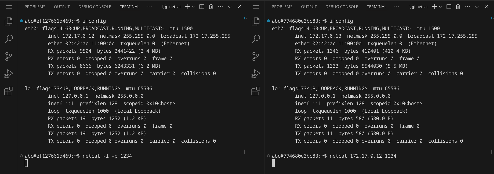

<div class='meta'>
image: tcpip.webp
</div>

# TCP/IP-Verbindungen

<p class='abstract'>
In diesem Kapitel lernst du, wie du mit Linux Netzwerkverbindungen aufbaust und mit anderen Rechnern kommunizierst. Du wirst lernen, wie du die IP-Adresse deines Computers herausfindest, wie du andere Rechner im Netzwerk anpingst, Dateien mit <code>wget</code> herunterlädst und mit <code>curl</code> APIs abfragst. Außerdem wirst du lernen, wie du mit <code>netcat</code> chatten kannst.
</p>

Stelle zuerst sicher, dass du keinen Ordner geöffnet hast. Um sicherzugehen, drücke einfach den Shortcut für »Ordner schließen«: <span class='key'>Strg</span><span class='key'>K</span> und dann <span class='key'>F</span>. Dein Workspace sollte jetzt ungefähr so aussehen:


Schließe die linken Seitenleiste, indem du <span class='key'>Strg</span><span class='key'>B</span> drückst, um mehr Platz zu haben.
Öffne als nächstes das Terminal, indem du den Shortcut <span class='key'>Strg</span><span class='key'>J</span> drückst. Dein Workspace sollte jetzt ungefähr so aussehen:


Du kannst das Terminal auch maximieren, indem du auf den Pfeil in der rechten oberen Ecke des Terminals klickst. Die linke Seitenleiste kannst du mit <span class='key'>Strg</span><span class='key'>B</span> ein- und ausblenden.

## Eigene IP-Adresse herausfinden

<div class='hint books'>
In diesem Abschnitt lernst du den Befehl <code>ifconfig</code> kennen.
</div>

Um die IP-Adresse deines Computers herauszufinden, gib einfach den Befehl `ifconfig` ein und drücke <span class='key'>Enter</span>:

```bash
ifconfig
```

Du solltest nun folgende Ausgabe sehen:



Zu sehen sind zwei Netzwerkadapter:

- `eth0` (»Ethernet«) mit der IP-Adresse `172.17.0.12`, der mit dem Internet verbunden ist
- `lo` (»Loopback«) mit der IP-Adresse `127.0.0.1`, der nur für lokale Verbindungen genutzt wird

<div class='hint'>
Deine IP-Adresse für <code>eth0</code> ist wahrscheinlich anders als die hier gezeigte. Das ist in Ordnung – es ist nur ein Beispiel. Merk dir deine IP-Adresse für dieses Tutorial oder schreib sie dir auf.
</div>

Du siehst außerdem die MAC-Adresse deines Netzwerkadapters (`ether`), die Broadcast-Adresse (`broadcast`)
und die Subnetzmaske (`netmask`) sowie die Gesamtmenge der bisher übertragenen Daten (`RX bytes` für »received« und `TX bytes` für »transmitted«).

Es kann sein, dass du statt eines `eth0`-Adapters einen anderen Netzwerkadapter hast, z.B. `enp0s3` oder auch `wlp2s0`, falls du über WLAN verbunden bist. Das ist in Ordnung – die Befehle funktionieren genauso.

## Andere Rechner anpingen

<div class='hint books'>
In diesem Abschnitt lernst du den Befehl <code>ping</code> kennen.
</div>

Um zu überprüfen, ob du andere Rechner  erreichen kannst, kannst du den
Befehl `ping` verwenden. Gib einfach `ping` gefolgt von der IP-Adresse eines anderen Rechners ein.
Wir verwenden in diesem Beispiele die IP-Adresse von Googles DNS-Server:

```bash
ping 8.8.8.8
```

Anschließend solltest du eine Ausgabe wie diese sehen:


Der Befehl `ping` sendet ICMP-Pakete an die angegebene IP-Adresse und wartet auf eine Antwort.
Wenn du eine Antwort bekommst, bedeutet das, dass du den anderen Rechner erreichen kannst.
Die Pakete werden im Abstand von einer Sekunde gesendet, bis du den Befehl mit
<span class='key'>Strg</span><span class='key'>C</span> abbrichst.

Die Angabe, die du unter »time« siehst, ist die Zeit in Millisekunden, die das Paket benötigt hat, um zum Ziel zu gelangen und zurück.
Umso kleiner die Zeit, desto besser ist die Verbindung: im Bild oben beträgt die Zeit ca. 5,3 ms.

Wenn du deinen eigenen Rechner anpingst, sollte die »Roundtrip Time« sehr gering sein, da die Pakete nicht das lokale Netzwerk verlassen müssen:

```bash
ping 127.0.0.1
```

Wie du siehst, ist die »Roundtrip Time« mit ca. 0,05 ms sehr viel kleiner:



Wenn wir hingegen einen Server anpingen, der etwas weiter entfernt ist, z.B. einen Server in Peru, dann ist die »Roundtrip Time« etwas höher:

```bash
ping rubiomonocoat.pe
```

Die Roundtrip Time beträgt jetzt ca. 14,5 ms:


<div class='hint'>
Statt einer IP-Adresse kannst du auch eine Domain, z.B. <code>google.com</code> oder <code>rubiomonocoat.pe</code>, angeben.
Die Domain wird dann mit Hilfe eines DNS-Servers in eine IP-Adresse aufgelöst.
</div>

## Den Pfad von IP-Paketen verfolgen

<div class='hint books'>
In diesem Abschnitt lernst du den Befehl <code>traceroute</code> kennen.
</div>

Um den Pfad zu einem anderen Rechner im Netzwerk zu verfolgen, kannst du den Befehl `traceroute` verwenden.
Gib einfach `traceroute` gefolgt von der IP-Adresse oder Domain des anderen Rechners ein:

```bash
traceroute -q 1 8.8.8.8
```

<div class='hint'>
Wir haben hier noch den Parameter <code>-q 1</code> hinzugefügt, um nur ein Paket pro Hop zu senden und damit die Ausgabe etwas übersichtlicher zu machen.
</div>

Anschließend solltest du eine Ausgabe wie diese sehen:


Um `traceroute` zu verstehen, ist es wichtig zu wissen, dass jedes IP-Paket eine sogenannte »Time To Live« (TTL) hat. Diese TTL gibt an,
wie viele Hops von einem zum nächsten Rechner maximal durchlaufen werden dürfen, bevor das Paket verworfen wird.

`traceroute` funktioniert, indem es zuerst ein Paket mit TTL 1 an den Zielrechner sendet.
Das Paket wird wegen der geringen TTL beim ersten Router verworfen, der dann eine Fehlermeldung
zurücksendet. `traceroute` weiß nun, dass der erste Router auf dem Weg zum Zielrechner ist
und gibt seine IP-Adresse und ggfs. den Hostnamen aus.
Anschließend erhöht `traceroute` die TTL auf 2 und sendet das Paket erneut.
Dieses Mal wird das Paket den ersten Router passieren und beim zweiten Router verworfen.
`traceroute` wiederholt diesen Vorgang, bis das Paket den Zielrechner erreicht.

Ein Stern `*` in der Ausgabe bedeutet, dass der Router das Paket verworfen hat, ohne eine Fehlermeldung zurückzusenden, weshalb hier keine IP-Adresse angezeigt werden kann.
Eine ausführlichere Erklärung findest du in diesem [Blogpost](https://blog.davidvarghese.dev/posts/traceroute-explained/) von David Varghese.

## Dateien herunterladen

<div class='hint books'>
In diesem Abschnitt lernst du den Befehl <code>wget</code> kennen.
</div>

Um Dateien aus dem Internet herunterzuladen, kannst du den Befehl `wget` verwenden.
Gib einfach `wget` gefolgt von der URL der Datei ein, die du herunterladen möchtest:

```bash
wget https://github.com/begilbert-sys/2048-in-C/raw/main/main.c
```

Du solltest sehen, wie die Datei `main.c` heruntergeladen wird:


Du solltest jetzt eine Datei `main.c` in deinem aktuellen Verzeichnis haben:


Es handelt sich um ein Mini-Spiel, das in der [Programmiersprache C](/c) programmiert worden ist. Du kannst es mit dem Befehl `gcc` kompilieren und anschließend ausführen.

```bash
gcc main.c -o 2048 -lncurses -lm
```

<div class='hint'>
Das Spiel benötigt die Bibliotheken <code>ncurses</code> und <code>math</code>, weshalb wir dem Compiler mit den Option <code>-lncurses</code> und <code>-lm</code> mitteilen, dass er diese Bibliotheken einbinden soll.
</div>


Das Spiel ist jetzt kompiliert und kann mit dem Befehl `./2048` ausgeführt werden:

```bash
./2048
```


Du kannst das Spiel mit den Pfeiltasten steuern und mit <span class='key'>Strg</span><span class='key'>C</span> beenden.

## Mit APIs interagieren

<div class='hint books'>
In diesem Abschnitt lernst du den Befehl <code>curl</code> kennen.
</div>

Du kannst auch Dateien herunterladen, indem du den Befehl `curl` verwendest. Der Unterschied zwischen `wget` und `curl` ist, dass `curl` standardmäßig den Inhalt der Datei im Terminal ausgibt, während `wget` die Datei speichert. `curl` eignet sich auch gut, um mit Webseiten und APIs zu kommunizieren. Gib den folgenden Befehl ein, um eine Webseite Datei mit `curl` herunterzuladen, wie es auch ein Webbrowser tun würde:

```bash
curl https://gymnasiumsteglitz.de | less
```

Verwende die Pfeiltasten, um durch die Webseite zu scrollen, und drücke <span class='key'>Q</span>, um `less` zu beenden.


Du kannst `curl` auch verwenden, um dir die HTTP-Header anzuschauen, die ein Webserver zurücksendet:

```bash
curl -I https://gymnasiumsteglitz.de
```



`curl` ist ein sehr mächtiges Werkzeug, um mit Webseiten und APIs zu kommunizieren. Ein Beispiel für eine API ist die »Cat Facts« API, die dir zufällige Fakten über Katzen zurückgibt:

```bash
curl https://catfact.ninja/fact
```

Die Ausgabe ist etwas schwer zu lesen:


Die Antwort ist im JSON-Format formatiert. Dieses Format einigt sich hervorragend, um es in einem Programm oder Skript zu verarbeiten. Du kannst die Ausgabe auch mit `jq` formatieren, einem Werkzeug, das JSON-Daten in einer schönen und übersichtlichen Form ausgibt:

```bash
curl -s https://catfact.ninja/fact | jq
```

<div class='hint'>
Wir haben hier noch die Option <code>-s</code an <code>curl</code> übergeben, um die Fortschrittsanzeige zu deaktivieren.
</div>

Die Ausgabe ist jetzt viel übersichtlicher:



Du kannst die Abfrage beliebig oft wiederholen und solltest jedesmal einen zufälligen, neuen Fakt über Katzen erhalten.

Es gibt eine Vielzahl von APIs, die du mit `curl` abfragen kannst. Manche davon sind frei zugänglich, aber einige benötigen einen API-Schlüssel. Die Dokumentation der API sollte dir sagen, wie du den Schlüssel erhältst und wie du ihn in deinen Abfragen verwendest. Jemand hat sich die Mühe gemacht und eine Liste von [Public APIs](https://github.com/public-apis/public-apis) zusammengestellt, die du durchsuchen kannst.

## ASCII-Kino

<div class='hint books'>
In diesem Abschnitt lernst du den Befehl <code>telnet</code> kennen, den du aber gar keinen Fall verwenden solltest, um Verbindungen zu anderen Servern aufzubauen. Wir verwenden ihn hier nur, um die ASCII-Version von Star Wars zu schauen.
</div>


Früher gab es den Befehl `telnet`, um Verbindungen zu anderen Servern aufzubauen. Dieser Befehl ist jedoch unsicher, da die Verbindung unverschlüsselt ist und Passwörter im Klartext übertragen werden. Wir verwenden ihn heutzutage nur noch für einen einzigen Zweck: um die ASCII-Version von Star Wars zu schauen. Gib einfach den folgenden Befehl ein:

```bash
telnet towel.blinkenlights.nl
```

Du kannst jetzt die ASCII-Version von Star Wars sehen:




Da `telnet` etwas umständlich zu beenden ist, drücke einfach auf die Mülltonne in der rechten oberen Ecke des Terminals, um das Terminal zu schließen und anschließend auf das Pluszeichen, um ein neues Terminal zu öffnen.

<div style='clear: both;'></div>

<!--

Um eine sichere Verbindung zu einem anderen Server aufzubauen, verwenden wir `ssh`. Dazu benötigen wir einen SSH-Schlüssel, den wir mit dem Befehl `ssh-keygen` erstellen können. Gib einfach den folgenden Befehl ein und drücke <span class='key'>Enter</span>, um den Schlüssel zu erstellen:

```bash
ssh-keygen
```

Bestätige alle Abfragen mit <span class='key'>Enter</span>:


<div class='hint'>
Im Normalfall solltest du den Schlüssel mit einer Passphrase schützen, damit niemand anderes Zugriff auf deinen Rechner erhält. In diesem Tutorial haben wir die Passphrase jedoch weggelassen, um die Eingabe zu vereinfachen.
</div>

Wechsle nun ins Verzeichnis `~/.ssh`, um dir die Schlüssel anzuschauen:

```bash
cd ~/.ssh
ls -l
```


Du solltest zwei Dateien sehen: `id_rsa` und `id_rsa.pub`. `id_rsa` ist dein privater Schlüssel, den du niemals weitergeben solltest. `id_rsa.pub` ist dein öffentlicher Schlüssel, den du auf anderen Servern hinterlegen kannst, um dich mit ihnen zu verbinden. Du kannst dir beide Dateien mit `cat` anschauen.


- ssh mit public key
- Chat mit `nc` -->

## Chatten mit `netcat`

<div class='hint handshake'>
In diesem Abschnitt lernst du den Befehl <code>netcat</code> kennen. Achtung: Partnerarbeit! Hierfür brauchst du eine zweite Person, die ebenfalls Zugriff auf einen eigenen Workspace hat.
</div>

Findet zunächst beide eure IP-Adressen heraus, indem ihr den Befehl `ifconfig` eingebt. Merkt euch eure IP-Adresse oder schreibt sie euch auf.



In diesem Beispiel hat der erste Rechner die IP-Adresse `172.17.0.12` und der zweite Rechner die IP-Adresse `172.17.0.13`.

Einer von euch beiden ist der Server und der andere der Client. Der Server öffnet einen Port, auf dem der Client sich verbinden kann. Der Client verbindet sich dann mit dem Server. Nehmen wir mal an, links ist der Server und rechts ist der Client. Der Server öffnet den Port 1234:

```bash
netcat -l -p 1234
```

Die Parameter `-l` und `-p 1234` bedeuten, dass `netcat` auf dem Port 1234 (`-p 1234`) lauschen soll (`-l` steht für »listen«). Der Server (links) wartet jetzt darauf, dass sich ein Client verbindet:



Anschließen verbindet sich der Client (rechts) mit dem Server:

```bash
netcat 172.17.0.12 1234
```

Der Client verbindet sich mit dem Server unter der angegeben IP-Adresse auf dem Port 1234.

<div class='hint'>
Falls sich der Client nicht mit dem Server verbinden kann, überprüft bitte, ob die IP-Adresse und der Port korrekt sind. Der Server muss den Port geöffnet haben, bevor sich der Client verbinden kann.
</div>



Sobald die Verbindung hergestellt ist, könnt ihr miteinander chatten! Ihr könnt nun Nachrichten hin- und herschicken. Wenn ihr fertig seid, könnt ihr die Verbindung beenden, indem ihr auf beiden Rechnern <span class='key'>Strg</span><span class='key'>C</span> drückt.

<div class='hint'>
Der Zweck von <code>netcat</code> ist es eigentlich nicht, zu chatten. Man kann es verwenden, um ohne Protokoll oder Verschlüsselung Daten zwischen zwei Rechnern zu übertragen.
</div>

## Zusammenfassung

In diesem Kapitel hast du gelernt, wie du mit Linux Netzwerkverbindungen aufbaust und mit anderen Rechnern kommunizierst. Du hast gelernt, wie du die IP-Adresse deines Computers herausfindest, wie du andere Rechner im Netzwerk anpingst, Dateien mit `wget` herunterlädst und mit `curl` APIs abfragst. Außerdem hast du gelernt, wie du mit `netcat` chatten kannst.